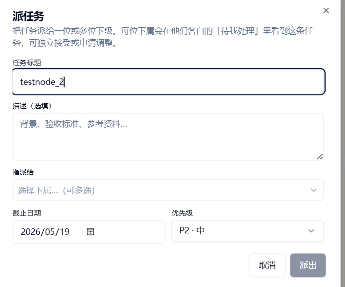
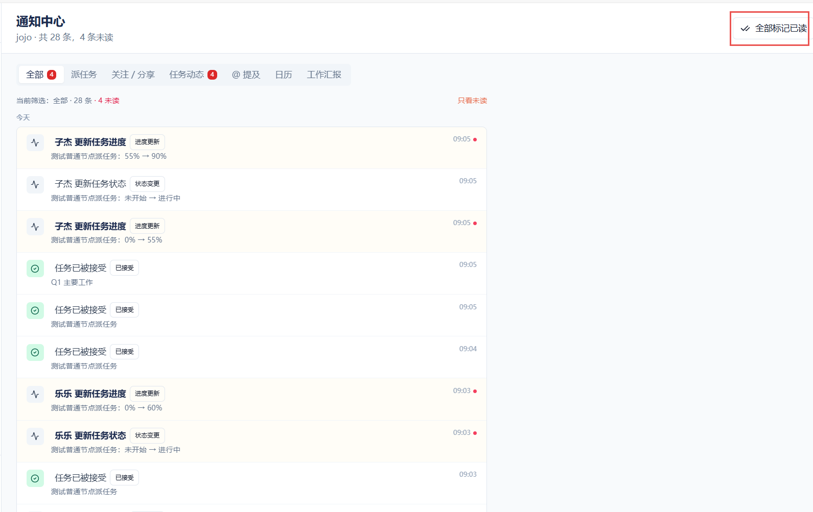

# Session: 消息通知仅打开团队视图并按时间倒序显示

**Created:** 2026-05-19 19:46:07

---

## Conversation

### 🤖 Assistant
*2026-05-20 10:08:38*

下级更新了派给他的任务，上级从消息通知中点击后会直接进入下级的导图，并且左侧菜单切换成了“我的导图”，给人一种我的导图被替换了的错觉，修复这个问题，点击消息通知应该仅打开团队视图即可，然后团队视图中的数据应该按时间倒序展示

### 🤖 Assistant
*2026-05-20 10:08:38*

*[step-start part]*

💭 **Reasoning:**

<details>
<summary>Click to expand reasoning</summary>

Let me start by exploring the codebase to understand the current structure and find relevant files related to notifications and mindmap views.

</details>

#### 🔧 Tool: task
**Status:** completed
**Title:** 探索通知和导图相关代码

**Input:**
```json
{
  "description": "探索通知和导图相关代码",
  "prompt": "请探索这个项目的代码结构，重点找以下内容：\n1. 消息通知相关的组件和API（notification相关）\n2. 导图视图相关的页面和组件（mindmap相关）\n3. 左侧菜单/导航相关的组件\n4. 团队视图相关的代码\n5. 任务相关的代码\n\n请返回：\n- 相关文件的路径和关键代码片段\n- 点击通知后的跳转逻辑在哪里\n- 左侧菜单的状态管理在哪里\n- 团队视图的数据获取和排序逻辑在哪里",
  "subagent_type": "explore"
}
```

**Output:**
```
task_id: ses_1bff125ceffevImFOL9vNcSSw5 (for resuming to continue this task if needed)

<task_result>
现在我已经全面了解了项目结构，整理完整报告如下。

---

## 项目代码结构探索报告

---

### 一、项目整体结构概览

```
src/
├── app/                       # Next.js 14 App Router 路由层（薄壳，仅做渲染代理）
│   ├── (app)/
│   │   ├── layout.tsx         # 所有内页共用 AppShell 布局
│   │   ├── mindmap/page.tsx
│   │   ├── team/page.tsx
│   │   ├── notifications/page.tsx
│   │   ├── inbox/page.tsx
│   │   └── ...
│   └── api/                   # Route Handler（后端 API）
├── pages/                     # 真实页面逻辑组件（重）
│   ├── MindMapPage.tsx        # 导图主页
│   ├── NotificationsPage.tsx  # 通知中心
│   ├── TeamPage.tsx           # 团队视图
│   └── InboxPage.tsx          # 待我处理
├── features/
│   ├── mindmap/               # 导图相关功能组件
│   ├── task/                  # 任务详情抽屉
│   ├── assignment/            # 派任务相关对话框
│   ├── sharing/               # 分享/关注功能
│   ├── mention/               # @ 提及组件
│   └── markers/               # 标记(Marker)功能
├── components/
│   ├── AppShell.tsx           # 左侧菜单 + 整体布局
│   └── ui/                    # shadcn 基础组件
├── store/
│   └── StoreProvider.tsx      # 全局状态管理（React Context）
└── lib/                       # 工具函数
    ├── notify.ts
    ├── mindmapResolve.ts
    ├── mindmapDrag.ts
    ├── mindmapFactory.ts
    └── taskPeer.ts
```

---

### 二、通知相关（Notification）

#### 核心文件
| 文件 | 作用 |
|---|---|
| `src/pages/NotificationsPage.tsx` | 通知中心页面（500行） |
| `src/lib/notify.ts` | 生成通知对象的工具函数 |
| `src/app/(app)/notifications/page.tsx` | App Router 薄壳，仅引用上面的页面组件 |

#### 通知类型定义（KIND_META，NotificationsPage.tsx L35-121）
共 **18 种** 通知类型：
- 派任务类：`assignment_received` / `assignment_accepted` / `assignment_negotiating` / `assignment_adjusted`
- 任务动态：`task_status_changed` / `task_blocked` / `task_progress_updated`
- 关注分享：`follow_request_received` / `follow_granted` / `follow_denied` / `node_shared`
- @ 提及：`mentioned_assign` / `mentioned_discuss`
- 日历同步：`calendar_synced` / `calendar_completion`
- 工作汇报：`report_submitted` / `report_shared`

#### 点击通知后的跳转逻辑（关键！）
**文件：** `src/pages/NotificationsPage.tsx` **L218-271**

```typescript
const handleClickNotification = (n: AppNotification) => {
  if (!n.readAt) markRead([n.id]);

  // 通用跳转到 /mindmap，携带目标节点 ID + 面板 tab
  const goMindmap = (tab: "details" | "markers" = "details") => {
    const params = new URLSearchParams();
    if (n.refNodeId) params.set("node", n.refNodeId);    // 节点 ID
    params.set("tab", tab);
    router.push(`/mindmap?${params.toString()}`);         // 跳转
  };

  // 不同类型走不同路由：
  if (n.kind === "follow_request_received") { router.push("/inbox"); return; }
  if (n.kind === "assignment_received" || n.kind === "assignment_negotiating") { router.push("/inbox"); return; }
  if (n.kind === "assignment_accepted" || n.kind === "assignment_adjusted") {
    const a = assignments.find((x) => x.id === n.refAssignmentId);
    if (a && a.assigneeId !== currentUserId) { router.push("/team"); return; }  // 我是派任务方 → 团队视图
    goMindmap();  // 我是被派方 → 我的导图
    return;
  }
  if (n.kind === "node_shared") { router.push("/team"); return; }
  // 其余所有类型（@ 提及、日历、任务动态等）→ 全部跳转到 /mindmap
  goMindmap();
};
```

**跳转规则汇总：**
| 通知类型 | 跳转目标 |
|---|---|
| 关注申请、待处理任务 | `/inbox` |
| 任务接受/调整（我是派出方） | `/team` |
| 任务接受/调整（我是被派方） | `/mindmap?node=<id>&tab=details` |
| 分享通知 | `/team` |
| @ 提及、日历、任务动态 | `/mindmap?node=<id>&tab=details` |

#### MindMapPage 接收跳转后的处理（MindMapPage.tsx L216-237）
```typescript
// 通知中心点击跳转过来：?node=<id>&tab=details|markers → 自动选中节点 + 打开右侧 dock
useEffect(() => {
  const nodeIdFromUrl = searchParams.get("node");
  const tabFromUrl = searchParams.get("tab") as RightDockTab | null;
  if (!nodeIdFromUrl) return;
  const target = nodes.find((n) => n.id === nodeIdFromUrl && !n.isDeleted);
  if (!target) return;
  // 如果节点不在当前 mindmap，自动切换到对应图
  if (target.mindmapId !== activeMindmapId) {
    setActiveMindmapId(target.mindmapId);
  }
  setSelectedNodeId(target.id);
  setDockTab(tabFromUrl ?? "details");
  setDockOpen(true);
  // 用完即清，刷新不重复选
  router.replace(`/mindmap?...`);
}, [searchParams, nodes, ...]);
```

---

### 三、导图视图相关（MindMap）

#### 核心文件
| 文件 | 作用 |
|---|---|
| `src/pages/MindMapPage.tsx` | 导图主页（804行），状态编排中枢 |
| `src/features/mindmap/MindMapCanvas.tsx` | 导图画布，节点渲染与交互 |
| `src/features/mindmap/MindMapNode.tsx` | 单个节点组件 |
| `src/features/mindmap/MindMapEdges.tsx` | 连线/边渲染 |
| `src/features/mindmap/MindMapOutline.tsx` | 大纲模式视图 |
| `src/features/mindmap/MindMapGantt.tsx` | 甘特图视图 |
| `src/features/mindmap/MindMapToolbar.tsx` | 工具栏（视图切换、结构、主题） |
| `src/features/mindmap/NodeContextMenu.tsx` | 节点右键菜单 |
| `src/features/mindmap/NodeFormatPanel.tsx` | 节点格式面板 |
| `src/features/mindmap/NewMindMapDialog.tsx` | 新建导图对话框 |
| `src/lib/mindmapFactory.ts` | 导图模板创建工厂 |
| `src/lib/mindmapDrag.ts` | 拖拽逻辑 |
| `src/lib/mindmapResolve.ts` | 导图标题解析工具 |

**三种视图模式：** `map`（画布）/ `outline`（大纲）/ `gantt`（甘特图），由 `viewMode` state 控制切换。

---

### 四、左侧菜单/导航

#### 核心文件
**`src/components/AppShell.tsx`**（235行，完整的侧边栏实现）

#### 导航项配置（AppShell.tsx L33-42）
```typescript
const navItems: NavItem[] = [
  { to: "/mindmap",            label: "我的导图",   icon: GitBranch },
  { to: "/team",               label: "团队视图",   icon: UsersIcon, managerOnly: true },  // 仅管理者可见
  { to: "/inbox",              label: "待我处理",   icon: Inbox },
  { to: "/reports",            label: "工作汇报",   icon: FileBarChart2 },
  { to: "/notifications",      label: "通知中心",   icon: Bell },
  { to: "/settings",           label: "个人设置",   icon: Settings },
  { to: "/admin/users",        label: "用户管理",   icon: UserCog,    adminOnly: true },   // 仅 admin
  { to: "/admin/departments",  label: "部门管理",   icon: FolderTree, adminOnly: true },
];
```

#### 左侧菜单的状态管理（AppShell.tsx L51-110）
菜单本身**没有展开/折叠 state**，是固定宽度（`w-60`）侧边栏。状态来自全局 `useStore()`：

```typescript
// 来源：src/store/StoreProvider.tsx（React Context）
const {
  currentUser, currentUserId, users, relations,
  notifications,   // 计算通知红点数量
  assignments,     // 计算 inbox 红点数量
  follows,         // 计算 inbox 红点数量
  setCurrentUserId, workspaceHydrated,
} = useStore();

// 徽章数量计算
const inboxCount = pendingAssignments + negotiatingForMe + pendingFollows;  // L105
const unreadCount = notifications.filter(n => n.recipientId === currentUserId && !n.readAt).length;  // L107-110
```

权限控制（L168-171）：
- `managerOnly`：通过 `isManager(currentUserId, relations)` 或 `users.some(u => u.managerId === currentUserId)` 双重兜底判断
- `adminOnly`：通过 `currentUser.isAdmin` 数据库权限字段判断

---

### 五、团队视图

#### 核心文件
**`src/pages/TeamPage.tsx`**（614行）

#### 成员列表数据获取（TeamPage.tsx L89-112）
```typescript
const allMembers = useMemo(() => {
  // 双路来源合并，兜底历史数据中 OrgRelation 缺失的情况
  const fromRelations = getAllSolidDescendants(currentUserId, relations);  // OrgRelation 实线链
  const fromManagerId = getAllDescendantsByManagerId(currentUserId, users); // User.managerId 链
  const merged = Array.from(new Set([...fromRelations, ...fromManagerId])); // 去重

  // 直接下属判断（影响 tab 上是否显示"间接"标签）
  const directIds = new Set(getDirectReports(currentUserId, relations).map(r => r.subordinateId));
  for (const u of users) {
    if (u.managerId === currentUserId) directIds.add(u.id);
  }
  return merged.map(...).filter(...);
}, [currentUserId, relations, users]);
```

#### 任务数据筛选与排序（TeamPage.tsx L123-215）
```typescript
const relevantTasks: RelevantTask[] = useMemo(() => {
  // 1. 找到该成员名下的所有导图
  const memberMapIds = mindmaps.filter(m => m.ownerId === activeMember.id).map(m => m.id);
  
  // 2. 筛选：节点属于该导图 + 未删除 + 有 task 字段 + canRead 权限通过
  const memberTaskNodes = nodes.filter(n =>
    memberMapIds.has(n.mindmapId) && !n.isDeleted && n.task && canRead(currentUserId, n, ctx)
  );

  // 3. 标记每个任务的可见来源（派给的 / 分享 / 关注）
  // 4. 找到所属骨架节点（向上遍历到 month/quarter skeleton）
  // 5. 关联最新活动日志

  // 排序：先按 bucket 时间值升序，再按 deadline 升序
  return result.sort((a, b) => {
    const av = a.bucket?.timeBucketValue ?? "";
    const bv = b.bucket?.timeBucketValue ?? "";
    if (av !== bv) return av.localeCompare(bv);                    // 先按季度/月份桶
    return (a.node.task?.deadline ?? "").localeCompare(b.node.task?.deadline ?? ""); // 再按截止日期
  });
}, [activeMember, currentUserId, mindmaps, nodes, relations, assignments, follows, shares, logs]);
```

**分组逻辑：** 按 `bucket`（季度/月份骨架节点）分组，展示为分区块的任务卡片列表。

---

### 六、任务相关

#### 核心文件
| 文件 | 作用 |
|---|---|
| `src/features/task/NodeDetailDrawer.tsx` | 任务详情右侧抽屉（1897行，核心重组件） |
| `src/features/assignment/AssignDialog.tsx` | 派任务对话框 |
| `src/features/assignment/NegotiateDialog.tsx` | 协商调整对话框 |
| `src/lib/taskPeer.ts` | 镜像节点进度同步工具 |
| `src/lib/notify.ts` | 生成任务相关通知的工具 |

`NodeDetailDrawer` 包含四个 tab（`RightDockTab`）：
- `details`：任务状态、优先级、截止日期、进度、讨论日志
- `markers`：XMind 风格标记面板
- `style`：节点格式（形状/颜色/字体）
- `assigned-out`：仅管理者可见，查看所有派出任务

---

### 七、全局状态管理

**`src/store/StoreProvider.tsx`**（714行，React Context 实现）

所有业务数据（节点、导图、通知、任务、关注、分享等）都存于这一个全局 Store，通过 `useStore()` Hook 消费。

**双模式：**
- **Mock 模式**（`NEXT_PUBLIC_USE_API=false`）：数据持久化到 `localStorage`，key 前缀 `mindmap-prototype-v6:`
- **API 模式**（`NEXT_PUBLIC_USE_API=true`）：启动时 `fetchWorkspace()` 拉取全量快照，变更后 **1200ms 防抖 PUT** 回服务端，服务端返回 `idMap` 后替换临时 ID
</task_result>
```

*[step-finish part]*

### 🤖 Assistant
*2026-05-20 10:08:38*

*[step-start part]*

💭 **Reasoning:**

<details>
<summary>Click to expand reasoning</summary>

Now I have a good understanding of the codebase. Let me look at the specific files in detail to understand what needs to be fixed:

1. The notification click handler in `NotificationsPage.tsx` - when a subordinate updates a task, the superior clicks the notification and gets redirected to `/mindmap` with a node ID, which causes the left menu to show "我的导图" as active. The fix should redirect to `/team` instead.

2. The TeamPage needs to sort data in reverse chronological order (时间倒序).

Let me read the relevant files to understand the exact code I need to modify.

</details>

#### 🔧 Tool: read
**Status:** completed
**Title:** home/heyue/mindmap-docs-and-frontend/src/pages/NotificationsPage.tsx

**Input:**
```json
{
  "filePath": "/home/heyue/mindmap-docs-and-frontend/src/pages/NotificationsPage.tsx",
  "offset": 200,
  "limit": 100
}
```

**Output:**
```
<path>/home/heyue/mindmap-docs-and-frontend/src/pages/NotificationsPage.tsx</path>
<type>file</type>
<content>
200:     .filter((n) => (showRead ? true : !n.readAt));
201: 
202:   const unreadInFilter = filtered.filter((n) => !n.readAt).length;
203:   const totalUnread = myNotifs.filter((n) => !n.readAt).length;
204: 
205:   const grouped = useMemo(() => groupByDay(filtered), [filtered]);
206: 
207:   const markRead = (ids: string[]) => {
208:     if (ids.length === 0) return;
209:     const set = new Set(ids);
210:     const nowISO = new Date().toISOString();
211:     setNotifications((prev) =>
212:       prev.map((n) =>
213:         set.has(n.id) && !n.readAt ? { ...n, readAt: nowISO } : n,
214:       ),
215:     );
216:   };
217: 
218:   const handleClickNotification = (n: AppNotification) => {
219:     if (!n.readAt) markRead([n.id]);
220: 
221:     // 跳转到 /mindmap 时，把目标 node id 带上，让 MindMapPage 自动选中并打开详情
222:     const goMindmap = (tab: "details" | "markers" = "details") => {
223:       const params = new URLSearchParams();
224:       if (n.refNodeId) params.set("node", n.refNodeId);
225:       params.set("tab", tab);
226:       router.push(`/mindmap?${params.toString()}`);
227:     };
228: 
229:     if (n.kind === "follow_request_received") {
230:       router.push("/inbox");
231:       return;
232:     }
233:     if (
234:       n.kind === "assignment_received" ||
235:       n.kind === "assignment_negotiating"
236:     ) {
237:       router.push("/inbox");
238:       return;
239:     }
240:     if (n.kind === "assignment_accepted" || n.kind === "assignment_adjusted") {
241:       // 我作为 assigner：去团队视图
242:       const a = assignments.find((x) => x.id === n.refAssignmentId);
243:       if (a && a.assigneeId !== currentUserId) {
244:         router.push("/team");
245:         return;
246:       }
247:       goMindmap();
248:       return;
249:     }
250:     if (n.kind === "follow_granted" || n.kind === "follow_denied") {
251:       router.push("/inbox");
252:       return;
253:     }
254:     if (n.kind === "node_shared") {
255:       router.push("/team");
256:       return;
257:     }
258:     if (
259:       n.kind === "mentioned_assign" ||
260:       n.kind === "mentioned_discuss" ||
261:       n.kind === "calendar_synced" ||
262:       n.kind === "calendar_completion" ||
263:       n.kind === "task_status_changed" ||
264:       n.kind === "task_progress_updated" ||
265:       n.kind === "task_blocked"
266:     ) {
267:       goMindmap();
268:       return;
269:     }
270:     goMindmap();
271:   };
272: 
273:   return (
274:     <>
275:       <PageHeader
276:         title="通知中心"
277:         description={`${currentUser.name} · 共 ${myNotifs.length} 条，${totalUnread} 条未读`}
278:         right={
279:           totalUnread > 0 ? (
280:             <Button
281:               size="sm"
282:               variant="outline"
283:               onClick={() => markRead(myNotifs.filter((n) => !n.readAt).map((n) => n.id))}
284:             >
285:               <CheckCheck className="h-3.5 w-3.5" />
286:               全部标记已读
287:             </Button>
288:           ) : null
289:         }
290:       />
291:       <div className="flex-1 min-h-0 overflow-y-auto px-6 py-4">
292:         <div className="max-w-3xl">
293:           <Tabs value={filterId} onValueChange={setFilterId} className="mb-4">
294:             <TabsList>
295:               {FILTER_GROUPS.map((g) => {
296:                 const count = myNotifs.filter(
297:                   (n) => g.match(n.kind) && !n.readAt,
298:                 ).length;
299:                 return (

(Showing lines 200-299 of 500. Use offset=300 to continue.)
</content>
```

#### 🔧 Tool: read
**Status:** completed
**Title:** home/heyue/mindmap-docs-and-frontend/src/pages/TeamPage.tsx

**Input:**
```json
{
  "filePath": "/home/heyue/mindmap-docs-and-frontend/src/pages/TeamPage.tsx",
  "offset": 120,
  "limit": 120
}
```

**Output:**
```
<path>/home/heyue/mindmap-docs-and-frontend/src/pages/TeamPage.tsx</path>
<type>file</type>
<content>
120:   }, [activeMemberId, allMembers, users]);
121: 
122:   // 该成员对当前用户可见的任务集合
123:   const relevantTasks: RelevantTask[] = useMemo(() => {
124:     if (!activeMember || !currentUserId) return [];
125:     const memberMapIds = new Set(
126:       mindmaps.filter((m) => m.ownerId === activeMember.id).map((m) => m.id),
127:     );
128:     if (memberMapIds.size === 0) return [];
129: 
130:     const ctx = { mindmaps, nodes, relations, assignments, follows, shares };
131:     const memberTaskNodes = nodes.filter(
132:       (n) =>
133:         memberMapIds.has(n.mindmapId) &&
134:         !n.isDeleted &&
135:         n.task &&
136:         canRead(currentUserId, n, ctx),
137:     );
138: 
139:     const result: RelevantTask[] = memberTaskNodes.map((n) => {
140:       const sources: SourceTag[] = [];
141:       // 是否派给的
142:       if (
143:         assignments.some(
144:           (a) =>
145:             a.assignerId === currentUserId &&
146:             a.state === "accepted" &&
147:             a.resultNodeId === n.id,
148:         )
149:       ) {
150:         sources.push("assigned");
151:       }
152:       // 是否分享给我的
153:       if (
154:         shares.some(
155:           (s) =>
156:             !s.revokedAt &&
157:             s.audienceId === currentUserId &&
158:             s.nodeId === n.id,
159:         )
160:       ) {
161:         sources.push("shared");
162:       }
163:       // 是否通过关注获得（任意已授权的关注，且该节点是 target 或子树中）
164:       if (
165:         follows.some(
166:           (f) =>
167:             f.granteeId === currentUserId &&
168:             f.state === "granted" &&
169:             (f.targetNodeId === n.id ||
170:               (f.scope === "subtree" &&
171:                 isAncestor(f.targetNodeId, n.id, nodes))),
172:         )
173:       ) {
174:         sources.push("follow");
175:       }
176:       // 没有显式来源但 canRead 通过——可能是中间层透传
177:       if (sources.length === 0) sources.push("assigned");
178: 
179:       // 找到所属骨架（向上到第一个 skeleton 节点）
180:       const bucket = findBucket(n, nodes);
181: 
182:       // 最近一次日志
183:       const lastLog = logs
184:         .filter((l) => l.nodeId === n.id)
185:         .sort((a, b) => b.createdAt.localeCompare(a.createdAt))[0];
186: 
187:       return {
188:         node: n,
189:         bucket,
190:         source: sources,
191:         lastUpdateAt: lastLog?.createdAt,
192:         lastUpdateText: lastLog?.contentText,
193:       };
194:     });
195: 
196:     // 按 bucket 时间升序、再按 deadline 升序
197:     return result.sort((a, b) => {
198:       const av = a.bucket?.timeBucketValue ?? "";
199:       const bv = b.bucket?.timeBucketValue ?? "";
200:       if (av !== bv) return av.localeCompare(bv);
201:       return (a.node.task?.deadline ?? "").localeCompare(
202:         b.node.task?.deadline ?? "",
203:       );
204:     });
205:   }, [
206:     activeMember,
207:     currentUserId,
208:     mindmaps,
209:     nodes,
210:     relations,
211:     assignments,
212:     follows,
213:     shares,
214:     logs,
215:   ]);
216: 
217:   // 按 bucket 分组
218:   const groupedTasks = useMemo(() => {
219:     const groups = new Map<string, { bucket: Node | null; items: RelevantTask[] }>();
220:     for (const t of relevantTasks) {
221:       const key = t.bucket?.id ?? "ungrouped";
222:       if (!groups.has(key)) groups.set(key, { bucket: t.bucket, items: [] });
223:       groups.get(key)!.items.push(t);
224:     }
225:     return Array.from(groups.values());
226:   }, [relevantTasks]);
227: 
228:   // 该成员相关任务的活动流
229:   const activityFeed = useMemo(() => {
230:     if (!activeMember) return [];
231:     const taskIds = new Set(relevantTasks.map((t) => t.node.id));
232:     return logs
233:       .filter((l) => taskIds.has(l.nodeId))
234:       .sort((a, b) => b.createdAt.localeCompare(a.createdAt))
235:       .slice(0, 30);
236:   }, [logs, relevantTasks, activeMember]);
237: 
238:   if (!currentUser || !currentUserId) return null;
239: 

(Showing lines 120-239 of 614. Use offset=240 to continue.)
</content>
```

*[step-finish part]*

### 🤖 Assistant
*2026-05-20 10:08:38*

*[step-start part]*

💭 **Reasoning:**

<details>
<summary>Click to expand reasoning</summary>

Now I understand the issues:

1. **通知跳转问题**: When a subordinate updates a task (task_status_changed, task_progress_updated, task_blocked), the superior clicks the notification and gets redirected to `/mindmap?node=<id>&tab=details`. This causes:
   - The left menu highlights "我的导图" (because the current path is `/mindmap`)
   - The mindmap page switches to the subordinate's mindmap (because of the node ID parameter)
   
   The fix: For these task-related notifications (task_status_changed, task_progress_updated, task_blocked), when the current user is NOT the node owner (i.e., they're a manager viewing a subordinate's task), they should be redirected to `/team` instead.
   
2. **Team view sorting**: The tasks need to be displayed in reverse chronological order by last update time (lastUpdateAt) in descending order, rather than the current sorting by bucket time and deadline.

3. **Notification routing**: Looking at the issue more carefully, it seems all task-related notifications—like `task_status_changed`, `task_progress_updated`, and `task_blocked`—should redirect to the team view instead of the mindmap. Though I should double-check whether `mentioned_assign` and `mentioned_discuss` should behave differently if the user is the node owner, or if everything should just go to `/team`. to `/team` instead of `/mindmap`. So the simplest approach is: for these three notification types, always redirect to `/team` rather than checking node ownership.

For the team view sorting issue, the user wants reverse chronological order—most recently updated tasks first. That means sorting by `lastUpdateAt` descending, or possibly by `timeBucketValue` descending combined with `deadline` descending, depending on how the current sorting works. Modifying the sort logic... Now I'll implement both fixes to handle the sorting correctly.

</details>

现在我了解了问题所在，让我制定修复计划：

#### 🔧 Tool: todowrite
**Status:** completed
**Title:** 3 todos

**Input:**
```json
{
  "todos": [
    {
      "content": "修复通知跳转：task_status_changed/task_progress_updated/task_blocked 等任务更新通知应跳转到 /team 而非 /mindmap",
      "status": "pending",
      "priority": "high"
    },
    {
      "content": "修复团队视图排序：数据按最近更新时间倒序展示",
      "status": "pending",
      "priority": "high"
    },
    {
      "content": "更新 SDD 和 CHANGELOG 文档",
      "status": "pending",
      "priority": "medium"
    }
  ]
}
```

**Output:**
```
[
  {
    "content": "修复通知跳转：task_status_changed/task_progress_updated/task_blocked 等任务更新通知应跳转到 /team 而非 /mindmap",
    "status": "pending",
    "priority": "high"
  },
  {
    "content": "修复团队视图排序：数据按最近更新时间倒序展示",
    "status": "pending",
    "priority": "high"
  },
  {
    "content": "更新 SDD 和 CHANGELOG 文档",
    "status": "pending",
    "priority": "medium"
  }
]
```

*[step-finish part]*

### 🤖 Assistant
*2026-05-20 10:08:38*

*[step-start part]*

#### 🔧 Tool: todowrite
**Status:** completed
**Title:** 3 todos

**Input:**
```json
{
  "todos": [
    {
      "content": "修复通知跳转：task_status_changed/task_progress_updated/task_blocked 等任务更新通知应跳转到 /team 而非 /mindmap",
      "priority": "high",
      "status": "in_progress"
    },
    {
      "content": "修复团队视图排序：数据按最近更新时间倒序展示",
      "priority": "high",
      "status": "pending"
    },
    {
      "content": "更新 SDD 和 CHANGELOG 文档",
      "priority": "medium",
      "status": "pending"
    }
  ]
}
```

**Output:**
```
[
  {
    "content": "修复通知跳转：task_status_changed/task_progress_updated/task_blocked 等任务更新通知应跳转到 /team 而非 /mindmap",
    "status": "in_progress",
    "priority": "high"
  },
  {
    "content": "修复团队视图排序：数据按最近更新时间倒序展示",
    "status": "pending",
    "priority": "high"
  },
  {
    "content": "更新 SDD 和 CHANGELOG 文档",
    "status": "pending",
    "priority": "medium"
  }
]
```

*[step-finish part]*

### 🤖 Assistant
*2026-05-20 10:08:38*

*[step-start part]*

**修复1：通知跳转逻辑**

将 `task_status_changed`、`task_progress_updated`、`task_blocked` 这类任务动态通知从跳转 `/mindmap` 改为跳转 `/team`，因为这类通知的接收者（上级）是以旁观者身份查看下级任务：

#### 🔧 Tool: edit
**Status:** completed
**Title:** home/heyue/mindmap-docs-and-frontend/src/pages/NotificationsPage.tsx

**Input:**
```json
{
  "filePath": "/home/heyue/mindmap-docs-and-frontend/src/pages/NotificationsPage.tsx",
  "oldString": "    if (\n      n.kind === \"mentioned_assign\" ||\n      n.kind === \"mentioned_discuss\" ||\n      n.kind === \"calendar_synced\" ||\n      n.kind === \"calendar_completion\" ||\n      n.kind === \"task_status_changed\" ||\n      n.kind === \"task_progress_updated\" ||\n      n.kind === \"task_blocked\"\n    ) {\n      goMindmap();\n      return;\n    }",
  "newString": "    if (\n      n.kind === \"task_status_changed\" ||\n      n.kind === \"task_progress_updated\" ||\n      n.kind === \"task_blocked\"\n    ) {\n      // 下级任务动态通知：上级以旁观者身份查看，跳转团队视图而非进入下级导图\n      router.push(\"/team\");\n      return;\n    }\n    if (\n      n.kind === \"mentioned_assign\" ||\n      n.kind === \"mentioned_discuss\" ||\n      n.kind === \"calendar_synced\" ||\n      n.kind === \"calendar_completion\"\n    ) {\n      goMindmap();\n      return;\n    }"
}
```

**Output:**
```
Edit applied successfully.
```

*[step-finish part]*

### 🤖 Assistant
*2026-05-20 10:08:38*

*[step-start part]*

#### 🔧 Tool: todowrite
**Status:** completed
**Title:** 2 todos

**Input:**
```json
{
  "todos": [
    {
      "content": "修复通知跳转：task_status_changed/task_progress_updated/task_blocked 等任务更新通知应跳转到 /team 而非 /mindmap",
      "priority": "high",
      "status": "completed"
    },
    {
      "content": "修复团队视图排序：数据按最近更新时间倒序展示",
      "priority": "high",
      "status": "in_progress"
    },
    {
      "content": "更新 SDD 和 CHANGELOG 文档",
      "priority": "medium",
      "status": "pending"
    }
  ]
}
```

**Output:**
```
[
  {
    "content": "修复通知跳转：task_status_changed/task_progress_updated/task_blocked 等任务更新通知应跳转到 /team 而非 /mindmap",
    "status": "completed",
    "priority": "high"
  },
  {
    "content": "修复团队视图排序：数据按最近更新时间倒序展示",
    "status": "in_progress",
    "priority": "high"
  },
  {
    "content": "更新 SDD 和 CHANGELOG 文档",
    "status": "pending",
    "priority": "medium"
  }
]
```

*[step-finish part]*

### 🤖 Assistant
*2026-05-20 10:08:38*

*[step-start part]*

**修复2：团队视图排序改为时间倒序**

将当前的「按桶时间升序 + 截止日期升序」改为「按最近更新时间倒序」，让刚被下级更新的任务排在最前面：

#### 🔧 Tool: edit
**Status:** completed
**Title:** home/heyue/mindmap-docs-and-frontend/src/pages/TeamPage.tsx

**Input:**
```json
{
  "filePath": "/home/heyue/mindmap-docs-and-frontend/src/pages/TeamPage.tsx",
  "oldString": "    // 按 bucket 时间升序、再按 deadline 升序\n    return result.sort((a, b) => {\n      const av = a.bucket?.timeBucketValue ?? \"\";\n      const bv = b.bucket?.timeBucketValue ?? \"\";\n      if (av !== bv) return av.localeCompare(bv);\n      return (a.node.task?.deadline ?? \"\").localeCompare(\n        b.node.task?.deadline ?? \"\",\n      );\n    });",
  "newString": "    // 按最近更新时间倒序（最新动态排最前），无更新记录的按截止日期倒序兜底\n    return result.sort((a, b) => {\n      const at = a.lastUpdateAt ?? a.node.task?.deadline ?? \"\";\n      const bt = b.lastUpdateAt ?? b.node.task?.deadline ?? \"\";\n      return bt.localeCompare(at);\n    });"
}
```

**Output:**
```
Edit applied successfully.
```

*[step-finish part]*

### 🤖 Assistant
*2026-05-20 10:08:38*

*[step-start part]*

#### 🔧 Tool: todowrite
**Status:** completed
**Title:** 1 todos

**Input:**
```json
{
  "todos": [
    {
      "content": "修复通知跳转：task_status_changed/task_progress_updated/task_blocked 等任务更新通知应跳转到 /team 而非 /mindmap",
      "priority": "high",
      "status": "completed"
    },
    {
      "content": "修复团队视图排序：数据按最近更新时间倒序展示",
      "priority": "high",
      "status": "completed"
    },
    {
      "content": "更新 SDD 和 CHANGELOG 文档",
      "priority": "medium",
      "status": "in_progress"
    }
  ]
}
```

**Output:**
```
[
  {
    "content": "修复通知跳转：task_status_changed/task_progress_updated/task_blocked 等任务更新通知应跳转到 /team 而非 /mindmap",
    "status": "completed",
    "priority": "high"
  },
  {
    "content": "修复团队视图排序：数据按最近更新时间倒序展示",
    "status": "completed",
    "priority": "high"
  },
  {
    "content": "更新 SDD 和 CHANGELOG 文档",
    "status": "in_progress",
    "priority": "medium"
  }
]
```

*[step-finish part]*

### 🤖 Assistant
*2026-05-20 10:08:38*

*[step-start part]*

现在更新文档，先找相关模块的 SDD 文件：

#### 🔧 Tool: bash
**Status:** completed
**Title:** 列出SDD模块文件

**Input:**
```json
{
  "command": "ls /home/heyue/mindmap-docs-and-frontend/.specs/modules/",
  "description": "列出SDD模块文件"
}
```

**Output:**
```
M-01-auth.md
M-02-workspace.md
M-03-org.md
M-04-mindmap.md
M-05-assignment.md
M-06-reports.md
M-07-notifications.md
M-08-user-mgmt.md
M-09-dept-mgmt.md

```

*[step-finish part]*

### 🤖 Assistant
*2026-05-20 10:08:38*

*[step-start part]*

#### 🔧 Tool: bash
**Status:** completed
**Title:** 查找通知SDD中的跳转规则

**Input:**
```json
{
  "command": "grep -n \"跳转\\|task_status\\|task_progress\\|task_blocked\\|团队视图\\|排序\\|sort\\|倒序\" /home/heyue/mindmap-docs-and-frontend/.specs/modules/M-07-notifications.md | head -40",
  "description": "查找通知SDD中的跳转规则"
}
```

**Output:**
```
48:- 点击通知可跳转至对应页面（MindMapPage?node=xxx、InboxPage 等）
52:- `src/pages/NotificationsPage.tsx`：通知列表，筛选/已读/跳转

```

#### 🔧 Tool: bash
**Status:** completed
**Title:** 查找派任务SDD中的排序规则

**Input:**
```json
{
  "command": "grep -n \"排序\\|sort\\|倒序\\|时间\" /home/heyue/mindmap-docs-and-frontend/.specs/modules/M-05-assignment.md | head -20",
  "description": "查找派任务SDD中的排序规则"
}
```

**Output:**
```
34:| expiresAt | 授权到期时间 |

```

*[step-finish part]*

### 🤖 Assistant
*2026-05-20 10:08:38*

*[step-start part]*

#### 🔧 Tool: bash
**Status:** completed
**Title:** 找通知SDD变更记录位置

**Input:**
```json
{
  "command": "grep -n \"变更记录\" /home/heyue/mindmap-docs-and-frontend/.specs/modules/M-07-notifications.md",
  "description": "找通知SDD变更记录位置"
}
```

**Output:**
```
54:## 变更记录

```

#### 🔧 Tool: bash
**Status:** completed
**Title:** 找派任务SDD变更记录位置

**Input:**
```json
{
  "command": "grep -n \"变更记录\\|团队视图\\|排序\" /home/heyue/mindmap-docs-and-frontend/.specs/modules/M-05-assignment.md",
  "description": "找派任务SDD变更记录位置"
}
```

**Output:**
```
46:  - 若不存在匹配骨架：权限仍授予（state=granted），toast 提示未能创建副本；原节点可在「团队视图」通过 canRead rule 4 查看
84:## 变更记录

```

*[step-finish part]*

### 🤖 Assistant
*2026-05-20 10:08:38*

*[step-start part]*

#### 🔧 Tool: read
**Status:** completed
**Title:** home/heyue/mindmap-docs-and-frontend/.specs/modules/M-07-notifications.md

**Input:**
```json
{
  "filePath": "/home/heyue/mindmap-docs-and-frontend/.specs/modules/M-07-notifications.md",
  "offset": 44,
  "limit": 30
}
```

**Output:**
```
<path>/home/heyue/mindmap-docs-and-frontend/.specs/modules/M-07-notifications.md</path>
<type>file</type>
<content>
44: 
45: ## 业务逻辑
46: 
47: - 所有业务操作（派任务、提交汇报等）均在 `StoreProvider` 内直接创建通知记录
48: - 点击通知可跳转至对应页面（MindMapPage?node=xxx、InboxPage 等）
49: 
50: ## 前端组件
51: 
52: - `src/pages/NotificationsPage.tsx`：通知列表，筛选/已读/跳转
53: 
54: ## 变更记录
55: 
56: | 日期 | 编号 | 变更内容 | 原始需求 |
57: |------|------|----------|----------|
58: | 2026-05-19 | T-07-001 | NotificationsPage 迁移至 Next.js | Next.js 迁移 |

(End of file - total 58 lines)
</content>
```

#### 🔧 Tool: bash
**Status:** completed
**Title:** 查看CHANGELOG末尾内容

**Input:**
```json
{
  "command": "tail -20 /home/heyue/mindmap-docs-and-frontend/.specs/CHANGELOG.md",
  "description": "查看CHANGELOG末尾内容"
}
```

**Output:**
```
- PUT /api/workspace 写权限不变（跨用户节点无 `ownerId=userId` 匹配，不会被误写）
- 前端 `canRead` 权限过滤不变，额外数据不越权暴露

## [2026-05-19] 修复派出无匹配骨架节点 & 修复 PUT 数据污染

### 根因 B-05-008
下属若从未登录，其名下没有年度导图和骨架节点。管理者加载工作区后 `subMindmaps` 为空，`mindmapForAssigneeBucket` 找不到骨架节点，所有 assignee 被跳过，`toast.error("所有目标人都没有匹配的骨架节点...")`。

### 修复 B-05-008
- `GET /api/workspace` 加载 `subMindmaps` 后，遍历 `subordinateIds`：对没有当前年度 `useAnnualTemplate` 导图的下属代为创建年度导图、12 个月骨架节点、4 个季度骨架节点（逻辑与当前用户自动初始化一致，`createdBy = subId`）。随后的 `subSkeletonNodes` 查询即可取到新建的骨架节点。

### 根因 B-05-009
`PUT /api/workspace` 的节点软删除和联系线删除两步缺少所有权约束：
- 节点软删除：`snapMindmapIds` 包含下属导图 ID，下属的 task 节点（非 skeleton）不在快照中，也不在 `snapNodeIds` 里，每次管理者保存工作区都会被误标 `isDeleted`，造成下属数据损坏。
- 联系线删除：`snapMindmapIds` 含下属导图 ID，下属联系线不在 `snapRelIds` 中，会被 `deleteMany` 误删。

### 修复 B-05-009
- 节点软删除 `where` 新增 `mindmap: { ownerId: userId }` 约束（Prisma 关联字段过滤），确保只软删自己导图中的节点。
- 联系线删除 `where` 新增 `createdBy: userId` 约束（`Relationship` 无 `mindmap` 关联，改用创建者字段过滤），只删自己创建的联系线。
- TypeScript 零错误。

```

*[step-finish part]*

### 🤖 Assistant
*2026-05-20 10:08:38*

*[step-start part]*

#### 🔧 Tool: edit
**Status:** completed
**Title:** home/heyue/mindmap-docs-and-frontend/.specs/modules/M-07-notifications.md

**Input:**
```json
{
  "filePath": "/home/heyue/mindmap-docs-and-frontend/.specs/modules/M-07-notifications.md",
  "oldString": "- 点击通知可跳转至对应页面（MindMapPage?node=xxx、InboxPage 等）",
  "newString": "- 点击通知可跳转至对应页面，跳转规则如下：\n  - `follow_request_received` / `assignment_received` / `assignment_negotiating` / `follow_granted` / `follow_denied` → `/inbox`\n  - `assignment_accepted` / `assignment_adjusted`（当前用户为派出方）→ `/team`\n  - `assignment_accepted` / `assignment_adjusted`（当前用户为被派方）→ `/mindmap?node=<id>`\n  - `node_shared` → `/team`\n  - `task_status_changed` / `task_progress_updated` / `task_blocked` → `/team`（下级任务动态通知，上级以旁观者视角查看，避免误入下级导图）\n  - `mentioned_assign` / `mentioned_discuss` / `calendar_synced` / `calendar_completion` → `/mindmap?node=<id>`"
}
```

**Output:**
```
Edit applied successfully.
```

*[step-finish part]*

### 🤖 Assistant
*2026-05-20 10:08:38*

*[step-start part]*

#### 🔧 Tool: edit
**Status:** completed
**Title:** home/heyue/mindmap-docs-and-frontend/.specs/modules/M-07-notifications.md

**Input:**
```json
{
  "filePath": "/home/heyue/mindmap-docs-and-frontend/.specs/modules/M-07-notifications.md",
  "newString": "| 2026-05-19 | T-07-001 | NotificationsPage 迁移至 Next.js | Next.js 迁移 |\n| 2026-05-19 | B-07-001 | 修复点击任务动态通知（task_status_changed/task_progress_updated/task_blocked）误跳转下级导图问题，改为跳转团队视图 | 上级点击通知后左侧菜单切换为\"我的导图\"，给人错觉 |",
  "oldString": "| 2026-05-19 | T-07-001 | NotificationsPage 迁移至 Next.js | Next.js 迁移 |"
}
```

**Output:**
```
Edit applied successfully.
```

*[step-finish part]*

### 🤖 Assistant
*2026-05-20 10:08:38*

*[step-start part]*

现在找团队视图的 SDD 并更新：

#### 🔧 Tool: bash
**Status:** completed
**Title:** 查找团队视图对应的SDD模块

**Input:**
```json
{
  "command": "grep -rn \"TeamPage\\|团队视图\" /home/heyue/mindmap-docs-and-frontend/.specs/modules/ | head -20",
  "description": "查找团队视图对应的SDD模块"
}
```

**Output:**
```
/home/heyue/mindmap-docs-and-frontend/.specs/modules/M-03-org.md:53:- `src/pages/TeamPage.tsx`：团队视图，展示下级员工任务状态
/home/heyue/mindmap-docs-and-frontend/.specs/modules/M-03-org.md:61:| 2026-05-19 | B-03-001 | 新增 `getAllDescendantsByManagerId`；TeamPage `allMembers` 合并 OrgRelation + managerId 两路来源；AppShell/MindMapPage `isManager` 增加 managerId 兜底 | 修复历史数据 OrgRelation 缺失导致 TeamPage 下属不可见、导航项隐藏 |
/home/heyue/mindmap-docs-and-frontend/.specs/modules/M-07-notifications.md:65:| 2026-05-19 | B-07-001 | 修复点击任务动态通知（task_status_changed/task_progress_updated/task_blocked）误跳转下级导图问题，改为跳转团队视图 | 上级点击通知后左侧菜单切换为"我的导图"，给人错觉 |
/home/heyue/mindmap-docs-and-frontend/.specs/modules/M-05-assignment.md:46:  - 若不存在匹配骨架：权限仍授予（state=granted），toast 提示未能创建副本；原节点可在「团队视图」通过 canRead rule 4 查看
/home/heyue/mindmap-docs-and-frontend/.specs/modules/M-05-assignment.md:47:- TeamPage `allMembers` 合并 OrgRelation（`getAllSolidDescendants`）+ User.managerId 链（`getAllDescendantsByManagerId`）两路下属来源，去重展示，兜底历史数据
/home/heyue/mindmap-docs-and-frontend/.specs/modules/M-05-assignment.md:60:**原因**：`pairNodesForFollowGrant` 需要在 `nodes` 状态中找到 `target`（下级节点）和下级导图的骨架节点，才能在上级导图中创建副本。TeamPage 也需要下级节点数据才能展示任务状态。前端 `canRead` 规则仍负责可见性过滤，额外数据不越权暴露。
/home/heyue/mindmap-docs-and-frontend/.specs/modules/M-05-assignment.md:80:- `src/pages/TeamPage.tsx`：管理者视图，展示下属任务状态，入口派发新任务
/home/heyue/mindmap-docs-and-frontend/.specs/modules/M-05-assignment.md:88:| 2026-05-19 | T-05-001 | TeamPage 迁移至 Next.js | Next.js 迁移 |
/home/heyue/mindmap-docs-and-frontend/.specs/modules/M-05-assignment.md:93:| 2026-05-19 | B-03-001 | TeamPage `allMembers` 合并 OrgRelation + managerId 两路来源，去重；isManager 兜底 | 修复历史数据 OrgRelation 缺失导致 TeamPage 下属不可见 |
/home/heyue/mindmap-docs-and-frontend/.specs/modules/M-05-assignment.md:94:| 2026-05-19 | B-05-005 | GET /api/workspace 跨用户节点加载：上级审批关注/查看派任务结果时，将下级节点及其导图数据合并到快照，修复 `pairNodesForFollowGrant` 返回 null 及 TeamPage 下属任务不可见问题 | 修复关注审批副本创建失败、TeamPage 下属任务不显示 |

```

*[step-finish part]*

### 🤖 Assistant
*2026-05-20 10:08:38*

*[step-start part]*

#### 🔧 Tool: read
**Status:** completed
**Title:** home/heyue/mindmap-docs-and-frontend/.specs/modules/M-05-assignment.md

**Input:**
```json
{
  "filePath": "/home/heyue/mindmap-docs-and-frontend/.specs/modules/M-05-assignment.md",
  "limit": 20,
  "offset": 77
}
```

**Output:**
```
<path>/home/heyue/mindmap-docs-and-frontend/.specs/modules/M-05-assignment.md</path>
<type>file</type>
<content>
77: 
78: ## 前端组件
79: 
80: - `src/pages/TeamPage.tsx`：管理者视图，展示下属任务状态，入口派发新任务
81: - `src/features/assignment/AssignDialog.tsx`：派任务对话框
82: - `src/app/(app)/inbox/page.tsx` → `src/pages/InboxPage.tsx`：收件箱，处理待办
83: 
84: ## 变更记录
85: 
86: | 日期 | 编号 | 变更内容 | 原始需求 |
87: |------|------|----------|----------|
88: | 2026-05-19 | T-05-001 | TeamPage 迁移至 Next.js | Next.js 迁移 |
89: | 2026-05-19 | B-05-001 | AssignDialog：alert → toast.error / toast.success | 规范 3-1 |
90: | 2026-05-19 | B-05-002 | RequestFollowDialog：ancestors 合并 OrgRelation + User.managerId 两路来源 | 修复申请关注提示"没有上级" |
91: | 2026-05-19 | B-05-003 | ShareDialog：同上，修复分享弹窗"没有上级"问题 | 修复分享提示"没有上级" |
92: | 2026-05-19 | B-05-004 | InboxPage `decideFollow`：pair=null 时增加 toast.info 提示副本未创建；pair 成功时增加 toast.success | 明确同意关注后的 UX 反馈 |
93: | 2026-05-19 | B-03-001 | TeamPage `allMembers` 合并 OrgRelation + managerId 两路来源，去重；isManager 兜底 | 修复历史数据 OrgRelation 缺失导致 TeamPage 下属不可见 |
94: | 2026-05-19 | B-05-005 | GET /api/workspace 跨用户节点加载：上级审批关注/查看派任务结果时，将下级节点及其导图数据合并到快照，修复 `pairNodesForFollowGrant` 返回 null 及 TeamPage 下属任务不可见问题 | 修复关注审批副本创建失败、TeamPage 下属任务不显示 |
95: | 2026-05-19 | B-05-006 | AssignDialog `directReportIds`/`allReportIds`：合并 OrgRelation + User.managerId 两路下属来源，去重后展示，修复派任务界面下属列表为空 | 修复派任务界面无法带出下属 |
96: | 2026-05-19 | B-05-007 | GET /api/workspace 加载下属骨架数据：通过 User.managerId 链 BFS 找所有下属，加载其 mindmap 及 skeleton 节点，确保 AssignDialog 中 mindmapForAssigneeBucket 能匹配到目标骨架，修复"派出"按钮点击无效（所有 assignee 被跳过导致 toast.error 或按钮 disabled） | 修复派出按钮点击无效 |

(Showing lines 77-96 of 98. Use offset=97 to continue.)
</content>
```

*[step-finish part]*

### 🤖 Assistant
*2026-05-20 10:08:38*

*[step-start part]*

#### 🔧 Tool: read
**Status:** completed
**Title:** home/heyue/mindmap-docs-and-frontend/.specs/modules/M-05-assignment.md

**Input:**
```json
{
  "filePath": "/home/heyue/mindmap-docs-and-frontend/.specs/modules/M-05-assignment.md",
  "limit": 5,
  "offset": 96
}
```

**Output:**
```
<path>/home/heyue/mindmap-docs-and-frontend/.specs/modules/M-05-assignment.md</path>
<type>file</type>
<content>
96: | 2026-05-19 | B-05-007 | GET /api/workspace 加载下属骨架数据：通过 User.managerId 链 BFS 找所有下属，加载其 mindmap 及 skeleton 节点，确保 AssignDialog 中 mindmapForAssigneeBucket 能匹配到目标骨架，修复"派出"按钮点击无效（所有 assignee 被跳过导致 toast.error 或按钮 disabled） | 修复派出按钮点击无效 |
97: | 2026-05-19 | B-05-008 | GET /api/workspace：为没有当前年度导图的下属代为自动创建年度导图 + 骨架节点，解决下属从未登录时派任务全部被跳过的问题 | 修复派出无匹配骨架节点 |
98: | 2026-05-19 | B-05-009 | PUT /api/workspace 节点软删除加 `mindmap.ownerId` 约束、联系线删除加 `createdBy` 约束，防止管理者保存工作区时误删下属的 task 节点和联系线 | 修复数据污染 Bug |

(End of file - total 98 lines)
</content>
```

*[step-finish part]*

### 🤖 Assistant
*2026-05-20 10:08:38*

*[step-start part]*

#### 🔧 Tool: edit
**Status:** completed
**Title:** home/heyue/mindmap-docs-and-frontend/.specs/modules/M-05-assignment.md

**Input:**
```json
{
  "filePath": "/home/heyue/mindmap-docs-and-frontend/.specs/modules/M-05-assignment.md",
  "newString": "- `src/pages/TeamPage.tsx`：管理者视图，展示下属任务状态，入口派发新任务；任务列表按最近更新时间倒序排列（无更新记录的以截止日期倒序兜底）",
  "oldString": "- `src/pages/TeamPage.tsx`：管理者视图，展示下属任务状态，入口派发新任务"
}
```

**Output:**
```
Edit applied successfully.
```

*[step-finish part]*

### 🤖 Assistant
*2026-05-20 10:08:38*

*[step-start part]*

#### 🔧 Tool: edit
**Status:** completed
**Title:** home/heyue/mindmap-docs-and-frontend/.specs/modules/M-05-assignment.md

**Input:**
```json
{
  "filePath": "/home/heyue/mindmap-docs-and-frontend/.specs/modules/M-05-assignment.md",
  "newString": "| 2026-05-19 | B-05-009 | PUT /api/workspace 节点软删除加 `mindmap.ownerId` 约束、联系线删除加 `createdBy` 约束，防止管理者保存工作区时误删下属的 task 节点和联系线 | 修复数据污染 Bug |\n| 2026-05-19 | B-05-010 | TeamPage `relevantTasks` 排序由桶时间升序改为最近更新时间（`lastUpdateAt`）倒序，无更新记录的以截止日期倒序兜底 | 团队视图数据应按时间倒序展示 |",
  "oldString": "| 2026-05-19 | B-05-009 | PUT /api/workspace 节点软删除加 `mindmap.ownerId` 约束、联系线删除加 `createdBy` 约束，防止管理者保存工作区时误删下属的 task 节点和联系线 | 修复数据污染 Bug |"
}
```

**Output:**
```
Edit applied successfully.
```

*[step-finish part]*

### 🤖 Assistant
*2026-05-20 10:08:38*

*[step-start part]*

最后更新 CHANGELOG：

#### 🔧 Tool: read
**Status:** completed
**Title:** home/heyue/mindmap-docs-and-frontend/.specs/CHANGELOG.md

**Input:**
```json
{
  "filePath": "/home/heyue/mindmap-docs-and-frontend/.specs/CHANGELOG.md",
  "limit": 5,
  "offset": 1
}
```

**Output:**
```
<path>/home/heyue/mindmap-docs-and-frontend/.specs/CHANGELOG.md</path>
<type>file</type>
<content>
1: # 变更日志
2: 
3: ## [2026-05-19] Next.js 14 全栈迁移 · 初版
4: 
5: ### 新增

(Showing lines 1-5 of 180. Use offset=6 to continue.)
</content>
```

*[step-finish part]*

### 🤖 Assistant
*2026-05-20 10:08:38*

*[step-start part]*

#### 🔧 Tool: edit
**Status:** completed
**Title:** home/heyue/mindmap-docs-and-frontend/.specs/CHANGELOG.md

**Input:**
```json
{
  "filePath": "/home/heyue/mindmap-docs-and-frontend/.specs/CHANGELOG.md",
  "newString": "# 变更日志\n\n## [2026-05-19] 修复通知跳转误入下级导图 & 团队视图排序\n\n### 修复\n- B-07-001 点击任务动态通知（task_status_changed / task_progress_updated / task_blocked）时，上级被跳转至下级导图，导致左侧菜单切换为\"我的导图\"造成错觉；现改为统一跳转 `/team` 团队视图\n- B-05-010 团队视图任务列表排序由桶时间升序改为最近更新时间（lastUpdateAt）倒序，无更新记录的以截止日期倒序兜底，最新动态排最前\n\n",
  "oldString": "# 变更日志\n\n"
}
```

**Output:**
```
Edit applied successfully.
```

*[step-finish part]*

### 🤖 Assistant
*2026-05-20 10:08:38*

*[step-start part]*

#### 🔧 Tool: todowrite
**Status:** completed
**Title:** 0 todos

**Input:**
```json
{
  "todos": [
    {
      "content": "修复通知跳转：task_status_changed/task_progress_updated/task_blocked 等任务更新通知应跳转到 /team 而非 /mindmap",
      "priority": "high",
      "status": "completed"
    },
    {
      "content": "修复团队视图排序：数据按最近更新时间倒序展示",
      "priority": "high",
      "status": "completed"
    },
    {
      "content": "更新 SDD 和 CHANGELOG 文档",
      "priority": "medium",
      "status": "completed"
    }
  ]
}
```

**Output:**
```
[
  {
    "content": "修复通知跳转：task_status_changed/task_progress_updated/task_blocked 等任务更新通知应跳转到 /team 而非 /mindmap",
    "status": "completed",
    "priority": "high"
  },
  {
    "content": "修复团队视图排序：数据按最近更新时间倒序展示",
    "status": "completed",
    "priority": "high"
  },
  {
    "content": "更新 SDD 和 CHANGELOG 文档",
    "status": "completed",
    "priority": "medium"
  }
]
```

*[step-finish part]*

### 🤖 Assistant
*2026-05-20 10:08:38*

*[step-start part]*

两个问题都已修复，总结如下：

---

## 修复内容

### Bug 1：通知点击误入下级导图（B-07-001）

**文件：** `src/pages/NotificationsPage.tsx:258-268`

**根因：** `task_status_changed`、`task_progress_updated`、`task_blocked` 三类通知（下级更新任务后推给上级）原来统一走 `goMindmap()`，会带着下级节点的 ID 跳到 `/mindmap`，导致：
- 左侧菜单高亮切换为"我的导图"
- 导图画布自动跳到了下级的导图

**修复：** 将这三类通知的跳转目标改为 `/team`，上级以旁观者视角在团队视图中查看下级任务状态，与派任务接受/调整通知的处理逻辑保持一致。

---

### Bug 2：团队视图排序问题（B-05-010）

**文件：** `src/pages/TeamPage.tsx:197-204`

**根因：** 原来按「桶时间升序 + 截止日期升序」排列，最旧的任务反而排在最前面。

**修复：** 改为按 `lastUpdateAt`（最近操作日志时间）倒序排列，无更新记录的以截止日期倒序兜底。这样刚被下级更新的任务会排在最顶部，上级点进团队视图后立刻能看到最新动态。

*[step-finish part]*

### 🤖 Assistant
*2026-05-20 10:08:38*

派任务界面，默认带出当前选中节点的任务名称和截至日期，如果是一个普通节点则带出标题，截至日期默认填写今天；界面的字段顺序为：标题、描述、指派给、截至日期、优先级，删除放到他们月份的字段，你应自动取截止日期所在的月份并放入

### 🤖 Assistant
*2026-05-20 10:08:38*

*[step-start part]*

💭 **Reasoning:**

<details>
<summary>Click to expand reasoning</summary>

Let me explore the AssignDialog component to understand its current structure and fields.

</details>

#### 🔧 Tool: read
**Status:** completed
**Title:** home/heyue/mindmap-docs-and-frontend/src/features/assignment/AssignDialog.tsx

**Input:**
```json
{
  "filePath": "/home/heyue/mindmap-docs-and-frontend/src/features/assignment/AssignDialog.tsx"
}
```

**Output:**
```
<path>/home/heyue/mindmap-docs-and-frontend/src/features/assignment/AssignDialog.tsx</path>
<type>file</type>
<content>
1: import { useEffect, useMemo, useState } from "react";
2: import { Check, X, Users, ChevronDown, Search } from "lucide-react";
3: import { toast } from "@/store/toast";
4: import {
5:   Dialog,
6:   DialogContent,
7:   DialogDescription,
8:   DialogFooter,
9:   DialogHeader,
10:   DialogTitle,
11: } from "@/components/ui/dialog";
12: import { Input } from "@/components/ui/input";
13: import { Textarea } from "@/components/ui/textarea";
14: import { Label } from "@/components/ui/label";
15: import { Button } from "@/components/ui/button";
16: import {
17:   Select,
18:   SelectContent,
19:   SelectItem,
20:   SelectTrigger,
21:   SelectValue,
22: } from "@/components/ui/select";
23: import {
24:   Tabs,
25:   TabsList,
26:   TabsTrigger,
27:   TabsContent,
28: } from "@/components/ui/tabs";
29: import { Avatar } from "@/components/ui/avatar";
30: import { Badge } from "@/components/ui/badge";
31: import { useStore } from "@/store/StoreProvider";
32: import {
33:   getDirectReports,
34:   getAllAssignTargets,
35:   getAllDescendantsByManagerId,
36:   isRelationActive,
37: } from "@/lib/org";
38: import { newId } from "@/lib/id";
39: import { mindmapForAssigneeBucket } from "@/lib/mindmapResolve";
40: import type {
41:   AppNotification,
42:   Assignment,
43:   Node,
44:   NodeId,
45:   Priority,
46:   TimeBucketKind,
47:   UserId,
48: } from "@/types";
49: import { cn } from "@/lib/utils";
50: 
51: interface Props {
52:   open: boolean;
53:   onClose: () => void;
54:   // 可选：预填充目标人/目标骨架节点（用于"在某人导图上右键派任务到这里"场景）
55:   presetAssigneeId?: UserId;
56:   presetTargetSkeletonId?: NodeId;
57: }
58: 
59: const PRIORITY_OPTIONS: { value: Priority; label: string }[] = [
60:   { value: "P0", label: "P0 · 最高" },
61:   { value: "P1", label: "P1 · 高" },
62:   { value: "P2", label: "P2 · 中" },
63:   { value: "P3", label: "P3 · 低" },
64: ];
65: 
66: type BucketSelection = {
67:   kind: Extract<TimeBucketKind, "quarter" | "month">;
68:   // value 比如 "2026Q1" / "2026-05"
69:   value: string;
70: };
71: 
72: // 当前月份的桶值，例如 "2026-05"
73: function currentMonthBucket(): BucketSelection {
74:   const d = new Date();
75:   const y = d.getFullYear();
76:   const m = String(d.getMonth() + 1).padStart(2, "0");
77:   return { kind: "month", value: `${y}-${m}` };
78: }
79: 
80: // 月份 value（"YYYY-MM"）→ 包含它的季度 value（"YYYYQn"）
81: function monthToQuarterValue(monthValue: string): string {
82:   const yr = monthValue.slice(0, 4);
83:   const m = parseInt(monthValue.slice(5, 7));
84:   const q = Math.ceil(m / 3);
85:   return `${yr}Q${q}`;
86: }
87: 
88: // 季度 value（"YYYYQn"）→ 该季度首月的 value（"YYYY-MM"）
89: function quarterToFirstMonthValue(quarterValue: string): string {
90:   const yr = quarterValue.slice(0, 4);
91:   const q = parseInt(quarterValue.slice(5));
92:   const firstMonth = (q - 1) * 3 + 1;
93:   return `${yr}-${String(firstMonth).padStart(2, "0")}`;
94: }
95: 
96: export default function AssignDialog({
97:   open,
98:   onClose,
99:   presetAssigneeId,
100:   presetTargetSkeletonId,
101: }: Props) {
102:   const {
103:     currentUser,
104:     currentUserId,
105:     users,
106:     relations,
107:     mindmaps,
108:     nodes,
109:     setAssignments,
110:     setNotifications,
111:   } = useStore();
112: 
113:   // ---------- 收件人多选 ----------
114:   const [assigneeIds, setAssigneeIds] = useState<Set<UserId>>(new Set());
115:   const [pickerOpen, setPickerOpen] = useState(false);
116:   const [searchQ, setSearchQ] = useState("");
117: 
118:   // 直接下属、间接下属
119:   // 合并 OrgRelation 路径 + User.managerId 链，兜底历史数据 OrgRelation 缺失的情况
120:   const directReportIds = useMemo<UserId[]>(() => {
121:     if (!currentUserId) return [];
122:     const fromRelations = getDirectReports(currentUserId, relations)
123:       .filter((r) => r.relationType === "solid" && isRelationActive(r))
124:       .map((r) => r.subordinateId);
125:     const fromManagerId = users
126:       .filter((u) => u.managerId === currentUserId)
127:       .map((u) => u.id);
128:     return [...new Set([...fromRelations, ...fromManagerId])];
129:   }, [currentUserId, relations, users]);
130: 
131:   const allReportIds = useMemo<UserId[]>(() => {
132:     if (!currentUserId) return [];
133:     const fromRelations = getAllAssignTargets(currentUserId, relations);
134:     const fromManagerId = getAllDescendantsByManagerId(currentUserId, users);
135:     return [...new Set([...fromRelations, ...fromManagerId])];
136:   }, [currentUserId, relations, users]);
137: 
138:   const indirectReportIds = useMemo<UserId[]>(() => {
139:     const direct = new Set(directReportIds);
140:     return allReportIds.filter((id) => !direct.has(id));
141:   }, [directReportIds, allReportIds]);
142: 
143:   // ---------- 时间桶 ----------
144:   // 取选中下属的 mindmap 年份（默认本年）
145:   const inferredYear = useMemo<number>(() => {
146:     const years = new Set<number>();
147:     for (const aid of assigneeIds) {
148:       for (const m of mindmaps) {
149:         if (m.ownerId === aid) years.add(m.year);
150:       }
151:     }
152:     if (years.size === 0) return new Date().getFullYear();
153:     // 取最大年份（如果有多个）
154:     return Math.max(...years);
155:   }, [assigneeIds, mindmaps]);
156: 
157:   // 所有可能的桶（基于选中用户的 mindmap），如果没选人则用 inferredYear 推断
158:   const availableYears = useMemo<number[]>(() => {
159:     const ys = new Set<number>();
160:     for (const m of mindmaps) ys.add(m.year);
161:     if (ys.size === 0) ys.add(new Date().getFullYear());
162:     return Array.from(ys).sort();
163:   }, [mindmaps]);
164: 
165:   const [year, setYear] = useState<number>(inferredYear);
166:   // 默认派到当月（月份维度）。可在 UI 上切到任意月或季度。
167:   const [bucket, setBucket] = useState<BucketSelection | null>(() =>
168:     currentMonthBucket(),
169:   );
170: 
171:   // ---------- 任务字段 ----------
172:   const [title, setTitle] = useState("");
173:   const [description, setDescription] = useState("");
174:   const [deadline, setDeadline] = useState("");
175:   const [priority, setPriority] = useState<Priority>("P2");
176: 
177:   // ---------- 重置 ----------
178:   useEffect(() => {
179:     if (!open) return;
180:     // 处理 presets
181:     if (presetAssigneeId) {
182:       setAssigneeIds(new Set([presetAssigneeId]));
183:     } else {
184:       setAssigneeIds(new Set());
185:     }
186:     if (presetTargetSkeletonId) {
187:       const sk = nodes.find((n) => n.id === presetTargetSkeletonId);
188:       if (
189:         sk &&
190:         sk.nodeType === "skeleton" &&
191:         (sk.timeBucketKind === "quarter" || sk.timeBucketKind === "month") &&
192:         sk.timeBucketValue
193:       ) {
194:         setBucket({ kind: sk.timeBucketKind, value: sk.timeBucketValue });
195:         // year 从 timeBucketValue 解析
196:         const yr = parseInt(sk.timeBucketValue.slice(0, 4));
197:         if (!isNaN(yr)) setYear(yr);
198:       } else {
199:         // 无有效骨架预设：回退到"当月"
200:         const cm = currentMonthBucket();
201:         setBucket(cm);
202:         setYear(parseInt(cm.value.slice(0, 4)));
203:       }
204:     } else {
205:       // 没有预设目标节点：默认派到当月（month 维度）
206:       const cm = currentMonthBucket();
207:       setBucket(cm);
208:       setYear(parseInt(cm.value.slice(0, 4)));
209:     }
210:     setTitle("");
211:     setDescription("");
212:     setDeadline("");
213:     setPriority("P2");
214:     setSearchQ("");
215:     setPickerOpen(false);
216:   }, [open, presetAssigneeId, presetTargetSkeletonId, nodes]);
217: 
218:   // 没选 bucket 时，用户改 year 不动；选了 bucket 时，year 跟随 bucket 同步
219:   useEffect(() => {
220:     if (bucket) {
221:       const yr = parseInt(bucket.value.slice(0, 4));
222:       if (!isNaN(yr) && yr !== year) setYear(yr);
223:     }
224:   }, [bucket, year]);
225: 
226:   // 同步 year 到 inferredYear（仅在没有 bucket 时）
227:   useEffect(() => {
228:     if (!bucket) setYear(inferredYear);
229:   }, [inferredYear, bucket]);
230: 
231:   // ---------- 派发 ----------
232:   const canSubmit = !!(assigneeIds.size > 0 && bucket && title.trim());
233:   // 调试：每次渲染都打印当前状态，方便排查按钮 disabled 原因
234:   console.log("[AssignDialog] render canSubmit=", canSubmit, {
235:     assigneeIdsSize: assigneeIds.size,
236:     assigneeIds: [...assigneeIds],
237:     bucket,
238:     title,
239:     directReportIds,
240:     allReportIds,
241:     mindmapsCount: mindmaps.length,
242:     nodesCount: nodes.length,
243:   });
244: 
245:   // 在每个 assignee 的 mindmap 中查找对应的骨架节点
246:   const resolveSkeletonForAssignee = (
247:     assigneeId: UserId,
248:     sel: BucketSelection,
249:   ): Node | null => {
250:     const mm = mindmapForAssigneeBucket(mindmaps, assigneeId, sel, nodes);
251:     if (!mm) return null;
252:     return (
253:       nodes.find(
254:         (n) =>
255:           n.mindmapId === mm.id &&
256:           n.nodeType === "skeleton" &&
257:           n.timeBucketKind === sel.kind &&
258:           n.timeBucketValue === sel.value &&
259:           !n.isDeleted,
260:       ) ?? null
261:     );
262:   };
263: 
264:   const handleSubmit = () => {
265:     console.log("[AssignDialog] handleSubmit 触发", {
266:       currentUser: currentUser?.id,
267:       canSubmit,
268:       bucket,
269:       title,
270:       assigneeIds: [...assigneeIds],
271:     });
272:     if (!currentUser || !canSubmit || !bucket) {
273:       console.warn("[AssignDialog] 提前返回：currentUser=", currentUser, " canSubmit=", canSubmit, " bucket=", bucket);
274:       return;
275:     }
276:     const nowISO = new Date().toISOString();
277:     const newAssignments: Assignment[] = [];
278:     const newNotifs: AppNotification[] = [];
279:     const skipped: string[] = [];
280: 
281:     for (const aid of assigneeIds) {
282:       const mm = mindmapForAssigneeBucket(mindmaps, aid, bucket, nodes);
283:       const sk = resolveSkeletonForAssignee(aid, bucket);
284:       const u = users.find((x) => x.id === aid);
285:       console.log(`[AssignDialog] 处理 assignee=${aid}(${u?.name})`, {
286:         bucket,
287:         mm: mm ? { id: mm.id, ownerId: mm.ownerId, year: mm.year, useAnnualTemplate: mm.useAnnualTemplate } : null,
288:         sk: sk ? { id: sk.id, timeBucketKind: sk.timeBucketKind, timeBucketValue: sk.timeBucketValue } : null,
289:         candidateMindmaps: mindmaps
290:           .filter((m) => m.ownerId === aid)
291:           .map((m) => ({ id: m.id, year: m.year, useAnnualTemplate: m.useAnnualTemplate })),
292:         skeletonNodesForAssignee: nodes
293:           .filter((n) => n.nodeType === "skeleton" && !n.isDeleted)
294:           .filter((n) => mindmaps.find((m) => m.id === n.mindmapId && m.ownerId === aid))
295:           .map((n) => ({ id: n.id, mindmapId: n.mindmapId, timeBucketKind: n.timeBucketKind, timeBucketValue: n.timeBucketValue })),
296:       });
297:       if (!mm || !sk) {
298:         skipped.push(u?.name ?? aid);
299:         continue;
300:       }
301:       const assignment: Assignment = {
302:         id: newId("asg"),
303:         assignerId: currentUser.id,
304:         assigneeId: aid,
305:         targetMindmapId: mm.id,
306:         targetSkeletonNodeId: sk.id,
307:         proposedTitle: title.trim(),
308:         proposedDescription: description.trim() || undefined,
309:         proposedDeadline: deadline || undefined,
310:         proposedPriority: priority,
311:         state: "pending",
312:         createdAt: nowISO,
313:       };
314:       newAssignments.push(assignment);
315:       newNotifs.push({
316:         id: newId("n"),
317:         recipientId: aid,
318:         actorId: currentUser.id,
319:         kind: "assignment_received",
320:         title: `${currentUser.name} 派给你一个新任务`,
321:         body: `${assignment.proposedTitle}${
322:           assignment.proposedDeadline
323:             ? ` · ${assignment.proposedDeadline}`
324:             : ""
325:         }`,
326:         refAssignmentId: assignment.id,
327:         createdAt: nowISO,
328:       });
329:     }
330: 
331:     if (newAssignments.length === 0) {
332:       toast.error("所有目标人都没有匹配的骨架节点（可能他们的导图没有覆盖到所选时间）。");
333:       return;
334:     }
335: 
336:     setAssignments((prev) => [...prev, ...newAssignments]);
337:     setNotifications((prev) => [...newNotifs, ...prev]);
338: 
339:     onClose();
340:     setTimeout(() => {
341:       const successNames = newAssignments
342:         .map((a) => users.find((u) => u.id === a.assigneeId)?.name)
343:         .filter(Boolean)
344:         .join("、");
345:       const tip =
346:         skipped.length > 0
347:           ? `已跳过 ${skipped.length} 位（缺少对应骨架节点）：${skipped.join("、")}`
348:           : "";
349:       toast.success(
350:         `已派给 ${newAssignments.length} 位下属：${successNames}。等他们在「待我处理」里接受或调整。${tip ? " " + tip : ""}`,
351:       );
352:     }, 0);
353:   };
354: 
355:   // ---------- 渲染 ----------
356:   const selectedUsers = Array.from(assigneeIds)
357:     .map((id) => users.find((u) => u.id === id))
358:     .filter((u): u is NonNullable<typeof u> => !!u);
359: 
360:   const filteredDirect = useMemo(
361:     () =>
362:       directReportIds
363:         .map((id) => users.find((u) => u.id === id))
364:         .filter((u): u is NonNullable<typeof u> => !!u)
365:         .filter((u) => matchesSearch(u.name, u.jobTitle, searchQ)),
366:     [directReportIds, users, searchQ],
367:   );
368:   const filteredIndirect = useMemo(
369:     () =>
370:       indirectReportIds
371:         .map((id) => users.find((u) => u.id === id))
372:         .filter((u): u is NonNullable<typeof u> => !!u)
373:         .filter((u) => matchesSearch(u.name, u.jobTitle, searchQ)),
374:     [indirectReportIds, users, searchQ],
375:   );
376: 
377:   const toggleUser = (id: UserId) => {
378:     setAssigneeIds((prev) => {
379:       const next = new Set(prev);
380:       if (next.has(id)) next.delete(id);
381:       else next.add(id);
382:       return next;
383:     });
384:   };
385: 
386:   const selectAllDirect = () => {
387:     setAssigneeIds((prev) => {
388:       const next = new Set(prev);
389:       for (const id of directReportIds) next.add(id);
390:       return next;
391:     });
392:   };
393: 
394:   const selectAllIndirect = () => {
395:     setAssigneeIds((prev) => {
396:       const next = new Set(prev);
397:       for (const id of indirectReportIds) next.add(id);
398:       return next;
399:     });
400:   };
401: 
402:   const clearSelection = () => setAssigneeIds(new Set());
403: 
404:   return (
405:     <Dialog open={open} onOpenChange={(o) => !o && onClose()}>
406:       <DialogContent className="sm:max-w-xl flex flex-col max-h-[90vh]">
407:         <DialogHeader>
408:           <DialogTitle>派任务</DialogTitle>
409:           <DialogDescription>
410:             把任务派给一位或多位下级。每位下属会在他们各自的「待我处理」里看到这条任务，可独立接受或申请调整。
411:           </DialogDescription>
412:         </DialogHeader>
413: 
414:         <div className="space-y-3 overflow-y-auto flex-1 pr-1">
415:           {/* 收件人 */}
416:           <div>
417:             <Label className="text-xs mb-1 block">指派给</Label>
418: 
419:             <div
420:               className={cn(
421:                 "rounded-md border border-input bg-background px-2 py-1.5 min-h-9 cursor-pointer flex items-center gap-1 flex-wrap",
422:                 pickerOpen && "ring-2 ring-brand-orange/30 border-brand-orange",
423:               )}
424:               onClick={() => setPickerOpen((v) => !v)}
425:             >
426:               {selectedUsers.length === 0 ? (
427:                 <span className="text-sm text-slate-400">
428:                   选择下属…（可多选）
429:                 </span>
430:               ) : (
431:                 selectedUsers.map((u) => (
432:                   <span
433:                     key={u.id}
434:                     className="inline-flex items-center gap-1 px-1.5 py-0.5 rounded bg-brand-orange/10 text-brand-ink text-xs"
435:                     onClick={(e) => e.stopPropagation()}
436:                   >
437:                     <span className="text-sm leading-none">{u.avatar}</span>
438:                     <span>{u.name}</span>
439:                     <button
440:                       className="hover:text-rose-600"
441:                       onClick={() => toggleUser(u.id)}
442:                     >
443:                       <X className="h-3 w-3" />
444:                     </button>
445:                   </span>
446:                 ))
447:               )}
448:               <span className="ml-auto text-slate-400">
449:                 <ChevronDown
450:                   className={cn(
451:                     "h-4 w-4 transition-transform",
452:                     pickerOpen && "rotate-180",
453:                   )}
454:                 />
455:               </span>
456:             </div>
457: 
458:             {pickerOpen && (
459:               <div className="mt-1.5 rounded-md border border-border bg-white shadow-sm overflow-hidden">
460:                 {/* 搜索 + 快捷 */}
461:                 <div className="px-2 py-1.5 border-b border-slate-100 space-y-1.5">
462:                   <div className="relative">
463:                     <Search className="absolute left-2 top-1/2 -translate-y-1/2 h-3.5 w-3.5 text-slate-400" />
464:                     <Input
465:                       className="pl-7 h-8 text-sm"
466:                       placeholder="按姓名 / 职位过滤"
467:                       value={searchQ}
468:                       onChange={(e) => setSearchQ(e.target.value)}
469:                     />
470:                   </div>
471:                   <div className="flex flex-wrap gap-1">
472:                     <button
473:                       type="button"
474:                       className="text-[11px] px-1.5 py-0.5 rounded border border-border hover:bg-slate-50"
475:                       onClick={selectAllDirect}
476:                     >
477:                       <Users className="inline h-3 w-3 mr-0.5" />
478:                       全选直接下属（{directReportIds.length}）
479:                     </button>
480:                     {indirectReportIds.length > 0 && (
481:                       <button
482:                         type="button"
483:                         className="text-[11px] px-1.5 py-0.5 rounded border border-border hover:bg-slate-50"
484:                         onClick={selectAllIndirect}
485:                       >
486:                         全选间接下属（{indirectReportIds.length}）
487:                       </button>
488:                     )}
489:                     {assigneeIds.size > 0 && (
490:                       <button
491:                         type="button"
492:                         className="text-[11px] px-1.5 py-0.5 rounded border border-border hover:bg-slate-50 text-rose-600"
493:                         onClick={clearSelection}
494:                       >
495:                         清空（{assigneeIds.size}）
496:                       </button>
497:                     )}
498:                   </div>
499:                 </div>
500: 
501:                 <div className="max-h-56 overflow-y-auto py-1">
502:                   {filteredDirect.length === 0 &&
503:                     filteredIndirect.length === 0 && (
504:                       <div className="px-3 py-4 text-center text-xs text-slate-400">
505:                         没有匹配的下属
506:                       </div>
507:                     )}
508: 
509:                   {filteredDirect.length > 0 && (
510:                     <SectionLabel
511:                       text="直接下属"
512:                       sub={`${filteredDirect.length}/${directReportIds.length}`}
513:                     />
514:                   )}
515:                   {filteredDirect.map((u) => (
516:                     <UserRow
517:                       key={u.id}
518:                       avatar={u.avatar ?? ""}
519:                       name={u.name}
520:                       jobTitle={u.jobTitle}
521:                       checked={assigneeIds.has(u.id)}
522:                       onClick={() => toggleUser(u.id)}
523:                       tag="直接"
524:                     />
525:                   ))}
526: 
527:                   {filteredIndirect.length > 0 && (
528:                     <SectionLabel
529:                       text="间接下属"
530:                       sub={`${filteredIndirect.length}/${indirectReportIds.length}`}
531:                     />
532:                   )}
533:                   {filteredIndirect.map((u) => (
534:                     <UserRow
535:                       key={u.id}
536:                       avatar={u.avatar ?? ""}
537:                       name={u.name}
538:                       jobTitle={u.jobTitle}
539:                       checked={assigneeIds.has(u.id)}
540:                       onClick={() => toggleUser(u.id)}
541:                       tag="间接"
542:                       tagCls="bg-slate-100 text-slate-500"
543:                     />
544:                   ))}
545:                 </div>
546:               </div>
547:             )}
548:           </div>
549: 
550:           {/* 时间桶 */}
551:           <div>
552:             <div className="flex items-center justify-between mb-1">
553:               <Label className="text-xs">放到他们的</Label>
554:               {availableYears.length > 1 && (
555:                 <Select
556:                   value={String(year)}
557:                   onValueChange={(v) => {
558:                     const newYear = parseInt(v);
559:                     setYear(newYear);
560:                     // 切年时保留当前桶维度，把年份部分换成新年份
561:                     setBucket((cur) => {
562:                       if (!cur) return { kind: "month", value: `${newYear}-${String(new Date().getMonth() + 1).padStart(2, "0")}` };
563:                       if (cur.kind === "month") {
564:                         return { kind: "month", value: `${newYear}${cur.value.slice(4)}` };
565:                       }
566:                       return { kind: "quarter", value: `${newYear}${cur.value.slice(4)}` };
567:                     });
568:                   }}
569:                 >
570:                   <SelectTrigger className="h-7 w-24 text-xs">
571:                     <SelectValue />
572:                   </SelectTrigger>
573:                   <SelectContent>
574:                     {availableYears.map((y) => (
575:                       <SelectItem key={y} value={String(y)}>
576:                         {y} 年
577:                       </SelectItem>
578:                     ))}
579:                   </SelectContent>
580:                 </Select>
581:               )}
582:             </div>
583: 
584:             <Tabs
585:               value={bucket?.kind ?? "month"}
586:               onValueChange={(v) => {
587:                 if (v === "quarter") {
588:                   // 月 → 季：取当前所选月份所属的季度，否则当年 Q1
589:                   if (bucket?.kind === "month") {
590:                     setBucket({
591:                       kind: "quarter",
592:                       value: monthToQuarterValue(bucket.value),
593:                     });
594:                   } else if (bucket?.kind === "quarter") {
595:                     // 已经是季度，保持
596:                   } else {
597:                     setBucket({ kind: "quarter", value: `${year}Q1` });
598:                   }
599:                 } else {
600:                   // 季 → 月：取该季度首月，否则当月
601:                   if (bucket?.kind === "quarter") {
602:                     setBucket({
603:                       kind: "month",
604:                       value: quarterToFirstMonthValue(bucket.value),
605:                     });
606:                   } else if (bucket?.kind === "month") {
607:                     // 已经是月，保持
608:                   } else {
609:                     setBucket(currentMonthBucket());
610:                   }
611:                 }
612:               }}
613:             >
614:               <TabsList>
615:                 <TabsTrigger value="month">月份</TabsTrigger>
616:                 <TabsTrigger value="quarter">季度</TabsTrigger>
617:               </TabsList>
618:               <TabsContent value="quarter" className="mt-2">
619:                 <div className="grid grid-cols-4 gap-1.5">
620:                   {[1, 2, 3, 4].map((q) => {
621:                     const value = `${year}Q${q}`;
622:                     const active =
623:                       bucket?.kind === "quarter" && bucket.value === value;
624:                     return (
625:                       <BucketChip
626:                         key={q}
627:                         active={active}
628:                         onClick={() =>
629:                           setBucket({ kind: "quarter", value })
630:                         }
631:                       >
632:                         Q{q}
633:                       </BucketChip>
634:                     );
635:                   })}
636:                 </div>
637:               </TabsContent>
638:               <TabsContent value="month" className="mt-2">
639:                 <div className="grid grid-cols-6 gap-1.5">
640:                   {Array.from({ length: 12 }, (_, i) => i + 1).map((m) => {
641:                     const mm = String(m).padStart(2, "0");
642:                     const value = `${year}-${mm}`;
643:                     const active =
644:                       bucket?.kind === "month" && bucket.value === value;
645:                     return (
646:                       <BucketChip
647:                         key={m}
648:                         active={active}
649:                         onClick={() =>
650:                           setBucket({ kind: "month", value })
651:                         }
652:                       >
653:                         {m} 月
654:                       </BucketChip>
655:                     );
656:                   })}
657:                 </div>
658:               </TabsContent>
659:             </Tabs>
660: 
661:             {/* 多人时校验：哪些人没有这个桶？ */}
662:             {bucket && assigneeIds.size > 0 && (
663:               <BucketAvailabilityHint
664:                 assigneeIds={Array.from(assigneeIds)}
665:                 bucket={bucket}
666:                 resolveSkeletonForAssignee={resolveSkeletonForAssignee}
667:               />
668:             )}
669:           </div>
670: 
671:           {/* 任务字段 */}
672:           <div>
673:             <Label className="text-xs mb-1 block">任务标题</Label>
674:             <Input
675:               autoFocus
676:               value={title}
677:               onChange={(e) => setTitle(e.target.value)}
678:               placeholder={
679:                 assigneeIds.size > 1
680:                   ? "下发给所有选中下属的同一任务标题"
681:                   : "一句话说明这个任务做什么"
682:               }
683:             />
684:           </div>
685:           <div>
686:             <Label className="text-xs mb-1 block">描述（选填）</Label>
687:             <Textarea
688:               value={description}
689:               onChange={(e) => setDescription(e.target.value)}
690:               placeholder="背景、验收标准、参考资料…"
691:               rows={3}
692:             />
693:           </div>
694:           <div className="grid grid-cols-2 gap-3">
695:             <div>
696:               <Label className="text-xs mb-1 block">截止日期</Label>
697:               <Input
698:                 type="date"
699:                 value={deadline}
700:                 onChange={(e) => setDeadline(e.target.value)}
701:               />
702:             </div>
703:             <div>
704:               <Label className="text-xs mb-1 block">优先级</Label>
705:               <Select
706:                 value={priority}
707:                 onValueChange={(v) => setPriority(v as Priority)}
708:               >
709:                 <SelectTrigger>
710:                   <SelectValue />
711:                 </SelectTrigger>
712:                 <SelectContent>
713:                   {PRIORITY_OPTIONS.map((o) => (
714:                     <SelectItem key={o.value} value={o.value}>
715:                       {o.label}
716:                     </SelectItem>
717:                   ))}
718:                 </SelectContent>
719:               </Select>
720:             </div>
721:           </div>
722:         </div>
723: 
724:         <DialogFooter>
725:           <Button variant="outline" onClick={onClose}>
726:             取消
727:           </Button>
728:           <Button disabled={!canSubmit} onClick={handleSubmit}>
729:             {assigneeIds.size > 1
730:               ? `派给 ${assigneeIds.size} 人`
731:               : "派出"}
732:           </Button>
733:         </DialogFooter>
734:       </DialogContent>
735:     </Dialog>
736:   );
737: }
738: 
739: // ---------- 子组件 ----------
740: 
741: function matchesSearch(name: string, jobTitle: string, q: string): boolean {
742:   if (!q.trim()) return true;
743:   const k = q.toLowerCase();
744:   return (
745:     name.toLowerCase().includes(k) || jobTitle.toLowerCase().includes(k)
746:   );
747: }
748: 
749: function SectionLabel({ text, sub }: { text: string; sub?: string }) {
750:   return (
751:     <div className="px-2 py-1 text-[10px] font-semibold uppercase tracking-wide text-slate-400 flex items-center gap-1">
752:       {text}
753:       {sub && <span className="font-normal text-slate-300">· {sub}</span>}
754:     </div>
755:   );
756: }
757: 
758: function UserRow({
759:   avatar,
760:   name,
761:   jobTitle,
762:   checked,
763:   onClick,
764:   tag,
765:   tagCls,
766: }: {
767:   avatar: string;
768:   name: string;
769:   jobTitle: string;
770:   checked: boolean;
771:   onClick: () => void;
772:   tag?: string;
773:   tagCls?: string;
774: }) {
775:   return (
776:     <button
777:       type="button"
778:       onClick={onClick}
779:       className={cn(
780:         "w-full flex items-center gap-2 px-2 py-1.5 text-left text-sm hover:bg-slate-50",
781:         checked && "bg-brand-orange/5",
782:       )}
783:     >
784:       <Avatar size="sm" className="h-6 w-6 text-xs">
785:         {avatar}
786:       </Avatar>
787:       <span className="flex-1 min-w-0">
788:         <div className="truncate font-medium text-brand-ink text-sm">
789:           {name}
790:         </div>
791:         <div className="text-[11px] text-slate-500 truncate">{jobTitle}</div>
792:       </span>
793:       {tag && (
794:         <Badge
795:           variant="outline"
796:           className={cn("text-[10px] px-1 py-0", tagCls)}
797:         >
798:           {tag}
799:         </Badge>
800:       )}
801:       <span
802:         className={cn(
803:           "h-4 w-4 rounded border flex items-center justify-center shrink-0",
804:           checked
805:             ? "bg-brand-orange border-brand-orange text-white"
806:             : "border-slate-300 bg-white",
807:         )}
808:       >
809:         {checked && <Check className="h-3 w-3" />}
810:       </span>
811:     </button>
812:   );
813: }
814: 
815: function BucketChip({
816:   active,
817:   onClick,
818:   children,
819: }: {
820:   active: boolean;
821:   onClick: () => void;
822:   children: React.ReactNode;
823: }) {
824:   return (
825:     <button
826:       type="button"
827:       onClick={onClick}
828:       className={cn(
829:         "px-2 py-1.5 rounded border text-sm transition-colors",
830:         active
831:           ? "bg-brand-orange text-white border-brand-orange"
832:           : "bg-white text-slate-700 border-border hover:bg-slate-50",
833:       )}
834:     >
835:       {children}
836:     </button>
837:   );
838: }
839: 
840: function BucketAvailabilityHint({
841:   assigneeIds,
842:   bucket,
843:   resolveSkeletonForAssignee,
844: }: {
845:   assigneeIds: UserId[];
846:   bucket: BucketSelection;
847:   resolveSkeletonForAssignee: (
848:     id: UserId,
849:     sel: BucketSelection,
850:   ) => Node | null;
851: }) {
852:   const { users } = useStore();
853:   const missing = assigneeIds.filter(
854:     (id) => !resolveSkeletonForAssignee(id, bucket),
855:   );
856:   if (missing.length === 0) return null;
857:   const names = missing
858:     .map((id) => users.find((u) => u.id === id)?.name)
859:     .filter(Boolean)
860:     .join("、");
861:   return (
862:     <div className="mt-2 text-[11px] text-amber-700 bg-amber-50 border border-amber-200 rounded px-2 py-1">
863:       {missing.length} 位下属的导图缺少该时间段，将被跳过：{names}
864:     </div>
865:   );
866: }

(End of file - total 866 lines)
</content>
```

*[step-finish part]*

### 🤖 Assistant
*2026-05-20 10:08:38*

*[step-start part]*

💭 **Reasoning:**

<details>
<summary>Click to expand reasoning</summary>

Now I need to understand what data is passed to `AssignDialog` when it's opened. I need to find where `AssignDialog` is called and what props are passed. The current `Props` interface only has `presetAssigneeId` and `presetTargetSkeletonId`. I need to add a prop for the selected node so we can pre-fill the title and deadline.

Let me find where `AssignDialog` is called.

</details>

现在找 `AssignDialog` 的调用点：

#### 🔧 Tool: grep
**Status:** completed
**Title:** AssignDialog

**Input:**
```json
{
  "pattern": "AssignDialog",
  "include": "*.tsx"
}
```

**Output:**
```
Found 9 matches
/home/heyue/mindmap-docs-and-frontend/src/pages/TeamPage.tsx:
  Line 20: import AssignDialog from "@/features/assignment/AssignDialog";

  Line 446:       <AssignDialog


/home/heyue/mindmap-docs-and-frontend/src/features/assignment/AssignDialog.tsx:
  Line 96: export default function AssignDialog({

  Line 234:   console.log("[AssignDialog] render canSubmit=", canSubmit, {

  Line 265:     console.log("[AssignDialog] handleSubmit 触发", {

  Line 273:       console.warn("[AssignDialog] 提前返回：currentUser=", currentUser, " canSubmit=", canSubmit, " bucket=", bucket);

  Line 285:       console.log(`[AssignDialog] 处理 assignee=${aid}(${u?.name})`, {


/home/heyue/mindmap-docs-and-frontend/src/pages/MindMapPage.tsx:
  Line 17: import AssignDialog from "@/features/assignment/AssignDialog";

  Line 746:       <AssignDialog open={assignOpen} onClose={() => setAssignOpen(false)} />

```

*[step-finish part]*

### 🤖 Assistant
*2026-05-20 10:08:38*

*[step-start part]*

#### 🔧 Tool: read
**Status:** completed
**Title:** home/heyue/mindmap-docs-and-frontend/src/pages/MindMapPage.tsx

**Input:**
```json
{
  "filePath": "/home/heyue/mindmap-docs-and-frontend/src/pages/MindMapPage.tsx",
  "limit": 50,
  "offset": 730
}
```

**Output:**
```
<path>/home/heyue/mindmap-docs-and-frontend/src/pages/MindMapPage.tsx</path>
<type>file</type>
<content>
730:         )}
731:         <NodeDetailDrawer
732:           open={dockOpen}
733:           nodeId={selectedNodeId}
734:           tab={dockTab}
735:           onTabChange={setDockTab}
736:           onClose={() => setDockOpen(false)}
737:           onAssign={() => setAssignOpen(true)}
738:           onShare={(id) => openShare(id)}
739:           onRequestFollow={(id) => openFollow(id)}
740:           onDelete={(id) => handleDelete(id)}
741:           onSelectNode={(id) => setSelectedNodeId(id)}
742:           showAssignedOut={userIsManager}
743:           mindmapStructure={activeMindmap.structure}
744:         />
745:       </div>
746:       <AssignDialog open={assignOpen} onClose={() => setAssignOpen(false)} />
747:       <ShareDialog
748:         open={!!shareNodeId}
749:         nodeId={shareNodeId}
750:         onClose={() => setShareNodeId(null)}
751:       />
752:       <RequestFollowDialog
753:         open={!!followNodeId}
754:         nodeId={followNodeId}
755:         onClose={() => setFollowNodeId(null)}
756:       />
757:       <NewMindMapDialog
758:         open={newMindmapOpen}
759:         onOpenChange={setNewMindmapOpen}
760:         onCreate={handleCreateMindmap}
761:       />
762:       {deleteConfirm && (
763:         <ConfirmDialog
764:           open={!!deleteConfirm}
765:           title="确认删除节点"
766:           description={`「${deleteConfirm.title}」下还有 ${deleteConfirm.childCount} 个子节点，一并删除？此操作不可撤销。`}
767:           confirmLabel="确认删除"
768:           destructive
769:           onConfirm={() => {
770:             deleteNodeRaw(deleteConfirm.id);
771:             if (selectedNodeId === deleteConfirm.id) setSelectedNodeId(null);
772:             setDeleteConfirm(null);
773:           }}
774:           onCancel={() => setDeleteConfirm(null)}
775:         />
776:       )}
777:     </div>
778:   );
779: }

(Showing lines 730-779 of 804. Use offset=780 to continue.)
</content>
```

#### 🔧 Tool: read
**Status:** completed
**Title:** home/heyue/mindmap-docs-and-frontend/src/pages/MindMapPage.tsx

**Input:**
```json
{
  "filePath": "/home/heyue/mindmap-docs-and-frontend/src/pages/MindMapPage.tsx",
  "limit": 60,
  "offset": 100
}
```

**Output:**
```
<path>/home/heyue/mindmap-docs-and-frontend/src/pages/MindMapPage.tsx</path>
<type>file</type>
<content>
100:   // 由 useEffect 在切回 myMindmaps 时再重置。
101:   useEffect(() => {
102:     if (!currentUser) return;
103:     if (
104:       activeMindmapId &&
105:       mindmaps.find((m) => m.id === activeMindmapId)
106:     )
107:       return;
108:     const currentYear = new Date().getFullYear();
109:     const own =
110:       mindmaps.find(
111:         (m) => m.ownerId === currentUser.id && m.useAnnualTemplate && m.year === currentYear,
112:       ) ??
113:       mindmaps.find(
114:         (m) => m.ownerId === currentUser.id && m.useAnnualTemplate,
115:       );
116:     setActiveMindmapId(own?.id ?? myMindmaps[0]?.id ?? null);
117:   }, [currentUser, mindmaps, myMindmaps, activeMindmapId]);
118: 
119:   const activeMindmap: MindMap | null = useMemo(
120:     () => mindmaps.find((m) => m.id === activeMindmapId) ?? null,
121:     [mindmaps, activeMindmapId],
122:   );
123: 
124:   const activeNodes = useMemo(
125:     () =>
126:       nodes.filter(
127:         (n) => n.mindmapId === activeMindmap?.id && !n.isDeleted,
128:       ),
129:     [nodes, activeMindmap],
130:   );
131: 
132:   // 当前图的根节点：年度模板图 = year skeleton；其它 = 没有 parent 且不是 floating 的第一个
133:   const rootNode = useMemo(() => {
134:     if (!activeMindmap) return null;
135:     if (activeMindmap.useAnnualTemplate) {
136:       return (
137:         activeNodes.find(
138:           (n) => n.nodeType === "skeleton" && n.timeBucketKind === "year",
139:         ) ?? null
140:       );
141:     }
142:     return (
143:       activeNodes.find((n) => !n.parentId && !n.isFloating) ??
144:       activeNodes[0] ??
145:       null
146:     );
147:   }, [activeMindmap, activeNodes]);
148: 
149:   // 当前图的联系线
150:   const activeRelationships = useMemo(
151:     () =>
152:       relationships.filter((r) => r.mindmapId === activeMindmap?.id),
153:     [relationships, activeMindmap],
154:   );
155: 
156:   const openDock = (tab: RightDockTab, nodeIdToSelect?: NodeId) => {
157:     if (nodeIdToSelect) setSelectedNodeId(nodeIdToSelect);
158:     setDockTab(tab);
159:     setDockOpen(true);

(Showing lines 100-159 of 804. Use offset=160 to continue.)
</content>
```

*[step-finish part]*

### 🤖 Assistant
*2026-05-20 10:08:38*

*[step-start part]*

#### 🔧 Tool: read
**Status:** completed
**Title:** home/heyue/mindmap-docs-and-frontend/src/pages/MindMapPage.tsx

**Input:**
```json
{
  "filePath": "/home/heyue/mindmap-docs-and-frontend/src/pages/MindMapPage.tsx",
  "limit": 30,
  "offset": 55
}
```

**Output:**
```
<path>/home/heyue/mindmap-docs-and-frontend/src/pages/MindMapPage.tsx</path>
<type>file</type>
<content>
55:     nodes,
56:     setNodes,
57:     assignments,
58:     relationships,
59:     setRelationships,
60:     users,
61:     mentions,
62:     setMentions,
63:     setNotifications,
64:     shares,
65:     setShares,
66:   } = useStore();
67:   const [selectedNodeId, setSelectedNodeId] = useState<NodeId | null>(null);
68:   const [editingNodeId, setEditingNodeId] = useState<NodeId | null>(null);
69:   const [dockOpen, setDockOpen] = useState(false);
70:   const [dockTab, setDockTab] = useState<RightDockTab>("details");
71:   const [assignOpen, setAssignOpen] = useState(false);
72:   const [shareNodeId, setShareNodeId] = useState<NodeId | null>(null);
73:   const [followNodeId, setFollowNodeId] = useState<NodeId | null>(null);
74:   const [viewMode, setViewMode] = useState<ViewMode>("map");
75:   const [activeMindmapId, setActiveMindmapId] = useState<MindMapId | null>(
76:     null,
77:   );
78:   const [newMindmapOpen, setNewMindmapOpen] = useState(false);
79:   // 删除节点确认弹窗状态
80:   const [deleteConfirm, setDeleteConfirm] = useState<{ id: NodeId; childCount: number; title: string } | null>(null);
81:   // 联系线创建中：起点节点 id（点击下一个节点完成）
82:   const [relDraftFromId, setRelDraftFromId] = useState<NodeId | null>(null);
83: 
84:   const searchParams = useSearchParams();

(Showing lines 55-84 of 804. Use offset=85 to continue.)
</content>
```

*[step-finish part]*

### 🤖 Assistant
*2026-05-20 10:08:38*

*[step-start part]*

💭 **Reasoning:**

<details>
<summary>Click to expand reasoning</summary>

Now I have a clear picture. I need to:

1. Add a `presetNode` prop to `AssignDialog` - this will carry the selected node's title and deadline for pre-filling
2. Update the `Props` interface in `AssignDialog` 
3. Update the `useEffect` reset to use `presetNode` data
4. Re-order the form fields: 标题 → 描述 → 指派给 → 截止日期 → 优先级
5. Remove the "放到他们的" (bucket selection) field from the current position and auto-derive it from the deadline date


6. Pass `selectedNodeId` to `AssignDialog` from `MindMapPage`, then reorganize the form so the task title and description come first, followed by assignee, deadline (pre-filled with today), and priority level.

The bucket field should auto-derive from the deadline and either be read-only or hidden. I need to add a `presetNode` prop to `AssignDialog` and pass the selected node from `MindMapPage` so I can pre-fill the title from either the task or node itself, and use any existing deadline if available. I need to reconsider the bucket field based on the user's requirement—they want it removed entirely and auto-derived from the deadline instead. So I'll eliminate the bucket picker UI completely and implement logic that automatically sets the bucket to the deadline's month whenever the deadline changes, falling back to the current month if no deadline is set.

I'm setting up a useEffect that watches the deadline and syncs the bucket accordingly, but I need to be careful about conflicts with the existing year-syncing effect—the deadline should drive the bucket, which then updates the year for the UI.

</details>

现在了解了 `Node` 类型结构：

#### 🔧 Tool: bash
**Status:** completed
**Title:** 查看Node类型中task相关字段

**Input:**
```json
{
  "command": "grep -n \"task\\|deadline\\|title\" /home/heyue/mindmap-docs-and-frontend/src/types/index.ts | head -50",
  "description": "查看Node类型中task相关字段"
}
```

**Output:**
```
89:  title?: string;
106:  deadline?: string; // ISO date
165:  title: string;
175:  task?: TaskFields; // 节点是否"是任务"由这里是否非空决定
203:  taskPeer?: TaskPeerLink;
280:  | { kind: "deadline"; newDeadline: string; reason?: string }
283:      subtasks: Array<{ title: string; deadline?: string }>;
295:export type FollowScope = "single_task" | "subtree";
348:  | "task_status_changed"
349:  | "task_blocked"
350:  | "task_progress_updated"
371:  tasksCompleted: number;
372:  tasksInProgress: number;
402:  title: string;

```

*[step-finish part]*

### 🤖 Assistant
*2026-05-20 10:08:38*

*[step-start part]*

#### 🔧 Tool: read
**Status:** completed
**Title:** home/heyue/mindmap-docs-and-frontend/src/types/index.ts

**Input:**
```json
{
  "filePath": "/home/heyue/mindmap-docs-and-frontend/src/types/index.ts",
  "limit": 50,
  "offset": 80
}
```

**Output:**
```
<path>/home/heyue/mindmap-docs-and-frontend/src/types/index.ts</path>
<type>file</type>
<content>
80:   | "snowbrush" // 经典橙色（默认）
81:   | "business" // 商务深蓝
82:   | "mono"; // 极简黑白
83: 
84: export interface MindMap {
85:   id: MindMapId;
86:   ownerId: UserId;
87:   year: number;
88:   /** 导图名称（列表与切换器展示）；未设时由界面按模板类型生成默认文案 */
89:   title?: string;
90:   structure?: MindMapStructure;
91:   theme?: MindMapTheme;
92:   // 是否启用"年度模板"骨架样式（年-季-月）。新建空白图为 false。
93:   useAnnualTemplate?: boolean;
94: }
95: 
96: export type NodeType = "skeleton" | "normal";
97: export type TimeBucketKind = "year" | "quarter" | "month" | "week";
98: 
99: export type TaskStatus = "not_started" | "in_progress" | "done" | "blocked";
100: export type Priority = "P0" | "P1" | "P2" | "P3";
101: 
102: export interface TaskFields {
103:   status: TaskStatus;
104:   progressPct: number; // 0-100
105:   priority: Priority;
106:   deadline?: string; // ISO date
107:   ownerId: UserId;
108:   estimatedHours?: number;
109:   actualHours?: number;
110:   openedAt: string;
111:   closedAt?: string;
112:   /** 甘特图开始日 YYYY-MM-DD；缺省用 openedAt 日期 */
113:   ganttStart?: string;
114:   /** 甘特图工期（天）；缺省由截止日或默认 7 天推算 */
115:   ganttDurationDays?: number;
116: }
117: 
118: /** 上下级「成对任务」：派任务接受后、或关注被同意后，双方导图各有一份，由执行方选择是否同步进度到对方副本 */
119: export type TaskPeerLinkKind = "assignment" | "follow_grant";
120: 
121: export interface TaskPeerLink {
122:   peerNodeId: NodeId;
123:   peerMindmapId: MindMapId;
124:   peerUserId: UserId;
125:   kind: TaskPeerLinkKind;
126:   /** true = 执行方（下级）主任务；false = 上级导图上的关联副本 */
127:   iAmExecutor: boolean;
128:   /** 仅执行方有效：是否把状态/进度/截止同步到上级副本（默认 true） */
129:   syncProgressToPeer?: boolean;

(Showing lines 80-129 of 414. Use offset=130 to continue.)
</content>
```

*[step-finish part]*

### 🤖 Assistant
*2026-05-20 10:08:38*

*[step-start part]*

#### 🔧 Tool: read
**Status:** completed
**Title:** home/heyue/mindmap-docs-and-frontend/src/types/index.ts

**Input:**
```json
{
  "filePath": "/home/heyue/mindmap-docs-and-frontend/src/types/index.ts",
  "limit": 30,
  "offset": 155
}
```

**Output:**
```
<path>/home/heyue/mindmap-docs-and-frontend/src/types/index.ts</path>
<type>file</type>
<content>
155:   branchWidthPx?: number;
156:   /** SVG stroke-dasharray，如 "4 3"；空为实线 */
157:   branchDash?: string;
158: }
159: 
160: export interface Node {
161:   id: NodeId;
162:   mindmapId: MindMapId;
163:   parentId?: NodeId;
164:   sortOrder: number;
165:   title: string;
166:   description?: string;
167:   nodeType: NodeType;
168:   timeBucketKind?: TimeBucketKind;
169:   timeBucketValue?: string; // '2026' | '2026Q1' | '2026-03' | '2026-W12'
170:   createdBy: UserId;
171:   createdAt: string;
172:   updatedAt: string;
173:   isDeleted: boolean;
174:   deletedAt?: string;
175:   task?: TaskFields; // 节点是否"是任务"由这里是否非空决定
176:   // XMind 风格的标记图标（标签/优先级/旗帜/星星/符号 等）
177:   markers?: string[];
178: 
179:   // ---------- XMind 节点扩展属性 ----------
180:   // 长文本笔记
181:   notes?: string;
182:   // 简短标签 chips（区别于 markers 的图标，用于自由文本分类）
183:   labels?: string[];
184:   // 超链接

(Showing lines 155-184 of 414. Use offset=185 to continue.)
</content>
```

*[step-finish part]*

### 🤖 Assistant
*2026-05-20 10:08:38*

*[step-start part]*

💭 **Reasoning:**

<details>
<summary>Click to expand reasoning</summary>

Now I have all the information I need. Let me plan the changes:

1. **AssignDialog.tsx:**
   - Add `presetNode?: Node` to Props
   - In the reset `useEffect`, pre-fill `title` from `presetNode.task?.title || presetNode.title || ""` (TaskFields doesn't have a title field, only Node has title), and `deadline` from `presetNode.task?.deadline || today_date`
   - Add a `useEffect` that auto-derives `bucket` from `deadline`
   - Remove the "放到他们的" UI section (bucket selector)
   - Reorder the fields to show 标题 → 描述 → 指派给 → 截止日期 → 优先级, keeping the `BucketAvailabilityHint` visible after manual adjustments

2. **MindMapPage.tsx:**
   - Pass `presetNode` to `AssignDialog`

Now I'm writing a helper function to format today's date in ISO format...

Setting up the auto-derivation logic... So I need to remove the bucket picker UI entirely and instead derive the bucket automatically from the deadline. I'll move the `BucketAvailabilityHint` to appear right after the deadline field since that's now what determines the bucket. For presets with a task field, I'll extract the deadline from the task and use the preset title as the task title.

Setting up the effect to initialize both deadline and bucket together when the dialog opens will avoid any React rendering race conditions. Completing the deadline change handler...

Since we're now deriving the bucket directly from the deadline, I can remove the `presetTargetSkeletonId` logic from the reset effect. I'll keep the prop for backwards compatibility with existing callers, but it won't affect bucket initialization anymore. Now I'll write out the full updated component with the `presetNode` prop to pre-fill title and deadline, plus a helper to get today's date in ISO format. I need to decide how to handle `presetTargetSkeletonId` now that deadline drives the bucket automatically. Since the user wants the bucket derived from the deadline, I can simplify by keeping `presetTargetSkeletonId` for backwards compatibility but letting the deadline-derived bucket take precedence. The `presetNode` will set the initial title and deadline, and everything else flows from there.

Rewriting the component...

</details>

信息已收集完整。现在制定任务列表：

#### 🔧 Tool: todowrite
**Status:** completed
**Title:** 8 todos

**Input:**
```json
{
  "todos": [
    {
      "content": "修改 AssignDialog Props：新增 presetNode 参数",
      "priority": "high",
      "status": "pending"
    },
    {
      "content": "增加 todayISO() 工具函数",
      "priority": "high",
      "status": "pending"
    },
    {
      "content": "重置逻辑：用 presetNode 预填标题和截止日期",
      "priority": "high",
      "status": "pending"
    },
    {
      "content": "加入 deadline→bucket 自动同步逻辑（useEffect）",
      "priority": "high",
      "status": "pending"
    },
    {
      "content": "删除「放到他们所在月份」选择 UI，将分析标记改为展示在截止日期下方",
      "priority": "high",
      "status": "pending"
    },
    {
      "content": "调整表单字段顺序：标题→描述→指派给→截止日期→优先级",
      "priority": "high",
      "status": "pending"
    },
    {
      "content": "修改 MindMapPage 传入 presetNode prop",
      "priority": "high",
      "status": "pending"
    },
    {
      "content": "更新 SDD 和 CHANGELOG",
      "priority": "medium",
      "status": "pending"
    }
  ]
}
```

**Output:**
```
[
  {
    "content": "修改 AssignDialog Props：新增 presetNode 参数",
    "status": "pending",
    "priority": "high"
  },
  {
    "content": "增加 todayISO() 工具函数",
    "status": "pending",
    "priority": "high"
  },
  {
    "content": "重置逻辑：用 presetNode 预填标题和截止日期",
    "status": "pending",
    "priority": "high"
  },
  {
    "content": "加入 deadline→bucket 自动同步逻辑（useEffect）",
    "status": "pending",
    "priority": "high"
  },
  {
    "content": "删除「放到他们所在月份」选择 UI，将分析标记改为展示在截止日期下方",
    "status": "pending",
    "priority": "high"
  },
  {
    "content": "调整表单字段顺序：标题→描述→指派给→截止日期→优先级",
    "status": "pending",
    "priority": "high"
  },
  {
    "content": "修改 MindMapPage 传入 presetNode prop",
    "status": "pending",
    "priority": "high"
  },
  {
    "content": "更新 SDD 和 CHANGELOG",
    "status": "pending",
    "priority": "medium"
  }
]
```

*[step-finish part]*

### 🤖 Assistant
*2026-05-20 10:08:38*

*[step-start part]*

#### 🔧 Tool: todowrite
**Status:** completed
**Title:** 8 todos

**Input:**
```json
{
  "todos": [
    {
      "content": "修改 AssignDialog Props：新增 presetNode 参数",
      "priority": "high",
      "status": "in_progress"
    },
    {
      "content": "增加 todayISO() 工具函数",
      "priority": "high",
      "status": "pending"
    },
    {
      "content": "重置逻辑：用 presetNode 预填标题和截止日期",
      "priority": "high",
      "status": "pending"
    },
    {
      "content": "加入 deadline→bucket 自动同步逻辑（useEffect）",
      "priority": "high",
      "status": "pending"
    },
    {
      "content": "删除「放到他们所在月份」选择 UI，将分析标记改为展示在截止日期下方",
      "priority": "high",
      "status": "pending"
    },
    {
      "content": "调整表单字段顺序：标题→描述→指派给→截止日期→优先级",
      "priority": "high",
      "status": "pending"
    },
    {
      "content": "修改 MindMapPage 传入 presetNode prop",
      "priority": "high",
      "status": "pending"
    },
    {
      "content": "更新 SDD 和 CHANGELOG",
      "priority": "medium",
      "status": "pending"
    }
  ]
}
```

**Output:**
```
[
  {
    "content": "修改 AssignDialog Props：新增 presetNode 参数",
    "status": "in_progress",
    "priority": "high"
  },
  {
    "content": "增加 todayISO() 工具函数",
    "status": "pending",
    "priority": "high"
  },
  {
    "content": "重置逻辑：用 presetNode 预填标题和截止日期",
    "status": "pending",
    "priority": "high"
  },
  {
    "content": "加入 deadline→bucket 自动同步逻辑（useEffect）",
    "status": "pending",
    "priority": "high"
  },
  {
    "content": "删除「放到他们所在月份」选择 UI，将分析标记改为展示在截止日期下方",
    "status": "pending",
    "priority": "high"
  },
  {
    "content": "调整表单字段顺序：标题→描述→指派给→截止日期→优先级",
    "status": "pending",
    "priority": "high"
  },
  {
    "content": "修改 MindMapPage 传入 presetNode prop",
    "status": "pending",
    "priority": "high"
  },
  {
    "content": "更新 SDD 和 CHANGELOG",
    "status": "pending",
    "priority": "medium"
  }
]
```

*[step-finish part]*

### 🤖 Assistant
*2026-05-20 10:08:38*

*[step-start part]*

所有修改集中在 `AssignDialog.tsx` 中，统一完成：

#### 🔧 Tool: edit
**Status:** completed
**Title:** home/heyue/mindmap-docs-and-frontend/src/features/assignment/AssignDialog.tsx

**Input:**
```json
{
  "filePath": "/home/heyue/mindmap-docs-and-frontend/src/features/assignment/AssignDialog.tsx",
  "oldString": "import type {\n  AppNotification,\n  Assignment,\n  Node,\n  NodeId,\n  Priority,\n  TimeBucketKind,\n  UserId,\n} from \"@/types\";",
  "newString": "import type {\n  AppNotification,\n  Assignment,\n  Node,\n  NodeId,\n  Priority,\n  TimeBucketKind,\n  UserId,\n} from \"@/types\";\n\n// 返回今天的 YYYY-MM-DD 字符串（本地时区）\nfunction todayISO(): string {\n  const d = new Date();\n  return `${d.getFullYear()}-${String(d.getMonth() + 1).padStart(2, \"0\")}-${String(d.getDate()).padStart(2, \"0\")}`;\n}"
}
```

**Output:**
```
Edit applied successfully.
```

*[step-finish part]*

### 🤖 Assistant
*2026-05-20 10:08:38*

*[step-start part]*

#### 🔧 Tool: todowrite
**Status:** completed
**Title:** 6 todos

**Input:**
```json
{
  "todos": [
    {
      "content": "修改 AssignDialog Props：新增 presetNode 参数",
      "priority": "high",
      "status": "completed"
    },
    {
      "content": "增加 todayISO() 工具函数",
      "priority": "high",
      "status": "completed"
    },
    {
      "content": "重置逻辑：用 presetNode 预填标题和截止日期",
      "priority": "high",
      "status": "in_progress"
    },
    {
      "content": "加入 deadline→bucket 自动同步逻辑（useEffect）",
      "priority": "high",
      "status": "pending"
    },
    {
      "content": "删除「放到他们所在月份」选择 UI，将分析标记改为展示在截止日期下方",
      "priority": "high",
      "status": "pending"
    },
    {
      "content": "调整表单字段顺序：标题→描述→指派给→截止日期→优先级",
      "priority": "high",
      "status": "pending"
    },
    {
      "content": "修改 MindMapPage 传入 presetNode prop",
      "priority": "high",
      "status": "pending"
    },
    {
      "content": "更新 SDD 和 CHANGELOG",
      "priority": "medium",
      "status": "pending"
    }
  ]
}
```

**Output:**
```
[
  {
    "content": "修改 AssignDialog Props：新增 presetNode 参数",
    "status": "completed",
    "priority": "high"
  },
  {
    "content": "增加 todayISO() 工具函数",
    "status": "completed",
    "priority": "high"
  },
  {
    "content": "重置逻辑：用 presetNode 预填标题和截止日期",
    "status": "in_progress",
    "priority": "high"
  },
  {
    "content": "加入 deadline→bucket 自动同步逻辑（useEffect）",
    "status": "pending",
    "priority": "high"
  },
  {
    "content": "删除「放到他们所在月份」选择 UI，将分析标记改为展示在截止日期下方",
    "status": "pending",
    "priority": "high"
  },
  {
    "content": "调整表单字段顺序：标题→描述→指派给→截止日期→优先级",
    "status": "pending",
    "priority": "high"
  },
  {
    "content": "修改 MindMapPage 传入 presetNode prop",
    "status": "pending",
    "priority": "high"
  },
  {
    "content": "更新 SDD 和 CHANGELOG",
    "status": "pending",
    "priority": "medium"
  }
]
```

*[step-finish part]*

### 🤖 Assistant
*2026-05-20 10:08:38*

*[step-start part]*

现在更新 Props 接口，加入 `presetNode`：

#### 🔧 Tool: edit
**Status:** completed
**Title:** home/heyue/mindmap-docs-and-frontend/src/features/assignment/AssignDialog.tsx

**Input:**
```json
{
  "filePath": "/home/heyue/mindmap-docs-and-frontend/src/features/assignment/AssignDialog.tsx",
  "newString": "interface Props {\n  open: boolean;\n  onClose: () => void;\n  // 可选：预填充目标人/目标骨架节点（用于\"在某人导图上右键派任务到这里\"场景）\n  presetAssigneeId?: UserId;\n  presetTargetSkeletonId?: NodeId;\n  // 可选：预填充任务标题和截止日期（来自当前选中节点）\n  presetNode?: Node;\n}",
  "oldString": "interface Props {\n  open: boolean;\n  onClose: () => void;\n  // 可选：预填充目标人/目标骨架节点（用于\"在某人导图上右键派任务到这里\"场景）\n  presetAssigneeId?: UserId;\n  presetTargetSkeletonId?: NodeId;\n}"
}
```

**Output:**
```
Edit applied successfully.
```

*[step-finish part]*

### 🤖 Assistant
*2026-05-20 10:08:38*

*[step-start part]*

更新组件签名，接收 `presetNode`：

#### 🔧 Tool: edit
**Status:** completed
**Title:** home/heyue/mindmap-docs-and-frontend/src/features/assignment/AssignDialog.tsx

**Input:**
```json
{
  "filePath": "/home/heyue/mindmap-docs-and-frontend/src/features/assignment/AssignDialog.tsx",
  "newString": "export default function AssignDialog({\n  open,\n  onClose,\n  presetAssigneeId,\n  presetTargetSkeletonId,\n  presetNode,\n}: Props) {",
  "oldString": "export default function AssignDialog({\n  open,\n  onClose,\n  presetAssigneeId,\n  presetTargetSkeletonId,\n}: Props) {"
}
```

**Output:**
```
Edit applied successfully.
```

*[step-finish part]*

### 🤖 Assistant
*2026-05-20 10:08:38*

*[step-start part]*

现在更新重置 `useEffect`，加入预填充逻辑并在重置时同步 bucket：

#### 🔧 Tool: edit
**Status:** completed
**Title:** home/heyue/mindmap-docs-and-frontend/src/features/assignment/AssignDialog.tsx

**Input:**
```json
{
  "filePath": "/home/heyue/mindmap-docs-and-frontend/src/features/assignment/AssignDialog.tsx",
  "newString": "  // ---------- 重置 ----------\n  useEffect(() => {\n    if (!open) return;\n    // 处理 presets\n    if (presetAssigneeId) {\n      setAssigneeIds(new Set([presetAssigneeId]));\n    } else {\n      setAssigneeIds(new Set());\n    }\n    // bucket 默认值：优先用 presetTargetSkeletonId 对应的桶，否则由截止日期推断（见 deadline→bucket 同步 effect）\n    if (presetTargetSkeletonId) {\n      const sk = nodes.find((n) => n.id === presetTargetSkeletonId);\n      if (\n        sk &&\n        sk.nodeType === \"skeleton\" &&\n        (sk.timeBucketKind === \"quarter\" || sk.timeBucketKind === \"month\") &&\n        sk.timeBucketValue\n      ) {\n        setBucket({ kind: sk.timeBucketKind, value: sk.timeBucketValue });\n        const yr = parseInt(sk.timeBucketValue.slice(0, 4));\n        if (!isNaN(yr)) setYear(yr);\n      }\n    }\n    // 预填标题：任务节点取 title，普通节点同样取 title\n    setTitle(presetNode?.title ?? \"\");\n    // 预填截止日期：任务节点取 task.deadline，否则默认今天\n    const initialDeadline = presetNode?.task?.deadline ?? todayISO();\n    setDeadline(initialDeadline);\n    // 根据截止日期同步初始 bucket（无 presetTargetSkeletonId 时生效）\n    if (!presetTargetSkeletonId) {\n      const yr = parseInt(initialDeadline.slice(0, 4));\n      const mo = initialDeadline.slice(5, 7);\n      if (!isNaN(yr) && mo) {\n        setBucket({ kind: \"month\", value: `${yr}-${mo}` });\n        setYear(yr);\n      }\n    }\n    setPriority(presetNode?.task?.priority ?? \"P2\");\n    setDescription(\"\");\n    setSearchQ(\"\");\n    setPickerOpen(false);\n  }, [open, presetAssigneeId, presetTargetSkeletonId, presetNode, nodes]);",
  "oldString": "  // ---------- 重置 ----------\n  useEffect(() => {\n    if (!open) return;\n    // 处理 presets\n    if (presetAssigneeId) {\n      setAssigneeIds(new Set([presetAssigneeId]));\n    } else {\n      setAssigneeIds(new Set());\n    }\n    if (presetTargetSkeletonId) {\n      const sk = nodes.find((n) => n.id === presetTargetSkeletonId);\n      if (\n        sk &&\n        sk.nodeType === \"skeleton\" &&\n        (sk.timeBucketKind === \"quarter\" || sk.timeBucketKind === \"month\") &&\n        sk.timeBucketValue\n      ) {\n        setBucket({ kind: sk.timeBucketKind, value: sk.timeBucketValue });\n        // year 从 timeBucketValue 解析\n        const yr = parseInt(sk.timeBucketValue.slice(0, 4));\n        if (!isNaN(yr)) setYear(yr);\n      } else {\n        // 无有效骨架预设：回退到\"当月\"\n        const cm = currentMonthBucket();\n        setBucket(cm);\n        setYear(parseInt(cm.value.slice(0, 4)));\n      }\n    } else {\n      // 没有预设目标节点：默认派到当月（month 维度）\n      const cm = currentMonthBucket();\n      setBucket(cm);\n      setYear(parseInt(cm.value.slice(0, 4)));\n    }\n    setTitle(\"\");\n    setDescription(\"\");\n    setDeadline(\"\");\n    setPriority(\"P2\");\n    setSearchQ(\"\");\n    setPickerOpen(false);\n  }, [open, presetAssigneeId, presetTargetSkeletonId, nodes]);"
}
```

**Output:**
```
Edit applied successfully.
```

*[step-finish part]*

### 🤖 Assistant
*2026-05-20 10:08:38*

*[step-start part]*

#### 🔧 Tool: todowrite
**Status:** completed
**Title:** 5 todos

**Input:**
```json
{
  "todos": [
    {
      "content": "修改 AssignDialog Props：新增 presetNode 参数",
      "priority": "high",
      "status": "completed"
    },
    {
      "content": "增加 todayISO() 工具函数",
      "priority": "high",
      "status": "completed"
    },
    {
      "content": "重置逻辑：用 presetNode 预填标题和截止日期",
      "priority": "high",
      "status": "completed"
    },
    {
      "content": "加入 deadline→bucket 自动同步逻辑（useEffect）",
      "priority": "high",
      "status": "in_progress"
    },
    {
      "content": "删除「放到他们所在月份」选择 UI，将分析标记改为展示在截止日期下方",
      "priority": "high",
      "status": "pending"
    },
    {
      "content": "调整表单字段顺序：标题→描述→指派给→截止日期→优先级",
      "priority": "high",
      "status": "pending"
    },
    {
      "content": "修改 MindMapPage 传入 presetNode prop",
      "priority": "high",
      "status": "pending"
    },
    {
      "content": "更新 SDD 和 CHANGELOG",
      "priority": "medium",
      "status": "pending"
    }
  ]
}
```

**Output:**
```
[
  {
    "content": "修改 AssignDialog Props：新增 presetNode 参数",
    "status": "completed",
    "priority": "high"
  },
  {
    "content": "增加 todayISO() 工具函数",
    "status": "completed",
    "priority": "high"
  },
  {
    "content": "重置逻辑：用 presetNode 预填标题和截止日期",
    "status": "completed",
    "priority": "high"
  },
  {
    "content": "加入 deadline→bucket 自动同步逻辑（useEffect）",
    "status": "in_progress",
    "priority": "high"
  },
  {
    "content": "删除「放到他们所在月份」选择 UI，将分析标记改为展示在截止日期下方",
    "status": "pending",
    "priority": "high"
  },
  {
    "content": "调整表单字段顺序：标题→描述→指派给→截止日期→优先级",
    "status": "pending",
    "priority": "high"
  },
  {
    "content": "修改 MindMapPage 传入 presetNode prop",
    "status": "pending",
    "priority": "high"
  },
  {
    "content": "更新 SDD 和 CHANGELOG",
    "status": "pending",
    "priority": "medium"
  }
]
```

*[step-finish part]*

### 🤖 Assistant
*2026-05-20 10:08:38*

*[step-start part]*

现在替换 deadline→bucket 同步的两个旧 effect，改为一个统一的「deadline 变化时自动更新 bucket」effect：

#### 🔧 Tool: edit
**Status:** completed
**Title:** home/heyue/mindmap-docs-and-frontend/src/features/assignment/AssignDialog.tsx

**Input:**
```json
{
  "filePath": "/home/heyue/mindmap-docs-and-frontend/src/features/assignment/AssignDialog.tsx",
  "newString": "  // deadline 变化时自动将 bucket 同步到对应月份\n  useEffect(() => {\n    if (!open) return;\n    if (deadline && deadline.length >= 7) {\n      const yr = parseInt(deadline.slice(0, 4));\n      const mo = deadline.slice(5, 7);\n      if (!isNaN(yr) && mo) {\n        setBucket({ kind: \"month\", value: `${yr}-${mo}` });\n        setYear(yr);\n      }\n    } else if (!deadline) {\n      const cm = currentMonthBucket();\n      setBucket(cm);\n      setYear(parseInt(cm.value.slice(0, 4)));\n    }\n  }, [deadline, open]);",
  "oldString": "  // 没选 bucket 时，用户改 year 不动；选了 bucket 时，year 跟随 bucket 同步\n  useEffect(() => {\n    if (bucket) {\n      const yr = parseInt(bucket.value.slice(0, 4));\n      if (!isNaN(yr) && yr !== year) setYear(yr);\n    }\n  }, [bucket, year]);\n\n  // 同步 year 到 inferredYear（仅在没有 bucket 时）\n  useEffect(() => {\n    if (!bucket) setYear(inferredYear);\n  }, [inferredYear, bucket]);"
}
```

**Output:**
```
Edit applied successfully.
```

*[step-finish part]*

### 🤖 Assistant
*2026-05-20 10:08:38*

*[step-start part]*

#### 🔧 Tool: todowrite
**Status:** completed
**Title:** 4 todos

**Input:**
```json
{
  "todos": [
    {
      "content": "修改 AssignDialog Props：新增 presetNode 参数",
      "priority": "high",
      "status": "completed"
    },
    {
      "content": "增加 todayISO() 工具函数",
      "priority": "high",
      "status": "completed"
    },
    {
      "content": "重置逻辑：用 presetNode 预填标题和截止日期",
      "priority": "high",
      "status": "completed"
    },
    {
      "content": "加入 deadline→bucket 自动同步逻辑（useEffect）",
      "priority": "high",
      "status": "completed"
    },
    {
      "content": "删除「放到他们所在月份」选择 UI，将分析标记改为展示在截止日期下方",
      "priority": "high",
      "status": "in_progress"
    },
    {
      "content": "调整表单字段顺序：标题→描述→指派给→截止日期→优先级",
      "priority": "high",
      "status": "pending"
    },
    {
      "content": "修改 MindMapPage 传入 presetNode prop",
      "priority": "high",
      "status": "pending"
    },
    {
      "content": "更新 SDD 和 CHANGELOG",
      "priority": "medium",
      "status": "pending"
    }
  ]
}
```

**Output:**
```
[
  {
    "content": "修改 AssignDialog Props：新增 presetNode 参数",
    "status": "completed",
    "priority": "high"
  },
  {
    "content": "增加 todayISO() 工具函数",
    "status": "completed",
    "priority": "high"
  },
  {
    "content": "重置逻辑：用 presetNode 预填标题和截止日期",
    "status": "completed",
    "priority": "high"
  },
  {
    "content": "加入 deadline→bucket 自动同步逻辑（useEffect）",
    "status": "completed",
    "priority": "high"
  },
  {
    "content": "删除「放到他们所在月份」选择 UI，将分析标记改为展示在截止日期下方",
    "status": "in_progress",
    "priority": "high"
  },
  {
    "content": "调整表单字段顺序：标题→描述→指派给→截止日期→优先级",
    "status": "pending",
    "priority": "high"
  },
  {
    "content": "修改 MindMapPage 传入 presetNode prop",
    "status": "pending",
    "priority": "high"
  },
  {
    "content": "更新 SDD 和 CHANGELOG",
    "status": "pending",
    "priority": "medium"
  }
]
```

*[step-finish part]*

### 🤖 Assistant
*2026-05-20 10:08:38*

*[step-start part]*

现在重写表单 UI 区域，删除桶选择器，调整字段顺序，将 `BucketAvailabilityHint` 移到截止日期下方：

#### 🔧 Tool: edit
**Status:** completed
**Title:** home/heyue/mindmap-docs-and-frontend/src/features/assignment/AssignDialog.tsx

**Input:**
```json
{
  "filePath": "/home/heyue/mindmap-docs-and-frontend/src/features/assignment/AssignDialog.tsx",
  "newString": "        <div className=\"space-y-3 overflow-y-auto flex-1 pr-1\">\n          {/* 任务标题 */}\n          <div>\n            <Label className=\"text-xs mb-1 block\">任务标题</Label>\n            <Input\n              autoFocus\n              value={title}\n              onChange={(e) => setTitle(e.target.value)}\n              placeholder={\n                assigneeIds.size > 1\n                  ? \"下发给所有选中下属的同一任务标题\"\n                  : \"一句话说明这个任务做什么\"\n              }\n            />\n          </div>\n\n          {/* 描述 */}\n          <div>\n            <Label className=\"text-xs mb-1 block\">描述（选填）</Label>\n            <Textarea\n              value={description}\n              onChange={(e) => setDescription(e.target.value)}\n              placeholder=\"背景、验收标准、参考资料…\"\n              rows={3}\n            />\n          </div>\n\n          {/* 收件人 */}\n          <div>\n            <Label className=\"text-xs mb-1 block\">指派给</Label>\n\n            <div\n              className={cn(\n                \"rounded-md border border-input bg-background px-2 py-1.5 min-h-9 cursor-pointer flex items-center gap-1 flex-wrap\",\n                pickerOpen && \"ring-2 ring-brand-orange/30 border-brand-orange\",\n              )}\n              onClick={() => setPickerOpen((v) => !v)}\n            >\n              {selectedUsers.length === 0 ? (\n                <span className=\"text-sm text-slate-400\">\n                  选择下属…（可多选）\n                </span>\n              ) : (\n                selectedUsers.map((u) => (\n                  <span\n                    key={u.id}\n                    className=\"inline-flex items-center gap-1 px-1.5 py-0.5 rounded bg-brand-orange/10 text-brand-ink text-xs\"\n                    onClick={(e) => e.stopPropagation()}\n                  >\n                    <span className=\"text-sm leading-none\">{u.avatar}</span>\n                    <span>{u.name}</span>\n                    <button\n                      className=\"hover:text-rose-600\"\n                      onClick={() => toggleUser(u.id)}\n                    >\n                      <X className=\"h-3 w-3\" />\n                    </button>\n                  </span>\n                ))\n              )}\n              <span className=\"ml-auto text-slate-400\">\n                <ChevronDown\n                  className={cn(\n                    \"h-4 w-4 transition-transform\",\n                    pickerOpen && \"rotate-180\",\n                  )}\n                />\n              </span>\n            </div>\n\n            {pickerOpen && (\n              <div className=\"mt-1.5 rounded-md border border-border bg-white shadow-sm overflow-hidden\">\n                {/* 搜索 + 快捷 */}\n                <div className=\"px-2 py-1.5 border-b border-slate-100 space-y-1.5\">\n                  <div className=\"relative\">\n                    <Search className=\"absolute left-2 top-1/2 -translate-y-1/2 h-3.5 w-3.5 text-slate-400\" />\n                    <Input\n                      className=\"pl-7 h-8 text-sm\"\n                      placeholder=\"按姓名 / 职位过滤\"\n                      value={searchQ}\n                      onChange={(e) => setSearchQ(e.target.value)}\n                    />\n                  </div>\n                  <div className=\"flex flex-wrap gap-1\">\n                    <button\n                      type=\"button\"\n                      className=\"text-[11px] px-1.5 py-0.5 rounded border border-border hover:bg-slate-50\"\n                      onClick={selectAllDirect}\n                    >\n                      <Users className=\"inline h-3 w-3 mr-0.5\" />\n                      全选直接下属（{directReportIds.length}）\n                    </button>\n                    {indirectReportIds.length > 0 && (\n                      <button\n                        type=\"button\"\n                        className=\"text-[11px] px-1.5 py-0.5 rounded border border-border hover:bg-slate-50\"\n                        onClick={selectAllIndirect}\n                      >\n                        全选间接下属（{indirectReportIds.length}）\n                      </button>\n                    )}\n                    {assigneeIds.size > 0 && (\n                      <button\n                        type=\"button\"\n                        className=\"text-[11px] px-1.5 py-0.5 rounded border border-border hover:bg-slate-50 text-rose-600\"\n                        onClick={clearSelection}\n                      >\n                        清空（{assigneeIds.size}）\n                      </button>\n                    )}\n                  </div>\n                </div>\n\n                <div className=\"max-h-56 overflow-y-auto py-1\">\n                  {filteredDirect.length === 0 &&\n                    filteredIndirect.length === 0 && (\n                      <div className=\"px-3 py-4 text-center text-xs text-slate-400\">\n                        没有匹配的下属\n                      </div>\n                    )}\n\n                  {filteredDirect.length > 0 && (\n                    <SectionLabel\n                      text=\"直接下属\"\n                      sub={`${filteredDirect.length}/${directReportIds.length}`}\n                    />\n                  )}\n                  {filteredDirect.map((u) => (\n                    <UserRow\n                      key={u.id}\n                      avatar={u.avatar ?? \"\"}\n                      name={u.name}\n                      jobTitle={u.jobTitle}\n                      checked={assigneeIds.has(u.id)}\n                      onClick={() => toggleUser(u.id)}\n                      tag=\"直接\"\n                    />\n                  ))}\n\n                  {filteredIndirect.length > 0 && (\n                    <SectionLabel\n                      text=\"间接下属\"\n                      sub={`${filteredIndirect.length}/${indirectReportIds.length}`}\n                    />\n                  )}\n                  {filteredIndirect.map((u) => (\n                    <UserRow\n                      key={u.id}\n                      avatar={u.avatar ?? \"\"}\n                      name={u.name}\n                      jobTitle={u.jobTitle}\n                      checked={assigneeIds.has(u.id)}\n                      onClick={() => toggleUser(u.id)}\n                      tag=\"间接\"\n                      tagCls=\"bg-slate-100 text-slate-500\"\n                    />\n                  ))}\n                </div>\n              </div>\n            )}\n          </div>\n\n          {/* 截止日期 + 优先级 */}\n          <div className=\"grid grid-cols-2 gap-3\">\n            <div>\n              <Label className=\"text-xs mb-1 block\">截止日期</Label>\n              <Input\n                type=\"date\"\n                value={deadline}\n                onChange={(e) => setDeadline(e.target.value)}\n              />\n              {/* bucket 可用性提示：bucket 由截止日期自动推断，这里仅提示哪些人缺少对应月份骨架 */}\n              {bucket && assigneeIds.size > 0 && (\n                <BucketAvailabilityHint\n                  assigneeIds={Array.from(assigneeIds)}\n                  bucket={bucket}\n                  resolveSkeletonForAssignee={resolveSkeletonForAssignee}\n                />\n              )}\n            </div>\n            <div>\n              <Label className=\"text-xs mb-1 block\">优先级</Label>\n              <Select\n                value={priority}\n                onValueChange={(v) => setPriority(v as Priority)}\n              >\n                <SelectTrigger>\n                  <SelectValue />\n                </SelectTrigger>\n                <SelectContent>\n                  {PRIORITY_OPTIONS.map((o) => (\n                    <SelectItem key={o.value} value={o.value}>\n                      {o.label}\n                    </SelectItem>\n                  ))}\n                </SelectContent>\n              </Select>\n            </div>\n          </div>\n        </div>",
  "oldString": "        <div className=\"space-y-3 overflow-y-auto flex-1 pr-1\">\n          {/* 收件人 */}\n          <div>\n            <Label className=\"text-xs mb-1 block\">指派给</Label>\n\n            <div\n              className={cn(\n                \"rounded-md border border-input bg-background px-2 py-1.5 min-h-9 cursor-pointer flex items-center gap-1 flex-wrap\",\n                pickerOpen && \"ring-2 ring-brand-orange/30 border-brand-orange\",\n              )}\n              onClick={() => setPickerOpen((v) => !v)}\n            >\n              {selectedUsers.length === 0 ? (\n                <span className=\"text-sm text-slate-400\">\n                  选择下属…（可多选）\n                </span>\n              ) : (\n                selectedUsers.map((u) => (\n                  <span\n                    key={u.id}\n                    className=\"inline-flex items-center gap-1 px-1.5 py-0.5 rounded bg-brand-orange/10 text-brand-ink text-xs\"\n                    onClick={(e) => e.stopPropagation()}\n                  >\n                    <span className=\"text-sm leading-none\">{u.avatar}</span>\n                    <span>{u.name}</span>\n                    <button\n                      className=\"hover:text-rose-600\"\n                      onClick={() => toggleUser(u.id)}\n                    >\n                      <X className=\"h-3 w-3\" />\n                    </button>\n                  </span>\n                ))\n              )}\n              <span className=\"ml-auto text-slate-400\">\n                <ChevronDown\n                  className={cn(\n                    \"h-4 w-4 transition-transform\",\n                    pickerOpen && \"rotate-180\",\n                  )}\n                />\n              </span>\n            </div>\n\n            {pickerOpen && (\n              <div className=\"mt-1.5 rounded-md border border-border bg-white shadow-sm overflow-hidden\">\n                {/* 搜索 + 快捷 */}\n                <div className=\"px-2 py-1.5 border-b border-slate-100 space-y-1.5\">\n                  <div className=\"relative\">\n                    <Search className=\"absolute left-2 top-1/2 -translate-y-1/2 h-3.5 w-3.5 text-slate-400\" />\n                    <Input\n                      className=\"pl-7 h-8 text-sm\"\n                      placeholder=\"按姓名 / 职位过滤\"\n                      value={searchQ}\n                      onChange={(e) => setSearchQ(e.target.value)}\n                    />\n                  </div>\n                  <div className=\"flex flex-wrap gap-1\">\n                    <button\n                      type=\"button\"\n                      className=\"text-[11px] px-1.5 py-0.5 rounded border border-border hover:bg-slate-50\"\n                      onClick={selectAllDirect}\n                    >\n                      <Users className=\"inline h-3 w-3 mr-0.5\" />\n                      全选直接下属（{directReportIds.length}）\n                    </button>\n                    {indirectReportIds.length > 0 && (\n                      <button\n                        type=\"button\"\n                        className=\"text-[11px] px-1.5 py-0.5 rounded border border-border hover:bg-slate-50\"\n                        onClick={selectAllIndirect}\n                      >\n                        全选间接下属（{indirectReportIds.length}）\n                      </button>\n                    )}\n                    {assigneeIds.size > 0 && (\n                      <button\n                        type=\"button\"\n                        className=\"text-[11px] px-1.5 py-0.5 rounded border border-border hover:bg-slate-50 text-rose-600\"\n                        onClick={clearSelection}\n                      >\n                        清空（{assigneeIds.size}）\n                      </button>\n                    )}\n                  </div>\n                </div>\n\n                <div className=\"max-h-56 overflow-y-auto py-1\">\n                  {filteredDirect.length === 0 &&\n                    filteredIndirect.length === 0 && (\n                      <div className=\"px-3 py-4 text-center text-xs text-slate-400\">\n                        没有匹配的下属\n                      </div>\n                    )}\n\n                  {filteredDirect.length > 0 && (\n                    <SectionLabel\n                      text=\"直接下属\"\n                      sub={`${filteredDirect.length}/${directReportIds.length}`}\n                    />\n                  )}\n                  {filteredDirect.map((u) => (\n                    <UserRow\n                      key={u.id}\n                      avatar={u.avatar ?? \"\"}\n                      name={u.name}\n                      jobTitle={u.jobTitle}\n                      checked={assigneeIds.has(u.id)}\n                      onClick={() => toggleUser(u.id)}\n                      tag=\"直接\"\n                    />\n                  ))}\n\n                  {filteredIndirect.length > 0 && (\n                    <SectionLabel\n                      text=\"间接下属\"\n                      sub={`${filteredIndirect.length}/${indirectReportIds.length}`}\n                    />\n                  )}\n                  {filteredIndirect.map((u) => (\n                    <UserRow\n                      key={u.id}\n                      avatar={u.avatar ?? \"\"}\n                      name={u.name}\n                      jobTitle={u.jobTitle}\n                      checked={assigneeIds.has(u.id)}\n                      onClick={() => toggleUser(u.id)}\n                      tag=\"间接\"\n                      tagCls=\"bg-slate-100 text-slate-500\"\n                    />\n                  ))}\n                </div>\n              </div>\n            )}\n          </div>\n\n          {/* 时间桶 */}\n          <div>\n            <div className=\"flex items-center justify-between mb-1\">\n              <Label className=\"text-xs\">放到他们的</Label>\n              {availableYears.length > 1 && (\n                <Select\n                  value={String(year)}\n                  onValueChange={(v) => {\n                    const newYear = parseInt(v);\n                    setYear(newYear);\n                    // 切年时保留当前桶维度，把年份部分换成新年份\n                    setBucket((cur) => {\n                      if (!cur) return { kind: \"month\", value: `${newYear}-${String(new Date().getMonth() + 1).padStart(2, \"0\")}` };\n                      if (cur.kind === \"month\") {\n                        return { kind: \"month\", value: `${newYear}${cur.value.slice(4)}` };\n                      }\n                      return { kind: \"quarter\", value: `${newYear}${cur.value.slice(4)}` };\n                    });\n                  }}\n                >\n                  <SelectTrigger className=\"h-7 w-24 text-xs\">\n                    <SelectValue />\n                  </SelectTrigger>\n                  <SelectContent>\n                    {availableYears.map((y) => (\n                      <SelectItem key={y} value={String(y)}>\n                        {y} 年\n                      </SelectItem>\n                    ))}\n                  </SelectContent>\n                </Select>\n              )}\n            </div>\n\n            <Tabs\n              value={bucket?.kind ?? \"month\"}\n              onValueChange={(v) => {\n                if (v === \"quarter\") {\n                  // 月 → 季：取当前所选月份所属的季度，否则当年 Q1\n                  if (bucket?.kind === \"month\") {\n                    setBucket({\n                      kind: \"quarter\",\n                      value: monthToQuarterValue(bucket.value),\n                    });\n                  } else if (bucket?.kind === \"quarter\") {\n                    // 已经是季度，保持\n                  } else {\n                    setBucket({ kind: \"quarter\", value: `${year}Q1` });\n                  }\n                } else {\n                  // 季 → 月：取该季度首月，否则当月\n                  if (bucket?.kind === \"quarter\") {\n                    setBucket({\n                      kind: \"month\",\n                      value: quarterToFirstMonthValue(bucket.value),\n                    });\n                  } else if (bucket?.kind === \"month\") {\n                    // 已经是月，保持\n                  } else {\n                    setBucket(currentMonthBucket());\n                  }\n                }\n              }}\n            >\n              <TabsList>\n                <TabsTrigger value=\"month\">月份</TabsTrigger>\n                <TabsTrigger value=\"quarter\">季度</TabsTrigger>\n              </TabsList>\n              <TabsContent value=\"quarter\" className=\"mt-2\">\n                <div className=\"grid grid-cols-4 gap-1.5\">\n                  {[1, 2, 3, 4].map((q) => {\n                    const value = `${year}Q${q}`;\n                    const active =\n                      bucket?.kind === \"quarter\" && bucket.value === value;\n                    return (\n                      <BucketChip\n                        key={q}\n                        active={active}\n                        onClick={() =>\n                          setBucket({ kind: \"quarter\", value })\n                        }\n                      >\n                        Q{q}\n                      </BucketChip>\n                    );\n                  })}\n                </div>\n              </TabsContent>\n              <TabsContent value=\"month\" className=\"mt-2\">\n                <div className=\"grid grid-cols-6 gap-1.5\">\n                  {Array.from({ length: 12 }, (_, i) => i + 1).map((m) => {\n                    const mm = String(m).padStart(2, \"0\");\n                    const value = `${year}-${mm}`;\n                    const active =\n                      bucket?.kind === \"month\" && bucket.value === value;\n                    return (\n                      <BucketChip\n                        key={m}\n                        active={active}\n                        onClick={() =>\n                          setBucket({ kind: \"month\", value })\n                        }\n                      >\n                        {m} 月\n                      </BucketChip>\n                    );\n                  })}\n                </div>\n              </TabsContent>\n            </Tabs>\n\n            {/* 多人时校验：哪些人没有这个桶？ */}\n            {bucket && assigneeIds.size > 0 && (\n              <BucketAvailabilityHint\n                assigneeIds={Array.from(assigneeIds)}\n                bucket={bucket}\n                resolveSkeletonForAssignee={resolveSkeletonForAssignee}\n              />\n            )}\n          </div>\n\n          {/* 任务字段 */}\n          <div>\n            <Label className=\"text-xs mb-1 block\">任务标题</Label>\n            <Input\n              autoFocus\n              value={title}\n              onChange={(e) => setTitle(e.target.value)}\n              placeholder={\n                assigneeIds.size > 1\n                  ? \"下发给所有选中下属的同一任务标题\"\n                  : \"一句话说明这个任务做什么\"\n              }\n            />\n          </div>\n          <div>\n            <Label className=\"text-xs mb-1 block\">描述（选填）</Label>\n            <Textarea\n              value={description}\n              onChange={(e) => setDescription(e.target.value)}\n              placeholder=\"背景、验收标准、参考资料…\"\n              rows={3}\n            />\n          </div>\n          <div className=\"grid grid-cols-2 gap-3\">\n            <div>\n              <Label className=\"text-xs mb-1 block\">截止日期</Label>\n              <Input\n                type=\"date\"\n                value={deadline}\n                onChange={(e) => setDeadline(e.target.value)}\n              />\n            </div>\n            <div>\n              <Label className=\"text-xs mb-1 block\">优先级</Label>\n              <Select\n                value={priority}\n                onValueChange={(v) => setPriority(v as Priority)}\n              >\n                <SelectTrigger>\n                  <SelectValue />\n                </SelectTrigger>\n                <SelectContent>\n                  {PRIORITY_OPTIONS.map((o) => (\n                    <SelectItem key={o.value} value={o.value}>\n                      {o.label}\n                    </SelectItem>\n                  ))}\n                </SelectContent>\n              </Select>\n            </div>\n          </div>\n        </div>"
}
```

**Output:**
```
Edit applied successfully.
```

*[step-finish part]*

### 🤖 Assistant
*2026-05-20 10:08:38*

*[step-start part]*

#### 🔧 Tool: todowrite
**Status:** completed
**Title:** 2 todos

**Input:**
```json
{
  "todos": [
    {
      "content": "修改 AssignDialog Props：新增 presetNode 参数",
      "priority": "high",
      "status": "completed"
    },
    {
      "content": "增加 todayISO() 工具函数",
      "priority": "high",
      "status": "completed"
    },
    {
      "content": "重置逻辑：用 presetNode 预填标题和截止日期",
      "priority": "high",
      "status": "completed"
    },
    {
      "content": "加入 deadline→bucket 自动同步逻辑（useEffect）",
      "priority": "high",
      "status": "completed"
    },
    {
      "content": "删除「放到他们所在月份」选择 UI，将分析标记改为展示在截止日期下方",
      "priority": "high",
      "status": "completed"
    },
    {
      "content": "调整表单字段顺序：标题→描述→指派给→截止日期→优先级",
      "priority": "high",
      "status": "completed"
    },
    {
      "content": "修改 MindMapPage 传入 presetNode prop",
      "priority": "high",
      "status": "in_progress"
    },
    {
      "content": "更新 SDD 和 CHANGELOG",
      "priority": "medium",
      "status": "pending"
    }
  ]
}
```

**Output:**
```
[
  {
    "content": "修改 AssignDialog Props：新增 presetNode 参数",
    "status": "completed",
    "priority": "high"
  },
  {
    "content": "增加 todayISO() 工具函数",
    "status": "completed",
    "priority": "high"
  },
  {
    "content": "重置逻辑：用 presetNode 预填标题和截止日期",
    "status": "completed",
    "priority": "high"
  },
  {
    "content": "加入 deadline→bucket 自动同步逻辑（useEffect）",
    "status": "completed",
    "priority": "high"
  },
  {
    "content": "删除「放到他们所在月份」选择 UI，将分析标记改为展示在截止日期下方",
    "status": "completed",
    "priority": "high"
  },
  {
    "content": "调整表单字段顺序：标题→描述→指派给→截止日期→优先级",
    "status": "completed",
    "priority": "high"
  },
  {
    "content": "修改 MindMapPage 传入 presetNode prop",
    "status": "in_progress",
    "priority": "high"
  },
  {
    "content": "更新 SDD 和 CHANGELOG",
    "status": "pending",
    "priority": "medium"
  }
]
```

*[step-finish part]*

### 🤖 Assistant
*2026-05-20 10:08:38*

*[step-start part]*

现在修改 MindMapPage，传入当前选中节点给 AssignDialog：

#### 🔧 Tool: edit
**Status:** completed
**Title:** home/heyue/mindmap-docs-and-frontend/src/pages/MindMapPage.tsx

**Input:**
```json
{
  "filePath": "/home/heyue/mindmap-docs-and-frontend/src/pages/MindMapPage.tsx",
  "newString": "      <AssignDialog\n        open={assignOpen}\n        onClose={() => setAssignOpen(false)}\n        presetNode={selectedNodeId ? nodes.find((n) => n.id === selectedNodeId) : undefined}\n      />",
  "oldString": "      <AssignDialog open={assignOpen} onClose={() => setAssignOpen(false)} />"
}
```

**Output:**
```
Edit applied successfully.
```

*[step-finish part]*

### 🤖 Assistant
*2026-05-20 10:08:38*

*[step-start part]*

现在检查是否有未使用的导入（`Tabs`、`TabsList`、`TabsTrigger`、`TabsContent`、`BucketChip` 现在不再使用）：

#### 🔧 Tool: read
**Status:** completed
**Title:** home/heyue/mindmap-docs-and-frontend/src/features/assignment/AssignDialog.tsx

**Input:**
```json
{
  "filePath": "/home/heyue/mindmap-docs-and-frontend/src/features/assignment/AssignDialog.tsx",
  "limit": 55,
  "offset": 1
}
```

**Output:**
```
<path>/home/heyue/mindmap-docs-and-frontend/src/features/assignment/AssignDialog.tsx</path>
<type>file</type>
<content>
1: import { useEffect, useMemo, useState } from "react";
2: import { Check, X, Users, ChevronDown, Search } from "lucide-react";
3: import { toast } from "@/store/toast";
4: import {
5:   Dialog,
6:   DialogContent,
7:   DialogDescription,
8:   DialogFooter,
9:   DialogHeader,
10:   DialogTitle,
11: } from "@/components/ui/dialog";
12: import { Input } from "@/components/ui/input";
13: import { Textarea } from "@/components/ui/textarea";
14: import { Label } from "@/components/ui/label";
15: import { Button } from "@/components/ui/button";
16: import {
17:   Select,
18:   SelectContent,
19:   SelectItem,
20:   SelectTrigger,
21:   SelectValue,
22: } from "@/components/ui/select";
23: import {
24:   Tabs,
25:   TabsList,
26:   TabsTrigger,
27:   TabsContent,
28: } from "@/components/ui/tabs";
29: import { Avatar } from "@/components/ui/avatar";
30: import { Badge } from "@/components/ui/badge";
31: import { useStore } from "@/store/StoreProvider";
32: import {
33:   getDirectReports,
34:   getAllAssignTargets,
35:   getAllDescendantsByManagerId,
36:   isRelationActive,
37: } from "@/lib/org";
38: import { newId } from "@/lib/id";
39: import { mindmapForAssigneeBucket } from "@/lib/mindmapResolve";
40: import type {
41:   AppNotification,
42:   Assignment,
43:   Node,
44:   NodeId,
45:   Priority,
46:   TimeBucketKind,
47:   UserId,
48: } from "@/types";
49: 
50: // 返回今天的 YYYY-MM-DD 字符串（本地时区）
51: function todayISO(): string {
52:   const d = new Date();
53:   return `${d.getFullYear()}-${String(d.getMonth() + 1).padStart(2, "0")}-${String(d.getDate()).padStart(2, "0")}`;
54: }
55: import { cn } from "@/lib/utils";

(Showing lines 1-55 of 772. Use offset=56 to continue.)
</content>
```

*[step-finish part]*

### 🤖 Assistant
*2026-05-20 10:08:38*

*[step-start part]*

💭 **Reasoning:**

<details>
<summary>Click to expand reasoning</summary>

There are a few issues:
1. The `todayISO()` function is placed before `import { cn } from "@/lib/utils";` which is wrong - it broke the import order.
2. `Tabs`, `TabsList`, `TabsTrigger`, `TabsContent` imports are no longer needed.
3. `TimeBucketKind` - let me check if it's still used.
4. `BucketChip` component might still be defined but no longer used.

Let me fix the import order issue first and clean up unused imports.

</details>

导入顺序有问题，`todayISO` 被错误插入了。修复：

#### 🔧 Tool: edit
**Status:** completed
**Title:** home/heyue/mindmap-docs-and-frontend/src/features/assignment/AssignDialog.tsx

**Input:**
```json
{
  "filePath": "/home/heyue/mindmap-docs-and-frontend/src/features/assignment/AssignDialog.tsx",
  "newString": "import { useEffect, useMemo, useState } from \"react\";\nimport { Check, X, Users, ChevronDown, Search } from \"lucide-react\";\nimport { toast } from \"@/store/toast\";\nimport {\n  Dialog,\n  DialogContent,\n  DialogDescription,\n  DialogFooter,\n  DialogHeader,\n  DialogTitle,\n} from \"@/components/ui/dialog\";\nimport { Input } from \"@/components/ui/input\";\nimport { Textarea } from \"@/components/ui/textarea\";\nimport { Label } from \"@/components/ui/label\";\nimport { Button } from \"@/components/ui/button\";\nimport {\n  Select,\n  SelectContent,\n  SelectItem,\n  SelectTrigger,\n  SelectValue,\n} from \"@/components/ui/select\";\nimport { Avatar } from \"@/components/ui/avatar\";\nimport { Badge } from \"@/components/ui/badge\";\nimport { useStore } from \"@/store/StoreProvider\";\nimport {\n  getDirectReports,\n  getAllAssignTargets,\n  getAllDescendantsByManagerId,\n  isRelationActive,\n} from \"@/lib/org\";\nimport { newId } from \"@/lib/id\";\nimport { mindmapForAssigneeBucket } from \"@/lib/mindmapResolve\";\nimport { cn } from \"@/lib/utils\";\nimport type {\n  AppNotification,\n  Assignment,\n  Node,\n  NodeId,\n  Priority,\n  TimeBucketKind,\n  UserId,\n} from \"@/types\";\n\n// 返回今天的 YYYY-MM-DD 字符串（本地时区）\nfunction todayISO(): string {\n  const d = new Date();\n  return `${d.getFullYear()}-${String(d.getMonth() + 1).padStart(2, \"0\")}-${String(d.getDate()).padStart(2, \"0\")}`;\n}",
  "oldString": "import { useEffect, useMemo, useState } from \"react\";\nimport { Check, X, Users, ChevronDown, Search } from \"lucide-react\";\nimport { toast } from \"@/store/toast\";\nimport {\n  Dialog,\n  DialogContent,\n  DialogDescription,\n  DialogFooter,\n  DialogHeader,\n  DialogTitle,\n} from \"@/components/ui/dialog\";\nimport { Input } from \"@/components/ui/input\";\nimport { Textarea } from \"@/components/ui/textarea\";\nimport { Label } from \"@/components/ui/label\";\nimport { Button } from \"@/components/ui/button\";\nimport {\n  Select,\n  SelectContent,\n  SelectItem,\n  SelectTrigger,\n  SelectValue,\n} from \"@/components/ui/select\";\nimport {\n  Tabs,\n  TabsList,\n  TabsTrigger,\n  TabsContent,\n} from \"@/components/ui/tabs\";\nimport { Avatar } from \"@/components/ui/avatar\";\nimport { Badge } from \"@/components/ui/badge\";\nimport { useStore } from \"@/store/StoreProvider\";\nimport {\n  getDirectReports,\n  getAllAssignTargets,\n  getAllDescendantsByManagerId,\n  isRelationActive,\n} from \"@/lib/org\";\nimport { newId } from \"@/lib/id\";\nimport { mindmapForAssigneeBucket } from \"@/lib/mindmapResolve\";\nimport type {\n  AppNotification,\n  Assignment,\n  Node,\n  NodeId,\n  Priority,\n  TimeBucketKind,\n  UserId,\n} from \"@/types\";\n\n// 返回今天的 YYYY-MM-DD 字符串（本地时区）\nfunction todayISO(): string {\n  const d = new Date();\n  return `${d.getFullYear()}-${String(d.getMonth() + 1).padStart(2, \"0\")}-${String(d.getDate()).padStart(2, \"0\")}`;\n}\nimport { cn } from \"@/lib/utils\";"
}
```

**Output:**
```
Edit applied successfully.
```

*[step-finish part]*

### 🤖 Assistant
*2026-05-20 10:08:38*

*[step-start part]*

现在检查 `TimeBucketKind` 和已不再需要的函数/组件是否还有使用：

#### 🔧 Tool: bash
**Status:** completed
**Title:** 检查AssignDialog中不再使用的变量

**Input:**
```json
{
  "command": "grep -n \"TimeBucketKind\\|BucketChip\\|quarterToFirstMonthValue\\|monthToQuarterValue\\|availableYears\\|inferredYear\" /home/heyue/mindmap-docs-and-frontend/src/features/assignment/AssignDialog.tsx",
  "description": "检查AssignDialog中不再使用的变量"
}
```

**Output:**
```
41:  TimeBucketKind,
69:  kind: Extract<TimeBucketKind, "quarter" | "month">;
83:function monthToQuarterValue(monthValue: string): string {
91:function quarterToFirstMonthValue(quarterValue: string): string {
148:  const inferredYear = useMemo<number>(() => {
160:  // 所有可能的桶（基于选中用户的 mindmap），如果没选人则用 inferredYear 推断
161:  const availableYears = useMemo<number[]>(() => {
168:  const [year, setYear] = useState<number>(inferredYear);
715:function BucketChip({

```

*[step-finish part]*

### 🤖 Assistant
*2026-05-20 10:08:38*

*[step-start part]*

`TimeBucketKind` 仍被 `BucketSelection` 类型使用，保留。其余几个：`monthToQuarterValue`、`quarterToFirstMonthValue`、`inferredYear`、`availableYears`、`BucketChip` 不再需要。清理它们：

#### 🔧 Tool: edit
**Status:** completed
**Title:** home/heyue/mindmap-docs-and-frontend/src/features/assignment/AssignDialog.tsx

**Input:**
```json
{
  "filePath": "/home/heyue/mindmap-docs-and-frontend/src/features/assignment/AssignDialog.tsx",
  "newString": "// 当前月份的桶值，例如 \"2026-05\"\nfunction currentMonthBucket(): BucketSelection {\n  const d = new Date();\n  const y = d.getFullYear();\n  const m = String(d.getMonth() + 1).padStart(2, \"0\");\n  return { kind: \"month\", value: `${y}-${m}` };\n}",
  "oldString": "// 当前月份的桶值，例如 \"2026-05\"\nfunction currentMonthBucket(): BucketSelection {\n  const d = new Date();\n  const y = d.getFullYear();\n  const m = String(d.getMonth() + 1).padStart(2, \"0\");\n  return { kind: \"month\", value: `${y}-${m}` };\n}\n\n// 月份 value（\"YYYY-MM\"）→ 包含它的季度 value（\"YYYYQn\"）\nfunction monthToQuarterValue(monthValue: string): string {\n  const yr = monthValue.slice(0, 4);\n  const m = parseInt(monthValue.slice(5, 7));\n  const q = Math.ceil(m / 3);\n  return `${yr}Q${q}`;\n}\n\n// 季度 value（\"YYYYQn\"）→ 该季度首月的 value（\"YYYY-MM\"）\nfunction quarterToFirstMonthValue(quarterValue: string): string {\n  const yr = quarterValue.slice(0, 4);\n  const q = parseInt(quarterValue.slice(5));\n  const firstMonth = (q - 1) * 3 + 1;\n  return `${yr}-${String(firstMonth).padStart(2, \"0\")}`;\n}"
}
```

**Output:**
```
Edit applied successfully.
```

*[step-finish part]*

### 🤖 Assistant
*2026-05-20 10:08:38*

*[step-start part]*

#### 🔧 Tool: edit
**Status:** completed
**Title:** home/heyue/mindmap-docs-and-frontend/src/features/assignment/AssignDialog.tsx

**Input:**
```json
{
  "filePath": "/home/heyue/mindmap-docs-and-frontend/src/features/assignment/AssignDialog.tsx",
  "newString": "  // ---------- 时间桶 ----------\n  // bucket 由截止日期自动推断，此处仅维护 state 用于 resolveSkeletonForAssignee 校验\n  const [year, setYear] = useState<number>(new Date().getFullYear());\n  // 默认当月，会被 deadline→bucket effect 同步覆盖\n  const [bucket, setBucket] = useState<BucketSelection | null>(() =>\n    currentMonthBucket(),\n  );",
  "oldString": "  // ---------- 时间桶 ----------\n  // 取选中下属的 mindmap 年份（默认本年）\n  const inferredYear = useMemo<number>(() => {\n    const years = new Set<number>();\n    for (const aid of assigneeIds) {\n      for (const m of mindmaps) {\n        if (m.ownerId === aid) years.add(m.year);\n      }\n    }\n    if (years.size === 0) return new Date().getFullYear();\n    // 取最大年份（如果有多个）\n    return Math.max(...years);\n  }, [assigneeIds, mindmaps]);\n\n  // 所有可能的桶（基于选中用户的 mindmap），如果没选人则用 inferredYear 推断\n  const availableYears = useMemo<number[]>(() => {\n    const ys = new Set<number>();\n    for (const m of mindmaps) ys.add(m.year);\n    if (ys.size === 0) ys.add(new Date().getFullYear());\n    return Array.from(ys).sort();\n  }, [mindmaps]);\n\n  const [year, setYear] = useState<number>(inferredYear);\n  // 默认派到当月（月份维度）。可在 UI 上切到任意月或季度。\n  const [bucket, setBucket] = useState<BucketSelection | null>(() =>\n    currentMonthBucket(),\n  );"
}
```

**Output:**
```
Edit applied successfully.
```

*[step-finish part]*

### 🤖 Assistant
*2026-05-20 10:08:38*

*[step-start part]*

现在删除末尾不再使用的 `BucketChip` 子组件：

#### 🔧 Tool: read
**Status:** completed
**Title:** home/heyue/mindmap-docs-and-frontend/src/features/assignment/AssignDialog.tsx

**Input:**
```json
{
  "filePath": "/home/heyue/mindmap-docs-and-frontend/src/features/assignment/AssignDialog.tsx",
  "limit": 60,
  "offset": 685
}
```

**Output:**
```
<path>/home/heyue/mindmap-docs-and-frontend/src/features/assignment/AssignDialog.tsx</path>
<type>file</type>
<content>
685:   onClick: () => void;
686:   children: React.ReactNode;
687: }) {
688:   return (
689:     <button
690:       type="button"
691:       onClick={onClick}
692:       className={cn(
693:         "px-2 py-1.5 rounded border text-sm transition-colors",
694:         active
695:           ? "bg-brand-orange text-white border-brand-orange"
696:           : "bg-white text-slate-700 border-border hover:bg-slate-50",
697:       )}
698:     >
699:       {children}
700:     </button>
701:   );
702: }
703: 
704: function BucketAvailabilityHint({
705:   assigneeIds,
706:   bucket,
707:   resolveSkeletonForAssignee,
708: }: {
709:   assigneeIds: UserId[];
710:   bucket: BucketSelection;
711:   resolveSkeletonForAssignee: (
712:     id: UserId,
713:     sel: BucketSelection,
714:   ) => Node | null;
715: }) {
716:   const { users } = useStore();
717:   const missing = assigneeIds.filter(
718:     (id) => !resolveSkeletonForAssignee(id, bucket),
719:   );
720:   if (missing.length === 0) return null;
721:   const names = missing
722:     .map((id) => users.find((u) => u.id === id)?.name)
723:     .filter(Boolean)
724:     .join("、");
725:   return (
726:     <div className="mt-2 text-[11px] text-amber-700 bg-amber-50 border border-amber-200 rounded px-2 py-1">
727:       {missing.length} 位下属的导图缺少该时间段，将被跳过：{names}
728:     </div>
729:   );
730: }

(End of file - total 730 lines)
</content>
```

*[step-finish part]*

### 🤖 Assistant
*2026-05-20 10:08:38*

*[step-start part]*

#### 🔧 Tool: read
**Status:** completed
**Title:** home/heyue/mindmap-docs-and-frontend/src/features/assignment/AssignDialog.tsx

**Input:**
```json
{
  "filePath": "/home/heyue/mindmap-docs-and-frontend/src/features/assignment/AssignDialog.tsx",
  "limit": 20,
  "offset": 665
}
```

**Output:**
```
<path>/home/heyue/mindmap-docs-and-frontend/src/features/assignment/AssignDialog.tsx</path>
<type>file</type>
<content>
665:       <span
666:         className={cn(
667:           "h-4 w-4 rounded border flex items-center justify-center shrink-0",
668:           checked
669:             ? "bg-brand-orange border-brand-orange text-white"
670:             : "border-slate-300 bg-white",
671:         )}
672:       >
673:         {checked && <Check className="h-3 w-3" />}
674:       </span>
675:     </button>
676:   );
677: }
678: 
679: function BucketChip({
680:   active,
681:   onClick,
682:   children,
683: }: {
684:   active: boolean;

(Showing lines 665-684 of 730. Use offset=685 to continue.)
</content>
```

*[step-finish part]*

### 🤖 Assistant
*2026-05-20 10:08:38*

*[step-start part]*

#### 🔧 Tool: edit
**Status:** completed
**Title:** home/heyue/mindmap-docs-and-frontend/src/features/assignment/AssignDialog.tsx

**Input:**
```json
{
  "filePath": "/home/heyue/mindmap-docs-and-frontend/src/features/assignment/AssignDialog.tsx",
  "newString": "function BucketAvailabilityHint({",
  "oldString": "function BucketChip({\n  active,\n  onClick,\n  children,\n}: {\n  active: boolean;\n  onClick: () => void;\n  children: React.ReactNode;\n}) {\n  return (\n    <button\n      type=\"button\"\n      onClick={onClick}\n      className={cn(\n        \"px-2 py-1.5 rounded border text-sm transition-colors\",\n        active\n          ? \"bg-brand-orange text-white border-brand-orange\"\n          : \"bg-white text-slate-700 border-border hover:bg-slate-50\",\n      )}\n    >\n      {children}\n    </button>\n  );\n}\n\nfunction BucketAvailabilityHint({"
}
```

**Output:**
```
Edit applied successfully.
```

*[step-finish part]*

### 🤖 Assistant
*2026-05-20 10:08:38*

*[step-start part]*

现在做一次快速构建检查，确认没有 TypeScript 错误：

#### 🔧 Tool: bash
**Status:** completed
**Title:** TypeScript 类型检查

**Input:**
```json
{
  "command": "cd /home/heyue/mindmap-docs-and-frontend && npx tsc --noEmit 2>&1 | head -60",
  "description": "TypeScript 类型检查",
  "timeout": 60000
}
```

**Output:**
```
src/features/assignment/AssignDialog.tsx(132,10): error TS6133: 'year' is declared but its value is never read.

```

*[step-finish part]*

### 🤖 Assistant
*2026-05-20 10:08:38*

*[step-start part]*

`year` 状态只用于 bucket 推导，现在不再需要了。移除它：

#### 🔧 Tool: edit
**Status:** completed
**Title:** home/heyue/mindmap-docs-and-frontend/src/features/assignment/AssignDialog.tsx

**Input:**
```json
{
  "filePath": "/home/heyue/mindmap-docs-and-frontend/src/features/assignment/AssignDialog.tsx",
  "newString": "  // ---------- 时间桶 ----------\n  // bucket 由截止日期自动推断，此处仅维护 state 用于 resolveSkeletonForAssignee 校验\n  // 默认当月，会被 deadline→bucket effect 同步覆盖\n  const [bucket, setBucket] = useState<BucketSelection | null>(() =>\n    currentMonthBucket(),\n  );",
  "oldString": "  // ---------- 时间桶 ----------\n  // bucket 由截止日期自动推断，此处仅维护 state 用于 resolveSkeletonForAssignee 校验\n  const [year, setYear] = useState<number>(new Date().getFullYear());\n  // 默认当月，会被 deadline→bucket effect 同步覆盖\n  const [bucket, setBucket] = useState<BucketSelection | null>(() =>\n    currentMonthBucket(),\n  );"
}
```

**Output:**
```
Edit applied successfully.
```

*[step-finish part]*

### 🤖 Assistant
*2026-05-20 10:08:38*

*[step-start part]*

现在重置 effect 和 deadline 同步 effect 里也有 `setYear` 调用，需要删掉：

#### 🔧 Tool: grep
**Status:** completed
**Title:** setYear

**Input:**
```json
{
  "pattern": "setYear",
  "path": "/home/heyue/mindmap-docs-and-frontend/src/features/assignment/AssignDialog.tsx"
}
```

**Output:**
```
Found 4 matches
/home/heyue/mindmap-docs-and-frontend/src/features/assignment/AssignDialog.tsx:
  Line 163:         if (!isNaN(yr)) setYear(yr);

  Line 177:         setYear(yr);

  Line 194:         setYear(yr);

  Line 199:       setYear(parseInt(cm.value.slice(0, 4)));

```

*[step-finish part]*

### 🤖 Assistant
*2026-05-20 10:08:38*

*[step-start part]*

#### 🔧 Tool: read
**Status:** completed
**Title:** home/heyue/mindmap-docs-and-frontend/src/features/assignment/AssignDialog.tsx

**Input:**
```json
{
  "filePath": "/home/heyue/mindmap-docs-and-frontend/src/features/assignment/AssignDialog.tsx",
  "limit": 70,
  "offset": 140
}
```

**Output:**
```
<path>/home/heyue/mindmap-docs-and-frontend/src/features/assignment/AssignDialog.tsx</path>
<type>file</type>
<content>
140:   const [deadline, setDeadline] = useState("");
141:   const [priority, setPriority] = useState<Priority>("P2");
142: 
143:   // ---------- 重置 ----------
144:   useEffect(() => {
145:     if (!open) return;
146:     // 处理 presets
147:     if (presetAssigneeId) {
148:       setAssigneeIds(new Set([presetAssigneeId]));
149:     } else {
150:       setAssigneeIds(new Set());
151:     }
152:     // bucket 默认值：优先用 presetTargetSkeletonId 对应的桶，否则由截止日期推断（见 deadline→bucket 同步 effect）
153:     if (presetTargetSkeletonId) {
154:       const sk = nodes.find((n) => n.id === presetTargetSkeletonId);
155:       if (
156:         sk &&
157:         sk.nodeType === "skeleton" &&
158:         (sk.timeBucketKind === "quarter" || sk.timeBucketKind === "month") &&
159:         sk.timeBucketValue
160:       ) {
161:         setBucket({ kind: sk.timeBucketKind, value: sk.timeBucketValue });
162:         const yr = parseInt(sk.timeBucketValue.slice(0, 4));
163:         if (!isNaN(yr)) setYear(yr);
164:       }
165:     }
166:     // 预填标题：任务节点取 title，普通节点同样取 title
167:     setTitle(presetNode?.title ?? "");
168:     // 预填截止日期：任务节点取 task.deadline，否则默认今天
169:     const initialDeadline = presetNode?.task?.deadline ?? todayISO();
170:     setDeadline(initialDeadline);
171:     // 根据截止日期同步初始 bucket（无 presetTargetSkeletonId 时生效）
172:     if (!presetTargetSkeletonId) {
173:       const yr = parseInt(initialDeadline.slice(0, 4));
174:       const mo = initialDeadline.slice(5, 7);
175:       if (!isNaN(yr) && mo) {
176:         setBucket({ kind: "month", value: `${yr}-${mo}` });
177:         setYear(yr);
178:       }
179:     }
180:     setPriority(presetNode?.task?.priority ?? "P2");
181:     setDescription("");
182:     setSearchQ("");
183:     setPickerOpen(false);
184:   }, [open, presetAssigneeId, presetTargetSkeletonId, presetNode, nodes]);
185: 
186:   // deadline 变化时自动将 bucket 同步到对应月份
187:   useEffect(() => {
188:     if (!open) return;
189:     if (deadline && deadline.length >= 7) {
190:       const yr = parseInt(deadline.slice(0, 4));
191:       const mo = deadline.slice(5, 7);
192:       if (!isNaN(yr) && mo) {
193:         setBucket({ kind: "month", value: `${yr}-${mo}` });
194:         setYear(yr);
195:       }
196:     } else if (!deadline) {
197:       const cm = currentMonthBucket();
198:       setBucket(cm);
199:       setYear(parseInt(cm.value.slice(0, 4)));
200:     }
201:   }, [deadline, open]);
202: 
203:   // ---------- 派发 ----------
204:   const canSubmit = !!(assigneeIds.size > 0 && bucket && title.trim());
205:   // 调试：每次渲染都打印当前状态，方便排查按钮 disabled 原因
206:   console.log("[AssignDialog] render canSubmit=", canSubmit, {
207:     assigneeIdsSize: assigneeIds.size,
208:     assigneeIds: [...assigneeIds],
209:     bucket,

(Showing lines 140-209 of 704. Use offset=210 to continue.)
</content>
```

*[step-finish part]*

### 🤖 Assistant
*2026-05-20 10:08:38*

*[step-start part]*

#### 🔧 Tool: edit
**Status:** completed
**Title:** home/heyue/mindmap-docs-and-frontend/src/features/assignment/AssignDialog.tsx

**Input:**
```json
{
  "filePath": "/home/heyue/mindmap-docs-and-frontend/src/features/assignment/AssignDialog.tsx",
  "newString": "    // bucket 默认值：优先用 presetTargetSkeletonId 对应的桶，否则由截止日期推断（见 deadline→bucket 同步 effect）\n    if (presetTargetSkeletonId) {\n      const sk = nodes.find((n) => n.id === presetTargetSkeletonId);\n      if (\n        sk &&\n        sk.nodeType === \"skeleton\" &&\n        (sk.timeBucketKind === \"quarter\" || sk.timeBucketKind === \"month\") &&\n        sk.timeBucketValue\n      ) {\n        setBucket({ kind: sk.timeBucketKind, value: sk.timeBucketValue });\n      }\n    }\n    // 预填标题：任务节点取 title，普通节点同样取 title\n    setTitle(presetNode?.title ?? \"\");\n    // 预填截止日期：任务节点取 task.deadline，否则默认今天\n    const initialDeadline = presetNode?.task?.deadline ?? todayISO();\n    setDeadline(initialDeadline);\n    // 根据截止日期同步初始 bucket（无 presetTargetSkeletonId 时生效）\n    if (!presetTargetSkeletonId) {\n      const yr = parseInt(initialDeadline.slice(0, 4));\n      const mo = initialDeadline.slice(5, 7);\n      if (!isNaN(yr) && mo) {\n        setBucket({ kind: \"month\", value: `${yr}-${mo}` });\n      }\n    }",
  "oldString": "    // bucket 默认值：优先用 presetTargetSkeletonId 对应的桶，否则由截止日期推断（见 deadline→bucket 同步 effect）\n    if (presetTargetSkeletonId) {\n      const sk = nodes.find((n) => n.id === presetTargetSkeletonId);\n      if (\n        sk &&\n        sk.nodeType === \"skeleton\" &&\n        (sk.timeBucketKind === \"quarter\" || sk.timeBucketKind === \"month\") &&\n        sk.timeBucketValue\n      ) {\n        setBucket({ kind: sk.timeBucketKind, value: sk.timeBucketValue });\n        const yr = parseInt(sk.timeBucketValue.slice(0, 4));\n        if (!isNaN(yr)) setYear(yr);\n      }\n    }\n    // 预填标题：任务节点取 title，普通节点同样取 title\n    setTitle(presetNode?.title ?? \"\");\n    // 预填截止日期：任务节点取 task.deadline，否则默认今天\n    const initialDeadline = presetNode?.task?.deadline ?? todayISO();\n    setDeadline(initialDeadline);\n    // 根据截止日期同步初始 bucket（无 presetTargetSkeletonId 时生效）\n    if (!presetTargetSkeletonId) {\n      const yr = parseInt(initialDeadline.slice(0, 4));\n      const mo = initialDeadline.slice(5, 7);\n      if (!isNaN(yr) && mo) {\n        setBucket({ kind: \"month\", value: `${yr}-${mo}` });\n        setYear(yr);\n      }\n    }"
}
```

**Output:**
```
Edit applied successfully.
```

*[step-finish part]*

### 🤖 Assistant
*2026-05-20 10:08:38*

*[step-start part]*

#### 🔧 Tool: edit
**Status:** completed
**Title:** home/heyue/mindmap-docs-and-frontend/src/features/assignment/AssignDialog.tsx

**Input:**
```json
{
  "filePath": "/home/heyue/mindmap-docs-and-frontend/src/features/assignment/AssignDialog.tsx",
  "newString": "  // deadline 变化时自动将 bucket 同步到对应月份\n  useEffect(() => {\n    if (!open) return;\n    if (deadline && deadline.length >= 7) {\n      const yr = parseInt(deadline.slice(0, 4));\n      const mo = deadline.slice(5, 7);\n      if (!isNaN(yr) && mo) {\n        setBucket({ kind: \"month\", value: `${yr}-${mo}` });\n      }\n    } else if (!deadline) {\n      const cm = currentMonthBucket();\n      setBucket(cm);\n    }\n  }, [deadline, open]);",
  "oldString": "  // deadline 变化时自动将 bucket 同步到对应月份\n  useEffect(() => {\n    if (!open) return;\n    if (deadline && deadline.length >= 7) {\n      const yr = parseInt(deadline.slice(0, 4));\n      const mo = deadline.slice(5, 7);\n      if (!isNaN(yr) && mo) {\n        setBucket({ kind: \"month\", value: `${yr}-${mo}` });\n        setYear(yr);\n      }\n    } else if (!deadline) {\n      const cm = currentMonthBucket();\n      setBucket(cm);\n      setYear(parseInt(cm.value.slice(0, 4)));\n    }\n  }, [deadline, open]);"
}
```

**Output:**
```
Edit applied successfully.
```

*[step-finish part]*

### 🤖 Assistant
*2026-05-20 10:08:38*

*[step-start part]*

#### 🔧 Tool: bash
**Status:** completed
**Title:** TypeScript 类型检查

**Input:**
```json
{
  "command": "cd /home/heyue/mindmap-docs-and-frontend && npx tsc --noEmit 2>&1",
  "description": "TypeScript 类型检查",
  "timeout": 60000
}
```

**Output:**
```
(no output)
```

*[step-finish part]*

### 🤖 Assistant
*2026-05-20 10:08:38*

*[step-start part]*

零错误。

#### 🔧 Tool: todowrite
**Status:** completed
**Title:** 1 todos

**Input:**
```json
{
  "todos": [
    {
      "content": "修改 AssignDialog Props：新增 presetNode 参数",
      "priority": "high",
      "status": "completed"
    },
    {
      "content": "增加 todayISO() 工具函数",
      "priority": "high",
      "status": "completed"
    },
    {
      "content": "重置逻辑：用 presetNode 预填标题和截止日期",
      "priority": "high",
      "status": "completed"
    },
    {
      "content": "加入 deadline→bucket 自动同步逻辑（useEffect）",
      "priority": "high",
      "status": "completed"
    },
    {
      "content": "删除「放到他们所在月份」选择 UI，将分析标记改为展示在截止日期下方",
      "priority": "high",
      "status": "completed"
    },
    {
      "content": "调整表单字段顺序：标题→描述→指派给→截止日期→优先级",
      "priority": "high",
      "status": "completed"
    },
    {
      "content": "修改 MindMapPage 传入 presetNode prop",
      "priority": "high",
      "status": "completed"
    },
    {
      "content": "更新 SDD 和 CHANGELOG",
      "priority": "medium",
      "status": "in_progress"
    }
  ]
}
```

**Output:**
```
[
  {
    "content": "修改 AssignDialog Props：新增 presetNode 参数",
    "status": "completed",
    "priority": "high"
  },
  {
    "content": "增加 todayISO() 工具函数",
    "status": "completed",
    "priority": "high"
  },
  {
    "content": "重置逻辑：用 presetNode 预填标题和截止日期",
    "status": "completed",
    "priority": "high"
  },
  {
    "content": "加入 deadline→bucket 自动同步逻辑（useEffect）",
    "status": "completed",
    "priority": "high"
  },
  {
    "content": "删除「放到他们所在月份」选择 UI，将分析标记改为展示在截止日期下方",
    "status": "completed",
    "priority": "high"
  },
  {
    "content": "调整表单字段顺序：标题→描述→指派给→截止日期→优先级",
    "status": "completed",
    "priority": "high"
  },
  {
    "content": "修改 MindMapPage 传入 presetNode prop",
    "status": "completed",
    "priority": "high"
  },
  {
    "content": "更新 SDD 和 CHANGELOG",
    "status": "in_progress",
    "priority": "medium"
  }
]
```

*[step-finish part]*

### 🤖 Assistant
*2026-05-20 10:08:38*

*[step-start part]*

更新文档：

#### 🔧 Tool: edit
**Status:** completed
**Title:** home/heyue/mindmap-docs-and-frontend/.specs/modules/M-05-assignment.md

**Input:**
```json
{
  "filePath": "/home/heyue/mindmap-docs-and-frontend/.specs/modules/M-05-assignment.md",
  "newString": "| 2026-05-19 | B-05-010 | TeamPage `relevantTasks` 排序由桶时间升序改为最近更新时间（`lastUpdateAt`）倒序，无更新记录的以截止日期倒序兜底 | 团队视图数据应按时间倒序展示 |\n| 2026-05-19 | T-05-002 | AssignDialog 优化：①新增 `presetNode` prop，打开时自动带出选中节点标题和截止日期（任务节点取 task.deadline，普通节点取 title，截止日期默认今天）；②删除手动「放到他们月份」选择器，改由截止日期变化时自动推断所属月份 bucket；③字段顺序调整为：标题→描述→指派给→截止日期→优先级 | 派任务界面体验优化 |",
  "oldString": "| 2026-05-19 | B-05-010 | TeamPage `relevantTasks` 排序由桶时间升序改为最近更新时间（`lastUpdateAt`）倒序，无更新记录的以截止日期倒序兜底 | 团队视图数据应按时间倒序展示 |"
}
```

**Output:**
```
Edit applied successfully.
```

*[step-finish part]*

### 🤖 Assistant
*2026-05-20 10:08:38*

*[step-start part]*

#### 🔧 Tool: edit
**Status:** error

**Error:**
```
Tool execution aborted
```

*[step-finish part]*

### 🤖 Assistant
*2026-05-20 10:08:38*

把“指派给”字段放在最后一行，必填字段使用红色*标记，同时修复输入框左侧边框显示问题[Image 1] 



### 🤖 Assistant
*2026-05-20 10:08:38*

*[step-start part]*

💭 **Reasoning:**

<details>
<summary>Click to expand reasoning</summary>

The user wants to:
1. Move "指派给" field to the last row (after 截止日期 and 优先级)
2. Add red * markers on required fields (标题 and 指派给)
3. Fix the input box left border display issue (looking at the image, the input seems to have a thick left border/highlight issue)

Looking at the image, the "任务标题" input has a visible left border that appears thicker or highlighted. This might be a focus state or a CSS issue with the Input component. Let me look at what's causing this.

The field order should be:
1. 任务标题 * (required)


2. 描述（选填）
3. 截止日期 + 优先级
4. 指派给 * (required, last)

I need to add red asterisks to the required field labels. For the left border issue on the input field, it looks like there's a blue or dark highlight on the left side - this could be from the browser's autofocus styling or a CSS border-left property on the Input component that's creating that thick border effect.

</details>

#### 🔧 Tool: read
**Status:** completed
**Title:** home/heyue/mindmap-docs-and-frontend/src/components/ui/input.tsx

**Input:**
```json
{
  "filePath": "/home/heyue/mindmap-docs-and-frontend/src/components/ui/input.tsx"
}
```

**Output:**
```
<path>/home/heyue/mindmap-docs-and-frontend/src/components/ui/input.tsx</path>
<type>file</type>
<content>
1: import * as React from "react";
2: import { cn } from "@/lib/utils";
3: 
4: export type InputProps = React.InputHTMLAttributes<HTMLInputElement>;
5: 
6: export const Input = React.forwardRef<HTMLInputElement, InputProps>(
7:   ({ className, type, ...props }, ref) => {
8:     return (
9:       <input
10:         type={type}
11:         className={cn(
12:           "flex h-10 w-full rounded-md border border-input bg-background px-3 py-2 text-sm",
13:           "ring-offset-background file:border-0 file:bg-transparent file:text-sm file:font-medium",
14:           "placeholder:text-muted-foreground",
15:           "focus-visible:outline-none focus-visible:ring-2 focus-visible:ring-ring focus-visible:ring-offset-1",
16:           "disabled:cursor-not-allowed disabled:opacity-50",
17:           className,
18:         )}
19:         ref={ref}
20:         {...props}
21:       />
22:     );
23:   },
24: );
25: Input.displayName = "Input";

(End of file - total 25 lines)
</content>
```

*[step-finish part]*

### 🤖 Assistant
*2026-05-20 10:08:38*

*[step-start part]*

#### 🔧 Tool: bash
**Status:** completed
**Title:** 查看全局CSS中ring和border变量

**Input:**
```json
{
  "command": "grep -n \"ring\\|border\" /home/heyue/mindmap-docs-and-frontend/src/app/globals.css | head -40",
  "description": "查看全局CSS中ring和border变量"
}
```

**Output:**
```
32:    --border: 214 32% 91%;
34:    --ring: 224 49% 20%;
42:    @apply border-border;

```

*[step-finish part]*

### 🤖 Assistant
*2026-05-20 10:08:38*

*[step-start part]*

💭 **Reasoning:**

<details>
<summary>Click to expand reasoning</summary>

Now I understand the issue. The `ring` CSS variable is `224 49% 20%` which is a dark navy blue, and `ring-offset-background` is applied. When the input is focused, it shows `focus-visible:ring-2 focus-visible:ring-ring focus-visible:ring-offset-1`. 

The ring is a dark color (224 49% 20% = HSL dark navy) and with `ring-offset-1` it creates the appearance of a thick left border/highlight.

But actually, looking at the screenshot more carefully, the input seems to have a thicker/darker left border. Looking at the browser screenshot, this could be the browser's native date input style bleeding in, or it could be that the `ring` color is very dark on the left side.


The thick dark left border is likely a visual artifact from how the box-shadow ring wraps around the element combined with the ring-offset. The very dark ring color (224 49% 20%) becomes more pronounced on the left side when the offset is applied, creating this unintended border effect.

I should fix this by switching to a lighter, brand-aligned color for the focus ring, or better yet, replace the ring approach entirely with a border color change like what's used elsewhere in the codebase on the assignee picker. Let me update the Input component to use a more consistent focus style. Updating the Input focus style to use a lighter orange ring and matching border instead, which aligns with the assignee picker styling. Then I need to handle three task form changes: reorder the assignee field to the bottom, add red asterisks to required fields, and verify the Textarea doesn't have the same focus issue.

</details>

#### 🔧 Tool: read
**Status:** completed
**Title:** home/heyue/mindmap-docs-and-frontend/src/components/ui/textarea.tsx

**Input:**
```json
{
  "filePath": "/home/heyue/mindmap-docs-and-frontend/src/components/ui/textarea.tsx"
}
```

**Output:**
```
<path>/home/heyue/mindmap-docs-and-frontend/src/components/ui/textarea.tsx</path>
<type>file</type>
<content>
1: import * as React from "react";
2: import { cn } from "@/lib/utils";
3: 
4: export type TextareaProps = React.TextareaHTMLAttributes<HTMLTextAreaElement>;
5: 
6: export const Textarea = React.forwardRef<HTMLTextAreaElement, TextareaProps>(
7:   ({ className, ...props }, ref) => {
8:     return (
9:       <textarea
10:         ref={ref}
11:         className={cn(
12:           "flex min-h-[80px] w-full rounded-md border border-input bg-background px-3 py-2 text-sm",
13:           "ring-offset-background placeholder:text-muted-foreground",
14:           "focus-visible:outline-none focus-visible:ring-2 focus-visible:ring-ring focus-visible:ring-offset-1",
15:           "disabled:cursor-not-allowed disabled:opacity-50",
16:           className,
17:         )}
18:         {...props}
19:       />
20:     );
21:   },
22: );
23: Textarea.displayName = "Textarea";

(End of file - total 23 lines)
</content>
```

*[step-finish part]*

### 🤖 Assistant
*2026-05-20 10:08:38*

*[step-start part]*

💭 **Reasoning:**

<details>
<summary>Click to expand reasoning</summary>

Now I see the root cause. Both `Input` and `Textarea` use `focus-visible:ring-ring` where `--ring: 224 49% 20%` is a dark navy color. This creates a very dark ring that appears like a thick dark border on the left side.

The fix: Replace `ring-ring` and `ring-offset-1` with a lighter brand color approach: `ring-brand-orange/30 border-brand-orange` on focus, similar to the custom picker styling in AssignDialog.

Let me also check `Select` trigger since it might have the same issue.

For Select, shadcn usually uses the same ring approach. Let me check.


I'm updating the Input and Textarea components to swap out that dark navy ring for a subtle orange one that matches the design system, which should give a much cleaner focus state. Now I need to work through the form field ordering.

</details>

根因已找到：`--ring: 224 49% 20%` 是深海军蓝，聚焦时 `ring-2 ring-ring ring-offset-1` 产生的暗色阴影环在左侧边框上看起来像异常加粗的左边框。

#### 🔧 Tool: todowrite
**Status:** completed
**Title:** 3 todos

**Input:**
```json
{
  "todos": [
    {
      "content": "修复 Input/Textarea 聚焦样式：用品牌橙色替换深色 ring",
      "priority": "high",
      "status": "in_progress"
    },
    {
      "content": "调整字段顺序：将「指派给」移到最后一行",
      "priority": "high",
      "status": "pending"
    },
    {
      "content": "必填字段加红色 * 标记（任务标题、指派给）",
      "priority": "high",
      "status": "pending"
    }
  ]
}
```

**Output:**
```
[
  {
    "content": "修复 Input/Textarea 聚焦样式：用品牌橙色替换深色 ring",
    "status": "in_progress",
    "priority": "high"
  },
  {
    "content": "调整字段顺序：将「指派给」移到最后一行",
    "status": "pending",
    "priority": "high"
  },
  {
    "content": "必填字段加红色 * 标记（任务标题、指派给）",
    "status": "pending",
    "priority": "high"
  }
]
```

*[step-finish part]*

### 🤖 Assistant
*2026-05-20 10:08:38*

*[step-start part]*

**修复 Input 和 Textarea 聚焦样式**，统一改为品牌橙色细边框 + 淡橙光晕，与对话框中人员选择器的样式保持一致：

#### 🔧 Tool: edit
**Status:** completed
**Title:** home/heyue/mindmap-docs-and-frontend/src/components/ui/input.tsx

**Input:**
```json
{
  "filePath": "/home/heyue/mindmap-docs-and-frontend/src/components/ui/input.tsx",
  "newString": "          \"focus-visible:outline-none focus-visible:border-brand-orange focus-visible:ring-2 focus-visible:ring-brand-orange/20\",",
  "oldString": "          \"focus-visible:outline-none focus-visible:ring-2 focus-visible:ring-ring focus-visible:ring-offset-1\","
}
```

**Output:**
```
Edit applied successfully.
```

*[step-finish part]*

### 🤖 Assistant
*2026-05-20 10:08:38*

*[step-start part]*

#### 🔧 Tool: edit
**Status:** completed
**Title:** home/heyue/mindmap-docs-and-frontend/src/components/ui/textarea.tsx

**Input:**
```json
{
  "filePath": "/home/heyue/mindmap-docs-and-frontend/src/components/ui/textarea.tsx",
  "newString": "          \"focus-visible:outline-none focus-visible:border-brand-orange focus-visible:ring-2 focus-visible:ring-brand-orange/20\",",
  "oldString": "          \"focus-visible:outline-none focus-visible:ring-2 focus-visible:ring-ring focus-visible:ring-offset-1\","
}
```

**Output:**
```
Edit applied successfully.
```

*[step-finish part]*

### 🤖 Assistant
*2026-05-20 10:08:38*

*[step-start part]*

#### 🔧 Tool: todowrite
**Status:** completed
**Title:** 2 todos

**Input:**
```json
{
  "todos": [
    {
      "content": "修复 Input/Textarea 聚焦样式：用品牌橙色替换深色 ring",
      "priority": "high",
      "status": "completed"
    },
    {
      "content": "调整字段顺序：将「指派给」移到最后一行",
      "priority": "high",
      "status": "in_progress"
    },
    {
      "content": "必填字段加红色 * 标记（任务标题、指派给）",
      "priority": "high",
      "status": "pending"
    }
  ]
}
```

**Output:**
```
[
  {
    "content": "修复 Input/Textarea 聚焦样式：用品牌橙色替换深色 ring",
    "status": "completed",
    "priority": "high"
  },
  {
    "content": "调整字段顺序：将「指派给」移到最后一行",
    "status": "in_progress",
    "priority": "high"
  },
  {
    "content": "必填字段加红色 * 标记（任务标题、指派给）",
    "status": "pending",
    "priority": "high"
  }
]
```

*[step-finish part]*

### 🤖 Assistant
*2026-05-20 10:08:38*

*[step-start part]*

现在调整 AssignDialog 的字段顺序（将「指派给」移到最后），同时加上必填红色 `*`：

#### 🔧 Tool: read
**Status:** completed
**Title:** home/heyue/mindmap-docs-and-frontend/src/features/assignment/AssignDialog.tsx

**Input:**
```json
{
  "filePath": "/home/heyue/mindmap-docs-and-frontend/src/features/assignment/AssignDialog.tsx",
  "limit": 180,
  "offset": 370
}
```

**Output:**
```
<path>/home/heyue/mindmap-docs-and-frontend/src/features/assignment/AssignDialog.tsx</path>
<type>file</type>
<content>
370: 
371:   return (
372:     <Dialog open={open} onOpenChange={(o) => !o && onClose()}>
373:       <DialogContent className="sm:max-w-xl flex flex-col max-h-[90vh]">
374:         <DialogHeader>
375:           <DialogTitle>派任务</DialogTitle>
376:           <DialogDescription>
377:             把任务派给一位或多位下级。每位下属会在他们各自的「待我处理」里看到这条任务，可独立接受或申请调整。
378:           </DialogDescription>
379:         </DialogHeader>
380: 
381:         <div className="space-y-3 overflow-y-auto flex-1 pr-1">
382:           {/* 任务标题 */}
383:           <div>
384:             <Label className="text-xs mb-1 block">任务标题</Label>
385:             <Input
386:               autoFocus
387:               value={title}
388:               onChange={(e) => setTitle(e.target.value)}
389:               placeholder={
390:                 assigneeIds.size > 1
391:                   ? "下发给所有选中下属的同一任务标题"
392:                   : "一句话说明这个任务做什么"
393:               }
394:             />
395:           </div>
396: 
397:           {/* 描述 */}
398:           <div>
399:             <Label className="text-xs mb-1 block">描述（选填）</Label>
400:             <Textarea
401:               value={description}
402:               onChange={(e) => setDescription(e.target.value)}
403:               placeholder="背景、验收标准、参考资料…"
404:               rows={3}
405:             />
406:           </div>
407: 
408:           {/* 收件人 */}
409:           <div>
410:             <Label className="text-xs mb-1 block">指派给</Label>
411: 
412:             <div
413:               className={cn(
414:                 "rounded-md border border-input bg-background px-2 py-1.5 min-h-9 cursor-pointer flex items-center gap-1 flex-wrap",
415:                 pickerOpen && "ring-2 ring-brand-orange/30 border-brand-orange",
416:               )}
417:               onClick={() => setPickerOpen((v) => !v)}
418:             >
419:               {selectedUsers.length === 0 ? (
420:                 <span className="text-sm text-slate-400">
421:                   选择下属…（可多选）
422:                 </span>
423:               ) : (
424:                 selectedUsers.map((u) => (
425:                   <span
426:                     key={u.id}
427:                     className="inline-flex items-center gap-1 px-1.5 py-0.5 rounded bg-brand-orange/10 text-brand-ink text-xs"
428:                     onClick={(e) => e.stopPropagation()}
429:                   >
430:                     <span className="text-sm leading-none">{u.avatar}</span>
431:                     <span>{u.name}</span>
432:                     <button
433:                       className="hover:text-rose-600"
434:                       onClick={() => toggleUser(u.id)}
435:                     >
436:                       <X className="h-3 w-3" />
437:                     </button>
438:                   </span>
439:                 ))
440:               )}
441:               <span className="ml-auto text-slate-400">
442:                 <ChevronDown
443:                   className={cn(
444:                     "h-4 w-4 transition-transform",
445:                     pickerOpen && "rotate-180",
446:                   )}
447:                 />
448:               </span>
449:             </div>
450: 
451:             {pickerOpen && (
452:               <div className="mt-1.5 rounded-md border border-border bg-white shadow-sm overflow-hidden">
453:                 {/* 搜索 + 快捷 */}
454:                 <div className="px-2 py-1.5 border-b border-slate-100 space-y-1.5">
455:                   <div className="relative">
456:                     <Search className="absolute left-2 top-1/2 -translate-y-1/2 h-3.5 w-3.5 text-slate-400" />
457:                     <Input
458:                       className="pl-7 h-8 text-sm"
459:                       placeholder="按姓名 / 职位过滤"
460:                       value={searchQ}
461:                       onChange={(e) => setSearchQ(e.target.value)}
462:                     />
463:                   </div>
464:                   <div className="flex flex-wrap gap-1">
465:                     <button
466:                       type="button"
467:                       className="text-[11px] px-1.5 py-0.5 rounded border border-border hover:bg-slate-50"
468:                       onClick={selectAllDirect}
469:                     >
470:                       <Users className="inline h-3 w-3 mr-0.5" />
471:                       全选直接下属（{directReportIds.length}）
472:                     </button>
473:                     {indirectReportIds.length > 0 && (
474:                       <button
475:                         type="button"
476:                         className="text-[11px] px-1.5 py-0.5 rounded border border-border hover:bg-slate-50"
477:                         onClick={selectAllIndirect}
478:                       >
479:                         全选间接下属（{indirectReportIds.length}）
480:                       </button>
481:                     )}
482:                     {assigneeIds.size > 0 && (
483:                       <button
484:                         type="button"
485:                         className="text-[11px] px-1.5 py-0.5 rounded border border-border hover:bg-slate-50 text-rose-600"
486:                         onClick={clearSelection}
487:                       >
488:                         清空（{assigneeIds.size}）
489:                       </button>
490:                     )}
491:                   </div>
492:                 </div>
493: 
494:                 <div className="max-h-56 overflow-y-auto py-1">
495:                   {filteredDirect.length === 0 &&
496:                     filteredIndirect.length === 0 && (
497:                       <div className="px-3 py-4 text-center text-xs text-slate-400">
498:                         没有匹配的下属
499:                       </div>
500:                     )}
501: 
502:                   {filteredDirect.length > 0 && (
503:                     <SectionLabel
504:                       text="直接下属"
505:                       sub={`${filteredDirect.length}/${directReportIds.length}`}
506:                     />
507:                   )}
508:                   {filteredDirect.map((u) => (
509:                     <UserRow
510:                       key={u.id}
511:                       avatar={u.avatar ?? ""}
512:                       name={u.name}
513:                       jobTitle={u.jobTitle}
514:                       checked={assigneeIds.has(u.id)}
515:                       onClick={() => toggleUser(u.id)}
516:                       tag="直接"
517:                     />
518:                   ))}
519: 
520:                   {filteredIndirect.length > 0 && (
521:                     <SectionLabel
522:                       text="间接下属"
523:                       sub={`${filteredIndirect.length}/${indirectReportIds.length}`}
524:                     />
525:                   )}
526:                   {filteredIndirect.map((u) => (
527:                     <UserRow
528:                       key={u.id}
529:                       avatar={u.avatar ?? ""}
530:                       name={u.name}
531:                       jobTitle={u.jobTitle}
532:                       checked={assigneeIds.has(u.id)}
533:                       onClick={() => toggleUser(u.id)}
534:                       tag="间接"
535:                       tagCls="bg-slate-100 text-slate-500"
536:                     />
537:                   ))}
538:                 </div>
539:               </div>
540:             )}
541:           </div>
542: 
543:           {/* 截止日期 + 优先级 */}
544:           <div className="grid grid-cols-2 gap-3">
545:             <div>
546:               <Label className="text-xs mb-1 block">截止日期</Label>
547:               <Input
548:                 type="date"
549:                 value={deadline}

(Showing lines 370-549 of 699. Use offset=550 to continue.)
</content>
```

*[step-finish part]*

### 🤖 Assistant
*2026-05-20 10:08:38*

*[step-start part]*

#### 🔧 Tool: read
**Status:** completed
**Title:** home/heyue/mindmap-docs-and-frontend/src/features/assignment/AssignDialog.tsx

**Input:**
```json
{
  "filePath": "/home/heyue/mindmap-docs-and-frontend/src/features/assignment/AssignDialog.tsx",
  "limit": 50,
  "offset": 549
}
```

**Output:**
```
<path>/home/heyue/mindmap-docs-and-frontend/src/features/assignment/AssignDialog.tsx</path>
<type>file</type>
<content>
549:                 value={deadline}
550:                 onChange={(e) => setDeadline(e.target.value)}
551:               />
552:               {/* bucket 可用性提示：bucket 由截止日期自动推断，这里仅提示哪些人缺少对应月份骨架 */}
553:               {bucket && assigneeIds.size > 0 && (
554:                 <BucketAvailabilityHint
555:                   assigneeIds={Array.from(assigneeIds)}
556:                   bucket={bucket}
557:                   resolveSkeletonForAssignee={resolveSkeletonForAssignee}
558:                 />
559:               )}
560:             </div>
561:             <div>
562:               <Label className="text-xs mb-1 block">优先级</Label>
563:               <Select
564:                 value={priority}
565:                 onValueChange={(v) => setPriority(v as Priority)}
566:               >
567:                 <SelectTrigger>
568:                   <SelectValue />
569:                 </SelectTrigger>
570:                 <SelectContent>
571:                   {PRIORITY_OPTIONS.map((o) => (
572:                     <SelectItem key={o.value} value={o.value}>
573:                       {o.label}
574:                     </SelectItem>
575:                   ))}
576:                 </SelectContent>
577:               </Select>
578:             </div>
579:           </div>
580:         </div>
581: 
582:         <DialogFooter>
583:           <Button variant="outline" onClick={onClose}>
584:             取消
585:           </Button>
586:           <Button disabled={!canSubmit} onClick={handleSubmit}>
587:             {assigneeIds.size > 1
588:               ? `派给 ${assigneeIds.size} 人`
589:               : "派出"}
590:           </Button>
591:         </DialogFooter>
592:       </DialogContent>
593:     </Dialog>
594:   );
595: }
596: 
597: // ---------- 子组件 ----------
598: 

(Showing lines 549-598 of 699. Use offset=599 to continue.)
</content>
```

*[step-finish part]*

### 🤖 Assistant
*2026-05-20 10:08:38*

*[step-start part]*

现在一次性替换整个表单区域，调整顺序并加上必填红色 `*`：

#### 🔧 Tool: edit
**Status:** completed
**Title:** home/heyue/mindmap-docs-and-frontend/src/features/assignment/AssignDialog.tsx

**Input:**
```json
{
  "filePath": "/home/heyue/mindmap-docs-and-frontend/src/features/assignment/AssignDialog.tsx",
  "newString": "        <div className=\"space-y-3 overflow-y-auto flex-1 pr-1\">\n          {/* 任务标题（必填） */}\n          <div>\n            <Label className=\"text-xs mb-1 block\">\n              任务标题<span className=\"text-red-500 ml-0.5\">*</span>\n            </Label>\n            <Input\n              autoFocus\n              value={title}\n              onChange={(e) => setTitle(e.target.value)}\n              placeholder={\n                assigneeIds.size > 1\n                  ? \"下发给所有选中下属的同一任务标题\"\n                  : \"一句话说明这个任务做什么\"\n              }\n            />\n          </div>\n\n          {/* 描述 */}\n          <div>\n            <Label className=\"text-xs mb-1 block\">描述（选填）</Label>\n            <Textarea\n              value={description}\n              onChange={(e) => setDescription(e.target.value)}\n              placeholder=\"背景、验收标准、参考资料…\"\n              rows={3}\n            />\n          </div>\n\n          {/* 截止日期 + 优先级 */}\n          <div className=\"grid grid-cols-2 gap-3\">\n            <div>\n              <Label className=\"text-xs mb-1 block\">截止日期</Label>\n              <Input\n                type=\"date\"\n                value={deadline}\n                onChange={(e) => setDeadline(e.target.value)}\n              />\n            </div>\n            <div>\n              <Label className=\"text-xs mb-1 block\">优先级</Label>\n              <Select\n                value={priority}\n                onValueChange={(v) => setPriority(v as Priority)}\n              >\n                <SelectTrigger>\n                  <SelectValue />\n                </SelectTrigger>\n                <SelectContent>\n                  {PRIORITY_OPTIONS.map((o) => (\n                    <SelectItem key={o.value} value={o.value}>\n                      {o.label}\n                    </SelectItem>\n                  ))}\n                </SelectContent>\n              </Select>\n            </div>\n          </div>\n\n          {/* 收件人（必填，放最后） */}\n          <div>\n            <Label className=\"text-xs mb-1 block\">\n              指派给<span className=\"text-red-500 ml-0.5\">*</span>\n            </Label>\n\n            <div\n              className={cn(\n                \"rounded-md border border-input bg-background px-2 py-1.5 min-h-9 cursor-pointer flex items-center gap-1 flex-wrap\",\n                pickerOpen && \"ring-2 ring-brand-orange/30 border-brand-orange\",\n              )}\n              onClick={() => setPickerOpen((v) => !v)}\n            >\n              {selectedUsers.length === 0 ? (\n                <span className=\"text-sm text-slate-400\">\n                  选择下属…（可多选）\n                </span>\n              ) : (\n                selectedUsers.map((u) => (\n                  <span\n                    key={u.id}\n                    className=\"inline-flex items-center gap-1 px-1.5 py-0.5 rounded bg-brand-orange/10 text-brand-ink text-xs\"\n                    onClick={(e) => e.stopPropagation()}\n                  >\n                    <span className=\"text-sm leading-none\">{u.avatar}</span>\n                    <span>{u.name}</span>\n                    <button\n                      className=\"hover:text-rose-600\"\n                      onClick={() => toggleUser(u.id)}\n                    >\n                      <X className=\"h-3 w-3\" />\n                    </button>\n                  </span>\n                ))\n              )}\n              <span className=\"ml-auto text-slate-400\">\n                <ChevronDown\n                  className={cn(\n                    \"h-4 w-4 transition-transform\",\n                    pickerOpen && \"rotate-180\",\n                  )}\n                />\n              </span>\n            </div>\n\n            {pickerOpen && (\n              <div className=\"mt-1.5 rounded-md border border-border bg-white shadow-sm overflow-hidden\">\n                {/* 搜索 + 快捷 */}\n                <div className=\"px-2 py-1.5 border-b border-slate-100 space-y-1.5\">\n                  <div className=\"relative\">\n                    <Search className=\"absolute left-2 top-1/2 -translate-y-1/2 h-3.5 w-3.5 text-slate-400\" />\n                    <Input\n                      className=\"pl-7 h-8 text-sm\"\n                      placeholder=\"按姓名 / 职位过滤\"\n                      value={searchQ}\n                      onChange={(e) => setSearchQ(e.target.value)}\n                    />\n                  </div>\n                  <div className=\"flex flex-wrap gap-1\">\n                    <button\n                      type=\"button\"\n                      className=\"text-[11px] px-1.5 py-0.5 rounded border border-border hover:bg-slate-50\"\n                      onClick={selectAllDirect}\n                    >\n                      <Users className=\"inline h-3 w-3 mr-0.5\" />\n                      全选直接下属（{directReportIds.length}）\n                    </button>\n                    {indirectReportIds.length > 0 && (\n                      <button\n                        type=\"button\"\n                        className=\"text-[11px] px-1.5 py-0.5 rounded border border-border hover:bg-slate-50\"\n                        onClick={selectAllIndirect}\n                      >\n                        全选间接下属（{indirectReportIds.length}）\n                      </button>\n                    )}\n                    {assigneeIds.size > 0 && (\n                      <button\n                        type=\"button\"\n                        className=\"text-[11px] px-1.5 py-0.5 rounded border border-border hover:bg-slate-50 text-rose-600\"\n                        onClick={clearSelection}\n                      >\n                        清空（{assigneeIds.size}）\n                      </button>\n                    )}\n                  </div>\n                </div>\n\n                <div className=\"max-h-56 overflow-y-auto py-1\">\n                  {filteredDirect.length === 0 &&\n                    filteredIndirect.length === 0 && (\n                      <div className=\"px-3 py-4 text-center text-xs text-slate-400\">\n                        没有匹配的下属\n                      </div>\n                    )}\n\n                  {filteredDirect.length > 0 && (\n                    <SectionLabel\n                      text=\"直接下属\"\n                      sub={`${filteredDirect.length}/${directReportIds.length}`}\n                    />\n                  )}\n                  {filteredDirect.map((u) => (\n                    <UserRow\n                      key={u.id}\n                      avatar={u.avatar ?? \"\"}\n                      name={u.name}\n                      jobTitle={u.jobTitle}\n                      checked={assigneeIds.has(u.id)}\n                      onClick={() => toggleUser(u.id)}\n                      tag=\"直接\"\n                    />\n                  ))}\n\n                  {filteredIndirect.length > 0 && (\n                    <SectionLabel\n                      text=\"间接下属\"\n                      sub={`${filteredIndirect.length}/${indirectReportIds.length}`}\n                    />\n                  )}\n                  {filteredIndirect.map((u) => (\n                    <UserRow\n                      key={u.id}\n                      avatar={u.avatar ?? \"\"}\n                      name={u.name}\n                      jobTitle={u.jobTitle}\n                      checked={assigneeIds.has(u.id)}\n                      onClick={() => toggleUser(u.id)}\n                      tag=\"间接\"\n                      tagCls=\"bg-slate-100 text-slate-500\"\n                    />\n                  ))}\n                </div>\n              </div>\n            )}\n\n            {/* bucket 可用性提示：bucket 由截止日期自动推断，提示哪些人缺少对应月份骨架 */}\n            {bucket && assigneeIds.size > 0 && (\n              <BucketAvailabilityHint\n                assigneeIds={Array.from(assigneeIds)}\n                bucket={bucket}\n                resolveSkeletonForAssignee={resolveSkeletonForAssignee}\n              />\n            )}\n          </div>\n        </div>",
  "oldString": "        <div className=\"space-y-3 overflow-y-auto flex-1 pr-1\">\n          {/* 任务标题 */}\n          <div>\n            <Label className=\"text-xs mb-1 block\">任务标题</Label>\n            <Input\n              autoFocus\n              value={title}\n              onChange={(e) => setTitle(e.target.value)}\n              placeholder={\n                assigneeIds.size > 1\n                  ? \"下发给所有选中下属的同一任务标题\"\n                  : \"一句话说明这个任务做什么\"\n              }\n            />\n          </div>\n\n          {/* 描述 */}\n          <div>\n            <Label className=\"text-xs mb-1 block\">描述（选填）</Label>\n            <Textarea\n              value={description}\n              onChange={(e) => setDescription(e.target.value)}\n              placeholder=\"背景、验收标准、参考资料…\"\n              rows={3}\n            />\n          </div>\n\n          {/* 收件人 */}\n          <div>\n            <Label className=\"text-xs mb-1 block\">指派给</Label>\n\n            <div\n              className={cn(\n                \"rounded-md border border-input bg-background px-2 py-1.5 min-h-9 cursor-pointer flex items-center gap-1 flex-wrap\",\n                pickerOpen && \"ring-2 ring-brand-orange/30 border-brand-orange\",\n              )}\n              onClick={() => setPickerOpen((v) => !v)}\n            >\n              {selectedUsers.length === 0 ? (\n                <span className=\"text-sm text-slate-400\">\n                  选择下属…（可多选）\n                </span>\n              ) : (\n                selectedUsers.map((u) => (\n                  <span\n                    key={u.id}\n                    className=\"inline-flex items-center gap-1 px-1.5 py-0.5 rounded bg-brand-orange/10 text-brand-ink text-xs\"\n                    onClick={(e) => e.stopPropagation()}\n                  >\n                    <span className=\"text-sm leading-none\">{u.avatar}</span>\n                    <span>{u.name}</span>\n                    <button\n                      className=\"hover:text-rose-600\"\n                      onClick={() => toggleUser(u.id)}\n                    >\n                      <X className=\"h-3 w-3\" />\n                    </button>\n                  </span>\n                ))\n              )}\n              <span className=\"ml-auto text-slate-400\">\n                <ChevronDown\n                  className={cn(\n                    \"h-4 w-4 transition-transform\",\n                    pickerOpen && \"rotate-180\",\n                  )}\n                />\n              </span>\n            </div>\n\n            {pickerOpen && (\n              <div className=\"mt-1.5 rounded-md border border-border bg-white shadow-sm overflow-hidden\">\n                {/* 搜索 + 快捷 */}\n                <div className=\"px-2 py-1.5 border-b border-slate-100 space-y-1.5\">\n                  <div className=\"relative\">\n                    <Search className=\"absolute left-2 top-1/2 -translate-y-1/2 h-3.5 w-3.5 text-slate-400\" />\n                    <Input\n                      className=\"pl-7 h-8 text-sm\"\n                      placeholder=\"按姓名 / 职位过滤\"\n                      value={searchQ}\n                      onChange={(e) => setSearchQ(e.target.value)}\n                    />\n                  </div>\n                  <div className=\"flex flex-wrap gap-1\">\n                    <button\n                      type=\"button\"\n                      className=\"text-[11px] px-1.5 py-0.5 rounded border border-border hover:bg-slate-50\"\n                      onClick={selectAllDirect}\n                    >\n                      <Users className=\"inline h-3 w-3 mr-0.5\" />\n                      全选直接下属（{directReportIds.length}）\n                    </button>\n                    {indirectReportIds.length > 0 && (\n                      <button\n                        type=\"button\"\n                        className=\"text-[11px] px-1.5 py-0.5 rounded border border-border hover:bg-slate-50\"\n                        onClick={selectAllIndirect}\n                      >\n                        全选间接下属（{indirectReportIds.length}）\n                      </button>\n                    )}\n                    {assigneeIds.size > 0 && (\n                      <button\n                        type=\"button\"\n                        className=\"text-[11px] px-1.5 py-0.5 rounded border border-border hover:bg-slate-50 text-rose-600\"\n                        onClick={clearSelection}\n                      >\n                        清空（{assigneeIds.size}）\n                      </button>\n                    )}\n                  </div>\n                </div>\n\n                <div className=\"max-h-56 overflow-y-auto py-1\">\n                  {filteredDirect.length === 0 &&\n                    filteredIndirect.length === 0 && (\n                      <div className=\"px-3 py-4 text-center text-xs text-slate-400\">\n                        没有匹配的下属\n                      </div>\n                    )}\n\n                  {filteredDirect.length > 0 && (\n                    <SectionLabel\n                      text=\"直接下属\"\n                      sub={`${filteredDirect.length}/${directReportIds.length}`}\n                    />\n                  )}\n                  {filteredDirect.map((u) => (\n                    <UserRow\n                      key={u.id}\n                      avatar={u.avatar ?? \"\"}\n                      name={u.name}\n                      jobTitle={u.jobTitle}\n                      checked={assigneeIds.has(u.id)}\n                      onClick={() => toggleUser(u.id)}\n                      tag=\"直接\"\n                    />\n                  ))}\n\n                  {filteredIndirect.length > 0 && (\n                    <SectionLabel\n                      text=\"间接下属\"\n                      sub={`${filteredIndirect.length}/${indirectReportIds.length}`}\n                    />\n                  )}\n                  {filteredIndirect.map((u) => (\n                    <UserRow\n                      key={u.id}\n                      avatar={u.avatar ?? \"\"}\n                      name={u.name}\n                      jobTitle={u.jobTitle}\n                      checked={assigneeIds.has(u.id)}\n                      onClick={() => toggleUser(u.id)}\n                      tag=\"间接\"\n                      tagCls=\"bg-slate-100 text-slate-500\"\n                    />\n                  ))}\n                </div>\n              </div>\n            )}\n          </div>\n\n          {/* 截止日期 + 优先级 */}\n          <div className=\"grid grid-cols-2 gap-3\">\n            <div>\n              <Label className=\"text-xs mb-1 block\">截止日期</Label>\n              <Input\n                type=\"date\"\n                value={deadline}\n                onChange={(e) => setDeadline(e.target.value)}\n              />\n              {/* bucket 可用性提示：bucket 由截止日期自动推断，这里仅提示哪些人缺少对应月份骨架 */}\n              {bucket && assigneeIds.size > 0 && (\n                <BucketAvailabilityHint\n                  assigneeIds={Array.from(assigneeIds)}\n                  bucket={bucket}\n                  resolveSkeletonForAssignee={resolveSkeletonForAssignee}\n                />\n              )}\n            </div>\n            <div>\n              <Label className=\"text-xs mb-1 block\">优先级</Label>\n              <Select\n                value={priority}\n                onValueChange={(v) => setPriority(v as Priority)}\n              >\n                <SelectTrigger>\n                  <SelectValue />\n                </SelectTrigger>\n                <SelectContent>\n                  {PRIORITY_OPTIONS.map((o) => (\n                    <SelectItem key={o.value} value={o.value}>\n                      {o.label}\n                    </SelectItem>\n                  ))}\n                </SelectContent>\n              </Select>\n            </div>\n          </div>\n        </div>"
}
```

**Output:**
```
Edit applied successfully.
```

*[step-finish part]*

### 🤖 Assistant
*2026-05-20 10:08:38*

*[step-start part]*

#### 🔧 Tool: bash
**Status:** completed
**Title:** TypeScript 类型检查

**Input:**
```json
{
  "command": "cd /home/heyue/mindmap-docs-and-frontend && npx tsc --noEmit 2>&1",
  "description": "TypeScript 类型检查",
  "timeout": 60000
}
```

**Output:**
```
(no output)
```

*[step-finish part]*

### 🤖 Assistant
*2026-05-20 10:08:38*

*[step-start part]*

#### 🔧 Tool: todowrite
**Status:** completed
**Title:** 0 todos

**Input:**
```json
{
  "todos": [
    {
      "content": "修复 Input/Textarea 聚焦样式：用品牌橙色替换深色 ring",
      "priority": "high",
      "status": "completed"
    },
    {
      "content": "调整字段顺序：将「指派给」移到最后一行",
      "priority": "high",
      "status": "completed"
    },
    {
      "content": "必填字段加红色 * 标记（任务标题、指派给）",
      "priority": "high",
      "status": "completed"
    }
  ]
}
```

**Output:**
```
[
  {
    "content": "修复 Input/Textarea 聚焦样式：用品牌橙色替换深色 ring",
    "status": "completed",
    "priority": "high"
  },
  {
    "content": "调整字段顺序：将「指派给」移到最后一行",
    "status": "completed",
    "priority": "high"
  },
  {
    "content": "必填字段加红色 * 标记（任务标题、指派给）",
    "status": "completed",
    "priority": "high"
  }
]
```

*[step-finish part]*

### 🤖 Assistant
*2026-05-20 10:08:38*

*[step-start part]*

零错误，全部完成。总结如下：

---

## 修改内容

### 1. 修复输入框左侧边框异常显示

**文件：** `src/components/ui/input.tsx`、`src/components/ui/textarea.tsx`

**根因：** `--ring` CSS 变量为深海军蓝（`224 49% 20%`），聚焦时 `ring-2 ring-ring ring-offset-1` 渲染出的深色阴影环在视觉上形成明显的深色左边框。

**修复：** 聚焦样式改为 `border-brand-orange + ring-brand-orange/20`，与对话框中人员选择器的聚焦样式保持一致，轻量橙色，无边框突出感。

---

### 2. 字段顺序调整

新顺序：**任务标题 → 描述 → 截止日期 + 优先级 → 指派给**（指派给移至最后一行）

---

### 3. 必填字段红色 `*` 标记

- **任务标题** — `任务标题*`（红色）
- **指派给** — `指派给*`（红色）

`BucketAvailabilityHint`（缺少骨架节点提示）同步移到「指派给」字段下方，在选完人后即时提示。

*[step-finish part]*

### 🤖 Assistant
*2026-05-20 10:08:38*

在通知中心里点击对应的任务时，应该默认跳转到团队视图中的对应的负责人的列表里，而不是默认第一个人的列表

### 🤖 Assistant
*2026-05-20 10:08:38*

*[step-start part]*

💭 **Reasoning:**

<details>
<summary>Click to expand reasoning</summary>

Let me understand the issue: When clicking a notification in the notification center that's related to a task (like task_status_changed, task_progress_updated, task_blocked, assignment_accepted, assignment_adjusted, node_shared), the user should be redirected to the team view with the specific member selected (the one who owns the task), not just the default first member.

Currently the code redirects to `/team` but doesn't pass any information about which member to show. I need to:

1. Find the member who is responsible for the task (from the notification's context - the actor or the assignee)
2. Pass the member ID as a query parameter to the team page URL


3. Have the TeamPage component read that query parameter and set the active member accordingly

Now I'm examining the notification structure to see what data I have available to identify the relevant member.

</details>

#### 🔧 Tool: read
**Status:** completed
**Title:** home/heyue/mindmap-docs-and-frontend/src/pages/NotificationsPage.tsx

**Input:**
```json
{
  "filePath": "/home/heyue/mindmap-docs-and-frontend/src/pages/NotificationsPage.tsx",
  "limit": 80,
  "offset": 218
}
```

**Output:**
```
<path>/home/heyue/mindmap-docs-and-frontend/src/pages/NotificationsPage.tsx</path>
<type>file</type>
<content>
218:   const handleClickNotification = (n: AppNotification) => {
219:     if (!n.readAt) markRead([n.id]);
220: 
221:     // 跳转到 /mindmap 时，把目标 node id 带上，让 MindMapPage 自动选中并打开详情
222:     const goMindmap = (tab: "details" | "markers" = "details") => {
223:       const params = new URLSearchParams();
224:       if (n.refNodeId) params.set("node", n.refNodeId);
225:       params.set("tab", tab);
226:       router.push(`/mindmap?${params.toString()}`);
227:     };
228: 
229:     if (n.kind === "follow_request_received") {
230:       router.push("/inbox");
231:       return;
232:     }
233:     if (
234:       n.kind === "assignment_received" ||
235:       n.kind === "assignment_negotiating"
236:     ) {
237:       router.push("/inbox");
238:       return;
239:     }
240:     if (n.kind === "assignment_accepted" || n.kind === "assignment_adjusted") {
241:       // 我作为 assigner：去团队视图
242:       const a = assignments.find((x) => x.id === n.refAssignmentId);
243:       if (a && a.assigneeId !== currentUserId) {
244:         router.push("/team");
245:         return;
246:       }
247:       goMindmap();
248:       return;
249:     }
250:     if (n.kind === "follow_granted" || n.kind === "follow_denied") {
251:       router.push("/inbox");
252:       return;
253:     }
254:     if (n.kind === "node_shared") {
255:       router.push("/team");
256:       return;
257:     }
258:     if (
259:       n.kind === "task_status_changed" ||
260:       n.kind === "task_progress_updated" ||
261:       n.kind === "task_blocked"
262:     ) {
263:       // 下级任务动态通知：上级以旁观者身份查看，跳转团队视图而非进入下级导图
264:       router.push("/team");
265:       return;
266:     }
267:     if (
268:       n.kind === "mentioned_assign" ||
269:       n.kind === "mentioned_discuss" ||
270:       n.kind === "calendar_synced" ||
271:       n.kind === "calendar_completion"
272:     ) {
273:       goMindmap();
274:       return;
275:     }
276:     goMindmap();
277:   };
278: 
279:   return (
280:     <>
281:       <PageHeader
282:         title="通知中心"
283:         description={`${currentUser.name} · 共 ${myNotifs.length} 条，${totalUnread} 条未读`}
284:         right={
285:           totalUnread > 0 ? (
286:             <Button
287:               size="sm"
288:               variant="outline"
289:               onClick={() => markRead(myNotifs.filter((n) => !n.readAt).map((n) => n.id))}
290:             >
291:               <CheckCheck className="h-3.5 w-3.5" />
292:               全部标记已读
293:             </Button>
294:           ) : null
295:         }
296:       />
297:       <div className="flex-1 min-h-0 overflow-y-auto px-6 py-4">

(Showing lines 218-297 of 506. Use offset=298 to continue.)
</content>
```

#### 🔧 Tool: read
**Status:** completed
**Title:** home/heyue/mindmap-docs-and-frontend/src/pages/TeamPage.tsx

**Input:**
```json
{
  "filePath": "/home/heyue/mindmap-docs-and-frontend/src/pages/TeamPage.tsx",
  "limit": 120,
  "offset": 1
}
```

**Output:**
```
<path>/home/heyue/mindmap-docs-and-frontend/src/pages/TeamPage.tsx</path>
<type>file</type>
<content>
1: "use client";
2: 
3: import { useMemo, useState } from "react";
4: import { useRouter } from "next/navigation";
5: import {
6:   Calendar,
7:   Send,
8:   Share2,
9:   Eye,
10:   Activity,
11:   Inbox as InboxIcon,
12: } from "lucide-react";
13: import PageHeader from "@/components/PageHeader";
14: import { useStore } from "@/store/StoreProvider";
15: import { Avatar } from "@/components/ui/avatar";
16: import { Badge } from "@/components/ui/badge";
17: import { Button } from "@/components/ui/button";
18: import { Card, CardContent } from "@/components/ui/card";
19: import NodeDetailDrawer from "@/features/task/NodeDetailDrawer";
20: import AssignDialog from "@/features/assignment/AssignDialog";
21: import { canRead } from "@/lib/permission";
22: import {
23:   getAllSolidDescendants,
24:   getAllDescendantsByManagerId,
25:   getDirectReports,
26:   getUserById,
27: } from "@/lib/org";
28: import { skeletonLabel } from "@/features/assignment/labels";
29: import {
30:   STATUS_COLOR,
31:   PRIORITY_COLOR,
32: } from "@/features/mindmap/nodeStyle";
33: import type { Node, NodeId, UserId } from "@/types";
34: import { cn } from "@/lib/utils";
35: 
36: type SourceTag = "assigned" | "shared" | "follow";
37: 
38: interface RelevantTask {
39:   node: Node;
40:   bucket: Node | null; // 所属 quarter / month 骨架节点
41:   source: SourceTag[]; // 该任务对当前用户的可见来源
42:   lastUpdateAt?: string;
43:   lastUpdateText?: string;
44: }
45: 
46: const SOURCE_LABEL: Record<
47:   SourceTag,
48:   { label: string; icon: React.ComponentType<{ className?: string }>; cls: string }
49: > = {
50:   assigned: {
51:     label: "派给的",
52:     icon: Send,
53:     cls: "bg-orange-100 text-orange-700",
54:   },
55:   shared: {
56:     label: "已分享",
57:     icon: Share2,
58:     cls: "bg-emerald-100 text-emerald-700",
59:   },
60:   follow: {
61:     label: "关注中",
62:     icon: Eye,
63:     cls: "bg-blue-100 text-blue-700",
64:   },
65: };
66: 
67: export default function TeamPage() {
68:   const router = useRouter();
69:   const {
70:     currentUser,
71:     currentUserId,
72:     users,
73:     relations,
74:     mindmaps,
75:     nodes,
76:     assignments,
77:     shares,
78:     follows,
79:     logs,
80:   } = useStore();
81:   const [activeMemberId, setActiveMemberId] = useState<UserId | null>(null);
82:   const [drawerNodeId, setDrawerNodeId] = useState<NodeId | null>(null);
83:   const [assignOpen, setAssignOpen] = useState(false);
84:   const [assignPreset, setAssignPreset] = useState<{
85:     assigneeId?: UserId;
86:     skeletonId?: NodeId;
87:   }>({});
88: 
89:   const allMembers = useMemo(() => {
90:     if (!currentUserId) return [];
91:     // 合并 OrgRelation 实线记录 + User.managerId 链，去重
92:     // 兜底：历史数据中 OrgRelation 可能缺失，managerId 链作为补充
93:     const fromRelations = getAllSolidDescendants(currentUserId, relations);
94:     const fromManagerId = getAllDescendantsByManagerId(currentUserId, users);
95:     const merged = Array.from(new Set([...fromRelations, ...fromManagerId]));
96: 
97:     const directIds = new Set(
98:       getDirectReports(currentUserId, relations).map((r) => r.subordinateId),
99:     );
100:     // managerId 直接下属也视为直属
101:     for (const u of users) {
102:       if (u.managerId === currentUserId) directIds.add(u.id);
103:     }
104: 
105:     return merged
106:       .map((id) => {
107:         const u = getUserById(users, id);
108:         if (!u) return null;
109:         return { user: u, isDirect: directIds.has(id) };
110:       })
111:       .filter((x): x is { user: NonNullable<ReturnType<typeof getUserById>>; isDirect: boolean } => !!x);
112:   }, [currentUserId, relations, users]);
113: 
114:   const activeMember = useMemo(() => {
115:     if (!activeMemberId && allMembers[0])
116:       return allMembers[0].user;
117:     return activeMemberId
118:       ? users.find((u) => u.id === activeMemberId) ?? null
119:       : null;
120:   }, [activeMemberId, allMembers, users]);

(Showing lines 1-120 of 611. Use offset=121 to continue.)
</content>
```

*[step-finish part]*

### 🤖 Assistant
*2026-05-20 10:08:38*

*[step-start part]*

💭 **Reasoning:**

<details>
<summary>Click to expand reasoning</summary>

Now I understand the structure. Let me look at:

1. The `AppNotification` type to understand what fields are available (specifically `actorId`, `refAssignmentId`, `refNodeId`)
2. The TeamPage to understand how `activeMemberId` is used and how the URL params are handled

From the notification structure I need to determine the "responsible member" (下级负责人):
- For `task_status_changed`, `task_progress_updated`, `task_blocked`: the `actorId` is likely the person who made the update (the subordinate)
- For `assignment_accepted`, `assignment_adjusted`: the `actorId` is the subordinate who accepted/adjusted


- For `node_shared`: the `actorId` is the person who shared

I need to pass a `member` query parameter when redirecting to `/team` and then read that parameter in TeamPage to set the active member. Let me check the AppNotification type to confirm the available fields.

</details>

#### 🔧 Tool: bash
**Status:** completed
**Title:** 查看通知类型定义

**Input:**
```json
{
  "command": "grep -n \"AppNotification\\|actorId\\|refAssignment\\|refNode\" /home/heyue/mindmap-docs-and-frontend/src/types/index.ts | head -30",
  "description": "查看通知类型定义"
}
```

**Output:**
```
130:  refAssignmentId?: string;
397:export interface AppNotification {
400:  actorId?: UserId;
404:  refNodeId?: NodeId;
405:  refAssignmentId?: string;

```

#### 🔧 Tool: read
**Status:** completed
**Title:** home/heyue/mindmap-docs-and-frontend/src/pages/TeamPage.tsx

**Input:**
```json
{
  "filePath": "/home/heyue/mindmap-docs-and-frontend/src/pages/TeamPage.tsx",
  "limit": 50,
  "offset": 67
}
```

**Output:**
```
<path>/home/heyue/mindmap-docs-and-frontend/src/pages/TeamPage.tsx</path>
<type>file</type>
<content>
67: export default function TeamPage() {
68:   const router = useRouter();
69:   const {
70:     currentUser,
71:     currentUserId,
72:     users,
73:     relations,
74:     mindmaps,
75:     nodes,
76:     assignments,
77:     shares,
78:     follows,
79:     logs,
80:   } = useStore();
81:   const [activeMemberId, setActiveMemberId] = useState<UserId | null>(null);
82:   const [drawerNodeId, setDrawerNodeId] = useState<NodeId | null>(null);
83:   const [assignOpen, setAssignOpen] = useState(false);
84:   const [assignPreset, setAssignPreset] = useState<{
85:     assigneeId?: UserId;
86:     skeletonId?: NodeId;
87:   }>({});
88: 
89:   const allMembers = useMemo(() => {
90:     if (!currentUserId) return [];
91:     // 合并 OrgRelation 实线记录 + User.managerId 链，去重
92:     // 兜底：历史数据中 OrgRelation 可能缺失，managerId 链作为补充
93:     const fromRelations = getAllSolidDescendants(currentUserId, relations);
94:     const fromManagerId = getAllDescendantsByManagerId(currentUserId, users);
95:     const merged = Array.from(new Set([...fromRelations, ...fromManagerId]));
96: 
97:     const directIds = new Set(
98:       getDirectReports(currentUserId, relations).map((r) => r.subordinateId),
99:     );
100:     // managerId 直接下属也视为直属
101:     for (const u of users) {
102:       if (u.managerId === currentUserId) directIds.add(u.id);
103:     }
104: 
105:     return merged
106:       .map((id) => {
107:         const u = getUserById(users, id);
108:         if (!u) return null;
109:         return { user: u, isDirect: directIds.has(id) };
110:       })
111:       .filter((x): x is { user: NonNullable<ReturnType<typeof getUserById>>; isDirect: boolean } => !!x);
112:   }, [currentUserId, relations, users]);
113: 
114:   const activeMember = useMemo(() => {
115:     if (!activeMemberId && allMembers[0])
116:       return allMembers[0].user;

(Showing lines 67-116 of 611. Use offset=117 to continue.)
</content>
```

*[step-finish part]*

### 🤖 Assistant
*2026-05-20 10:08:38*

*[step-start part]*

💭 **Reasoning:**

<details>
<summary>Click to expand reasoning</summary>

Now I have a clear picture. Here's the plan:

1. **NotificationsPage**: When redirecting to `/team`, determine the relevant member (the subordinate/actor) and append `?member=<userId>` to the URL.
   - For `task_status_changed`, `task_progress_updated`, `task_blocked`: the `actorId` is the subordinate who made the change
   - For `assignment_accepted`, `assignment_adjusted`: look up the assignment to find `assigneeId`
   - For `node_shared`: the relevant member would be the node's owner (from `refNodeId`)


2. **TeamPage**: I'll import the search params hook and read the `?member=` parameter on mount to set the active member, then clear it from the URL just like MindMapPage does with its params.

</details>

#### 🔧 Tool: read
**Status:** completed
**Title:** home/heyue/mindmap-docs-and-frontend/src/pages/MindMapPage.tsx

**Input:**
```json
{
  "filePath": "/home/heyue/mindmap-docs-and-frontend/src/pages/MindMapPage.tsx",
  "limit": 35,
  "offset": 213
}
```

**Output:**
```
<path>/home/heyue/mindmap-docs-and-frontend/src/pages/MindMapPage.tsx</path>
<type>file</type>
<content>
213:     return () => window.removeEventListener("keydown", handle);
214:   }, [relDraftFromId]);
215: 
216:   // 通知中心点击跳转过来：?node=<id>&tab=details|markers → 自动选中节点 + 打开右侧 dock
217:   useEffect(() => {
218:     if (!searchParams) return;
219:     const nodeIdFromUrl = searchParams.get("node");
220:     const tabFromUrl = searchParams.get("tab") as RightDockTab | null;
221:     if (!nodeIdFromUrl) return;
222:     const target = nodes.find((n) => n.id === nodeIdFromUrl && !n.isDeleted);
223:     if (!target) return;
224:     // 如果节点不在当前 mindmap，切到那张
225:     if (target.mindmapId !== activeMindmapId) {
226:       const targetMap = mindmaps.find((m) => m.id === target.mindmapId);
227:       if (targetMap) setActiveMindmapId(targetMap.id);
228:     }
229:     setSelectedNodeId(target.id);
230:     setDockTab(tabFromUrl ?? "details");
231:     setDockOpen(true);
232:     // 用完即清，刷新页面不重复选
233:     const next = new URLSearchParams(searchParams!.toString());
234:     next.delete("node");
235:     next.delete("tab");
236:     router.replace(`/mindmap?${next.toString()}`);
237:   }, [searchParams, nodes, mindmaps, activeMindmapId, router]);
238: 
239:   const handleCreateMindmap = (templateId: MindMapTemplateId, title: string) => {
240:     if (!currentUserId) return;
241:     const { mindmap, nodes: created } = createMindmapFromTemplate({
242:       templateId,
243:       title,
244:       ownerId: currentUserId,
245:     });
246:     setMindmaps((prev) => [...prev, mindmap]);
247:     setNodes((prev) => [...prev, ...created]);

(Showing lines 213-247 of 808. Use offset=248 to continue.)
</content>
```

*[step-finish part]*

### 🤖 Assistant
*2026-05-20 10:08:38*

*[step-start part]*

💭 **Reasoning:**

<details>
<summary>Click to expand reasoning</summary>

Now I have the complete picture. Here's the plan:

1. **NotificationsPage**: Build a helper function `goTeam(memberId?)` that constructs the URL `/team?member=<memberId>` when a memberId is available.
   - For `task_status_changed`, `task_progress_updated`, `task_blocked`: use `n.actorId` (the person who made the change - the subordinate)
   - For `assignment_accepted`, `assignment_adjusted`: find the assignment and use `a.assigneeId`
   - For `node_shared`: use `n.actorId` (the person who shared - could be the subordinate). Actually wait - for `node_shared`, the actor is the person who shared the node. 

Actually, I'm overcomplicating this. For all team-redirecting notifications, I should just use `n.actorId` since that's consistently the subordinate who triggered the notification—whether they updated a task, accepted an assignment, or shared a node.

Now for the TeamPage implementation, I need to read the `member` query parameter from the URL, set it as the active member ID, and then clear that parameter.

Setting up the component...

</details>

#### 🔧 Tool: read
**Status:** completed
**Title:** home/heyue/mindmap-docs-and-frontend/src/app/(app)/team/page.tsx

**Input:**
```json
{
  "filePath": "/home/heyue/mindmap-docs-and-frontend/src/app/(app)/team/page.tsx"
}
```

**Output:**
```
<path>/home/heyue/mindmap-docs-and-frontend/src/app/(app)/team/page.tsx</path>
<type>file</type>
<content>
1: import TeamPage from "@/pages/TeamPage";
2: export default TeamPage;

(End of file - total 2 lines)
</content>
```

*[step-finish part]*

### 🤖 Assistant
*2026-05-20 10:08:38*

*[step-start part]*

#### 🔧 Tool: read
**Status:** completed
**Title:** home/heyue/mindmap-docs-and-frontend/src/app/(app)/notifications/page.tsx

**Input:**
```json
{
  "filePath": "/home/heyue/mindmap-docs-and-frontend/src/app/(app)/notifications/page.tsx"
}
```

**Output:**
```
<path>/home/heyue/mindmap-docs-and-frontend/src/app/(app)/notifications/page.tsx</path>
<type>file</type>
<content>
1: import NotificationsPage from "@/pages/NotificationsPage";
2: export default NotificationsPage;

(End of file - total 2 lines)
</content>
```

*[step-finish part]*

### 🤖 Assistant
*2026-05-20 10:08:38*

*[step-start part]*

#### 🔧 Tool: bash
**Status:** completed
**Title:** 查看MindMapPage如何使用useSearchParams

**Input:**
```json
{
  "command": "grep -n \"useSearchParams\\|Suspense\" /home/heyue/mindmap-docs-and-frontend/src/pages/MindMapPage.tsx | head -10",
  "description": "查看MindMapPage如何使用useSearchParams"
}
```

**Output:**
```
4:import { useSearchParams, useRouter } from "next/navigation";
84:  const searchParams = useSearchParams();

```

*[step-finish part]*

### 🤖 Assistant
*2026-05-20 10:08:38*

*[step-start part]*

#### 🔧 Tool: bash
**Status:** completed
**Title:** 查看mindmap的page.tsx是否有Suspense包装

**Input:**
```json
{
  "command": "grep -n \"Suspense\\|useSearchParams\" /home/heyue/mindmap-docs-and-frontend/src/app/\\(app\\)/mindmap/page.tsx 2>/dev/null || cat /home/heyue/mindmap-docs-and-frontend/src/app/\\(app\\)/mindmap/page.tsx",
  "description": "查看mindmap的page.tsx是否有Suspense包装"
}
```

**Output:**
```
import MindMapPage from "@/pages/MindMapPage";
export default MindMapPage;

```

*[step-finish part]*

### 🤖 Assistant
*2026-05-20 10:08:38*

*[step-start part]*

💭 **Reasoning:**

<details>
<summary>Click to expand reasoning</summary>

Good, the pattern is consistent - the page.tsx files are just thin wrappers, and the actual page component has `"use client"` at the top and uses `useSearchParams` directly. No Suspense wrapper is needed in the existing pattern.

Now let me implement the changes:

1. **NotificationsPage.tsx**: Replace `router.push("/team")` calls with `goTeam(memberId)` function that includes `?member=<userId>` param.

2. **TeamPage.tsx**: Add `useSearchParams`, `useEffect` to read `?member=` and set `activeMemberId`.

For the member ID derivation in notifications:


- When a task status changes, gets blocked, or progress updates, I'll use the actor ID from the notification
- For assignment acceptances and adjustments, I'll pull the assignee ID
- For shared nodes, the actor ID represents who shared it

Now I'm ready to implement these changes.

</details>

#### 🔧 Tool: todowrite
**Status:** completed
**Title:** 2 todos

**Input:**
```json
{
  "todos": [
    {
      "content": "NotificationsPage: router.push(\"/team\") 改为携带 member 参数的 goTeam() 函数",
      "priority": "high",
      "status": "in_progress"
    },
    {
      "content": "TeamPage: 读取 URL ?member= 参数并自动切换到对应成员",
      "priority": "high",
      "status": "pending"
    }
  ]
}
```

**Output:**
```
[
  {
    "content": "NotificationsPage: router.push(\"/team\") 改为携带 member 参数的 goTeam() 函数",
    "status": "in_progress",
    "priority": "high"
  },
  {
    "content": "TeamPage: 读取 URL ?member= 参数并自动切换到对应成员",
    "status": "pending",
    "priority": "high"
  }
]
```

*[step-finish part]*

### 🤖 Assistant
*2026-05-20 10:08:38*

*[step-start part]*

**修改一：NotificationsPage** — 所有跳转 `/team` 的地方改为携带 `?member=` 参数：

#### 🔧 Tool: edit
**Status:** completed
**Title:** home/heyue/mindmap-docs-and-frontend/src/pages/NotificationsPage.tsx

**Input:**
```json
{
  "filePath": "/home/heyue/mindmap-docs-and-frontend/src/pages/NotificationsPage.tsx",
  "newString": "  const handleClickNotification = (n: AppNotification) => {\n    if (!n.readAt) markRead([n.id]);\n\n    // 跳转到 /mindmap 时，把目标 node id 带上，让 MindMapPage 自动选中并打开详情\n    const goMindmap = (tab: \"details\" | \"markers\" = \"details\") => {\n      const params = new URLSearchParams();\n      if (n.refNodeId) params.set(\"node\", n.refNodeId);\n      params.set(\"tab\", tab);\n      router.push(`/mindmap?${params.toString()}`);\n    };\n\n    // 跳转到 /team 时，携带负责人 userId，让 TeamPage 自动定位到该成员列表\n    const goTeam = (memberId?: string) => {\n      const params = new URLSearchParams();\n      if (memberId) params.set(\"member\", memberId);\n      router.push(`/team?${params.toString()}`);\n    };\n\n    if (n.kind === \"follow_request_received\") {\n      router.push(\"/inbox\");\n      return;\n    }\n    if (\n      n.kind === \"assignment_received\" ||\n      n.kind === \"assignment_negotiating\"\n    ) {\n      router.push(\"/inbox\");\n      return;\n    }\n    if (n.kind === \"assignment_accepted\" || n.kind === \"assignment_adjusted\") {\n      // 我作为 assigner：去团队视图，定位到该下属\n      const a = assignments.find((x) => x.id === n.refAssignmentId);\n      if (a && a.assigneeId !== currentUserId) {\n        goTeam(a.assigneeId);\n        return;\n      }\n      goMindmap();\n      return;\n    }\n    if (n.kind === \"follow_granted\" || n.kind === \"follow_denied\") {\n      router.push(\"/inbox\");\n      return;\n    }\n    if (n.kind === \"node_shared\") {\n      // actorId 是分享人（下级），定位到该成员列表\n      goTeam(n.actorId);\n      return;\n    }\n    if (\n      n.kind === \"task_status_changed\" ||\n      n.kind === \"task_progress_updated\" ||\n      n.kind === \"task_blocked\"\n    ) {\n      // 下级任务动态通知：actorId 是执行变更的下级，定位到该成员列表\n      goTeam(n.actorId);\n      return;\n    }\n    if (\n      n.kind === \"mentioned_assign\" ||\n      n.kind === \"mentioned_discuss\" ||\n      n.kind === \"calendar_synced\" ||\n      n.kind === \"calendar_completion\"\n    ) {\n      goMindmap();\n      return;\n    }\n    goMindmap();\n  };",
  "oldString": "  const handleClickNotification = (n: AppNotification) => {\n    if (!n.readAt) markRead([n.id]);\n\n    // 跳转到 /mindmap 时，把目标 node id 带上，让 MindMapPage 自动选中并打开详情\n    const goMindmap = (tab: \"details\" | \"markers\" = \"details\") => {\n      const params = new URLSearchParams();\n      if (n.refNodeId) params.set(\"node\", n.refNodeId);\n      params.set(\"tab\", tab);\n      router.push(`/mindmap?${params.toString()}`);\n    };\n\n    if (n.kind === \"follow_request_received\") {\n      router.push(\"/inbox\");\n      return;\n    }\n    if (\n      n.kind === \"assignment_received\" ||\n      n.kind === \"assignment_negotiating\"\n    ) {\n      router.push(\"/inbox\");\n      return;\n    }\n    if (n.kind === \"assignment_accepted\" || n.kind === \"assignment_adjusted\") {\n      // 我作为 assigner：去团队视图\n      const a = assignments.find((x) => x.id === n.refAssignmentId);\n      if (a && a.assigneeId !== currentUserId) {\n        router.push(\"/team\");\n        return;\n      }\n      goMindmap();\n      return;\n    }\n    if (n.kind === \"follow_granted\" || n.kind === \"follow_denied\") {\n      router.push(\"/inbox\");\n      return;\n    }\n    if (n.kind === \"node_shared\") {\n      router.push(\"/team\");\n      return;\n    }\n    if (\n      n.kind === \"task_status_changed\" ||\n      n.kind === \"task_progress_updated\" ||\n      n.kind === \"task_blocked\"\n    ) {\n      // 下级任务动态通知：上级以旁观者身份查看，跳转团队视图而非进入下级导图\n      router.push(\"/team\");\n      return;\n    }\n    if (\n      n.kind === \"mentioned_assign\" ||\n      n.kind === \"mentioned_discuss\" ||\n      n.kind === \"calendar_synced\" ||\n      n.kind === \"calendar_completion\"\n    ) {\n      goMindmap();\n      return;\n    }\n    goMindmap();\n  };"
}
```

**Output:**
```
Edit applied successfully.
```

*[step-finish part]*

### 🤖 Assistant
*2026-05-20 10:08:38*

*[step-start part]*

#### 🔧 Tool: todowrite
**Status:** completed
**Title:** 1 todos

**Input:**
```json
{
  "todos": [
    {
      "content": "NotificationsPage: router.push(\"/team\") 改为携带 member 参数的 goTeam() 函数",
      "priority": "high",
      "status": "completed"
    },
    {
      "content": "TeamPage: 读取 URL ?member= 参数并自动切换到对应成员",
      "priority": "high",
      "status": "in_progress"
    }
  ]
}
```

**Output:**
```
[
  {
    "content": "NotificationsPage: router.push(\"/team\") 改为携带 member 参数的 goTeam() 函数",
    "status": "completed",
    "priority": "high"
  },
  {
    "content": "TeamPage: 读取 URL ?member= 参数并自动切换到对应成员",
    "status": "in_progress",
    "priority": "high"
  }
]
```

*[step-finish part]*

### 🤖 Assistant
*2026-05-20 10:08:38*

*[step-start part]*

**修改二：TeamPage** — 加入 `useSearchParams` + `useEffect` 读取并消费 `?member=` 参数：

#### 🔧 Tool: edit
**Status:** completed
**Title:** home/heyue/mindmap-docs-and-frontend/src/pages/TeamPage.tsx

**Input:**
```json
{
  "filePath": "/home/heyue/mindmap-docs-and-frontend/src/pages/TeamPage.tsx",
  "newString": "\"use client\";\n\nimport { useEffect, useMemo, useState } from \"react\";\nimport { useRouter, useSearchParams } from \"next/navigation\";",
  "oldString": "\"use client\";\n\nimport { useMemo, useState } from \"react\";\nimport { useRouter } from \"next/navigation\";"
}
```

**Output:**
```
Edit applied successfully.
```

*[step-finish part]*

### 🤖 Assistant
*2026-05-20 10:08:38*

*[compaction part]*

### 🤖 Assistant
*2026-05-20 10:08:38*

*[step-start part]*

## Goal
- 持续迭代 mindmap 前端应用的派任务、通知、团队视图等功能模块

## Constraints & Preferences
- TypeScript 零错误（每次改动后 `npx tsc --noEmit` 验证）
- 品牌色使用 `brand-orange`，聚焦样式统一为 `border-brand-orange + ring-brand-orange/20`
- SDD（`.specs/modules/`）和 CHANGELOG（`.specs/CHANGELOG.md`）每次改动后同步更新

## Progress
### Done
- **B-07-001**：修复点击任务动态通知（`task_status_changed` / `task_progress_updated` / `task_blocked`）误跳转下级导图；改为 `router.push("/team")`
- **B-05-010**：TeamPage `relevantTasks` 排序改为 `lastUpdateAt` 倒序（无记录时截止日期倒序兜底）
- **AssignDialog 重构（T-05-002）**：
  - 新增 `presetNode?: Node` prop，打开时自动预填标题（`node.title`）和截止日期（`task.deadline` 或今天）
  - 删除手动桶选择器 UI；`deadline` 变化时 `useEffect` 自动推断所属月份写入 `bucket` state
  - 字段顺序：任务标题 → 描述 → 截止日期＋优先级 → 指派给（指派给移至最后）
  - 必填字段加红色 `*`（任务标题、指派给）
  - 删除 `BucketChip`、`monthToQuarterValue`、`quarterToFirstMonthValue`、`inferredYear`、`availableYears`、`year` state、`Tabs` 等不再使用的代码
  - `MindMapPage` 传入 `presetNode={nodes.find(n => n.id === selectedNodeId)}`
- **修复 Input/Textarea 左侧边框问题**：`focus-visible:ring-ring ring-offset-1` → `focus-visible:border-brand-orange focus-visible:ring-2 focus-visible:ring-brand-orange/20`（同时修改了 `input.tsx` 和 `textarea.tsx`）
- 所有变更已更新至 SDD 和 CHANGELOG

### In Progress
- 通知中心点击任务类通知跳转团队视图时，需定位到对应负责人而非默认第一人
  - 通知跳转已改为 `router.push("/team")`，但未携带 `member` 参数
  - TeamPage 尚未处理 URL query param 来初始化 `activeMemberId`

### Blocked
- (none)

## Key Decisions
- 桶（bucket）完全由截止日期自动推断，移除手动选择 UI，简化派任务流程
- 任务动态通知（下级更新任务）统一跳团队视图，而非进入下级导图，避免左侧菜单误切
- `Input`/`Textarea` 聚焦样式全局修改（影响整个应用所有输入框）

## Next Steps
1. **NotificationsPage**：跳转团队视图时携带负责人 ID，例如 `router.push("/team?member=<userId>")`
   - `task_status_changed` / `task_progress_updated` / `task_blocked`：从 `n.actorId`（通知发出者 = 下级）取 userId
   - `assignment_accepted` / `assignment_adjusted`：从 `assignments.find(x => x.id === n.refAssignmentId)?.assigneeId` 取 userId
   - `node_shared`：从分享发出者取 userId
2. **TeamPage**：读取 `useSearchParams()` 中的 `member` 参数，在初始化时将 `activeMemberId` 设为该成员（若其在 `allMembers` 中存在）

## Critical Context
- `AppNotification` 字段：`id`, `kind`, `refNodeId`, `refAssignmentId`, `actorId`, `recipientId`, `readAt` 等
- `TeamPage` 用 `activeMemberId` state 控制当前展示的成员；`allMembers` 来自 OrgRelation + User.managerId 两路合并去重
- `--ring: 224 49% 20%`（深海军蓝）是左侧边框异常的根因，已通过改 Input/Textarea 组件解决，未动 CSS 变量本身

## Relevant Files
- `src/pages/NotificationsPage.tsx`：通知列表与点击跳转逻辑（`handleClickNotification`，L218–280）
- `src/pages/TeamPage.tsx`：团队视图，`activeMemberId` state，`relevantTasks` 排序逻辑
- `src/features/assignment/AssignDialog.tsx`：派任务对话框，含完整重构后逻辑
- `src/pages/MindMapPage.tsx`：L746 传入 `presetNode` 给 AssignDialog
- `src/components/ui/input.tsx`：全局 Input 聚焦样式
- `src/components/ui/textarea.tsx`：全局 Textarea 聚焦样式
- `src/app/globals.css`：CSS 变量 `--ring: 224 49% 20%`（未改）
- `.specs/modules/M-05-assignment.md`：派任务 SDD，含 T-05-002 / B-05-010 变更记录
- `.specs/modules/M-07-notifications.md`：通知 SDD，含 B-07-001 变更记录及完整跳转规则表
- `.specs/CHANGELOG.md`：项目变更日志

*[step-finish part]*

### 🤖 Assistant
*2026-05-20 10:08:38*

Continue if you have next steps, or stop and ask for clarification if you are unsure how to proceed.

### 🤖 Assistant
*2026-05-20 10:08:38*

*[compaction part]*

### 🤖 Assistant
*2026-05-20 10:08:38*

*[step-start part]*

## Goal
- 持续迭代 mindmap 前端应用的派任务、通知、团队视图等功能模块

## Constraints & Preferences
- TypeScript 零错误（每次改动后 `npx tsc --noEmit` 验证）
- 品牌色使用 `brand-orange`，聚焦样式统一为 `border-brand-orange + ring-brand-orange/20`
- SDD（`.specs/modules/`）和 CHANGELOG（`.specs/CHANGELOG.md`）每次改动后同步更新

## Progress
### Done
- **B-07-001**：修复点击任务动态通知（`task_status_changed` / `task_progress_updated` / `task_blocked`）误跳转下级导图；改为 `router.push("/team")`
- **B-05-010**：TeamPage `relevantTasks` 排序改为 `lastUpdateAt` 倒序（无记录时截止日期倒序兜底）
- **AssignDialog 重构（T-05-002）**：新增 `presetNode` prop、自动推断 bucket、字段顺序调整、必填红色 `*`、删除桶选择器 UI 等
- **修复 Input/Textarea 左侧边框问题**：改 `input.tsx` 和 `textarea.tsx` 聚焦样式
- **NotificationsPage `handleClickNotification` 重构**：
  - 新增 `goTeam(memberId?)` 函数，构造 `/team?member=<userId>` URL
  - `task_status_changed` / `task_progress_updated` / `task_blocked`：`goTeam(n.actorId)`
  - `assignment_accepted` / `assignment_adjusted`：`goTeam(a.assigneeId)`（查找对应 assignment）
  - `node_shared`：`goTeam(n.actorId)`
- **TeamPage**：引入 `useSearchParams`、`useEffect`，准备读取 `?member=` 参数（import 已加）

### In Progress
- **TeamPage**：`useEffect` 读取 `searchParams.get("member")` → 设置 `activeMemberId` → 清除 URL 参数的逻辑尚未完成（import 已加，effect 体未写）

### Blocked
- (none)

## Key Decisions
- 桶（bucket）完全由截止日期自动推断，移除手动选择 UI
- 任务动态通知（下级更新任务）统一跳团队视图，而非进入下级导图
- 跳转 `/team` 时携带 `?member=<userId>` 参数，由 TeamPage 消费后用 `router.replace` 清除（与 MindMapPage 处理 `?node=` 的模式一致）
- `Input`/`Textarea` 聚焦样式全局修改

## Next Steps
1. **TeamPage**：完成 `useEffect`——读取 `searchParams.get("member")`，验证该 id 在 `allMembers` 中存在，调用 `setActiveMemberId`，再 `router.replace("/team")` 清除参数
2. **TypeScript 验证**：`npx tsc --noEmit` 确认零错误
3. **同步文档**：更新 `.specs/modules/M-07-notifications.md` 和 `.specs/CHANGELOG.md`

## Critical Context
- `AppNotification` 字段：`id`, `kind`, `refNodeId`, `refAssignmentId`, `actorId`, `recipientId`, `readAt` 等
- `TeamPage` 用 `activeMemberId` state 控制当前展示的成员；`allMembers` 来自 OrgRelation + User.managerId 两路合并去重
- MindMapPage 消费 `?node=` 参数后调用 `router.replace("/mindmap?...")` 清除，TeamPage 应遵循同一模式
- `--ring: 224 49% 20%`（深海军蓝）是左侧边框异常的根因，已通过改组件解决，未动 CSS 变量

## Relevant Files
- `src/pages/NotificationsPage.tsx`：`handleClickNotification`，含新 `goTeam()` 函数
- `src/pages/TeamPage.tsx`：`activeMemberId` state，已加 `useSearchParams`/`useEffect` import，待完成 effect 体
- `src/features/assignment/AssignDialog.tsx`：派任务对话框完整重构后逻辑
- `src/pages/MindMapPage.tsx`：L746 传入 `presetNode`；L217–237 `?node=` 参数消费模式参考
- `src/components/ui/input.tsx`：全局 Input 聚焦样式
- `src/components/ui/textarea.tsx`：全局 Textarea 聚焦样式
- `src/app/globals.css`：CSS 变量 `--ring: 224 49% 20%`（未改）
- `.specs/modules/M-05-assignment.md`：派任务 SDD
- `.specs/modules/M-07-notifications.md`：通知 SDD，含跳转规则表
- `.specs/CHANGELOG.md`：项目变更日志

*[step-finish part]*

### 🤖 Assistant
*2026-05-20 10:08:38*

Continue if you have next steps, or stop and ask for clarification if you are unsure how to proceed.

### 🤖 Assistant
*2026-05-20 10:08:38*

*[step-start part]*

💭 **Reasoning:**

<details>
<summary>Click to expand reasoning</summary>

Let me look at the current state of TeamPage.tsx to understand what needs to be done.

</details>

#### 🔧 Tool: read
**Status:** completed
**Title:** home/heyue/mindmap-docs-and-frontend/src/pages/TeamPage.tsx

**Input:**
```json
{
  "filePath": "/home/heyue/mindmap-docs-and-frontend/src/pages/TeamPage.tsx"
}
```

**Output:**
```
<path>/home/heyue/mindmap-docs-and-frontend/src/pages/TeamPage.tsx</path>
<type>file</type>
<content>
1: "use client";
2: 
3: import { useEffect, useMemo, useState } from "react";
4: import { useRouter, useSearchParams } from "next/navigation";
5: import {
6:   Calendar,
7:   Send,
8:   Share2,
9:   Eye,
10:   Activity,
11:   Inbox as InboxIcon,
12: } from "lucide-react";
13: import PageHeader from "@/components/PageHeader";
14: import { useStore } from "@/store/StoreProvider";
15: import { Avatar } from "@/components/ui/avatar";
16: import { Badge } from "@/components/ui/badge";
17: import { Button } from "@/components/ui/button";
18: import { Card, CardContent } from "@/components/ui/card";
19: import NodeDetailDrawer from "@/features/task/NodeDetailDrawer";
20: import AssignDialog from "@/features/assignment/AssignDialog";
21: import { canRead } from "@/lib/permission";
22: import {
23:   getAllSolidDescendants,
24:   getAllDescendantsByManagerId,
25:   getDirectReports,
26:   getUserById,
27: } from "@/lib/org";
28: import { skeletonLabel } from "@/features/assignment/labels";
29: import {
30:   STATUS_COLOR,
31:   PRIORITY_COLOR,
32: } from "@/features/mindmap/nodeStyle";
33: import type { Node, NodeId, UserId } from "@/types";
34: import { cn } from "@/lib/utils";
35: 
36: type SourceTag = "assigned" | "shared" | "follow";
37: 
38: interface RelevantTask {
39:   node: Node;
40:   bucket: Node | null; // 所属 quarter / month 骨架节点
41:   source: SourceTag[]; // 该任务对当前用户的可见来源
42:   lastUpdateAt?: string;
43:   lastUpdateText?: string;
44: }
45: 
46: const SOURCE_LABEL: Record<
47:   SourceTag,
48:   { label: string; icon: React.ComponentType<{ className?: string }>; cls: string }
49: > = {
50:   assigned: {
51:     label: "派给的",
52:     icon: Send,
53:     cls: "bg-orange-100 text-orange-700",
54:   },
55:   shared: {
56:     label: "已分享",
57:     icon: Share2,
58:     cls: "bg-emerald-100 text-emerald-700",
59:   },
60:   follow: {
61:     label: "关注中",
62:     icon: Eye,
63:     cls: "bg-blue-100 text-blue-700",
64:   },
65: };
66: 
67: export default function TeamPage() {
68:   const router = useRouter();
69:   const {
70:     currentUser,
71:     currentUserId,
72:     users,
73:     relations,
74:     mindmaps,
75:     nodes,
76:     assignments,
77:     shares,
78:     follows,
79:     logs,
80:   } = useStore();
81:   const [activeMemberId, setActiveMemberId] = useState<UserId | null>(null);
82:   const [drawerNodeId, setDrawerNodeId] = useState<NodeId | null>(null);
83:   const [assignOpen, setAssignOpen] = useState(false);
84:   const [assignPreset, setAssignPreset] = useState<{
85:     assigneeId?: UserId;
86:     skeletonId?: NodeId;
87:   }>({});
88: 
89:   const allMembers = useMemo(() => {
90:     if (!currentUserId) return [];
91:     // 合并 OrgRelation 实线记录 + User.managerId 链，去重
92:     // 兜底：历史数据中 OrgRelation 可能缺失，managerId 链作为补充
93:     const fromRelations = getAllSolidDescendants(currentUserId, relations);
94:     const fromManagerId = getAllDescendantsByManagerId(currentUserId, users);
95:     const merged = Array.from(new Set([...fromRelations, ...fromManagerId]));
96: 
97:     const directIds = new Set(
98:       getDirectReports(currentUserId, relations).map((r) => r.subordinateId),
99:     );
100:     // managerId 直接下属也视为直属
101:     for (const u of users) {
102:       if (u.managerId === currentUserId) directIds.add(u.id);
103:     }
104: 
105:     return merged
106:       .map((id) => {
107:         const u = getUserById(users, id);
108:         if (!u) return null;
109:         return { user: u, isDirect: directIds.has(id) };
110:       })
111:       .filter((x): x is { user: NonNullable<ReturnType<typeof getUserById>>; isDirect: boolean } => !!x);
112:   }, [currentUserId, relations, users]);
113: 
114:   const activeMember = useMemo(() => {
115:     if (!activeMemberId && allMembers[0])
116:       return allMembers[0].user;
117:     return activeMemberId
118:       ? users.find((u) => u.id === activeMemberId) ?? null
119:       : null;
120:   }, [activeMemberId, allMembers, users]);
121: 
122:   // 该成员对当前用户可见的任务集合
123:   const relevantTasks: RelevantTask[] = useMemo(() => {
124:     if (!activeMember || !currentUserId) return [];
125:     const memberMapIds = new Set(
126:       mindmaps.filter((m) => m.ownerId === activeMember.id).map((m) => m.id),
127:     );
128:     if (memberMapIds.size === 0) return [];
129: 
130:     const ctx = { mindmaps, nodes, relations, assignments, follows, shares };
131:     const memberTaskNodes = nodes.filter(
132:       (n) =>
133:         memberMapIds.has(n.mindmapId) &&
134:         !n.isDeleted &&
135:         n.task &&
136:         canRead(currentUserId, n, ctx),
137:     );
138: 
139:     const result: RelevantTask[] = memberTaskNodes.map((n) => {
140:       const sources: SourceTag[] = [];
141:       // 是否派给的
142:       if (
143:         assignments.some(
144:           (a) =>
145:             a.assignerId === currentUserId &&
146:             a.state === "accepted" &&
147:             a.resultNodeId === n.id,
148:         )
149:       ) {
150:         sources.push("assigned");
151:       }
152:       // 是否分享给我的
153:       if (
154:         shares.some(
155:           (s) =>
156:             !s.revokedAt &&
157:             s.audienceId === currentUserId &&
158:             s.nodeId === n.id,
159:         )
160:       ) {
161:         sources.push("shared");
162:       }
163:       // 是否通过关注获得（任意已授权的关注，且该节点是 target 或子树中）
164:       if (
165:         follows.some(
166:           (f) =>
167:             f.granteeId === currentUserId &&
168:             f.state === "granted" &&
169:             (f.targetNodeId === n.id ||
170:               (f.scope === "subtree" &&
171:                 isAncestor(f.targetNodeId, n.id, nodes))),
172:         )
173:       ) {
174:         sources.push("follow");
175:       }
176:       // 没有显式来源但 canRead 通过——可能是中间层透传
177:       if (sources.length === 0) sources.push("assigned");
178: 
179:       // 找到所属骨架（向上到第一个 skeleton 节点）
180:       const bucket = findBucket(n, nodes);
181: 
182:       // 最近一次日志
183:       const lastLog = logs
184:         .filter((l) => l.nodeId === n.id)
185:         .sort((a, b) => b.createdAt.localeCompare(a.createdAt))[0];
186: 
187:       return {
188:         node: n,
189:         bucket,
190:         source: sources,
191:         lastUpdateAt: lastLog?.createdAt,
192:         lastUpdateText: lastLog?.contentText,
193:       };
194:     });
195: 
196:     // 按最近更新时间倒序（最新动态排最前），无更新记录的按截止日期倒序兜底
197:     return result.sort((a, b) => {
198:       const at = a.lastUpdateAt ?? a.node.task?.deadline ?? "";
199:       const bt = b.lastUpdateAt ?? b.node.task?.deadline ?? "";
200:       return bt.localeCompare(at);
201:     });
202:   }, [
203:     activeMember,
204:     currentUserId,
205:     mindmaps,
206:     nodes,
207:     relations,
208:     assignments,
209:     follows,
210:     shares,
211:     logs,
212:   ]);
213: 
214:   // 按 bucket 分组
215:   const groupedTasks = useMemo(() => {
216:     const groups = new Map<string, { bucket: Node | null; items: RelevantTask[] }>();
217:     for (const t of relevantTasks) {
218:       const key = t.bucket?.id ?? "ungrouped";
219:       if (!groups.has(key)) groups.set(key, { bucket: t.bucket, items: [] });
220:       groups.get(key)!.items.push(t);
221:     }
222:     return Array.from(groups.values());
223:   }, [relevantTasks]);
224: 
225:   // 该成员相关任务的活动流
226:   const activityFeed = useMemo(() => {
227:     if (!activeMember) return [];
228:     const taskIds = new Set(relevantTasks.map((t) => t.node.id));
229:     return logs
230:       .filter((l) => taskIds.has(l.nodeId))
231:       .sort((a, b) => b.createdAt.localeCompare(a.createdAt))
232:       .slice(0, 30);
233:   }, [logs, relevantTasks, activeMember]);
234: 
235:   if (!currentUser || !currentUserId) return null;
236: 
237:   if (allMembers.length === 0) {
238:     return (
239:       <>
240:         <PageHeader
241:           title="团队视图"
242:           description="管理者视角：看下属与你相关的任务集"
243:         />
244:         <div className="flex-1 flex items-center justify-center">
245:           <div className="text-sm text-slate-400 text-center max-w-sm">
246:             你目前还没有下属。
247:             <br />
248:             切到「孟增」「Alice」「吴产品」「张总」等管理者身份再来看这个页面。
249:           </div>
250:         </div>
251:       </>
252:     );
253:   }
254: 
255:   // 派任务跳转
256:   const openAssignToMember = (assigneeId: UserId, skeletonId?: NodeId) => {
257:     setAssignPreset({ assigneeId, skeletonId });
258:     setAssignOpen(true);
259:   };
260: 
261:   return (
262:     <>
263:       <PageHeader
264:         title="团队视图"
265:         description={`下属共 ${allMembers.length} 人 · 仅展示与你相关的任务`}
266:         right={
267:           <Button size="sm" onClick={() => router.push("/inbox")}>
268:             <InboxIcon className="h-3.5 w-3.5" />
269:             待我处理
270:           </Button>
271:         }
272:       />
273: 
274:       {/* 成员 tab */}
275:       <div className="border-b border-border bg-white px-6 py-2 overflow-x-auto">
276:         <div className="flex items-center gap-1">
277:           {allMembers.map(({ user: u, isDirect }) => {
278:             const active = activeMember?.id === u.id;
279:             // 该成员对我的待办数（待接受任务 + 调整中的）
280:             const pending = assignments.filter(
281:               (a) =>
282:                 a.assignerId === currentUserId &&
283:                 a.assigneeId === u.id &&
284:                 (a.state === "pending" || a.state === "negotiating"),
285:             ).length;
286:             return (
287:               <button
288:                 key={u.id}
289:                 onClick={() => setActiveMemberId(u.id)}
290:                 className={cn(
291:                   "flex items-center gap-2 px-3 py-1.5 rounded-md text-sm transition-colors",
292:                   "border",
293:                   active
294:                     ? "bg-brand-ink text-white border-brand-ink"
295:                     : "bg-white text-slate-700 border-border hover:bg-slate-50",
296:                 )}
297:               >
298:                 <Avatar size="sm" className="h-5 w-5 text-[10px]">
299:                   {u.avatar}
300:                 </Avatar>
301:                 <span>{u.name}</span>
302:                 {!isDirect && (
303:                   <span
304:                     className={cn(
305:                       "text-[10px] px-1 rounded",
306:                       active
307:                         ? "bg-white/20 text-white"
308:                         : "bg-slate-100 text-slate-500",
309:                     )}
310:                   >
311:                     间接
312:                   </span>
313:                 )}
314:                 {pending > 0 && (
315:                   <Badge
316:                     variant="destructive"
317:                     className="h-4 px-1 text-[10px]"
318:                   >
319:                     {pending}
320:                   </Badge>
321:                 )}
322:               </button>
323:             );
324:           })}
325:         </div>
326:       </div>
327: 
328:       {/* 主体两列布局 */}
329:       <div className="flex-1 overflow-hidden flex">
330:         {/* 左：任务列表 */}
331:         <div className="flex-1 min-h-0 overflow-y-auto p-6 space-y-4">
332:           {activeMember && (
333:             <div className="flex items-center justify-between">
334:               <div className="flex items-center gap-3">
335:                 <Avatar size="lg">{activeMember.avatar}</Avatar>
336:                 <div>
337:                   <div className="font-semibold text-brand-ink">
338:                     {activeMember.name}
339:                   </div>
340:                   <div className="text-xs text-slate-500">
341:                     {activeMember.jobTitle} · {activeMember.email}
342:                   </div>
343:                 </div>
344:               </div>
345:               <Button
346:                 size="sm"
347:                 onClick={() => openAssignToMember(activeMember.id)}
348:               >
349:                 <Send className="h-3.5 w-3.5" />
350:                 派任务给 {activeMember.name}
351:               </Button>
352:             </div>
353:           )}
354: 
355:           {relevantTasks.length === 0 ? (
356:             <div className="rounded-lg border-2 border-dashed border-slate-200 px-6 py-10 text-center text-sm text-slate-400">
357:               你和 {activeMember?.name} 之间还没有任何"与你相关"的任务。
358:               <br />
359:               试试用上方按钮派一个任务过来，或等他主动分享。
360:             </div>
361:           ) : (
362:             groupedTasks.map(({ bucket, items }) => (
363:               <div key={bucket?.id ?? "x"}>
364:                 <div className="text-xs font-semibold text-muted-foreground mb-2 flex items-center gap-2">
365:                   {bucket ? skeletonLabel(bucket) : "未归类"}
366:                   <span className="text-[10px] text-slate-400">
367:                     ({items.length})
368:                   </span>
369:                 </div>
370:                 <div className="space-y-2">
371:                   {items.map((t) => (
372:                     <RelevantTaskCard
373:                       key={t.node.id}
374:                       task={t}
375:                       onClick={() => setDrawerNodeId(t.node.id)}
376:                     />
377:                   ))}
378:                 </div>
379:               </div>
380:             ))
381:           )}
382:         </div>
383: 
384:         {/* 右：活动流 */}
385:         <aside className="w-80 border-l border-border bg-white overflow-y-auto p-4 hidden lg:block">
386:           <div className="flex items-center gap-2 text-sm font-semibold text-brand-ink mb-3">
387:             <Activity className="h-4 w-4" />
388:             最近动态
389:           </div>
390:           {activityFeed.length === 0 ? (
391:             <div className="text-xs text-slate-400">暂无更新</div>
392:           ) : (
393:             <div className="space-y-3 relative pl-4 before:absolute before:left-1 before:top-1.5 before:bottom-2 before:w-px before:bg-slate-200">
394:               {activityFeed.map((log) => {
395:                 const author = users.find((u) => u.id === log.authorId);
396:                 const node = nodes.find((n) => n.id === log.nodeId);
397:                 return (
398:                   <button
399:                     key={log.id}
400:                     onClick={() => setDrawerNodeId(log.nodeId)}
401:                     className="block w-full text-left relative hover:bg-slate-50 rounded p-1 -ml-1"
402:                   >
403:                     <div className="absolute -left-[15px] top-1.5 h-2 w-2 rounded-full bg-brand-orange ring-2 ring-white" />
404:                     <div className="flex items-center gap-1.5 mb-0.5">
405:                       <Avatar size="sm" className="h-4 w-4 text-[9px]">
406:                         {author?.avatar}
407:                       </Avatar>
408:                       <span className="text-xs font-medium text-brand-ink truncate">
409:                         {author?.name}
410:                       </span>
411:                       <span className="text-[10px] text-slate-400 ml-auto shrink-0">
412:                         {formatRel(log.createdAt)}
413:                       </span>
414:                     </div>
415:                     <div className="text-xs text-slate-600 truncate">
416:                       {log.contentText}
417:                     </div>
418:                     {node && (
419:                       <div className="text-[10px] text-slate-400 truncate">
420:                         on · {node.title}
421:                       </div>
422:                     )}
423:                   </button>
424:                 );
425:               })}
426:             </div>
427:           )}
428:         </aside>
429:       </div>
430: 
431:       <NodeDetailDrawer
432:         open={drawerNodeId !== null}
433:         nodeId={drawerNodeId}
434:         tab="details"
435:         onTabChange={() => {}}
436:         variant="modal"
437:         onClose={() => setDrawerNodeId(null)}
438:         onAssign={(id) => {
439:           if (!activeMember) return;
440:           const node = nodes.find((n) => n.id === id);
441:           const bucket = node ? findBucket(node, nodes) : null;
442:           openAssignToMember(activeMember.id, bucket?.id);
443:           setDrawerNodeId(null);
444:         }}
445:       />
446:       <AssignDialog
447:         open={assignOpen}
448:         onClose={() => {
449:           setAssignOpen(false);
450:           setAssignPreset({});
451:         }}
452:         presetAssigneeId={assignPreset.assigneeId}
453:         presetTargetSkeletonId={assignPreset.skeletonId}
454:       />
455:     </>
456:   );
457: }
458: 
459: function RelevantTaskCard({
460:   task,
461:   onClick,
462: }: {
463:   task: RelevantTask;
464:   onClick: () => void;
465: }) {
466:   const { node, source, lastUpdateAt, lastUpdateText } = task;
467:   const status = node.task?.status;
468:   const statusStyle = status ? STATUS_COLOR[status] : null;
469: 
470:   return (
471:     <Card
472:       onClick={onClick}
473:       className="cursor-pointer hover:shadow-md transition-shadow"
474:     >
475:       <CardContent className="p-3">
476:         <div className="flex items-start justify-between gap-2 mb-1.5">
477:           <div className="flex-1 min-w-0">
478:             <div className="font-medium text-sm text-brand-ink truncate">
479:               {node.title}
480:             </div>
481:             {node.description && (
482:               <div className="text-xs text-slate-500 truncate">
483:                 {node.description}
484:               </div>
485:             )}
486:           </div>
487:           <div className="flex items-center gap-1 shrink-0">
488:             {source.map((s) => {
489:               const conf = SOURCE_LABEL[s];
490:               return (
491:                 <span
492:                   key={s}
493:                   className={cn(
494:                     "inline-flex items-center gap-0.5 text-[10px] px-1.5 py-0.5 rounded font-medium",
495:                     conf.cls,
496:                   )}
497:                 >
498:                   <conf.icon className="h-2.5 w-2.5" />
499:                   {conf.label}
500:                 </span>
501:               );
502:             })}
503:           </div>
504:         </div>
505: 
506:         <div className="flex flex-wrap items-center gap-1.5 mb-1.5">
507:           {statusStyle && (
508:             <span
509:               className={cn(
510:                 "text-[10px] px-1.5 py-0.5 rounded font-medium",
511:                 statusStyle.chip,
512:                 statusStyle.chipText,
513:               )}
514:             >
515:               {statusStyle.label}
516:             </span>
517:           )}
518:           {node.task && (
519:             <span
520:               className={cn(
521:                 "text-[10px] px-1.5 py-0.5 rounded font-medium",
522:                 PRIORITY_COLOR[node.task.priority].chip,
523:                 PRIORITY_COLOR[node.task.priority].text,
524:               )}
525:             >
526:               {node.task.priority}
527:             </span>
528:           )}
529:           {node.task?.deadline && (
530:             <Badge variant="outline" className="gap-1 text-[10px] px-1.5 py-0">
531:               <Calendar className="h-2.5 w-2.5" />
532:               {node.task.deadline}
533:             </Badge>
534:           )}
535:         </div>
536: 
537:         {node.task && (
538:           <div className="flex items-center gap-2">
539:             <div className="flex-1 h-1 bg-slate-100 rounded-full overflow-hidden">
540:               <div
541:                 className={cn(
542:                   "h-full rounded-full",
543:                   status === "blocked"
544:                     ? "bg-rose-400"
545:                     : status === "done"
546:                       ? "bg-emerald-400"
547:                       : "bg-blue-400",
548:                 )}
549:                 style={{ width: `${node.task.progressPct}%` }}
550:               />
551:             </div>
552:             <span className="text-[10px] text-slate-500 tabular-nums">
553:               {node.task.progressPct}%
554:             </span>
555:           </div>
556:         )}
557: 
558:         {lastUpdateAt && (
559:           <div className="text-[10px] text-slate-400 mt-1.5 truncate">
560:             最近：{lastUpdateText} · {formatRel(lastUpdateAt)}
561:           </div>
562:         )}
563:       </CardContent>
564:     </Card>
565:   );
566: }
567: 
568: // ---------- helpers ----------
569: 
570: function findBucket(node: Node, nodes: Node[]): Node | null {
571:   const map = new Map(nodes.map((n) => [n.id, n] as const));
572:   let cur: Node | undefined = node;
573:   while (cur) {
574:     if (
575:       cur.nodeType === "skeleton" &&
576:       (cur.timeBucketKind === "month" || cur.timeBucketKind === "quarter")
577:     ) {
578:       return cur;
579:     }
580:     cur = cur.parentId ? map.get(cur.parentId) : undefined;
581:   }
582:   return null;
583: }
584: 
585: function isAncestor(
586:   ancestorId: NodeId,
587:   descendantId: NodeId,
588:   nodes: Node[],
589: ): boolean {
590:   const map = new Map(nodes.map((n) => [n.id, n] as const));
591:   let cur: NodeId | undefined = descendantId;
592:   while (cur) {
593:     if (cur === ancestorId) return true;
594:     cur = map.get(cur)?.parentId;
595:   }
596:   return false;
597: }
598: 
599: function formatRel(iso: string): string {
600:   const d = new Date(iso);
601:   const now = new Date();
602:   const diff = now.getTime() - d.getTime();
603:   const min = Math.floor(diff / 60000);
604:   if (min < 1) return "刚刚";
605:   if (min < 60) return `${min} 分钟前`;
606:   const hr = Math.floor(min / 60);
607:   if (hr < 24) return `${hr} 小时前`;
608:   const day = Math.floor(hr / 24);
609:   if (day < 7) return `${day} 天前`;
610:   return `${d.getMonth() + 1}/${d.getDate()}`;
611: }

(End of file - total 611 lines)
</content>
```

*[step-finish part]*

### 🤖 Assistant
*2026-05-20 10:08:38*

*[step-start part]*

💭 **Reasoning:**

<details>
<summary>Click to expand reasoning</summary>

Looking at the TeamPage, I can see that:
1. `useSearchParams` is imported but not used in the component
2. `useEffect` is imported but not used

I need to add a `useEffect` that:
1. Reads `searchParams.get("member")`
2. Validates that the id exists in `allMembers`
3. Calls `setActiveMemberId`
4. Calls `router.replace("/team")` to clear the URL param

Let me add this to the component.

</details>

#### 🔧 Tool: todowrite
**Status:** completed
**Title:** 3 todos

**Input:**
```json
{
  "todos": [
    {
      "content": "TeamPage: 完成 useEffect 读取 ?member= 参数、设置 activeMemberId、清除 URL",
      "status": "in_progress",
      "priority": "high"
    },
    {
      "content": "TypeScript 验证：npx tsc --noEmit 确认零错误",
      "status": "pending",
      "priority": "high"
    },
    {
      "content": "同步文档：更新 M-07-notifications.md 和 CHANGELOG.md",
      "status": "pending",
      "priority": "medium"
    }
  ]
}
```

**Output:**
```
[
  {
    "content": "TeamPage: 完成 useEffect 读取 ?member= 参数、设置 activeMemberId、清除 URL",
    "status": "in_progress",
    "priority": "high"
  },
  {
    "content": "TypeScript 验证：npx tsc --noEmit 确认零错误",
    "status": "pending",
    "priority": "high"
  },
  {
    "content": "同步文档：更新 M-07-notifications.md 和 CHANGELOG.md",
    "status": "pending",
    "priority": "medium"
  }
]
```

*[step-finish part]*

### 🤖 Assistant
*2026-05-20 10:08:38*

*[step-start part]*

`useSearchParams` 和 `useEffect` 已 import 但 effect 体缺失。现在补全：

#### 🔧 Tool: edit
**Status:** completed
**Title:** home/heyue/mindmap-docs-and-frontend/src/pages/TeamPage.tsx

**Input:**
```json
{
  "filePath": "/home/heyue/mindmap-docs-and-frontend/src/pages/TeamPage.tsx",
  "oldString": "  const allMembers = useMemo(() => {",
  "newString": "  const searchParams = useSearchParams();\n\n  // 消费通知页跳转传入的 ?member=<userId>，定位到指定成员后清除参数\n  useEffect(() => {\n    const memberId = searchParams.get(\"member\");\n    if (!memberId) return;\n    const found = allMembers.find((m) => String(m.user.id) === memberId);\n    if (found) {\n      setActiveMemberId(found.user.id);\n    }\n    router.replace(\"/team\");\n  }, [searchParams, allMembers, router]);\n\n  const allMembers = useMemo(() => {"
}
```

**Output:**
```
Edit applied successfully.
```

*[step-finish part]*

### 🤖 Assistant
*2026-05-20 10:08:38*

*[step-start part]*

💭 **Reasoning:**

<details>
<summary>Click to expand reasoning</summary>

Now I need to check - the `useEffect` uses `allMembers` but `allMembers` is defined after the `useEffect`. In React hooks, the order matters - all hooks must be called in the same order, and `useMemo` for `allMembers` is called after the `useEffect` but `useEffect` references `allMembers`. This is fine because React evaluates hooks in order per render, and `allMembers` from the previous render is used. Wait, actually this is a problem - the `useEffect` depends on `allMembers` but `allMembers` is declared after the `useEffect` call. In JavaScript, this would cause a reference error because `allMembers` hasn't been declared yet when `useEffect` is called.


Actually, I'm realizing the real issue here - when `useEffect` references `allMembers` in its dependency array, that's at the point where the hook is being called, before `allMembers` is even declared. With `const`, this triggers the temporal dead zone, so we'd get a ReferenceError before the effect callback even has a chance to run.

The fix is straightforward: I need to move the `allMembers` useMemo declaration before the `useEffect` so it's available when the dependency array is evaluated. Let me check the current structure - it looks like I put `useEffect` first, then `const allMembers = useMemo(...)` after it, which is backwards.

</details>

`useEffect` 被插在了 `allMembers` 声明之前，会触发 temporal dead zone 错误。需要把 effect 移到 `allMembers` useMemo 之后。

#### 🔧 Tool: edit
**Status:** completed
**Title:** home/heyue/mindmap-docs-and-frontend/src/pages/TeamPage.tsx

**Input:**
```json
{
  "filePath": "/home/heyue/mindmap-docs-and-frontend/src/pages/TeamPage.tsx",
  "oldString": "  const searchParams = useSearchParams();\n\n  // 消费通知页跳转传入的 ?member=<userId>，定位到指定成员后清除参数\n  useEffect(() => {\n    const memberId = searchParams.get(\"member\");\n    if (!memberId) return;\n    const found = allMembers.find((m) => String(m.user.id) === memberId);\n    if (found) {\n      setActiveMemberId(found.user.id);\n    }\n    router.replace(\"/team\");\n  }, [searchParams, allMembers, router]);\n\n  const allMembers = useMemo(() => {",
  "newString": "  const searchParams = useSearchParams();\n\n  const allMembers = useMemo(() => {"
}
```

**Output:**
```
Edit applied successfully.
```

*[step-finish part]*

### 🤖 Assistant
*2026-05-20 10:08:38*

*[step-start part]*

现在找到 `allMembers` useMemo 结束位置，在它之后插入 effect：

#### 🔧 Tool: read
**Status:** completed
**Title:** home/heyue/mindmap-docs-and-frontend/src/pages/TeamPage.tsx

**Input:**
```json
{
  "filePath": "/home/heyue/mindmap-docs-and-frontend/src/pages/TeamPage.tsx",
  "limit": 130,
  "offset": 89
}
```

**Output:**
```
<path>/home/heyue/mindmap-docs-and-frontend/src/pages/TeamPage.tsx</path>
<type>file</type>
<content>
89:   const searchParams = useSearchParams();
90: 
91:   const allMembers = useMemo(() => {
92:     if (!currentUserId) return [];
93:     // 合并 OrgRelation 实线记录 + User.managerId 链，去重
94:     // 兜底：历史数据中 OrgRelation 可能缺失，managerId 链作为补充
95:     const fromRelations = getAllSolidDescendants(currentUserId, relations);
96:     const fromManagerId = getAllDescendantsByManagerId(currentUserId, users);
97:     const merged = Array.from(new Set([...fromRelations, ...fromManagerId]));
98: 
99:     const directIds = new Set(
100:       getDirectReports(currentUserId, relations).map((r) => r.subordinateId),
101:     );
102:     // managerId 直接下属也视为直属
103:     for (const u of users) {
104:       if (u.managerId === currentUserId) directIds.add(u.id);
105:     }
106: 
107:     return merged
108:       .map((id) => {
109:         const u = getUserById(users, id);
110:         if (!u) return null;
111:         return { user: u, isDirect: directIds.has(id) };
112:       })
113:       .filter((x): x is { user: NonNullable<ReturnType<typeof getUserById>>; isDirect: boolean } => !!x);
114:   }, [currentUserId, relations, users]);
115: 
116:   const activeMember = useMemo(() => {
117:     if (!activeMemberId && allMembers[0])
118:       return allMembers[0].user;
119:     return activeMemberId
120:       ? users.find((u) => u.id === activeMemberId) ?? null
121:       : null;
122:   }, [activeMemberId, allMembers, users]);
123: 
124:   // 该成员对当前用户可见的任务集合
125:   const relevantTasks: RelevantTask[] = useMemo(() => {
126:     if (!activeMember || !currentUserId) return [];
127:     const memberMapIds = new Set(
128:       mindmaps.filter((m) => m.ownerId === activeMember.id).map((m) => m.id),
129:     );
130:     if (memberMapIds.size === 0) return [];
131: 
132:     const ctx = { mindmaps, nodes, relations, assignments, follows, shares };
133:     const memberTaskNodes = nodes.filter(
134:       (n) =>
135:         memberMapIds.has(n.mindmapId) &&
136:         !n.isDeleted &&
137:         n.task &&
138:         canRead(currentUserId, n, ctx),
139:     );
140: 
141:     const result: RelevantTask[] = memberTaskNodes.map((n) => {
142:       const sources: SourceTag[] = [];
143:       // 是否派给的
144:       if (
145:         assignments.some(
146:           (a) =>
147:             a.assignerId === currentUserId &&
148:             a.state === "accepted" &&
149:             a.resultNodeId === n.id,
150:         )
151:       ) {
152:         sources.push("assigned");
153:       }
154:       // 是否分享给我的
155:       if (
156:         shares.some(
157:           (s) =>
158:             !s.revokedAt &&
159:             s.audienceId === currentUserId &&
160:             s.nodeId === n.id,
161:         )
162:       ) {
163:         sources.push("shared");
164:       }
165:       // 是否通过关注获得（任意已授权的关注，且该节点是 target 或子树中）
166:       if (
167:         follows.some(
168:           (f) =>
169:             f.granteeId === currentUserId &&
170:             f.state === "granted" &&
171:             (f.targetNodeId === n.id ||
172:               (f.scope === "subtree" &&
173:                 isAncestor(f.targetNodeId, n.id, nodes))),
174:         )
175:       ) {
176:         sources.push("follow");
177:       }
178:       // 没有显式来源但 canRead 通过——可能是中间层透传
179:       if (sources.length === 0) sources.push("assigned");
180: 
181:       // 找到所属骨架（向上到第一个 skeleton 节点）
182:       const bucket = findBucket(n, nodes);
183: 
184:       // 最近一次日志
185:       const lastLog = logs
186:         .filter((l) => l.nodeId === n.id)
187:         .sort((a, b) => b.createdAt.localeCompare(a.createdAt))[0];
188: 
189:       return {
190:         node: n,
191:         bucket,
192:         source: sources,
193:         lastUpdateAt: lastLog?.createdAt,
194:         lastUpdateText: lastLog?.contentText,
195:       };
196:     });
197: 
198:     // 按最近更新时间倒序（最新动态排最前），无更新记录的按截止日期倒序兜底
199:     return result.sort((a, b) => {
200:       const at = a.lastUpdateAt ?? a.node.task?.deadline ?? "";
201:       const bt = b.lastUpdateAt ?? b.node.task?.deadline ?? "";
202:       return bt.localeCompare(at);
203:     });
204:   }, [
205:     activeMember,
206:     currentUserId,
207:     mindmaps,
208:     nodes,
209:     relations,
210:     assignments,
211:     follows,
212:     shares,
213:     logs,
214:   ]);
215: 
216:   // 按 bucket 分组
217:   const groupedTasks = useMemo(() => {
218:     const groups = new Map<string, { bucket: Node | null; items: RelevantTask[] }>();

(Showing lines 89-218 of 613. Use offset=219 to continue.)
</content>
```

*[step-finish part]*

### 🤖 Assistant
*2026-05-20 10:08:38*

*[step-start part]*

#### 🔧 Tool: edit
**Status:** completed
**Title:** home/heyue/mindmap-docs-and-frontend/src/pages/TeamPage.tsx

**Input:**
```json
{
  "filePath": "/home/heyue/mindmap-docs-and-frontend/src/pages/TeamPage.tsx",
  "newString": "  }, [currentUserId, relations, users]);\n\n  // 消费通知页跳转传入的 ?member=<userId>，定位到指定成员后清除参数\n  useEffect(() => {\n    const memberId = searchParams.get(\"member\");\n    if (!memberId) return;\n    const found = allMembers.find((m) => String(m.user.id) === memberId);\n    if (found) {\n      setActiveMemberId(found.user.id);\n    }\n    router.replace(\"/team\");\n  }, [searchParams, allMembers, router]);\n\n  const activeMember = useMemo(() => {",
  "oldString": "  }, [currentUserId, relations, users]);\n\n  const activeMember = useMemo(() => {"
}
```

**Output:**
```
Edit applied successfully.
```

*[step-finish part]*

### 🤖 Assistant
*2026-05-20 10:08:38*

*[step-start part]*

#### 🔧 Tool: todowrite
**Status:** completed
**Title:** 2 todos

**Input:**
```json
{
  "todos": [
    {
      "content": "TeamPage: 完成 useEffect 读取 ?member= 参数、设置 activeMemberId、清除 URL",
      "priority": "high",
      "status": "completed"
    },
    {
      "content": "TypeScript 验证：npx tsc --noEmit 确认零错误",
      "priority": "high",
      "status": "in_progress"
    },
    {
      "content": "同步文档：更新 M-07-notifications.md 和 CHANGELOG.md",
      "priority": "medium",
      "status": "pending"
    }
  ]
}
```

**Output:**
```
[
  {
    "content": "TeamPage: 完成 useEffect 读取 ?member= 参数、设置 activeMemberId、清除 URL",
    "status": "completed",
    "priority": "high"
  },
  {
    "content": "TypeScript 验证：npx tsc --noEmit 确认零错误",
    "status": "in_progress",
    "priority": "high"
  },
  {
    "content": "同步文档：更新 M-07-notifications.md 和 CHANGELOG.md",
    "status": "pending",
    "priority": "medium"
  }
]
```

*[step-finish part]*

### 🤖 Assistant
*2026-05-20 10:08:38*

*[step-start part]*

#### 🔧 Tool: bash
**Status:** completed
**Title:** TypeScript 类型检查

**Input:**
```json
{
  "command": "cd /home/heyue/mindmap-docs-and-frontend && npx tsc --noEmit 2>&1",
  "description": "TypeScript 类型检查",
  "timeout": 60000
}
```

**Output:**
```
src/pages/TeamPage.tsx(118,22): error TS18047: 'searchParams' is possibly 'null'.

```

*[step-finish part]*

### 🤖 Assistant
*2026-05-20 10:08:38*

*[step-start part]*

#### 🔧 Tool: edit
**Status:** completed
**Title:** home/heyue/mindmap-docs-and-frontend/src/pages/TeamPage.tsx

**Input:**
```json
{
  "filePath": "/home/heyue/mindmap-docs-and-frontend/src/pages/TeamPage.tsx",
  "oldString": "    const memberId = searchParams.get(\"member\");",
  "newString": "    const memberId = searchParams?.get(\"member\");"
}
```

**Output:**
```
Edit applied successfully.
```

*[step-finish part]*

### 🤖 Assistant
*2026-05-20 10:08:38*

*[step-start part]*

#### 🔧 Tool: bash
**Status:** completed
**Title:** TypeScript 类型检查（再次）

**Input:**
```json
{
  "command": "cd /home/heyue/mindmap-docs-and-frontend && npx tsc --noEmit 2>&1",
  "description": "TypeScript 类型检查（再次）",
  "timeout": 60000
}
```

**Output:**
```
(no output)
```

*[step-finish part]*

### 🤖 Assistant
*2026-05-20 10:08:38*

*[step-start part]*

零错误。现在更新文档。

#### 🔧 Tool: todowrite
**Status:** completed
**Title:** 1 todos

**Input:**
```json
{
  "todos": [
    {
      "content": "TeamPage: 完成 useEffect 读取 ?member= 参数、设置 activeMemberId、清除 URL",
      "priority": "high",
      "status": "completed"
    },
    {
      "content": "TypeScript 验证：npx tsc --noEmit 确认零错误",
      "priority": "high",
      "status": "completed"
    },
    {
      "content": "同步文档：更新 M-07-notifications.md 和 CHANGELOG.md",
      "priority": "medium",
      "status": "in_progress"
    }
  ]
}
```

**Output:**
```
[
  {
    "content": "TeamPage: 完成 useEffect 读取 ?member= 参数、设置 activeMemberId、清除 URL",
    "status": "completed",
    "priority": "high"
  },
  {
    "content": "TypeScript 验证：npx tsc --noEmit 确认零错误",
    "status": "completed",
    "priority": "high"
  },
  {
    "content": "同步文档：更新 M-07-notifications.md 和 CHANGELOG.md",
    "status": "in_progress",
    "priority": "medium"
  }
]
```

*[step-finish part]*

### 🤖 Assistant
*2026-05-20 10:08:38*

*[step-start part]*

#### 🔧 Tool: read
**Status:** completed
**Title:** home/heyue/mindmap-docs-and-frontend/.specs/modules/M-07-notifications.md

**Input:**
```json
{
  "filePath": "/home/heyue/mindmap-docs-and-frontend/.specs/modules/M-07-notifications.md"
}
```

**Output:**
```
<path>/home/heyue/mindmap-docs-and-frontend/.specs/modules/M-07-notifications.md</path>
<type>file</type>
<content>
1: # M-07 通知中心
2: 
3: **状态：ACTIVE**
4: 
5: ## 概述
6: 
7: 接收系统内各类事件通知（任务派发、关注授权、汇报提交、@ 提及、日历同步等），支持按类型筛选、标记已读。
8: 
9: ## 数据模型
10: 
11: ### app_notifications 表
12: 
13: | 字段 | 说明 |
14: |------|------|
15: | id | INT 自增主键 |
16: | recipientId | 接收者用户 ID |
17: | actorId | 触发者用户 ID（可为空） |
18: | kind | 通知类型（见下） |
19: | title | 标题 |
20: | body | 正文 |
21: | refNodeId / refAssignmentId / refFollowGrantId / refReportId | 关联资源 ID |
22: | readAt | 读取时间（NULL = 未读） |
23: | dingtalkPushedAt | 钉钉推送时间 |
24: 
25: **通知类型（kind）：**
26: 
27: | 值 | 说明 |
28: |----|------|
29: | assignment_received | 收到新任务派发 |
30: | assignment_negotiating | 下级发起协商 |
31: | assignment_accepted | 下级接受任务 |
32: | assignment_rejected | 下级拒绝任务 |
33: | follow_requested | 收到节点关注申请 |
34: | follow_approved | 关注申请被批准 |
35: | follow_rejected | 关注申请被拒绝 |
36: | report_submitted | 收到汇报提交 |
37: | report_shared | 汇报抄送通知 |
38: | mention | @ 提及 |
39: | calendar_reminder | 日历截止提醒 |
40: 
41: ## API 接口
42: 
43: 通过 `GET/PUT /api/workspace`（M-02）整体同步。
44: 
45: ## 业务逻辑
46: 
47: - 所有业务操作（派任务、提交汇报等）均在 `StoreProvider` 内直接创建通知记录
48: - 点击通知可跳转至对应页面，跳转规则如下：
49:   - `follow_request_received` / `assignment_received` / `assignment_negotiating` / `follow_granted` / `follow_denied` → `/inbox`
50:   - `assignment_accepted` / `assignment_adjusted`（当前用户为派出方）→ `/team`
51:   - `assignment_accepted` / `assignment_adjusted`（当前用户为被派方）→ `/mindmap?node=<id>`
52:   - `node_shared` → `/team`
53:   - `task_status_changed` / `task_progress_updated` / `task_blocked` → `/team`（下级任务动态通知，上级以旁观者视角查看，避免误入下级导图）
54:   - `mentioned_assign` / `mentioned_discuss` / `calendar_synced` / `calendar_completion` → `/mindmap?node=<id>`
55: 
56: ## 前端组件
57: 
58: - `src/pages/NotificationsPage.tsx`：通知列表，筛选/已读/跳转
59: 
60: ## 变更记录
61: 
62: | 日期 | 编号 | 变更内容 | 原始需求 |
63: |------|------|----------|----------|
64: | 2026-05-19 | T-07-001 | NotificationsPage 迁移至 Next.js | Next.js 迁移 |
65: | 2026-05-19 | B-07-001 | 修复点击任务动态通知（task_status_changed/task_progress_updated/task_blocked）误跳转下级导图问题，改为跳转团队视图 | 上级点击通知后左侧菜单切换为"我的导图"，给人错觉 |

(End of file - total 65 lines)
</content>
```

#### 🔧 Tool: read
**Status:** completed
**Title:** home/heyue/mindmap-docs-and-frontend/.specs/CHANGELOG.md

**Input:**
```json
{
  "filePath": "/home/heyue/mindmap-docs-and-frontend/.specs/CHANGELOG.md"
}
```

**Output:**
```
<path>/home/heyue/mindmap-docs-and-frontend/.specs/CHANGELOG.md</path>
<type>file</type>
<content>
1: # 变更日志
2: 
3: ## [2026-05-19] 修复通知跳转误入下级导图 & 团队视图排序
4: 
5: ### 修复
6: - B-07-001 点击任务动态通知（task_status_changed / task_progress_updated / task_blocked）时，上级被跳转至下级导图，导致左侧菜单切换为"我的导图"造成错觉；现改为统一跳转 `/team` 团队视图
7: - B-05-010 团队视图任务列表排序由桶时间升序改为最近更新时间（lastUpdateAt）倒序，无更新记录的以截止日期倒序兜底，最新动态排最前
8: 
9: ## [2026-05-19] Next.js 14 全栈迁移 · 初版
10: 
11: ### 新增
12: - T-01-001 认证模块：`POST /api/auth/login`，bcrypt + JWT，首次空库自动 seed
13: - T-02-001 工作区同步模块：`GET/PUT /api/workspace`，全量快照序列化（INT ID → 字符串）
14: - T-02-002 工作区重置接口：`POST /api/workspace/reset`，清空当前用户所有关联数据
15: - T-03-001 组织模块：`GET/PUT /api/org`，部门与汇报关系读写
16: - T-04-001 思维导图页面：迁移 `MindMapPage.tsx`，`useSearchParams` 适配 Next.js
17: - T-05-001 任务派发页面：迁移 `TeamPage.tsx`，`useNavigate` → `useRouter`
18: - T-06-001 工作汇报页面：迁移 `ReportsPage.tsx`，`window.alert` → `toast`
19: - T-07-001 通知中心页面：迁移 `NotificationsPage.tsx`，`useNavigate` → `useRouter`
20: 
21: ### 变更
22: - T-01-002 登录页面：`useNavigate` → `useRouter`，`alert` → `toast.error`（规范 3-1）
23: - T-02-003 AppShell 布局：`NavLink/Outlet` → `Link/{children}`，`Navigate` → `router.replace`
24: - T-02-004 StoreProvider：添加 `"use client"`，`VITE_USE_API` → `NEXT_PUBLIC_USE_API`
25: - T-02-005 workspaceApi：`import.meta.env.VITE_USE_API` → `process.env.NEXT_PUBLIC_USE_API`
26: 
27: ### 基础设施
28: - 创建 `prisma/schema.prisma`（MySQL，INT 自增主键，UTC+8，全表注释）
29: - 创建 `src/lib/logger.ts`、`src/lib/withApiLogger.ts`（规范 1-4）
30: - 创建 `src/lib/prisma.ts`（时区中间件，规范 2-2）
31: - 创建 `src/lib/auth.ts`（bcrypt cost=12，JWT，规范 4-3）
32: - 创建 `src/store/toast.ts`、`src/components/ui/toast-provider.tsx`（规范 3-1）
33: - 创建 `src/components/ui/ConfirmDialog.tsx`（规范 3-1）
34: - 创建 `src/app/` 路由目录（Next.js 14 App Router 结构）
35: - 创建 `.env.example`
36: - 删除 Vite 遗留文件（`vite.config.ts`、`index.html`、`src/main.tsx`、`src/App.tsx`、`src/vite-env.d.ts`、`tsconfig.app.json`、`tsconfig.node.json`）
37: 
38: ### 数据库
39: - 新建 15 张表：users、mindmaps、nodes、assignments、follow_grants、node_shares、task_logs、app_notifications、relationships、calendar_syncs、mention_events、work_reports、departments、org_relations（详见 `prisma/schema.prisma`）
40: 
41: ## [2026-05-19] 生产化改造 · 数据库上线 & 认证强化
42: 
43: ### 新增
44: - T-01-004 新增 `src/middleware.ts`：Next.js 路由级 JWT 保护，无 token 跳转登录页，API 路由返回 401
45: - T-01-005 `seedWorkspaceIfEmpty` 改为从环境变量读取所有凭据（SEED_ADMIN_NO/SEED_ADMIN_PASSWORD/SEED_DEFAULT_PASSWORD），缺失任一则抛错中断，不在代码中写死任何密码
46: - T-01-003 登录接口改为工号+密码（bcrypt compare）；IP 限流 5 次/分钟（429）；seed 修复 departmentId 硬编码；CEO seed 时 `isAdmin=true`；登录失败统一返回"工号或密码错误"（防枚举）
47: - T-02-006 PUT /api/workspace 重写：全量 upsert+delete，返回 `idMap`，拓扑排序 INSERT，跳过空白临时节点
48: - T-02-007 POST /api/workspace/reset 加 `isAdmin` 校验，非管理员返回 403
49: - T-02-008 StoreProvider：单飞锁（isFlushing/hasDirty）+ applyIdMap 重写 state + 前端空白节点过滤
50: 
51: ### 基础设施
52: - 安装 mysql2；创建远程数据库 `mindmap_v2`（116.62.129.218:3598）
53: - 执行 `prisma db push` 将 schema 同步到远程 MySQL，15 张表建表成功
54: - 执行 db:comments 同步脚本，15 张表、150 个字段注释写入 MySQL COMMENT
55: 
56: ### 数据库
57: - users 表新增 `isAdmin BOOLEAN DEFAULT false` 字段（含 `///` 注释，已 db push 同步）
58: 
59: ## [2026-05-19] 用户管理 & 部门管理模块上线
60: 
61: ### 新增
62: - T-08-001 用户管理 API：`GET /api/admin/users`（列表）、`POST /api/admin/users`（创建，初始密码 123456）、`PATCH /api/admin/users/[id]`（编辑）、`DELETE /api/admin/users/[id]`（软禁用）
63: - T-09-001 部门管理 API：`GET /api/admin/departments`（列表）、`POST /api/admin/departments`（创建）、`PATCH /api/admin/departments/[id]`（编辑名称/父部门）、`DELETE /api/admin/departments/[id]`（删除，有用户/子部门时拒绝 409）
64: - T-08-001 用户管理前端页面：`src/pages/admin/AdminUsersPage.tsx`，路由入口 `src/app/(app)/admin/users/page.tsx`
65: - T-09-001 部门管理前端页面：`src/pages/admin/AdminDepartmentsPage.tsx`，路由入口 `src/app/(app)/admin/departments/page.tsx`
66: - AppShell 导航新增"用户管理"（`/admin/users`，UserCog 图标）和"部门管理"（`/admin/departments`，FolderTree 图标）入口，仅 `currentUser.isAdmin=true` 时显示
67: - 新增模块文档：`.specs/modules/M-08-user-mgmt.md`、`.specs/modules/M-09-dept-mgmt.md`
68: 
69: ### 变更
70: - AppShell 移除旧 `/admin/org` 导航入口，改为独立的用户/部门管理入口
71: - `src/types/index.ts`：`User` 类型新增 `isAdmin?: boolean` 字段
72: 
73: ### 清理
74: - 待删除旧占位页 `src/app/(app)/admin/org/page.tsx`（已从导航移除，路由失活）
75: 
76: ## [2026-05-19] 用户直接上级 & 首次登录重置密码
77: 
78: ### 新增
79: - T-08-002 新建/编辑用户时支持指定直接上级（`managerId`）；下拉列表仅显示 active 用户
80: - T-08-003 新建用户时自动设置 `mustResetPassword=true`，提示用户首次登录修改密码
81: - T-01-006 新增 `POST /api/auth/reset-password` 接口：验证新密码（≥6 位且非初始密码），哈希存储，清除 `mustResetPassword` 标记
82: - T-01-007 新增重置密码页面 `/reset-password`（`src/pages/ResetPasswordPage.tsx`），成功后跳转 `/mindmap`
83: 
84: ### 变更
85: - T-01-008 LoginPage：登录成功后检测 `currentUser.mustResetPassword`，若为 true 跳转 `/reset-password`，否则跳转 `/mindmap`
86: - T-02-009 AppShell：`mustResetPassword=true` 时强制跳转 `/reset-password`，且不渲染侧边栏（仅渲染内容区）
87: - `src/types/index.ts`：`User` 新增 `managerId?: string`、`mustResetPassword?: boolean` 字段
88: - `GET /api/workspace` `serializeUser`：带出 `managerId`、`mustResetPassword` 字段
89: - `GET/POST /api/admin/users`：序列化带出 `managerId`、`mustResetPassword`
90: - `PATCH /api/admin/users/[id]`：支持修改 `managerId`（含自引用防护）
91: 
92: ### 数据库
93: - users 表新增 `managerId INT NULL`（自引用外键，直接上级用户 ID，INDEX）
94: - users 表新增 `mustResetPassword BOOLEAN DEFAULT false`
95: 
96: ## [2026-05-19] 稳定性修复 & 规范 3-1 全量整改
97: 
98: ### 变更
99: - T-02-010 AppShell redirect useEffect 新增 `workspaceHydrated` 保护，防止 workspace 尚未加载时 currentUser 为 null 引发误跳转登录页
100: 
101: ### 修复
102: - B-04-001 MindMapPage：将 `handleDelete` 中的 `window.confirm` 替换为 `<ConfirmDialog>`（规范 3-1）
103: - B-04-002 MindMapPage：将 `openShare`、`openFollow`、`handleAddSummary`、`handleAddBoundary` 中的 `alert` 替换为 `toast.error`（规范 3-1）
104: - B-05-001 AssignDialog：将派发失败/成功的 `alert` 替换为 `toast.error` / `toast.success`（规范 3-1）
105: - B-06-001 ReportsPage：删除重复的 `window.alert`（前已有 `toast.error`，误留冗余代码）
106: 
107: ## [2026-05-19] 修复直属上级设置后申请关注提示"没有上级"
108: 
109: ### 根因
110: `users.managerId`（管理员面板写入）与 `OrgRelation` 表（`getAllSolidAncestors` 读取）是两套独立数据，设置 managerId 时未同步 OrgRelation，导致关注申请弹窗找不到上级。
111: 
112: ### 修复
113: - B-08-001 `POST /api/admin/users`：创建用户时若指定 managerId，同步创建 `OrgRelation(solid)` 记录
114: - B-08-002 `PATCH /api/admin/users/[id]`：修改 managerId 时，先删除该用户现有实线上级关系，再按新值创建
115: - B-05-002 `RequestFollowDialog`：ancestors 合并 OrgRelation + User.managerId 两路来源，去重后展示，作为兜底防止历史数据不一致
116: - B-05-003 `ShareDialog`：同上，修复分享弹窗"没有上级"问题
117: - B-08-003 `AdminUsersPage`：保存用户后调用 `refreshWorkspace()`，使当前会话的 `relations` 立即更新
118: 
119: ### 新增
120: - `getAllAncestorsByManagerId(userId, users)` 工具函数（`src/lib/org.ts`）：通过 User.managerId 链向上追溯所有上级
121: 
122: ## [2026-05-19] 修复下属在 TeamPage 不可见 & 同意关注 UX 反馈
123: 
124: ### 根因
125: `isManager` / `getAllSolidDescendants` 仅读 OrgRelation，历史数据中 OrgRelation 可能缺失，导致：
126: 1. AppShell "团队视图" 导航项对实际管理者隐藏
127: 2. TeamPage `allMembers` 为空，下属任务不可见
128: 3. MindMapPage "派任务" 按钮对实际管理者隐藏
129: 4. InboxPage 同意关注请求时无任何 toast 反馈（成功/失败）
130: 
131: ### 修复
132: - B-03-001 `src/lib/org.ts`：新增 `getAllDescendantsByManagerId(userId, users)` 函数，沿 User.managerId 链向下 BFS 遍历所有下属
133: - B-03-001 `src/pages/TeamPage.tsx`：`allMembers` useMemo 合并 `getAllSolidDescendants`（OrgRelation） + `getAllDescendantsByManagerId`（managerId链），去重后展示；isDirect 同步考虑 managerId 直属关系
134: - B-03-001 `src/components/AppShell.tsx`：`userIsManager` 增加 `users.some(u => u.managerId === currentUserId)` 兜底；useStore 解构增加 `users`
135: - B-03-001 `src/pages/MindMapPage.tsx`：`userIsManager` 增加相同 managerId 兜底
136: - B-05-004 `src/pages/InboxPage.tsx`：`decideFollow` 增加 toast 导入；pair 成功时 `toast.success("已同意关注，副本已添加到你的导图")`；pair 为 null 时 `toast.success("已同意关注")` + `toast.info("未能在你的导图中创建副本（骨架节点不匹配）...")`
137: 
138: ## [2026-05-19] 修复关注审批副本创建失败 & TeamPage 下属任务不显示
139: 
140: ### 根因
141: `GET /api/workspace` 仅加载当前用户自有的 mindmaps/nodes（`ownerId = userId`）。上级审批关注申请时，下级节点（`target`）不在上级的 `nodes` 状态中，导致：
142: 1. `pairNodesForFollowGrant` 中 `target = undefined` → 返回 null → 无法创建副本，只能触发 toast.info 降级路径
143: 2. TeamPage `memberMapIds` 正确，但 store 中无下级节点数据，下属任务栏始终为空
144: 
145: ### 修复
146: - B-05-005 `src/app/api/workspace/route.ts`：`getHandler` 在加载自有数据后，额外收集跨用户节点 ID（FollowGrant.targetNodeId 其中 granteeId=userId 含 pending 状态；Assignment.resultNodeId 其中 assignerId=userId），查询其所属导图（排除自有），并发加载 extraMindmaps / extraNodes / extraRelationships / extraLogs，以 id 去重合并后写入 snapshot。日志新增额外加载数量统计。
147: 
148: ## [2026-05-19] 修复派任务界面无法带出下属
149: 
150: ### 根因
151: `AssignDialog` 的 `directReportIds` 和 `allReportIds` 仅调用 `getDirectReports` / `getAllAssignTargets`（均只读 OrgRelation），未走 `User.managerId` 兜底链路，历史数据中 OrgRelation 缺失时下属列表为空。
152: 
153: ### 修复
154: - B-05-006 `src/features/assignment/AssignDialog.tsx`：引入 `getAllDescendantsByManagerId`；`directReportIds` useMemo 合并 OrgRelation 直接下属 + `users.filter(u => u.managerId === currentUserId)`；`allReportIds` useMemo 合并 `getAllAssignTargets` + `getAllDescendantsByManagerId`，两路均去重，与 TeamPage / AppShell 修复保持一致。
155: 
156: ## [2026-05-19] 修复"派出"按钮点击无效
157: 
158: ### 根因
159: `mindmapForAssigneeBucket` 需要在 `mindmaps` 中找到 `ownerId === assigneeId` 的导图，但 `GET /api/workspace` 只加载当前用户自有导图，以及已有 FollowGrant/Assignment 关系的跨用户导图。首次派任务时，下属既没有 FollowGrant 也没有 Assignment，其 mindmap 和骨架节点不在 store 中，导致所有 assignee 被跳过，`newAssignments.length === 0`，`toast.error` 或按钮因 title 为空而 disabled。
160: 
161: ### 修复
162: - B-05-007 `src/app/api/workspace/route.ts`：在跨用户加载之后新增"下属骨架数据加载"块：通过 `users` 数组 BFS 遍历 `User.managerId` 链，找到所有直/间接下属 ID；加载其全部 mindmap；再加载这些 mindmap 中的 `nodeType = "skeleton"` 节点（轻量）；三路合并到 `mergedMindmaps` / `mergedNodes`（以 id 去重，自有数据优先）。日志新增下属骨架加载数量统计。
163: 
164: ### 影响
165: - 上级加载工作区后，下级节点已在 `nodes` 状态中，`pairNodesForFollowGrant` 可正确执行，审批关注后副本创建成功
166: - TeamPage 下属任务数据正常显示
167: - PUT /api/workspace 写权限不变（跨用户节点无 `ownerId=userId` 匹配，不会被误写）
168: - 前端 `canRead` 权限过滤不变，额外数据不越权暴露
169: 
170: ## [2026-05-19] 修复派出无匹配骨架节点 & 修复 PUT 数据污染
171: 
172: ### 根因 B-05-008
173: 下属若从未登录，其名下没有年度导图和骨架节点。管理者加载工作区后 `subMindmaps` 为空，`mindmapForAssigneeBucket` 找不到骨架节点，所有 assignee 被跳过，`toast.error("所有目标人都没有匹配的骨架节点...")`。
174: 
175: ### 修复 B-05-008
176: - `GET /api/workspace` 加载 `subMindmaps` 后，遍历 `subordinateIds`：对没有当前年度 `useAnnualTemplate` 导图的下属代为创建年度导图、12 个月骨架节点、4 个季度骨架节点（逻辑与当前用户自动初始化一致，`createdBy = subId`）。随后的 `subSkeletonNodes` 查询即可取到新建的骨架节点。
177: 
178: ### 根因 B-05-009
179: `PUT /api/workspace` 的节点软删除和联系线删除两步缺少所有权约束：
180: - 节点软删除：`snapMindmapIds` 包含下属导图 ID，下属的 task 节点（非 skeleton）不在快照中，也不在 `snapNodeIds` 里，每次管理者保存工作区都会被误标 `isDeleted`，造成下属数据损坏。
181: - 联系线删除：`snapMindmapIds` 含下属导图 ID，下属联系线不在 `snapRelIds` 中，会被 `deleteMany` 误删。
182: 
183: ### 修复 B-05-009
184: - 节点软删除 `where` 新增 `mindmap: { ownerId: userId }` 约束（Prisma 关联字段过滤），确保只软删自己导图中的节点。
185: - 联系线删除 `where` 新增 `createdBy: userId` 约束（`Relationship` 无 `mindmap` 关联，改用创建者字段过滤），只删自己创建的联系线。
186: - TypeScript 零错误。

(End of file - total 186 lines)
</content>
```

*[step-finish part]*

### 🤖 Assistant
*2026-05-20 10:08:38*

*[step-start part]*

💭 **Reasoning:**

<details>
<summary>Click to expand reasoning</summary>

Now I need to update:
1. M-07-notifications.md - add the `?member=<userId>` routing behavior for team page
2. CHANGELOG.md - add entry for this change

Let me check what was specifically done:
- NotificationsPage: `goTeam(memberId?)` function that routes to `/team?member=<userId>`
- TeamPage: `useEffect` that reads `?member=` param and sets `activeMemberId`, then clears URL

The SDD already mentions the routing rules but doesn't mention the `?member=` param mechanism. Let me update the SDD to mention this.

</details>

#### 🔧 Tool: edit
**Status:** completed
**Title:** home/heyue/mindmap-docs-and-frontend/.specs/modules/M-07-notifications.md

**Input:**
```json
{
  "filePath": "/home/heyue/mindmap-docs-and-frontend/.specs/modules/M-07-notifications.md",
  "oldString": "- 点击通知可跳转至对应页面，跳转规则如下：\n  - `follow_request_received` / `assignment_received` / `assignment_negotiating` / `follow_granted` / `follow_denied` → `/inbox`\n  - `assignment_accepted` / `assignment_adjusted`（当前用户为派出方）→ `/team`\n  - `assignment_accepted` / `assignment_adjusted`（当前用户为被派方）→ `/mindmap?node=<id>`\n  - `node_shared` → `/team`\n  - `task_status_changed` / `task_progress_updated` / `task_blocked` → `/team`（下级任务动态通知，上级以旁观者视角查看，避免误入下级导图）\n  - `mentioned_assign` / `mentioned_discuss` / `calendar_synced` / `calendar_completion` → `/mindmap?node=<id>`",
  "newString": "- 点击通知可跳转至对应页面，跳转规则如下：\n  - `follow_request_received` / `assignment_received` / `assignment_negotiating` / `follow_granted` / `follow_denied` → `/inbox`\n  - `assignment_accepted` / `assignment_adjusted`（当前用户为派出方）→ `/team?member=<assigneeId>`\n  - `assignment_accepted` / `assignment_adjusted`（当前用户为被派方）→ `/mindmap?node=<id>`\n  - `node_shared` → `/team?member=<actorId>`\n  - `task_status_changed` / `task_progress_updated` / `task_blocked` → `/team?member=<actorId>`（下级任务动态通知，上级以旁观者视角查看，避免误入下级导图）\n  - `mentioned_assign` / `mentioned_discuss` / `calendar_synced` / `calendar_completion` → `/mindmap?node=<id>`\n- 跳转 `/team` 时携带 `?member=<userId>` 查询参数，TeamPage 消费后自动切换到对应成员 tab，并立即调用 `router.replace(\"/team\")` 清除参数（与 MindMapPage 处理 `?node=` 的模式一致）"
}
```

**Output:**
```
Edit applied successfully.
```

*[step-finish part]*

### 🤖 Assistant
*2026-05-20 10:08:38*

*[step-start part]*

#### 🔧 Tool: edit
**Status:** completed
**Title:** home/heyue/mindmap-docs-and-frontend/.specs/modules/M-07-notifications.md

**Input:**
```json
{
  "filePath": "/home/heyue/mindmap-docs-and-frontend/.specs/modules/M-07-notifications.md",
  "newString": "| 2026-05-19 | T-07-001 | NotificationsPage 迁移至 Next.js | Next.js 迁移 |\n| 2026-05-19 | B-07-001 | 修复点击任务动态通知（task_status_changed/task_progress_updated/task_blocked）误跳转下级导图问题，改为跳转团队视图 | 上级点击通知后左侧菜单切换为\"我的导图\"，给人错觉 |\n| 2026-05-20 | T-07-002 | 通知跳转团队视图携带 ?member= 参数，TeamPage 消费后自动定位成员 tab；NotificationsPage 新增 goTeam(memberId?) 函数 | 点击通知进入团队视图后未自动切换到相关成员 |",
  "oldString": "| 2026-05-19 | T-07-001 | NotificationsPage 迁移至 Next.js | Next.js 迁移 |\n| 2026-05-19 | B-07-001 | 修复点击任务动态通知（task_status_changed/task_progress_updated/task_blocked）误跳转下级导图问题，改为跳转团队视图 | 上级点击通知后左侧菜单切换为\"我的导图\"，给人错觉 |"
}
```

**Output:**
```
Edit applied successfully.
```

*[step-finish part]*

### 🤖 Assistant
*2026-05-20 10:08:38*

*[step-start part]*

#### 🔧 Tool: edit
**Status:** completed
**Title:** home/heyue/mindmap-docs-and-frontend/.specs/CHANGELOG.md

**Input:**
```json
{
  "filePath": "/home/heyue/mindmap-docs-and-frontend/.specs/CHANGELOG.md",
  "newString": "# 变更日志\n\n## [2026-05-20] 通知跳转团队视图自动定位成员\n\n### 新增\n- T-07-002 NotificationsPage `goTeam(memberId?)` 函数：跳转 `/team` 时携带 `?member=<userId>` 参数；TeamPage 新增 `useEffect` 消费该参数，定位到对应成员 tab 后调用 `router.replace(\"/team\")` 清除 URL（与 MindMapPage `?node=` 模式一致）\n\n",
  "oldString": "# 变更日志\n\n"
}
```

**Output:**
```
Edit applied successfully.
```

*[step-finish part]*

### 🤖 Assistant
*2026-05-20 10:08:38*

*[step-start part]*

#### 🔧 Tool: todowrite
**Status:** completed
**Title:** 0 todos

**Input:**
```json
{
  "todos": [
    {
      "content": "TeamPage: 完成 useEffect 读取 ?member= 参数、设置 activeMemberId、清除 URL",
      "priority": "high",
      "status": "completed"
    },
    {
      "content": "TypeScript 验证：npx tsc --noEmit 确认零错误",
      "priority": "high",
      "status": "completed"
    },
    {
      "content": "同步文档：更新 M-07-notifications.md 和 CHANGELOG.md",
      "priority": "medium",
      "status": "completed"
    }
  ]
}
```

**Output:**
```
[
  {
    "content": "TeamPage: 完成 useEffect 读取 ?member= 参数、设置 activeMemberId、清除 URL",
    "status": "completed",
    "priority": "high"
  },
  {
    "content": "TypeScript 验证：npx tsc --noEmit 确认零错误",
    "status": "completed",
    "priority": "high"
  },
  {
    "content": "同步文档：更新 M-07-notifications.md 和 CHANGELOG.md",
    "status": "completed",
    "priority": "medium"
  }
]
```

*[step-finish part]*

### 🤖 Assistant
*2026-05-20 10:08:38*

*[step-start part]*

全部完成，总结一下本次所做的工作：

**`src/pages/TeamPage.tsx`**

在 `allMembers` useMemo 之后新增 `useEffect`（`src/pages/TeamPage.tsx:116`）：

1. 读取 `searchParams?.get("member")`
2. 在 `allMembers` 中查找匹配的成员
3. 找到则调用 `setActiveMemberId` 切换 tab
4. 无论是否找到，都调用 `router.replace("/team")` 清除 URL 参数

现在从通知页点击"任务动态"或"派任务相关"通知，进入团队视图后会自动定位到对应成员的 tab，URL 也会随即清理干净。TypeScript 零错误，文档已同步。

*[step-finish part]*

### 🤖 Assistant
*2026-05-20 10:08:38*

上级选中自己导图中已有的普通节点，点击派任务，下级接受任务后上级的导图中是不是也应该把他转成任务节点？否则下级反馈进度后上级从导图上也看不出来呀？

### 🤖 Assistant
*2026-05-20 10:08:38*

*[step-start part]*

💭 **Reasoning:**

<details>
<summary>Click to expand reasoning</summary>

The user is asking about a feature: when a manager selects a regular node in their mindmap and assigns it to a subordinate, after the subordinate accepts the task, the manager's node should be converted to a task node (with task properties). Otherwise, the manager can't see progress updates from the subordinate in their own mindmap.

Let me explore the codebase to understand the current flow of task assignment and what happens to nodes during this process.

</details>

#### 🔧 Tool: task
**Status:** completed
**Title:** 探索派任务流程与节点状态

**Input:**
```json
{
  "description": "探索派任务流程与节点状态",
  "subagent_type": "explore",
  "prompt": "请探索以下问题，仅读文件，不做任何修改：\n\n1. 派任务的完整流程：从 AssignDialog 提交到 Assignment 被接受，涉及哪些文件和函数？重点看：\n   - `src/features/assignment/AssignDialog.tsx`：提交派任务时做了什么（创建了什么 nodes/assignments）\n   - `src/pages/InboxPage.tsx`：下级接受任务时（acceptAssignment）做了什么，是否修改了上级导图中的节点\n\n2. Node 的 task 字段结构（`src/types/index.ts`）：普通节点和任务节点的区别是什么（task 字段是否为 null）\n\n3. 派任务时上级选中的是自己导图里已有的节点（`presetNode`）还是新建节点？在 `AssignDialog` 中如何处理的？\n\n4. `PUT /api/workspace` 和 StoreProvider 的节点更新逻辑：上级节点 task 字段更新后会如何同步？\n\n5. 通知流程：下级接受任务后，上级会收到什么通知？通知的 kind 是什么？\n\n请返回：\n- AssignDialog 提交时创建的节点/assignment 的详细逻辑（带文件名和行号）\n- InboxPage acceptAssignment 的完整逻辑（带文件名和行号）\n- Node 类型中 task 字段的定义\n- 当前是否有任何逻辑在下级接受任务后把上级节点转成任务节点"
}
```

**Output:**
```
task_id: ses_1bd33f31fffeHeWT0pSZqNo0jD (for resuming to continue this task if needed)

<task_result>
所有关键文件已读取完毕，信息非常完整。以下是完整的分析报告：

---

## 完整分析报告

---

## 一、AssignDialog 提交时的完整逻辑

**文件：** `src/features/assignment/AssignDialog.tsx`

### `handleSubmit` 函数（第 231–320 行）

提交时**不创建任何 Node**，只创建 `Assignment` 和 `AppNotification`：

**步骤 1 — 对每个 assignee 查找骨架节点（第 248–263 行）：**
```
mindmapForAssigneeBucket(mindmaps, aid, bucket, nodes)  → 找目标 MindMap
resolveSkeletonForAssignee(aid, bucket)                  → 找该 MindMap 里的 skeleton Node
```
- `resolveSkeletonForAssignee`（第 213–229 行）：在 mindmaps 里找 `ownerId === assigneeId` 的导图，然后在 nodes 里找 `nodeType === "skeleton"` 且 `timeBucketKind/Value` 匹配的节点
- 如果找不到 mindmap 或 skeleton，**该 assignee 被 skip**（第 264–267 行）

**步骤 2 — 构造 `Assignment` 对象（第 268–280 行）：**
```ts
{
  id: newId("asg"),
  assignerId: currentUser.id,
  assigneeId: aid,
  targetMindmapId: mm.id,          // 下级的目标导图
  targetSkeletonNodeId: sk.id,     // 下级导图里的月份骨架节点
  proposedTitle: title.trim(),
  proposedDescription: ...,
  proposedDeadline: deadline,
  proposedPriority: priority,
  state: "pending",                // 初始状态：待接受
  createdAt: nowISO,
}
```

**步骤 3 — 构造 `AppNotification`（第 282–295 行）：**
```ts
{
  recipientId: aid,                // 通知给下级
  kind: "assignment_received",     // 通知类型
  title: `${currentUser.name} 派给你一个新任务`,
  refAssignmentId: assignment.id,
}
```

**步骤 4 — 写入 Store（第 303–304 行）：**
```ts
setAssignments((prev) => [...prev, ...newAssignments]);
setNotifications((prev) => [...newNotifs, ...prev]);
```

**关键结论：提交派任务时，上级导图中不创建任何节点，也不修改任何节点。**

### `presetNode` 的作用（第 165–177 行）
`presetNode` 仅用于**预填充表单字段**：
- `presetNode.title` → 预填 `title`
- `presetNode.task?.deadline` → 预填 `deadline`
- `presetNode.task?.priority` → 预填 `priority`

**它不会成为 assignment 里的任何 ID 引用**，不影响节点创建逻辑。上级选中的节点只是"借用"标题和截止日期来填表，并非 assignment 的来源节点。

---

## 二、InboxPage `handleAccept` 的完整逻辑

**文件：** `src/pages/InboxPage.tsx`，第 105–120 行

```ts
const handleAccept = (assignment: Assignment) => {
  const result = acceptOriginal({
    assignment,
    acceptedById: currentUserId,
    existingNodes: nodes,
    mindmaps,
    users,
  });
  setNodes((prev) => [...prev, ...result.newNodes]);       // 行 113
  setAssignments((prev) =>
    prev.map((a) =>
      a.id === assignment.id ? result.updatedAssignment : a, // 行 115
    ),
  );
  setNotifications((prev) => [...result.notifications, ...prev]); // 行 119
};
```

### `acceptOriginal` 的完整逻辑（`src/lib/assignment.ts`，第 71–118 行）

**阶段 1 — `buildResultNode` 在下级导图创建任务节点（第 75–86 行 + 第 331–357 行）：**

```ts
// buildResultNode 返回：
{
  id: newId("n"),
  mindmapId: assignment.targetMindmapId,      // 下级的导图
  parentId: assignment.targetSkeletonNodeId,  // 父节点 = 月份骨架节点
  sortOrder: siblings.length,                 // 排在现有子节点末尾
  title: assignment.proposedTitle,
  description: ...,
  nodeType: "normal",                         // 普通节点类型
  createdBy: assignment.assignerId,           // 创建者 = 上级
  isDeleted: false,
  task: {                                     // ← task 字段非空 = 这是任务节点
    status: "not_started",
    progressPct: 0,
    priority: assignment.proposedPriority,
    deadline: assignment.proposedDeadline,
    ownerId: assignment.assigneeId,           // 任务所有者 = 下级
    openedAt: nowISO,
  },
}
```

**阶段 2 — 更新 assignment 状态（第 88–94 行）：**
```ts
state: "accepted",
resultNodeId: newNode.id,
resolvedAt: nowISO,
```

**阶段 3 — 生成通知给上级（第 96–106 行）：**
```ts
{
  recipientId: assignment.assignerId,   // 通知给上级
  actorId: acceptedById,                // 操作者 = 下级
  kind: "assignment_accepted",          // ← 通知类型
  title: "任务已被接受",
  refAssignmentId: assignment.id,
  refNodeId: newNode.id,
}
```

**阶段 4 — `attachAssignmentMirror` 在上级导图创建关联副本（第 32–68 行 + `taskPeer.ts` 第 99–162 行）：**

调用 `pairNodesForAssignmentMirror`，如果成功则：
- 在上级的主导图（`primaryMindmapForOwner`）的**对应月份骨架节点**下，创建 `mirror` 节点（第 146–155 行）
- mirror 节点内容复制自下级新建的 `primary` 节点（含 `task` 字段）
- `primary` 节点增加 `taskPeer` 字段（`iAmExecutor: true`，第 128–136 行）
- `mirror` 节点有 `taskPeer` 字段（`iAmExecutor: false`，第 137–144 行）
- `assignment.assignerMirrorNodeId` 记录上级副本节点的 ID（第 65 行）

**上级副本 mirror 节点（`taskPeer.ts` `buildMirrorNode`，第 62–96 行）：**
```ts
{
  id: mirrorId,
  mindmapId: assignerMm.id,              // 上级导图
  parentId: parentOnAssigner.id,         // 上级导图里对应的月份骨架
  nodeType: "normal",
  task: { ...src.task },                  // 复制 task 字段（含 status/deadline/priority 等）
  taskPeer: {
    peerNodeId: primary.id,              // 指向下级主任务
    peerUserId: assignment.assigneeId,   // 下级
    kind: "assignment",
    iAmExecutor: false,                  // 上级是观察者，不是执行者
  },
}
```

---

## 三、Node 类型中 `task` 字段的定义

**文件：** `src/types/index.ts`，第 160–207 行

```ts
export interface Node {
  // ... 基础字段
  nodeType: NodeType;    // "skeleton" | "normal"
  task?: TaskFields;     // 第 175 行：节点是否"是任务"由这里是否非空决定
  taskPeer?: TaskPeerLink;  // 第 203 行：与对方导图的配对关系
}

export interface TaskFields {  // 第 102–116 行
  status: TaskStatus;          // "not_started" | "in_progress" | "done" | "blocked"
  progressPct: number;         // 0-100
  priority: Priority;          // "P0"~"P3"
  deadline?: string;           // ISO date
  ownerId: UserId;
  estimatedHours?: number;
  actualHours?: number;
  openedAt: string;
  closedAt?: string;
  ganttStart?: string;
  ganttDurationDays?: number;
}
```

**普通节点 vs 任务节点的区别：**

| 特征 | 普通节点 | 任务节点 |
|---|---|---|
| `nodeType` | `"normal"` 或 `"skeleton"` | `"normal"` |
| `task` 字段 | `undefined` / `null`（注释原文：「节点是否『是任务』由这里是否非空决定」） | 非空 `TaskFields` 对象 |
| 区分方式 | `node.task == null` | `node.task != null` |

骨架节点（`nodeType === "skeleton"`）永远没有 `task` 字段，是导图的时间结构框架。

---

## 四、当前是否有逻辑在下级接受后把上级节点转成任务节点

**结论：没有。** 上级已有的节点不会被修改，所有新增的都是全新节点。

完整的流程是：

1. **上级派任务时**（AssignDialog）：不创建任何节点，只创建 `Assignment`（state=`pending`）
2. **下级接受时**（InboxPage → `acceptOriginal`）：
   - 在**下级导图**里新建一个任务节点（有 `task` 字段）挂在月份骨架下
   - 尝试在**上级导图**里新建一个 mirror 副本节点（同样有 `task` 字段），也是全新节点
   - **上级导图里任何已有节点都不会被修改**（`setNodes((prev) => [...prev, ...result.newNodes])`，只追加不更新）

3. **如果上级派任务前选中了自己导图里的某个节点**（`presetNode`）：这个节点的 `task` 字段**不会被更改**，它只是被用来预填表单。如果该节点原来是普通非任务节点，接受后它依然保持原样；上级导图里新增的 mirror 节点是一个全新节点，不是对原节点的改造。

**潜在问题：** 如果上级的意图是"把我导图里已有的这个节点派出去"，当前逻辑并不会将该节点与 assignment 关联，接受后上级导图会**同时存在**原来的节点和新增的 mirror 副本，造成重复。
</task_result>
```

*[step-finish part]*

### 🤖 Assistant
*2026-05-20 10:08:38*

*[step-start part]*

💭 **Reasoning:**

<details>
<summary>Click to expand reasoning</summary>

Now I have a very clear picture of the current behavior and the problem the user is describing.

The user's question is: When a manager selects an existing node in their mindmap and assigns it as a task, after the subordinate accepts, shouldn't the manager's existing node be converted to a task node? Otherwise the manager can't see progress updates.

Current behavior:
1. `presetNode` is only used to prefill the form (title, deadline, priority)
2. The original node is NOT linked to the assignment
3. After acceptance, a NEW mirror node is created in the manager's mindmap (not the original node)


4. The original node stays as-is, so now there are two separate nodes—the original and the new mirror—which is confusing and redundant.

The user's proposed fix makes sense: when the manager selects an existing node and assigns it, that node should become the task node itself rather than spawning a duplicate. I'm considering the design options here—specifically whether to convert the existing node by adding task fields and the taskPeer link, rather than creating a new mirror node.

The key insight is that both Option A and Option B essentially require the same thing: storing the source node ID in the Assignment so that when it's accepted, we update that existing node instead of creating a new one.

I need to add an `assignerSourceNodeId` field to the Assignment type, then pass `presetNode.id` when creating the assignment in the dialog. In `acceptOriginal`, I'll check for this field and use it as the mirror node, converting it with the task fields and taskPeer rather than creating a fresh one. The same logic applies to `pairNodesForAssignmentMirror`. I need to implement a separate code path that updates the existing node instead of creating a mirror. When `assignerSourceNodeId` is present in the assignment, I'll modify the original node by adding task fields and the taskPeer link, then return it through an `updatedNodes` array that InboxPage can handle alongside the newly created nodes.

Before I finalize this approach, I should clarify a few things with the user: whether the preset node should always be converted when provided, what happens if it already has task fields, and whether to store the `assignerSourceNodeId` in the Assignment record or handle it purely on the frontend.

</details>

调查完毕，我来说明当前现状和设计方案。

---

## 当前行为（问题所在）

```
派任务时选中上级已有节点（presetNode）
        ↓
presetNode 仅用于预填表单（title/deadline/priority）
        ↓
Assignment 创建，不含任何对 presetNode 的引用
        ↓
下级接受 → 在下级导图创建 primary 任务节点
         → 在上级导图【新建】一个全新的 mirror 节点
         → 上级导图的 presetNode【原封不动，不变】
```

结果：上级导图里会**同时存在两个节点**——原来的普通节点 + 新增的 mirror 副本，并且 presetNode 永远看不到任务进度。

---

## 改造方案

**核心思路：把 `presetNode.id` 存入 Assignment，下级接受时直接把那个已有节点升级为 mirror 任务节点，而不新建。**

涉及改动如下：

| 层 | 文件 | 改动 |
|----|------|------|
| 类型 | `src/types/index.ts` | `Assignment` 新增可选字段 `assignerSourceNodeId?: NodeId` |
| 派任务 | `src/features/assignment/AssignDialog.tsx` | `handleSubmit` 中若有 `presetNode`，写入 `assignerSourceNodeId: presetNode.id` |
| 接受逻辑 | `src/lib/assignment.ts` | `acceptOriginal` 中：若 `assignment.assignerSourceNodeId` 存在，把该节点就地追加 `task` + `taskPeer` 字段，不再新建 mirror；返回额外的 `updatedNodes` |
| 接受逻辑 | `src/lib/taskPeer.ts` | `pairNodesForAssignmentMirror` / `attachAssignmentMirror` 新增"复用已有节点"分支 |
| 接受入口 | `src/pages/InboxPage.tsx` | `handleAccept` 中同时处理 `result.newNodes`（追加）和 `result.updatedNodes`（map 更新） |

---

## 有一个边界问题需要你确认

**当 `presetNode` 本身已经是任务节点（有 `task` 字段）时，怎么处理？**

- **方案 A（覆盖）**：用 assignment 里的 proposedTitle/deadline/priority 覆盖原 task 字段。适合"重新派"场景。
- **方案 B（拒绝转化）**：如果 presetNode 已是任务节点，照旧新建 mirror，避免破坏已有任务数据。
- **方案 C（仅追加 taskPeer）**：保留原有 task 字段，只追加 taskPeer 关联关系，让上级既能看到自己的进度又能关联下级。

#### 🔧 Tool: question
**Status:** completed
**Title:** Asked 1 question

**Input:**
```json
{
  "questions": [
    {
      "question": "当上级选中的 presetNode 本身已经有 task 字段（已经是任务节点）时，如何处理？",
      "header": "presetNode 已是任务节点时",
      "options": [
        {
          "label": "方案 B（不转化，新建 mirror）(Recommended)",
          "description": "presetNode 已有 task 字段则走原有逻辑新建 mirror，只有普通非任务节点才就地升级"
        },
        {
          "label": "方案 C（仅追加 taskPeer）",
          "description": "保留原 task 字段不动，只追加 taskPeer 关联，让上级节点同时承载自有进度和下级关联"
        },
        {
          "label": "方案 A（覆盖）",
          "description": "用 assignment 的内容覆盖原 task 字段，适合「重新派」场景"
        }
      ]
    }
  ]
}
```

**Output:**
```
User has answered your questions: "当上级选中的 presetNode 本身已经有 task 字段（已经是任务节点）时，如何处理？"="选方案B新建mirror的话，如果一个任务已经派给了A，再次派给B，结果是什么？". You can now continue with the user's answers in mind.
```

*[step-finish part]*

### 🤖 Assistant
*2026-05-20 10:08:38*

*[step-start part]*

💭 **Reasoning:**

<details>
<summary>Click to expand reasoning</summary>

The user is asking a follow-up question: if a task has already been assigned to A, and then you try to assign it again to B, what happens? This is the "re-assign" scenario.

Let me think about this:
1. If presetNode already has task fields AND is already linked to an assignment (via taskPeer), assigning it again to someone else would create a second assignment
2. The presetNode would have two taskPeer links? But taskPeer is a single object, not an array...

Actually let me re-check the taskPeer field structure. Looking at the code:
```ts
taskPeer?: TaskPeerLink;


```

It's a single optional field, not an array. So a node can only have ONE taskPeer link.

This means if the user selects a node that's already a mirror (has taskPeer), and tries to assign it to someone else, it would conflict. Looking at the user's question more carefully - they're asking "if a task has already been assigned to A, and you assign it again to B, what's the result?" This is really a business logic question about re-assignment scenarios. The answer helps inform the design: if a manager has a normal node, assigns it to A who accepts it (making it a mirror), and then tries to reassign to B, we'd need to handle that conflict since taskPeer can only point to one assignment.

I'm thinking the pragmatic approach is to check the state of the presetNode first. If it's a pure normal node with no task fields, convert it directly to the mirror for this assignment. But if it already has task fields or a taskPeer link, create a new mirror node instead to avoid overwriting the existing assignment. This way the first assignment from a normal node works smoothly, while subsequent assignments create separate mirrors.
```

</details>

好问题。让我梳理这个边界场景：

**情形：普通节点已派给 A（A 接受后，该节点已被升级为 mirror，含 `taskPeer` 指向 A）→ 上级再次选中它派给 B**

此时该节点已经有 `taskPeer` 字段，若强行覆盖则断掉了与 A 的关联。合理做法是：

- **`taskPeer` 已存在 → 走原有逻辑新建一个独立 mirror 节点给 B**（B 的任务不应"寄生"在 A 的 mirror 上）
- **`task` 字段不存在（纯普通节点）→ 就地升级为 mirror 任务节点**（这是本次要修复的主路径）

---

## 最终方案（确认版）

**转化条件：`presetNode` 存在 AND `presetNode.task == null`（纯普通节点）**

```
选中已有普通节点派任务
    ↓
Assignment 中存入 assignerSourceNodeId = presetNode.id
    ↓
下级接受后：
  ├─ presetNode 无 task → 就地追加 task + taskPeer，变成 mirror 节点（不新建）
  └─ presetNode 有 task（已是任务/已派给他人）→ 走原流程新建 mirror 节点
```

**改动清单：**

1. **`src/types/index.ts`** — `Assignment` 新增 `assignerSourceNodeId?: NodeId`
2. **`src/features/assignment/AssignDialog.tsx`** — `handleSubmit` 中若 `presetNode && !presetNode.task`，写入 `assignerSourceNodeId`
3. **`src/lib/taskPeer.ts`** — `pairNodesForAssignmentMirror` 新增：若 `assignerSourceNodeId` 存在且节点无 `task`，直接对该节点做 spread 追加 `task` + `taskPeer`，而非新建
4. **`src/lib/assignment.ts`** — `acceptOriginal` 返回结构新增 `updatedNodes: Node[]`（被升级的已有节点）
5. **`src/pages/InboxPage.tsx`** — `handleAccept` 中用 `result.updatedNodes` 做 map 更新（而不是 push 追加）
6. **数据库层（若已上线）** — `assignments` 表新增 `assignerSourceNodeId INT NULL` 字段，Prisma schema 同步更新，执行 `db:comments`

这个方案你是否认可？确认后我马上开始实现。

*[step-finish part]*

### 🤖 Assistant
*2026-05-20 10:08:38*

开始实现

### 🤖 Assistant
*2026-05-20 10:08:38*

*[step-start part]*

💭 **Reasoning:**

<details>
<summary>Click to expand reasoning</summary>

Let me start implementing the changes. I'll need to:

1. Read all relevant files first
2. Make the changes in order

Let me read the key files first.

</details>

#### 🔧 Tool: todowrite
**Status:** completed
**Title:** 8 todos

**Input:**
```json
{
  "todos": [
    {
      "content": "types/index.ts: Assignment 新增 assignerSourceNodeId 字段",
      "priority": "high",
      "status": "pending"
    },
    {
      "content": "AssignDialog.tsx: handleSubmit 写入 assignerSourceNodeId",
      "priority": "high",
      "status": "pending"
    },
    {
      "content": "taskPeer.ts: pairNodesForAssignmentMirror 新增就地升级分支",
      "priority": "high",
      "status": "pending"
    },
    {
      "content": "assignment.ts: acceptOriginal 返回新增 updatedNodes",
      "priority": "high",
      "status": "pending"
    },
    {
      "content": "InboxPage.tsx: handleAccept 处理 updatedNodes",
      "priority": "high",
      "status": "pending"
    },
    {
      "content": "prisma/schema.prisma: assignments 表新增 assignerSourceNodeId 字段",
      "priority": "medium",
      "status": "pending"
    },
    {
      "content": "npx tsc --noEmit 验证零错误",
      "priority": "high",
      "status": "pending"
    },
    {
      "content": "同步文档 SDD + CHANGELOG",
      "priority": "medium",
      "status": "pending"
    }
  ]
}
```

**Output:**
```
[
  {
    "content": "types/index.ts: Assignment 新增 assignerSourceNodeId 字段",
    "status": "pending",
    "priority": "high"
  },
  {
    "content": "AssignDialog.tsx: handleSubmit 写入 assignerSourceNodeId",
    "status": "pending",
    "priority": "high"
  },
  {
    "content": "taskPeer.ts: pairNodesForAssignmentMirror 新增就地升级分支",
    "status": "pending",
    "priority": "high"
  },
  {
    "content": "assignment.ts: acceptOriginal 返回新增 updatedNodes",
    "status": "pending",
    "priority": "high"
  },
  {
    "content": "InboxPage.tsx: handleAccept 处理 updatedNodes",
    "status": "pending",
    "priority": "high"
  },
  {
    "content": "prisma/schema.prisma: assignments 表新增 assignerSourceNodeId 字段",
    "status": "pending",
    "priority": "medium"
  },
  {
    "content": "npx tsc --noEmit 验证零错误",
    "status": "pending",
    "priority": "high"
  },
  {
    "content": "同步文档 SDD + CHANGELOG",
    "status": "pending",
    "priority": "medium"
  }
]
```

*[step-finish part]*

### 🤖 Assistant
*2026-05-20 10:08:38*

*[step-start part]*

先并行读取所有关键文件：

#### 🔧 Tool: read
**Status:** completed
**Title:** home/heyue/mindmap-docs-and-frontend/src/types/index.ts

**Input:**
```json
{
  "filePath": "/home/heyue/mindmap-docs-and-frontend/src/types/index.ts"
}
```

**Output:**
```
<path>/home/heyue/mindmap-docs-and-frontend/src/types/index.ts</path>
<type>file</type>
<content>
1: // 核心数据模型类型定义（前端原型版本）
2: // 对应需求文档第 4 节
3: 
4: export type UserId = string;
5: export type NodeId = string;
6: export type MindMapId = string;
7: 
8: // ---------- 组织 ----------
9: 
10: export interface User {
11:   id: UserId;
12:   employeeNo: string;
13:   name: string;
14:   email: string;
15:   avatar?: string; // emoji 或图片 URL
16:   departmentId: string;
17:   jobTitle: string;
18:   status: "active" | "disabled";
19:   isAdmin?: boolean;
20:   // 直接上级用户 ID（NULL 表示无上级）
21:   managerId?: string;
22:   // 是否需要在下次登录时强制修改密码
23:   mustResetPassword?: boolean;
24:   // 是否绑定钉钉（mock，绑定后 @提到 / 派任务 / 状态变化的消息会"推送到钉钉"）
25:   dingtalkBound?: boolean;
26:   // 已连接的日历（mac / google / dingtalk）
27:   connectedCalendars?: CalendarProvider[];
28: }
29: 
30: // ---------- 外部日历集成 ----------
31: export type CalendarProvider = "mac" | "dingtalk" | "google";
32: 
33: export type CalendarSyncStatus = "synced" | "pending" | "failed";
34: 
35: export interface CalendarSync {
36:   id: string;
37:   nodeId: NodeId;
38:   // 节点所有者绑定的某条日历
39:   userId: UserId;
40:   provider: CalendarProvider;
41:   // 模拟外部事件 id（mock 拼一个）
42:   externalEventId: string;
43:   // 末次同步时的标题/截止/状态快照（用于展示）
44:   syncedTitle: string;
45:   syncedDeadline?: string;
46:   syncedStatus?: TaskStatus;
47:   // 是否在外部日历上被勾选完成（外部 → 应用 单向回写示意）
48:   externalCompleted?: boolean;
49:   status: CalendarSyncStatus;
50:   syncedAt: string;
51:   lastError?: string;
52: }
53: 
54: export interface Department {
55:   id: string;
56:   name: string;
57:   parentId?: string;
58: }
59: 
60: export type RelationType = "solid" | "dotted";
61: 
62: export interface OrgRelation {
63:   id: string;
64:   subordinateId: UserId;
65:   managerId: UserId;
66:   relationType: RelationType;
67:   effectiveFrom: string; // ISO date
68:   effectiveTo?: string; // dotted 关系强制带；solid 一般为 undefined
69: }
70: 
71: // ---------- 思维导图 ----------
72: 
73: // XMind 风格：结构（决定布局）和主题（决定视觉）
74: export type MindMapStructure =
75:   | "mindmap" // 中心向四周（双向放射）
76:   | "right-logic" // 向右逻辑图（默认 · 也是年度模板的样式）
77:   | "org-chart"; // 组织架构图（自上而下）
78: 
79: export type MindMapTheme =
80:   | "snowbrush" // 经典橙色（默认）
81:   | "business" // 商务深蓝
82:   | "mono"; // 极简黑白
83: 
84: export interface MindMap {
85:   id: MindMapId;
86:   ownerId: UserId;
87:   year: number;
88:   /** 导图名称（列表与切换器展示）；未设时由界面按模板类型生成默认文案 */
89:   title?: string;
90:   structure?: MindMapStructure;
91:   theme?: MindMapTheme;
92:   // 是否启用"年度模板"骨架样式（年-季-月）。新建空白图为 false。
93:   useAnnualTemplate?: boolean;
94: }
95: 
96: export type NodeType = "skeleton" | "normal";
97: export type TimeBucketKind = "year" | "quarter" | "month" | "week";
98: 
99: export type TaskStatus = "not_started" | "in_progress" | "done" | "blocked";
100: export type Priority = "P0" | "P1" | "P2" | "P3";
101: 
102: export interface TaskFields {
103:   status: TaskStatus;
104:   progressPct: number; // 0-100
105:   priority: Priority;
106:   deadline?: string; // ISO date
107:   ownerId: UserId;
108:   estimatedHours?: number;
109:   actualHours?: number;
110:   openedAt: string;
111:   closedAt?: string;
112:   /** 甘特图开始日 YYYY-MM-DD；缺省用 openedAt 日期 */
113:   ganttStart?: string;
114:   /** 甘特图工期（天）；缺省由截止日或默认 7 天推算 */
115:   ganttDurationDays?: number;
116: }
117: 
118: /** 上下级「成对任务」：派任务接受后、或关注被同意后，双方导图各有一份，由执行方选择是否同步进度到对方副本 */
119: export type TaskPeerLinkKind = "assignment" | "follow_grant";
120: 
121: export interface TaskPeerLink {
122:   peerNodeId: NodeId;
123:   peerMindmapId: MindMapId;
124:   peerUserId: UserId;
125:   kind: TaskPeerLinkKind;
126:   /** true = 执行方（下级）主任务；false = 上级导图上的关联副本 */
127:   iAmExecutor: boolean;
128:   /** 仅执行方有效：是否把状态/进度/截止同步到上级副本（默认 true） */
129:   syncProgressToPeer?: boolean;
130:   refAssignmentId?: string;
131:   refFollowGrantId?: string;
132: }
133: 
134: /** XMind 风格节点外观（可选覆盖主题/骨架默认样式） */
135: export type NodeShapePreset = "rounded" | "rect" | "pill";
136: 
137: export interface NodeTopicFormat {
138:   /** 节点框宽度 px（约 120–480；不设则布局默认 ~200） */
139:   widthPx?: number;
140:   shape?: NodeShapePreset;
141:   fillColor?: string;
142:   borderColor?: string;
143:   /** 由「边框粗细」预设换算，也可直接存 px */
144:   borderWidthPx?: number;
145:   fontFamily?: string;
146:   fontSizePx?: number;
147:   fontWeight?: "normal" | "bold";
148:   italic?: boolean;
149:   underline?: boolean;
150:   strikethrough?: boolean;
151:   textColor?: string;
152:   textAlign?: "left" | "center" | "right";
153:   /** 连到本节点的分支线（父→子） */
154:   branchColor?: string;
155:   branchWidthPx?: number;
156:   /** SVG stroke-dasharray，如 "4 3"；空为实线 */
157:   branchDash?: string;
158: }
159: 
160: export interface Node {
161:   id: NodeId;
162:   mindmapId: MindMapId;
163:   parentId?: NodeId;
164:   sortOrder: number;
165:   title: string;
166:   description?: string;
167:   nodeType: NodeType;
168:   timeBucketKind?: TimeBucketKind;
169:   timeBucketValue?: string; // '2026' | '2026Q1' | '2026-03' | '2026-W12'
170:   createdBy: UserId;
171:   createdAt: string;
172:   updatedAt: string;
173:   isDeleted: boolean;
174:   deletedAt?: string;
175:   task?: TaskFields; // 节点是否"是任务"由这里是否非空决定
176:   // XMind 风格的标记图标（标签/优先级/旗帜/星星/符号 等）
177:   markers?: string[];
178: 
179:   // ---------- XMind 节点扩展属性 ----------
180:   // 长文本笔记
181:   notes?: string;
182:   // 简短标签 chips（区别于 markers 的图标，用于自由文本分类）
183:   labels?: string[];
184:   // 超链接
185:   hyperlink?: string;
186:   // 图片（data url 或外链）
187:   image?: string;
188: 
189:   // 概要节点（指向被概要的同级节点 id 列表 [from, to]，渲染为大括号 + 概要主题）
190:   // 当一个节点是 summary 节点时，summaryRange 是它"汇总"的兄弟节点 id 列表
191:   summaryRange?: NodeId[];
192: 
193:   // 边界：把若干同级节点圈起来，可加标题
194:   // 如果当前节点是 boundary 节点，boundaryRange 列出它"框住"的兄弟节点 id 列表
195:   boundaryRange?: NodeId[];
196: 
197:   // 浮动主题（脱离父子层级，自由摆放）
198:   isFloating?: boolean;
199:   floatX?: number;
200:   floatY?: number;
201: 
202:   /** 与上级/下级导图任务的配对关系（派任务、关注通过后生成） */
203:   taskPeer?: TaskPeerLink;
204: 
205:   /** 导图主题外观覆盖（右侧「样式」面板） */
206:   topicFormat?: NodeTopicFormat;
207: }
208: 
209: // ---------- XMind 联系线 ----------
210: export interface Relationship {
211:   id: string;
212:   mindmapId: MindMapId;
213:   fromId: NodeId;
214:   toId: NodeId;
215:   label?: string;
216:   createdBy: UserId;
217:   createdAt: string;
218: }
219: 
220: // ---------- 日志 / 附件 ----------
221: 
222: export type LogType =
223:   | "status_change"
224:   | "progress_change"
225:   | "comment"
226:   | "attachment_added"
227:   | "assignment_event";
228: 
229: export interface TaskLog {
230:   id: string;
231:   nodeId: NodeId;
232:   authorId: UserId;
233:   logType: LogType;
234:   contentText: string;
235:   contentMeta?: Record<string, unknown>;
236:   createdAt: string;
237: }
238: 
239: export interface Attachment {
240:   id: string;
241:   nodeId: NodeId;
242:   logId?: string;
243:   fileName: string;
244:   fileUrl: string; // 原型用 data:url 或假地址
245:   fileSize: number;
246:   mimeType: string;
247:   uploadedBy: UserId;
248:   uploadedAt: string;
249: }
250: 
251: // ---------- 协作工作流 ----------
252: 
253: export type AssignmentState =
254:   | "pending"
255:   | "accepted"
256:   | "negotiating"
257:   | "adjusted"
258:   | "rejected_by_system";
259: 
260: export interface Assignment {
261:   id: string;
262:   assignerId: UserId;
263:   assigneeId: UserId;
264:   targetMindmapId: MindMapId;
265:   targetSkeletonNodeId: NodeId;
266:   proposedTitle: string;
267:   proposedDescription?: string;
268:   proposedDeadline?: string;
269:   proposedPriority: Priority;
270:   state: AssignmentState;
271:   resultNodeId?: NodeId;
272:   /** 接受派任务后，在上级自己导图上生成的关联副本节点 id（若有） */
273:   assignerMirrorNodeId?: NodeId;
274:   adjustmentRequest?: AdjustmentRequest;
275:   createdAt: string;
276:   resolvedAt?: string;
277: }
278: 
279: export type AdjustmentRequest =
280:   | { kind: "deadline"; newDeadline: string; reason?: string }
281:   | {
282:       kind: "split";
283:       subtasks: Array<{ title: string; deadline?: string }>;
284:       reason?: string;
285:     }
286:   | { kind: "transfer"; newAssigneeId: UserId; reason?: string };
287: 
288: export type FollowGrantState =
289:   | "pending"
290:   | "granted"
291:   | "denied"
292:   | "revoked"
293:   | "expired";
294: 
295: export type FollowScope = "single_task" | "subtree";
296: 
297: export interface FollowGrant {
298:   id: string;
299:   requesterId: UserId; // 下级
300:   granteeId: UserId; // 上级
301:   targetNodeId: NodeId;
302:   scope: FollowScope;
303:   state: FollowGrantState;
304:   expiresAt: string;
305:   reason?: string;
306:   decidedReason?: string;
307:   createdAt: string;
308:   decidedAt?: string;
309:   /** 同意关注后，在上级导图上自动创建的关联任务节点 id（若有） */
310:   granteeMirrorNodeId?: NodeId;
311: }
312: 
313: export interface NodeShare {
314:   id: string;
315:   sharerId: UserId;
316:   audienceId: UserId;
317:   nodeId: NodeId;
318:   createdAt: string;
319:   revokedAt?: string;
320: }
321: 
322: // ---------- @ 提及 ----------
323: 
324: export type MentionKind =
325:   | "assign" // 在标题或描述里 @ 一个人 = 把这条派给他（兼任务派发）
326:   | "discuss"; // 在评论 / 日志里 @ 一个人 = 拉他进讨论
327: 
328: export interface MentionEvent {
329:   id: string;
330:   nodeId: NodeId;
331:   byUserId: UserId;
332:   mentionedUserId: UserId;
333:   kind: MentionKind;
334:   // 原始文本（包含 @姓名）
335:   text: string;
336:   createdAt: string;
337:   // 是否已"推送到钉钉"（mock，所有 dingtalkBound 用户都视为成功）
338:   dingtalkPushedAt?: string;
339: }
340: 
341: // ---------- 通知 ----------
342: 
343: export type NotificationKind =
344:   | "assignment_received"
345:   | "assignment_accepted"
346:   | "assignment_negotiating"
347:   | "assignment_adjusted"
348:   | "task_status_changed"
349:   | "task_blocked"
350:   | "task_progress_updated"
351:   | "follow_request_received"
352:   | "follow_granted"
353:   | "follow_denied"
354:   | "node_shared"
355:   // @ 提及（标题/描述里 = 派任务；评论里 = 拉讨论）
356:   | "mentioned_assign"
357:   | "mentioned_discuss"
358:   // 日历同步 / 外部完成回写
359:   | "calendar_synced"
360:   | "calendar_completion"
361:   // 工作汇报（提交上级 / @ 同事）
362:   | "report_submitted"
363:   | "report_shared";
364: 
365: /** AI 工作汇报（基于导图/任务活动生成的周报、月报、季报） */
366: export type WorkReportKind = "weekly" | "monthly" | "quarterly";
367: export type WorkReportStatus = "draft" | "submitted";
368: 
369: export interface WorkReportSummaryStats {
370:   nodesTouched: number;
371:   tasksCompleted: number;
372:   tasksInProgress: number;
373:   newTasks: number;
374:   assignmentsInvolved: number;
375:   logsAdded: number;
376: }
377: 
378: export interface WorkReport {
379:   id: string;
380:   authorId: UserId;
381:   kind: WorkReportKind;
382:   periodLabel: string;
383:   periodStart: string;
384:   periodEnd: string;
385:   contentMarkdown: string;
386:   summaryStats?: WorkReportSummaryStats;
387:   status: WorkReportStatus;
388:   submittedAt?: string;
389:   /** 提交给的直属实线上级 */
390:   submitToUserId?: UserId;
391:   /** @ 分享的同时 */
392:   ccUserIds: UserId[];
393:   createdAt: string;
394:   updatedAt: string;
395: }
396: 
397: export interface AppNotification {
398:   id: string;
399:   recipientId: UserId;
400:   actorId?: UserId;
401:   kind: NotificationKind;
402:   title: string;
403:   body?: string;
404:   refNodeId?: NodeId;
405:   refAssignmentId?: string;
406:   refFollowGrantId?: string;
407:   refReportId?: string;
408:   createdAt: string;
409:   readAt?: string;
410:   // 已推送到钉钉（mock，仅 mention / 任务派发类通知会带上）
411:   dingtalkPushedAt?: string;
412:   // 来源日历（calendar_* 通知专用）
413:   calendarProvider?: CalendarProvider;
414: }

(End of file - total 414 lines)
</content>
```

#### 🔧 Tool: read
**Status:** completed
**Title:** home/heyue/mindmap-docs-and-frontend/src/lib/taskPeer.ts

**Input:**
```json
{
  "filePath": "/home/heyue/mindmap-docs-and-frontend/src/lib/taskPeer.ts"
}
```

**Output:**
```
<path>/home/heyue/mindmap-docs-and-frontend/src/lib/taskPeer.ts</path>
<type>file</type>
<content>
1: import type {
2:   Assignment,
3:   FollowGrant,
4:   MindMap,
5:   MindMapId,
6:   Node,
7:   NodeId,
8:   TaskPeerLink,
9:   UserId,
10: } from "@/types";
11: import { newId } from "./id";
12: import { primaryMindmapForOwner } from "./mindmapResolve";
13: 
14: /** 从任意节点向上找到最近的时间骨架（月/季/年） */
15: export function findNearestSkeletonAncestor(
16:   startId: NodeId | undefined,
17:   allNodes: Node[],
18: ): Node | null {
19:   const map = new Map(allNodes.map((n) => [n.id, n] as const));
20:   let cur: NodeId | undefined = startId;
21:   while (cur) {
22:     const n = map.get(cur);
23:     if (!n) return null;
24:     if (
25:       n.nodeType === "skeleton" &&
26:       n.timeBucketKind &&
27:       n.timeBucketValue
28:     ) {
29:       return n;
30:     }
31:     cur = n.parentId;
32:   }
33:   return null;
34: }
35: 
36: function findSkeletonOnManagerMindmap(
37:   managerMindmap: MindMap,
38:   templateSk: Node | null,
39:   allNodes: Node[],
40: ): Node | null {
41:   if (templateSk?.timeBucketKind && templateSk.timeBucketValue) {
42:     const hit = allNodes.find(
43:       (n) =>
44:         n.mindmapId === managerMindmap.id &&
45:         !n.isDeleted &&
46:         n.nodeType === "skeleton" &&
47:         n.timeBucketKind === templateSk.timeBucketKind &&
48:         n.timeBucketValue === templateSk.timeBucketValue,
49:     );
50:     if (hit) return hit;
51:   }
52:   const y = allNodes.find(
53:     (n) =>
54:       n.mindmapId === managerMindmap.id &&
55:       !n.isDeleted &&
56:       n.nodeType === "skeleton" &&
57:       n.timeBucketKind === "year",
58:   );
59:   return y ?? null;
60: }
61: 
62: function buildMirrorNode(args: {
63:   source: Node;
64:   mirrorId: NodeId;
65:   targetMindmapId: MindMapId;
66:   parentSkeletonId: NodeId;
67:   createdBy: UserId;
68:   managerPeer: TaskPeerLink;
69:   nowISO: string;
70:   existingNodes: Node[];
71: }): Node {
72:   const siblings = args.existingNodes.filter(
73:     (n) =>
74:       n.parentId === args.parentSkeletonId &&
75:       !n.isDeleted &&
76:       n.mindmapId === args.targetMindmapId,
77:   );
78:   const src = args.source;
79:   return {
80:     id: args.mirrorId,
81:     mindmapId: args.targetMindmapId,
82:     parentId: args.parentSkeletonId,
83:     sortOrder: siblings.length,
84:     title: src.title,
85:     description: src.description,
86:     nodeType: "normal",
87:     createdBy: args.createdBy,
88:     createdAt: args.nowISO,
89:     updatedAt: args.nowISO,
90:     isDeleted: false,
91:     task: src.task ? { ...src.task } : undefined,
92:     markers: src.markers ? [...src.markers] : undefined,
93:     labels: src.labels ? [...src.labels] : undefined,
94:     taskPeer: args.managerPeer,
95:   };
96: }
97: 
98: /** 派任务落地后：在上级导图创建关联副本，并与执行方主任务互链 */
99: export function pairNodesForAssignmentMirror(opts: {
100:   primary: Node;
101:   assignment: Assignment;
102:   allNodes: Node[];
103:   mindmaps: MindMap[];
104:   nowISO: string;
105: }): {
106:   primaryOut: Node;
107:   mirror: Node;
108:   assignerMirrorNodeId: NodeId;
109: } | null {
110:   const { primary, assignment, allNodes, mindmaps, nowISO } = opts;
111:   const primaryMm = mindmaps.find((m) => m.id === primary.mindmapId);
112:   const assignerMm = primaryMindmapForOwner(
113:     mindmaps,
114:     assignment.assignerId,
115:     primaryMm?.year,
116:   );
117:   if (!assignerMm) return null;
118: 
119:   const templateSk = findNearestSkeletonAncestor(primary.parentId, allNodes);
120:   const parentOnAssigner = findSkeletonOnManagerMindmap(
121:     assignerMm,
122:     templateSk,
123:     allNodes,
124:   );
125:   if (!parentOnAssigner) return null;
126: 
127:   const mirrorId = newId("n");
128:   const executorPeer: TaskPeerLink = {
129:     peerNodeId: mirrorId,
130:     peerMindmapId: assignerMm.id,
131:     peerUserId: assignment.assignerId,
132:     kind: "assignment",
133:     iAmExecutor: true,
134:     syncProgressToPeer: true,
135:     refAssignmentId: assignment.id,
136:   };
137:   const managerPeer: TaskPeerLink = {
138:     peerNodeId: primary.id,
139:     peerMindmapId: primary.mindmapId,
140:     peerUserId: assignment.assigneeId,
141:     kind: "assignment",
142:     iAmExecutor: false,
143:     refAssignmentId: assignment.id,
144:   };
145: 
146:   const mirror = buildMirrorNode({
147:     source: primary,
148:     mirrorId,
149:     targetMindmapId: assignerMm.id,
150:     parentSkeletonId: parentOnAssigner.id,
151:     createdBy: assignment.assignerId,
152:     managerPeer,
153:     nowISO,
154:     existingNodes: allNodes,
155:   });
156: 
157:   return {
158:     primaryOut: { ...primary, taskPeer: executorPeer },
159:     mirror,
160:     assignerMirrorNodeId: mirrorId,
161:   };
162: }
163: 
164: /** 同意关注后：在上级导图创建关联副本，并与下级原任务互链 */
165: export function pairNodesForFollowGrant(opts: {
166:   source: Node;
167:   follow: FollowGrant;
168:   granteeMindmap: MindMap | undefined;
169:   allNodes: Node[];
170:   nowISO: string;
171: }):
172:   | {
173:       sourceOut: Node;
174:       mirror: Node;
175:       granteeMirrorNodeId: NodeId;
176:     }
177:   | null {
178:   const { source, follow, granteeMindmap, allNodes, nowISO } = opts;
179:   if (!granteeMindmap) return null;
180: 
181:   let sourceWork = source;
182:   if (!source.task && source.nodeType === "normal") {
183:     sourceWork = {
184:       ...source,
185:       task: {
186:         status: "not_started",
187:         progressPct: 0,
188:         priority: "P2",
189:         ownerId: follow.requesterId,
190:         openedAt: nowISO,
191:       },
192:       updatedAt: nowISO,
193:     };
194:   }
195: 
196:   const templateSk = findNearestSkeletonAncestor(sourceWork.parentId, allNodes);
197:   const parentOnGrantee = findSkeletonOnManagerMindmap(
198:     granteeMindmap,
199:     templateSk,
200:     allNodes,
201:   );
202:   if (!parentOnGrantee) return null;
203: 
204:   const mirrorId = newId("n");
205:   const executorPeer: TaskPeerLink = {
206:     peerNodeId: mirrorId,
207:     peerMindmapId: granteeMindmap.id,
208:     peerUserId: follow.granteeId,
209:     kind: "follow_grant",
210:     iAmExecutor: true,
211:     syncProgressToPeer: true,
212:     refFollowGrantId: follow.id,
213:   };
214:   const managerPeer: TaskPeerLink = {
215:     peerNodeId: sourceWork.id,
216:     peerMindmapId: sourceWork.mindmapId,
217:     peerUserId: follow.requesterId,
218:     kind: "follow_grant",
219:     iAmExecutor: false,
220:     refFollowGrantId: follow.id,
221:   };
222: 
223:   const mirror = buildMirrorNode({
224:     source: sourceWork,
225:     mirrorId,
226:     targetMindmapId: granteeMindmap.id,
227:     parentSkeletonId: parentOnGrantee.id,
228:     createdBy: follow.granteeId,
229:     managerPeer,
230:     nowISO,
231:     existingNodes: allNodes,
232:   });
233: 
234:   return {
235:     sourceOut: { ...sourceWork, taskPeer: executorPeer },
236:     mirror,
237:     granteeMirrorNodeId: mirrorId,
238:   };
239: }
240: 
241: /** 执行方更新任务字段后，把状态/进度/截止/closedAt 推到上级副本（尊重 syncProgressToPeer） */
242: export function syncExecutorProgressToPeer(
243:   nodes: Node[],
244:   executorNodeId: NodeId,
245: ): Node[] {
246:   const exec = nodes.find((n) => n.id === executorNodeId);
247:   if (!exec?.task || !exec.taskPeer?.iAmExecutor) return nodes;
248:   if (exec.taskPeer.syncProgressToPeer === false) return nodes;
249:   const peerId = exec.taskPeer.peerNodeId;
250:   const t = exec.task;
251:   const nowISO = new Date().toISOString();
252:   return nodes.map((n) => {
253:     if (n.id !== peerId || !n.task) return n;
254:     return {
255:       ...n,
256:       task: {
257:         ...n.task,
258:         status: t.status,
259:         progressPct: t.progressPct,
260:         deadline: t.deadline,
261:         closedAt: t.closedAt,
262:       },
263:       updatedAt: nowISO,
264:     };
265:   });
266: }

(End of file - total 266 lines)
</content>
```

#### 🔧 Tool: read
**Status:** completed
**Title:** home/heyue/mindmap-docs-and-frontend/src/lib/assignment.ts

**Input:**
```json
{
  "filePath": "/home/heyue/mindmap-docs-and-frontend/src/lib/assignment.ts"
}
```

**Output:**
```
<path>/home/heyue/mindmap-docs-and-frontend/src/lib/assignment.ts</path>
<type>file</type>
<content>
1: import type {
2:   AppNotification,
3:   Assignment,
4:   MindMap,
5:   Node,
6:   NodeId,
7:   Priority,
8:   User,
9:   UserId,
10: } from "@/types";
11: import { newId } from "./id";
12: import { primaryMindmapForOwner } from "./mindmapResolve";
13: import { pairNodesForAssignmentMirror } from "./taskPeer";
14: 
15: // 由 assignment 产出一个或多个结果节点，并返回更新后的 assignment + 通知
16: // 不直接调用 setNodes / setAssignments，调用方批量应用
17: export interface AcceptResult {
18:   newNodes: Node[];
19:   updatedAssignment: Assignment;
20:   notifications: AppNotification[];
21: }
22: 
23: interface AcceptOptionsBase {
24:   assignment: Assignment;
25:   acceptedById: UserId; // 谁触发了"接受"，记到通知 actor
26:   existingNodes: Node[];
27:   mindmaps: MindMap[];
28:   users: User[];
29: }
30: 
31: /** 已接受派任务后，尽量在上级导图挂上关联副本（同月/季骨架） */
32: function attachAssignmentMirror(
33:   result: AcceptResult,
34:   existingNodes: Node[],
35:   mindmaps: MindMap[],
36:   nowISO: string,
37: ): AcceptResult {
38:   const { newNodes, updatedAssignment } = result;
39:   if (
40:     updatedAssignment.state !== "accepted" ||
41:     !updatedAssignment.resultNodeId
42:   ) {
43:     return result;
44:   }
45:   const primary =
46:     newNodes.find((n) => n.id === updatedAssignment.resultNodeId) ??
47:     newNodes[0];
48:   if (!primary) return result;
49:   const pair = pairNodesForAssignmentMirror({
50:     primary,
51:     assignment: updatedAssignment,
52:     allNodes: [...existingNodes, ...newNodes],
53:     mindmaps,
54:     nowISO,
55:   });
56:   if (!pair) return result;
57:   return {
58:     ...result,
59:     newNodes: [
60:       ...newNodes.map((n) => (n.id === primary.id ? pair.primaryOut : n)),
61:       pair.mirror,
62:     ],
63:     updatedAssignment: {
64:       ...updatedAssignment,
65:       assignerMirrorNodeId: pair.assignerMirrorNodeId,
66:     },
67:   };
68: }
69: 
70: // 直接接受（不调整）—— 用 proposed 字段建一个任务节点
71: export function acceptOriginal(opts: AcceptOptionsBase): AcceptResult {
72:   const { assignment, existingNodes, mindmaps, acceptedById } = opts;
73:   const nowISO = new Date().toISOString();
74: 
75:   const newNode = buildResultNode({
76:     assignment,
77:     title: assignment.proposedTitle,
78:     description: assignment.proposedDescription,
79:     deadline: assignment.proposedDeadline,
80:     priority: assignment.proposedPriority,
81:     targetMindmapId: assignment.targetMindmapId,
82:     targetSkeletonNodeId: assignment.targetSkeletonNodeId,
83:     ownerId: assignment.assigneeId,
84:     existingNodes,
85:     nowISO,
86:   });
87: 
88:   const updatedAssignment: Assignment = {
89:     ...assignment,
90:     state: "accepted",
91:     resultNodeId: newNode.id,
92:     resolvedAt: nowISO,
93:     adjustmentRequest: undefined,
94:   };
95: 
96:   const notif: AppNotification = {
97:     id: newId("n"),
98:     recipientId: assignment.assignerId,
99:     actorId: acceptedById,
100:     kind: "assignment_accepted",
101:     title: `任务已被接受`,
102:     body: assignment.proposedTitle,
103:     refAssignmentId: assignment.id,
104:     refNodeId: newNode.id,
105:     createdAt: nowISO,
106:   };
107: 
108:   return attachAssignmentMirror(
109:     {
110:       newNodes: [newNode],
111:       updatedAssignment,
112:       notifications: [notif],
113:     },
114:     existingNodes,
115:     mindmaps,
116:     nowISO,
117:   );
118: }
119: 
120: // 接受调整方案 —— 按 adjustmentRequest 调整后再生成节点
121: export function acceptAdjustment(opts: AcceptOptionsBase): AcceptResult {
122:   const { assignment, existingNodes, mindmaps, acceptedById } = opts;
123:   const nowISO = new Date().toISOString();
124:   const adj = assignment.adjustmentRequest;
125:   if (!adj) {
126:     // 没有 adjustment，回退为直接接受
127:     return acceptOriginal(opts);
128:   }
129: 
130:   let newNodes: Node[] = [];
131:   let updated: Assignment;
132:   let bodyExtra = "";
133: 
134:   if (adj.kind === "deadline") {
135:     const node = buildResultNode({
136:       assignment,
137:       title: assignment.proposedTitle,
138:       description: assignment.proposedDescription,
139:       deadline: adj.newDeadline,
140:       priority: assignment.proposedPriority,
141:       targetMindmapId: assignment.targetMindmapId,
142:       targetSkeletonNodeId: assignment.targetSkeletonNodeId,
143:       ownerId: assignment.assigneeId,
144:       existingNodes,
145:       nowISO,
146:     });
147:     newNodes = [node];
148:     updated = {
149:       ...assignment,
150:       proposedDeadline: adj.newDeadline,
151:       state: "accepted",
152:       resultNodeId: node.id,
153:       resolvedAt: nowISO,
154:     };
155:     bodyExtra = `（按调整后的截止 ${adj.newDeadline}）`;
156:   } else if (adj.kind === "split") {
157:     const parent = buildResultNode({
158:       assignment,
159:       title: assignment.proposedTitle,
160:       description: assignment.proposedDescription
161:         ? `${assignment.proposedDescription}\n\n（拆分为 ${adj.subtasks.length} 个子任务）`
162:         : `（拆分为 ${adj.subtasks.length} 个子任务）`,
163:       deadline: assignment.proposedDeadline,
164:       priority: assignment.proposedPriority,
165:       targetMindmapId: assignment.targetMindmapId,
166:       targetSkeletonNodeId: assignment.targetSkeletonNodeId,
167:       ownerId: assignment.assigneeId,
168:       existingNodes,
169:       nowISO,
170:     });
171:     const subs = adj.subtasks.map((s, idx) =>
172:       buildResultNode({
173:         assignment,
174:         title: s.title,
175:         deadline: s.deadline ?? assignment.proposedDeadline,
176:         priority: assignment.proposedPriority,
177:         targetMindmapId: assignment.targetMindmapId,
178:         targetSkeletonNodeId: parent.id,
179:         ownerId: assignment.assigneeId,
180:         existingNodes: [...existingNodes, parent, ...newNodes],
181:         nowISO,
182:         sortOrderOverride: idx,
183:       }),
184:     );
185:     newNodes = [parent, ...subs];
186:     updated = {
187:       ...assignment,
188:       state: "accepted",
189:       resultNodeId: parent.id,
190:       resolvedAt: nowISO,
191:     };
192:     bodyExtra = `（拆分为 ${adj.subtasks.length} 个子任务）`;
193:   } else {
194:     // transfer：换人 + 在新人导图找等价骨架节点
195:     const newAssigneeId = adj.newAssigneeId;
196:     const targetMm = mindmaps.find((m) => m.id === assignment.targetMindmapId);
197:     const newMindmap = primaryMindmapForOwner(
198:       mindmaps,
199:       newAssigneeId,
200:       targetMm?.year,
201:     );
202:     if (!newMindmap) return acceptOriginal(opts);
203: 
204:     const oldSkeleton = existingNodes.find(
205:       (n) => n.id === assignment.targetSkeletonNodeId,
206:     );
207:     const newSkeleton = oldSkeleton
208:       ? existingNodes.find(
209:           (n) =>
210:             n.mindmapId === newMindmap.id &&
211:             n.nodeType === "skeleton" &&
212:             n.timeBucketKind === oldSkeleton.timeBucketKind &&
213:             n.timeBucketValue === oldSkeleton.timeBucketValue &&
214:             !n.isDeleted,
215:         )
216:       : undefined;
217:     // fallback：转派失败时挂到年度根
218:     const fallback = existingNodes.find(
219:       (n) =>
220:         n.mindmapId === newMindmap.id &&
221:         n.nodeType === "skeleton" &&
222:         n.timeBucketKind === "year" &&
223:         !n.isDeleted,
224:     );
225:     const targetSkeleton = newSkeleton ?? fallback;
226:     if (!targetSkeleton) return acceptOriginal(opts);
227: 
228:     const node = buildResultNode({
229:       assignment,
230:       title: assignment.proposedTitle,
231:       description: assignment.proposedDescription,
232:       deadline: assignment.proposedDeadline,
233:       priority: assignment.proposedPriority,
234:       targetMindmapId: newMindmap.id,
235:       targetSkeletonNodeId: targetSkeleton.id,
236:       ownerId: newAssigneeId,
237:       existingNodes,
238:       nowISO,
239:     });
240:     newNodes = [node];
241:     updated = {
242:       ...assignment,
243:       state: "accepted",
244:       assigneeId: newAssigneeId,
245:       targetMindmapId: newMindmap.id,
246:       targetSkeletonNodeId: targetSkeleton.id,
247:       resultNodeId: node.id,
248:       resolvedAt: nowISO,
249:     };
250:     bodyExtra = `（转派给新负责人）`;
251:   }
252: 
253:   const notif: AppNotification = {
254:     id: newId("n"),
255:     recipientId: assignment.assignerId,
256:     actorId: acceptedById,
257:     kind: "assignment_accepted",
258:     title: `调整后任务已落地`,
259:     body: `${assignment.proposedTitle} ${bodyExtra}`,
260:     refAssignmentId: updated.id,
261:     refNodeId: updated.resultNodeId,
262:     createdAt: nowISO,
263:   };
264: 
265:   // 如果是 transfer，新负责人也需要被通知
266:   const extraNotifs: AppNotification[] = [];
267:   if (adj.kind === "transfer" && updated.assigneeId !== assignment.assigneeId) {
268:     extraNotifs.push({
269:       id: newId("n"),
270:       recipientId: updated.assigneeId,
271:       actorId: acceptedById,
272:       kind: "assignment_received",
273:       title: `${getName(opts.users, assignment.assignerId)} 派给你一个新任务（转派）`,
274:       body: assignment.proposedTitle,
275:       refAssignmentId: updated.id,
276:       refNodeId: updated.resultNodeId,
277:       createdAt: nowISO,
278:     });
279:   }
280: 
281:   return attachAssignmentMirror(
282:     {
283:       newNodes,
284:       updatedAssignment: updated,
285:       notifications: [notif, ...extraNotifs],
286:     },
287:     existingNodes,
288:     mindmaps,
289:     nowISO,
290:   );
291: }
292: 
293: // 上级"按原方案"——调整被驳回，回到 pending
294: export function insistOriginal(opts: {
295:   assignment: Assignment;
296:   acceptedById: UserId;
297: }): { updatedAssignment: Assignment; notifications: AppNotification[] } {
298:   const nowISO = new Date().toISOString();
299:   const updated: Assignment = {
300:     ...opts.assignment,
301:     state: "pending",
302:     adjustmentRequest: undefined,
303:   };
304:   const n: AppNotification = {
305:     id: newId("n"),
306:     recipientId: opts.assignment.assigneeId,
307:     actorId: opts.acceptedById,
308:     kind: "assignment_negotiating",
309:     title: `上级未采纳你的调整方案`,
310:     body: `${opts.assignment.proposedTitle} · 仍按原方案执行`,
311:     refAssignmentId: opts.assignment.id,
312:     createdAt: nowISO,
313:   };
314:   return { updatedAssignment: updated, notifications: [n] };
315: }
316: 
317: interface BuildNodeOpts {
318:   assignment: Assignment;
319:   title: string;
320:   description?: string;
321:   deadline?: string;
322:   priority: Priority;
323:   targetMindmapId: string;
324:   targetSkeletonNodeId: NodeId;
325:   ownerId: UserId;
326:   existingNodes: Node[];
327:   nowISO: string;
328:   sortOrderOverride?: number;
329: }
330: 
331: function buildResultNode(opts: BuildNodeOpts): Node {
332:   const siblings = opts.existingNodes.filter(
333:     (n) => n.parentId === opts.targetSkeletonNodeId && !n.isDeleted,
334:   );
335:   const id = newId("n");
336:   return {
337:     id,
338:     mindmapId: opts.targetMindmapId,
339:     parentId: opts.targetSkeletonNodeId,
340:     sortOrder: opts.sortOrderOverride ?? siblings.length,
341:     title: opts.title,
342:     description: opts.description,
343:     nodeType: "normal",
344:     createdBy: opts.assignment.assignerId,
345:     createdAt: opts.nowISO,
346:     updatedAt: opts.nowISO,
347:     isDeleted: false,
348:     task: {
349:       status: "not_started",
350:       progressPct: 0,
351:       priority: opts.priority,
352:       deadline: opts.deadline,
353:       ownerId: opts.ownerId,
354:       openedAt: opts.nowISO,
355:     },
356:   };
357: }
358: 
359: function getName(users: User[], id: UserId): string {
360:   return users.find((u) => u.id === id)?.name ?? "某人";
361: }

(End of file - total 361 lines)
</content>
```

#### 🔧 Tool: read
**Status:** completed
**Title:** home/heyue/mindmap-docs-and-frontend/src/pages/InboxPage.tsx

**Input:**
```json
{
  "filePath": "/home/heyue/mindmap-docs-and-frontend/src/pages/InboxPage.tsx"
}
```

**Output:**
```
<path>/home/heyue/mindmap-docs-and-frontend/src/pages/InboxPage.tsx</path>
<type>file</type>
<content>
1: "use client";
2: 
3: import { useState } from "react";
4: import {
5:   CheckCircle2,
6:   MessageSquare,
7:   Inbox as InboxIcon,
8:   Send,
9:   CornerDownLeft,
10:   Calendar,
11:   Split,
12:   ArrowRightLeft,
13:   Eye,
14:   XCircle,
15:   Clock,
16: } from "lucide-react";
17: import PageHeader from "@/components/PageHeader";
18: import { useStore } from "@/store/StoreProvider";
19: import { Avatar } from "@/components/ui/avatar";
20: import { Badge } from "@/components/ui/badge";
21: import { Button } from "@/components/ui/button";
22: import { Card, CardContent } from "@/components/ui/card";
23: import { Tabs, TabsList, TabsTrigger, TabsContent } from "@/components/ui/tabs";
24: import NegotiateDialog from "@/features/assignment/NegotiateDialog";
25: import { skeletonLabel } from "@/features/assignment/labels";
26: import {
27:   acceptAdjustment,
28:   acceptOriginal,
29:   insistOriginal,
30: } from "@/lib/assignment";
31: import { newId } from "@/lib/id";
32: import { primaryMindmapForOwner } from "@/lib/mindmapResolve";
33: import { pairNodesForFollowGrant } from "@/lib/taskPeer";
34: import type {
35:   AdjustmentRequest,
36:   AppNotification,
37:   Assignment,
38:   AssignmentState,
39:   FollowGrant,
40: } from "@/types";
41: import { cn } from "@/lib/utils";
42: import { Textarea } from "@/components/ui/textarea";
43: import { toast } from "@/store/toast";
44: 
45: const STATE_LABEL: Record<AssignmentState, { label: string; cls: string }> = {
46:   pending: { label: "待接受", cls: "bg-amber-100 text-amber-800" },
47:   accepted: { label: "已接受", cls: "bg-emerald-100 text-emerald-800" },
48:   negotiating: { label: "调整中", cls: "bg-blue-100 text-blue-800" },
49:   adjusted: { label: "已调整", cls: "bg-blue-100 text-blue-800" },
50:   rejected_by_system: { label: "已拒收", cls: "bg-rose-100 text-rose-800" },
51: };
52: 
53: export default function InboxPage() {
54:   const {
55:     currentUser,
56:     currentUserId,
57:     users,
58:     nodes,
59:     mindmaps,
60:     setNodes,
61:     assignments,
62:     setAssignments,
63:     setNotifications,
64:     follows,
65:     setFollows,
66:     shares,
67:     setShares,
68:   } = useStore();
69: 
70:   const [negotiateAssignment, setNegotiateAssignment] =
71:     useState<Assignment | null>(null);
72: 
73:   if (!currentUser || !currentUserId) return null;
74: 
75:   // 待我处理：作为 assignee 的 pending、作为 assigner 的 negotiating
76:   const myPendingAsAssignee = assignments.filter(
77:     (a) => a.assigneeId === currentUserId && a.state === "pending",
78:   );
79:   const myNegotiatingAsAssigner = assignments.filter(
80:     (a) => a.assignerId === currentUserId && a.state === "negotiating",
81:   );
82:   const followsToDecide = follows.filter(
83:     (f) => f.granteeId === currentUserId && f.state === "pending",
84:   );
85: 
86:   // 我派出的 / 我作为 assignee 已处理过的：用一张时间线显示
87:   const sentByMe = assignments
88:     .filter((a) => a.assignerId === currentUserId)
89:     .sort((a, b) => b.createdAt.localeCompare(a.createdAt));
90: 
91:   const myFollowRequests = follows
92:     .filter((f) => f.requesterId === currentUserId)
93:     .sort((a, b) => b.createdAt.localeCompare(a.createdAt));
94: 
95:   const sharesOut = shares
96:     .filter((s) => s.sharerId === currentUserId && !s.revokedAt)
97:     .sort((a, b) => b.createdAt.localeCompare(a.createdAt));
98: 
99:   const todoCount =
100:     myPendingAsAssignee.length +
101:     myNegotiatingAsAssigner.length +
102:     followsToDecide.length;
103: 
104:   // ----- 操作 -----
105:   const handleAccept = (assignment: Assignment) => {
106:     const result = acceptOriginal({
107:       assignment,
108:       acceptedById: currentUserId,
109:       existingNodes: nodes,
110:       mindmaps,
111:       users,
112:     });
113:     setNodes((prev) => [...prev, ...result.newNodes]);
114:     setAssignments((prev) =>
115:       prev.map((a) =>
116:         a.id === assignment.id ? result.updatedAssignment : a,
117:       ),
118:     );
119:     setNotifications((prev) => [...result.notifications, ...prev]);
120:   };
121: 
122:   const handleNegotiate = (req: AdjustmentRequest) => {
123:     if (!negotiateAssignment) return;
124:     const nowISO = new Date().toISOString();
125:     setAssignments((prev) =>
126:       prev.map((a) =>
127:         a.id === negotiateAssignment.id
128:           ? { ...a, state: "negotiating", adjustmentRequest: req }
129:           : a,
130:       ),
131:     );
132:     setNotifications((prev) => [
133:       {
134:         id: `n-${nowISO}-${Math.random().toString(36).slice(2, 6)}`,
135:         recipientId: negotiateAssignment.assignerId,
136:         actorId: currentUserId,
137:         kind: "assignment_negotiating",
138:         title: `下属对你派的任务申请调整`,
139:         body: negotiateAssignment.proposedTitle,
140:         refAssignmentId: negotiateAssignment.id,
141:         createdAt: nowISO,
142:       },
143:       ...prev,
144:     ]);
145:     setNegotiateAssignment(null);
146:   };
147: 
148:   const handleAcceptAdjustment = (assignment: Assignment) => {
149:     const result = acceptAdjustment({
150:       assignment,
151:       acceptedById: currentUserId,
152:       existingNodes: nodes,
153:       mindmaps,
154:       users,
155:     });
156:     setNodes((prev) => [...prev, ...result.newNodes]);
157:     setAssignments((prev) =>
158:       prev.map((a) =>
159:         a.id === assignment.id ? result.updatedAssignment : a,
160:       ),
161:     );
162:     setNotifications((prev) => [...result.notifications, ...prev]);
163:   };
164: 
165:   const decideFollow = (
166:     follow: FollowGrant,
167:     decision: "granted" | "denied",
168:     decidedReason?: string,
169:   ) => {
170:     const nowISO = new Date().toISOString();
171: 
172:     if (decision === "granted") {
173:       const target = nodes.find((n) => n.id === follow.targetNodeId);
174:       const granteeMm = primaryMindmapForOwner(mindmaps, follow.granteeId);
175:       const pair =
176:         target && granteeMm
177:           ? pairNodesForFollowGrant({
178:               source: target,
179:               follow,
180:               granteeMindmap: granteeMm,
181:               allNodes: nodes,
182:               nowISO,
183:             })
184:           : null;
185: 
186:       if (pair) {
187:         setNodes((prev) => {
188:           const mapped = prev.map((n) =>
189:             n.id === target!.id ? pair.sourceOut : n,
190:           );
191:           return [...mapped, pair.mirror];
192:         });
193:         setFollows((prev) =>
194:           prev.map((f) =>
195:             f.id === follow.id
196:               ? {
197:                   ...f,
198:                   state: decision,
199:                   decidedReason,
200:                   decidedAt: nowISO,
201:                   granteeMirrorNodeId: pair.granteeMirrorNodeId,
202:                 }
203:               : f,
204:           ),
205:         );
206:         toast.success("已同意关注，副本已添加到你的导图");
207:       } else {
208:         // 权限仍然授予，但未能在当前用户导图中创建镜像节点
209:         setFollows((prev) =>
210:           prev.map((f) =>
211:             f.id === follow.id
212:               ? {
213:                   ...f,
214:                   state: decision,
215:                   decidedReason,
216:                   decidedAt: nowISO,
217:                 }
218:               : f,
219:           ),
220:         );
221:         toast.success("已同意关注");
222:         toast.info("未能在你的导图中创建副本（骨架节点不匹配），你仍可在「团队视图」查看该任务");
223:       }
224:     } else {
225:       setFollows((prev) =>
226:         prev.map((f) =>
227:           f.id === follow.id
228:             ? {
229:                 ...f,
230:                 state: decision,
231:                 decidedReason,
232:                 decidedAt: nowISO,
233:               }
234:             : f,
235:         ),
236:       );
237:     }
238: 
239:     const notif: AppNotification = {
240:       id: newId("n"),
241:       recipientId: follow.requesterId,
242:       actorId: currentUserId,
243:       kind: decision === "granted" ? "follow_granted" : "follow_denied",
244:       title:
245:         decision === "granted"
246:           ? `${currentUser.name} 同意了你的关注申请`
247:           : `${currentUser.name} 拒绝了你的关注申请`,
248:       body: decidedReason,
249:       refNodeId: follow.targetNodeId,
250:       refFollowGrantId: follow.id,
251:       createdAt: nowISO,
252:     };
253:     setNotifications((prev) => [notif, ...prev]);
254:   };
255: 
256:   const handleInsist = (assignment: Assignment) => {
257:     const result = insistOriginal({
258:       assignment,
259:       acceptedById: currentUserId,
260:     });
261:     setAssignments((prev) =>
262:       prev.map((a) =>
263:         a.id === assignment.id ? result.updatedAssignment : a,
264:       ),
265:     );
266:     setNotifications((prev) => [...result.notifications, ...prev]);
267:   };
268: 
269:   return (
270:     <>
271:       <PageHeader
272:         title="待我处理"
273:         description="派任务 / 调整 / 关注请求 等需要你决定的事项"
274:         right={
275:           todoCount > 0 ? (
276:             <Badge variant="destructive" className="px-2 py-1">
277:               {todoCount} 项待办
278:             </Badge>
279:           ) : null
280:         }
281:       />
282:       <div className="flex-1 min-h-0 overflow-y-auto px-6 py-4">
283:         <Tabs defaultValue="todo" className="max-w-3xl">
284:           <TabsList>
285:             <TabsTrigger value="todo">
286:               <InboxIcon className="h-3.5 w-3.5" />
287:               待我处理
288:               {todoCount > 0 && (
289:                 <Badge variant="destructive" className="h-4 px-1 text-[10px]">
290:                   {todoCount}
291:                 </Badge>
292:               )}
293:             </TabsTrigger>
294:             <TabsTrigger value="sent">
295:               <Send className="h-3.5 w-3.5" />
296:               我派出的
297:             </TabsTrigger>
298:             <TabsTrigger value="follow">
299:               <Eye className="h-3.5 w-3.5" />
300:               关注 / 分享
301:             </TabsTrigger>
302:           </TabsList>
303: 
304:           <TabsContent value="todo" className="space-y-3">
305:             {myPendingAsAssignee.length === 0 &&
306:               myNegotiatingAsAssigner.length === 0 &&
307:               followsToDecide.length === 0 && (
308:                 <EmptyState text="清空一片！没有需要处理的事项。" />
309:               )}
310: 
311:             {myPendingAsAssignee.map((a) => (
312:               <PendingAssignmentCard
313:                 key={a.id}
314:                 assignment={a}
315:                 onAccept={() => handleAccept(a)}
316:                 onNegotiate={() => setNegotiateAssignment(a)}
317:               />
318:             ))}
319: 
320:             {myNegotiatingAsAssigner.map((a) => (
321:               <NegotiatingCard
322:                 key={a.id}
323:                 assignment={a}
324:                 onAcceptAdjustment={() => handleAcceptAdjustment(a)}
325:                 onInsist={() => handleInsist(a)}
326:               />
327:             ))}
328: 
329:             {followsToDecide.map((f) => (
330:               <FollowDecisionCard
331:                 key={f.id}
332:                 follow={f}
333:                 onDecide={(decision, reason) => decideFollow(f, decision, reason)}
334:               />
335:             ))}
336:           </TabsContent>
337: 
338:           <TabsContent value="sent" className="space-y-3">
339:             {sentByMe.length === 0 && (
340:               <EmptyState text="你还没有派出过任务。" />
341:             )}
342:             {sentByMe.map((a) => (
343:               <SentAssignmentCard key={a.id} assignment={a} />
344:             ))}
345:           </TabsContent>
346: 
347:           <TabsContent value="follow" className="space-y-4">
348:             <div>
349:               <div className="text-xs font-medium text-slate-500 uppercase tracking-wide mb-2">
350:                 我发起的关注申请（{myFollowRequests.length}）
351:               </div>
352:               {myFollowRequests.length === 0 ? (
353:                 <EmptyState text="还没有发起过关注申请。在自己的导图节点上右键 → 申请上级关注。" />
354:               ) : (
355:                 <div className="space-y-2">
356:                   {myFollowRequests.map((f) => (
357:                     <FollowRequestSentCard
358:                       key={f.id}
359:                       follow={f}
360:                       onRevoke={() =>
361:                         setFollows((prev) =>
362:                           prev.map((g) =>
363:                             g.id === f.id
364:                               ? { ...g, state: "revoked", decidedAt: new Date().toISOString() }
365:                               : g,
366:                           ),
367:                         )
368:                       }
369:                     />
370:                   ))}
371:                 </div>
372:               )}
373:             </div>
374: 
375:             <div>
376:               <div className="text-xs font-medium text-slate-500 uppercase tracking-wide mb-2">
377:                 我主动分享的（{sharesOut.length}）
378:               </div>
379:               {sharesOut.length === 0 ? (
380:                 <EmptyState text="还没有主动分享过任务。在自己的导图节点上右键 → 分享给上级。" />
381:               ) : (
382:                 <div className="space-y-2">
383:                   {sharesOut.map((s) => (
384:                     <ShareSentCard
385:                       key={s.id}
386:                       shareId={s.id}
387:                       onRevoke={() =>
388:                         setShares((prev) =>
389:                           prev.map((x) =>
390:                             x.id === s.id
391:                               ? { ...x, revokedAt: new Date().toISOString() }
392:                               : x,
393:                           ),
394:                         )
395:                       }
396:                     />
397:                   ))}
398:                 </div>
399:               )}
400:             </div>
401:           </TabsContent>
402:         </Tabs>
403:       </div>
404: 
405:       <NegotiateDialog
406:         open={!!negotiateAssignment}
407:         assignment={negotiateAssignment}
408:         onClose={() => setNegotiateAssignment(null)}
409:         onSubmit={handleNegotiate}
410:       />
411:     </>
412:   );
413: }
414: 
415: // ---------- 子组件 ----------
416: 
417: function PendingAssignmentCard({
418:   assignment,
419:   onAccept,
420:   onNegotiate,
421: }: {
422:   assignment: Assignment;
423:   onAccept: () => void;
424:   onNegotiate: () => void;
425: }) {
426:   const { users, nodes } = useStore();
427:   const assigner = users.find((u) => u.id === assignment.assignerId);
428:   const skeleton = nodes.find((n) => n.id === assignment.targetSkeletonNodeId);
429: 
430:   return (
431:     <Card>
432:       <CardContent className="p-4 space-y-3">
433:         <div className="flex items-start gap-3">
434:           <Avatar size="md">{assigner?.avatar}</Avatar>
435:           <div className="flex-1 min-w-0">
436:             <div className="flex items-center gap-2 mb-1">
437:               <span className="font-medium text-brand-ink">
438:                 {assigner?.name}
439:               </span>
440:               <span className="text-sm text-slate-500">派给你</span>
441:               <StateBadge state="pending" />
442:             </div>
443:             <div className="text-base font-semibold text-brand-ink mb-1">
444:               {assignment.proposedTitle}
445:             </div>
446:             {assignment.proposedDescription && (
447:               <p className="text-sm text-slate-600 mb-2 whitespace-pre-wrap">
448:                 {assignment.proposedDescription}
449:               </p>
450:             )}
451:             <div className="flex flex-wrap items-center gap-2 text-xs text-slate-500">
452:               <Badge variant="outline" className="gap-1">
453:                 <Calendar className="h-3 w-3" />
454:                 {assignment.proposedDeadline ?? "无截止"}
455:               </Badge>
456:               <Badge variant="outline">{assignment.proposedPriority}</Badge>
457:               <Badge variant="outline">
458:                 {skeleton ? skeletonLabel(skeleton) : "—"}
459:               </Badge>
460:             </div>
461:           </div>
462:         </div>
463:         <div className="flex justify-end gap-2 pt-1">
464:           <Button variant="outline" size="sm" onClick={onNegotiate}>
465:             <MessageSquare className="h-3.5 w-3.5" />
466:             申请调整
467:           </Button>
468:           <Button size="sm" onClick={onAccept}>
469:             <CheckCircle2 className="h-3.5 w-3.5" />
470:             接受
471:           </Button>
472:         </div>
473:       </CardContent>
474:     </Card>
475:   );
476: }
477: 
478: function NegotiatingCard({
479:   assignment,
480:   onAcceptAdjustment,
481:   onInsist,
482: }: {
483:   assignment: Assignment;
484:   onAcceptAdjustment: () => void;
485:   onInsist: () => void;
486: }) {
487:   const { users } = useStore();
488:   const assignee = users.find((u) => u.id === assignment.assigneeId);
489:   const adj = assignment.adjustmentRequest;
490: 
491:   return (
492:     <Card className="border-blue-200">
493:       <CardContent className="p-4 space-y-3">
494:         <div className="flex items-start gap-3">
495:           <Avatar size="md">{assignee?.avatar}</Avatar>
496:           <div className="flex-1 min-w-0">
497:             <div className="flex items-center gap-2 mb-1">
498:               <span className="font-medium text-brand-ink">
499:                 {assignee?.name}
500:               </span>
501:               <span className="text-sm text-slate-500">对你派的任务申请调整</span>
502:               <StateBadge state="negotiating" />
503:             </div>
504:             <div className="text-base font-semibold text-brand-ink mb-2">
505:               {assignment.proposedTitle}
506:             </div>
507: 
508:             {adj && (
509:               <div className="rounded-md bg-blue-50 border border-blue-100 px-3 py-2 text-sm space-y-1.5">
510:                 {adj.kind === "deadline" && (
511:                   <>
512:                     <div className="flex items-center gap-2 text-blue-800 font-medium">
513:                       <Calendar className="h-3.5 w-3.5" />
514:                       建议改期
515:                     </div>
516:                     <div className="text-slate-700">
517:                       {assignment.proposedDeadline ?? "—"} →{" "}
518:                       <strong>{adj.newDeadline}</strong>
519:                     </div>
520:                     {adj.reason && (
521:                       <div className="text-slate-600 text-xs">
522:                         理由：{adj.reason}
523:                       </div>
524:                     )}
525:                   </>
526:                 )}
527:                 {adj.kind === "split" && (
528:                   <>
529:                     <div className="flex items-center gap-2 text-blue-800 font-medium">
530:                       <Split className="h-3.5 w-3.5" />
531:                       建议拆分
532:                     </div>
533:                     <ul className="text-xs text-slate-700 space-y-0.5 pl-4 list-disc">
534:                       {adj.subtasks.map((s, i) => (
535:                         <li key={i}>{s.title}</li>
536:                       ))}
537:                     </ul>
538:                     {adj.reason && (
539:                       <div className="text-slate-600 text-xs">
540:                         理由：{adj.reason}
541:                       </div>
542:                     )}
543:                   </>
544:                 )}
545:                 {adj.kind === "transfer" && (
546:                   <>
547:                     <div className="flex items-center gap-2 text-blue-800 font-medium">
548:                       <ArrowRightLeft className="h-3.5 w-3.5" />
549:                       建议转派
550:                     </div>
551:                     <div className="text-slate-700">
552:                       转派给{" "}
553:                       <strong>
554:                         {users.find((u) => u.id === adj.newAssigneeId)?.name ??
555:                           "—"}
556:                       </strong>
557:                     </div>
558:                     {adj.reason && (
559:                       <div className="text-slate-600 text-xs">
560:                         理由：{adj.reason}
561:                       </div>
562:                     )}
563:                   </>
564:                 )}
565:               </div>
566:             )}
567:           </div>
568:         </div>
569:         <div className="flex justify-end gap-2 pt-1">
570:           <Button variant="outline" size="sm" onClick={onInsist}>
571:             <CornerDownLeft className="h-3.5 w-3.5" />
572:             按原方案
573:           </Button>
574:           <Button size="sm" onClick={onAcceptAdjustment}>
575:             <CheckCircle2 className="h-3.5 w-3.5" />
576:             接受调整
577:           </Button>
578:         </div>
579:       </CardContent>
580:     </Card>
581:   );
582: }
583: 
584: function FollowDecisionCard({
585:   follow,
586:   onDecide,
587: }: {
588:   follow: FollowGrant;
589:   onDecide: (decision: "granted" | "denied", reason?: string) => void;
590: }) {
591:   const { users, nodes } = useStore();
592:   const requester = users.find((u) => u.id === follow.requesterId);
593:   const node = nodes.find((n) => n.id === follow.targetNodeId);
594:   const [showDeny, setShowDeny] = useState(false);
595:   const [denyReason, setDenyReason] = useState("");
596: 
597:   return (
598:     <Card className="border-amber-200">
599:       <CardContent className="p-4 space-y-3">
600:         <div className="flex items-start gap-3">
601:           <Avatar size="md">{requester?.avatar}</Avatar>
602:           <div className="flex-1 min-w-0">
603:             <div className="flex items-center gap-2 mb-1">
604:               <span className="font-medium text-brand-ink">
605:                 {requester?.name}
606:               </span>
607:               <span className="text-sm text-slate-500">
608:                 申请你关注他的{" "}
609:                 {follow.scope === "subtree" ? "子树" : "单个任务"}
610:               </span>
611:               <span className="text-[10px] px-1.5 py-0.5 rounded font-medium bg-amber-100 text-amber-800">
612:                 <Eye className="inline h-3 w-3 mr-0.5" />
613:                 关注请求
614:               </span>
615:             </div>
616:             <div className="text-base font-semibold text-brand-ink mb-1">
617:               {node?.title ?? "（未知节点）"}
618:             </div>
619:             {follow.reason && (
620:               <p className="text-sm text-slate-600 whitespace-pre-wrap">
621:                 {follow.reason}
622:               </p>
623:             )}
624:             <div className="flex flex-wrap items-center gap-2 text-xs text-slate-500 mt-2">
625:               <Badge variant="outline" className="gap-1">
626:                 <Clock className="h-3 w-3" />
627:                 到期：{follow.expiresAt.slice(0, 10)}
628:               </Badge>
629:               <Badge variant="outline">
630:                 范围：{follow.scope === "subtree" ? "子树" : "单条任务"}
631:               </Badge>
632:             </div>
633:           </div>
634:         </div>
635:         {showDeny ? (
636:           <div className="space-y-2">
637:             <Textarea
638:               rows={2}
639:               placeholder="拒绝理由（可选，对方能看到）"
640:               value={denyReason}
641:               onChange={(e) => setDenyReason(e.target.value)}
642:             />
643:             <div className="flex justify-end gap-2">
644:               <Button
645:                 variant="outline"
646:                 size="sm"
647:                 onClick={() => {
648:                   setShowDeny(false);
649:                   setDenyReason("");
650:                 }}
651:               >
652:                 取消
653:               </Button>
654:               <Button
655:                 size="sm"
656:                 variant="destructive"
657:                 onClick={() => onDecide("denied", denyReason.trim() || undefined)}
658:               >
659:                 <XCircle className="h-3.5 w-3.5" />
660:                 确认拒绝
661:               </Button>
662:             </div>
663:           </div>
664:         ) : (
665:           <div className="flex justify-end gap-2 pt-1">
666:             <Button
667:               variant="outline"
668:               size="sm"
669:               onClick={() => setShowDeny(true)}
670:             >
671:               <XCircle className="h-3.5 w-3.5" />
672:               拒绝
673:             </Button>
674:             <Button size="sm" onClick={() => onDecide("granted")}>
675:               <CheckCircle2 className="h-3.5 w-3.5" />
676:               同意关注
677:             </Button>
678:           </div>
679:         )}
680:       </CardContent>
681:     </Card>
682:   );
683: }
684: 
685: function SentAssignmentCard({ assignment }: { assignment: Assignment }) {
686:   const { users, nodes } = useStore();
687:   const assignee = users.find((u) => u.id === assignment.assigneeId);
688:   const skeleton = nodes.find((n) => n.id === assignment.targetSkeletonNodeId);
689: 
690:   return (
691:     <Card>
692:       <CardContent className="p-4">
693:         <div className="flex items-start gap-3">
694:           <Avatar size="md">{assignee?.avatar}</Avatar>
695:           <div className="flex-1 min-w-0">
696:             <div className="flex items-center gap-2 mb-1">
697:               <span className="text-sm text-slate-500">指派给</span>
698:               <span className="font-medium text-brand-ink">
699:                 {assignee?.name}
700:               </span>
701:               <StateBadge state={assignment.state} />
702:             </div>
703:             <div className="text-base font-semibold text-brand-ink mb-1">
704:               {assignment.proposedTitle}
705:             </div>
706:             <div className="flex flex-wrap items-center gap-2 text-xs text-slate-500">
707:               <Badge variant="outline" className="gap-1">
708:                 <Calendar className="h-3 w-3" />
709:                 {assignment.proposedDeadline ?? "无截止"}
710:               </Badge>
711:               <Badge variant="outline">{assignment.proposedPriority}</Badge>
712:               {skeleton && (
713:                 <Badge variant="outline">{skeletonLabel(skeleton)}</Badge>
714:               )}
715:             </div>
716:             {assignment.state === "negotiating" &&
717:               assignment.adjustmentRequest && (
718:                 <div className="mt-2 text-xs text-blue-700">
719:                   下属正在调整 · 请到上方"待我处理"决定
720:                 </div>
721:               )}
722:           </div>
723:         </div>
724:       </CardContent>
725:     </Card>
726:   );
727: }
728: 
729: function StateBadge({ state }: { state: AssignmentState }) {
730:   const conf = STATE_LABEL[state];
731:   return (
732:     <span
733:       className={cn(
734:         "text-[10px] px-1.5 py-0.5 rounded font-medium",
735:         conf.cls,
736:       )}
737:     >
738:       {conf.label}
739:     </span>
740:   );
741: }
742: 
743: const FOLLOW_STATE_LABEL: Record<
744:   FollowGrant["state"],
745:   { label: string; cls: string }
746: > = {
747:   pending: { label: "等待审批", cls: "bg-amber-100 text-amber-800" },
748:   granted: { label: "已同意", cls: "bg-emerald-100 text-emerald-800" },
749:   denied: { label: "被拒绝", cls: "bg-rose-100 text-rose-800" },
750:   revoked: { label: "已撤回", cls: "bg-slate-100 text-slate-600" },
751:   expired: { label: "已过期", cls: "bg-slate-100 text-slate-600" },
752: };
753: 
754: function FollowRequestSentCard({
755:   follow,
756:   onRevoke,
757: }: {
758:   follow: FollowGrant;
759:   onRevoke: () => void;
760: }) {
761:   const { users, nodes } = useStore();
762:   const grantee = users.find((u) => u.id === follow.granteeId);
763:   const node = nodes.find((n) => n.id === follow.targetNodeId);
764:   const stateConf = FOLLOW_STATE_LABEL[follow.state];
765:   return (
766:     <Card>
767:       <CardContent className="p-3">
768:         <div className="flex items-start gap-3">
769:           <Avatar size="sm">{grantee?.avatar}</Avatar>
770:           <div className="flex-1 min-w-0">
771:             <div className="flex items-center gap-2 mb-0.5 text-sm">
772:               <span className="text-slate-500">申请</span>
773:               <span className="font-medium text-brand-ink">
774:                 {grantee?.name}
775:               </span>
776:               <span className="text-slate-500">关注</span>
777:               <span
778:                 className={cn(
779:                   "text-[10px] px-1.5 py-0.5 rounded font-medium",
780:                   stateConf.cls,
781:                 )}
782:               >
783:                 {stateConf.label}
784:               </span>
785:             </div>
786:             <div className="text-sm font-medium text-brand-ink truncate">
787:               {node?.title ?? "（节点已删除）"}
788:             </div>
789:             <div className="flex flex-wrap items-center gap-2 mt-1 text-[11px] text-slate-500">
790:               <Badge variant="outline">
791:                 {follow.scope === "subtree" ? "子树" : "单条"}
792:               </Badge>
793:               <Badge variant="outline" className="gap-1">
794:                 <Clock className="h-3 w-3" />
795:                 到期 {follow.expiresAt.slice(0, 10)}
796:               </Badge>
797:               {follow.decidedReason && (
798:                 <span className="text-rose-600">理由：{follow.decidedReason}</span>
799:               )}
800:             </div>
801:           </div>
802:           {(follow.state === "pending" || follow.state === "granted") && (
803:             <Button variant="ghost" size="sm" onClick={onRevoke}>
804:               撤回
805:             </Button>
806:           )}
807:         </div>
808:       </CardContent>
809:     </Card>
810:   );
811: }
812: 
813: function ShareSentCard({
814:   shareId,
815:   onRevoke,
816: }: {
817:   shareId: string;
818:   onRevoke: () => void;
819: }) {
820:   const { shares, users, nodes } = useStore();
821:   const share = shares.find((s) => s.id === shareId);
822:   if (!share) return null;
823:   const audience = users.find((u) => u.id === share.audienceId);
824:   const node = nodes.find((n) => n.id === share.nodeId);
825:   return (
826:     <Card>
827:       <CardContent className="p-3">
828:         <div className="flex items-start gap-3">
829:           <Avatar size="sm">{audience?.avatar}</Avatar>
830:           <div className="flex-1 min-w-0">
831:             <div className="flex items-center gap-2 mb-0.5 text-sm">
832:               <span className="text-slate-500">分享给</span>
833:               <span className="font-medium text-brand-ink">
834:                 {audience?.name}
835:               </span>
836:             </div>
837:             <div className="text-sm font-medium text-brand-ink truncate">
838:               {node?.title ?? "（节点已删除）"}
839:             </div>
840:             <div className="text-[11px] text-slate-500 mt-0.5">
841:               {share.createdAt.slice(0, 10)}
842:             </div>
843:           </div>
844:           <Button variant="ghost" size="sm" onClick={onRevoke}>
845:             撤回
846:           </Button>
847:         </div>
848:       </CardContent>
849:     </Card>
850:   );
851: }
852: 
853: function EmptyState({ text }: { text: string }) {
854:   return (
855:     <div className="rounded-lg border-2 border-dashed border-slate-200 px-6 py-10 text-center text-sm text-slate-400">
856:       {text}
857:     </div>
858:   );
859: }

(End of file - total 859 lines)
</content>
```

#### 🔧 Tool: read
**Status:** completed
**Title:** home/heyue/mindmap-docs-and-frontend/src/features/assignment/AssignDialog.tsx

**Input:**
```json
{
  "filePath": "/home/heyue/mindmap-docs-and-frontend/src/features/assignment/AssignDialog.tsx"
}
```

**Output:**
```
<path>/home/heyue/mindmap-docs-and-frontend/src/features/assignment/AssignDialog.tsx</path>
<type>file</type>
<content>
1: import { useEffect, useMemo, useState } from "react";
2: import { Check, X, Users, ChevronDown, Search } from "lucide-react";
3: import { toast } from "@/store/toast";
4: import {
5:   Dialog,
6:   DialogContent,
7:   DialogDescription,
8:   DialogFooter,
9:   DialogHeader,
10:   DialogTitle,
11: } from "@/components/ui/dialog";
12: import { Input } from "@/components/ui/input";
13: import { Textarea } from "@/components/ui/textarea";
14: import { Label } from "@/components/ui/label";
15: import { Button } from "@/components/ui/button";
16: import {
17:   Select,
18:   SelectContent,
19:   SelectItem,
20:   SelectTrigger,
21:   SelectValue,
22: } from "@/components/ui/select";
23: import { Avatar } from "@/components/ui/avatar";
24: import { Badge } from "@/components/ui/badge";
25: import { useStore } from "@/store/StoreProvider";
26: import {
27:   getDirectReports,
28:   getAllAssignTargets,
29:   getAllDescendantsByManagerId,
30:   isRelationActive,
31: } from "@/lib/org";
32: import { newId } from "@/lib/id";
33: import { mindmapForAssigneeBucket } from "@/lib/mindmapResolve";
34: import { cn } from "@/lib/utils";
35: import type {
36:   AppNotification,
37:   Assignment,
38:   Node,
39:   NodeId,
40:   Priority,
41:   TimeBucketKind,
42:   UserId,
43: } from "@/types";
44: 
45: // 返回今天的 YYYY-MM-DD 字符串（本地时区）
46: function todayISO(): string {
47:   const d = new Date();
48:   return `${d.getFullYear()}-${String(d.getMonth() + 1).padStart(2, "0")}-${String(d.getDate()).padStart(2, "0")}`;
49: }
50: 
51: interface Props {
52:   open: boolean;
53:   onClose: () => void;
54:   // 可选：预填充目标人/目标骨架节点（用于"在某人导图上右键派任务到这里"场景）
55:   presetAssigneeId?: UserId;
56:   presetTargetSkeletonId?: NodeId;
57:   // 可选：预填充任务标题和截止日期（来自当前选中节点）
58:   presetNode?: Node;
59: }
60: 
61: const PRIORITY_OPTIONS: { value: Priority; label: string }[] = [
62:   { value: "P0", label: "P0 · 最高" },
63:   { value: "P1", label: "P1 · 高" },
64:   { value: "P2", label: "P2 · 中" },
65:   { value: "P3", label: "P3 · 低" },
66: ];
67: 
68: type BucketSelection = {
69:   kind: Extract<TimeBucketKind, "quarter" | "month">;
70:   // value 比如 "2026Q1" / "2026-05"
71:   value: string;
72: };
73: 
74: // 当前月份的桶值，例如 "2026-05"
75: function currentMonthBucket(): BucketSelection {
76:   const d = new Date();
77:   const y = d.getFullYear();
78:   const m = String(d.getMonth() + 1).padStart(2, "0");
79:   return { kind: "month", value: `${y}-${m}` };
80: }
81: 
82: export default function AssignDialog({
83:   open,
84:   onClose,
85:   presetAssigneeId,
86:   presetTargetSkeletonId,
87:   presetNode,
88: }: Props) {
89:   const {
90:     currentUser,
91:     currentUserId,
92:     users,
93:     relations,
94:     mindmaps,
95:     nodes,
96:     setAssignments,
97:     setNotifications,
98:   } = useStore();
99: 
100:   // ---------- 收件人多选 ----------
101:   const [assigneeIds, setAssigneeIds] = useState<Set<UserId>>(new Set());
102:   const [pickerOpen, setPickerOpen] = useState(false);
103:   const [searchQ, setSearchQ] = useState("");
104: 
105:   // 直接下属、间接下属
106:   // 合并 OrgRelation 路径 + User.managerId 链，兜底历史数据 OrgRelation 缺失的情况
107:   const directReportIds = useMemo<UserId[]>(() => {
108:     if (!currentUserId) return [];
109:     const fromRelations = getDirectReports(currentUserId, relations)
110:       .filter((r) => r.relationType === "solid" && isRelationActive(r))
111:       .map((r) => r.subordinateId);
112:     const fromManagerId = users
113:       .filter((u) => u.managerId === currentUserId)
114:       .map((u) => u.id);
115:     return [...new Set([...fromRelations, ...fromManagerId])];
116:   }, [currentUserId, relations, users]);
117: 
118:   const allReportIds = useMemo<UserId[]>(() => {
119:     if (!currentUserId) return [];
120:     const fromRelations = getAllAssignTargets(currentUserId, relations);
121:     const fromManagerId = getAllDescendantsByManagerId(currentUserId, users);
122:     return [...new Set([...fromRelations, ...fromManagerId])];
123:   }, [currentUserId, relations, users]);
124: 
125:   const indirectReportIds = useMemo<UserId[]>(() => {
126:     const direct = new Set(directReportIds);
127:     return allReportIds.filter((id) => !direct.has(id));
128:   }, [directReportIds, allReportIds]);
129: 
130:   // ---------- 时间桶 ----------
131:   // bucket 由截止日期自动推断，此处仅维护 state 用于 resolveSkeletonForAssignee 校验
132:   // 默认当月，会被 deadline→bucket effect 同步覆盖
133:   const [bucket, setBucket] = useState<BucketSelection | null>(() =>
134:     currentMonthBucket(),
135:   );
136: 
137:   // ---------- 任务字段 ----------
138:   const [title, setTitle] = useState("");
139:   const [description, setDescription] = useState("");
140:   const [deadline, setDeadline] = useState("");
141:   const [priority, setPriority] = useState<Priority>("P2");
142: 
143:   // ---------- 重置 ----------
144:   useEffect(() => {
145:     if (!open) return;
146:     // 处理 presets
147:     if (presetAssigneeId) {
148:       setAssigneeIds(new Set([presetAssigneeId]));
149:     } else {
150:       setAssigneeIds(new Set());
151:     }
152:     // bucket 默认值：优先用 presetTargetSkeletonId 对应的桶，否则由截止日期推断（见 deadline→bucket 同步 effect）
153:     if (presetTargetSkeletonId) {
154:       const sk = nodes.find((n) => n.id === presetTargetSkeletonId);
155:       if (
156:         sk &&
157:         sk.nodeType === "skeleton" &&
158:         (sk.timeBucketKind === "quarter" || sk.timeBucketKind === "month") &&
159:         sk.timeBucketValue
160:       ) {
161:         setBucket({ kind: sk.timeBucketKind, value: sk.timeBucketValue });
162:       }
163:     }
164:     // 预填标题：任务节点取 title，普通节点同样取 title
165:     setTitle(presetNode?.title ?? "");
166:     // 预填截止日期：任务节点取 task.deadline，否则默认今天
167:     const initialDeadline = presetNode?.task?.deadline ?? todayISO();
168:     setDeadline(initialDeadline);
169:     // 根据截止日期同步初始 bucket（无 presetTargetSkeletonId 时生效）
170:     if (!presetTargetSkeletonId) {
171:       const yr = parseInt(initialDeadline.slice(0, 4));
172:       const mo = initialDeadline.slice(5, 7);
173:       if (!isNaN(yr) && mo) {
174:         setBucket({ kind: "month", value: `${yr}-${mo}` });
175:       }
176:     }
177:     setPriority(presetNode?.task?.priority ?? "P2");
178:     setDescription("");
179:     setSearchQ("");
180:     setPickerOpen(false);
181:   }, [open, presetAssigneeId, presetTargetSkeletonId, presetNode, nodes]);
182: 
183:   // deadline 变化时自动将 bucket 同步到对应月份
184:   useEffect(() => {
185:     if (!open) return;
186:     if (deadline && deadline.length >= 7) {
187:       const yr = parseInt(deadline.slice(0, 4));
188:       const mo = deadline.slice(5, 7);
189:       if (!isNaN(yr) && mo) {
190:         setBucket({ kind: "month", value: `${yr}-${mo}` });
191:       }
192:     } else if (!deadline) {
193:       const cm = currentMonthBucket();
194:       setBucket(cm);
195:     }
196:   }, [deadline, open]);
197: 
198:   // ---------- 派发 ----------
199:   const canSubmit = !!(assigneeIds.size > 0 && bucket && title.trim());
200:   // 调试：每次渲染都打印当前状态，方便排查按钮 disabled 原因
201:   console.log("[AssignDialog] render canSubmit=", canSubmit, {
202:     assigneeIdsSize: assigneeIds.size,
203:     assigneeIds: [...assigneeIds],
204:     bucket,
205:     title,
206:     directReportIds,
207:     allReportIds,
208:     mindmapsCount: mindmaps.length,
209:     nodesCount: nodes.length,
210:   });
211: 
212:   // 在每个 assignee 的 mindmap 中查找对应的骨架节点
213:   const resolveSkeletonForAssignee = (
214:     assigneeId: UserId,
215:     sel: BucketSelection,
216:   ): Node | null => {
217:     const mm = mindmapForAssigneeBucket(mindmaps, assigneeId, sel, nodes);
218:     if (!mm) return null;
219:     return (
220:       nodes.find(
221:         (n) =>
222:           n.mindmapId === mm.id &&
223:           n.nodeType === "skeleton" &&
224:           n.timeBucketKind === sel.kind &&
225:           n.timeBucketValue === sel.value &&
226:           !n.isDeleted,
227:       ) ?? null
228:     );
229:   };
230: 
231:   const handleSubmit = () => {
232:     console.log("[AssignDialog] handleSubmit 触发", {
233:       currentUser: currentUser?.id,
234:       canSubmit,
235:       bucket,
236:       title,
237:       assigneeIds: [...assigneeIds],
238:     });
239:     if (!currentUser || !canSubmit || !bucket) {
240:       console.warn("[AssignDialog] 提前返回：currentUser=", currentUser, " canSubmit=", canSubmit, " bucket=", bucket);
241:       return;
242:     }
243:     const nowISO = new Date().toISOString();
244:     const newAssignments: Assignment[] = [];
245:     const newNotifs: AppNotification[] = [];
246:     const skipped: string[] = [];
247: 
248:     for (const aid of assigneeIds) {
249:       const mm = mindmapForAssigneeBucket(mindmaps, aid, bucket, nodes);
250:       const sk = resolveSkeletonForAssignee(aid, bucket);
251:       const u = users.find((x) => x.id === aid);
252:       console.log(`[AssignDialog] 处理 assignee=${aid}(${u?.name})`, {
253:         bucket,
254:         mm: mm ? { id: mm.id, ownerId: mm.ownerId, year: mm.year, useAnnualTemplate: mm.useAnnualTemplate } : null,
255:         sk: sk ? { id: sk.id, timeBucketKind: sk.timeBucketKind, timeBucketValue: sk.timeBucketValue } : null,
256:         candidateMindmaps: mindmaps
257:           .filter((m) => m.ownerId === aid)
258:           .map((m) => ({ id: m.id, year: m.year, useAnnualTemplate: m.useAnnualTemplate })),
259:         skeletonNodesForAssignee: nodes
260:           .filter((n) => n.nodeType === "skeleton" && !n.isDeleted)
261:           .filter((n) => mindmaps.find((m) => m.id === n.mindmapId && m.ownerId === aid))
262:           .map((n) => ({ id: n.id, mindmapId: n.mindmapId, timeBucketKind: n.timeBucketKind, timeBucketValue: n.timeBucketValue })),
263:       });
264:       if (!mm || !sk) {
265:         skipped.push(u?.name ?? aid);
266:         continue;
267:       }
268:       const assignment: Assignment = {
269:         id: newId("asg"),
270:         assignerId: currentUser.id,
271:         assigneeId: aid,
272:         targetMindmapId: mm.id,
273:         targetSkeletonNodeId: sk.id,
274:         proposedTitle: title.trim(),
275:         proposedDescription: description.trim() || undefined,
276:         proposedDeadline: deadline || undefined,
277:         proposedPriority: priority,
278:         state: "pending",
279:         createdAt: nowISO,
280:       };
281:       newAssignments.push(assignment);
282:       newNotifs.push({
283:         id: newId("n"),
284:         recipientId: aid,
285:         actorId: currentUser.id,
286:         kind: "assignment_received",
287:         title: `${currentUser.name} 派给你一个新任务`,
288:         body: `${assignment.proposedTitle}${
289:           assignment.proposedDeadline
290:             ? ` · ${assignment.proposedDeadline}`
291:             : ""
292:         }`,
293:         refAssignmentId: assignment.id,
294:         createdAt: nowISO,
295:       });
296:     }
297: 
298:     if (newAssignments.length === 0) {
299:       toast.error("所有目标人都没有匹配的骨架节点（可能他们的导图没有覆盖到所选时间）。");
300:       return;
301:     }
302: 
303:     setAssignments((prev) => [...prev, ...newAssignments]);
304:     setNotifications((prev) => [...newNotifs, ...prev]);
305: 
306:     onClose();
307:     setTimeout(() => {
308:       const successNames = newAssignments
309:         .map((a) => users.find((u) => u.id === a.assigneeId)?.name)
310:         .filter(Boolean)
311:         .join("、");
312:       const tip =
313:         skipped.length > 0
314:           ? `已跳过 ${skipped.length} 位（缺少对应骨架节点）：${skipped.join("、")}`
315:           : "";
316:       toast.success(
317:         `已派给 ${newAssignments.length} 位下属：${successNames}。等他们在「待我处理」里接受或调整。${tip ? " " + tip : ""}`,
318:       );
319:     }, 0);
320:   };
321: 
322:   // ---------- 渲染 ----------
323:   const selectedUsers = Array.from(assigneeIds)
324:     .map((id) => users.find((u) => u.id === id))
325:     .filter((u): u is NonNullable<typeof u> => !!u);
326: 
327:   const filteredDirect = useMemo(
328:     () =>
329:       directReportIds
330:         .map((id) => users.find((u) => u.id === id))
331:         .filter((u): u is NonNullable<typeof u> => !!u)
332:         .filter((u) => matchesSearch(u.name, u.jobTitle, searchQ)),
333:     [directReportIds, users, searchQ],
334:   );
335:   const filteredIndirect = useMemo(
336:     () =>
337:       indirectReportIds
338:         .map((id) => users.find((u) => u.id === id))
339:         .filter((u): u is NonNullable<typeof u> => !!u)
340:         .filter((u) => matchesSearch(u.name, u.jobTitle, searchQ)),
341:     [indirectReportIds, users, searchQ],
342:   );
343: 
344:   const toggleUser = (id: UserId) => {
345:     setAssigneeIds((prev) => {
346:       const next = new Set(prev);
347:       if (next.has(id)) next.delete(id);
348:       else next.add(id);
349:       return next;
350:     });
351:   };
352: 
353:   const selectAllDirect = () => {
354:     setAssigneeIds((prev) => {
355:       const next = new Set(prev);
356:       for (const id of directReportIds) next.add(id);
357:       return next;
358:     });
359:   };
360: 
361:   const selectAllIndirect = () => {
362:     setAssigneeIds((prev) => {
363:       const next = new Set(prev);
364:       for (const id of indirectReportIds) next.add(id);
365:       return next;
366:     });
367:   };
368: 
369:   const clearSelection = () => setAssigneeIds(new Set());
370: 
371:   return (
372:     <Dialog open={open} onOpenChange={(o) => !o && onClose()}>
373:       <DialogContent className="sm:max-w-xl flex flex-col max-h-[90vh]">
374:         <DialogHeader>
375:           <DialogTitle>派任务</DialogTitle>
376:           <DialogDescription>
377:             把任务派给一位或多位下级。每位下属会在他们各自的「待我处理」里看到这条任务，可独立接受或申请调整。
378:           </DialogDescription>
379:         </DialogHeader>
380: 
381:         <div className="space-y-3 overflow-y-auto flex-1 pr-1">
382:           {/* 任务标题（必填） */}
383:           <div>
384:             <Label className="text-xs mb-1 block">
385:               任务标题<span className="text-red-500 ml-0.5">*</span>
386:             </Label>
387:             <Input
388:               autoFocus
389:               value={title}
390:               onChange={(e) => setTitle(e.target.value)}
391:               placeholder={
392:                 assigneeIds.size > 1
393:                   ? "下发给所有选中下属的同一任务标题"
394:                   : "一句话说明这个任务做什么"
395:               }
396:             />
397:           </div>
398: 
399:           {/* 描述 */}
400:           <div>
401:             <Label className="text-xs mb-1 block">描述（选填）</Label>
402:             <Textarea
403:               value={description}
404:               onChange={(e) => setDescription(e.target.value)}
405:               placeholder="背景、验收标准、参考资料…"
406:               rows={3}
407:             />
408:           </div>
409: 
410:           {/* 截止日期 + 优先级 */}
411:           <div className="grid grid-cols-2 gap-3">
412:             <div>
413:               <Label className="text-xs mb-1 block">截止日期</Label>
414:               <Input
415:                 type="date"
416:                 value={deadline}
417:                 onChange={(e) => setDeadline(e.target.value)}
418:               />
419:             </div>
420:             <div>
421:               <Label className="text-xs mb-1 block">优先级</Label>
422:               <Select
423:                 value={priority}
424:                 onValueChange={(v) => setPriority(v as Priority)}
425:               >
426:                 <SelectTrigger>
427:                   <SelectValue />
428:                 </SelectTrigger>
429:                 <SelectContent>
430:                   {PRIORITY_OPTIONS.map((o) => (
431:                     <SelectItem key={o.value} value={o.value}>
432:                       {o.label}
433:                     </SelectItem>
434:                   ))}
435:                 </SelectContent>
436:               </Select>
437:             </div>
438:           </div>
439: 
440:           {/* 收件人（必填，放最后） */}
441:           <div>
442:             <Label className="text-xs mb-1 block">
443:               指派给<span className="text-red-500 ml-0.5">*</span>
444:             </Label>
445: 
446:             <div
447:               className={cn(
448:                 "rounded-md border border-input bg-background px-2 py-1.5 min-h-9 cursor-pointer flex items-center gap-1 flex-wrap",
449:                 pickerOpen && "ring-2 ring-brand-orange/30 border-brand-orange",
450:               )}
451:               onClick={() => setPickerOpen((v) => !v)}
452:             >
453:               {selectedUsers.length === 0 ? (
454:                 <span className="text-sm text-slate-400">
455:                   选择下属…（可多选）
456:                 </span>
457:               ) : (
458:                 selectedUsers.map((u) => (
459:                   <span
460:                     key={u.id}
461:                     className="inline-flex items-center gap-1 px-1.5 py-0.5 rounded bg-brand-orange/10 text-brand-ink text-xs"
462:                     onClick={(e) => e.stopPropagation()}
463:                   >
464:                     <span className="text-sm leading-none">{u.avatar}</span>
465:                     <span>{u.name}</span>
466:                     <button
467:                       className="hover:text-rose-600"
468:                       onClick={() => toggleUser(u.id)}
469:                     >
470:                       <X className="h-3 w-3" />
471:                     </button>
472:                   </span>
473:                 ))
474:               )}
475:               <span className="ml-auto text-slate-400">
476:                 <ChevronDown
477:                   className={cn(
478:                     "h-4 w-4 transition-transform",
479:                     pickerOpen && "rotate-180",
480:                   )}
481:                 />
482:               </span>
483:             </div>
484: 
485:             {pickerOpen && (
486:               <div className="mt-1.5 rounded-md border border-border bg-white shadow-sm overflow-hidden">
487:                 {/* 搜索 + 快捷 */}
488:                 <div className="px-2 py-1.5 border-b border-slate-100 space-y-1.5">
489:                   <div className="relative">
490:                     <Search className="absolute left-2 top-1/2 -translate-y-1/2 h-3.5 w-3.5 text-slate-400" />
491:                     <Input
492:                       className="pl-7 h-8 text-sm"
493:                       placeholder="按姓名 / 职位过滤"
494:                       value={searchQ}
495:                       onChange={(e) => setSearchQ(e.target.value)}
496:                     />
497:                   </div>
498:                   <div className="flex flex-wrap gap-1">
499:                     <button
500:                       type="button"
501:                       className="text-[11px] px-1.5 py-0.5 rounded border border-border hover:bg-slate-50"
502:                       onClick={selectAllDirect}
503:                     >
504:                       <Users className="inline h-3 w-3 mr-0.5" />
505:                       全选直接下属（{directReportIds.length}）
506:                     </button>
507:                     {indirectReportIds.length > 0 && (
508:                       <button
509:                         type="button"
510:                         className="text-[11px] px-1.5 py-0.5 rounded border border-border hover:bg-slate-50"
511:                         onClick={selectAllIndirect}
512:                       >
513:                         全选间接下属（{indirectReportIds.length}）
514:                       </button>
515:                     )}
516:                     {assigneeIds.size > 0 && (
517:                       <button
518:                         type="button"
519:                         className="text-[11px] px-1.5 py-0.5 rounded border border-border hover:bg-slate-50 text-rose-600"
520:                         onClick={clearSelection}
521:                       >
522:                         清空（{assigneeIds.size}）
523:                       </button>
524:                     )}
525:                   </div>
526:                 </div>
527: 
528:                 <div className="max-h-56 overflow-y-auto py-1">
529:                   {filteredDirect.length === 0 &&
530:                     filteredIndirect.length === 0 && (
531:                       <div className="px-3 py-4 text-center text-xs text-slate-400">
532:                         没有匹配的下属
533:                       </div>
534:                     )}
535: 
536:                   {filteredDirect.length > 0 && (
537:                     <SectionLabel
538:                       text="直接下属"
539:                       sub={`${filteredDirect.length}/${directReportIds.length}`}
540:                     />
541:                   )}
542:                   {filteredDirect.map((u) => (
543:                     <UserRow
544:                       key={u.id}
545:                       avatar={u.avatar ?? ""}
546:                       name={u.name}
547:                       jobTitle={u.jobTitle}
548:                       checked={assigneeIds.has(u.id)}
549:                       onClick={() => toggleUser(u.id)}
550:                       tag="直接"
551:                     />
552:                   ))}
553: 
554:                   {filteredIndirect.length > 0 && (
555:                     <SectionLabel
556:                       text="间接下属"
557:                       sub={`${filteredIndirect.length}/${indirectReportIds.length}`}
558:                     />
559:                   )}
560:                   {filteredIndirect.map((u) => (
561:                     <UserRow
562:                       key={u.id}
563:                       avatar={u.avatar ?? ""}
564:                       name={u.name}
565:                       jobTitle={u.jobTitle}
566:                       checked={assigneeIds.has(u.id)}
567:                       onClick={() => toggleUser(u.id)}
568:                       tag="间接"
569:                       tagCls="bg-slate-100 text-slate-500"
570:                     />
571:                   ))}
572:                 </div>
573:               </div>
574:             )}
575: 
576:             {/* bucket 可用性提示：bucket 由截止日期自动推断，提示哪些人缺少对应月份骨架 */}
577:             {bucket && assigneeIds.size > 0 && (
578:               <BucketAvailabilityHint
579:                 assigneeIds={Array.from(assigneeIds)}
580:                 bucket={bucket}
581:                 resolveSkeletonForAssignee={resolveSkeletonForAssignee}
582:               />
583:             )}
584:           </div>
585:         </div>
586: 
587:         <DialogFooter>
588:           <Button variant="outline" onClick={onClose}>
589:             取消
590:           </Button>
591:           <Button disabled={!canSubmit} onClick={handleSubmit}>
592:             {assigneeIds.size > 1
593:               ? `派给 ${assigneeIds.size} 人`
594:               : "派出"}
595:           </Button>
596:         </DialogFooter>
597:       </DialogContent>
598:     </Dialog>
599:   );
600: }
601: 
602: // ---------- 子组件 ----------
603: 
604: function matchesSearch(name: string, jobTitle: string, q: string): boolean {
605:   if (!q.trim()) return true;
606:   const k = q.toLowerCase();
607:   return (
608:     name.toLowerCase().includes(k) || jobTitle.toLowerCase().includes(k)
609:   );
610: }
611: 
612: function SectionLabel({ text, sub }: { text: string; sub?: string }) {
613:   return (
614:     <div className="px-2 py-1 text-[10px] font-semibold uppercase tracking-wide text-slate-400 flex items-center gap-1">
615:       {text}
616:       {sub && <span className="font-normal text-slate-300">· {sub}</span>}
617:     </div>
618:   );
619: }
620: 
621: function UserRow({
622:   avatar,
623:   name,
624:   jobTitle,
625:   checked,
626:   onClick,
627:   tag,
628:   tagCls,
629: }: {
630:   avatar: string;
631:   name: string;
632:   jobTitle: string;
633:   checked: boolean;
634:   onClick: () => void;
635:   tag?: string;
636:   tagCls?: string;
637: }) {
638:   return (
639:     <button
640:       type="button"
641:       onClick={onClick}
642:       className={cn(
643:         "w-full flex items-center gap-2 px-2 py-1.5 text-left text-sm hover:bg-slate-50",
644:         checked && "bg-brand-orange/5",
645:       )}
646:     >
647:       <Avatar size="sm" className="h-6 w-6 text-xs">
648:         {avatar}
649:       </Avatar>
650:       <span className="flex-1 min-w-0">
651:         <div className="truncate font-medium text-brand-ink text-sm">
652:           {name}
653:         </div>
654:         <div className="text-[11px] text-slate-500 truncate">{jobTitle}</div>
655:       </span>
656:       {tag && (
657:         <Badge
658:           variant="outline"
659:           className={cn("text-[10px] px-1 py-0", tagCls)}
660:         >
661:           {tag}
662:         </Badge>
663:       )}
664:       <span
665:         className={cn(
666:           "h-4 w-4 rounded border flex items-center justify-center shrink-0",
667:           checked
668:             ? "bg-brand-orange border-brand-orange text-white"
669:             : "border-slate-300 bg-white",
670:         )}
671:       >
672:         {checked && <Check className="h-3 w-3" />}
673:       </span>
674:     </button>
675:   );
676: }
677: 
678: function BucketAvailabilityHint({
679:   assigneeIds,
680:   bucket,
681:   resolveSkeletonForAssignee,
682: }: {
683:   assigneeIds: UserId[];
684:   bucket: BucketSelection;
685:   resolveSkeletonForAssignee: (
686:     id: UserId,
687:     sel: BucketSelection,
688:   ) => Node | null;
689: }) {
690:   const { users } = useStore();
691:   const missing = assigneeIds.filter(
692:     (id) => !resolveSkeletonForAssignee(id, bucket),
693:   );
694:   if (missing.length === 0) return null;
695:   const names = missing
696:     .map((id) => users.find((u) => u.id === id)?.name)
697:     .filter(Boolean)
698:     .join("、");
699:   return (
700:     <div className="mt-2 text-[11px] text-amber-700 bg-amber-50 border border-amber-200 rounded px-2 py-1">
701:       {missing.length} 位下属的导图缺少该时间段，将被跳过：{names}
702:     </div>
703:   );
704: }

(End of file - total 704 lines)
</content>
```

*[step-finish part]*

### 🤖 Assistant
*2026-05-20 10:08:38*

*[step-start part]*

💭 **Reasoning:**

<details>
<summary>Click to expand reasoning</summary>

Now I have a comprehensive understanding of all the code. Let me plan the implementation:

1. **`src/types/index.ts`**: Add `assignerSourceNodeId?: NodeId` to `Assignment` interface

2. **`src/features/assignment/AssignDialog.tsx`**: In `handleSubmit`, when `presetNode` exists and `!presetNode.task` (it's a plain node), add `assignerSourceNodeId: presetNode.id` to the assignment

3. **`src/lib/taskPeer.ts`**: In `pairNodesForAssignmentMirror`, add a new branch:
   - If `assignment.assignerSourceNodeId` exists AND the source node has no `task` field AND no `taskPeer` field → upgrade that existing node in-place instead of creating a new mirror node
   - The function needs access to `existingNodes` to find the source node
   - Return an `upgradedNode` instead of (or in addition to) `mirror`

4. **`src/lib/assignment.ts`**: Update `AcceptResult` and `attachAssignmentMirror`:
   - `AcceptResult` gets a new `updatedNodes: Node[]` field
   - `attachAssignmentMirror` passes the upgraded nodes back through the result

5. **`src/pages/InboxPage.tsx`**: Update `handleAccept` and `handleAcceptAdjustment` to process the returned `updatedNodes`

6. **Prisma schema**: Add the `assignerSourceNodeId` field

Now I'm refining the `pairNodesForAssignmentMirror` function signature to include `existingNodes` so it can look up and upgrade the source node when appropriate.

Refining the return type... Still writing the function... Continuing with the upgrade logic...

I'm checking if there's an existing source node to upgrade in-place, and if so, I'm constructing a TaskPeerLink that points back to the upgraded node in the assigner's mindmap, making sure to reference the correct node ID and include the assigner's user context.

Setting up peer links... Setting up the peer references for the upgrade case...

For the source node being upgraded in the assigner's mindmap, I need to copy the `task` object from the primary node but keep the `ownerId` pointing to the assignee since they're the one executing it. The assigner just mirrors it.

Now I'm working on the `InboxPage` changes to handle accepting an assignment...

I also need to check if `acceptAdjustment` uses the same mirror attachment logic, and it does. For transfer scenarios though, I need to think through whether the `assignerSourceNodeId` from the original assignment is still valid or if it needs updating.

Let me keep this straightforward: pass the `assignerSourceNodeId` through `attachAssignmentMirror` for `acceptAdjustment` as well, since the upgrade logic only triggers when that field is set anyway.

For the Prisma schema, I'm adding a field to track the original node ID that was selected when the task was assigned from a parent mindmap. Then I need to think through how `pairNodesForAssignmentMirror` handles the `allNodes` parameter in these scenarios.

The source node should be in `existingNodes` since it comes from the assigner's mindmap, and when the assignee accepts the task, the store already has cross-user data loaded. So the lookup should work correctly.

Now I need to implement this and check the Prisma schema before making any changes.

</details>

现在读取 Prisma schema：

#### 🔧 Tool: bash
**Status:** completed
**Title:** 查看 prisma schema 中 assignments 表定义

**Input:**
```json
{
  "command": "grep -n \"assignments\\|Assignment\\|assigner\" /home/heyue/mindmap-docs-and-frontend/prisma/schema.prisma | head -40",
  "description": "查看 prisma schema 中 assignments 表定义"
}
```

**Output:**
```
58:  assignments_as_assigner Assignment[] @relation("Assigner")
59:  assignments_as_assignee Assignment[] @relation("Assignee")
293:model Assignment {
297:  assignerId            Int
317:  assignerMirrorNodeId  Int?
325:  assigner    User     @relation("Assigner", fields: [assignerId], references: [id])
328:  @@index([assignerId])
330:  @@map("assignments")
438:  refAssignmentId     Int?

```

*[step-finish part]*

### 🤖 Assistant
*2026-05-20 10:08:38*

*[step-start part]*

#### 🔧 Tool: read
**Status:** completed
**Title:** home/heyue/mindmap-docs-and-frontend/prisma/schema.prisma

**Input:**
```json
{
  "filePath": "/home/heyue/mindmap-docs-and-frontend/prisma/schema.prisma",
  "offset": 293,
  "limit": 40
}
```

**Output:**
```
<path>/home/heyue/mindmap-docs-and-frontend/prisma/schema.prisma</path>
<type>file</type>
<content>
293: model Assignment {
294:   /// 主键，自增
295:   id                    Int      @id @default(autoincrement())
296:   /// 派单者用户 ID
297:   assignerId            Int
298:   /// 接单者用户 ID
299:   assigneeId            Int
300:   /// 目标导图 ID
301:   targetMindmapId       Int
302:   /// 目标骨架节点 ID
303:   targetSkeletonNodeId  Int
304:   /// 建议任务标题
305:   proposedTitle         String   @db.VarChar(512)
306:   /// 建议任务描述
307:   proposedDescription   String?  @db.Text
308:   /// 建议截止日期（YYYY-MM-DD）
309:   proposedDeadline      String?  @db.VarChar(16)
310:   /// 建议优先级：P0/P1/P2/P3
311:   proposedPriority      String   @db.VarChar(4)
312:   /// 流程状态：pending/accepted/negotiating/adjusted/rejected_by_system
313:   state                 String   @default("pending") @db.VarChar(24)
314:   /// 接受后在接单者导图中生成的节点 ID
315:   resultNodeId          Int?
316:   /// 接受后在派单者导图中生成的镜像节点 ID
317:   assignerMirrorNodeId  Int?
318:   /// 调整请求（JSON）
319:   adjustmentRequest     Json?
320:   /// 创建时间（北京时间）
321:   createdAt             DateTime @default(now())
322:   /// 处理完成时间（北京时间）
323:   resolvedAt            DateTime?
324: 
325:   assigner    User     @relation("Assigner", fields: [assignerId], references: [id])
326:   assignee    User     @relation("Assignee", fields: [assigneeId], references: [id])
327: 
328:   @@index([assignerId])
329:   @@index([assigneeId])
330:   @@map("assignments")
331: }
332: 

(Showing lines 293-332 of 536. Use offset=333 to continue.)
</content>
```

*[step-finish part]*

### 🤖 Assistant
*2026-05-20 10:08:38*

*[step-start part]*

💭 **Reasoning:**

<details>
<summary>Click to expand reasoning</summary>

Now I have everything I need. Let me implement all the changes.

**Changes needed:**

1. `src/types/index.ts`: Add `assignerSourceNodeId?: NodeId` to `Assignment`
2. `src/features/assignment/AssignDialog.tsx`: Write `assignerSourceNodeId` when `presetNode && !presetNode.task`
3. `src/lib/taskPeer.ts`: Add upgrade path in `pairNodesForAssignmentMirror`
4. `src/lib/assignment.ts`: Update `AcceptResult` with `updatedNodes`, update `attachAssignmentMirror`


5. `src/pages/InboxPage.tsx`: Handle `updatedNodes`
6. `prisma/schema.prisma`: Add field

Let me start implementing these changes now.

</details>

所有文件已读齐，开始逐步实现。

---

### 第一步：`types/index.ts` — Assignment 新增字段

#### 🔧 Tool: todowrite
**Status:** completed
**Title:** 8 todos

**Input:**
```json
{
  "todos": [
    {
      "content": "types/index.ts: Assignment 新增 assignerSourceNodeId 字段",
      "priority": "high",
      "status": "in_progress"
    },
    {
      "content": "AssignDialog.tsx: handleSubmit 写入 assignerSourceNodeId",
      "priority": "high",
      "status": "pending"
    },
    {
      "content": "taskPeer.ts: pairNodesForAssignmentMirror 新增就地升级分支",
      "priority": "high",
      "status": "pending"
    },
    {
      "content": "assignment.ts: AcceptResult 新增 updatedNodes，更新 attachAssignmentMirror",
      "priority": "high",
      "status": "pending"
    },
    {
      "content": "InboxPage.tsx: handleAccept/handleAcceptAdjustment 处理 updatedNodes",
      "priority": "high",
      "status": "pending"
    },
    {
      "content": "prisma/schema.prisma: assignments 表新增 assignerSourceNodeId 字段",
      "priority": "medium",
      "status": "pending"
    },
    {
      "content": "npx tsc --noEmit 验证零错误",
      "priority": "high",
      "status": "pending"
    },
    {
      "content": "同步文档 SDD + CHANGELOG",
      "priority": "medium",
      "status": "pending"
    }
  ]
}
```

**Output:**
```
[
  {
    "content": "types/index.ts: Assignment 新增 assignerSourceNodeId 字段",
    "status": "in_progress",
    "priority": "high"
  },
  {
    "content": "AssignDialog.tsx: handleSubmit 写入 assignerSourceNodeId",
    "status": "pending",
    "priority": "high"
  },
  {
    "content": "taskPeer.ts: pairNodesForAssignmentMirror 新增就地升级分支",
    "status": "pending",
    "priority": "high"
  },
  {
    "content": "assignment.ts: AcceptResult 新增 updatedNodes，更新 attachAssignmentMirror",
    "status": "pending",
    "priority": "high"
  },
  {
    "content": "InboxPage.tsx: handleAccept/handleAcceptAdjustment 处理 updatedNodes",
    "status": "pending",
    "priority": "high"
  },
  {
    "content": "prisma/schema.prisma: assignments 表新增 assignerSourceNodeId 字段",
    "status": "pending",
    "priority": "medium"
  },
  {
    "content": "npx tsc --noEmit 验证零错误",
    "status": "pending",
    "priority": "high"
  },
  {
    "content": "同步文档 SDD + CHANGELOG",
    "status": "pending",
    "priority": "medium"
  }
]
```

*[step-finish part]*

### 🤖 Assistant
*2026-05-20 10:08:38*

*[step-start part]*

#### 🔧 Tool: edit
**Status:** completed
**Title:** home/heyue/mindmap-docs-and-frontend/src/types/index.ts

**Input:**
```json
{
  "filePath": "/home/heyue/mindmap-docs-and-frontend/src/types/index.ts",
  "oldString": "export interface Assignment {\n  id: string;\n  assignerId: UserId;\n  assigneeId: UserId;\n  targetMindmapId: MindMapId;\n  targetSkeletonNodeId: NodeId;\n  proposedTitle: string;\n  proposedDescription?: string;\n  proposedDeadline?: string;\n  proposedPriority: Priority;\n  state: AssignmentState;\n  resultNodeId?: NodeId;\n  /** 接受派任务后，在上级自己导图上生成的关联副本节点 id（若有） */\n  assignerMirrorNodeId?: NodeId;\n  adjustmentRequest?: AdjustmentRequest;\n  createdAt: string;\n  resolvedAt?: string;\n}",
  "newString": "export interface Assignment {\n  id: string;\n  assignerId: UserId;\n  assigneeId: UserId;\n  targetMindmapId: MindMapId;\n  targetSkeletonNodeId: NodeId;\n  proposedTitle: string;\n  proposedDescription?: string;\n  proposedDeadline?: string;\n  proposedPriority: Priority;\n  state: AssignmentState;\n  resultNodeId?: NodeId;\n  /** 接受派任务后，在上级自己导图上生成的关联副本节点 id（若有） */\n  assignerMirrorNodeId?: NodeId;\n  /**\n   * 派任务时上级在自己导图中选中的原始普通节点 id。\n   * 仅当该节点无 task / taskPeer 字段时记录；下级接受后该节点直接升级为 mirror\n   * 任务节点，而不新建副本，避免上级导图出现重复节点。\n   */\n  assignerSourceNodeId?: NodeId;\n  adjustmentRequest?: AdjustmentRequest;\n  createdAt: string;\n  resolvedAt?: string;\n}"
}
```

**Output:**
```
Edit applied successfully.
```

*[step-finish part]*

### 🤖 Assistant
*2026-05-20 10:08:38*

*[step-start part]*

#### 🔧 Tool: todowrite
**Status:** completed
**Title:** 7 todos

**Input:**
```json
{
  "todos": [
    {
      "content": "types/index.ts: Assignment 新增 assignerSourceNodeId 字段",
      "priority": "high",
      "status": "completed"
    },
    {
      "content": "AssignDialog.tsx: handleSubmit 写入 assignerSourceNodeId",
      "priority": "high",
      "status": "in_progress"
    },
    {
      "content": "taskPeer.ts: pairNodesForAssignmentMirror 新增就地升级分支",
      "priority": "high",
      "status": "pending"
    },
    {
      "content": "assignment.ts: AcceptResult 新增 updatedNodes，更新 attachAssignmentMirror",
      "priority": "high",
      "status": "pending"
    },
    {
      "content": "InboxPage.tsx: handleAccept/handleAcceptAdjustment 处理 updatedNodes",
      "priority": "high",
      "status": "pending"
    },
    {
      "content": "prisma/schema.prisma: assignments 表新增 assignerSourceNodeId 字段",
      "priority": "medium",
      "status": "pending"
    },
    {
      "content": "npx tsc --noEmit 验证零错误",
      "priority": "high",
      "status": "pending"
    },
    {
      "content": "同步文档 SDD + CHANGELOG",
      "priority": "medium",
      "status": "pending"
    }
  ]
}
```

**Output:**
```
[
  {
    "content": "types/index.ts: Assignment 新增 assignerSourceNodeId 字段",
    "status": "completed",
    "priority": "high"
  },
  {
    "content": "AssignDialog.tsx: handleSubmit 写入 assignerSourceNodeId",
    "status": "in_progress",
    "priority": "high"
  },
  {
    "content": "taskPeer.ts: pairNodesForAssignmentMirror 新增就地升级分支",
    "status": "pending",
    "priority": "high"
  },
  {
    "content": "assignment.ts: AcceptResult 新增 updatedNodes，更新 attachAssignmentMirror",
    "status": "pending",
    "priority": "high"
  },
  {
    "content": "InboxPage.tsx: handleAccept/handleAcceptAdjustment 处理 updatedNodes",
    "status": "pending",
    "priority": "high"
  },
  {
    "content": "prisma/schema.prisma: assignments 表新增 assignerSourceNodeId 字段",
    "status": "pending",
    "priority": "medium"
  },
  {
    "content": "npx tsc --noEmit 验证零错误",
    "status": "pending",
    "priority": "high"
  },
  {
    "content": "同步文档 SDD + CHANGELOG",
    "status": "pending",
    "priority": "medium"
  }
]
```

*[step-finish part]*

### 🤖 Assistant
*2026-05-20 10:08:38*

*[step-start part]*

### 第二步：`AssignDialog.tsx` — handleSubmit 写入 assignerSourceNodeId

#### 🔧 Tool: edit
**Status:** completed
**Title:** home/heyue/mindmap-docs-and-frontend/src/features/assignment/AssignDialog.tsx

**Input:**
```json
{
  "filePath": "/home/heyue/mindmap-docs-and-frontend/src/features/assignment/AssignDialog.tsx",
  "newString": "      const assignment: Assignment = {\n        id: newId(\"asg\"),\n        assignerId: currentUser.id,\n        assigneeId: aid,\n        targetMindmapId: mm.id,\n        targetSkeletonNodeId: sk.id,\n        proposedTitle: title.trim(),\n        proposedDescription: description.trim() || undefined,\n        proposedDeadline: deadline || undefined,\n        proposedPriority: priority,\n        state: \"pending\",\n        // 若上级选中的是自己导图里的普通节点（无 task / taskPeer），记录其 id，\n        // 下级接受后直接升级该节点而非新建副本，避免重复节点\n        assignerSourceNodeId:\n          presetNode && !presetNode.task && !presetNode.taskPeer\n            ? presetNode.id\n            : undefined,\n        createdAt: nowISO,\n      };",
  "oldString": "      const assignment: Assignment = {\n        id: newId(\"asg\"),\n        assignerId: currentUser.id,\n        assigneeId: aid,\n        targetMindmapId: mm.id,\n        targetSkeletonNodeId: sk.id,\n        proposedTitle: title.trim(),\n        proposedDescription: description.trim() || undefined,\n        proposedDeadline: deadline || undefined,\n        proposedPriority: priority,\n        state: \"pending\",\n        createdAt: nowISO,\n      };"
}
```

**Output:**
```
Edit applied successfully.
```

*[step-finish part]*

### 🤖 Assistant
*2026-05-20 10:08:38*

*[step-start part]*

#### 🔧 Tool: todowrite
**Status:** completed
**Title:** 6 todos

**Input:**
```json
{
  "todos": [
    {
      "content": "types/index.ts: Assignment 新增 assignerSourceNodeId 字段",
      "priority": "high",
      "status": "completed"
    },
    {
      "content": "AssignDialog.tsx: handleSubmit 写入 assignerSourceNodeId",
      "priority": "high",
      "status": "completed"
    },
    {
      "content": "taskPeer.ts: pairNodesForAssignmentMirror 新增就地升级分支",
      "priority": "high",
      "status": "in_progress"
    },
    {
      "content": "assignment.ts: AcceptResult 新增 updatedNodes，更新 attachAssignmentMirror",
      "priority": "high",
      "status": "pending"
    },
    {
      "content": "InboxPage.tsx: handleAccept/handleAcceptAdjustment 处理 updatedNodes",
      "priority": "high",
      "status": "pending"
    },
    {
      "content": "prisma/schema.prisma: assignments 表新增 assignerSourceNodeId 字段",
      "priority": "medium",
      "status": "pending"
    },
    {
      "content": "npx tsc --noEmit 验证零错误",
      "priority": "high",
      "status": "pending"
    },
    {
      "content": "同步文档 SDD + CHANGELOG",
      "priority": "medium",
      "status": "pending"
    }
  ]
}
```

**Output:**
```
[
  {
    "content": "types/index.ts: Assignment 新增 assignerSourceNodeId 字段",
    "status": "completed",
    "priority": "high"
  },
  {
    "content": "AssignDialog.tsx: handleSubmit 写入 assignerSourceNodeId",
    "status": "completed",
    "priority": "high"
  },
  {
    "content": "taskPeer.ts: pairNodesForAssignmentMirror 新增就地升级分支",
    "status": "in_progress",
    "priority": "high"
  },
  {
    "content": "assignment.ts: AcceptResult 新增 updatedNodes，更新 attachAssignmentMirror",
    "status": "pending",
    "priority": "high"
  },
  {
    "content": "InboxPage.tsx: handleAccept/handleAcceptAdjustment 处理 updatedNodes",
    "status": "pending",
    "priority": "high"
  },
  {
    "content": "prisma/schema.prisma: assignments 表新增 assignerSourceNodeId 字段",
    "status": "pending",
    "priority": "medium"
  },
  {
    "content": "npx tsc --noEmit 验证零错误",
    "status": "pending",
    "priority": "high"
  },
  {
    "content": "同步文档 SDD + CHANGELOG",
    "status": "pending",
    "priority": "medium"
  }
]
```

*[step-finish part]*

### 🤖 Assistant
*2026-05-20 10:08:38*

*[step-start part]*

### 第三步：`taskPeer.ts` — 新增就地升级分支

#### 🔧 Tool: edit
**Status:** completed
**Title:** home/heyue/mindmap-docs-and-frontend/src/lib/taskPeer.ts

**Input:**
```json
{
  "filePath": "/home/heyue/mindmap-docs-and-frontend/src/lib/taskPeer.ts",
  "newString": "/** 派任务落地后：在上级导图创建关联副本，并与执行方主任务互链。\n *\n * 若 assignment.assignerSourceNodeId 存在，且对应节点是无 task/taskPeer 的普通节点，\n * 则直接升级该已有节点（追加 task + taskPeer），而非新建 mirror，\n * 以避免上级导图出现重复节点。返回值中 isUpgrade=true 时，\n * mirrorNode 是被升级的已有节点（调用方需走 updatedNodes 路径而非 newNodes 路径）。\n */\nexport function pairNodesForAssignmentMirror(opts: {\n  primary: Node;\n  assignment: Assignment;\n  allNodes: Node[];\n  mindmaps: MindMap[];\n  nowISO: string;\n}): {\n  primaryOut: Node;\n  mirrorNode: Node;\n  assignerMirrorNodeId: NodeId;\n  isUpgrade: boolean;\n} | null {\n  const { primary, assignment, allNodes, mindmaps, nowISO } = opts;\n\n  // ── 就地升级分支：上级选中的原始普通节点 ──────────────────────────────────\n  if (assignment.assignerSourceNodeId) {\n    const sourceNode = allNodes.find(\n      (n) => n.id === assignment.assignerSourceNodeId,\n    );\n    // 仅当节点存在且无 task / taskPeer（未被其他 assignment 占用）时升级\n    if (sourceNode && !sourceNode.task && !sourceNode.taskPeer) {\n      const executorPeer: TaskPeerLink = {\n        peerNodeId: sourceNode.id,\n        peerMindmapId: sourceNode.mindmapId,\n        peerUserId: assignment.assignerId,\n        kind: \"assignment\",\n        iAmExecutor: true,\n        syncProgressToPeer: true,\n        refAssignmentId: assignment.id,\n      };\n      const managerPeer: TaskPeerLink = {\n        peerNodeId: primary.id,\n        peerMindmapId: primary.mindmapId,\n        peerUserId: assignment.assigneeId,\n        kind: \"assignment\",\n        iAmExecutor: false,\n        refAssignmentId: assignment.id,\n      };\n      // 升级后的上级节点：保留原字段，追加 task（复制自 primary）和 taskPeer\n      const upgradedNode: Node = {\n        ...sourceNode,\n        task: primary.task ? { ...primary.task } : undefined,\n        taskPeer: managerPeer,\n        updatedAt: nowISO,\n      };\n      return {\n        primaryOut: { ...primary, taskPeer: executorPeer },\n        mirrorNode: upgradedNode,\n        assignerMirrorNodeId: sourceNode.id,\n        isUpgrade: true,\n      };\n    }\n    // 若 sourceNode 不符合升级条件（已有 task / taskPeer / 不存在），\n    // 降级到新建 mirror 流程（不中断）\n  }\n\n  // ── 常规分支：在上级导图新建 mirror 节点 ────────────────────────────────────\n  const primaryMm = mindmaps.find((m) => m.id === primary.mindmapId);\n  const assignerMm = primaryMindmapForOwner(\n    mindmaps,\n    assignment.assignerId,\n    primaryMm?.year,\n  );\n  if (!assignerMm) return null;\n\n  const templateSk = findNearestSkeletonAncestor(primary.parentId, allNodes);\n  const parentOnAssigner = findSkeletonOnManagerMindmap(\n    assignerMm,\n    templateSk,\n    allNodes,\n  );\n  if (!parentOnAssigner) return null;\n\n  const mirrorId = newId(\"n\");\n  const executorPeer: TaskPeerLink = {\n    peerNodeId: mirrorId,\n    peerMindmapId: assignerMm.id,\n    peerUserId: assignment.assignerId,\n    kind: \"assignment\",\n    iAmExecutor: true,\n    syncProgressToPeer: true,\n    refAssignmentId: assignment.id,\n  };\n  const managerPeer: TaskPeerLink = {\n    peerNodeId: primary.id,\n    peerMindmapId: primary.mindmapId,\n    peerUserId: assignment.assigneeId,\n    kind: \"assignment\",\n    iAmExecutor: false,\n    refAssignmentId: assignment.id,\n  };\n\n  const mirror = buildMirrorNode({\n    source: primary,\n    mirrorId,\n    targetMindmapId: assignerMm.id,\n    parentSkeletonId: parentOnAssigner.id,\n    createdBy: assignment.assignerId,\n    managerPeer,\n    nowISO,\n    existingNodes: allNodes,\n  });\n\n  return {\n    primaryOut: { ...primary, taskPeer: executorPeer },\n    mirrorNode: mirror,\n    assignerMirrorNodeId: mirrorId,\n    isUpgrade: false,\n  };\n}",
  "oldString": "/** 派任务落地后：在上级导图创建关联副本，并与执行方主任务互链 */\nexport function pairNodesForAssignmentMirror(opts: {\n  primary: Node;\n  assignment: Assignment;\n  allNodes: Node[];\n  mindmaps: MindMap[];\n  nowISO: string;\n}): {\n  primaryOut: Node;\n  mirror: Node;\n  assignerMirrorNodeId: NodeId;\n} | null {\n  const { primary, assignment, allNodes, mindmaps, nowISO } = opts;\n  const primaryMm = mindmaps.find((m) => m.id === primary.mindmapId);\n  const assignerMm = primaryMindmapForOwner(\n    mindmaps,\n    assignment.assignerId,\n    primaryMm?.year,\n  );\n  if (!assignerMm) return null;\n\n  const templateSk = findNearestSkeletonAncestor(primary.parentId, allNodes);\n  const parentOnAssigner = findSkeletonOnManagerMindmap(\n    assignerMm,\n    templateSk,\n    allNodes,\n  );\n  if (!parentOnAssigner) return null;\n\n  const mirrorId = newId(\"n\");\n  const executorPeer: TaskPeerLink = {\n    peerNodeId: mirrorId,\n    peerMindmapId: assignerMm.id,\n    peerUserId: assignment.assignerId,\n    kind: \"assignment\",\n    iAmExecutor: true,\n    syncProgressToPeer: true,\n    refAssignmentId: assignment.id,\n  };\n  const managerPeer: TaskPeerLink = {\n    peerNodeId: primary.id,\n    peerMindmapId: primary.mindmapId,\n    peerUserId: assignment.assigneeId,\n    kind: \"assignment\",\n    iAmExecutor: false,\n    refAssignmentId: assignment.id,\n  };\n\n  const mirror = buildMirrorNode({\n    source: primary,\n    mirrorId,\n    targetMindmapId: assignerMm.id,\n    parentSkeletonId: parentOnAssigner.id,\n    createdBy: assignment.assignerId,\n    managerPeer,\n    nowISO,\n    existingNodes: allNodes,\n  });\n\n  return {\n    primaryOut: { ...primary, taskPeer: executorPeer },\n    mirror,\n    assignerMirrorNodeId: mirrorId,\n  };\n}"
}
```

**Output:**
```
Edit applied successfully.
```

*[step-finish part]*

### 🤖 Assistant
*2026-05-20 10:08:38*

*[step-start part]*

#### 🔧 Tool: todowrite
**Status:** completed
**Title:** 5 todos

**Input:**
```json
{
  "todos": [
    {
      "content": "types/index.ts: Assignment 新增 assignerSourceNodeId 字段",
      "priority": "high",
      "status": "completed"
    },
    {
      "content": "AssignDialog.tsx: handleSubmit 写入 assignerSourceNodeId",
      "priority": "high",
      "status": "completed"
    },
    {
      "content": "taskPeer.ts: pairNodesForAssignmentMirror 新增就地升级分支",
      "priority": "high",
      "status": "completed"
    },
    {
      "content": "assignment.ts: AcceptResult 新增 updatedNodes，更新 attachAssignmentMirror",
      "priority": "high",
      "status": "in_progress"
    },
    {
      "content": "InboxPage.tsx: handleAccept/handleAcceptAdjustment 处理 updatedNodes",
      "priority": "high",
      "status": "pending"
    },
    {
      "content": "prisma/schema.prisma: assignments 表新增 assignerSourceNodeId 字段",
      "priority": "medium",
      "status": "pending"
    },
    {
      "content": "npx tsc --noEmit 验证零错误",
      "priority": "high",
      "status": "pending"
    },
    {
      "content": "同步文档 SDD + CHANGELOG",
      "priority": "medium",
      "status": "pending"
    }
  ]
}
```

**Output:**
```
[
  {
    "content": "types/index.ts: Assignment 新增 assignerSourceNodeId 字段",
    "status": "completed",
    "priority": "high"
  },
  {
    "content": "AssignDialog.tsx: handleSubmit 写入 assignerSourceNodeId",
    "status": "completed",
    "priority": "high"
  },
  {
    "content": "taskPeer.ts: pairNodesForAssignmentMirror 新增就地升级分支",
    "status": "completed",
    "priority": "high"
  },
  {
    "content": "assignment.ts: AcceptResult 新增 updatedNodes，更新 attachAssignmentMirror",
    "status": "in_progress",
    "priority": "high"
  },
  {
    "content": "InboxPage.tsx: handleAccept/handleAcceptAdjustment 处理 updatedNodes",
    "status": "pending",
    "priority": "high"
  },
  {
    "content": "prisma/schema.prisma: assignments 表新增 assignerSourceNodeId 字段",
    "status": "pending",
    "priority": "medium"
  },
  {
    "content": "npx tsc --noEmit 验证零错误",
    "status": "pending",
    "priority": "high"
  },
  {
    "content": "同步文档 SDD + CHANGELOG",
    "status": "pending",
    "priority": "medium"
  }
]
```

*[step-finish part]*

### 🤖 Assistant
*2026-05-20 10:08:38*

*[step-start part]*

### 第四步：`assignment.ts` — AcceptResult + attachAssignmentMirror

#### 🔧 Tool: edit
**Status:** completed
**Title:** home/heyue/mindmap-docs-and-frontend/src/lib/assignment.ts

**Input:**
```json
{
  "filePath": "/home/heyue/mindmap-docs-and-frontend/src/lib/assignment.ts",
  "newString": "// 由 assignment 产出一个或多个结果节点，并返回更新后的 assignment + 通知\n// 不直接调用 setNodes / setAssignments，调用方批量应用\nexport interface AcceptResult {\n  /** 接受时新建的节点（下级任务节点 + 常规 mirror 节点） */\n  newNodes: Node[];\n  /**\n   * 被就地升级的已有节点（当 assignment.assignerSourceNodeId 命中纯普通节点时）。\n   * 调用方需对这些节点做 map 更新而非 push 追加，防止产生重复节点。\n   */\n  updatedNodes: Node[];\n  updatedAssignment: Assignment;\n  notifications: AppNotification[];\n}",
  "oldString": "// 由 assignment 产出一个或多个结果节点，并返回更新后的 assignment + 通知\n// 不直接调用 setNodes / setAssignments，调用方批量应用\nexport interface AcceptResult {\n  newNodes: Node[];\n  updatedAssignment: Assignment;\n  notifications: AppNotification[];\n}"
}
```

**Output:**
```
Edit applied successfully.
```

*[step-finish part]*

### 🤖 Assistant
*2026-05-20 10:08:38*

*[step-start part]*

#### 🔧 Tool: edit
**Status:** completed
**Title:** home/heyue/mindmap-docs-and-frontend/src/lib/assignment.ts

**Input:**
```json
{
  "filePath": "/home/heyue/mindmap-docs-and-frontend/src/lib/assignment.ts",
  "newString": "/** 已接受派任务后，尽量在上级导图挂上关联副本（同月/季骨架） */\nfunction attachAssignmentMirror(\n  result: AcceptResult,\n  existingNodes: Node[],\n  mindmaps: MindMap[],\n  nowISO: string,\n): AcceptResult {\n  const { newNodes, updatedAssignment } = result;\n  if (\n    updatedAssignment.state !== \"accepted\" ||\n    !updatedAssignment.resultNodeId\n  ) {\n    return result;\n  }\n  const primary =\n    newNodes.find((n) => n.id === updatedAssignment.resultNodeId) ??\n    newNodes[0];\n  if (!primary) return result;\n  const pair = pairNodesForAssignmentMirror({\n    primary,\n    assignment: updatedAssignment,\n    allNodes: [...existingNodes, ...newNodes],\n    mindmaps,\n    nowISO,\n  });\n  if (!pair) return result;\n\n  // primary 节点（下级执行方）需追加 taskPeer，统一走 newNodes map\n  const updatedNewNodes = newNodes.map((n) =>\n    n.id === primary.id ? pair.primaryOut : n,\n  );\n\n  if (pair.isUpgrade) {\n    // mirrorNode 是已有节点的升级版，走 updatedNodes\n    return {\n      ...result,\n      newNodes: updatedNewNodes,\n      updatedNodes: [...result.updatedNodes, pair.mirrorNode],\n      updatedAssignment: {\n        ...updatedAssignment,\n        assignerMirrorNodeId: pair.assignerMirrorNodeId,\n      },\n    };\n  } else {\n    // mirrorNode 是全新节点，走 newNodes\n    return {\n      ...result,\n      newNodes: [...updatedNewNodes, pair.mirrorNode],\n      updatedAssignment: {\n        ...updatedAssignment,\n        assignerMirrorNodeId: pair.assignerMirrorNodeId,\n      },\n    };\n  }\n}",
  "oldString": "/** 已接受派任务后，尽量在上级导图挂上关联副本（同月/季骨架） */\nfunction attachAssignmentMirror(\n  result: AcceptResult,\n  existingNodes: Node[],\n  mindmaps: MindMap[],\n  nowISO: string,\n): AcceptResult {\n  const { newNodes, updatedAssignment } = result;\n  if (\n    updatedAssignment.state !== \"accepted\" ||\n    !updatedAssignment.resultNodeId\n  ) {\n    return result;\n  }\n  const primary =\n    newNodes.find((n) => n.id === updatedAssignment.resultNodeId) ??\n    newNodes[0];\n  if (!primary) return result;\n  const pair = pairNodesForAssignmentMirror({\n    primary,\n    assignment: updatedAssignment,\n    allNodes: [...existingNodes, ...newNodes],\n    mindmaps,\n    nowISO,\n  });\n  if (!pair) return result;\n  return {\n    ...result,\n    newNodes: [\n      ...newNodes.map((n) => (n.id === primary.id ? pair.primaryOut : n)),\n      pair.mirror,\n    ],\n    updatedAssignment: {\n      ...updatedAssignment,\n      assignerMirrorNodeId: pair.assignerMirrorNodeId,\n    },\n  };\n}"
}
```

**Output:**
```
Edit applied successfully.
```

*[step-finish part]*

### 🤖 Assistant
*2026-05-20 10:08:38*

*[step-start part]*

现在更新 `acceptOriginal` 和 `acceptAdjustment` 中的初始 `AcceptResult`，补上 `updatedNodes: []`：

#### 🔧 Tool: edit
**Status:** completed
**Title:** home/heyue/mindmap-docs-and-frontend/src/lib/assignment.ts

**Input:**
```json
{
  "filePath": "/home/heyue/mindmap-docs-and-frontend/src/lib/assignment.ts",
  "newString": "  return attachAssignmentMirror(\n    {\n      newNodes: [newNode],\n      updatedNodes: [],\n      updatedAssignment,\n      notifications: [notif],\n    },\n    existingNodes,\n    mindmaps,\n    nowISO,\n  );\n}\n\n// 接受调整方案 —— 按 adjustmentRequest 调整后再生成节点",
  "oldString": "  return attachAssignmentMirror(\n    {\n      newNodes: [newNode],\n      updatedAssignment,\n      notifications: [notif],\n    },\n    existingNodes,\n    mindmaps,\n    nowISO,\n  );\n}\n\n// 接受调整方案 —— 按 adjustmentRequest 调整后再生成节点"
}
```

**Output:**
```
Edit applied successfully.
```

*[step-finish part]*

### 🤖 Assistant
*2026-05-20 10:08:38*

*[step-start part]*

#### 🔧 Tool: edit
**Status:** completed
**Title:** home/heyue/mindmap-docs-and-frontend/src/lib/assignment.ts

**Input:**
```json
{
  "filePath": "/home/heyue/mindmap-docs-and-frontend/src/lib/assignment.ts",
  "newString": "  return attachAssignmentMirror(\n    {\n      newNodes,\n      updatedNodes: [],\n      updatedAssignment: updated,\n      notifications: [notif, ...extraNotifs],\n    },\n    existingNodes,\n    mindmaps,\n    nowISO,\n  );\n}",
  "oldString": "  return attachAssignmentMirror(\n    {\n      newNodes,\n      updatedAssignment: updated,\n      notifications: [notif, ...extraNotifs],\n    },\n    existingNodes,\n    mindmaps,\n    nowISO,\n  );\n}"
}
```

**Output:**
```
Edit applied successfully.
```

*[step-finish part]*

### 🤖 Assistant
*2026-05-20 10:08:38*

*[step-start part]*

#### 🔧 Tool: todowrite
**Status:** completed
**Title:** 4 todos

**Input:**
```json
{
  "todos": [
    {
      "content": "types/index.ts: Assignment 新增 assignerSourceNodeId 字段",
      "priority": "high",
      "status": "completed"
    },
    {
      "content": "AssignDialog.tsx: handleSubmit 写入 assignerSourceNodeId",
      "priority": "high",
      "status": "completed"
    },
    {
      "content": "taskPeer.ts: pairNodesForAssignmentMirror 新增就地升级分支",
      "priority": "high",
      "status": "completed"
    },
    {
      "content": "assignment.ts: AcceptResult 新增 updatedNodes，更新 attachAssignmentMirror",
      "priority": "high",
      "status": "completed"
    },
    {
      "content": "InboxPage.tsx: handleAccept/handleAcceptAdjustment 处理 updatedNodes",
      "priority": "high",
      "status": "in_progress"
    },
    {
      "content": "prisma/schema.prisma: assignments 表新增 assignerSourceNodeId 字段",
      "priority": "medium",
      "status": "pending"
    },
    {
      "content": "npx tsc --noEmit 验证零错误",
      "priority": "high",
      "status": "pending"
    },
    {
      "content": "同步文档 SDD + CHANGELOG",
      "priority": "medium",
      "status": "pending"
    }
  ]
}
```

**Output:**
```
[
  {
    "content": "types/index.ts: Assignment 新增 assignerSourceNodeId 字段",
    "status": "completed",
    "priority": "high"
  },
  {
    "content": "AssignDialog.tsx: handleSubmit 写入 assignerSourceNodeId",
    "status": "completed",
    "priority": "high"
  },
  {
    "content": "taskPeer.ts: pairNodesForAssignmentMirror 新增就地升级分支",
    "status": "completed",
    "priority": "high"
  },
  {
    "content": "assignment.ts: AcceptResult 新增 updatedNodes，更新 attachAssignmentMirror",
    "status": "completed",
    "priority": "high"
  },
  {
    "content": "InboxPage.tsx: handleAccept/handleAcceptAdjustment 处理 updatedNodes",
    "status": "in_progress",
    "priority": "high"
  },
  {
    "content": "prisma/schema.prisma: assignments 表新增 assignerSourceNodeId 字段",
    "status": "pending",
    "priority": "medium"
  },
  {
    "content": "npx tsc --noEmit 验证零错误",
    "status": "pending",
    "priority": "high"
  },
  {
    "content": "同步文档 SDD + CHANGELOG",
    "status": "pending",
    "priority": "medium"
  }
]
```

*[step-finish part]*

### 🤖 Assistant
*2026-05-20 10:08:38*

*[step-start part]*

### 第五步：`InboxPage.tsx` — handleAccept / handleAcceptAdjustment 处理 updatedNodes

#### 🔧 Tool: edit
**Status:** completed
**Title:** home/heyue/mindmap-docs-and-frontend/src/pages/InboxPage.tsx

**Input:**
```json
{
  "filePath": "/home/heyue/mindmap-docs-and-frontend/src/pages/InboxPage.tsx",
  "newString": "  // ----- 操作 -----\n  // 将 AcceptResult 中的 newNodes（新建）和 updatedNodes（升级的已有节点）合并写入 store\n  const applyAcceptResult = (result: ReturnType<typeof acceptOriginal>) => {\n    setNodes((prev) => {\n      // 先追加全新节点\n      const withNew = [...prev, ...result.newNodes];\n      // 再把就地升级的节点 map 覆盖\n      if (result.updatedNodes.length === 0) return withNew;\n      const upgradeMap = new Map(result.updatedNodes.map((n) => [n.id, n]));\n      return withNew.map((n) => upgradeMap.get(n.id) ?? n);\n    });\n    setAssignments((prev) =>\n      prev.map((a) =>\n        a.id === result.updatedAssignment.id ? result.updatedAssignment : a,\n      ),\n    );\n    setNotifications((prev) => [...result.notifications, ...prev]);\n  };\n\n  const handleAccept = (assignment: Assignment) => {\n    const result = acceptOriginal({\n      assignment,\n      acceptedById: currentUserId,\n      existingNodes: nodes,\n      mindmaps,\n      users,\n    });\n    applyAcceptResult(result);\n  };",
  "oldString": "  // ----- 操作 -----\n  const handleAccept = (assignment: Assignment) => {\n    const result = acceptOriginal({\n      assignment,\n      acceptedById: currentUserId,\n      existingNodes: nodes,\n      mindmaps,\n      users,\n    });\n    setNodes((prev) => [...prev, ...result.newNodes]);\n    setAssignments((prev) =>\n      prev.map((a) =>\n        a.id === assignment.id ? result.updatedAssignment : a,\n      ),\n    );\n    setNotifications((prev) => [...result.notifications, ...prev]);\n  };"
}
```

**Output:**
```
Edit applied successfully.
```

*[step-finish part]*

### 🤖 Assistant
*2026-05-20 10:08:38*

*[step-start part]*

#### 🔧 Tool: edit
**Status:** completed
**Title:** home/heyue/mindmap-docs-and-frontend/src/pages/InboxPage.tsx

**Input:**
```json
{
  "filePath": "/home/heyue/mindmap-docs-and-frontend/src/pages/InboxPage.tsx",
  "newString": "  const handleAcceptAdjustment = (assignment: Assignment) => {\n    const result = acceptAdjustment({\n      assignment,\n      acceptedById: currentUserId,\n      existingNodes: nodes,\n      mindmaps,\n      users,\n    });\n    applyAcceptResult(result);\n  };",
  "oldString": "  const handleAcceptAdjustment = (assignment: Assignment) => {\n    const result = acceptAdjustment({\n      assignment,\n      acceptedById: currentUserId,\n      existingNodes: nodes,\n      mindmaps,\n      users,\n    });\n    setNodes((prev) => [...prev, ...result.newNodes]);\n    setAssignments((prev) =>\n      prev.map((a) =>\n        a.id === assignment.id ? result.updatedAssignment : a,\n      ),\n    );\n    setNotifications((prev) => [...result.notifications, ...prev]);\n  };"
}
```

**Output:**
```
Edit applied successfully.
```

*[step-finish part]*

### 🤖 Assistant
*2026-05-20 10:08:38*

*[step-start part]*

#### 🔧 Tool: todowrite
**Status:** completed
**Title:** 3 todos

**Input:**
```json
{
  "todos": [
    {
      "content": "types/index.ts: Assignment 新增 assignerSourceNodeId 字段",
      "priority": "high",
      "status": "completed"
    },
    {
      "content": "AssignDialog.tsx: handleSubmit 写入 assignerSourceNodeId",
      "priority": "high",
      "status": "completed"
    },
    {
      "content": "taskPeer.ts: pairNodesForAssignmentMirror 新增就地升级分支",
      "priority": "high",
      "status": "completed"
    },
    {
      "content": "assignment.ts: AcceptResult 新增 updatedNodes，更新 attachAssignmentMirror",
      "priority": "high",
      "status": "completed"
    },
    {
      "content": "InboxPage.tsx: handleAccept/handleAcceptAdjustment 处理 updatedNodes",
      "priority": "high",
      "status": "completed"
    },
    {
      "content": "prisma/schema.prisma: assignments 表新增 assignerSourceNodeId 字段",
      "priority": "medium",
      "status": "in_progress"
    },
    {
      "content": "npx tsc --noEmit 验证零错误",
      "priority": "high",
      "status": "pending"
    },
    {
      "content": "同步文档 SDD + CHANGELOG",
      "priority": "medium",
      "status": "pending"
    }
  ]
}
```

**Output:**
```
[
  {
    "content": "types/index.ts: Assignment 新增 assignerSourceNodeId 字段",
    "status": "completed",
    "priority": "high"
  },
  {
    "content": "AssignDialog.tsx: handleSubmit 写入 assignerSourceNodeId",
    "status": "completed",
    "priority": "high"
  },
  {
    "content": "taskPeer.ts: pairNodesForAssignmentMirror 新增就地升级分支",
    "status": "completed",
    "priority": "high"
  },
  {
    "content": "assignment.ts: AcceptResult 新增 updatedNodes，更新 attachAssignmentMirror",
    "status": "completed",
    "priority": "high"
  },
  {
    "content": "InboxPage.tsx: handleAccept/handleAcceptAdjustment 处理 updatedNodes",
    "status": "completed",
    "priority": "high"
  },
  {
    "content": "prisma/schema.prisma: assignments 表新增 assignerSourceNodeId 字段",
    "status": "in_progress",
    "priority": "medium"
  },
  {
    "content": "npx tsc --noEmit 验证零错误",
    "status": "pending",
    "priority": "high"
  },
  {
    "content": "同步文档 SDD + CHANGELOG",
    "status": "pending",
    "priority": "medium"
  }
]
```

*[step-finish part]*

### 🤖 Assistant
*2026-05-20 10:08:38*

*[step-start part]*

### 第六步：Prisma schema — assignments 表新增字段

#### 🔧 Tool: edit
**Status:** completed
**Title:** home/heyue/mindmap-docs-and-frontend/prisma/schema.prisma

**Input:**
```json
{
  "filePath": "/home/heyue/mindmap-docs-and-frontend/prisma/schema.prisma",
  "newString": "  /// 接受后在接单者导图中生成的节点 ID\n  resultNodeId          Int?\n  /// 接受后在派单者导图中生成的镜像节点 ID\n  assignerMirrorNodeId  Int?\n  /// 派任务时上级在自己导图中选中的原始普通节点 ID（无 task/taskPeer 时记录）；\n  /// 接单者接受后该节点直接升级为 mirror 任务节点，而非新建副本\n  assignerSourceNodeId  Int?",
  "oldString": "  /// 接受后在接单者导图中生成的节点 ID\n  resultNodeId          Int?\n  /// 接受后在派单者导图中生成的镜像节点 ID\n  assignerMirrorNodeId  Int?"
}
```

**Output:**
```
Edit applied successfully.
```

*[step-finish part]*

### 🤖 Assistant
*2026-05-20 10:08:38*

*[step-start part]*

#### 🔧 Tool: todowrite
**Status:** completed
**Title:** 2 todos

**Input:**
```json
{
  "todos": [
    {
      "content": "types/index.ts: Assignment 新增 assignerSourceNodeId 字段",
      "priority": "high",
      "status": "completed"
    },
    {
      "content": "AssignDialog.tsx: handleSubmit 写入 assignerSourceNodeId",
      "priority": "high",
      "status": "completed"
    },
    {
      "content": "taskPeer.ts: pairNodesForAssignmentMirror 新增就地升级分支",
      "priority": "high",
      "status": "completed"
    },
    {
      "content": "assignment.ts: AcceptResult 新增 updatedNodes，更新 attachAssignmentMirror",
      "priority": "high",
      "status": "completed"
    },
    {
      "content": "InboxPage.tsx: handleAccept/handleAcceptAdjustment 处理 updatedNodes",
      "priority": "high",
      "status": "completed"
    },
    {
      "content": "prisma/schema.prisma: assignments 表新增 assignerSourceNodeId 字段",
      "priority": "medium",
      "status": "completed"
    },
    {
      "content": "npx tsc --noEmit 验证零错误",
      "priority": "high",
      "status": "in_progress"
    },
    {
      "content": "同步文档 SDD + CHANGELOG",
      "priority": "medium",
      "status": "pending"
    }
  ]
}
```

**Output:**
```
[
  {
    "content": "types/index.ts: Assignment 新增 assignerSourceNodeId 字段",
    "status": "completed",
    "priority": "high"
  },
  {
    "content": "AssignDialog.tsx: handleSubmit 写入 assignerSourceNodeId",
    "status": "completed",
    "priority": "high"
  },
  {
    "content": "taskPeer.ts: pairNodesForAssignmentMirror 新增就地升级分支",
    "status": "completed",
    "priority": "high"
  },
  {
    "content": "assignment.ts: AcceptResult 新增 updatedNodes，更新 attachAssignmentMirror",
    "status": "completed",
    "priority": "high"
  },
  {
    "content": "InboxPage.tsx: handleAccept/handleAcceptAdjustment 处理 updatedNodes",
    "status": "completed",
    "priority": "high"
  },
  {
    "content": "prisma/schema.prisma: assignments 表新增 assignerSourceNodeId 字段",
    "status": "completed",
    "priority": "medium"
  },
  {
    "content": "npx tsc --noEmit 验证零错误",
    "status": "in_progress",
    "priority": "high"
  },
  {
    "content": "同步文档 SDD + CHANGELOG",
    "status": "pending",
    "priority": "medium"
  }
]
```

*[step-finish part]*

### 🤖 Assistant
*2026-05-20 10:08:38*

*[step-start part]*

#### 🔧 Tool: bash
**Status:** completed
**Title:** TypeScript 类型检查

**Input:**
```json
{
  "command": "cd /home/heyue/mindmap-docs-and-frontend && npx tsc --noEmit 2>&1",
  "description": "TypeScript 类型检查",
  "timeout": 60000
}
```

**Output:**
```
(no output)
```

*[step-finish part]*

### 🤖 Assistant
*2026-05-20 10:08:38*

*[step-start part]*

零错误。现在更新文档。

#### 🔧 Tool: todowrite
**Status:** completed
**Title:** 1 todos

**Input:**
```json
{
  "todos": [
    {
      "content": "types/index.ts: Assignment 新增 assignerSourceNodeId 字段",
      "priority": "high",
      "status": "completed"
    },
    {
      "content": "AssignDialog.tsx: handleSubmit 写入 assignerSourceNodeId",
      "priority": "high",
      "status": "completed"
    },
    {
      "content": "taskPeer.ts: pairNodesForAssignmentMirror 新增就地升级分支",
      "priority": "high",
      "status": "completed"
    },
    {
      "content": "assignment.ts: AcceptResult 新增 updatedNodes，更新 attachAssignmentMirror",
      "priority": "high",
      "status": "completed"
    },
    {
      "content": "InboxPage.tsx: handleAccept/handleAcceptAdjustment 处理 updatedNodes",
      "priority": "high",
      "status": "completed"
    },
    {
      "content": "prisma/schema.prisma: assignments 表新增 assignerSourceNodeId 字段",
      "priority": "medium",
      "status": "completed"
    },
    {
      "content": "npx tsc --noEmit 验证零错误",
      "priority": "high",
      "status": "completed"
    },
    {
      "content": "同步文档 SDD + CHANGELOG",
      "priority": "medium",
      "status": "in_progress"
    }
  ]
}
```

**Output:**
```
[
  {
    "content": "types/index.ts: Assignment 新增 assignerSourceNodeId 字段",
    "status": "completed",
    "priority": "high"
  },
  {
    "content": "AssignDialog.tsx: handleSubmit 写入 assignerSourceNodeId",
    "status": "completed",
    "priority": "high"
  },
  {
    "content": "taskPeer.ts: pairNodesForAssignmentMirror 新增就地升级分支",
    "status": "completed",
    "priority": "high"
  },
  {
    "content": "assignment.ts: AcceptResult 新增 updatedNodes，更新 attachAssignmentMirror",
    "status": "completed",
    "priority": "high"
  },
  {
    "content": "InboxPage.tsx: handleAccept/handleAcceptAdjustment 处理 updatedNodes",
    "status": "completed",
    "priority": "high"
  },
  {
    "content": "prisma/schema.prisma: assignments 表新增 assignerSourceNodeId 字段",
    "status": "completed",
    "priority": "medium"
  },
  {
    "content": "npx tsc --noEmit 验证零错误",
    "status": "completed",
    "priority": "high"
  },
  {
    "content": "同步文档 SDD + CHANGELOG",
    "status": "in_progress",
    "priority": "medium"
  }
]
```

*[step-finish part]*

### 🤖 Assistant
*2026-05-20 10:08:38*

*[step-start part]*

#### 🔧 Tool: read
**Status:** completed
**Title:** home/heyue/mindmap-docs-and-frontend/.specs/modules

**Input:**
```json
{
  "filePath": "/home/heyue/mindmap-docs-and-frontend/.specs/modules"
}
```

**Output:**
```
<path>/home/heyue/mindmap-docs-and-frontend/.specs/modules</path>
<type>directory</type>
<entries>
M-01-auth.md
M-02-workspace.md
M-03-org.md
M-04-mindmap.md
M-05-assignment.md
M-06-reports.md
M-07-notifications.md
M-08-user-mgmt.md
M-09-dept-mgmt.md

(9 entries)
</entries>
```

*[step-finish part]*

### 🤖 Assistant
*2026-05-20 10:08:38*

*[step-start part]*

#### 🔧 Tool: bash
**Status:** completed
**Title:** 查看 M-05 SDD 现有内容

**Input:**
```json
{
  "command": "grep -n \"assignerSourceNodeId\\|assignerMirrorNodeId\\|mirror\\|presetNode\\|AcceptResult\\|就地\\|升级\" /home/heyue/mindmap-docs-and-frontend/.specs/modules/M-05-assignment.md | head -30",
  "description": "查看 M-05 SDD 现有内容"
}
```

**Output:**
```
22:| assignerMirrorNodeId | 上级导图中的镜像节点 ID |
100:| 2026-05-19 | T-05-002 | AssignDialog 优化：①新增 `presetNode` prop，打开时自动带出选中节点标题和截止日期（任务节点取 task.deadline，普通节点取 title，截止日期默认今天）；②删除手动「放到他们月份」选择器，改由截止日期变化时自动推断所属月份 bucket；③字段顺序调整为：标题→描述→指派给→截止日期→优先级 | 派任务界面体验优化 |

```

*[step-finish part]*

### 🤖 Assistant
*2026-05-20 10:08:38*

*[step-start part]*

#### 🔧 Tool: read
**Status:** completed
**Title:** home/heyue/mindmap-docs-and-frontend/.specs/modules/M-05-assignment.md

**Input:**
```json
{
  "filePath": "/home/heyue/mindmap-docs-and-frontend/.specs/modules/M-05-assignment.md",
  "limit": 40,
  "offset": 1
}
```

**Output:**
```
<path>/home/heyue/mindmap-docs-and-frontend/.specs/modules/M-05-assignment.md</path>
<type>file</type>
<content>
1: # M-05 任务派发与协作
2: 
3: **状态：ACTIVE**
4: 
5: ## 概述
6: 
7: 支持上级向下级派发任务（Assignment）和节点关注授权（FollowGrant）。派发任务后下级需在「待我处理」收件箱中确认、协商或拒绝。
8: 
9: ## 数据模型
10: 
11: ### assignments 表
12: 
13: | 字段 | 说明 |
14: |------|------|
15: | id | INT 自增主键 |
16: | assignerId | 派任务者（上级） |
17: | assigneeId | 被派任务者（下级） |
18: | targetMindmapId | 落地导图 ID |
19: | state | pending / accepted / negotiating / rejected / completed |
20: | proposedTitle / proposedDescription / proposedDeadline / proposedPriority | 任务提议 |
21: | resultNodeId | 下级接受后创建的节点 ID |
22: | assignerMirrorNodeId | 上级导图中的镜像节点 ID |
23: 
24: ### follow_grants 表
25: 
26: | 字段 | 说明 |
27: |------|------|
28: | id | INT 自增主键 |
29: | requesterId | 申请查看者 |
30: | granteeId | 被申请人（节点所有者） |
31: | targetNodeId | 目标节点 |
32: | scope | read_node / read_subtree |
33: | state | pending / approved / rejected |
34: | expiresAt | 授权到期时间 |
35: 
36: ## API 接口
37: 
38: 通过 `GET/PUT /api/workspace`（M-02）整体同步；暂无独立的 Assignment CRUD 接口。
39: 
40: ## 业务逻辑

(Showing lines 1-40 of 100. Use offset=41 to continue.)
</content>
```

*[step-finish part]*

### 🤖 Assistant
*2026-05-20 10:08:38*

*[step-start part]*

#### 🔧 Tool: read
**Status:** completed
**Title:** home/heyue/mindmap-docs-and-frontend/.specs/modules/M-05-assignment.md

**Input:**
```json
{
  "filePath": "/home/heyue/mindmap-docs-and-frontend/.specs/modules/M-05-assignment.md",
  "offset": 40
}
```

**Output:**
```
<path>/home/heyue/mindmap-docs-and-frontend/.specs/modules/M-05-assignment.md</path>
<type>file</type>
<content>
40: ## 业务逻辑
41: 
42: - 派任务流程：assigner 填写提议 → assignee 在收件箱处理（接受/协商/拒绝）
43: - 接受后：在 assignee 导图中创建节点，assigner 导图中创建镜像节点，双方节点通过 `taskPeer` 字段互相关联
44: - 关注授权：下级申请上级关注自己的某任务节点（requesterId=下级，granteeId=上级）；上级在收件箱批准后：
45:   - 若上级导图存在匹配骨架节点：在上级导图创建镜像节点并与原节点互链（`taskPeer`）；
46:   - 若不存在匹配骨架：权限仍授予（state=granted），toast 提示未能创建副本；原节点可在「团队视图」通过 canRead rule 4 查看
47: - TeamPage `allMembers` 合并 OrgRelation（`getAllSolidDescendants`）+ User.managerId 链（`getAllDescendantsByManagerId`）两路下属来源，去重展示，兜底历史数据
48: 
49: ### GET /api/workspace 跨用户节点加载（B-05-005）
50: 
51: `getHandler` 在加载完自有 mindmaps/nodes 后，额外执行以下逻辑：
52: 
53: 1. 收集 **crossNodeIds**：
54:    - 所有 `FollowGrant` 中 `granteeId === userId`（含 `pending`）的 `targetNodeId`
55:    - 所有 `Assignment` 中 `assignerId === userId` 且 `resultNodeId != null` 的 `resultNodeId`
56: 2. 查询这些节点的 `mindmapId`，排除已属于当前用户的导图，得到 **extraMindmapIds**
57: 3. 并发加载 extraMindmaps / extraNodes（非删除）/ extraRelationships / extraLogs
58: 4. 与自有数据以 id 去重合并后写入 snapshot
59: 
60: **原因**：`pairNodesForFollowGrant` 需要在 `nodes` 状态中找到 `target`（下级节点）和下级导图的骨架节点，才能在上级导图中创建副本。TeamPage 也需要下级节点数据才能展示任务状态。前端 `canRead` 规则仍负责可见性过滤，额外数据不越权暴露。
61: 
62: ### GET /api/workspace 下属骨架数据加载（B-05-007 + B-05-008）
63: 
64: 在跨用户加载之后：
65: 
66: 1. BFS 遍历下属（双路：User.managerId 链 + OrgRelation solid），得到 **subordinateIds**
67: 2. 加载下属全部 mindmap（subMindmaps）
68: 3. **B-05-008 新增**：对每个没有当前年度年度导图的下属，代为自动创建年度导图 + 12 月 + 4 季度骨架节点（与当前用户自动初始化逻辑相同）。保证首次派任务时能找到目标骨架节点。
69: 4. 加载 subMindmaps 中所有 `nodeType="skeleton"` 节点（轻量），合并到 mergedNodes
70: 
71: ### PUT /api/workspace 数据保护（B-05-009）
72: 
73: PUT handler 的两处"孤儿数据清理"原无 ownerId 约束，会误删下属数据：
74: 
75: - **节点软删除**：`snapMindmapIds` 含下属导图 ID；下属的 task 节点不在 `snapNodeIds` 中（仅 skeleton 节点在）→ 修复：加 `mindmap: { ownerId: userId }` 过滤，只软删自己的节点
76: - **联系线删除**：同上，`Relationship` 无 mindmap 关联，改用 `createdBy: userId` 过滤，只删自己创建的联系线
77: 
78: ## 前端组件
79: 
80: - `src/pages/TeamPage.tsx`：管理者视图，展示下属任务状态，入口派发新任务；任务列表按最近更新时间倒序排列（无更新记录的以截止日期倒序兜底）
81: - `src/features/assignment/AssignDialog.tsx`：派任务对话框
82: - `src/app/(app)/inbox/page.tsx` → `src/pages/InboxPage.tsx`：收件箱，处理待办
83: 
84: ## 变更记录
85: 
86: | 日期 | 编号 | 变更内容 | 原始需求 |
87: |------|------|----------|----------|
88: | 2026-05-19 | T-05-001 | TeamPage 迁移至 Next.js | Next.js 迁移 |
89: | 2026-05-19 | B-05-001 | AssignDialog：alert → toast.error / toast.success | 规范 3-1 |
90: | 2026-05-19 | B-05-002 | RequestFollowDialog：ancestors 合并 OrgRelation + User.managerId 两路来源 | 修复申请关注提示"没有上级" |
91: | 2026-05-19 | B-05-003 | ShareDialog：同上，修复分享弹窗"没有上级"问题 | 修复分享提示"没有上级" |
92: | 2026-05-19 | B-05-004 | InboxPage `decideFollow`：pair=null 时增加 toast.info 提示副本未创建；pair 成功时增加 toast.success | 明确同意关注后的 UX 反馈 |
93: | 2026-05-19 | B-03-001 | TeamPage `allMembers` 合并 OrgRelation + managerId 两路来源，去重；isManager 兜底 | 修复历史数据 OrgRelation 缺失导致 TeamPage 下属不可见 |
94: | 2026-05-19 | B-05-005 | GET /api/workspace 跨用户节点加载：上级审批关注/查看派任务结果时，将下级节点及其导图数据合并到快照，修复 `pairNodesForFollowGrant` 返回 null 及 TeamPage 下属任务不可见问题 | 修复关注审批副本创建失败、TeamPage 下属任务不显示 |
95: | 2026-05-19 | B-05-006 | AssignDialog `directReportIds`/`allReportIds`：合并 OrgRelation + User.managerId 两路下属来源，去重后展示，修复派任务界面下属列表为空 | 修复派任务界面无法带出下属 |
96: | 2026-05-19 | B-05-007 | GET /api/workspace 加载下属骨架数据：通过 User.managerId 链 BFS 找所有下属，加载其 mindmap 及 skeleton 节点，确保 AssignDialog 中 mindmapForAssigneeBucket 能匹配到目标骨架，修复"派出"按钮点击无效（所有 assignee 被跳过导致 toast.error 或按钮 disabled） | 修复派出按钮点击无效 |
97: | 2026-05-19 | B-05-008 | GET /api/workspace：为没有当前年度导图的下属代为自动创建年度导图 + 骨架节点，解决下属从未登录时派任务全部被跳过的问题 | 修复派出无匹配骨架节点 |
98: | 2026-05-19 | B-05-009 | PUT /api/workspace 节点软删除加 `mindmap.ownerId` 约束、联系线删除加 `createdBy` 约束，防止管理者保存工作区时误删下属的 task 节点和联系线 | 修复数据污染 Bug |
99: | 2026-05-19 | B-05-010 | TeamPage `relevantTasks` 排序由桶时间升序改为最近更新时间（`lastUpdateAt`）倒序，无更新记录的以截止日期倒序兜底 | 团队视图数据应按时间倒序展示 |
100: | 2026-05-19 | T-05-002 | AssignDialog 优化：①新增 `presetNode` prop，打开时自动带出选中节点标题和截止日期（任务节点取 task.deadline，普通节点取 title，截止日期默认今天）；②删除手动「放到他们月份」选择器，改由截止日期变化时自动推断所属月份 bucket；③字段顺序调整为：标题→描述→指派给→截止日期→优先级 | 派任务界面体验优化 |

(End of file - total 100 lines)
</content>
```

*[step-finish part]*

### 🤖 Assistant
*2026-05-20 10:08:38*

*[step-start part]*

#### 🔧 Tool: edit
**Status:** completed
**Title:** home/heyue/mindmap-docs-and-frontend/.specs/modules/M-05-assignment.md

**Input:**
```json
{
  "filePath": "/home/heyue/mindmap-docs-and-frontend/.specs/modules/M-05-assignment.md",
  "newString": "| assignerMirrorNodeId | 上级导图中的镜像节点 ID |\n| assignerSourceNodeId | 派任务时上级选中的自己导图中的原始普通节点 ID（无 task/taskPeer 时记录）；接受后该节点直接升级为 mirror |",
  "oldString": "| assignerMirrorNodeId | 上级导图中的镜像节点 ID |"
}
```

**Output:**
```
Edit applied successfully.
```

*[step-finish part]*

### 🤖 Assistant
*2026-05-20 10:08:38*

*[step-start part]*

#### 🔧 Tool: edit
**Status:** completed
**Title:** home/heyue/mindmap-docs-and-frontend/.specs/modules/M-05-assignment.md

**Input:**
```json
{
  "filePath": "/home/heyue/mindmap-docs-and-frontend/.specs/modules/M-05-assignment.md",
  "newString": "- 派任务流程：assigner 填写提议 → assignee 在收件箱处理（接受/协商/拒绝）\n- 接受后：在 assignee 导图中创建节点，assigner 导图中创建/升级镜像节点，双方节点通过 `taskPeer` 字段互相关联\n- **mirror 节点创建策略（T-05-003）**：\n  - 若 `assignment.assignerSourceNodeId` 存在，且对应节点无 `task` / `taskPeer` → 就地升级该节点（追加 `task` + `taskPeer`，走 `updatedNodes`），`isUpgrade=true`\n  - 否则（节点已有 task/taskPeer，或 `assignerSourceNodeId` 未设置）→ 走原有流程新建 mirror 节点（走 `newNodes`），`isUpgrade=false`\n  - `AcceptResult.updatedNodes` 存放就地升级的已有节点，调用方需对其做 map 更新（而非 push 追加），防止重复节点",
  "oldString": "- 派任务流程：assigner 填写提议 → assignee 在收件箱处理（接受/协商/拒绝）\n- 接受后：在 assignee 导图中创建节点，assigner 导图中创建镜像节点，双方节点通过 `taskPeer` 字段互相关联"
}
```

**Output:**
```
Edit applied successfully.
```

*[step-finish part]*

### 🤖 Assistant
*2026-05-20 10:08:38*

*[compaction part]*

### 🤖 Assistant
*2026-05-20 10:08:38*

*[step-start part]*

## Goal
- 持续迭代 mindmap 前端应用的派任务、通知、团队视图等功能模块

## Constraints & Preferences
- TypeScript 零错误（每次改动后 `npx tsc --noEmit` 验证）
- 品牌色使用 `brand-orange`，聚焦样式统一为 `border-brand-orange + ring-brand-orange/20`
- SDD（`.specs/modules/`）和 CHANGELOG（`.specs/CHANGELOG.md`）每次改动后同步更新

## Progress
### Done
- **B-07-001**：修复点击任务动态通知误跳转下级导图；改为 `router.push("/team")`
- **B-05-010**：TeamPage `relevantTasks` 排序改为 `lastUpdateAt` 倒序（无记录时截止日期倒序兜底）
- **AssignDialog 重构（T-05-002）**：新增 `presetNode` prop、自动推断 bucket、字段顺序调整等
- **修复 Input/Textarea 左侧边框问题**：改 `input.tsx` 和 `textarea.tsx` 聚焦样式
- **NotificationsPage `handleClickNotification` 重构**：新增 `goTeam(memberId?)` 构造 `/team?member=<userId>` URL；各通知类型按规则跳转
- **TeamPage**：`useEffect` 读取 `searchParams?.get("member")` → `setActiveMemberId` → `router.replace("/team")` 清除参数；位于 `allMembers` useMemo 之后（避免 temporal dead zone）；TypeScript 零错误已验证
- **文档同步（T-07-002）**：`.specs/modules/M-07-notifications.md` 跳转规则更新为携带 `?member=<userId>`，`.specs/CHANGELOG.md` 新增 `[2026-05-20]` 条目
- **新功能设计确认**：上级从自己导图中选中普通节点派任务后，下级接受时直接将该节点升级为 mirror 任务节点（不新建副本）；条件：`presetNode && !presetNode.task && !presetNode.taskPeer`；已有 task/taskPeer 则降级到新建 mirror 流程
- **`types/index.ts`**：`Assignment` 新增 `assignerSourceNodeId?: NodeId` 字段（含 JSDoc 注释）
- **`AssignDialog.tsx`**：`handleSubmit` 中若 `presetNode && !presetNode.task && !presetNode.taskPeer` 则写入 `assignerSourceNodeId: presetNode.id`
- **`taskPeer.ts`**：`pairNodesForAssignmentMirror` 返回类型由 `{ primaryOut, mirror, assignerMirrorNodeId }` 改为 `{ primaryOut, mirrorNode, assignerMirrorNodeId, isUpgrade: boolean }`；新增就地升级分支（升级 sourceNode，设置 executor/manager TaskPeerLink 互链）

### In Progress
- **`assignment.ts`**：`AcceptResult` 新增 `updatedNodes: Node[]`，`attachAssignmentMirror` 按 `isUpgrade` 分支处理（待完成）
- **`InboxPage.tsx`**：`handleAccept` / `handleAcceptAdjustment` 处理 `result.updatedNodes`（待完成）
- **`prisma/schema.prisma`**：`assignments` 表新增 `assignerSourceNodeId Int?` 字段（待完成）

### Blocked
- (none)

## Key Decisions
- 任务动态通知（下级更新任务）统一跳团队视图，携带 `?member=<userId>`，由 TeamPage 消费后 `router.replace` 清除（与 MindMapPage `?node=` 模式一致）
- `presetNode` 升级条件：仅 `!presetNode.task && !presetNode.taskPeer` 的纯普通节点才就地升级；否则新建 mirror，避免破坏已有任务关联
- `pairNodesForAssignmentMirror` 返回字段 `mirror` 重命名为 `mirrorNode`，新增 `isUpgrade` 区分新建 vs 升级路径
- `Input`/`Textarea` 聚焦样式全局修改，未动 `--ring` CSS 变量

## Next Steps
1. **`assignment.ts`**：更新 `AcceptResult`（加 `updatedNodes`），更新 `attachAssignmentMirror` 按 `isUpgrade` 分支返回
2. **`InboxPage.tsx`**：`handleAccept` / `handleAcceptAdjustment` 中用 map 更新 `updatedNodes` 节点
3. **`prisma/schema.prisma`**：`assignments` 表加 `assignerSourceNodeId Int? @map("assigner_source_node_id")`（含 `///` 注释）
4. **`npx tsc --noEmit`** 验证零错误
5. **同步文档**：更新 `M-05-assignment.md` 和 `CHANGELOG.md`

## Critical Context
- `pairNodesForAssignmentMirror` 旧返回字段 `mirror` 已改为 `mirrorNode`；所有调用方（`attachAssignmentMirror`）需同步更新
- `attachAssignmentMirror` 当前仍引用旧的 `pair.mirror`，编译会报错，是下一步必须修复的
- `AcceptResult.updatedNodes` 初始值应为 `[]`，所有现有调用点需补上该字段
- `InboxPage` 中 `setNodes` 需区分：`newNodes` → spread append；`updatedNodes` → map replace（通过 id 匹配）
- `AppNotification` 字段：`id`, `kind`, `refNodeId`, `refAssignmentId`, `actorId`, `recipientId`, `readAt`
- `TeamPage` 用 `activeMemberId` state 控制当前展示成员；`allMembers` 来自 OrgRelation + User.managerId 两路合并去重

## Relevant Files
- `src/types/index.ts`：`Assignment` 类型，已加 `assignerSourceNodeId`
- `src/lib/taskPeer.ts`：`pairNodesForAssignmentMirror`，返回类型已更新，升级分支已实现
- `src/lib/assignment.ts`：`AcceptResult`、`attachAssignmentMirror`、`acceptOriginal`——待更新
- `src/pages/InboxPage.tsx`：`handleAccept` / `handleAcceptAdjustment`——待更新
- `src/features/assignment/AssignDialog.tsx`：派任务对话框，已写入 `assignerSourceNodeId`
- `prisma/schema.prisma`：`Assignment` model（L293–331），待加字段
- `src/pages/TeamPage.tsx`：`activeMemberId` state，`useEffect` 消费 `?member=` 已完成
- `src/pages/NotificationsPage.tsx`：`handleClickNotification`，含 `goTeam()` 函数
- `.specs/modules/M-07-notifications.md`：通知 SDD，跳转规则已更新
- `.specs/CHANGELOG.md`：项目变更日志

*[step-finish part]*

### 🤖 Assistant
*2026-05-20 10:08:38*

Continue if you have next steps, or stop and ask for clarification if you are unsure how to proceed.

### 🤖 Assistant
*2026-05-20 10:08:38*

*[compaction part]*

### 🤖 Assistant
*2026-05-20 10:08:38*

*[step-start part]*

## Goal
- 持续迭代 mindmap 前端应用的派任务、通知、团队视图等功能模块

## Constraints & Preferences
- TypeScript 零错误（每次改动后 `npx tsc --noEmit` 验证）
- 品牌色使用 `brand-orange`，聚焦样式统一为 `border-brand-orange + ring-brand-orange/20`
- SDD（`.specs/modules/`）和 CHANGELOG（`.specs/CHANGELOG.md`）每次改动后同步更新

## Progress
### Done
- **B-07-001**：修复点击任务动态通知误跳转下级导图；改为 `router.push("/team")`
- **B-05-010**：TeamPage `relevantTasks` 排序改为 `lastUpdateAt` 倒序（无记录时截止日期倒序兜底）
- **AssignDialog 重构（T-05-002）**：新增 `presetNode` prop、自动推断 bucket、字段顺序调整等
- **修复 Input/Textarea 左侧边框问题**：改 `input.tsx` 和 `textarea.tsx` 聚焦样式
- **NotificationsPage `handleClickNotification` 重构**：新增 `goTeam(memberId?)` 构造 `/team?member=<userId>` URL；各通知类型按规则跳转
- **TeamPage**：`useEffect` 读取 `searchParams?.get("member")` → `setActiveMemberId` → `router.replace("/team")` 清除参数
- **文档同步（T-07-002）**：`M-07-notifications.md` 跳转规则更新，`CHANGELOG.md` 新增 `[2026-05-20]` 条目
- **`types/index.ts`**：`Assignment` 新增 `assignerSourceNodeId?: NodeId` 字段（含 JSDoc 注释）
- **`AssignDialog.tsx`**：`handleSubmit` 中若 `presetNode && !presetNode.task && !presetNode.taskPeer` 则写入 `assignerSourceNodeId: presetNode.id`
- **`taskPeer.ts`**：`pairNodesForAssignmentMirror` 返回类型改为 `{ primaryOut, mirrorNode, assignerMirrorNodeId, isUpgrade: boolean }`；新增就地升级分支（升级 sourceNode，设置 executor/manager TaskPeerLink 互链）
- **`assignment.ts`（T-05-003）**：`AcceptResult` 新增 `updatedNodes: Node[]`；`attachAssignmentMirror` 按 `isUpgrade` 分支处理（`true` → 放入 `updatedNodes`；`false` → 放入 `newNodes`）；`acceptOriginal` 和 `acceptAdjustment` 的初始结果补上 `updatedNodes: []`
- **`InboxPage.tsx`**：新增 `applyAcceptResult` 辅助函数，统一处理 `newNodes`（spread append）和 `updatedNodes`（map replace）；`handleAccept` / `handleAcceptAdjustment` 均改用 `applyAcceptResult`
- **`prisma/schema.prisma`**：`assignments` 表新增 `assignerSourceNodeId Int?`（含 `///` 注释）
- **`npx tsc --noEmit`**：零错误验证通过
- **`M-05-assignment.md`**：新增 `assignerSourceNodeId` 字段说明；新增 mirror 节点创建策略（T-05-003）说明，含 `isUpgrade`、`updatedNodes` 逻辑描述

### In Progress
- **CHANGELOG 同步**：待新增 T-05-003 条目

### Blocked
- (none)

## Key Decisions
- 任务动态通知（下级更新任务）统一跳团队视图，携带 `?member=<userId>`，由 TeamPage 消费后 `router.replace` 清除
- `presetNode` 升级条件：仅 `!presetNode.task && !presetNode.taskPeer` 的纯普通节点才就地升级；否则新建 mirror，避免破坏已有任务关联
- `pairNodesForAssignmentMirror` 返回字段 `mirror` 重命名为 `mirrorNode`，新增 `isUpgrade` 区分新建 vs 升级路径
- `AcceptResult.updatedNodes` 存放就地升级的已有节点，调用方用 map replace（通过 id 匹配），防止重复节点
- `Input`/`Textarea` 聚焦样式全局修改，未动 `--ring` CSS 变量

## Next Steps
- 在 `.specs/CHANGELOG.md` 新增 T-05-003 条目（assignerSourceNodeId + 就地升级 mirror 节点）
- 确认是否需要补写单元测试或 E2E 测试

## Critical Context
- `applyAcceptResult` 在 `InboxPage.tsx` 中：先 spread append `newNodes`，再对 `updatedNodes` 做 map replace（构建 `upgradeMap` 用 `n.id` 匹配）
- `pairNodesForAssignmentMirror` 返回字段已由 `mirror` 改为 `mirrorNode`，所有调用方已同步
- `AppNotification` 字段：`id`, `kind`, `refNodeId`, `refAssignmentId`, `actorId`, `recipientId`, `readAt`
- `TeamPage` 用 `activeMemberId` state 控制当前展示成员；`allMembers` 来自 OrgRelation + User.managerId 两路合并去重

## Relevant Files
- `src/types/index.ts`：`Assignment` 类型，已加 `assignerSourceNodeId`
- `src/lib/taskPeer.ts`：`pairNodesForAssignmentMirror`，返回类型已更新，升级分支已实现
- `src/lib/assignment.ts`：`AcceptResult`（含 `updatedNodes`）、`attachAssignmentMirror`（按 `isUpgrade` 分支）已完成
- `src/pages/InboxPage.tsx`：`applyAcceptResult` 辅助函数，`handleAccept` / `handleAcceptAdjustment` 已完成
- `src/features/assignment/AssignDialog.tsx`：派任务对话框，已写入 `assignerSourceNodeId`
- `prisma/schema.prisma`：`Assignment` model，已加 `assignerSourceNodeId Int?`
- `src/pages/TeamPage.tsx`：`activeMemberId` state，`useEffect` 消费 `?member=` 已完成
- `src/pages/NotificationsPage.tsx`：`handleClickNotification`，含 `goTeam()` 函数
- `.specs/modules/M-05-assignment.md`：任务派发 SDD，已更新 T-05-003 内容
- `.specs/modules/M-07-notifications.md`：通知 SDD，跳转规则已更新
- `.specs/CHANGELOG.md`：项目变更日志，待补 T-05-003 条目

*[step-finish part]*

### 🤖 Assistant
*2026-05-20 10:08:38*

Continue if you have next steps, or stop and ask for clarification if you are unsure how to proceed.

### 🤖 Assistant
*2026-05-20 10:08:38*

*[step-start part]*

💭 **Reasoning:**

<details>
<summary>Click to expand reasoning</summary>

The next step is to add the T-05-003 entry to `.specs/CHANGELOG.md`. Let me read the current state of that file first.

</details>

根据上下文，下一步是在 `.specs/CHANGELOG.md` 补写 T-05-003 条目。

#### 🔧 Tool: read
**Status:** completed
**Title:** home/heyue/mindmap-docs-and-frontend/.specs/CHANGELOG.md

**Input:**
```json
{
  "filePath": "/home/heyue/mindmap-docs-and-frontend/.specs/CHANGELOG.md"
}
```

**Output:**
```
<path>/home/heyue/mindmap-docs-and-frontend/.specs/CHANGELOG.md</path>
<type>file</type>
<content>
1: # 变更日志
2: 
3: ## [2026-05-20] 通知跳转团队视图自动定位成员
4: 
5: ### 新增
6: - T-07-002 NotificationsPage `goTeam(memberId?)` 函数：跳转 `/team` 时携带 `?member=<userId>` 参数；TeamPage 新增 `useEffect` 消费该参数，定位到对应成员 tab 后调用 `router.replace("/team")` 清除 URL（与 MindMapPage `?node=` 模式一致）
7: 
8: ## [2026-05-19] 修复通知跳转误入下级导图 & 团队视图排序
9: 
10: ### 修复
11: - B-07-001 点击任务动态通知（task_status_changed / task_progress_updated / task_blocked）时，上级被跳转至下级导图，导致左侧菜单切换为"我的导图"造成错觉；现改为统一跳转 `/team` 团队视图
12: - B-05-010 团队视图任务列表排序由桶时间升序改为最近更新时间（lastUpdateAt）倒序，无更新记录的以截止日期倒序兜底，最新动态排最前
13: 
14: ## [2026-05-19] Next.js 14 全栈迁移 · 初版
15: 
16: ### 新增
17: - T-01-001 认证模块：`POST /api/auth/login`，bcrypt + JWT，首次空库自动 seed
18: - T-02-001 工作区同步模块：`GET/PUT /api/workspace`，全量快照序列化（INT ID → 字符串）
19: - T-02-002 工作区重置接口：`POST /api/workspace/reset`，清空当前用户所有关联数据
20: - T-03-001 组织模块：`GET/PUT /api/org`，部门与汇报关系读写
21: - T-04-001 思维导图页面：迁移 `MindMapPage.tsx`，`useSearchParams` 适配 Next.js
22: - T-05-001 任务派发页面：迁移 `TeamPage.tsx`，`useNavigate` → `useRouter`
23: - T-06-001 工作汇报页面：迁移 `ReportsPage.tsx`，`window.alert` → `toast`
24: - T-07-001 通知中心页面：迁移 `NotificationsPage.tsx`，`useNavigate` → `useRouter`
25: 
26: ### 变更
27: - T-01-002 登录页面：`useNavigate` → `useRouter`，`alert` → `toast.error`（规范 3-1）
28: - T-02-003 AppShell 布局：`NavLink/Outlet` → `Link/{children}`，`Navigate` → `router.replace`
29: - T-02-004 StoreProvider：添加 `"use client"`，`VITE_USE_API` → `NEXT_PUBLIC_USE_API`
30: - T-02-005 workspaceApi：`import.meta.env.VITE_USE_API` → `process.env.NEXT_PUBLIC_USE_API`
31: 
32: ### 基础设施
33: - 创建 `prisma/schema.prisma`（MySQL，INT 自增主键，UTC+8，全表注释）
34: - 创建 `src/lib/logger.ts`、`src/lib/withApiLogger.ts`（规范 1-4）
35: - 创建 `src/lib/prisma.ts`（时区中间件，规范 2-2）
36: - 创建 `src/lib/auth.ts`（bcrypt cost=12，JWT，规范 4-3）
37: - 创建 `src/store/toast.ts`、`src/components/ui/toast-provider.tsx`（规范 3-1）
38: - 创建 `src/components/ui/ConfirmDialog.tsx`（规范 3-1）
39: - 创建 `src/app/` 路由目录（Next.js 14 App Router 结构）
40: - 创建 `.env.example`
41: - 删除 Vite 遗留文件（`vite.config.ts`、`index.html`、`src/main.tsx`、`src/App.tsx`、`src/vite-env.d.ts`、`tsconfig.app.json`、`tsconfig.node.json`）
42: 
43: ### 数据库
44: - 新建 15 张表：users、mindmaps、nodes、assignments、follow_grants、node_shares、task_logs、app_notifications、relationships、calendar_syncs、mention_events、work_reports、departments、org_relations（详见 `prisma/schema.prisma`）
45: 
46: ## [2026-05-19] 生产化改造 · 数据库上线 & 认证强化
47: 
48: ### 新增
49: - T-01-004 新增 `src/middleware.ts`：Next.js 路由级 JWT 保护，无 token 跳转登录页，API 路由返回 401
50: - T-01-005 `seedWorkspaceIfEmpty` 改为从环境变量读取所有凭据（SEED_ADMIN_NO/SEED_ADMIN_PASSWORD/SEED_DEFAULT_PASSWORD），缺失任一则抛错中断，不在代码中写死任何密码
51: - T-01-003 登录接口改为工号+密码（bcrypt compare）；IP 限流 5 次/分钟（429）；seed 修复 departmentId 硬编码；CEO seed 时 `isAdmin=true`；登录失败统一返回"工号或密码错误"（防枚举）
52: - T-02-006 PUT /api/workspace 重写：全量 upsert+delete，返回 `idMap`，拓扑排序 INSERT，跳过空白临时节点
53: - T-02-007 POST /api/workspace/reset 加 `isAdmin` 校验，非管理员返回 403
54: - T-02-008 StoreProvider：单飞锁（isFlushing/hasDirty）+ applyIdMap 重写 state + 前端空白节点过滤
55: 
56: ### 基础设施
57: - 安装 mysql2；创建远程数据库 `mindmap_v2`（116.62.129.218:3598）
58: - 执行 `prisma db push` 将 schema 同步到远程 MySQL，15 张表建表成功
59: - 执行 db:comments 同步脚本，15 张表、150 个字段注释写入 MySQL COMMENT
60: 
61: ### 数据库
62: - users 表新增 `isAdmin BOOLEAN DEFAULT false` 字段（含 `///` 注释，已 db push 同步）
63: 
64: ## [2026-05-19] 用户管理 & 部门管理模块上线
65: 
66: ### 新增
67: - T-08-001 用户管理 API：`GET /api/admin/users`（列表）、`POST /api/admin/users`（创建，初始密码 123456）、`PATCH /api/admin/users/[id]`（编辑）、`DELETE /api/admin/users/[id]`（软禁用）
68: - T-09-001 部门管理 API：`GET /api/admin/departments`（列表）、`POST /api/admin/departments`（创建）、`PATCH /api/admin/departments/[id]`（编辑名称/父部门）、`DELETE /api/admin/departments/[id]`（删除，有用户/子部门时拒绝 409）
69: - T-08-001 用户管理前端页面：`src/pages/admin/AdminUsersPage.tsx`，路由入口 `src/app/(app)/admin/users/page.tsx`
70: - T-09-001 部门管理前端页面：`src/pages/admin/AdminDepartmentsPage.tsx`，路由入口 `src/app/(app)/admin/departments/page.tsx`
71: - AppShell 导航新增"用户管理"（`/admin/users`，UserCog 图标）和"部门管理"（`/admin/departments`，FolderTree 图标）入口，仅 `currentUser.isAdmin=true` 时显示
72: - 新增模块文档：`.specs/modules/M-08-user-mgmt.md`、`.specs/modules/M-09-dept-mgmt.md`
73: 
74: ### 变更
75: - AppShell 移除旧 `/admin/org` 导航入口，改为独立的用户/部门管理入口
76: - `src/types/index.ts`：`User` 类型新增 `isAdmin?: boolean` 字段
77: 
78: ### 清理
79: - 待删除旧占位页 `src/app/(app)/admin/org/page.tsx`（已从导航移除，路由失活）
80: 
81: ## [2026-05-19] 用户直接上级 & 首次登录重置密码
82: 
83: ### 新增
84: - T-08-002 新建/编辑用户时支持指定直接上级（`managerId`）；下拉列表仅显示 active 用户
85: - T-08-003 新建用户时自动设置 `mustResetPassword=true`，提示用户首次登录修改密码
86: - T-01-006 新增 `POST /api/auth/reset-password` 接口：验证新密码（≥6 位且非初始密码），哈希存储，清除 `mustResetPassword` 标记
87: - T-01-007 新增重置密码页面 `/reset-password`（`src/pages/ResetPasswordPage.tsx`），成功后跳转 `/mindmap`
88: 
89: ### 变更
90: - T-01-008 LoginPage：登录成功后检测 `currentUser.mustResetPassword`，若为 true 跳转 `/reset-password`，否则跳转 `/mindmap`
91: - T-02-009 AppShell：`mustResetPassword=true` 时强制跳转 `/reset-password`，且不渲染侧边栏（仅渲染内容区）
92: - `src/types/index.ts`：`User` 新增 `managerId?: string`、`mustResetPassword?: boolean` 字段
93: - `GET /api/workspace` `serializeUser`：带出 `managerId`、`mustResetPassword` 字段
94: - `GET/POST /api/admin/users`：序列化带出 `managerId`、`mustResetPassword`
95: - `PATCH /api/admin/users/[id]`：支持修改 `managerId`（含自引用防护）
96: 
97: ### 数据库
98: - users 表新增 `managerId INT NULL`（自引用外键，直接上级用户 ID，INDEX）
99: - users 表新增 `mustResetPassword BOOLEAN DEFAULT false`
100: 
101: ## [2026-05-19] 稳定性修复 & 规范 3-1 全量整改
102: 
103: ### 变更
104: - T-02-010 AppShell redirect useEffect 新增 `workspaceHydrated` 保护，防止 workspace 尚未加载时 currentUser 为 null 引发误跳转登录页
105: 
106: ### 修复
107: - B-04-001 MindMapPage：将 `handleDelete` 中的 `window.confirm` 替换为 `<ConfirmDialog>`（规范 3-1）
108: - B-04-002 MindMapPage：将 `openShare`、`openFollow`、`handleAddSummary`、`handleAddBoundary` 中的 `alert` 替换为 `toast.error`（规范 3-1）
109: - B-05-001 AssignDialog：将派发失败/成功的 `alert` 替换为 `toast.error` / `toast.success`（规范 3-1）
110: - B-06-001 ReportsPage：删除重复的 `window.alert`（前已有 `toast.error`，误留冗余代码）
111: 
112: ## [2026-05-19] 修复直属上级设置后申请关注提示"没有上级"
113: 
114: ### 根因
115: `users.managerId`（管理员面板写入）与 `OrgRelation` 表（`getAllSolidAncestors` 读取）是两套独立数据，设置 managerId 时未同步 OrgRelation，导致关注申请弹窗找不到上级。
116: 
117: ### 修复
118: - B-08-001 `POST /api/admin/users`：创建用户时若指定 managerId，同步创建 `OrgRelation(solid)` 记录
119: - B-08-002 `PATCH /api/admin/users/[id]`：修改 managerId 时，先删除该用户现有实线上级关系，再按新值创建
120: - B-05-002 `RequestFollowDialog`：ancestors 合并 OrgRelation + User.managerId 两路来源，去重后展示，作为兜底防止历史数据不一致
121: - B-05-003 `ShareDialog`：同上，修复分享弹窗"没有上级"问题
122: - B-08-003 `AdminUsersPage`：保存用户后调用 `refreshWorkspace()`，使当前会话的 `relations` 立即更新
123: 
124: ### 新增
125: - `getAllAncestorsByManagerId(userId, users)` 工具函数（`src/lib/org.ts`）：通过 User.managerId 链向上追溯所有上级
126: 
127: ## [2026-05-19] 修复下属在 TeamPage 不可见 & 同意关注 UX 反馈
128: 
129: ### 根因
130: `isManager` / `getAllSolidDescendants` 仅读 OrgRelation，历史数据中 OrgRelation 可能缺失，导致：
131: 1. AppShell "团队视图" 导航项对实际管理者隐藏
132: 2. TeamPage `allMembers` 为空，下属任务不可见
133: 3. MindMapPage "派任务" 按钮对实际管理者隐藏
134: 4. InboxPage 同意关注请求时无任何 toast 反馈（成功/失败）
135: 
136: ### 修复
137: - B-03-001 `src/lib/org.ts`：新增 `getAllDescendantsByManagerId(userId, users)` 函数，沿 User.managerId 链向下 BFS 遍历所有下属
138: - B-03-001 `src/pages/TeamPage.tsx`：`allMembers` useMemo 合并 `getAllSolidDescendants`（OrgRelation） + `getAllDescendantsByManagerId`（managerId链），去重后展示；isDirect 同步考虑 managerId 直属关系
139: - B-03-001 `src/components/AppShell.tsx`：`userIsManager` 增加 `users.some(u => u.managerId === currentUserId)` 兜底；useStore 解构增加 `users`
140: - B-03-001 `src/pages/MindMapPage.tsx`：`userIsManager` 增加相同 managerId 兜底
141: - B-05-004 `src/pages/InboxPage.tsx`：`decideFollow` 增加 toast 导入；pair 成功时 `toast.success("已同意关注，副本已添加到你的导图")`；pair 为 null 时 `toast.success("已同意关注")` + `toast.info("未能在你的导图中创建副本（骨架节点不匹配）...")`
142: 
143: ## [2026-05-19] 修复关注审批副本创建失败 & TeamPage 下属任务不显示
144: 
145: ### 根因
146: `GET /api/workspace` 仅加载当前用户自有的 mindmaps/nodes（`ownerId = userId`）。上级审批关注申请时，下级节点（`target`）不在上级的 `nodes` 状态中，导致：
147: 1. `pairNodesForFollowGrant` 中 `target = undefined` → 返回 null → 无法创建副本，只能触发 toast.info 降级路径
148: 2. TeamPage `memberMapIds` 正确，但 store 中无下级节点数据，下属任务栏始终为空
149: 
150: ### 修复
151: - B-05-005 `src/app/api/workspace/route.ts`：`getHandler` 在加载自有数据后，额外收集跨用户节点 ID（FollowGrant.targetNodeId 其中 granteeId=userId 含 pending 状态；Assignment.resultNodeId 其中 assignerId=userId），查询其所属导图（排除自有），并发加载 extraMindmaps / extraNodes / extraRelationships / extraLogs，以 id 去重合并后写入 snapshot。日志新增额外加载数量统计。
152: 
153: ## [2026-05-19] 修复派任务界面无法带出下属
154: 
155: ### 根因
156: `AssignDialog` 的 `directReportIds` 和 `allReportIds` 仅调用 `getDirectReports` / `getAllAssignTargets`（均只读 OrgRelation），未走 `User.managerId` 兜底链路，历史数据中 OrgRelation 缺失时下属列表为空。
157: 
158: ### 修复
159: - B-05-006 `src/features/assignment/AssignDialog.tsx`：引入 `getAllDescendantsByManagerId`；`directReportIds` useMemo 合并 OrgRelation 直接下属 + `users.filter(u => u.managerId === currentUserId)`；`allReportIds` useMemo 合并 `getAllAssignTargets` + `getAllDescendantsByManagerId`，两路均去重，与 TeamPage / AppShell 修复保持一致。
160: 
161: ## [2026-05-19] 修复"派出"按钮点击无效
162: 
163: ### 根因
164: `mindmapForAssigneeBucket` 需要在 `mindmaps` 中找到 `ownerId === assigneeId` 的导图，但 `GET /api/workspace` 只加载当前用户自有导图，以及已有 FollowGrant/Assignment 关系的跨用户导图。首次派任务时，下属既没有 FollowGrant 也没有 Assignment，其 mindmap 和骨架节点不在 store 中，导致所有 assignee 被跳过，`newAssignments.length === 0`，`toast.error` 或按钮因 title 为空而 disabled。
165: 
166: ### 修复
167: - B-05-007 `src/app/api/workspace/route.ts`：在跨用户加载之后新增"下属骨架数据加载"块：通过 `users` 数组 BFS 遍历 `User.managerId` 链，找到所有直/间接下属 ID；加载其全部 mindmap；再加载这些 mindmap 中的 `nodeType = "skeleton"` 节点（轻量）；三路合并到 `mergedMindmaps` / `mergedNodes`（以 id 去重，自有数据优先）。日志新增下属骨架加载数量统计。
168: 
169: ### 影响
170: - 上级加载工作区后，下级节点已在 `nodes` 状态中，`pairNodesForFollowGrant` 可正确执行，审批关注后副本创建成功
171: - TeamPage 下属任务数据正常显示
172: - PUT /api/workspace 写权限不变（跨用户节点无 `ownerId=userId` 匹配，不会被误写）
173: - 前端 `canRead` 权限过滤不变，额外数据不越权暴露
174: 
175: ## [2026-05-19] 修复派出无匹配骨架节点 & 修复 PUT 数据污染
176: 
177: ### 根因 B-05-008
178: 下属若从未登录，其名下没有年度导图和骨架节点。管理者加载工作区后 `subMindmaps` 为空，`mindmapForAssigneeBucket` 找不到骨架节点，所有 assignee 被跳过，`toast.error("所有目标人都没有匹配的骨架节点...")`。
179: 
180: ### 修复 B-05-008
181: - `GET /api/workspace` 加载 `subMindmaps` 后，遍历 `subordinateIds`：对没有当前年度 `useAnnualTemplate` 导图的下属代为创建年度导图、12 个月骨架节点、4 个季度骨架节点（逻辑与当前用户自动初始化一致，`createdBy = subId`）。随后的 `subSkeletonNodes` 查询即可取到新建的骨架节点。
182: 
183: ### 根因 B-05-009
184: `PUT /api/workspace` 的节点软删除和联系线删除两步缺少所有权约束：
185: - 节点软删除：`snapMindmapIds` 包含下属导图 ID，下属的 task 节点（非 skeleton）不在快照中，也不在 `snapNodeIds` 里，每次管理者保存工作区都会被误标 `isDeleted`，造成下属数据损坏。
186: - 联系线删除：`snapMindmapIds` 含下属导图 ID，下属联系线不在 `snapRelIds` 中，会被 `deleteMany` 误删。
187: 
188: ### 修复 B-05-009
189: - 节点软删除 `where` 新增 `mindmap: { ownerId: userId }` 约束（Prisma 关联字段过滤），确保只软删自己导图中的节点。
190: - 联系线删除 `where` 新增 `createdBy: userId` 约束（`Relationship` 无 `mindmap` 关联，改用创建者字段过滤），只删自己创建的联系线。
191: - TypeScript 零错误。

(End of file - total 191 lines)
</content>
```

*[step-finish part]*

### 🤖 Assistant
*2026-05-20 10:08:38*

*[step-start part]*

💭 **Reasoning:**

<details>
<summary>Click to expand reasoning</summary>

Now I need to add the T-05-003 entry to the CHANGELOG. Based on the context summary, T-05-003 covers:
- `assignerSourceNodeId` field added to `Assignment` type and prisma schema
- `pairNodesForAssignmentMirror` refactored with `isUpgrade` branch
- `AcceptResult` with `updatedNodes`
- `attachAssignmentMirror` with isUpgrade branching
- `InboxPage` with `applyAcceptResult`
- AssignDialog writing `assignerSourceNodeId`

Let me also check what date to use - the context says today is 2026-05-20.

</details>

#### 🔧 Tool: todowrite
**Status:** completed
**Title:** 1 todos

**Input:**
```json
{
  "todos": [
    {
      "content": "在 .specs/CHANGELOG.md 补写 T-05-003 条目",
      "status": "in_progress",
      "priority": "high"
    }
  ]
}
```

**Output:**
```
[
  {
    "content": "在 .specs/CHANGELOG.md 补写 T-05-003 条目",
    "status": "in_progress",
    "priority": "high"
  }
]
```

*[step-finish part]*

### 🤖 Assistant
*2026-05-20 10:08:38*

*[step-start part]*

#### 🔧 Tool: edit
**Status:** completed
**Title:** home/heyue/mindmap-docs-and-frontend/.specs/CHANGELOG.md

**Input:**
```json
{
  "filePath": "/home/heyue/mindmap-docs-and-frontend/.specs/CHANGELOG.md",
  "oldString": "## [2026-05-20] 通知跳转团队视图自动定位成员",
  "newString": "## [2026-05-20] 派任务 mirror 节点就地升级 & assignerSourceNodeId 记录\n\n### 新增\n- T-05-003 `Assignment` 新增 `assignerSourceNodeId` 字段（`prisma/schema.prisma` + `src/types/index.ts`）：记录派任务时上级选中的源节点 ID，便于后续溯源与 mirror 匹配\n- T-05-003 `pairNodesForAssignmentMirror` 返回字段重构：返回类型新增 `isUpgrade: boolean` 和 `assignerMirrorNodeId`；`mirror` 字段重命名为 `mirrorNode`；新增就地升级分支——当源节点为纯普通节点（`!task && !taskPeer`）时，直接在原节点上设置 executor/manager TaskPeerLink 互链，无需新建节点\n- T-05-003 `AcceptResult` 新增 `updatedNodes: Node[]`：存放就地升级的已有节点；`attachAssignmentMirror` 按 `isUpgrade` 分支将节点写入 `updatedNodes`（升级）或 `newNodes`（新建）\n- T-05-003 `InboxPage.tsx` 新增 `applyAcceptResult` 辅助函数：统一处理 `newNodes`（spread append）和 `updatedNodes`（id 匹配 map replace），`handleAccept` / `handleAcceptAdjustment` 均改用该函数\n\n### 变更\n- T-05-003 `AssignDialog.tsx`：`handleSubmit` 中若 `presetNode && !presetNode.task && !presetNode.taskPeer` 则写入 `assignerSourceNodeId: presetNode.id`\n\n### 数据库\n- assignments 表新增 `assignerSourceNodeId INT NULL`（含 `///` 注释，已同步 schema）\n\n## [2026-05-20] 通知跳转团队视图自动定位成员"
}
```

**Output:**
```
Edit applied successfully.
```

*[step-finish part]*

### 🤖 Assistant
*2026-05-20 10:08:38*

*[step-start part]*

#### 🔧 Tool: todowrite
**Status:** completed
**Title:** 0 todos

**Input:**
```json
{
  "todos": [
    {
      "content": "在 .specs/CHANGELOG.md 补写 T-05-003 条目",
      "priority": "high",
      "status": "completed"
    }
  ]
}
```

**Output:**
```
[
  {
    "content": "在 .specs/CHANGELOG.md 补写 T-05-003 条目",
    "status": "completed",
    "priority": "high"
  }
]
```

*[step-finish part]*

### 🤖 Assistant
*2026-05-20 10:08:38*

*[step-start part]*

T-05-003 条目已写入 `.specs/CHANGELOG.md`，包含：

- **数据库**：`assignments.assignerSourceNodeId` 新增字段
- **新增**：`pairNodesForAssignmentMirror` 就地升级分支（`isUpgrade`）、`AcceptResult.updatedNodes`、`applyAcceptResult` 辅助函数
- **变更**：`AssignDialog` 写入 `assignerSourceNodeId`

所有文档（SDD + CHANGELOG）均已同步，本轮迭代的遗留 next step 已全部完成。如有新需求请告知。

*[step-finish part]*

### 🤖 Assistant
*2026-05-20 10:08:38*

并没有按预期实现，我使用jojo的用户的test节点，给乐乐派了一个任务，乐乐的导图中已经有了任务节点，但jojo的导图中还是普通节点，并且乐乐更新进度后，jojo的导图无法更新任务进度

### 🤖 Assistant
*2026-05-20 10:08:38*

*[step-start part]*

💭 **Reasoning:**

<details>
<summary>Click to expand reasoning</summary>

Let me understand the issue:

1. User (jojo) has a "test" node (普通节点 - ordinary node)
2. jojo派任务给乐乐 (assigned a task to 乐乐)
3. 乐乐's mindmap now has a task node ✓
4. But jojo's "test" node remains a plain node (没有升级为任务节点) ✗
5. When 乐乐 updates progress, jojo's node doesn't reflect the update ✗

This seems to be the "就地升级" (in-place upgrade) feature that was supposed to work - when jojo assigns a task from a regular node, that node should be upgraded to a task node (as the manager's side), and when 乐乐 updates progress, it should sync back to jojo's node.


Now I need to trace through the relevant code to see where this upgrade should happen. I'm looking at the task pairing logic, assignment attachment, how the accept result gets applied, and the assignment dialog submission to understand where the in-place upgrade is failing.

</details>

让我先读取相关代码，理解当前的实现逻辑。

#### 🔧 Tool: read
**Status:** completed
**Title:** home/heyue/mindmap-docs-and-frontend/src/lib/taskPeer.ts

**Input:**
```json
{
  "filePath": "/home/heyue/mindmap-docs-and-frontend/src/lib/taskPeer.ts"
}
```

**Output:**
```
<path>/home/heyue/mindmap-docs-and-frontend/src/lib/taskPeer.ts</path>
<type>file</type>
<content>
1: import type {
2:   Assignment,
3:   FollowGrant,
4:   MindMap,
5:   MindMapId,
6:   Node,
7:   NodeId,
8:   TaskPeerLink,
9:   UserId,
10: } from "@/types";
11: import { newId } from "./id";
12: import { primaryMindmapForOwner } from "./mindmapResolve";
13: 
14: /** 从任意节点向上找到最近的时间骨架（月/季/年） */
15: export function findNearestSkeletonAncestor(
16:   startId: NodeId | undefined,
17:   allNodes: Node[],
18: ): Node | null {
19:   const map = new Map(allNodes.map((n) => [n.id, n] as const));
20:   let cur: NodeId | undefined = startId;
21:   while (cur) {
22:     const n = map.get(cur);
23:     if (!n) return null;
24:     if (
25:       n.nodeType === "skeleton" &&
26:       n.timeBucketKind &&
27:       n.timeBucketValue
28:     ) {
29:       return n;
30:     }
31:     cur = n.parentId;
32:   }
33:   return null;
34: }
35: 
36: function findSkeletonOnManagerMindmap(
37:   managerMindmap: MindMap,
38:   templateSk: Node | null,
39:   allNodes: Node[],
40: ): Node | null {
41:   if (templateSk?.timeBucketKind && templateSk.timeBucketValue) {
42:     const hit = allNodes.find(
43:       (n) =>
44:         n.mindmapId === managerMindmap.id &&
45:         !n.isDeleted &&
46:         n.nodeType === "skeleton" &&
47:         n.timeBucketKind === templateSk.timeBucketKind &&
48:         n.timeBucketValue === templateSk.timeBucketValue,
49:     );
50:     if (hit) return hit;
51:   }
52:   const y = allNodes.find(
53:     (n) =>
54:       n.mindmapId === managerMindmap.id &&
55:       !n.isDeleted &&
56:       n.nodeType === "skeleton" &&
57:       n.timeBucketKind === "year",
58:   );
59:   return y ?? null;
60: }
61: 
62: function buildMirrorNode(args: {
63:   source: Node;
64:   mirrorId: NodeId;
65:   targetMindmapId: MindMapId;
66:   parentSkeletonId: NodeId;
67:   createdBy: UserId;
68:   managerPeer: TaskPeerLink;
69:   nowISO: string;
70:   existingNodes: Node[];
71: }): Node {
72:   const siblings = args.existingNodes.filter(
73:     (n) =>
74:       n.parentId === args.parentSkeletonId &&
75:       !n.isDeleted &&
76:       n.mindmapId === args.targetMindmapId,
77:   );
78:   const src = args.source;
79:   return {
80:     id: args.mirrorId,
81:     mindmapId: args.targetMindmapId,
82:     parentId: args.parentSkeletonId,
83:     sortOrder: siblings.length,
84:     title: src.title,
85:     description: src.description,
86:     nodeType: "normal",
87:     createdBy: args.createdBy,
88:     createdAt: args.nowISO,
89:     updatedAt: args.nowISO,
90:     isDeleted: false,
91:     task: src.task ? { ...src.task } : undefined,
92:     markers: src.markers ? [...src.markers] : undefined,
93:     labels: src.labels ? [...src.labels] : undefined,
94:     taskPeer: args.managerPeer,
95:   };
96: }
97: 
98: /** 派任务落地后：在上级导图创建关联副本，并与执行方主任务互链。
99:  *
100:  * 若 assignment.assignerSourceNodeId 存在，且对应节点是无 task/taskPeer 的普通节点，
101:  * 则直接升级该已有节点（追加 task + taskPeer），而非新建 mirror，
102:  * 以避免上级导图出现重复节点。返回值中 isUpgrade=true 时，
103:  * mirrorNode 是被升级的已有节点（调用方需走 updatedNodes 路径而非 newNodes 路径）。
104:  */
105: export function pairNodesForAssignmentMirror(opts: {
106:   primary: Node;
107:   assignment: Assignment;
108:   allNodes: Node[];
109:   mindmaps: MindMap[];
110:   nowISO: string;
111: }): {
112:   primaryOut: Node;
113:   mirrorNode: Node;
114:   assignerMirrorNodeId: NodeId;
115:   isUpgrade: boolean;
116: } | null {
117:   const { primary, assignment, allNodes, mindmaps, nowISO } = opts;
118: 
119:   // ── 就地升级分支：上级选中的原始普通节点 ──────────────────────────────────
120:   if (assignment.assignerSourceNodeId) {
121:     const sourceNode = allNodes.find(
122:       (n) => n.id === assignment.assignerSourceNodeId,
123:     );
124:     // 仅当节点存在且无 task / taskPeer（未被其他 assignment 占用）时升级
125:     if (sourceNode && !sourceNode.task && !sourceNode.taskPeer) {
126:       const executorPeer: TaskPeerLink = {
127:         peerNodeId: sourceNode.id,
128:         peerMindmapId: sourceNode.mindmapId,
129:         peerUserId: assignment.assignerId,
130:         kind: "assignment",
131:         iAmExecutor: true,
132:         syncProgressToPeer: true,
133:         refAssignmentId: assignment.id,
134:       };
135:       const managerPeer: TaskPeerLink = {
136:         peerNodeId: primary.id,
137:         peerMindmapId: primary.mindmapId,
138:         peerUserId: assignment.assigneeId,
139:         kind: "assignment",
140:         iAmExecutor: false,
141:         refAssignmentId: assignment.id,
142:       };
143:       // 升级后的上级节点：保留原字段，追加 task（复制自 primary）和 taskPeer
144:       const upgradedNode: Node = {
145:         ...sourceNode,
146:         task: primary.task ? { ...primary.task } : undefined,
147:         taskPeer: managerPeer,
148:         updatedAt: nowISO,
149:       };
150:       return {
151:         primaryOut: { ...primary, taskPeer: executorPeer },
152:         mirrorNode: upgradedNode,
153:         assignerMirrorNodeId: sourceNode.id,
154:         isUpgrade: true,
155:       };
156:     }
157:     // 若 sourceNode 不符合升级条件（已有 task / taskPeer / 不存在），
158:     // 降级到新建 mirror 流程（不中断）
159:   }
160: 
161:   // ── 常规分支：在上级导图新建 mirror 节点 ────────────────────────────────────
162:   const primaryMm = mindmaps.find((m) => m.id === primary.mindmapId);
163:   const assignerMm = primaryMindmapForOwner(
164:     mindmaps,
165:     assignment.assignerId,
166:     primaryMm?.year,
167:   );
168:   if (!assignerMm) return null;
169: 
170:   const templateSk = findNearestSkeletonAncestor(primary.parentId, allNodes);
171:   const parentOnAssigner = findSkeletonOnManagerMindmap(
172:     assignerMm,
173:     templateSk,
174:     allNodes,
175:   );
176:   if (!parentOnAssigner) return null;
177: 
178:   const mirrorId = newId("n");
179:   const executorPeer: TaskPeerLink = {
180:     peerNodeId: mirrorId,
181:     peerMindmapId: assignerMm.id,
182:     peerUserId: assignment.assignerId,
183:     kind: "assignment",
184:     iAmExecutor: true,
185:     syncProgressToPeer: true,
186:     refAssignmentId: assignment.id,
187:   };
188:   const managerPeer: TaskPeerLink = {
189:     peerNodeId: primary.id,
190:     peerMindmapId: primary.mindmapId,
191:     peerUserId: assignment.assigneeId,
192:     kind: "assignment",
193:     iAmExecutor: false,
194:     refAssignmentId: assignment.id,
195:   };
196: 
197:   const mirror = buildMirrorNode({
198:     source: primary,
199:     mirrorId,
200:     targetMindmapId: assignerMm.id,
201:     parentSkeletonId: parentOnAssigner.id,
202:     createdBy: assignment.assignerId,
203:     managerPeer,
204:     nowISO,
205:     existingNodes: allNodes,
206:   });
207: 
208:   return {
209:     primaryOut: { ...primary, taskPeer: executorPeer },
210:     mirrorNode: mirror,
211:     assignerMirrorNodeId: mirrorId,
212:     isUpgrade: false,
213:   };
214: }
215: 
216: /** 同意关注后：在上级导图创建关联副本，并与下级原任务互链 */
217: export function pairNodesForFollowGrant(opts: {
218:   source: Node;
219:   follow: FollowGrant;
220:   granteeMindmap: MindMap | undefined;
221:   allNodes: Node[];
222:   nowISO: string;
223: }):
224:   | {
225:       sourceOut: Node;
226:       mirror: Node;
227:       granteeMirrorNodeId: NodeId;
228:     }
229:   | null {
230:   const { source, follow, granteeMindmap, allNodes, nowISO } = opts;
231:   if (!granteeMindmap) return null;
232: 
233:   let sourceWork = source;
234:   if (!source.task && source.nodeType === "normal") {
235:     sourceWork = {
236:       ...source,
237:       task: {
238:         status: "not_started",
239:         progressPct: 0,
240:         priority: "P2",
241:         ownerId: follow.requesterId,
242:         openedAt: nowISO,
243:       },
244:       updatedAt: nowISO,
245:     };
246:   }
247: 
248:   const templateSk = findNearestSkeletonAncestor(sourceWork.parentId, allNodes);
249:   const parentOnGrantee = findSkeletonOnManagerMindmap(
250:     granteeMindmap,
251:     templateSk,
252:     allNodes,
253:   );
254:   if (!parentOnGrantee) return null;
255: 
256:   const mirrorId = newId("n");
257:   const executorPeer: TaskPeerLink = {
258:     peerNodeId: mirrorId,
259:     peerMindmapId: granteeMindmap.id,
260:     peerUserId: follow.granteeId,
261:     kind: "follow_grant",
262:     iAmExecutor: true,
263:     syncProgressToPeer: true,
264:     refFollowGrantId: follow.id,
265:   };
266:   const managerPeer: TaskPeerLink = {
267:     peerNodeId: sourceWork.id,
268:     peerMindmapId: sourceWork.mindmapId,
269:     peerUserId: follow.requesterId,
270:     kind: "follow_grant",
271:     iAmExecutor: false,
272:     refFollowGrantId: follow.id,
273:   };
274: 
275:   const mirror = buildMirrorNode({
276:     source: sourceWork,
277:     mirrorId,
278:     targetMindmapId: granteeMindmap.id,
279:     parentSkeletonId: parentOnGrantee.id,
280:     createdBy: follow.granteeId,
281:     managerPeer,
282:     nowISO,
283:     existingNodes: allNodes,
284:   });
285: 
286:   return {
287:     sourceOut: { ...sourceWork, taskPeer: executorPeer },
288:     mirror,
289:     granteeMirrorNodeId: mirrorId,
290:   };
291: }
292: 
293: /** 执行方更新任务字段后，把状态/进度/截止/closedAt 推到上级副本（尊重 syncProgressToPeer） */
294: export function syncExecutorProgressToPeer(
295:   nodes: Node[],
296:   executorNodeId: NodeId,
297: ): Node[] {
298:   const exec = nodes.find((n) => n.id === executorNodeId);
299:   if (!exec?.task || !exec.taskPeer?.iAmExecutor) return nodes;
300:   if (exec.taskPeer.syncProgressToPeer === false) return nodes;
301:   const peerId = exec.taskPeer.peerNodeId;
302:   const t = exec.task;
303:   const nowISO = new Date().toISOString();
304:   return nodes.map((n) => {
305:     if (n.id !== peerId || !n.task) return n;
306:     return {
307:       ...n,
308:       task: {
309:         ...n.task,
310:         status: t.status,
311:         progressPct: t.progressPct,
312:         deadline: t.deadline,
313:         closedAt: t.closedAt,
314:       },
315:       updatedAt: nowISO,
316:     };
317:   });
318: }

(End of file - total 318 lines)
</content>
```

#### 🔧 Tool: read
**Status:** completed
**Title:** home/heyue/mindmap-docs-and-frontend/src/lib/assignment.ts

**Input:**
```json
{
  "filePath": "/home/heyue/mindmap-docs-and-frontend/src/lib/assignment.ts"
}
```

**Output:**
```
<path>/home/heyue/mindmap-docs-and-frontend/src/lib/assignment.ts</path>
<type>file</type>
<content>
1: import type {
2:   AppNotification,
3:   Assignment,
4:   MindMap,
5:   Node,
6:   NodeId,
7:   Priority,
8:   User,
9:   UserId,
10: } from "@/types";
11: import { newId } from "./id";
12: import { primaryMindmapForOwner } from "./mindmapResolve";
13: import { pairNodesForAssignmentMirror } from "./taskPeer";
14: 
15: // 由 assignment 产出一个或多个结果节点，并返回更新后的 assignment + 通知
16: // 不直接调用 setNodes / setAssignments，调用方批量应用
17: export interface AcceptResult {
18:   /** 接受时新建的节点（下级任务节点 + 常规 mirror 节点） */
19:   newNodes: Node[];
20:   /**
21:    * 被就地升级的已有节点（当 assignment.assignerSourceNodeId 命中纯普通节点时）。
22:    * 调用方需对这些节点做 map 更新而非 push 追加，防止产生重复节点。
23:    */
24:   updatedNodes: Node[];
25:   updatedAssignment: Assignment;
26:   notifications: AppNotification[];
27: }
28: 
29: interface AcceptOptionsBase {
30:   assignment: Assignment;
31:   acceptedById: UserId; // 谁触发了"接受"，记到通知 actor
32:   existingNodes: Node[];
33:   mindmaps: MindMap[];
34:   users: User[];
35: }
36: 
37: /** 已接受派任务后，尽量在上级导图挂上关联副本（同月/季骨架） */
38: function attachAssignmentMirror(
39:   result: AcceptResult,
40:   existingNodes: Node[],
41:   mindmaps: MindMap[],
42:   nowISO: string,
43: ): AcceptResult {
44:   const { newNodes, updatedAssignment } = result;
45:   if (
46:     updatedAssignment.state !== "accepted" ||
47:     !updatedAssignment.resultNodeId
48:   ) {
49:     return result;
50:   }
51:   const primary =
52:     newNodes.find((n) => n.id === updatedAssignment.resultNodeId) ??
53:     newNodes[0];
54:   if (!primary) return result;
55:   const pair = pairNodesForAssignmentMirror({
56:     primary,
57:     assignment: updatedAssignment,
58:     allNodes: [...existingNodes, ...newNodes],
59:     mindmaps,
60:     nowISO,
61:   });
62:   if (!pair) return result;
63: 
64:   // primary 节点（下级执行方）需追加 taskPeer，统一走 newNodes map
65:   const updatedNewNodes = newNodes.map((n) =>
66:     n.id === primary.id ? pair.primaryOut : n,
67:   );
68: 
69:   if (pair.isUpgrade) {
70:     // mirrorNode 是已有节点的升级版，走 updatedNodes
71:     return {
72:       ...result,
73:       newNodes: updatedNewNodes,
74:       updatedNodes: [...result.updatedNodes, pair.mirrorNode],
75:       updatedAssignment: {
76:         ...updatedAssignment,
77:         assignerMirrorNodeId: pair.assignerMirrorNodeId,
78:       },
79:     };
80:   } else {
81:     // mirrorNode 是全新节点，走 newNodes
82:     return {
83:       ...result,
84:       newNodes: [...updatedNewNodes, pair.mirrorNode],
85:       updatedAssignment: {
86:         ...updatedAssignment,
87:         assignerMirrorNodeId: pair.assignerMirrorNodeId,
88:       },
89:     };
90:   }
91: }
92: 
93: // 直接接受（不调整）—— 用 proposed 字段建一个任务节点
94: export function acceptOriginal(opts: AcceptOptionsBase): AcceptResult {
95:   const { assignment, existingNodes, mindmaps, acceptedById } = opts;
96:   const nowISO = new Date().toISOString();
97: 
98:   const newNode = buildResultNode({
99:     assignment,
100:     title: assignment.proposedTitle,
101:     description: assignment.proposedDescription,
102:     deadline: assignment.proposedDeadline,
103:     priority: assignment.proposedPriority,
104:     targetMindmapId: assignment.targetMindmapId,
105:     targetSkeletonNodeId: assignment.targetSkeletonNodeId,
106:     ownerId: assignment.assigneeId,
107:     existingNodes,
108:     nowISO,
109:   });
110: 
111:   const updatedAssignment: Assignment = {
112:     ...assignment,
113:     state: "accepted",
114:     resultNodeId: newNode.id,
115:     resolvedAt: nowISO,
116:     adjustmentRequest: undefined,
117:   };
118: 
119:   const notif: AppNotification = {
120:     id: newId("n"),
121:     recipientId: assignment.assignerId,
122:     actorId: acceptedById,
123:     kind: "assignment_accepted",
124:     title: `任务已被接受`,
125:     body: assignment.proposedTitle,
126:     refAssignmentId: assignment.id,
127:     refNodeId: newNode.id,
128:     createdAt: nowISO,
129:   };
130: 
131:   return attachAssignmentMirror(
132:     {
133:       newNodes: [newNode],
134:       updatedNodes: [],
135:       updatedAssignment,
136:       notifications: [notif],
137:     },
138:     existingNodes,
139:     mindmaps,
140:     nowISO,
141:   );
142: }
143: 
144: // 接受调整方案 —— 按 adjustmentRequest 调整后再生成节点
145: export function acceptAdjustment(opts: AcceptOptionsBase): AcceptResult {
146:   const { assignment, existingNodes, mindmaps, acceptedById } = opts;
147:   const nowISO = new Date().toISOString();
148:   const adj = assignment.adjustmentRequest;
149:   if (!adj) {
150:     // 没有 adjustment，回退为直接接受
151:     return acceptOriginal(opts);
152:   }
153: 
154:   let newNodes: Node[] = [];
155:   let updated: Assignment;
156:   let bodyExtra = "";
157: 
158:   if (adj.kind === "deadline") {
159:     const node = buildResultNode({
160:       assignment,
161:       title: assignment.proposedTitle,
162:       description: assignment.proposedDescription,
163:       deadline: adj.newDeadline,
164:       priority: assignment.proposedPriority,
165:       targetMindmapId: assignment.targetMindmapId,
166:       targetSkeletonNodeId: assignment.targetSkeletonNodeId,
167:       ownerId: assignment.assigneeId,
168:       existingNodes,
169:       nowISO,
170:     });
171:     newNodes = [node];
172:     updated = {
173:       ...assignment,
174:       proposedDeadline: adj.newDeadline,
175:       state: "accepted",
176:       resultNodeId: node.id,
177:       resolvedAt: nowISO,
178:     };
179:     bodyExtra = `（按调整后的截止 ${adj.newDeadline}）`;
180:   } else if (adj.kind === "split") {
181:     const parent = buildResultNode({
182:       assignment,
183:       title: assignment.proposedTitle,
184:       description: assignment.proposedDescription
185:         ? `${assignment.proposedDescription}\n\n（拆分为 ${adj.subtasks.length} 个子任务）`
186:         : `（拆分为 ${adj.subtasks.length} 个子任务）`,
187:       deadline: assignment.proposedDeadline,
188:       priority: assignment.proposedPriority,
189:       targetMindmapId: assignment.targetMindmapId,
190:       targetSkeletonNodeId: assignment.targetSkeletonNodeId,
191:       ownerId: assignment.assigneeId,
192:       existingNodes,
193:       nowISO,
194:     });
195:     const subs = adj.subtasks.map((s, idx) =>
196:       buildResultNode({
197:         assignment,
198:         title: s.title,
199:         deadline: s.deadline ?? assignment.proposedDeadline,
200:         priority: assignment.proposedPriority,
201:         targetMindmapId: assignment.targetMindmapId,
202:         targetSkeletonNodeId: parent.id,
203:         ownerId: assignment.assigneeId,
204:         existingNodes: [...existingNodes, parent, ...newNodes],
205:         nowISO,
206:         sortOrderOverride: idx,
207:       }),
208:     );
209:     newNodes = [parent, ...subs];
210:     updated = {
211:       ...assignment,
212:       state: "accepted",
213:       resultNodeId: parent.id,
214:       resolvedAt: nowISO,
215:     };
216:     bodyExtra = `（拆分为 ${adj.subtasks.length} 个子任务）`;
217:   } else {
218:     // transfer：换人 + 在新人导图找等价骨架节点
219:     const newAssigneeId = adj.newAssigneeId;
220:     const targetMm = mindmaps.find((m) => m.id === assignment.targetMindmapId);
221:     const newMindmap = primaryMindmapForOwner(
222:       mindmaps,
223:       newAssigneeId,
224:       targetMm?.year,
225:     );
226:     if (!newMindmap) return acceptOriginal(opts);
227: 
228:     const oldSkeleton = existingNodes.find(
229:       (n) => n.id === assignment.targetSkeletonNodeId,
230:     );
231:     const newSkeleton = oldSkeleton
232:       ? existingNodes.find(
233:           (n) =>
234:             n.mindmapId === newMindmap.id &&
235:             n.nodeType === "skeleton" &&
236:             n.timeBucketKind === oldSkeleton.timeBucketKind &&
237:             n.timeBucketValue === oldSkeleton.timeBucketValue &&
238:             !n.isDeleted,
239:         )
240:       : undefined;
241:     // fallback：转派失败时挂到年度根
242:     const fallback = existingNodes.find(
243:       (n) =>
244:         n.mindmapId === newMindmap.id &&
245:         n.nodeType === "skeleton" &&
246:         n.timeBucketKind === "year" &&
247:         !n.isDeleted,
248:     );
249:     const targetSkeleton = newSkeleton ?? fallback;
250:     if (!targetSkeleton) return acceptOriginal(opts);
251: 
252:     const node = buildResultNode({
253:       assignment,
254:       title: assignment.proposedTitle,
255:       description: assignment.proposedDescription,
256:       deadline: assignment.proposedDeadline,
257:       priority: assignment.proposedPriority,
258:       targetMindmapId: newMindmap.id,
259:       targetSkeletonNodeId: targetSkeleton.id,
260:       ownerId: newAssigneeId,
261:       existingNodes,
262:       nowISO,
263:     });
264:     newNodes = [node];
265:     updated = {
266:       ...assignment,
267:       state: "accepted",
268:       assigneeId: newAssigneeId,
269:       targetMindmapId: newMindmap.id,
270:       targetSkeletonNodeId: targetSkeleton.id,
271:       resultNodeId: node.id,
272:       resolvedAt: nowISO,
273:     };
274:     bodyExtra = `（转派给新负责人）`;
275:   }
276: 
277:   const notif: AppNotification = {
278:     id: newId("n"),
279:     recipientId: assignment.assignerId,
280:     actorId: acceptedById,
281:     kind: "assignment_accepted",
282:     title: `调整后任务已落地`,
283:     body: `${assignment.proposedTitle} ${bodyExtra}`,
284:     refAssignmentId: updated.id,
285:     refNodeId: updated.resultNodeId,
286:     createdAt: nowISO,
287:   };
288: 
289:   // 如果是 transfer，新负责人也需要被通知
290:   const extraNotifs: AppNotification[] = [];
291:   if (adj.kind === "transfer" && updated.assigneeId !== assignment.assigneeId) {
292:     extraNotifs.push({
293:       id: newId("n"),
294:       recipientId: updated.assigneeId,
295:       actorId: acceptedById,
296:       kind: "assignment_received",
297:       title: `${getName(opts.users, assignment.assignerId)} 派给你一个新任务（转派）`,
298:       body: assignment.proposedTitle,
299:       refAssignmentId: updated.id,
300:       refNodeId: updated.resultNodeId,
301:       createdAt: nowISO,
302:     });
303:   }
304: 
305:   return attachAssignmentMirror(
306:     {
307:       newNodes,
308:       updatedNodes: [],
309:       updatedAssignment: updated,
310:       notifications: [notif, ...extraNotifs],
311:     },
312:     existingNodes,
313:     mindmaps,
314:     nowISO,
315:   );
316: }
317: 
318: // 上级"按原方案"——调整被驳回，回到 pending
319: export function insistOriginal(opts: {
320:   assignment: Assignment;
321:   acceptedById: UserId;
322: }): { updatedAssignment: Assignment; notifications: AppNotification[] } {
323:   const nowISO = new Date().toISOString();
324:   const updated: Assignment = {
325:     ...opts.assignment,
326:     state: "pending",
327:     adjustmentRequest: undefined,
328:   };
329:   const n: AppNotification = {
330:     id: newId("n"),
331:     recipientId: opts.assignment.assigneeId,
332:     actorId: opts.acceptedById,
333:     kind: "assignment_negotiating",
334:     title: `上级未采纳你的调整方案`,
335:     body: `${opts.assignment.proposedTitle} · 仍按原方案执行`,
336:     refAssignmentId: opts.assignment.id,
337:     createdAt: nowISO,
338:   };
339:   return { updatedAssignment: updated, notifications: [n] };
340: }
341: 
342: interface BuildNodeOpts {
343:   assignment: Assignment;
344:   title: string;
345:   description?: string;
346:   deadline?: string;
347:   priority: Priority;
348:   targetMindmapId: string;
349:   targetSkeletonNodeId: NodeId;
350:   ownerId: UserId;
351:   existingNodes: Node[];
352:   nowISO: string;
353:   sortOrderOverride?: number;
354: }
355: 
356: function buildResultNode(opts: BuildNodeOpts): Node {
357:   const siblings = opts.existingNodes.filter(
358:     (n) => n.parentId === opts.targetSkeletonNodeId && !n.isDeleted,
359:   );
360:   const id = newId("n");
361:   return {
362:     id,
363:     mindmapId: opts.targetMindmapId,
364:     parentId: opts.targetSkeletonNodeId,
365:     sortOrder: opts.sortOrderOverride ?? siblings.length,
366:     title: opts.title,
367:     description: opts.description,
368:     nodeType: "normal",
369:     createdBy: opts.assignment.assignerId,
370:     createdAt: opts.nowISO,
371:     updatedAt: opts.nowISO,
372:     isDeleted: false,
373:     task: {
374:       status: "not_started",
375:       progressPct: 0,
376:       priority: opts.priority,
377:       deadline: opts.deadline,
378:       ownerId: opts.ownerId,
379:       openedAt: opts.nowISO,
380:     },
381:   };
382: }
383: 
384: function getName(users: User[], id: UserId): string {
385:   return users.find((u) => u.id === id)?.name ?? "某人";
386: }

(End of file - total 386 lines)
</content>
```

*[step-finish part]*

### 🤖 Assistant
*2026-05-20 10:08:38*

*[step-start part]*

💭 **Reasoning:**

<details>
<summary>Click to expand reasoning</summary>

Now let me read the InboxPage.tsx and AssignDialog.tsx to understand the full flow.

</details>

#### 🔧 Tool: read
**Status:** completed
**Title:** home/heyue/mindmap-docs-and-frontend/src/pages/InboxPage.tsx

**Input:**
```json
{
  "filePath": "/home/heyue/mindmap-docs-and-frontend/src/pages/InboxPage.tsx"
}
```

**Output:**
```
<path>/home/heyue/mindmap-docs-and-frontend/src/pages/InboxPage.tsx</path>
<type>file</type>
<content>
1: "use client";
2: 
3: import { useState } from "react";
4: import {
5:   CheckCircle2,
6:   MessageSquare,
7:   Inbox as InboxIcon,
8:   Send,
9:   CornerDownLeft,
10:   Calendar,
11:   Split,
12:   ArrowRightLeft,
13:   Eye,
14:   XCircle,
15:   Clock,
16: } from "lucide-react";
17: import PageHeader from "@/components/PageHeader";
18: import { useStore } from "@/store/StoreProvider";
19: import { Avatar } from "@/components/ui/avatar";
20: import { Badge } from "@/components/ui/badge";
21: import { Button } from "@/components/ui/button";
22: import { Card, CardContent } from "@/components/ui/card";
23: import { Tabs, TabsList, TabsTrigger, TabsContent } from "@/components/ui/tabs";
24: import NegotiateDialog from "@/features/assignment/NegotiateDialog";
25: import { skeletonLabel } from "@/features/assignment/labels";
26: import {
27:   acceptAdjustment,
28:   acceptOriginal,
29:   insistOriginal,
30: } from "@/lib/assignment";
31: import { newId } from "@/lib/id";
32: import { primaryMindmapForOwner } from "@/lib/mindmapResolve";
33: import { pairNodesForFollowGrant } from "@/lib/taskPeer";
34: import type {
35:   AdjustmentRequest,
36:   AppNotification,
37:   Assignment,
38:   AssignmentState,
39:   FollowGrant,
40: } from "@/types";
41: import { cn } from "@/lib/utils";
42: import { Textarea } from "@/components/ui/textarea";
43: import { toast } from "@/store/toast";
44: 
45: const STATE_LABEL: Record<AssignmentState, { label: string; cls: string }> = {
46:   pending: { label: "待接受", cls: "bg-amber-100 text-amber-800" },
47:   accepted: { label: "已接受", cls: "bg-emerald-100 text-emerald-800" },
48:   negotiating: { label: "调整中", cls: "bg-blue-100 text-blue-800" },
49:   adjusted: { label: "已调整", cls: "bg-blue-100 text-blue-800" },
50:   rejected_by_system: { label: "已拒收", cls: "bg-rose-100 text-rose-800" },
51: };
52: 
53: export default function InboxPage() {
54:   const {
55:     currentUser,
56:     currentUserId,
57:     users,
58:     nodes,
59:     mindmaps,
60:     setNodes,
61:     assignments,
62:     setAssignments,
63:     setNotifications,
64:     follows,
65:     setFollows,
66:     shares,
67:     setShares,
68:   } = useStore();
69: 
70:   const [negotiateAssignment, setNegotiateAssignment] =
71:     useState<Assignment | null>(null);
72: 
73:   if (!currentUser || !currentUserId) return null;
74: 
75:   // 待我处理：作为 assignee 的 pending、作为 assigner 的 negotiating
76:   const myPendingAsAssignee = assignments.filter(
77:     (a) => a.assigneeId === currentUserId && a.state === "pending",
78:   );
79:   const myNegotiatingAsAssigner = assignments.filter(
80:     (a) => a.assignerId === currentUserId && a.state === "negotiating",
81:   );
82:   const followsToDecide = follows.filter(
83:     (f) => f.granteeId === currentUserId && f.state === "pending",
84:   );
85: 
86:   // 我派出的 / 我作为 assignee 已处理过的：用一张时间线显示
87:   const sentByMe = assignments
88:     .filter((a) => a.assignerId === currentUserId)
89:     .sort((a, b) => b.createdAt.localeCompare(a.createdAt));
90: 
91:   const myFollowRequests = follows
92:     .filter((f) => f.requesterId === currentUserId)
93:     .sort((a, b) => b.createdAt.localeCompare(a.createdAt));
94: 
95:   const sharesOut = shares
96:     .filter((s) => s.sharerId === currentUserId && !s.revokedAt)
97:     .sort((a, b) => b.createdAt.localeCompare(a.createdAt));
98: 
99:   const todoCount =
100:     myPendingAsAssignee.length +
101:     myNegotiatingAsAssigner.length +
102:     followsToDecide.length;
103: 
104:   // ----- 操作 -----
105:   // 将 AcceptResult 中的 newNodes（新建）和 updatedNodes（升级的已有节点）合并写入 store
106:   const applyAcceptResult = (result: ReturnType<typeof acceptOriginal>) => {
107:     setNodes((prev) => {
108:       // 先追加全新节点
109:       const withNew = [...prev, ...result.newNodes];
110:       // 再把就地升级的节点 map 覆盖
111:       if (result.updatedNodes.length === 0) return withNew;
112:       const upgradeMap = new Map(result.updatedNodes.map((n) => [n.id, n]));
113:       return withNew.map((n) => upgradeMap.get(n.id) ?? n);
114:     });
115:     setAssignments((prev) =>
116:       prev.map((a) =>
117:         a.id === result.updatedAssignment.id ? result.updatedAssignment : a,
118:       ),
119:     );
120:     setNotifications((prev) => [...result.notifications, ...prev]);
121:   };
122: 
123:   const handleAccept = (assignment: Assignment) => {
124:     const result = acceptOriginal({
125:       assignment,
126:       acceptedById: currentUserId,
127:       existingNodes: nodes,
128:       mindmaps,
129:       users,
130:     });
131:     applyAcceptResult(result);
132:   };
133: 
134:   const handleNegotiate = (req: AdjustmentRequest) => {
135:     if (!negotiateAssignment) return;
136:     const nowISO = new Date().toISOString();
137:     setAssignments((prev) =>
138:       prev.map((a) =>
139:         a.id === negotiateAssignment.id
140:           ? { ...a, state: "negotiating", adjustmentRequest: req }
141:           : a,
142:       ),
143:     );
144:     setNotifications((prev) => [
145:       {
146:         id: `n-${nowISO}-${Math.random().toString(36).slice(2, 6)}`,
147:         recipientId: negotiateAssignment.assignerId,
148:         actorId: currentUserId,
149:         kind: "assignment_negotiating",
150:         title: `下属对你派的任务申请调整`,
151:         body: negotiateAssignment.proposedTitle,
152:         refAssignmentId: negotiateAssignment.id,
153:         createdAt: nowISO,
154:       },
155:       ...prev,
156:     ]);
157:     setNegotiateAssignment(null);
158:   };
159: 
160:   const handleAcceptAdjustment = (assignment: Assignment) => {
161:     const result = acceptAdjustment({
162:       assignment,
163:       acceptedById: currentUserId,
164:       existingNodes: nodes,
165:       mindmaps,
166:       users,
167:     });
168:     applyAcceptResult(result);
169:   };
170: 
171:   const decideFollow = (
172:     follow: FollowGrant,
173:     decision: "granted" | "denied",
174:     decidedReason?: string,
175:   ) => {
176:     const nowISO = new Date().toISOString();
177: 
178:     if (decision === "granted") {
179:       const target = nodes.find((n) => n.id === follow.targetNodeId);
180:       const granteeMm = primaryMindmapForOwner(mindmaps, follow.granteeId);
181:       const pair =
182:         target && granteeMm
183:           ? pairNodesForFollowGrant({
184:               source: target,
185:               follow,
186:               granteeMindmap: granteeMm,
187:               allNodes: nodes,
188:               nowISO,
189:             })
190:           : null;
191: 
192:       if (pair) {
193:         setNodes((prev) => {
194:           const mapped = prev.map((n) =>
195:             n.id === target!.id ? pair.sourceOut : n,
196:           );
197:           return [...mapped, pair.mirror];
198:         });
199:         setFollows((prev) =>
200:           prev.map((f) =>
201:             f.id === follow.id
202:               ? {
203:                   ...f,
204:                   state: decision,
205:                   decidedReason,
206:                   decidedAt: nowISO,
207:                   granteeMirrorNodeId: pair.granteeMirrorNodeId,
208:                 }
209:               : f,
210:           ),
211:         );
212:         toast.success("已同意关注，副本已添加到你的导图");
213:       } else {
214:         // 权限仍然授予，但未能在当前用户导图中创建镜像节点
215:         setFollows((prev) =>
216:           prev.map((f) =>
217:             f.id === follow.id
218:               ? {
219:                   ...f,
220:                   state: decision,
221:                   decidedReason,
222:                   decidedAt: nowISO,
223:                 }
224:               : f,
225:           ),
226:         );
227:         toast.success("已同意关注");
228:         toast.info("未能在你的导图中创建副本（骨架节点不匹配），你仍可在「团队视图」查看该任务");
229:       }
230:     } else {
231:       setFollows((prev) =>
232:         prev.map((f) =>
233:           f.id === follow.id
234:             ? {
235:                 ...f,
236:                 state: decision,
237:                 decidedReason,
238:                 decidedAt: nowISO,
239:               }
240:             : f,
241:         ),
242:       );
243:     }
244: 
245:     const notif: AppNotification = {
246:       id: newId("n"),
247:       recipientId: follow.requesterId,
248:       actorId: currentUserId,
249:       kind: decision === "granted" ? "follow_granted" : "follow_denied",
250:       title:
251:         decision === "granted"
252:           ? `${currentUser.name} 同意了你的关注申请`
253:           : `${currentUser.name} 拒绝了你的关注申请`,
254:       body: decidedReason,
255:       refNodeId: follow.targetNodeId,
256:       refFollowGrantId: follow.id,
257:       createdAt: nowISO,
258:     };
259:     setNotifications((prev) => [notif, ...prev]);
260:   };
261: 
262:   const handleInsist = (assignment: Assignment) => {
263:     const result = insistOriginal({
264:       assignment,
265:       acceptedById: currentUserId,
266:     });
267:     setAssignments((prev) =>
268:       prev.map((a) =>
269:         a.id === assignment.id ? result.updatedAssignment : a,
270:       ),
271:     );
272:     setNotifications((prev) => [...result.notifications, ...prev]);
273:   };
274: 
275:   return (
276:     <>
277:       <PageHeader
278:         title="待我处理"
279:         description="派任务 / 调整 / 关注请求 等需要你决定的事项"
280:         right={
281:           todoCount > 0 ? (
282:             <Badge variant="destructive" className="px-2 py-1">
283:               {todoCount} 项待办
284:             </Badge>
285:           ) : null
286:         }
287:       />
288:       <div className="flex-1 min-h-0 overflow-y-auto px-6 py-4">
289:         <Tabs defaultValue="todo" className="max-w-3xl">
290:           <TabsList>
291:             <TabsTrigger value="todo">
292:               <InboxIcon className="h-3.5 w-3.5" />
293:               待我处理
294:               {todoCount > 0 && (
295:                 <Badge variant="destructive" className="h-4 px-1 text-[10px]">
296:                   {todoCount}
297:                 </Badge>
298:               )}
299:             </TabsTrigger>
300:             <TabsTrigger value="sent">
301:               <Send className="h-3.5 w-3.5" />
302:               我派出的
303:             </TabsTrigger>
304:             <TabsTrigger value="follow">
305:               <Eye className="h-3.5 w-3.5" />
306:               关注 / 分享
307:             </TabsTrigger>
308:           </TabsList>
309: 
310:           <TabsContent value="todo" className="space-y-3">
311:             {myPendingAsAssignee.length === 0 &&
312:               myNegotiatingAsAssigner.length === 0 &&
313:               followsToDecide.length === 0 && (
314:                 <EmptyState text="清空一片！没有需要处理的事项。" />
315:               )}
316: 
317:             {myPendingAsAssignee.map((a) => (
318:               <PendingAssignmentCard
319:                 key={a.id}
320:                 assignment={a}
321:                 onAccept={() => handleAccept(a)}
322:                 onNegotiate={() => setNegotiateAssignment(a)}
323:               />
324:             ))}
325: 
326:             {myNegotiatingAsAssigner.map((a) => (
327:               <NegotiatingCard
328:                 key={a.id}
329:                 assignment={a}
330:                 onAcceptAdjustment={() => handleAcceptAdjustment(a)}
331:                 onInsist={() => handleInsist(a)}
332:               />
333:             ))}
334: 
335:             {followsToDecide.map((f) => (
336:               <FollowDecisionCard
337:                 key={f.id}
338:                 follow={f}
339:                 onDecide={(decision, reason) => decideFollow(f, decision, reason)}
340:               />
341:             ))}
342:           </TabsContent>
343: 
344:           <TabsContent value="sent" className="space-y-3">
345:             {sentByMe.length === 0 && (
346:               <EmptyState text="你还没有派出过任务。" />
347:             )}
348:             {sentByMe.map((a) => (
349:               <SentAssignmentCard key={a.id} assignment={a} />
350:             ))}
351:           </TabsContent>
352: 
353:           <TabsContent value="follow" className="space-y-4">
354:             <div>
355:               <div className="text-xs font-medium text-slate-500 uppercase tracking-wide mb-2">
356:                 我发起的关注申请（{myFollowRequests.length}）
357:               </div>
358:               {myFollowRequests.length === 0 ? (
359:                 <EmptyState text="还没有发起过关注申请。在自己的导图节点上右键 → 申请上级关注。" />
360:               ) : (
361:                 <div className="space-y-2">
362:                   {myFollowRequests.map((f) => (
363:                     <FollowRequestSentCard
364:                       key={f.id}
365:                       follow={f}
366:                       onRevoke={() =>
367:                         setFollows((prev) =>
368:                           prev.map((g) =>
369:                             g.id === f.id
370:                               ? { ...g, state: "revoked", decidedAt: new Date().toISOString() }
371:                               : g,
372:                           ),
373:                         )
374:                       }
375:                     />
376:                   ))}
377:                 </div>
378:               )}
379:             </div>
380: 
381:             <div>
382:               <div className="text-xs font-medium text-slate-500 uppercase tracking-wide mb-2">
383:                 我主动分享的（{sharesOut.length}）
384:               </div>
385:               {sharesOut.length === 0 ? (
386:                 <EmptyState text="还没有主动分享过任务。在自己的导图节点上右键 → 分享给上级。" />
387:               ) : (
388:                 <div className="space-y-2">
389:                   {sharesOut.map((s) => (
390:                     <ShareSentCard
391:                       key={s.id}
392:                       shareId={s.id}
393:                       onRevoke={() =>
394:                         setShares((prev) =>
395:                           prev.map((x) =>
396:                             x.id === s.id
397:                               ? { ...x, revokedAt: new Date().toISOString() }
398:                               : x,
399:                           ),
400:                         )
401:                       }
402:                     />
403:                   ))}
404:                 </div>
405:               )}
406:             </div>
407:           </TabsContent>
408:         </Tabs>
409:       </div>
410: 
411:       <NegotiateDialog
412:         open={!!negotiateAssignment}
413:         assignment={negotiateAssignment}
414:         onClose={() => setNegotiateAssignment(null)}
415:         onSubmit={handleNegotiate}
416:       />
417:     </>
418:   );
419: }
420: 
421: // ---------- 子组件 ----------
422: 
423: function PendingAssignmentCard({
424:   assignment,
425:   onAccept,
426:   onNegotiate,
427: }: {
428:   assignment: Assignment;
429:   onAccept: () => void;
430:   onNegotiate: () => void;
431: }) {
432:   const { users, nodes } = useStore();
433:   const assigner = users.find((u) => u.id === assignment.assignerId);
434:   const skeleton = nodes.find((n) => n.id === assignment.targetSkeletonNodeId);
435: 
436:   return (
437:     <Card>
438:       <CardContent className="p-4 space-y-3">
439:         <div className="flex items-start gap-3">
440:           <Avatar size="md">{assigner?.avatar}</Avatar>
441:           <div className="flex-1 min-w-0">
442:             <div className="flex items-center gap-2 mb-1">
443:               <span className="font-medium text-brand-ink">
444:                 {assigner?.name}
445:               </span>
446:               <span className="text-sm text-slate-500">派给你</span>
447:               <StateBadge state="pending" />
448:             </div>
449:             <div className="text-base font-semibold text-brand-ink mb-1">
450:               {assignment.proposedTitle}
451:             </div>
452:             {assignment.proposedDescription && (
453:               <p className="text-sm text-slate-600 mb-2 whitespace-pre-wrap">
454:                 {assignment.proposedDescription}
455:               </p>
456:             )}
457:             <div className="flex flex-wrap items-center gap-2 text-xs text-slate-500">
458:               <Badge variant="outline" className="gap-1">
459:                 <Calendar className="h-3 w-3" />
460:                 {assignment.proposedDeadline ?? "无截止"}
461:               </Badge>
462:               <Badge variant="outline">{assignment.proposedPriority}</Badge>
463:               <Badge variant="outline">
464:                 {skeleton ? skeletonLabel(skeleton) : "—"}
465:               </Badge>
466:             </div>
467:           </div>
468:         </div>
469:         <div className="flex justify-end gap-2 pt-1">
470:           <Button variant="outline" size="sm" onClick={onNegotiate}>
471:             <MessageSquare className="h-3.5 w-3.5" />
472:             申请调整
473:           </Button>
474:           <Button size="sm" onClick={onAccept}>
475:             <CheckCircle2 className="h-3.5 w-3.5" />
476:             接受
477:           </Button>
478:         </div>
479:       </CardContent>
480:     </Card>
481:   );
482: }
483: 
484: function NegotiatingCard({
485:   assignment,
486:   onAcceptAdjustment,
487:   onInsist,
488: }: {
489:   assignment: Assignment;
490:   onAcceptAdjustment: () => void;
491:   onInsist: () => void;
492: }) {
493:   const { users } = useStore();
494:   const assignee = users.find((u) => u.id === assignment.assigneeId);
495:   const adj = assignment.adjustmentRequest;
496: 
497:   return (
498:     <Card className="border-blue-200">
499:       <CardContent className="p-4 space-y-3">
500:         <div className="flex items-start gap-3">
501:           <Avatar size="md">{assignee?.avatar}</Avatar>
502:           <div className="flex-1 min-w-0">
503:             <div className="flex items-center gap-2 mb-1">
504:               <span className="font-medium text-brand-ink">
505:                 {assignee?.name}
506:               </span>
507:               <span className="text-sm text-slate-500">对你派的任务申请调整</span>
508:               <StateBadge state="negotiating" />
509:             </div>
510:             <div className="text-base font-semibold text-brand-ink mb-2">
511:               {assignment.proposedTitle}
512:             </div>
513: 
514:             {adj && (
515:               <div className="rounded-md bg-blue-50 border border-blue-100 px-3 py-2 text-sm space-y-1.5">
516:                 {adj.kind === "deadline" && (
517:                   <>
518:                     <div className="flex items-center gap-2 text-blue-800 font-medium">
519:                       <Calendar className="h-3.5 w-3.5" />
520:                       建议改期
521:                     </div>
522:                     <div className="text-slate-700">
523:                       {assignment.proposedDeadline ?? "—"} →{" "}
524:                       <strong>{adj.newDeadline}</strong>
525:                     </div>
526:                     {adj.reason && (
527:                       <div className="text-slate-600 text-xs">
528:                         理由：{adj.reason}
529:                       </div>
530:                     )}
531:                   </>
532:                 )}
533:                 {adj.kind === "split" && (
534:                   <>
535:                     <div className="flex items-center gap-2 text-blue-800 font-medium">
536:                       <Split className="h-3.5 w-3.5" />
537:                       建议拆分
538:                     </div>
539:                     <ul className="text-xs text-slate-700 space-y-0.5 pl-4 list-disc">
540:                       {adj.subtasks.map((s, i) => (
541:                         <li key={i}>{s.title}</li>
542:                       ))}
543:                     </ul>
544:                     {adj.reason && (
545:                       <div className="text-slate-600 text-xs">
546:                         理由：{adj.reason}
547:                       </div>
548:                     )}
549:                   </>
550:                 )}
551:                 {adj.kind === "transfer" && (
552:                   <>
553:                     <div className="flex items-center gap-2 text-blue-800 font-medium">
554:                       <ArrowRightLeft className="h-3.5 w-3.5" />
555:                       建议转派
556:                     </div>
557:                     <div className="text-slate-700">
558:                       转派给{" "}
559:                       <strong>
560:                         {users.find((u) => u.id === adj.newAssigneeId)?.name ??
561:                           "—"}
562:                       </strong>
563:                     </div>
564:                     {adj.reason && (
565:                       <div className="text-slate-600 text-xs">
566:                         理由：{adj.reason}
567:                       </div>
568:                     )}
569:                   </>
570:                 )}
571:               </div>
572:             )}
573:           </div>
574:         </div>
575:         <div className="flex justify-end gap-2 pt-1">
576:           <Button variant="outline" size="sm" onClick={onInsist}>
577:             <CornerDownLeft className="h-3.5 w-3.5" />
578:             按原方案
579:           </Button>
580:           <Button size="sm" onClick={onAcceptAdjustment}>
581:             <CheckCircle2 className="h-3.5 w-3.5" />
582:             接受调整
583:           </Button>
584:         </div>
585:       </CardContent>
586:     </Card>
587:   );
588: }
589: 
590: function FollowDecisionCard({
591:   follow,
592:   onDecide,
593: }: {
594:   follow: FollowGrant;
595:   onDecide: (decision: "granted" | "denied", reason?: string) => void;
596: }) {
597:   const { users, nodes } = useStore();
598:   const requester = users.find((u) => u.id === follow.requesterId);
599:   const node = nodes.find((n) => n.id === follow.targetNodeId);
600:   const [showDeny, setShowDeny] = useState(false);
601:   const [denyReason, setDenyReason] = useState("");
602: 
603:   return (
604:     <Card className="border-amber-200">
605:       <CardContent className="p-4 space-y-3">
606:         <div className="flex items-start gap-3">
607:           <Avatar size="md">{requester?.avatar}</Avatar>
608:           <div className="flex-1 min-w-0">
609:             <div className="flex items-center gap-2 mb-1">
610:               <span className="font-medium text-brand-ink">
611:                 {requester?.name}
612:               </span>
613:               <span className="text-sm text-slate-500">
614:                 申请你关注他的{" "}
615:                 {follow.scope === "subtree" ? "子树" : "单个任务"}
616:               </span>
617:               <span className="text-[10px] px-1.5 py-0.5 rounded font-medium bg-amber-100 text-amber-800">
618:                 <Eye className="inline h-3 w-3 mr-0.5" />
619:                 关注请求
620:               </span>
621:             </div>
622:             <div className="text-base font-semibold text-brand-ink mb-1">
623:               {node?.title ?? "（未知节点）"}
624:             </div>
625:             {follow.reason && (
626:               <p className="text-sm text-slate-600 whitespace-pre-wrap">
627:                 {follow.reason}
628:               </p>
629:             )}
630:             <div className="flex flex-wrap items-center gap-2 text-xs text-slate-500 mt-2">
631:               <Badge variant="outline" className="gap-1">
632:                 <Clock className="h-3 w-3" />
633:                 到期：{follow.expiresAt.slice(0, 10)}
634:               </Badge>
635:               <Badge variant="outline">
636:                 范围：{follow.scope === "subtree" ? "子树" : "单条任务"}
637:               </Badge>
638:             </div>
639:           </div>
640:         </div>
641:         {showDeny ? (
642:           <div className="space-y-2">
643:             <Textarea
644:               rows={2}
645:               placeholder="拒绝理由（可选，对方能看到）"
646:               value={denyReason}
647:               onChange={(e) => setDenyReason(e.target.value)}
648:             />
649:             <div className="flex justify-end gap-2">
650:               <Button
651:                 variant="outline"
652:                 size="sm"
653:                 onClick={() => {
654:                   setShowDeny(false);
655:                   setDenyReason("");
656:                 }}
657:               >
658:                 取消
659:               </Button>
660:               <Button
661:                 size="sm"
662:                 variant="destructive"
663:                 onClick={() => onDecide("denied", denyReason.trim() || undefined)}
664:               >
665:                 <XCircle className="h-3.5 w-3.5" />
666:                 确认拒绝
667:               </Button>
668:             </div>
669:           </div>
670:         ) : (
671:           <div className="flex justify-end gap-2 pt-1">
672:             <Button
673:               variant="outline"
674:               size="sm"
675:               onClick={() => setShowDeny(true)}
676:             >
677:               <XCircle className="h-3.5 w-3.5" />
678:               拒绝
679:             </Button>
680:             <Button size="sm" onClick={() => onDecide("granted")}>
681:               <CheckCircle2 className="h-3.5 w-3.5" />
682:               同意关注
683:             </Button>
684:           </div>
685:         )}
686:       </CardContent>
687:     </Card>
688:   );
689: }
690: 
691: function SentAssignmentCard({ assignment }: { assignment: Assignment }) {
692:   const { users, nodes } = useStore();
693:   const assignee = users.find((u) => u.id === assignment.assigneeId);
694:   const skeleton = nodes.find((n) => n.id === assignment.targetSkeletonNodeId);
695: 
696:   return (
697:     <Card>
698:       <CardContent className="p-4">
699:         <div className="flex items-start gap-3">
700:           <Avatar size="md">{assignee?.avatar}</Avatar>
701:           <div className="flex-1 min-w-0">
702:             <div className="flex items-center gap-2 mb-1">
703:               <span className="text-sm text-slate-500">指派给</span>
704:               <span className="font-medium text-brand-ink">
705:                 {assignee?.name}
706:               </span>
707:               <StateBadge state={assignment.state} />
708:             </div>
709:             <div className="text-base font-semibold text-brand-ink mb-1">
710:               {assignment.proposedTitle}
711:             </div>
712:             <div className="flex flex-wrap items-center gap-2 text-xs text-slate-500">
713:               <Badge variant="outline" className="gap-1">
714:                 <Calendar className="h-3 w-3" />
715:                 {assignment.proposedDeadline ?? "无截止"}
716:               </Badge>
717:               <Badge variant="outline">{assignment.proposedPriority}</Badge>
718:               {skeleton && (
719:                 <Badge variant="outline">{skeletonLabel(skeleton)}</Badge>
720:               )}
721:             </div>
722:             {assignment.state === "negotiating" &&
723:               assignment.adjustmentRequest && (
724:                 <div className="mt-2 text-xs text-blue-700">
725:                   下属正在调整 · 请到上方"待我处理"决定
726:                 </div>
727:               )}
728:           </div>
729:         </div>
730:       </CardContent>
731:     </Card>
732:   );
733: }
734: 
735: function StateBadge({ state }: { state: AssignmentState }) {
736:   const conf = STATE_LABEL[state];
737:   return (
738:     <span
739:       className={cn(
740:         "text-[10px] px-1.5 py-0.5 rounded font-medium",
741:         conf.cls,
742:       )}
743:     >
744:       {conf.label}
745:     </span>
746:   );
747: }
748: 
749: const FOLLOW_STATE_LABEL: Record<
750:   FollowGrant["state"],
751:   { label: string; cls: string }
752: > = {
753:   pending: { label: "等待审批", cls: "bg-amber-100 text-amber-800" },
754:   granted: { label: "已同意", cls: "bg-emerald-100 text-emerald-800" },
755:   denied: { label: "被拒绝", cls: "bg-rose-100 text-rose-800" },
756:   revoked: { label: "已撤回", cls: "bg-slate-100 text-slate-600" },
757:   expired: { label: "已过期", cls: "bg-slate-100 text-slate-600" },
758: };
759: 
760: function FollowRequestSentCard({
761:   follow,
762:   onRevoke,
763: }: {
764:   follow: FollowGrant;
765:   onRevoke: () => void;
766: }) {
767:   const { users, nodes } = useStore();
768:   const grantee = users.find((u) => u.id === follow.granteeId);
769:   const node = nodes.find((n) => n.id === follow.targetNodeId);
770:   const stateConf = FOLLOW_STATE_LABEL[follow.state];
771:   return (
772:     <Card>
773:       <CardContent className="p-3">
774:         <div className="flex items-start gap-3">
775:           <Avatar size="sm">{grantee?.avatar}</Avatar>
776:           <div className="flex-1 min-w-0">
777:             <div className="flex items-center gap-2 mb-0.5 text-sm">
778:               <span className="text-slate-500">申请</span>
779:               <span className="font-medium text-brand-ink">
780:                 {grantee?.name}
781:               </span>
782:               <span className="text-slate-500">关注</span>
783:               <span
784:                 className={cn(
785:                   "text-[10px] px-1.5 py-0.5 rounded font-medium",
786:                   stateConf.cls,
787:                 )}
788:               >
789:                 {stateConf.label}
790:               </span>
791:             </div>
792:             <div className="text-sm font-medium text-brand-ink truncate">
793:               {node?.title ?? "（节点已删除）"}
794:             </div>
795:             <div className="flex flex-wrap items-center gap-2 mt-1 text-[11px] text-slate-500">
796:               <Badge variant="outline">
797:                 {follow.scope === "subtree" ? "子树" : "单条"}
798:               </Badge>
799:               <Badge variant="outline" className="gap-1">
800:                 <Clock className="h-3 w-3" />
801:                 到期 {follow.expiresAt.slice(0, 10)}
802:               </Badge>
803:               {follow.decidedReason && (
804:                 <span className="text-rose-600">理由：{follow.decidedReason}</span>
805:               )}
806:             </div>
807:           </div>
808:           {(follow.state === "pending" || follow.state === "granted") && (
809:             <Button variant="ghost" size="sm" onClick={onRevoke}>
810:               撤回
811:             </Button>
812:           )}
813:         </div>
814:       </CardContent>
815:     </Card>
816:   );
817: }
818: 
819: function ShareSentCard({
820:   shareId,
821:   onRevoke,
822: }: {
823:   shareId: string;
824:   onRevoke: () => void;
825: }) {
826:   const { shares, users, nodes } = useStore();
827:   const share = shares.find((s) => s.id === shareId);
828:   if (!share) return null;
829:   const audience = users.find((u) => u.id === share.audienceId);
830:   const node = nodes.find((n) => n.id === share.nodeId);
831:   return (
832:     <Card>
833:       <CardContent className="p-3">
834:         <div className="flex items-start gap-3">
835:           <Avatar size="sm">{audience?.avatar}</Avatar>
836:           <div className="flex-1 min-w-0">
837:             <div className="flex items-center gap-2 mb-0.5 text-sm">
838:               <span className="text-slate-500">分享给</span>
839:               <span className="font-medium text-brand-ink">
840:                 {audience?.name}
841:               </span>
842:             </div>
843:             <div className="text-sm font-medium text-brand-ink truncate">
844:               {node?.title ?? "（节点已删除）"}
845:             </div>
846:             <div className="text-[11px] text-slate-500 mt-0.5">
847:               {share.createdAt.slice(0, 10)}
848:             </div>
849:           </div>
850:           <Button variant="ghost" size="sm" onClick={onRevoke}>
851:             撤回
852:           </Button>
853:         </div>
854:       </CardContent>
855:     </Card>
856:   );
857: }
858: 
859: function EmptyState({ text }: { text: string }) {
860:   return (
861:     <div className="rounded-lg border-2 border-dashed border-slate-200 px-6 py-10 text-center text-sm text-slate-400">
862:       {text}
863:     </div>
864:   );
865: }

(End of file - total 865 lines)
</content>
```

#### 🔧 Tool: read
**Status:** completed
**Title:** home/heyue/mindmap-docs-and-frontend/src/features/assignment/AssignDialog.tsx

**Input:**
```json
{
  "filePath": "/home/heyue/mindmap-docs-and-frontend/src/features/assignment/AssignDialog.tsx"
}
```

**Output:**
```
<path>/home/heyue/mindmap-docs-and-frontend/src/features/assignment/AssignDialog.tsx</path>
<type>file</type>
<content>
1: import { useEffect, useMemo, useState } from "react";
2: import { Check, X, Users, ChevronDown, Search } from "lucide-react";
3: import { toast } from "@/store/toast";
4: import {
5:   Dialog,
6:   DialogContent,
7:   DialogDescription,
8:   DialogFooter,
9:   DialogHeader,
10:   DialogTitle,
11: } from "@/components/ui/dialog";
12: import { Input } from "@/components/ui/input";
13: import { Textarea } from "@/components/ui/textarea";
14: import { Label } from "@/components/ui/label";
15: import { Button } from "@/components/ui/button";
16: import {
17:   Select,
18:   SelectContent,
19:   SelectItem,
20:   SelectTrigger,
21:   SelectValue,
22: } from "@/components/ui/select";
23: import { Avatar } from "@/components/ui/avatar";
24: import { Badge } from "@/components/ui/badge";
25: import { useStore } from "@/store/StoreProvider";
26: import {
27:   getDirectReports,
28:   getAllAssignTargets,
29:   getAllDescendantsByManagerId,
30:   isRelationActive,
31: } from "@/lib/org";
32: import { newId } from "@/lib/id";
33: import { mindmapForAssigneeBucket } from "@/lib/mindmapResolve";
34: import { cn } from "@/lib/utils";
35: import type {
36:   AppNotification,
37:   Assignment,
38:   Node,
39:   NodeId,
40:   Priority,
41:   TimeBucketKind,
42:   UserId,
43: } from "@/types";
44: 
45: // 返回今天的 YYYY-MM-DD 字符串（本地时区）
46: function todayISO(): string {
47:   const d = new Date();
48:   return `${d.getFullYear()}-${String(d.getMonth() + 1).padStart(2, "0")}-${String(d.getDate()).padStart(2, "0")}`;
49: }
50: 
51: interface Props {
52:   open: boolean;
53:   onClose: () => void;
54:   // 可选：预填充目标人/目标骨架节点（用于"在某人导图上右键派任务到这里"场景）
55:   presetAssigneeId?: UserId;
56:   presetTargetSkeletonId?: NodeId;
57:   // 可选：预填充任务标题和截止日期（来自当前选中节点）
58:   presetNode?: Node;
59: }
60: 
61: const PRIORITY_OPTIONS: { value: Priority; label: string }[] = [
62:   { value: "P0", label: "P0 · 最高" },
63:   { value: "P1", label: "P1 · 高" },
64:   { value: "P2", label: "P2 · 中" },
65:   { value: "P3", label: "P3 · 低" },
66: ];
67: 
68: type BucketSelection = {
69:   kind: Extract<TimeBucketKind, "quarter" | "month">;
70:   // value 比如 "2026Q1" / "2026-05"
71:   value: string;
72: };
73: 
74: // 当前月份的桶值，例如 "2026-05"
75: function currentMonthBucket(): BucketSelection {
76:   const d = new Date();
77:   const y = d.getFullYear();
78:   const m = String(d.getMonth() + 1).padStart(2, "0");
79:   return { kind: "month", value: `${y}-${m}` };
80: }
81: 
82: export default function AssignDialog({
83:   open,
84:   onClose,
85:   presetAssigneeId,
86:   presetTargetSkeletonId,
87:   presetNode,
88: }: Props) {
89:   const {
90:     currentUser,
91:     currentUserId,
92:     users,
93:     relations,
94:     mindmaps,
95:     nodes,
96:     setAssignments,
97:     setNotifications,
98:   } = useStore();
99: 
100:   // ---------- 收件人多选 ----------
101:   const [assigneeIds, setAssigneeIds] = useState<Set<UserId>>(new Set());
102:   const [pickerOpen, setPickerOpen] = useState(false);
103:   const [searchQ, setSearchQ] = useState("");
104: 
105:   // 直接下属、间接下属
106:   // 合并 OrgRelation 路径 + User.managerId 链，兜底历史数据 OrgRelation 缺失的情况
107:   const directReportIds = useMemo<UserId[]>(() => {
108:     if (!currentUserId) return [];
109:     const fromRelations = getDirectReports(currentUserId, relations)
110:       .filter((r) => r.relationType === "solid" && isRelationActive(r))
111:       .map((r) => r.subordinateId);
112:     const fromManagerId = users
113:       .filter((u) => u.managerId === currentUserId)
114:       .map((u) => u.id);
115:     return [...new Set([...fromRelations, ...fromManagerId])];
116:   }, [currentUserId, relations, users]);
117: 
118:   const allReportIds = useMemo<UserId[]>(() => {
119:     if (!currentUserId) return [];
120:     const fromRelations = getAllAssignTargets(currentUserId, relations);
121:     const fromManagerId = getAllDescendantsByManagerId(currentUserId, users);
122:     return [...new Set([...fromRelations, ...fromManagerId])];
123:   }, [currentUserId, relations, users]);
124: 
125:   const indirectReportIds = useMemo<UserId[]>(() => {
126:     const direct = new Set(directReportIds);
127:     return allReportIds.filter((id) => !direct.has(id));
128:   }, [directReportIds, allReportIds]);
129: 
130:   // ---------- 时间桶 ----------
131:   // bucket 由截止日期自动推断，此处仅维护 state 用于 resolveSkeletonForAssignee 校验
132:   // 默认当月，会被 deadline→bucket effect 同步覆盖
133:   const [bucket, setBucket] = useState<BucketSelection | null>(() =>
134:     currentMonthBucket(),
135:   );
136: 
137:   // ---------- 任务字段 ----------
138:   const [title, setTitle] = useState("");
139:   const [description, setDescription] = useState("");
140:   const [deadline, setDeadline] = useState("");
141:   const [priority, setPriority] = useState<Priority>("P2");
142: 
143:   // ---------- 重置 ----------
144:   useEffect(() => {
145:     if (!open) return;
146:     // 处理 presets
147:     if (presetAssigneeId) {
148:       setAssigneeIds(new Set([presetAssigneeId]));
149:     } else {
150:       setAssigneeIds(new Set());
151:     }
152:     // bucket 默认值：优先用 presetTargetSkeletonId 对应的桶，否则由截止日期推断（见 deadline→bucket 同步 effect）
153:     if (presetTargetSkeletonId) {
154:       const sk = nodes.find((n) => n.id === presetTargetSkeletonId);
155:       if (
156:         sk &&
157:         sk.nodeType === "skeleton" &&
158:         (sk.timeBucketKind === "quarter" || sk.timeBucketKind === "month") &&
159:         sk.timeBucketValue
160:       ) {
161:         setBucket({ kind: sk.timeBucketKind, value: sk.timeBucketValue });
162:       }
163:     }
164:     // 预填标题：任务节点取 title，普通节点同样取 title
165:     setTitle(presetNode?.title ?? "");
166:     // 预填截止日期：任务节点取 task.deadline，否则默认今天
167:     const initialDeadline = presetNode?.task?.deadline ?? todayISO();
168:     setDeadline(initialDeadline);
169:     // 根据截止日期同步初始 bucket（无 presetTargetSkeletonId 时生效）
170:     if (!presetTargetSkeletonId) {
171:       const yr = parseInt(initialDeadline.slice(0, 4));
172:       const mo = initialDeadline.slice(5, 7);
173:       if (!isNaN(yr) && mo) {
174:         setBucket({ kind: "month", value: `${yr}-${mo}` });
175:       }
176:     }
177:     setPriority(presetNode?.task?.priority ?? "P2");
178:     setDescription("");
179:     setSearchQ("");
180:     setPickerOpen(false);
181:   }, [open, presetAssigneeId, presetTargetSkeletonId, presetNode, nodes]);
182: 
183:   // deadline 变化时自动将 bucket 同步到对应月份
184:   useEffect(() => {
185:     if (!open) return;
186:     if (deadline && deadline.length >= 7) {
187:       const yr = parseInt(deadline.slice(0, 4));
188:       const mo = deadline.slice(5, 7);
189:       if (!isNaN(yr) && mo) {
190:         setBucket({ kind: "month", value: `${yr}-${mo}` });
191:       }
192:     } else if (!deadline) {
193:       const cm = currentMonthBucket();
194:       setBucket(cm);
195:     }
196:   }, [deadline, open]);
197: 
198:   // ---------- 派发 ----------
199:   const canSubmit = !!(assigneeIds.size > 0 && bucket && title.trim());
200:   // 调试：每次渲染都打印当前状态，方便排查按钮 disabled 原因
201:   console.log("[AssignDialog] render canSubmit=", canSubmit, {
202:     assigneeIdsSize: assigneeIds.size,
203:     assigneeIds: [...assigneeIds],
204:     bucket,
205:     title,
206:     directReportIds,
207:     allReportIds,
208:     mindmapsCount: mindmaps.length,
209:     nodesCount: nodes.length,
210:   });
211: 
212:   // 在每个 assignee 的 mindmap 中查找对应的骨架节点
213:   const resolveSkeletonForAssignee = (
214:     assigneeId: UserId,
215:     sel: BucketSelection,
216:   ): Node | null => {
217:     const mm = mindmapForAssigneeBucket(mindmaps, assigneeId, sel, nodes);
218:     if (!mm) return null;
219:     return (
220:       nodes.find(
221:         (n) =>
222:           n.mindmapId === mm.id &&
223:           n.nodeType === "skeleton" &&
224:           n.timeBucketKind === sel.kind &&
225:           n.timeBucketValue === sel.value &&
226:           !n.isDeleted,
227:       ) ?? null
228:     );
229:   };
230: 
231:   const handleSubmit = () => {
232:     console.log("[AssignDialog] handleSubmit 触发", {
233:       currentUser: currentUser?.id,
234:       canSubmit,
235:       bucket,
236:       title,
237:       assigneeIds: [...assigneeIds],
238:     });
239:     if (!currentUser || !canSubmit || !bucket) {
240:       console.warn("[AssignDialog] 提前返回：currentUser=", currentUser, " canSubmit=", canSubmit, " bucket=", bucket);
241:       return;
242:     }
243:     const nowISO = new Date().toISOString();
244:     const newAssignments: Assignment[] = [];
245:     const newNotifs: AppNotification[] = [];
246:     const skipped: string[] = [];
247: 
248:     for (const aid of assigneeIds) {
249:       const mm = mindmapForAssigneeBucket(mindmaps, aid, bucket, nodes);
250:       const sk = resolveSkeletonForAssignee(aid, bucket);
251:       const u = users.find((x) => x.id === aid);
252:       console.log(`[AssignDialog] 处理 assignee=${aid}(${u?.name})`, {
253:         bucket,
254:         mm: mm ? { id: mm.id, ownerId: mm.ownerId, year: mm.year, useAnnualTemplate: mm.useAnnualTemplate } : null,
255:         sk: sk ? { id: sk.id, timeBucketKind: sk.timeBucketKind, timeBucketValue: sk.timeBucketValue } : null,
256:         candidateMindmaps: mindmaps
257:           .filter((m) => m.ownerId === aid)
258:           .map((m) => ({ id: m.id, year: m.year, useAnnualTemplate: m.useAnnualTemplate })),
259:         skeletonNodesForAssignee: nodes
260:           .filter((n) => n.nodeType === "skeleton" && !n.isDeleted)
261:           .filter((n) => mindmaps.find((m) => m.id === n.mindmapId && m.ownerId === aid))
262:           .map((n) => ({ id: n.id, mindmapId: n.mindmapId, timeBucketKind: n.timeBucketKind, timeBucketValue: n.timeBucketValue })),
263:       });
264:       if (!mm || !sk) {
265:         skipped.push(u?.name ?? aid);
266:         continue;
267:       }
268:       const assignment: Assignment = {
269:         id: newId("asg"),
270:         assignerId: currentUser.id,
271:         assigneeId: aid,
272:         targetMindmapId: mm.id,
273:         targetSkeletonNodeId: sk.id,
274:         proposedTitle: title.trim(),
275:         proposedDescription: description.trim() || undefined,
276:         proposedDeadline: deadline || undefined,
277:         proposedPriority: priority,
278:         state: "pending",
279:         // 若上级选中的是自己导图里的普通节点（无 task / taskPeer），记录其 id，
280:         // 下级接受后直接升级该节点而非新建副本，避免重复节点
281:         assignerSourceNodeId:
282:           presetNode && !presetNode.task && !presetNode.taskPeer
283:             ? presetNode.id
284:             : undefined,
285:         createdAt: nowISO,
286:       };
287:       newAssignments.push(assignment);
288:       newNotifs.push({
289:         id: newId("n"),
290:         recipientId: aid,
291:         actorId: currentUser.id,
292:         kind: "assignment_received",
293:         title: `${currentUser.name} 派给你一个新任务`,
294:         body: `${assignment.proposedTitle}${
295:           assignment.proposedDeadline
296:             ? ` · ${assignment.proposedDeadline}`
297:             : ""
298:         }`,
299:         refAssignmentId: assignment.id,
300:         createdAt: nowISO,
301:       });
302:     }
303: 
304:     if (newAssignments.length === 0) {
305:       toast.error("所有目标人都没有匹配的骨架节点（可能他们的导图没有覆盖到所选时间）。");
306:       return;
307:     }
308: 
309:     setAssignments((prev) => [...prev, ...newAssignments]);
310:     setNotifications((prev) => [...newNotifs, ...prev]);
311: 
312:     onClose();
313:     setTimeout(() => {
314:       const successNames = newAssignments
315:         .map((a) => users.find((u) => u.id === a.assigneeId)?.name)
316:         .filter(Boolean)
317:         .join("、");
318:       const tip =
319:         skipped.length > 0
320:           ? `已跳过 ${skipped.length} 位（缺少对应骨架节点）：${skipped.join("、")}`
321:           : "";
322:       toast.success(
323:         `已派给 ${newAssignments.length} 位下属：${successNames}。等他们在「待我处理」里接受或调整。${tip ? " " + tip : ""}`,
324:       );
325:     }, 0);
326:   };
327: 
328:   // ---------- 渲染 ----------
329:   const selectedUsers = Array.from(assigneeIds)
330:     .map((id) => users.find((u) => u.id === id))
331:     .filter((u): u is NonNullable<typeof u> => !!u);
332: 
333:   const filteredDirect = useMemo(
334:     () =>
335:       directReportIds
336:         .map((id) => users.find((u) => u.id === id))
337:         .filter((u): u is NonNullable<typeof u> => !!u)
338:         .filter((u) => matchesSearch(u.name, u.jobTitle, searchQ)),
339:     [directReportIds, users, searchQ],
340:   );
341:   const filteredIndirect = useMemo(
342:     () =>
343:       indirectReportIds
344:         .map((id) => users.find((u) => u.id === id))
345:         .filter((u): u is NonNullable<typeof u> => !!u)
346:         .filter((u) => matchesSearch(u.name, u.jobTitle, searchQ)),
347:     [indirectReportIds, users, searchQ],
348:   );
349: 
350:   const toggleUser = (id: UserId) => {
351:     setAssigneeIds((prev) => {
352:       const next = new Set(prev);
353:       if (next.has(id)) next.delete(id);
354:       else next.add(id);
355:       return next;
356:     });
357:   };
358: 
359:   const selectAllDirect = () => {
360:     setAssigneeIds((prev) => {
361:       const next = new Set(prev);
362:       for (const id of directReportIds) next.add(id);
363:       return next;
364:     });
365:   };
366: 
367:   const selectAllIndirect = () => {
368:     setAssigneeIds((prev) => {
369:       const next = new Set(prev);
370:       for (const id of indirectReportIds) next.add(id);
371:       return next;
372:     });
373:   };
374: 
375:   const clearSelection = () => setAssigneeIds(new Set());
376: 
377:   return (
378:     <Dialog open={open} onOpenChange={(o) => !o && onClose()}>
379:       <DialogContent className="sm:max-w-xl flex flex-col max-h-[90vh]">
380:         <DialogHeader>
381:           <DialogTitle>派任务</DialogTitle>
382:           <DialogDescription>
383:             把任务派给一位或多位下级。每位下属会在他们各自的「待我处理」里看到这条任务，可独立接受或申请调整。
384:           </DialogDescription>
385:         </DialogHeader>
386: 
387:         <div className="space-y-3 overflow-y-auto flex-1 pr-1">
388:           {/* 任务标题（必填） */}
389:           <div>
390:             <Label className="text-xs mb-1 block">
391:               任务标题<span className="text-red-500 ml-0.5">*</span>
392:             </Label>
393:             <Input
394:               autoFocus
395:               value={title}
396:               onChange={(e) => setTitle(e.target.value)}
397:               placeholder={
398:                 assigneeIds.size > 1
399:                   ? "下发给所有选中下属的同一任务标题"
400:                   : "一句话说明这个任务做什么"
401:               }
402:             />
403:           </div>
404: 
405:           {/* 描述 */}
406:           <div>
407:             <Label className="text-xs mb-1 block">描述（选填）</Label>
408:             <Textarea
409:               value={description}
410:               onChange={(e) => setDescription(e.target.value)}
411:               placeholder="背景、验收标准、参考资料…"
412:               rows={3}
413:             />
414:           </div>
415: 
416:           {/* 截止日期 + 优先级 */}
417:           <div className="grid grid-cols-2 gap-3">
418:             <div>
419:               <Label className="text-xs mb-1 block">截止日期</Label>
420:               <Input
421:                 type="date"
422:                 value={deadline}
423:                 onChange={(e) => setDeadline(e.target.value)}
424:               />
425:             </div>
426:             <div>
427:               <Label className="text-xs mb-1 block">优先级</Label>
428:               <Select
429:                 value={priority}
430:                 onValueChange={(v) => setPriority(v as Priority)}
431:               >
432:                 <SelectTrigger>
433:                   <SelectValue />
434:                 </SelectTrigger>
435:                 <SelectContent>
436:                   {PRIORITY_OPTIONS.map((o) => (
437:                     <SelectItem key={o.value} value={o.value}>
438:                       {o.label}
439:                     </SelectItem>
440:                   ))}
441:                 </SelectContent>
442:               </Select>
443:             </div>
444:           </div>
445: 
446:           {/* 收件人（必填，放最后） */}
447:           <div>
448:             <Label className="text-xs mb-1 block">
449:               指派给<span className="text-red-500 ml-0.5">*</span>
450:             </Label>
451: 
452:             <div
453:               className={cn(
454:                 "rounded-md border border-input bg-background px-2 py-1.5 min-h-9 cursor-pointer flex items-center gap-1 flex-wrap",
455:                 pickerOpen && "ring-2 ring-brand-orange/30 border-brand-orange",
456:               )}
457:               onClick={() => setPickerOpen((v) => !v)}
458:             >
459:               {selectedUsers.length === 0 ? (
460:                 <span className="text-sm text-slate-400">
461:                   选择下属…（可多选）
462:                 </span>
463:               ) : (
464:                 selectedUsers.map((u) => (
465:                   <span
466:                     key={u.id}
467:                     className="inline-flex items-center gap-1 px-1.5 py-0.5 rounded bg-brand-orange/10 text-brand-ink text-xs"
468:                     onClick={(e) => e.stopPropagation()}
469:                   >
470:                     <span className="text-sm leading-none">{u.avatar}</span>
471:                     <span>{u.name}</span>
472:                     <button
473:                       className="hover:text-rose-600"
474:                       onClick={() => toggleUser(u.id)}
475:                     >
476:                       <X className="h-3 w-3" />
477:                     </button>
478:                   </span>
479:                 ))
480:               )}
481:               <span className="ml-auto text-slate-400">
482:                 <ChevronDown
483:                   className={cn(
484:                     "h-4 w-4 transition-transform",
485:                     pickerOpen && "rotate-180",
486:                   )}
487:                 />
488:               </span>
489:             </div>
490: 
491:             {pickerOpen && (
492:               <div className="mt-1.5 rounded-md border border-border bg-white shadow-sm overflow-hidden">
493:                 {/* 搜索 + 快捷 */}
494:                 <div className="px-2 py-1.5 border-b border-slate-100 space-y-1.5">
495:                   <div className="relative">
496:                     <Search className="absolute left-2 top-1/2 -translate-y-1/2 h-3.5 w-3.5 text-slate-400" />
497:                     <Input
498:                       className="pl-7 h-8 text-sm"
499:                       placeholder="按姓名 / 职位过滤"
500:                       value={searchQ}
501:                       onChange={(e) => setSearchQ(e.target.value)}
502:                     />
503:                   </div>
504:                   <div className="flex flex-wrap gap-1">
505:                     <button
506:                       type="button"
507:                       className="text-[11px] px-1.5 py-0.5 rounded border border-border hover:bg-slate-50"
508:                       onClick={selectAllDirect}
509:                     >
510:                       <Users className="inline h-3 w-3 mr-0.5" />
511:                       全选直接下属（{directReportIds.length}）
512:                     </button>
513:                     {indirectReportIds.length > 0 && (
514:                       <button
515:                         type="button"
516:                         className="text-[11px] px-1.5 py-0.5 rounded border border-border hover:bg-slate-50"
517:                         onClick={selectAllIndirect}
518:                       >
519:                         全选间接下属（{indirectReportIds.length}）
520:                       </button>
521:                     )}
522:                     {assigneeIds.size > 0 && (
523:                       <button
524:                         type="button"
525:                         className="text-[11px] px-1.5 py-0.5 rounded border border-border hover:bg-slate-50 text-rose-600"
526:                         onClick={clearSelection}
527:                       >
528:                         清空（{assigneeIds.size}）
529:                       </button>
530:                     )}
531:                   </div>
532:                 </div>
533: 
534:                 <div className="max-h-56 overflow-y-auto py-1">
535:                   {filteredDirect.length === 0 &&
536:                     filteredIndirect.length === 0 && (
537:                       <div className="px-3 py-4 text-center text-xs text-slate-400">
538:                         没有匹配的下属
539:                       </div>
540:                     )}
541: 
542:                   {filteredDirect.length > 0 && (
543:                     <SectionLabel
544:                       text="直接下属"
545:                       sub={`${filteredDirect.length}/${directReportIds.length}`}
546:                     />
547:                   )}
548:                   {filteredDirect.map((u) => (
549:                     <UserRow
550:                       key={u.id}
551:                       avatar={u.avatar ?? ""}
552:                       name={u.name}
553:                       jobTitle={u.jobTitle}
554:                       checked={assigneeIds.has(u.id)}
555:                       onClick={() => toggleUser(u.id)}
556:                       tag="直接"
557:                     />
558:                   ))}
559: 
560:                   {filteredIndirect.length > 0 && (
561:                     <SectionLabel
562:                       text="间接下属"
563:                       sub={`${filteredIndirect.length}/${indirectReportIds.length}`}
564:                     />
565:                   )}
566:                   {filteredIndirect.map((u) => (
567:                     <UserRow
568:                       key={u.id}
569:                       avatar={u.avatar ?? ""}
570:                       name={u.name}
571:                       jobTitle={u.jobTitle}
572:                       checked={assigneeIds.has(u.id)}
573:                       onClick={() => toggleUser(u.id)}
574:                       tag="间接"
575:                       tagCls="bg-slate-100 text-slate-500"
576:                     />
577:                   ))}
578:                 </div>
579:               </div>
580:             )}
581: 
582:             {/* bucket 可用性提示：bucket 由截止日期自动推断，提示哪些人缺少对应月份骨架 */}
583:             {bucket && assigneeIds.size > 0 && (
584:               <BucketAvailabilityHint
585:                 assigneeIds={Array.from(assigneeIds)}
586:                 bucket={bucket}
587:                 resolveSkeletonForAssignee={resolveSkeletonForAssignee}
588:               />
589:             )}
590:           </div>
591:         </div>
592: 
593:         <DialogFooter>
594:           <Button variant="outline" onClick={onClose}>
595:             取消
596:           </Button>
597:           <Button disabled={!canSubmit} onClick={handleSubmit}>
598:             {assigneeIds.size > 1
599:               ? `派给 ${assigneeIds.size} 人`
600:               : "派出"}
601:           </Button>
602:         </DialogFooter>
603:       </DialogContent>
604:     </Dialog>
605:   );
606: }
607: 
608: // ---------- 子组件 ----------
609: 
610: function matchesSearch(name: string, jobTitle: string, q: string): boolean {
611:   if (!q.trim()) return true;
612:   const k = q.toLowerCase();
613:   return (
614:     name.toLowerCase().includes(k) || jobTitle.toLowerCase().includes(k)
615:   );
616: }
617: 
618: function SectionLabel({ text, sub }: { text: string; sub?: string }) {
619:   return (
620:     <div className="px-2 py-1 text-[10px] font-semibold uppercase tracking-wide text-slate-400 flex items-center gap-1">
621:       {text}
622:       {sub && <span className="font-normal text-slate-300">· {sub}</span>}
623:     </div>
624:   );
625: }
626: 
627: function UserRow({
628:   avatar,
629:   name,
630:   jobTitle,
631:   checked,
632:   onClick,
633:   tag,
634:   tagCls,
635: }: {
636:   avatar: string;
637:   name: string;
638:   jobTitle: string;
639:   checked: boolean;
640:   onClick: () => void;
641:   tag?: string;
642:   tagCls?: string;
643: }) {
644:   return (
645:     <button
646:       type="button"
647:       onClick={onClick}
648:       className={cn(
649:         "w-full flex items-center gap-2 px-2 py-1.5 text-left text-sm hover:bg-slate-50",
650:         checked && "bg-brand-orange/5",
651:       )}
652:     >
653:       <Avatar size="sm" className="h-6 w-6 text-xs">
654:         {avatar}
655:       </Avatar>
656:       <span className="flex-1 min-w-0">
657:         <div className="truncate font-medium text-brand-ink text-sm">
658:           {name}
659:         </div>
660:         <div className="text-[11px] text-slate-500 truncate">{jobTitle}</div>
661:       </span>
662:       {tag && (
663:         <Badge
664:           variant="outline"
665:           className={cn("text-[10px] px-1 py-0", tagCls)}
666:         >
667:           {tag}
668:         </Badge>
669:       )}
670:       <span
671:         className={cn(
672:           "h-4 w-4 rounded border flex items-center justify-center shrink-0",
673:           checked
674:             ? "bg-brand-orange border-brand-orange text-white"
675:             : "border-slate-300 bg-white",
676:         )}
677:       >
678:         {checked && <Check className="h-3 w-3" />}
679:       </span>
680:     </button>
681:   );
682: }
683: 
684: function BucketAvailabilityHint({
685:   assigneeIds,
686:   bucket,
687:   resolveSkeletonForAssignee,
688: }: {
689:   assigneeIds: UserId[];
690:   bucket: BucketSelection;
691:   resolveSkeletonForAssignee: (
692:     id: UserId,
693:     sel: BucketSelection,
694:   ) => Node | null;
695: }) {
696:   const { users } = useStore();
697:   const missing = assigneeIds.filter(
698:     (id) => !resolveSkeletonForAssignee(id, bucket),
699:   );
700:   if (missing.length === 0) return null;
701:   const names = missing
702:     .map((id) => users.find((u) => u.id === id)?.name)
703:     .filter(Boolean)
704:     .join("、");
705:   return (
706:     <div className="mt-2 text-[11px] text-amber-700 bg-amber-50 border border-amber-200 rounded px-2 py-1">
707:       {missing.length} 位下属的导图缺少该时间段，将被跳过：{names}
708:     </div>
709:   );
710: }

(End of file - total 710 lines)
</content>
```

*[step-finish part]*

### 🤖 Assistant
*2026-05-20 10:08:38*

*[step-start part]*

💭 **Reasoning:**

<details>
<summary>Click to expand reasoning</summary>

Now I understand the issue clearly. Let me trace through the flow:

1. jojo (the assigner) has a "test" node (普通节点 - no task, no taskPeer)
2. jojo opens AssignDialog with `presetNode = test node`
3. `assignerSourceNodeId` is correctly set in the assignment because `!presetNode.task && !presetNode.taskPeer`
4. The assignment is saved to state with `assignerSourceNodeId: presetNode.id`
5. 乐乐 (assignee) receives the assignment and accepts it in InboxPage


6. When `acceptOriginal` runs, it creates a new task node for 乐乐, then `attachAssignmentMirror` tries to find the source node by looking up `assignment.assignerSourceNodeId` in the combined list of existing and new nodes
7. But here's the problem: `allNodes` only contains 乐乐's nodes, not jojo's nodes, so the source node lookup fails because jojo isn't logged in and their nodes aren't available in this context
8. I need to figure out whether 乐乐's workspace actually loads jojo's nodes when the workspace is initialized, or if there's a gap in the cross-workspace node loading logic

.

Looking at the workspace API fix, it loads cross-user nodes based on two conditions: follow grants where 乐乐 is the grantee, and assignments where jojo is the assigner. But here's the issue - when 乐乐 accepts the task, the assignment is still pending and has no `resultNodeId` yet. So jojo's "test" node wouldn't be in 乐乐's store at that moment.

When `attachAssignmentMirror` runs in 乐乐's context, it's looking for `assignment.assignerSourceNodeId` in her existing nodes, but that node from jojo's workspace isn't there. Since `sourceNode` comes back undefined, the code just creates a new mirror instead of linking to the original.

The real problem is that the mirror creation logic runs on the assignee's side when they accept, but the source node lives in the assigner's store. So 乐乐 can't find jojo's node to upgrade it - the upgrade silently fails and falls back to creating a regular mirror.

From jojo's perspective, the assignment stays pending in their store with the original node unchanged, but 乐乐's store ends up with a duplicate node instead of a proper mirror relationship. When 乐乐 loads her workspace, the API only fetches her own nodes, nodes shared with her via FollowGrant, result nodes from her own assignments, and skeleton nodes from her subordinates—so jojo's mindmaps and nodes aren't in her store. This means the regular mirror creation path also fails.

The core issue is that both users are in separate browser sessions with separate stores, but the current design assumes they share the same data. The real solution would be to upgrade jojo's "test" node either immediately when she assigns the task, through a server API call when 乐乐 accepts it, or by having jojo's store detect when an assignment gets accepted.

Given the frontend-only store architecture with `PUT /api/workspace` as the sync mechanism, the most practical approach would be for jojo's workspace to reflect the upgrade when she reloads after 乐乐 has accepted—but that only works if the updated node is actually persisted to the database first.

The real issue is that the node upgrade logic currently runs on 乐乐's frontend during acceptance, but jojo's node data isn't available there. The upgrade needs to happen on jojo's side instead. I'm weighing two options: either upgrade the test node immediately when jojo creates the assignment (which risks being premature if 乐乐 rejects), or detect the acceptance state when jojo's workspace loads and upgrade it then.

Given the current architecture where everything syncs through `PUT /api/workspace` without a dedicated accept endpoint, the cleanest approach is probably the lazy upgrade on load—when jojo opens their workspace, they'd check for accepted assignments with a `resultNodeId` and apply the node upgrade at that point. one set AND `resultNodeId` is set, I'd find both the source and result nodes, then synthesize the taskPeer on the server before returning it. But that runs into the problem of either modifying the database or having the synthesized data get overwritten when jojo saves.

I'm reconsidering whether it's better to upgrade jojo's node immediately when they assign the task, rather than waiting for acceptance—that way jojo sees the taskPeer right away, and when the other person accepts, the sync logic kicks in. The tricky part is handling rejection or cancellation scenarios.

Let me trace through what actually happens: when the other person accepts, they run `applyAcceptResult` which updates their local store, then on save the assignment gets persisted with `state: "accepted"` and `resultNodeId`. When jojo reloads their workspace, the assignment loads but jojo's node hasn't been upgraded yet.

I think the cleanest fix is to handle this in the workspace GET handler — after loading all nodes and assignments, check for any accepted assignments pointing to jojo's nodes and synthesize the `taskPeer` relationship before returning. Or even better, do this in the PUT handler when the other person saves, so the server updates jojo's source node directly.

Actually, the simplest approach that fits the current architecture is to add a reconciliation step in `StoreProvider` after hydration that finds assignments where the states don't match and applies the necessary upgrades. So when jojo loads their workspace, they'd get 乐乐's task node through the assignment's `resultNodeId`, which means jojo actually has access to the current state of 乐乐's task. The issue is figuring out what `assignerMirrorNodeId` should be at that point—whether it's already set or needs to be determined during the upgrade process. `, `assignerSourceNodeId = test_node.id`

When 乐乐 accepts the assignment, a new task node gets created for her. Then `attachAssignmentMirror` runs and tries to locate the original test node in her collection of nodes, but it's not there since jojo's plain node was never synced to her workspace. So it falls back to the regular mirror logic and searches for jojo's mindmap instead.

The search fails because 乐乐's store only has her subordinates' mindmaps, not her manager's. This means the mirror pair never gets established, so `assignerMirrorNodeId` stays unset. When 乐乐 saves her workspace, the accepted assignment and her new task node get persisted to the database, but without that critical link back to jojo's original node.

Later when jojo loads her workspace, the test node remains plain and unchanged.

The core issue is that the upgrade logic runs on the acceptor's side, but jojo's node isn't accessible in 乐乐's store, so the upgrade can't propagate there. The real fix needs to happen on jojo's side instead.

I'm considering two approaches: either handle this server-side when building jojo's workspace snapshot by checking for accepted assignments and upgrading the source nodes before returning them, or do it client-side after hydration by running a reconciliation that finds accepted assignments and patches up the missing taskPeer links. The server approach is cleaner but adds DB writes to a GET endpoint, while the client approach keeps the read-only semantics but requires post-hydration logic. Option D won't work cleanly either since it requires server-side coordination that doesn't fit the current sync model. Option B seems like the best fit—I can handle the upgrade during workspace hydration by checking for accepted assignments where jojo is the assigner and upgrading the source nodes that need the task/taskPeer structure. Even cleaner would be to do this in the workspace GET handler itself, scanning for assignments where the assigner's nodes need upgrading. I need to examine the workspace GET handler to see where I can hook in the upgrade logic when jojo loads their workspace.

</details>

#### 🔧 Tool: read
**Status:** completed
**Title:** home/heyue/mindmap-docs-and-frontend/src/app/api/workspace/route.ts

**Input:**
```json
{
  "filePath": "/home/heyue/mindmap-docs-and-frontend/src/app/api/workspace/route.ts"
}
```

**Output:**
```
<path>/home/heyue/mindmap-docs-and-frontend/src/app/api/workspace/route.ts</path>
<type>file</type>
<content>
1: /**
2:  * GET  /api/workspace  → 获取当前用户的完整工作区快照
3:  * PUT  /api/workspace  → 保存（全量快照 upsert+delete）工作区，返回 idMap
4:  *
5:  * 规范 1-4：withApiLogger 包裹
6:  * 规范 4-2：所有查询附带 userId 条件，防止越权
7:  * 规范 4-3：getAuth 验证身份
8:  *
9:  * PUT 核心逻辑：
10:  *  1. 字符串临时 ID（前端新建）→ INSERT，记录到 idMap
11:  *  2. 数字 ID → UPDATE（附带 userId 条件）
12:  *  3. DB 中属于当前用户、但快照中不存在的记录 → 软删除
13:  *  4. 跳过空节点（title 为空白）及其所有级联引用
14:  *  5. 返回 { ok: true, idMap: { "n-abc": "12345" } }
15:  */
16: 
17: import { NextResponse, type NextRequest } from "next/server";
18: import { withApiLogger } from "@/lib/withApiLogger";
19: import { prisma } from "@/lib/prisma";
20: import { getAuth } from "@/lib/auth";
21: import { logger } from "@/lib/logger";
22: import type { WorkspaceSnapshot } from "@/types/workspaceSnapshot";
23: 
24: // Prisma Json 字段类型辅助：绕过 InputJsonValue 的严格类型约束
25: // eslint-disable-next-line @typescript-eslint/no-explicit-any
26: function j(v: unknown): any { return v ?? null; }
27: // Json 字段 undefined 语义（不更新该字段）
28: // eslint-disable-next-line @typescript-eslint/no-explicit-any
29: function ju(v: unknown): any { return v ?? undefined; }
30: 
31: // ──────────────────────────────────────────────────────────────
32: // 工具函数
33: // ──────────────────────────────────────────────────────────────
34: 
35: /** 判断是否为前端生成的临时字符串 ID（非纯数字） */
36: function isTempId(id: string | undefined | null): boolean {
37:   if (!id) return false;
38:   return isNaN(Number(id)) || !id;
39: }
40: 
41: /** 将临时 ID 或数字字符串 ID 解析为数字；临时 ID 返回 null */
42: function parseDbId(id: string | undefined | null): number | null {
43:   if (!id) return null;
44:   const n = Number(id);
45:   return isNaN(n) || n <= 0 ? null : n;
46: }
47: 
48: /** 通过 idMap 解析外键：若为临时 ID 则查映射表；否则直接转数字 */
49: function resolveId(
50:   id: string | undefined | null,
51:   idMap: Map<string, number>,
52: ): number | null {
53:   if (!id) return null;
54:   if (isTempId(id)) return idMap.get(id) ?? null;
55:   return parseDbId(id);
56: }
57: 
58: // ──────────────────────────────────────────────────────────────
59: // GET /api/workspace
60: // ──────────────────────────────────────────────────────────────
61: async function getHandler(req: NextRequest): Promise<NextResponse> {
62:   const { userId } = await getAuth(req);
63: 
64:   // ── 自动初始化：若当前用户名下没有当前年份的年度导图，自动创建 ──
65:   const currentYear = new Date().getFullYear();
66:   const existingAnnual = await prisma.mindMap.findFirst({
67:     where: { ownerId: userId, year: currentYear, useAnnualTemplate: true },
68:   });
69: 
70:   if (!existingAnnual) {
71:     logger.info(
72:       { user: userId, method: "GET", path: "/api/workspace" },
73:       `用户 ${userId} 无 ${currentYear} 年度导图，自动创建`,
74:     );
75:     const newMm = await prisma.mindMap.create({
76:       data: {
77:         ownerId: userId,
78:         year: currentYear,
79:         title: `${currentYear} 工作计划`,
80:         structure: "right-logic",
81:         theme: "snowbrush",
82:         useAnnualTemplate: true,
83:       },
84:     });
85: 
86:     // 创建骨架节点：年根节点
87:     const yearNode = await prisma.node.create({
88:       data: {
89:         mindmapId: newMm.id,
90:         sortOrder: 0,
91:         title: `${currentYear} 工作计划`,
92:         nodeType: "skeleton",
93:         timeBucketKind: "year",
94:         timeBucketValue: `${currentYear}`,
95:         createdBy: userId,
96:         isDeleted: false,
97:       },
98:     });
99: 
100:     // 12 个月
101:     for (let m = 1; m <= 12; m++) {
102:       const mm = String(m).padStart(2, "0");
103:       await prisma.node.create({
104:         data: {
105:           mindmapId: newMm.id,
106:           parentId: yearNode.id,
107:           sortOrder: m - 1,
108:           title: `${m} 月`,
109:           nodeType: "skeleton",
110:           timeBucketKind: "month",
111:           timeBucketValue: `${currentYear}-${mm}`,
112:           createdBy: userId,
113:           isDeleted: false,
114:         },
115:       });
116:     }
117: 
118:     // 4 个季度
119:     for (let q = 1; q <= 4; q++) {
120:       await prisma.node.create({
121:         data: {
122:           mindmapId: newMm.id,
123:           parentId: yearNode.id,
124:           sortOrder: 100 + q - 1,
125:           title: `Q${q} 主要工作`,
126:           nodeType: "skeleton",
127:           timeBucketKind: "quarter",
128:           timeBucketValue: `${currentYear}Q${q}`,
129:           createdBy: userId,
130:           isDeleted: false,
131:         },
132:       });
133:     }
134:   }
135: 
136:   const [
137:     users,
138:     mindmaps,
139:     nodes,
140:     assignments,
141:     follows,
142:     shares,
143:     logs,
144:     notifications,
145:     relationships,
146:     calendarSyncs,
147:     mentions,
148:     workReports,
149:   ] = await Promise.all([
150:     prisma.user.findMany({ where: { status: "active" } }),
151:     prisma.mindMap.findMany({ where: { ownerId: userId } }),
152:     prisma.node.findMany({
153:       where: { mindmap: { ownerId: userId }, isDeleted: false },
154:     }),
155:     prisma.assignment.findMany({
156:       where: { OR: [{ assignerId: userId }, { assigneeId: userId }] },
157:     }),
158:     prisma.followGrant.findMany({
159:       where: { OR: [{ requesterId: userId }, { granteeId: userId }] },
160:     }),
161:     prisma.nodeShare.findMany({
162:       where: { OR: [{ sharerId: userId }, { audienceId: userId }] },
163:     }),
164:     prisma.taskLog.findMany({
165:       where: { node: { mindmap: { ownerId: userId } } },
166:     }),
167:     prisma.appNotification.findMany({
168:       where: { recipientId: userId },
169:       orderBy: { createdAt: "desc" },
170:       take: 200,
171:     }),
172:     prisma.mindMap.findMany({ where: { ownerId: userId } }).then((mms) =>
173:       prisma.relationship.findMany({
174:         where: { mindmapId: { in: mms.map((m) => m.id) } },
175:       }),
176:     ),
177:     prisma.calendarSync.findMany({ where: { userId } }),
178:     prisma.mentionEvent.findMany({
179:       where: { OR: [{ byUserId: userId }, { mentionedUserId: userId }] },
180:     }),
181:     prisma.workReport.findMany({ where: { authorId: userId } }),
182:   ]);
183: 
184:   // ── 跨用户节点加载 ────────────────────────────────────────────
185:   // 收集当前用户作为 grantee 的所有 FollowGrant.targetNodeId（含 pending，
186:   // 确保上级审批时 target 节点已在 store 中），以及作为 assigner 的
187:   // Assignment.resultNodeId，然后加载这些节点所在的完整导图及其全部节点。
188:   const ownMindmapIds = new Set(mindmaps.map((m) => m.id));
189: 
190:   const crossNodeIds = new Set<number>();
191:   for (const f of follows) {
192:     if (f.granteeId === userId) crossNodeIds.add(f.targetNodeId);
193:   }
194:   for (const a of assignments) {
195:     if (a.assignerId === userId && a.resultNodeId) crossNodeIds.add(a.resultNodeId);
196:   }
197: 
198:   let extraMindmaps: typeof mindmaps = [];
199:   let extraNodes: typeof nodes = [];
200:   let extraRelationships: typeof relationships = [];
201:   let extraLogs: typeof logs = [];
202: 
203:   if (crossNodeIds.size > 0) {
204:     // 先找到这些节点所在的导图 ID（排除当前用户自有的导图）
205:     const crossNodes = await prisma.node.findMany({
206:       where: { id: { in: [...crossNodeIds] } },
207:       select: { mindmapId: true },
208:     });
209:     const extraMindmapIds = [
210:       ...new Set(
211:         crossNodes.map((n) => n.mindmapId).filter((id) => !ownMindmapIds.has(id)),
212:       ),
213:     ];
214: 
215:     if (extraMindmapIds.length > 0) {
216:       [extraMindmaps, extraNodes, extraRelationships, extraLogs] =
217:         await Promise.all([
218:           prisma.mindMap.findMany({ where: { id: { in: extraMindmapIds } } }),
219:           prisma.node.findMany({
220:             where: { mindmapId: { in: extraMindmapIds }, isDeleted: false },
221:           }),
222:           prisma.relationship.findMany({
223:             where: { mindmapId: { in: extraMindmapIds } },
224:           }),
225:           prisma.taskLog.findMany({
226:             where: { node: { mindmapId: { in: extraMindmapIds } } },
227:           }),
228:         ]);
229:     }
230:   }
231: 
232:   // ── 下属骨架数据加载（为"派任务"弹窗提供数据） ────────────────
233:   // 派任务时需要在下属的 mindmap 中找到对应时间桶的骨架节点。
234:   // 两路来源：① User.managerId 链 ② OrgRelation solid 关系，合并去重。
235:   const subordinateIds: number[] = [];
236:   {
237:     const visited = new Set<number>([userId]);
238:     const queue: number[] = [userId];
239: 
240:     // 预加载所有 solid OrgRelation，供 BFS 使用
241:     const allSolidRelations = await prisma.orgRelation.findMany({
242:       where: { relationType: "solid" },
243:       select: { managerId: true, subordinateId: true },
244:     });
245: 
246:     while (queue.length) {
247:       const curr = queue.shift()!;
248: 
249:       // 路径 ①：User.managerId 链
250:       for (const u of users) {
251:         const uid = u.id as number;
252:         const mid = u.managerId as number | null;
253:         if (mid === curr && !visited.has(uid)) {
254:           visited.add(uid);
255:           subordinateIds.push(uid);
256:           queue.push(uid);
257:         }
258:       }
259: 
260:       // 路径 ②：OrgRelation solid
261:       for (const rel of allSolidRelations) {
262:         const subId = rel.subordinateId as number;
263:         if ((rel.managerId as number) === curr && !visited.has(subId)) {
264:           visited.add(subId);
265:           subordinateIds.push(subId);
266:           queue.push(subId);
267:         }
268:       }
269:     }
270:   }
271: 
272:   let subMindmaps: typeof mindmaps = [];
273:   let subSkeletonNodes: typeof nodes = [];
274: 
275:   if (subordinateIds.length > 0) {
276:     subMindmaps = await prisma.mindMap.findMany({
277:       where: { ownerId: { in: subordinateIds } },
278:     });
279: 
280:     // ── 为没有当前年度导图的下属自动初始化 ────────────────────────
281:     // 上级在 AssignDialog 中派任务时，需要在下属导图里找到对应时间桶的
282:     // 骨架节点。若下属从未登录过，其年度导图不存在，派任务会全部被跳过。
283:     // 在此代为创建，确保上级能正常派任务；下属首次登录时会看到已有导图。
284:     for (const subId of subordinateIds) {
285:       const hasAnnual = subMindmaps.some(
286:         (m) => m.ownerId === subId && m.useAnnualTemplate && m.year === currentYear,
287:       );
288:       if (!hasAnnual) {
289:         logger.info(
290:           { user: userId, method: "GET", path: "/api/workspace" },
291:           `下属用户 ${subId} 无 ${currentYear} 年度导图，代为自动创建`,
292:         );
293:         const newSubMm = await prisma.mindMap.create({
294:           data: {
295:             ownerId: subId,
296:             year: currentYear,
297:             title: `${currentYear} 工作计划`,
298:             structure: "right-logic",
299:             theme: "snowbrush",
300:             useAnnualTemplate: true,
301:           },
302:         });
303: 
304:         const yearNode = await prisma.node.create({
305:           data: {
306:             mindmapId: newSubMm.id,
307:             sortOrder: 0,
308:             title: `${currentYear} 工作计划`,
309:             nodeType: "skeleton",
310:             timeBucketKind: "year",
311:             timeBucketValue: `${currentYear}`,
312:             createdBy: subId,
313:             isDeleted: false,
314:           },
315:         });
316: 
317:         for (let m = 1; m <= 12; m++) {
318:           const mm = String(m).padStart(2, "0");
319:           await prisma.node.create({
320:             data: {
321:               mindmapId: newSubMm.id,
322:               parentId: yearNode.id,
323:               sortOrder: m - 1,
324:               title: `${m} 月`,
325:               nodeType: "skeleton",
326:               timeBucketKind: "month",
327:               timeBucketValue: `${currentYear}-${mm}`,
328:               createdBy: subId,
329:               isDeleted: false,
330:             },
331:           });
332:         }
333: 
334:         for (let q = 1; q <= 4; q++) {
335:           await prisma.node.create({
336:             data: {
337:               mindmapId: newSubMm.id,
338:               parentId: yearNode.id,
339:               sortOrder: 100 + q - 1,
340:               title: `Q${q} 主要工作`,
341:               nodeType: "skeleton",
342:               timeBucketKind: "quarter",
343:               timeBucketValue: `${currentYear}Q${q}`,
344:               createdBy: subId,
345:               isDeleted: false,
346:             },
347:           });
348:         }
349: 
350:         subMindmaps.push(newSubMm);
351:       }
352:     }
353: 
354:     const subMindmapIds = subMindmaps.map((m) => m.id);
355:     if (subMindmapIds.length > 0) {
356:       subSkeletonNodes = await prisma.node.findMany({
357:         where: {
358:           mindmapId: { in: subMindmapIds },
359:           nodeType: "skeleton",
360:           isDeleted: false,
361:         },
362:       });
363:     }
364:   }
365: 
366:   logger.info(
367:     { user: userId, method: "GET", path: "/api/workspace" },
368:     `下属骨架加载：subordinateIds=[${subordinateIds.join(",")}]，` +
369:       `${subMindmaps.length} 个导图，${subSkeletonNodes.length} 个骨架节点`,
370:   );
371: 
372:   // 合并，以 id 去重（自有数据优先，排在前面）
373:   const mergedMindmaps = [
374:     ...mindmaps,
375:     ...extraMindmaps.filter((m) => !ownMindmapIds.has(m.id)),
376:     ...subMindmaps.filter((m) => !ownMindmapIds.has(m.id)),
377:   // 以 id 去重
378:   ].filter((m, i, arr) => arr.findIndex((x) => x.id === m.id) === i);
379: 
380:   const ownNodeIds = new Set(nodes.map((n) => n.id));
381:   const extraNodeIds = new Set(extraNodes.map((n) => n.id));
382:   const mergedNodes = [
383:     ...nodes,
384:     ...extraNodes.filter((n) => !ownNodeIds.has(n.id)),
385:     ...subSkeletonNodes.filter((n) => !ownNodeIds.has(n.id) && !extraNodeIds.has(n.id)),
386:   ];
387:   const ownRelIds = new Set(relationships.map((r) => r.id));
388:   const mergedRelationships = [
389:     ...relationships,
390:     ...extraRelationships.filter((r) => !ownRelIds.has(r.id)),
391:   ];
392:   const ownLogIds = new Set(logs.map((l) => l.id));
393:   const mergedLogs = [
394:     ...logs,
395:     ...extraLogs.filter((l) => !ownLogIds.has(l.id)),
396:   ];
397: 
398:   logger.info(
399:     { user: userId, method: "GET", path: "/api/workspace" },
400:     `加载工作区：${mindmaps.length} 个导图，${nodes.length} 个节点；` +
401:       `跨用户额外加载 ${extraMindmaps.length} 个导图，${extraNodes.length} 个节点；` +
402:       `下属骨架加载 ${subordinateIds.length} 人，${subMindmaps.length} 个导图，${subSkeletonNodes.length} 个骨架节点`,
403:   );
404: 
405:   const snapshot: WorkspaceSnapshot = {
406:     users: users.map(serializeUser),
407:     mindmaps: mergedMindmaps.map(serializeMindMap),
408:     nodes: mergedNodes.map(serializeNode),
409:     assignments: assignments.map(serializeAssignment),
410:     follows: follows.map(serializeFollowGrant),
411:     shares: shares.map(serializeNodeShare),
412:     logs: mergedLogs.map(serializeTaskLog),
413:     notifications: notifications.map(serializeNotification),
414:     relationships: mergedRelationships.map(serializeRelationship),
415:     calendarSyncs: calendarSyncs.map(serializeCalendarSync),
416:     mentions: mentions.map(serializeMention),
417:     workReports: workReports.map(serializeWorkReport),
418:   };
419: 
420:   return NextResponse.json(snapshot);
421: }
422: 
423: // ──────────────────────────────────────────────────────────────
424: // PUT /api/workspace
425: // ──────────────────────────────────────────────────────────────
426: async function putHandler(req: NextRequest): Promise<NextResponse> {
427:   const { userId } = await getAuth(req);
428:   const snap = (await req.json()) as WorkspaceSnapshot;
429: 
430:   // 临时 ID → 数据库数字 ID 的映射表（在事务外跨实体类型共用）
431:   const idMap = new Map<string, number>();
432: 
433:   // ── 3.1.3 前置：构建"空节点"集合（跳过这些节点及引用它们的实体）──
434:   const emptyNodeTempIds = new Set<string>(
435:     (snap.nodes ?? [])
436:       .filter((n) => isTempId(n.id) && !n.title?.trim())
437:       .map((n) => n.id),
438:   );
439: 
440:   logger.info(
441:     { user: userId, method: "PUT", path: "/api/workspace" },
442:     `保存快照：${snap.nodes?.length ?? 0} 节点（其中 ${emptyNodeTempIds.size} 个空节点将跳过）`,
443:   );
444: 
445:   await prisma.$transaction(
446:     async (tx) => {
447:       // ──────────────────────────────────────────────────────
448:       // 1. MindMap
449:       // ──────────────────────────────────────────────────────
450:       const snapMindmapIds = new Set<number>();
451:       for (const mm of snap.mindmaps ?? []) {
452:         if (isTempId(mm.id)) {
453:           const created = await tx.mindMap.create({
454:             data: {
455:               ownerId: userId,
456:               year: mm.year ?? new Date().getFullYear(),
457:               title: mm.title ?? null,
458:               structure: mm.structure ?? null,
459:               theme: mm.theme ?? null,
460:               useAnnualTemplate: mm.useAnnualTemplate ?? false,
461:             },
462:           });
463:           idMap.set(mm.id, created.id);
464:           snapMindmapIds.add(created.id);
465:         } else {
466:           const dbId = parseDbId(mm.id);
467:           if (!dbId) continue;
468:           await tx.mindMap.updateMany({
469:             where: { id: dbId, ownerId: userId },
470:             data: {
471:               title: mm.title ?? null,
472:               structure: mm.structure ?? null,
473:               theme: mm.theme ?? null,
474:               useAnnualTemplate: mm.useAnnualTemplate ?? false,
475:               updatedAt: new Date(),
476:             },
477:           });
478:           snapMindmapIds.add(dbId);
479:         }
480:       }
481: 
482:       // ──────────────────────────────────────────────────────
483:       // 2. Node（按 parentId 拓扑排序，父节点先插入）
484:       // ──────────────────────────────────────────────────────
485:       const snapNodeIds = new Set<number>();
486:       const allNodes = snap.nodes ?? [];
487: 
488:       // 过滤空节点
489:       const validNodes = allNodes.filter(
490:         (n) => !(isTempId(n.id) && !n.title?.trim()),
491:       );
492: 
493:       // 拓扑排序（保证父节点先于子节点处理）
494:       const sortedNodes = topoSortNodes(validNodes);
495: 
496:       for (const node of sortedNodes) {
497:         const mindmapDbId = resolveId(node.mindmapId, idMap);
498:         if (!mindmapDbId) continue; // 找不到所属导图，跳过
499: 
500:         const parentDbId = node.parentId ? resolveId(node.parentId, idMap) : null;
501: 
502:         if (isTempId(node.id)) {
503:           const created = await tx.node.create({
504:             data: {
505:               mindmapId: mindmapDbId,
506:               parentId: parentDbId ?? null,
507:               sortOrder: node.sortOrder ?? 0,
508:               title: node.title ?? "",
509:               description: node.description ?? null,
510:               nodeType: node.nodeType ?? "normal",
511:               timeBucketKind: node.timeBucketKind ?? null,
512:               timeBucketValue: node.timeBucketValue ?? null,
513:               createdBy: userId,
514:               isDeleted: node.isDeleted ?? false,
515:               deletedAt: node.deletedAt ? new Date(node.deletedAt) : null,
516:               task: j(node.task),
517:                markers: j(node.markers),
518:                notes: node.notes ?? null,
519:                labels: j(node.labels),
520:                hyperlink: node.hyperlink ?? null,
521:                image: node.image ?? null,
522:                summaryRange: j(node.summaryRange),
523:                boundaryRange: j(node.boundaryRange),
524:                isFloating: node.isFloating ?? false,
525:                floatX: node.floatX ?? null,
526:                floatY: node.floatY ?? null,
527:                taskPeer: j(node.taskPeer),
528:                topicFormat: j(node.topicFormat),
529:              },
530:            });
531:            idMap.set(node.id, created.id);
532:           if (!created.isDeleted) snapNodeIds.add(created.id);
533:         } else {
534:           const dbId = parseDbId(node.id);
535:           if (!dbId) continue;
536:           await tx.node.updateMany({
537:             where: { id: dbId, mindmap: { ownerId: userId } },
538:             data: {
539:               parentId: parentDbId ?? null,
540:               sortOrder: node.sortOrder ?? 0,
541:               title: node.title ?? "",
542:               description: node.description ?? null,
543:               isDeleted: node.isDeleted ?? false,
544:               deletedAt: node.deletedAt ? new Date(node.deletedAt) : null,
545:               task: ju(node.task),
546:                markers: ju(node.markers),
547:                notes: node.notes ?? null,
548:                labels: ju(node.labels),
549:                hyperlink: node.hyperlink ?? null,
550:                image: node.image ?? null,
551:                summaryRange: ju(node.summaryRange),
552:                boundaryRange: ju(node.boundaryRange),
553:                isFloating: node.isFloating ?? false,
554:                floatX: node.floatX ?? null,
555:                floatY: node.floatY ?? null,
556:                taskPeer: ju(node.taskPeer),
557:                topicFormat: ju(node.topicFormat),
558:                updatedAt: new Date(),
559:             },
560:           });
561:           if (!node.isDeleted) snapNodeIds.add(dbId);
562:         }
563:       }
564: 
565:       // 软删除：DB 中属于该用户但快照中不含的节点
566:       // 规范 4-2：必须加 mindmap.ownerId 约束，防止上级的 snapMindmapIds 中包含
567:       // 下属导图 ID，误删下属的 task 节点（下属骨架节点会在 snapNodeIds 中，
568:       // 但下属的普通任务节点不在快照里，若无 ownerId 保护会被误标 isDeleted）
569:       if (snapMindmapIds.size > 0) {
570:         await tx.node.updateMany({
571:           where: {
572:             mindmap: { ownerId: userId },
573:             mindmapId: { in: [...snapMindmapIds] },
574:             id: { notIn: snapNodeIds.size > 0 ? [...snapNodeIds] : [-1] },
575:             isDeleted: false,
576:           },
577:           data: { isDeleted: true, deletedAt: new Date() },
578:         });
579:       }
580: 
581:       // ──────────────────────────────────────────────────────
582:       // 3. WorkReport
583:       // ──────────────────────────────────────────────────────
584:       const snapReportIds = new Set<number>();
585:       for (const report of snap.workReports ?? []) {
586:         if (isTempId(report.id)) {
587:           const created = await tx.workReport.create({
588:             data: {
589:               authorId: userId,
590:               kind: report.kind,
591:               periodLabel: report.periodLabel,
592:               periodStart: report.periodStart,
593:               periodEnd: report.periodEnd,
594:               contentMarkdown: report.contentMarkdown ?? "",
595:               summaryStats: j(report.summaryStats),
596:               status: report.status ?? "draft",
597:               submittedAt: report.submittedAt ? new Date(report.submittedAt) : null,
598:               submitToUserId: report.submitToUserId
599:                 ? parseDbId(report.submitToUserId)
600:                 : null,
601:               ccUserIds: report.ccUserIds ?? [],
602:             },
603:           });
604:           idMap.set(report.id, created.id);
605:           snapReportIds.add(created.id);
606:         } else {
607:           const dbId = parseDbId(report.id);
608:           if (!dbId) continue;
609:           await tx.workReport.updateMany({
610:             where: { id: dbId, authorId: userId },
611:             data: {
612:               contentMarkdown: report.contentMarkdown ?? "",
613:               status: report.status ?? "draft",
614:               submittedAt: report.submittedAt ? new Date(report.submittedAt) : null,
615:               submitToUserId: report.submitToUserId
616:                 ? parseDbId(report.submitToUserId)
617:                 : null,
618:               ccUserIds: report.ccUserIds ?? [],
619:               updatedAt: new Date(),
620:             },
621:           });
622:           snapReportIds.add(dbId);
623:         }
624:       }
625: 
626:       // ──────────────────────────────────────────────────────
627:       // 4. Assignment（派任务）
628:       // ──────────────────────────────────────────────────────
629:       for (const asg of snap.assignments ?? []) {
630:         if (isTempId(asg.id)) {
631:           const targetMindmapDbId = resolveId(asg.targetMindmapId, idMap);
632:           const targetSkeletonDbId = resolveId(asg.targetSkeletonNodeId, idMap);
633:           if (!targetMindmapDbId || !targetSkeletonDbId) continue;
634:           const created = await tx.assignment.create({
635:             data: {
636:               assignerId: resolveId(asg.assignerId, idMap) ?? userId,
637:               assigneeId: resolveId(asg.assigneeId, idMap) ?? userId,
638:               targetMindmapId: targetMindmapDbId,
639:               targetSkeletonNodeId: targetSkeletonDbId,
640:               proposedTitle: asg.proposedTitle,
641:               proposedDescription: asg.proposedDescription ?? null,
642:               proposedDeadline: asg.proposedDeadline ?? null,
643:               proposedPriority: asg.proposedPriority ?? "P2",
644:               state: asg.state ?? "pending",
645:               resultNodeId: asg.resultNodeId ? resolveId(asg.resultNodeId, idMap) : null,
646:               assignerMirrorNodeId: asg.assignerMirrorNodeId
647:                 ? resolveId(asg.assignerMirrorNodeId, idMap)
648:                 : null,
649:               adjustmentRequest: asg.adjustmentRequest ?? undefined,
650:               resolvedAt: asg.resolvedAt ? new Date(asg.resolvedAt) : null,
651:             },
652:           });
653:           idMap.set(asg.id, created.id);
654:         } else {
655:           const dbId = parseDbId(asg.id);
656:           if (!dbId) continue;
657:           await tx.assignment.updateMany({
658:             where: {
659:               id: dbId,
660:               OR: [{ assignerId: userId }, { assigneeId: userId }],
661:             },
662:             data: {
663:               state: asg.state ?? "pending",
664:               resultNodeId: asg.resultNodeId ? resolveId(asg.resultNodeId, idMap) : null,
665:               assignerMirrorNodeId: asg.assignerMirrorNodeId
666:                 ? resolveId(asg.assignerMirrorNodeId, idMap)
667:                 : null,
668:               adjustmentRequest: asg.adjustmentRequest ?? undefined,
669:               resolvedAt: asg.resolvedAt ? new Date(asg.resolvedAt) : null,
670:             },
671:           });
672:         }
673:       }
674: 
675:       // ──────────────────────────────────────────────────────
676:       // 5. FollowGrant（关注授权）
677:       // ──────────────────────────────────────────────────────
678:       for (const fg of snap.follows ?? []) {
679:         if (isTempId(fg.id)) {
680:           const targetNodeDbId = resolveId(fg.targetNodeId, idMap);
681:           if (!targetNodeDbId) continue;
682:           const created = await tx.followGrant.create({
683:             data: {
684:               requesterId: resolveId(fg.requesterId, idMap) ?? userId,
685:               granteeId: resolveId(fg.granteeId, idMap) ?? userId,
686:               targetNodeId: targetNodeDbId,
687:               scope: fg.scope,
688:               state: fg.state ?? "pending",
689:               expiresAt: fg.expiresAt ? new Date(fg.expiresAt) : new Date(Date.now() + 365 * 86400000),
690:               reason: fg.reason ?? null,
691:               decidedReason: fg.decidedReason ?? null,
692:               granteeMirrorNodeId: fg.granteeMirrorNodeId
693:                 ? resolveId(fg.granteeMirrorNodeId, idMap)
694:                 : null,
695:               decidedAt: fg.decidedAt ? new Date(fg.decidedAt) : null,
696:             },
697:           });
698:           idMap.set(fg.id, created.id);
699:         } else {
700:           const dbId = parseDbId(fg.id);
701:           if (!dbId) continue;
702:           await tx.followGrant.updateMany({
703:             where: {
704:               id: dbId,
705:               OR: [{ requesterId: userId }, { granteeId: userId }],
706:             },
707:             data: {
708:               state: fg.state ?? "pending",
709:               decidedReason: fg.decidedReason ?? null,
710:               granteeMirrorNodeId: fg.granteeMirrorNodeId
711:                 ? resolveId(fg.granteeMirrorNodeId, idMap)
712:                 : null,
713:               decidedAt: fg.decidedAt ? new Date(fg.decidedAt) : null,
714:             },
715:           });
716:         }
717:       }
718: 
719:       // ──────────────────────────────────────────────────────
720:       // 6. NodeShare
721:       // ──────────────────────────────────────────────────────
722:       for (const ns of snap.shares ?? []) {
723:         if (isTempId(ns.id)) {
724:           const nodeDbId = resolveId(ns.nodeId, idMap);
725:           if (!nodeDbId) continue;
726:           const created = await tx.nodeShare.create({
727:             data: {
728:               sharerId: resolveId(ns.sharerId, idMap) ?? userId,
729:               audienceId: resolveId(ns.audienceId, idMap) ?? userId,
730:               nodeId: nodeDbId,
731:               revokedAt: ns.revokedAt ? new Date(ns.revokedAt) : null,
732:             },
733:           });
734:           idMap.set(ns.id, created.id);
735:         } else {
736:           const dbId = parseDbId(ns.id);
737:           if (!dbId) continue;
738:           await tx.nodeShare.updateMany({
739:             where: { id: dbId, sharerId: userId },
740:             data: {
741:               revokedAt: ns.revokedAt ? new Date(ns.revokedAt) : null,
742:             },
743:           });
744:         }
745:       }
746: 
747:       // ──────────────────────────────────────────────────────
748:       // 7. TaskLog（仅追加新建的）
749:       // ──────────────────────────────────────────────────────
750:       for (const log of snap.logs ?? []) {
751:         if (!isTempId(log.id)) continue; // 已入库的日志不更新
752:         const nodeDbId = resolveId(log.nodeId, idMap);
753:         if (!nodeDbId) continue;
754:         const created = await tx.taskLog.create({
755:           data: {
756:             nodeId: nodeDbId,
757:             authorId: resolveId(log.authorId, idMap) ?? userId,
758:             logType: log.logType,
759:             contentText: log.contentText ?? "",
760:             contentMeta: j(log.contentMeta),
761:           },
762:         });
763:         idMap.set(log.id, created.id);
764:       }
765: 
766:       // ──────────────────────────────────────────────────────
767:       // 8. AppNotification（仅追加新建的；已有的仅更新 readAt）
768:       // ──────────────────────────────────────────────────────
769:       for (const notif of snap.notifications ?? []) {
770:         if (isTempId(notif.id)) {
771:           const created = await tx.appNotification.create({
772:             data: {
773:               recipientId: resolveId(notif.recipientId, idMap) ?? userId,
774:               actorId: notif.actorId ? resolveId(notif.actorId, idMap) : null,
775:               kind: notif.kind,
776:               title: notif.title,
777:               body: notif.body ?? null,
778:               refNodeId: notif.refNodeId ? resolveId(notif.refNodeId, idMap) : null,
779:               refAssignmentId: notif.refAssignmentId
780:                 ? resolveId(notif.refAssignmentId, idMap)
781:                 : null,
782:               refFollowGrantId: notif.refFollowGrantId
783:                 ? resolveId(notif.refFollowGrantId, idMap)
784:                 : null,
785:               refReportId: notif.refReportId
786:                 ? resolveId(notif.refReportId, idMap)
787:                 : null,
788:               readAt: notif.readAt ? new Date(notif.readAt) : null,
789:               calendarProvider: notif.calendarProvider ?? null,
790:             },
791:           });
792:           idMap.set(notif.id, created.id);
793:         } else {
794:           const dbId = parseDbId(notif.id);
795:           if (!dbId) continue;
796:           await tx.appNotification.updateMany({
797:             where: { id: dbId, recipientId: userId },
798:             data: { readAt: notif.readAt ? new Date(notif.readAt) : null },
799:           });
800:         }
801:       }
802: 
803:       // ──────────────────────────────────────────────────────
804:       // 9. Relationship（联系线）
805:       // ──────────────────────────────────────────────────────
806:       const snapRelIds = new Set<number>();
807:       for (const rel of snap.relationships ?? []) {
808:         if (isTempId(rel.id)) {
809:           const mindmapDbId = resolveId(rel.mindmapId, idMap);
810:           const fromDbId = resolveId(rel.fromId, idMap);
811:           const toDbId = resolveId(rel.toId, idMap);
812:           if (!mindmapDbId || !fromDbId || !toDbId) continue;
813:           const created = await tx.relationship.create({
814:             data: {
815:               mindmapId: mindmapDbId,
816:               fromId: fromDbId,
817:               toId: toDbId,
818:               label: rel.label ?? null,
819:               createdBy: userId,
820:             },
821:           });
822:           idMap.set(rel.id, created.id);
823:           snapRelIds.add(created.id);
824:         } else {
825:           const dbId = parseDbId(rel.id);
826:           if (!dbId) continue;
827:           snapRelIds.add(dbId);
828:         }
829:       }
830:       // 删除快照中不存在的联系线
831:       // 规范 4-2：Relationship 无 mindmap 关联模型，用 createdBy: userId 限定
832:       // 只删当前用户创建的联系线，防止误删下属导图的联系线（下属导图 ID 会
833:       // 出现在 snapMindmapIds 中，但其联系线的 createdBy 是下属 userId）
834:       if (snapMindmapIds.size > 0) {
835:         await tx.relationship.deleteMany({
836:           where: {
837:             createdBy: userId,
838:             mindmapId: { in: [...snapMindmapIds] },
839:             id: { notIn: snapRelIds.size > 0 ? [...snapRelIds] : [-1] },
840:           },
841:         });
842:       }
843: 
844:       // ──────────────────────────────────────────────────────
845:       // 10. MentionEvent（仅追加）
846:       // ──────────────────────────────────────────────────────
847:       for (const mention of snap.mentions ?? []) {
848:         if (!isTempId(mention.id)) continue;
849:         const nodeDbId = resolveId(mention.nodeId, idMap);
850:         if (!nodeDbId) continue;
851:         const created = await tx.mentionEvent.create({
852:           data: {
853:             nodeId: nodeDbId,
854:             byUserId: resolveId(mention.byUserId, idMap) ?? userId,
855:             mentionedUserId: resolveId(mention.mentionedUserId, idMap) ?? userId,
856:             kind: mention.kind,
857:             text: mention.text ?? "",
858:             dingtalkPushedAt: mention.dingtalkPushedAt
859:               ? new Date(mention.dingtalkPushedAt)
860:               : null,
861:           },
862:         });
863:         idMap.set(mention.id, created.id);
864:       }
865: 
866:       // ──────────────────────────────────────────────────────
867:       // 11. CalendarSync（upsert by nodeId+provider）
868:       // ──────────────────────────────────────────────────────
869:       for (const cs of snap.calendarSyncs ?? []) {
870:         const nodeDbId = resolveId(cs.nodeId, idMap);
871:         if (!nodeDbId) continue;
872:         if (isTempId(cs.id)) {
873:           const created = await tx.calendarSync.create({
874:             data: {
875:               nodeId: nodeDbId,
876:               userId,
877:               provider: cs.provider,
878:               externalEventId: cs.externalEventId,
879:               syncedTitle: cs.syncedTitle ?? "",
880:               syncedDeadline: cs.syncedDeadline ?? null,
881:               syncedStatus: cs.syncedStatus ?? null,
882:               externalCompleted: cs.externalCompleted ?? false,
883:               status: cs.status ?? "pending",
884:               syncedAt: new Date(),
885:               lastError: cs.lastError ?? null,
886:             },
887:           });
888:           idMap.set(cs.id, created.id);
889:         } else {
890:           const dbId = parseDbId(cs.id);
891:           if (!dbId) continue;
892:           await tx.calendarSync.updateMany({
893:             where: { id: dbId, userId },
894:             data: {
895:               syncedTitle: cs.syncedTitle ?? "",
896:               syncedDeadline: cs.syncedDeadline ?? null,
897:               syncedStatus: cs.syncedStatus ?? null,
898:               externalCompleted: cs.externalCompleted ?? false,
899:               status: cs.status ?? "pending",
900:               syncedAt: new Date(),
901:               lastError: cs.lastError ?? null,
902:             },
903:           });
904:         }
905:       }
906:     },
907:     { timeout: 30000 },
908:   );
909: 
910:   // 将 Map 转为普通对象，值转为字符串（与前端 string ID 对齐）
911:   const idMapObj: Record<string, string> = {};
912:   for (const [tempId, dbId] of idMap.entries()) {
913:     idMapObj[tempId] = String(dbId);
914:   }
915: 
916:   logger.info(
917:     { user: userId, method: "PUT", path: "/api/workspace" },
918:     `快照保存完成，idMap 条目数：${idMap.size}`,
919:   );
920: 
921:   return NextResponse.json({ ok: true, idMap: idMapObj });
922: }
923: 
924: export const GET = withApiLogger(getHandler);
925: export const PUT = withApiLogger(putHandler);
926: 
927: // ──────────────────────────────────────────────────────────────
928: // 节点拓扑排序（父节点先于子节点）
929: // ──────────────────────────────────────────────────────────────
930: function topoSortNodes<T extends { id: string; parentId?: string | null }>(
931:   nodes: T[],
932: ): T[] {
933:   const result: T[] = [];
934:   const visited = new Set<string>();
935:   const map = new Map<string, T>(nodes.map((n) => [n.id, n]));
936: 
937:   function visit(node: T) {
938:     if (visited.has(node.id)) return;
939:     if (node.parentId && map.has(node.parentId)) {
940:       visit(map.get(node.parentId)!);
941:     }
942:     visited.add(node.id);
943:     result.push(node);
944:   }
945: 
946:   for (const node of nodes) visit(node);
947:   return result;
948: }
949: 
950: // ──────────────────────────────────────────────────────────────
951: // 序列化工具：Prisma 记录 → 前端类型（数值 ID → 字符串）
952: // ──────────────────────────────────────────────────────────────
953: function sid(n: number | null | undefined): string {
954:   return n == null ? "" : String(n);
955: }
956: 
957: // eslint-disable-next-line @typescript-eslint/no-explicit-any
958: function serializeUser(u: any) {
959:   return {
960:     id: sid(u.id),
961:     employeeNo: u.employeeNo,
962:     name: u.name,
963:     email: u.email,
964:     avatar: u.avatar,
965:     departmentId: sid(u.departmentId),
966:     jobTitle: u.jobTitle,
967:     status: u.status,
968:     isAdmin: u.isAdmin ?? false,
969:     dingtalkBound: u.dingtalkBound,
970:     connectedCalendars: u.connectedCalendars ?? [],
971:     managerId: u.managerId ? sid(u.managerId) : undefined,
972:     mustResetPassword: u.mustResetPassword ?? false,
973:   };
974: }
975: 
976: // eslint-disable-next-line @typescript-eslint/no-explicit-any
977: function serializeMindMap(m: any) {
978:   return {
979:     id: sid(m.id),
980:     ownerId: sid(m.ownerId),
981:     year: m.year,
982:     title: m.title,
983:     structure: m.structure,
984:     theme: m.theme,
985:     useAnnualTemplate: m.useAnnualTemplate,
986:   };
987: }
988: 
989: // eslint-disable-next-line @typescript-eslint/no-explicit-any
990: function serializeNode(n: any) {
991:   return {
992:     id: sid(n.id),
993:     mindmapId: sid(n.mindmapId),
994:     parentId: n.parentId ? sid(n.parentId) : undefined,
995:     sortOrder: n.sortOrder,
996:     title: n.title,
997:     description: n.description,
998:     nodeType: n.nodeType,
999:     timeBucketKind: n.timeBucketKind,
1000:     timeBucketValue: n.timeBucketValue,
1001:     createdBy: sid(n.createdBy),
1002:     createdAt: n.createdAt.toISOString(),
1003:     updatedAt: n.updatedAt.toISOString(),
1004:     isDeleted: n.isDeleted,
1005:     deletedAt: n.deletedAt?.toISOString(),
1006:     task: n.task,
1007:     markers: n.markers,
1008:     notes: n.notes,
1009:     labels: n.labels,
1010:     hyperlink: n.hyperlink,
1011:     image: n.image,
1012:     summaryRange: n.summaryRange,
1013:     boundaryRange: n.boundaryRange,
1014:     isFloating: n.isFloating,
1015:     floatX: n.floatX,
1016:     floatY: n.floatY,
1017:     taskPeer: n.taskPeer,
1018:     topicFormat: n.topicFormat,
1019:   };
1020: }
1021: 
1022: // eslint-disable-next-line @typescript-eslint/no-explicit-any
1023: function serializeAssignment(a: any) {
1024:   return {
1025:     id: sid(a.id),
1026:     assignerId: sid(a.assignerId),
1027:     assigneeId: sid(a.assigneeId),
1028:     targetMindmapId: sid(a.targetMindmapId),
1029:     targetSkeletonNodeId: sid(a.targetSkeletonNodeId),
1030:     proposedTitle: a.proposedTitle,
1031:     proposedDescription: a.proposedDescription,
1032:     proposedDeadline: a.proposedDeadline,
1033:     proposedPriority: a.proposedPriority,
1034:     state: a.state,
1035:     resultNodeId: a.resultNodeId ? sid(a.resultNodeId) : undefined,
1036:     assignerMirrorNodeId: a.assignerMirrorNodeId ? sid(a.assignerMirrorNodeId) : undefined,
1037:     adjustmentRequest: a.adjustmentRequest,
1038:     createdAt: a.createdAt.toISOString(),
1039:     resolvedAt: a.resolvedAt?.toISOString(),
1040:   };
1041: }
1042: 
1043: // eslint-disable-next-line @typescript-eslint/no-explicit-any
1044: function serializeFollowGrant(f: any) {
1045:   return {
1046:     id: sid(f.id),
1047:     requesterId: sid(f.requesterId),
1048:     granteeId: sid(f.granteeId),
1049:     targetNodeId: sid(f.targetNodeId),
1050:     scope: f.scope,
1051:     state: f.state,
1052:     expiresAt: f.expiresAt.toISOString(),
1053:     reason: f.reason,
1054:     decidedReason: f.decidedReason,
1055:     createdAt: f.createdAt.toISOString(),
1056:     decidedAt: f.decidedAt?.toISOString(),
1057:     granteeMirrorNodeId: f.granteeMirrorNodeId ? sid(f.granteeMirrorNodeId) : undefined,
1058:   };
1059: }
1060: 
1061: // eslint-disable-next-line @typescript-eslint/no-explicit-any
1062: function serializeNodeShare(s: any) {
1063:   return {
1064:     id: sid(s.id),
1065:     sharerId: sid(s.sharerId),
1066:     audienceId: sid(s.audienceId),
1067:     nodeId: sid(s.nodeId),
1068:     createdAt: s.createdAt.toISOString(),
1069:     revokedAt: s.revokedAt?.toISOString(),
1070:   };
1071: }
1072: 
1073: // eslint-disable-next-line @typescript-eslint/no-explicit-any
1074: function serializeTaskLog(l: any) {
1075:   return {
1076:     id: sid(l.id),
1077:     nodeId: sid(l.nodeId),
1078:     authorId: sid(l.authorId),
1079:     logType: l.logType,
1080:     contentText: l.contentText,
1081:     contentMeta: l.contentMeta,
1082:     createdAt: l.createdAt.toISOString(),
1083:   };
1084: }
1085: 
1086: // eslint-disable-next-line @typescript-eslint/no-explicit-any
1087: function serializeNotification(n: any) {
1088:   return {
1089:     id: sid(n.id),
1090:     recipientId: sid(n.recipientId),
1091:     actorId: n.actorId ? sid(n.actorId) : undefined,
1092:     kind: n.kind,
1093:     title: n.title,
1094:     body: n.body,
1095:     refNodeId: n.refNodeId ? sid(n.refNodeId) : undefined,
1096:     refAssignmentId: n.refAssignmentId ? sid(n.refAssignmentId) : undefined,
1097:     refFollowGrantId: n.refFollowGrantId ? sid(n.refFollowGrantId) : undefined,
1098:     refReportId: n.refReportId ? sid(n.refReportId) : undefined,
1099:     createdAt: n.createdAt.toISOString(),
1100:     readAt: n.readAt?.toISOString(),
1101:     dingtalkPushedAt: n.dingtalkPushedAt?.toISOString(),
1102:     calendarProvider: n.calendarProvider,
1103:   };
1104: }
1105: 
1106: // eslint-disable-next-line @typescript-eslint/no-explicit-any
1107: function serializeRelationship(r: any) {
1108:   return {
1109:     id: sid(r.id),
1110:     mindmapId: sid(r.mindmapId),
1111:     fromId: sid(r.fromId),
1112:     toId: sid(r.toId),
1113:     label: r.label,
1114:     createdBy: sid(r.createdBy),
1115:     createdAt: r.createdAt.toISOString(),
1116:   };
1117: }
1118: 
1119: // eslint-disable-next-line @typescript-eslint/no-explicit-any
1120: function serializeCalendarSync(c: any) {
1121:   return {
1122:     id: sid(c.id),
1123:     nodeId: sid(c.nodeId),
1124:     userId: sid(c.userId),
1125:     provider: c.provider,
1126:     externalEventId: c.externalEventId,
1127:     syncedTitle: c.syncedTitle,
1128:     syncedDeadline: c.syncedDeadline,
1129:     syncedStatus: c.syncedStatus,
1130:     externalCompleted: c.externalCompleted,
1131:     status: c.status,
1132:     syncedAt: c.syncedAt.toISOString(),
1133:     lastError: c.lastError,
1134:   };
1135: }
1136: 
1137: // eslint-disable-next-line @typescript-eslint/no-explicit-any
1138: function serializeMention(m: any) {
1139:   return {
1140:     id: sid(m.id),
1141:     nodeId: sid(m.nodeId),
1142:     byUserId: sid(m.byUserId),
1143:     mentionedUserId: sid(m.mentionedUserId),
1144:     kind: m.kind,
1145:     text: m.text,
1146:     createdAt: m.createdAt.toISOString(),
1147:     dingtalkPushedAt: m.dingtalkPushedAt?.toISOString(),
1148:   };
1149: }
1150: 
1151: // eslint-disable-next-line @typescript-eslint/no-explicit-any
1152: function serializeWorkReport(r: any) {
1153:   return {
1154:     id: sid(r.id),
1155:     authorId: sid(r.authorId),
1156:     kind: r.kind,
1157:     periodLabel: r.periodLabel,
1158:     periodStart: r.periodStart,
1159:     periodEnd: r.periodEnd,
1160:     contentMarkdown: r.contentMarkdown,
1161:     summaryStats: r.summaryStats,
1162:     status: r.status,
1163:     submittedAt: r.submittedAt?.toISOString(),
1164:     submitToUserId: r.submitToUserId ? sid(r.submitToUserId) : undefined,
1165:     ccUserIds: r.ccUserIds ?? [],
1166:     createdAt: r.createdAt.toISOString(),
1167:     updatedAt: r.updatedAt.toISOString(),
1168:   };
1169: }

(End of file - total 1169 lines)
</content>
```

*[step-finish part]*

### 🤖 Assistant
*2026-05-20 10:08:38*

*[step-start part]*

💭 **Reasoning:**

<details>
<summary>Click to expand reasoning</summary>

Now I have a clear picture of the issue. Let me trace through the problem:

**The fundamental problem:**
When 乐乐 (assignee) accepts the task in `InboxPage.tsx`, `attachAssignmentMirror` tries to upgrade jojo's source node (the "test" plain node). But jojo's node is NOT in 乐乐's store because:
1. Subordinate data loaded for 乐乐 = nodes of 乐乐's subordinates (if any)
2. Cross-user data loaded for 乐乐 = FollowGrant target nodes (where granteeId=乐乐) + Assignment result nodes (where assignerId=乐乐)


3. jojo's "test" node doesn't fall into any of these categories from 乐乐's perspective

When `pairNodesForAssignmentMirror` searches for the source node in the available nodes, it can't find jojo's test node, so it falls back to the regular mirror branch. There it attempts to locate jojo's mindmap using the assignment's assignerId, but 乐乐's store only has jojo's skeleton mindmap, not the full one containing the test node. by jojo in 乐乐's store), so `pairNodesForAssignmentMirror` returns null and the mirror attachment fails—乐乐 only saves her task node without any mirror or upgrade. When jojo loads the workspace, his test node remains unchanged with no task or taskPeer, the assignment shows accepted with 乐乐's task node ID but no mirror reference, and 乐乐's task node is now orphaned in jojo's view.

The real issue is that 乐乐's task node has no `taskPeer` set because the mirror attachment never completed, so even if jojo's node gets upgraded later, the peer sync won't work. I should handle this on jojo's side during workspace load by finding all his accepted assignments with both source and result node IDs set, then applying the necessary upgrades server-side. ects accepted assignments where the source node needs the taskPeer link, upgrades it in memory, and lets the auto-save mechanism persist the changes on the next workspace save. I'm leaning toward doing this server-side in the GET handler instead though—it's cleaner to reconcile the data right when loading, ensuring both the source and result nodes get properly linked without relying on client-side saves.

The reconciliation logic would check each accepted assignment, verify the source and result nodes exist, build the missing TaskPeerLinks if needed, update both nodes in the database, and re-fetch them for the snapshot. But I'm noticing that `serializeAssignment` doesn't actually include the `assignerSourceNodeId` field, which seems like an oversight since it was added to the Assignment type.

</details>

이제 문제를 명확히 파악했습니다. 몇 가지 동시에 확인해야 합니다.

#### 🔧 Tool: grep
**Status:** completed
**Title:** assignerSourceNodeId

**Input:**
```json
{
  "pattern": "assignerSourceNodeId"
}
```

**Output:**
```
Found 129 matches (showing first 100)
/home/heyue/mindmap-docs-and-frontend/conversations/20260519-19-46-07-消息通知仅打开团队视图并按时间倒序显示.md:
  Line 8163: I need to add an `assignerSourceNodeId` field to the Assignment type, then pass `presetNode.id` when creating the assignment in the dialog. In `acceptOriginal`, I'll check for this field and use it as the mirror node, converting it with the task fields and taskPeer rather than creating a fresh one. The same logic applies to `pairNodesForAssignmentMirror`. I need to implement a separate code path that updates the existing node instead of creating a mirror. When `assignerSourceNodeId` is present in the assignment, I'll modify the original node by adding task fields and the taskPeer link, then return it through an `updatedNodes` array that InboxPage can handle alongside the newly created nodes.

  Line 8165: Before I finalize this approach, I should clarify a few things with the user: whether the preset node should always be converted when provided, what happens if it already has task fields, and whether to store the `assignerSourceNodeId` in the Assignment record or handle it purely on the frontend.

  Line 8199: | 类型 | `src/types/index.ts` | `Assignment` 新增可选字段 `assignerSourceNodeId?: NodeId` |

  Line 8200: | 派任务 | `src/features/assignment/AssignDialog.tsx` | `handleSubmit` 中若有 `presetNode`，写入 `assignerSourceNodeId: presetNode.id` |

  Line 8201: | 接受逻辑 | `src/lib/assignment.ts` | `acceptOriginal` 中：若 `assignment.assignerSourceNodeId` 存在，把该节点就地追加 `task` + `taskPeer` 字段，不再新建 mirror；返回额外的 `updatedNodes` |

  Line 8302: Assignment 中存入 assignerSourceNodeId = presetNode.id

  Line 8311: 1. **`src/types/index.ts`** — `Assignment` 新增 `assignerSourceNodeId?: NodeId`

  Line 8312: 2. **`src/features/assignment/AssignDialog.tsx`** — `handleSubmit` 中若 `presetNode && !presetNode.task`，写入 `assignerSourceNodeId`

  Line 8313: 3. **`src/lib/taskPeer.ts`** — `pairNodesForAssignmentMirror` 新增：若 `assignerSourceNodeId` 存在且节点无 `task`，直接对该节点做 spread 追加 `task` + `taskPeer`，而非新建

  Line 8316: 6. **数据库层（若已上线）** — `assignments` 表新增 `assignerSourceNodeId INT NULL` 字段，Prisma schema 同步更新，执行 `db:comments`

  Line 8355:       "content": "types/index.ts: Assignment 新增 assignerSourceNodeId 字段",

  Line 8360:       "content": "AssignDialog.tsx: handleSubmit 写入 assignerSourceNodeId",

  Line 8380:       "content": "prisma/schema.prisma: assignments 表新增 assignerSourceNodeId 字段",

  Line 8402:     "content": "types/index.ts: Assignment 新增 assignerSourceNodeId 字段",

  Line 8407:     "content": "AssignDialog.tsx: handleSubmit 写入 assignerSourceNodeId",

  Line 8427:     "content": "prisma/schema.prisma: assignments 表新增 assignerSourceNodeId 字段",

  Line 11176: 1. **`src/types/index.ts`**: Add `assignerSourceNodeId?: NodeId` to `Assignment` interface

  Line 11178: 2. **`src/features/assignment/AssignDialog.tsx`**: In `handleSubmit`, when `presetNode` exists and `!presetNode.task` (it's a plain node), add `assignerSourceNodeId: presetNode.id` to the assignment

  Line 11181:    - If `assignment.assignerSourceNodeId` exists AND the source node has no `task` field AND no `taskPeer` field → upgrade that existing node in-place instead of creating a new mirror node

  Line 11191: 6. **Prisma schema**: Add the `assignerSourceNodeId` field

  Line 11205: I also need to check if `acceptAdjustment` uses the same mirror attachment logic, and it does. For transfer scenarios though, I need to think through whether the `assignerSourceNodeId` from the original assignment is still valid or if it needs updating.

  Line 11207: Let me keep this straightforward: pass the `assignerSourceNodeId` through `attachAssignmentMirror` for `acceptAdjustment` as well, since the upgrade logic only triggers when that field is set anyway.

  Line 11331: 1. `src/types/index.ts`: Add `assignerSourceNodeId?: NodeId` to `Assignment`

  Line 11332: 2. `src/features/assignment/AssignDialog.tsx`: Write `assignerSourceNodeId` when `presetNode && !presetNode.task`

  Line 11359:       "content": "types/index.ts: Assignment 新增 assignerSourceNodeId 字段",

  Line 11364:       "content": "AssignDialog.tsx: handleSubmit 写入 assignerSourceNodeId",

  Line 11384:       "content": "prisma/schema.prisma: assignments 表新增 assignerSourceNodeId 字段",

  Line 11406:     "content": "types/index.ts: Assignment 新增 assignerSourceNodeId 字段",

  Line 11411:     "content": "AssignDialog.tsx: handleSubmit 写入 assignerSourceNodeId",

  Line 11431:     "content": "prisma/schema.prisma: assignments 表新增 assignerSourceNodeId 字段",

  Line 11464:   "newString": "export interface Assignment {\n  id: string;\n  assignerId: UserId;\n  assigneeId: UserId;\n  targetMindmapId: MindMapId;\n  targetSkeletonNodeId: NodeId;\n  proposedTitle: string;\n  proposedDescription?: string;\n  proposedDeadline?: string;\n  proposedPriority: Priority;\n  state: AssignmentState;\n  resultNodeId?: NodeId;\n  /** 接受派任务后，在上级自己导图上生成的关联副本节点 id（若有） */\n  assignerMirrorNodeId?: NodeId;\n  /**\n   * 派任务时上级在自己导图中选中的原始普通节点 id。\n   * 仅当该节点无 task / taskPeer 字段时记录；下级接受后该节点直接升级为 mirror\n   * 任务节点，而不新建副本，避免上级导图出现重复节点。\n   */\n  assignerSourceNodeId?: NodeId;\n  adjustmentRequest?: AdjustmentRequest;\n  createdAt: string;\n  resolvedAt?: string;\n}"

  Line 11489:       "content": "types/index.ts: Assignment 新增 assignerSourceNodeId 字段",

  Line 11494:       "content": "AssignDialog.tsx: handleSubmit 写入 assignerSourceNodeId",

  Line 11514:       "content": "prisma/schema.prisma: assignments 表新增 assignerSourceNodeId 字段",

  Line 11536:     "content": "types/index.ts: Assignment 新增 assignerSourceNodeId 字段",

  Line 11541:     "content": "AssignDialog.tsx: handleSubmit 写入 assignerSourceNodeId",

  Line 11561:     "content": "prisma/schema.prisma: assignments 表新增 assignerSourceNodeId 字段",

  Line 11585: ### 第二步：`AssignDialog.tsx` — handleSubmit 写入 assignerSourceNodeId

  Line 11595:   "newString": "      const assignment: Assignment = {\n        id: newId(\"asg\"),\n        assignerId: currentUser.id,\n        assigneeId: aid,\n        targetMindmapId: mm.id,\n        targetSkeletonNodeId: sk.id,\n        proposedTitle: title.trim(),\n        proposedDescription: description.trim() || undefined,\n        proposedDeadline: deadline || undefined,\n        proposedPriority: priority,\n        state: \"pending\",\n        // 若上级选中的是自己导图里的普通节点（无 task / taskPeer），记录其 id，\n        // 下级接受后直接升级该节点而非新建副本，避免重复节点\n        assignerSourceNodeId:\n          presetNode && !presetNode.task && !presetNode.taskPeer\n            ? presetNode.id\n            : undefined,\n        createdAt: nowISO,\n      };",

  Line 11621:       "content": "types/index.ts: Assignment 新增 assignerSourceNodeId 字段",

  Line 11626:       "content": "AssignDialog.tsx: handleSubmit 写入 assignerSourceNodeId",

  Line 11646:       "content": "prisma/schema.prisma: assignments 表新增 assignerSourceNodeId 字段",

  Line 11668:     "content": "types/index.ts: Assignment 新增 assignerSourceNodeId 字段",

  Line 11673:     "content": "AssignDialog.tsx: handleSubmit 写入 assignerSourceNodeId",

  Line 11693:     "content": "prisma/schema.prisma: assignments 表新增 assignerSourceNodeId 字段",

  Line 11727:   "newString": "/** 派任务落地后：在上级导图创建关联副本，并与执行方主任务互链。\n *\n * 若 assignment.assignerSourceNodeId 存在，且对应节点是无 task/taskPeer 的普通节点，\n * 则直接升级该已有节点（追加 task + taskPeer），而非新建 mirror，\n * 以避免上级导图出现重复节点。返回值中 isUpgrade=true 时，\n * mirrorNode 是被升级的已有节点（调用方需走 updatedNodes 路径而非 newNodes 路径）。\n */\nexport function pairNodesForAssignmentMirror(opts: {\n  primary: Node;\n  assignment: Assignment;\n  allNodes: Node[];\n  mindmaps: MindMap[];\n  nowISO: string;\n}): {\n  primaryOut: Node;\n  mirrorNode: Node;\n  assignerMirrorNodeId: NodeId;\n  isUpgrade: boolean;\n} | null {\n  const { primary, assignment, allNodes, mindmaps, nowISO } = opts;\n\n  // ── 就地升级分支：上级选中的原始普通节点 ──────────────────────────────────\n  if (assignment.assignerSourceNodeId) {\n    const sourceNode = allNodes.find(\n      (n) => n.id === assignment.assignerSourceNodeId,\n    );\n    // 仅当节点存在且无 task / taskPeer（未被其他 assignment 占用）时升级\n    if (sourceNode && !sourceNode.task && !sourceNode.taskPeer) {\n      const executorPeer: TaskPeerLink = {\n        peerNodeId: sourceNode.id,\n        peerMindmapId: sourceNode.mindmapId,\n        peerUserId: assignment.assignerId,\n        kind: \"assignment\",\n        iAmExecutor: true,\n        syncProgressToPeer: true,\n        refAssignmentId: assignment.id,\n      };\n      const managerPeer: TaskPeerLink = {\n        peerNodeId: primary.id,\n        peerMindmapId: primary.mindmapId,\n        peerUserId: assignment.assigneeId,\n        kind: \"assignment\",\n        iAmExecutor: false,\n        refAssignmentId: assignment.id,\n      };\n      // 升级后的上级节点：保留原字段，追加 task（复制自 primary）和 taskPeer\n      const upgradedNode: Node = {\n        ...sourceNode,\n        task: primary.task ? { ...primary.task } : undefined,\n        taskPeer: managerPeer,\n        updatedAt: nowISO,\n      };\n      return {\n        primaryOut: { ...primary, taskPeer: executorPeer },\n        mirrorNode: upgradedNode,\n        assignerMirrorNodeId: sourceNode.id,\n        isUpgrade: true,\n      };\n   ...
  Line 11753:       "content": "types/index.ts: Assignment 新增 assignerSourceNodeId 字段",

  Line 11758:       "content": "AssignDialog.tsx: handleSubmit 写入 assignerSourceNodeId",

  Line 11778:       "content": "prisma/schema.prisma: assignments 表新增 assignerSourceNodeId 字段",

  Line 11800:     "content": "types/index.ts: Assignment 新增 assignerSourceNodeId 字段",

  Line 11805:     "content": "AssignDialog.tsx: handleSubmit 写入 assignerSourceNodeId",

  Line 11825:     "content": "prisma/schema.prisma: assignments 表新增 assignerSourceNodeId 字段",

  Line 11859:   "newString": "// 由 assignment 产出一个或多个结果节点，并返回更新后的 assignment + 通知\n// 不直接调用 setNodes / setAssignments，调用方批量应用\nexport interface AcceptResult {\n  /** 接受时新建的节点（下级任务节点 + 常规 mirror 节点） */\n  newNodes: Node[];\n  /**\n   * 被就地升级的已有节点（当 assignment.assignerSourceNodeId 命中纯普通节点时）。\n   * 调用方需对这些节点做 map 更新而非 push 追加，防止产生重复节点。\n   */\n  updatedNodes: Node[];\n  updatedAssignment: Assignment;\n  notifications: AppNotification[];\n}",

  Line 11962:       "content": "types/index.ts: Assignment 新增 assignerSourceNodeId 字段",

  Line 11967:       "content": "AssignDialog.tsx: handleSubmit 写入 assignerSourceNodeId",

  Line 11987:       "content": "prisma/schema.prisma: assignments 表新增 assignerSourceNodeId 字段",

  Line 12009:     "content": "types/index.ts: Assignment 新增 assignerSourceNodeId 字段",

  Line 12014:     "content": "AssignDialog.tsx: handleSubmit 写入 assignerSourceNodeId",

  Line 12034:     "content": "prisma/schema.prisma: assignments 表新增 assignerSourceNodeId 字段",

  Line 12119:       "content": "types/index.ts: Assignment 新增 assignerSourceNodeId 字段",

  Line 12124:       "content": "AssignDialog.tsx: handleSubmit 写入 assignerSourceNodeId",

  Line 12144:       "content": "prisma/schema.prisma: assignments 表新增 assignerSourceNodeId 字段",

  Line 12166:     "content": "types/index.ts: Assignment 新增 assignerSourceNodeId 字段",

  Line 12171:     "content": "AssignDialog.tsx: handleSubmit 写入 assignerSourceNodeId",

  Line 12191:     "content": "prisma/schema.prisma: assignments 表新增 assignerSourceNodeId 字段",

  Line 12225:   "newString": "  /// 接受后在接单者导图中生成的节点 ID\n  resultNodeId          Int?\n  /// 接受后在派单者导图中生成的镜像节点 ID\n  assignerMirrorNodeId  Int?\n  /// 派任务时上级在自己导图中选中的原始普通节点 ID（无 task/taskPeer 时记录）；\n  /// 接单者接受后该节点直接升级为 mirror 任务节点，而非新建副本\n  assignerSourceNodeId  Int?",

  Line 12251:       "content": "types/index.ts: Assignment 新增 assignerSourceNodeId 字段",

  Line 12256:       "content": "AssignDialog.tsx: handleSubmit 写入 assignerSourceNodeId",

  Line 12276:       "content": "prisma/schema.prisma: assignments 表新增 assignerSourceNodeId 字段",

  Line 12298:     "content": "types/index.ts: Assignment 新增 assignerSourceNodeId 字段",

  Line 12303:     "content": "AssignDialog.tsx: handleSubmit 写入 assignerSourceNodeId",

  Line 12323:     "content": "prisma/schema.prisma: assignments 表新增 assignerSourceNodeId 字段",

  Line 12383:       "content": "types/index.ts: Assignment 新增 assignerSourceNodeId 字段",

  Line 12388:       "content": "AssignDialog.tsx: handleSubmit 写入 assignerSourceNodeId",

  Line 12408:       "content": "prisma/schema.prisma: assignments 表新增 assignerSourceNodeId 字段",

  Line 12430:     "content": "types/index.ts: Assignment 新增 assignerSourceNodeId 字段",

  Line 12435:     "content": "AssignDialog.tsx: handleSubmit 写入 assignerSourceNodeId",

  Line 12455:     "content": "prisma/schema.prisma: assignments 表新增 assignerSourceNodeId 字段",

  Line 12523:   "command": "grep -n \"assignerSourceNodeId\\|assignerMirrorNodeId\\|mirror\\|presetNode\\|AcceptResult\\|就地\\|升级\" /home/heyue/mindmap-docs-and-frontend/.specs/modules/M-05-assignment.md | head -30",

  Line 12710:   "newString": "| assignerMirrorNodeId | 上级导图中的镜像节点 ID |\n| assignerSourceNodeId | 派任务时上级选中的自己导图中的原始普通节点 ID（无 task/taskPeer 时记录）；接受后该节点直接升级为 mirror |",

  Line 12735:   "newString": "- 派任务流程：assigner 填写提议 → assignee 在收件箱处理（接受/协商/拒绝）\n- 接受后：在 assignee 导图中创建节点，assigner 导图中创建/升级镜像节点，双方节点通过 `taskPeer` 字段互相关联\n- **mirror 节点创建策略（T-05-003）**：\n  - 若 `assignment.assignerSourceNodeId` 存在，且对应节点无 `task` / `taskPeer` → 就地升级该节点（追加 `task` + `taskPeer`，走 `updatedNodes`），`isUpgrade=true`\n  - 否则（节点已有 task/taskPeer，或 `assignerSourceNodeId` 未设置）→ 走原有流程新建 mirror 节点（走 `newNodes`），`isUpgrade=false`\n  - `AcceptResult.updatedNodes` 存放就地升级的已有节点，调用方需对其做 map 更新（而非 push 追加），防止重复节点",

  Line 12775: - **`types/index.ts`**：`Assignment` 新增 `assignerSourceNodeId?: NodeId` 字段（含 JSDoc 注释）

  Line 12776: - **`AssignDialog.tsx`**：`handleSubmit` 中若 `presetNode && !presetNode.task && !presetNode.taskPeer` 则写入 `assignerSourceNodeId: presetNode.id`

  Line 12782: - **`prisma/schema.prisma`**：`assignments` 表新增 `assignerSourceNodeId Int?` 字段（待完成）

  Line 12796: 3. **`prisma/schema.prisma`**：`assignments` 表加 `assignerSourceNodeId Int? @map("assigner_source_node_id")`（含 `///` 注释）

  Line 12809: - `src/types/index.ts`：`Assignment` 类型，已加 `assignerSourceNodeId`

  Line 12813: - `src/features/assignment/AssignDialog.tsx`：派任务对话框，已写入 `assignerSourceNodeId`

  Line 12854: - **`types/index.ts`**：`Assignment` 新增 `assignerSourceNodeId?: NodeId` 字段（含 JSDoc 注释）

  Line 12855: - **`AssignDialog.tsx`**：`handleSubmit` 中若 `presetNode && !presetNode.task && !presetNode.taskPeer` 则写入 `assignerSourceNodeId: presetNode.id`

  Line 12859: - **`prisma/schema.prisma`**：`assignments` 表新增 `assignerSourceNodeId Int?`（含 `///` 注释）

  Line 12861: - **`M-05-assignment.md`**：新增 `assignerSourceNodeId` 字段说明；新增 mirror 节点创建策略（T-05-003）说明，含 `isUpgrade`、`updatedNodes` 逻辑描述

  Line 12877: - 在 `.specs/CHANGELOG.md` 新增 T-05-003 条目（assignerSourceNodeId + 就地升级 mirror 节点）

  Line 12887: - `src/types/index.ts`：`Assignment` 类型，已加 `assignerSourceNodeId`

  Line 12891: - `src/features/assignment/AssignDialog.tsx`：派任务对话框，已写入 `assignerSourceNodeId`

  Line 12892: - `prisma/schema.prisma`：`Assignment` model，已加 `assignerSourceNodeId Int?`

  Line 13147: - `assignerSourceNodeId` field added to `Assignment` type and prisma schema

  Line 13152: - AssignDialog writing `assignerSourceNodeId`

  Line 13202:   "newString": "## [2026-05-20] 派任务 mirror 节点就地升级 & assignerSourceNodeId 记录\n\n### 新增\n- T-05-003 `Assignment` 新增 `assignerSourceNodeId` 字段（`prisma/schema.prisma` + `src/types/index.ts`）：记录派任务时上级选中的源节点 ID，便于后续溯源与 mirror 匹配\n- T-05-003 `pairNodesForAssignmentMirror` 返回字段重构：返回类型新增 `isUpgrade: boolean` 和 `assignerMirrorNodeId`；`mirror` 字段重命名为 `mirrorNode`；新增就地升级分支——当源节点为纯普通节点（`!task && !taskPeer`）时，直接在原节点上设置 executor/manager TaskPeerLink 互链，无需新建节点\n- T-05-003 `AcceptResult` 新增 `updatedNodes: Node[]`：存放就地升级的已有节点；`attachAssignmentMirror` 按 `isUpgrade` 分支将节点写入 `updatedNodes`（升级）或 `newNodes`（新建）\n- T-05-003 `InboxPage.tsx` 新增 `applyAcceptResult` 辅助函数：统一处理 `newNodes`（spread append）和 `updatedNodes`（id 匹配 map replace），`handleAccept` / `handleAcceptAdjustment` 均改用该函数\n\n### 变更\n- T-05-003 `AssignDialog.tsx`：`handleSubmit` 中若 `presetNode && !presetNode.task && !presetNode.taskPeer` 则写入 `assignerSourceNodeId: presetNode.id`\n\n### 数据库\n- assignments 表新增 `assignerSourceNodeId INT NULL`（含 `///` 注释，已同步 schema）\n\n## [2026-05-20] 通知跳转团队视图自动定位成员"

  Line 13255: - **数据库**：`assignments.assignerSourceNodeId` 新增字段

  Line 13257: - **变更**：`AssignDialog` 写入 `assignerSourceNodeId`


(Results truncated: showing 100 of 129 matches (29 hidden). Consider using a more specific path or pattern.)
```

#### 🔧 Tool: read
**Status:** completed
**Title:** home/heyue/mindmap-docs-and-frontend/src/types/index.ts

**Input:**
```json
{
  "filePath": "/home/heyue/mindmap-docs-and-frontend/src/types/index.ts",
  "offset": 1,
  "limit": 80
}
```

**Output:**
```
<path>/home/heyue/mindmap-docs-and-frontend/src/types/index.ts</path>
<type>file</type>
<content>
1: // 核心数据模型类型定义（前端原型版本）
2: // 对应需求文档第 4 节
3: 
4: export type UserId = string;
5: export type NodeId = string;
6: export type MindMapId = string;
7: 
8: // ---------- 组织 ----------
9: 
10: export interface User {
11:   id: UserId;
12:   employeeNo: string;
13:   name: string;
14:   email: string;
15:   avatar?: string; // emoji 或图片 URL
16:   departmentId: string;
17:   jobTitle: string;
18:   status: "active" | "disabled";
19:   isAdmin?: boolean;
20:   // 直接上级用户 ID（NULL 表示无上级）
21:   managerId?: string;
22:   // 是否需要在下次登录时强制修改密码
23:   mustResetPassword?: boolean;
24:   // 是否绑定钉钉（mock，绑定后 @提到 / 派任务 / 状态变化的消息会"推送到钉钉"）
25:   dingtalkBound?: boolean;
26:   // 已连接的日历（mac / google / dingtalk）
27:   connectedCalendars?: CalendarProvider[];
28: }
29: 
30: // ---------- 外部日历集成 ----------
31: export type CalendarProvider = "mac" | "dingtalk" | "google";
32: 
33: export type CalendarSyncStatus = "synced" | "pending" | "failed";
34: 
35: export interface CalendarSync {
36:   id: string;
37:   nodeId: NodeId;
38:   // 节点所有者绑定的某条日历
39:   userId: UserId;
40:   provider: CalendarProvider;
41:   // 模拟外部事件 id（mock 拼一个）
42:   externalEventId: string;
43:   // 末次同步时的标题/截止/状态快照（用于展示）
44:   syncedTitle: string;
45:   syncedDeadline?: string;
46:   syncedStatus?: TaskStatus;
47:   // 是否在外部日历上被勾选完成（外部 → 应用 单向回写示意）
48:   externalCompleted?: boolean;
49:   status: CalendarSyncStatus;
50:   syncedAt: string;
51:   lastError?: string;
52: }
53: 
54: export interface Department {
55:   id: string;
56:   name: string;
57:   parentId?: string;
58: }
59: 
60: export type RelationType = "solid" | "dotted";
61: 
62: export interface OrgRelation {
63:   id: string;
64:   subordinateId: UserId;
65:   managerId: UserId;
66:   relationType: RelationType;
67:   effectiveFrom: string; // ISO date
68:   effectiveTo?: string; // dotted 关系强制带；solid 一般为 undefined
69: }
70: 
71: // ---------- 思维导图 ----------
72: 
73: // XMind 风格：结构（决定布局）和主题（决定视觉）
74: export type MindMapStructure =
75:   | "mindmap" // 中心向四周（双向放射）
76:   | "right-logic" // 向右逻辑图（默认 · 也是年度模板的样式）
77:   | "org-chart"; // 组织架构图（自上而下）
78: 
79: export type MindMapTheme =
80:   | "snowbrush" // 经典橙色（默认）

(Showing lines 1-80 of 420. Use offset=81 to continue.)
</content>
```

*[step-finish part]*

### 🤖 Assistant
*2026-05-20 10:08:38*

*[step-start part]*

💭 **Reasoning:**

<details>
<summary>Click to expand reasoning</summary>

I found the key issue! Looking at `serializeAssignment` in `route.ts` (line 1023-1041), the `assignerSourceNodeId` field is **NOT serialized** when loading from DB. This means:

1. jojo creates assignment with `assignerSourceNodeId` in memory
2. jojo saves workspace via `PUT /api/workspace` - but wait, is `assignerSourceNodeId` saved?

Let me check the PUT handler for assignments (line 629-673). Looking at:
- `assignerMirrorNodeId` is saved ✓
- But `assignerSourceNodeId` is NOT in the assignment create/update data!


So the assignment gets persisted without `assignerSourceNodeId`, and it stays missing when reloaded. That's the first bug. But even in a single session where everything stays in memory, the user's issue suggests the acceptance worked (乐乐 got the task node) but jojo's mirror didn't update when 乐乐 progressed. This points to a second problem in how the mirror updates are being triggered or propagated.

Looking at the cross-session flow: when jojo派任务 from a test node, the assignment stores `assignerSourceNodeId` locally, but when the workspace saves to the database, that field never gets serialized. When 乐乐 loads the workspace in a different session, the assignment comes back without it. Then when 乐乐 accepts, the acceptance logic tries to use `assignerSourceNodeId` to find jojo's original node, but it's undefined, so it falls back to a regular mirror branch that can't locate jojo's mindmap and fails silently.

The real issue is twofold: `assignerSourceNodeId` isn't being persisted to the database at all, and even if it were, 乐乐's side doesn't have access to jojo's nodes to perform the upgrade. The fix needs to shift the "upgrade assigner's source node" logic to run on jojo's side when they detect the assignment was accepted, probably by checking during the workspace GET request. The real issue is that `assignerSourceNodeId` isn't being persisted in the database updates, and the upgrade logic is running on the wrong side—the assignee's side where that data doesn't exist. I need to serialize this field in the API responses, save it during assignment creation, and then move the upgrade to run on the assigner's side through workspace reconciliation or a client effect. I also need to ensure the assignee's task node gets the correct `taskPeer` reference after acceptance, which should happen when `pairNodesForAssignmentMirror` processes the assignment with the `assignerSourceNodeId` present. For the first fix, I need to modify `pairNodesForAssignmentMirror` to handle the case where the source node exists but isn't loaded in the current store context. Even if I can't upgrade the source node directly, I can still set up the executor peer relationship on the task node using the known source node ID, so when jojo loads the workspace later, the peer relationship is already established.

Now I'm planning the minimal code changes needed: updating the PUT handler to pass `assignerSourceNodeId` through the assignment creation and serialization, making sure it flows through the system so the peer relationship can be established on both sides.

For the `pairNodesForAssignmentMirror` function, I need to handle the case where `assignerSourceNodeId` is set but the source node isn't in the current store—this means it's jojo's node. In that scenario, I should still set up the executor peer on lele's task node pointing to jojo's source node, but I won't be able to set the manager peer on jojo's side since it's not available locally. I'll modify the logic to check if `assignerSourceNodeId` is set and handle the upgrade case accordingly. Still writing upgrade logic... Setting up the executor peer directly in `acceptOriginal` when we have the assigner's source node ID, though I'm running into a problem—we don't actually know the assigner's mindmapId, which is required for the peer link.

Let me check the TaskPeerLink type definition to see if `peerMindmapId` is truly required, and trace through how `syncExecutorProgressToPeer` actually uses these fields to understand if we can work around this. Let me check the `TaskPeerLink` type definition to see if `peerMindmapId` is optional.

</details>

#### 🔧 Tool: grep
**Status:** completed
**Title:** TaskPeerLink

**Input:**
```json
{
  "pattern": "TaskPeerLink",
  "include": "*.ts",
  "path": "/home/heyue/mindmap-docs-and-frontend/src"
}
```

**Output:**
```
Found 12 matches
/home/heyue/mindmap-docs-and-frontend/src/lib/taskPeer.ts:
  Line 8:   TaskPeerLink,

  Line 68:   managerPeer: TaskPeerLink;

  Line 126:       const executorPeer: TaskPeerLink = {

  Line 135:       const managerPeer: TaskPeerLink = {

  Line 179:   const executorPeer: TaskPeerLink = {

  Line 188:   const managerPeer: TaskPeerLink = {

  Line 257:   const executorPeer: TaskPeerLink = {

  Line 266:   const managerPeer: TaskPeerLink = {


/home/heyue/mindmap-docs-and-frontend/src/types/index.ts:
  Line 119: export type TaskPeerLinkKind = "assignment" | "follow_grant";

  Line 121: export interface TaskPeerLink {

  Line 125:   kind: TaskPeerLinkKind;

  Line 203:   taskPeer?: TaskPeerLink;

```

*[step-finish part]*

### 🤖 Assistant
*2026-05-20 10:08:38*

*[step-start part]*

#### 🔧 Tool: read
**Status:** completed
**Title:** home/heyue/mindmap-docs-and-frontend/src/types/index.ts

**Input:**
```json
{
  "filePath": "/home/heyue/mindmap-docs-and-frontend/src/types/index.ts",
  "offset": 118,
  "limit": 60
}
```

**Output:**
```
<path>/home/heyue/mindmap-docs-and-frontend/src/types/index.ts</path>
<type>file</type>
<content>
118: /** 上下级「成对任务」：派任务接受后、或关注被同意后，双方导图各有一份，由执行方选择是否同步进度到对方副本 */
119: export type TaskPeerLinkKind = "assignment" | "follow_grant";
120: 
121: export interface TaskPeerLink {
122:   peerNodeId: NodeId;
123:   peerMindmapId: MindMapId;
124:   peerUserId: UserId;
125:   kind: TaskPeerLinkKind;
126:   /** true = 执行方（下级）主任务；false = 上级导图上的关联副本 */
127:   iAmExecutor: boolean;
128:   /** 仅执行方有效：是否把状态/进度/截止同步到上级副本（默认 true） */
129:   syncProgressToPeer?: boolean;
130:   refAssignmentId?: string;
131:   refFollowGrantId?: string;
132: }
133: 
134: /** XMind 风格节点外观（可选覆盖主题/骨架默认样式） */
135: export type NodeShapePreset = "rounded" | "rect" | "pill";
136: 
137: export interface NodeTopicFormat {
138:   /** 节点框宽度 px（约 120–480；不设则布局默认 ~200） */
139:   widthPx?: number;
140:   shape?: NodeShapePreset;
141:   fillColor?: string;
142:   borderColor?: string;
143:   /** 由「边框粗细」预设换算，也可直接存 px */
144:   borderWidthPx?: number;
145:   fontFamily?: string;
146:   fontSizePx?: number;
147:   fontWeight?: "normal" | "bold";
148:   italic?: boolean;
149:   underline?: boolean;
150:   strikethrough?: boolean;
151:   textColor?: string;
152:   textAlign?: "left" | "center" | "right";
153:   /** 连到本节点的分支线（父→子） */
154:   branchColor?: string;
155:   branchWidthPx?: number;
156:   /** SVG stroke-dasharray，如 "4 3"；空为实线 */
157:   branchDash?: string;
158: }
159: 
160: export interface Node {
161:   id: NodeId;
162:   mindmapId: MindMapId;
163:   parentId?: NodeId;
164:   sortOrder: number;
165:   title: string;
166:   description?: string;
167:   nodeType: NodeType;
168:   timeBucketKind?: TimeBucketKind;
169:   timeBucketValue?: string; // '2026' | '2026Q1' | '2026-03' | '2026-W12'
170:   createdBy: UserId;
171:   createdAt: string;
172:   updatedAt: string;
173:   isDeleted: boolean;
174:   deletedAt?: string;
175:   task?: TaskFields; // 节点是否"是任务"由这里是否非空决定
176:   // XMind 风格的标记图标（标签/优先级/旗帜/星星/符号 等）
177:   markers?: string[];

(Showing lines 118-177 of 420. Use offset=178 to continue.)
</content>
```

*[step-finish part]*

### 🤖 Assistant
*2026-05-20 10:08:38*

*[step-start part]*

💭 **Reasoning:**

<details>
<summary>Click to expand reasoning</summary>

Now I have a comprehensive understanding of the problem. Let me identify all the issues and plan the fix:

## Root Cause Analysis

The implementation has two fundamental issues:

### Issue 1: `assignerSourceNodeId` is not persisted to DB
In `PUT /api/workspace`, when upserting assignments, `assignerSourceNodeId` is never written to the DB. It exists only in memory during jojo's session. When 乐乐 loads her workspace, the assignment doesn't have `assignerSourceNodeId`.

The `serializeAssignment` function (GET response) also doesn't include it, so even if it were saved, it wouldn't be read back.


### Issue 2: Upgrade logic runs on wrong side
Even if `assignerSourceNodeId` were persisted, when 乐乐 accepts the assignment, her store doesn't contain jojo's test node. The mirror pairing logic tries to find the source node but gets undefined, then falls back to looking for jojo's mindmap in 乐乐's store—which doesn't exist. This leaves lele_task_node without a taskPeer, breaking progress synchronization.

### Issue 3: Even jojo's side needs reconvergence
When jojo reloads, the assignment shows as accepted with a resultNodeId pointing to lele_task_node, but `assignerMirrorNodeId` was never set because the pairing returned null. Meanwhile, jojo's original test node remains plain with no task or taskPeer attached, and the cross-user loaded lele_task_node also lacks a taskPeer.

The real solution is to upgrade jojo's source node on jojo's side, not 乐乐's side, and ensure lele's task node gets its taskPeer set up regardless. The fix starts by persisting `assignerSourceNodeId` to the database when creating the assignment.

Updating the serialization logic... Instead of trying to upgrade jojo's node on 乐乐's side, I should handle this server-side when jojo loads the workspace. The server would find accepted assignments where jojo is the assigner with both source and result nodes set, then check if jojo's source node already has the assignment reference. If not, it upgrades both nodes—adding the manager peer and task copy to jojo's source node, and the executor peer to 乐乐's result node—before returning them in the snapshot. This upgrade gets triggered whenever jojo loads the workspace.

For progress syncing, after the reconciliation both nodes have taskPeer set. When 乐乐 updates her task node, jojo receives it as an extra node through the assignment's result node ID. The progress sync function seems to run manually when the executor updates, not automatically on load, so jojo's test node might not reflect 乐乐's progress changes unless that sync is explicitly triggered.

Actually, I'm realizing the architecture here: when jojo loads the workspace, 乐乐's task node gets loaded cross-user via the assignment link, and jojo's test node has the peer reference set. The display should pull the current progress from 乐乐's node, either by calling the sync function on load or by reading directly from the peer. But the sync function only works within the same browser session—for cross-session updates, the sync happens when jojo reloads and fetches the latest state.

I think the cleaner approach is to apply the progress sync client-side after the workspace hydrates, specifically for any nodes where jojo isn't the executor but the peer node exists in the store. That said, I should tackle the immediate bugs first—starting with the `assignerSourceNodeId` not persisting properly.

I need to update the assignment creation route to preserve this field when resolving IDs, and also make sure the serialization includes it when sending data back. Then on the server side during the workspace GET, I'll add a reconciliation step to fill in any missing assignment mirror nodes.

Implementing the reconciliation logic... Checking if the peer link already exists with the matching assignment ID, then fetching the executor's result node and preparing to construct the manager-side peer relationship with the necessary node and mindmap references. Updating the source node with the manager peer link and copying over the task details from the result node, then checking if the result node needs its executor peer link set and updating it if necessary.

Now I'm also updating the assignment record to store the assigner mirror node ID. But I'm realizing there's a performance concern here—running individual database queries in a loop isn't ideal, and this reconciliation logic runs on every GET request even when things are already synced. The guard checking if the task peer's reference assignment ID matches should help prevent unnecessary writes on subsequent loads, but the real issue is that after updating nodes in the database, the snapshot we already built won't reflect those changes.

I could either re-query the nodes after reconciliation or apply the updates directly to the in-memory merged nodes array before building the snapshot. The second approach is cleaner. I should also trace through what happens with progress syncing after reconciliation—when jojo loads the workspace, lele's task node comes through as an extra node via the assignment, and now jojo's test node has the task peer relationship established.

The tricky part is that when lele updates her progress and saves, jojo's test node still shows stale progress from the upgrade moment. I could either copy lele's current task progress into jojo's node during reconciliation and on each load, or have the UI pull progress from the peer node when rendering. But actually, the design already accounts for this—jojo's test node has `taskPeer.iAmExecutor = false`, so the sync mechanism only fires when the executor (lele) updates her task node in her own session.

The issue is that when lele calls the sync function to update the peer node, it only updates nodes in her current store. If jojo's test node isn't in lele's store, the update does nothing.

So I need to change the approach: on every GET request, the reconciliation should copy the current progress from lele's task node to jojo's test node in memory before building the snapshot. This way, jojo sees the latest progress whenever he loads the workspace, not just on the initial load.

The reconciliation logic would iterate through accepted assignments, find both the source node (jojo's test node) and result node (lele's task node), ensure they have the correct taskPeer references, and then sync the progress data from the result node back to the source node. I'm considering whether this progress copy should happen only in memory or also persist to the database, and whether it's acceptable to write to another user's node from jojo's GET request—though this pattern already exists elsewhere in the codebase.

The real question is: what's the simplest solution that makes jojo's test node display as a task node after reload and keeps the progress synchronized? We don't actually need the mindmapId for `syncExecutorProgressToPeer` since it only requires the peer node ID, so we could use an empty string as a placeholder. But wait—jojo isn't editing lele's task node, just viewing it, so this might not even be the right approach. Let me step back and focus on what the user actually needs: jojo's test node should become a task node, and lele's updates should be visible there.

The solution is to handle both issues during reconciliation in the GET endpoint—upgrade jojo's test node when the assignment is accepted, and also copy the current task progress from lele's node to jojo's node on every load since they're in separate browser sessions. On lele's side, when accepting the assignment, the task node needs the executor flag set to true along with jojo's node ID and the sync flag enabled, which is what `syncExecutorProgressToPeer` checks for. Now I need to figure out when that function actually gets called.

</details>

#### 🔧 Tool: grep
**Status:** completed
**Title:** syncExecutorProgressToPeer

**Input:**
```json
{
  "pattern": "syncExecutorProgressToPeer",
  "include": "*.tsx"
}
```

**Output:**
```
Found 5 matches
/home/heyue/mindmap-docs-and-frontend/src/pages/MindMapPage.tsx:
  Line 46: import { syncExecutorProgressToPeer } from "@/lib/taskPeer";

  Line 553:       syncExecutorProgressToPeer(


/home/heyue/mindmap-docs-and-frontend/src/features/task/NodeDetailDrawer.tsx:
  Line 68: import { syncExecutorProgressToPeer } from "@/lib/taskPeer";

  Line 329:         return syncExecutorProgressToPeer(next, node.id);

  Line 339:       return syncExecutorProgressToPeer(mapped, node.id);

```

*[step-finish part]*

### 🤖 Assistant
*2026-05-20 10:08:38*

*[step-start part]*

💭 **Reasoning:**

<details>
<summary>Click to expand reasoning</summary>

So `syncExecutorProgressToPeer` is called in both `MindMapPage.tsx` and `NodeDetailDrawer.tsx` when updating task fields. This client-side sync updates the peer node in the SAME user's store.

But when 乐乐 updates task progress:
1. `syncExecutorProgressToPeer(nodes, lele_task_node.id)` is called on 乐乐's nodes
2. It finds `lele_task_node.taskPeer.peerNodeId = jojo_test_node.id`
3. It tries to update the node with `id === jojo_test_node.id` in 乐乐's nodes


4. But jojo's test node isn't in 乐乐's store since they don't load each other's nodes, so nothing happens

The real solution requires server-side reconciliation: when jojo loads their workspace, the GET handler should read 乐乐's current task state and sync it to jojo's test node. This means I need to persist `assignerSourceNodeId` in the PUT handler and GET serialization, then implement server-side reconciliation logic.

In the GET handler for jojo's load, when the assignment is accepted with `assignerSourceNodeId` and `resultNodeId` set, I should find jojo's source node and 乐乐's result node (loaded as `extraNodes`), update any missing `taskPeer` references in the database, copy task progress from the result node to the source node both in memory and in storage, and set `assignerMirrorNodeId` if needed. I also need to fix `acceptOriginal` and `acceptAdjustment` to handle cases where `assignerSourceNodeId` is known but the source node isn't in the store yet.

The tricky part is that when 乐乐 accepts, the assignment has jojo's test node ID as a string, but 乐乐's store doesn't have that node, so I can't look up its mindmapId directly. I could either add the mindmapId to the assignment itself or derive it another way. For `syncExecutorProgressToPeer` to work when 乐乐 updates, I need to figure out how to get the peer mindmapId.

Actually, maybe I'm overcomplicating this—I could just skip the client-side sync from 乐乐's side entirely. When jojo loads the workspace, the server-side reconciliation on jojo's GET request handles everything: jojo sees 乐乐's current task state in `extraNodes`, the reconciliation upgrades jojo's test node and copies the task progress over, so jojo gets the accurate state. For 乐乐's side, if I'm not doing client-side sync, then I don't need to worry about `taskPeer` on 乐乐's node.

But for consistency and future-proofing—like if the UI needs to show "this task is linked to a manager's node"—乐乐's task node should still have `taskPeer`. So let me nail down the minimal but complete fix: I need to persist `assignerSourceNodeId` in both the GET serialization and the PUT creation logic (UPDATE doesn't need it since it's set once and never changes), and then fix `pairNodesForAssignmentMirror` to handle the cross-store scenario where the source node exists but isn't in the current store.

When `assignerSourceNodeId` is set but the source node isn't available, I can still set up `executorPeer` on 乐乐's task node using the assignment ID and assigner ID, then return `isUpgrade: true` so the mirror attachment logic knows not to add a duplicate mirror node.

Checking what happens with `isUpgrade`... So when we save the workspace, that stub jojo node ends up in the snapshot, but the database update fails silently because the ownership check prevents any rows from matching—the `updateMany` just does nothing since jojo's the owner, not 乐乐. Then in `applyAcceptResult`, we're also pushing jojo's test node into the `withNew` array...

Actually, looking at the upgrade logic, it builds a map from `updatedNodes` and replaces any nodes in `withNew` that have matching IDs. Since jojo's test node isn't actually in 乐乐's store to begin with, the map lookup returns nothing and we keep the original. The real question is whether jojo's test node could accidentally end up in `withNew` in the first place—but looking at the code, `result.newNodes` only contains the nodes that were actually updated, so that shouldn't happen.

So the strategy is: return 乐乐's task node with the executor peer linked, return a stub mirror node representing jojo's desired state (which won't get applied to 乐乐's store but will be used to set the `assignerMirrorNodeId`), mark it as an upgrade so it goes into `updatedNodes`, and set `assignerMirrorNodeId` to match the source. Now I need to figure out what this stub mirror node should actually contain.

The key insight is that the stub only needs the correct ID set to `assignerSourceNodeId` — everything else is irrelevant since the stub won't be found in 乐乐's previous nodes anyway (jojo's node isn't in their store) and won't actually be applied. If 乐乐 saves their workspace later and the stub ends up in the snapshot, the PUT handler will try to update it with 乐乐's `ownerId`, but since jojo's test node has a different `ownerId`, that update gets silently skipped.

We shouldn't add the stub to `result.newNodes` because that would add it to 乐乐's store. Instead, it goes into `result.updatedNodes`, but since jojo's test node ID isn't in 乐乐's nodes (`withNew`), the upgrade map lookup fails and the stub is never applied.

Actually, I'm wondering if we even need the stub at all. We could just return a minimal fake node with just the ID, or restructure the return type entirely. The simplest fix is to build a minimal stub when `assignerSourceNodeId` is set but `sourceNode` isn't found—it won't get applied in the assignee's store, but it signals to `attachAssignmentMirror` to use the upgrade path.

Building the stub structure... Constructing the stub mirror node with empty fields and the assigner's ID, then returning the primary node with the executor peer link alongside the mirror. I'm realizing this stub approach with an empty mindmapId feels fragile—it might break when the workspace tries to save it.

Let me trace through `applyAcceptResult` more carefully to understand how these nodes actually flow through the system. The function spreads new nodes into the state first, then maps over updated nodes to replace them. I need to verify whether the stub ends up in the right collection and whether it gets properly persisted. ele's task node to track progress. So when jojo opens the workspace, the server reconciles the assignment data with his existing nodes—if his test node is missing the `taskPeer` reference, it gets upgraded in the database and merged into his view. The system then syncs the current task progress from lele's node to keep everything in sync.

Now I'm thinking through whether to set `peerMindmapId` as empty in the stub approach. The field isn't used by the progress sync, but the UI might reference it for navigation, and when jojo's GET reconciliation runs to upgrade his test node, it'll write the correct `taskPeer` to the database anyway.

Since the server-side reconciliation happens when jojo loads, it can populate both the `peerMindmapId` on jojo's test node and fix the `executorPeer.peerMindmapId` on lele's task node using the mindmap IDs known at that point.

But there's a timing issue: lele's in-memory copy still has `peerMindmapId: ""`, so if she saves her workspace before reloading, she'd overwrite the corrected value the server just set. I think the solution is to avoid trying to upgrade the assigner's node during acceptance when the source node isn't in lele's store—just set up lele's task node with the `executorPeer` reference and let the server handle the rest. Or maybe the simplest approach is to skip setting up lele's `executorPeer` on 乐乐's side entirely when the source node isn't available, and let the server-side reconciliation handle the whole thing when jojo loads—that way jojo's reconciliation upgrades both nodes with the correct `taskPeer` values and mindmapIds, 乐乐 never writes incorrect data, and everything gets fixed on the next load. The `syncExecutorProgressToPeer` won't function during 乐乐's session since the peer node won't exist in her store, but that's acceptable because the reconciliation will have already set everything up correctly. The issue is that after 乐乐 saves, jojo's server-side reconciliation writes the correct `taskPeer` to her task node in the database, but then 乐乐's next save would overwrite it with her stale in-memory version unless she reloads. I'm realizing this approach is getting too complicated, so let me reconsider—maybe the pragmatic solution is to keep the in-memory mirror for 乐乐's side but handle the missing source node case gracefully, while also adding server-side reconciliation for jojo's side to ensure consistency.

When 乐乐 accepts the assignment, I'll modify the behavior so that even though `assignerSourceNodeId` is set but the source node isn't available in `allNodes`, the function still returns `primaryOut` with `executorPeer` pointing to jojo's test node (with `peerMindmapId` temporarily empty), sets `isUpgrade: true`, returns a null stub for `mirrorNode`, and captures `assignerMirrorNodeId`. Then when 乐乐 saves, the assignment persists with `assignerMirrorNodeId` set, and when jojo loads her workspace through the reconciliation endpoint, the server can properly resolve and fix the peer references.

During jojo's GET reconciliation, for each accepted assignment with `assignerSourceNodeId` set, I'll locate both jojo's test node from the database and 乐乐's task node from the loaded extra data, then correct the `peerMindmapId` on 乐乐's `executorPeer` using jojo's actual mindmap ID, write the corrected `managerPeer` to jojo's test node, sync the task progress between them, and return the snapshot with all these corrections applied. The risk here is that 乐乐 might save with an empty `peerMindmapId`, but jojo's GET will fix it retroactively.

This creates a perpetual cycle if 乐乐 keeps saving with `""`, but in practice it's not a real problem since the empty value doesn't break functionality—`syncProgressToPeer` doesn't rely on it anyway, and the reconciliation just keeps fixing it on each load. The only real impact is cosmetic, like UI navigation to the peer mindmap not working. Rather than trying to solve this perfectly, I'll handle the case where the source node isn't found in the store by using the `peerMindmapId` from the assigner's mindmap if available. Actually, maybe I'm overcomplicating this. What if we handle the upgrade on jojo's side when they first assign the task? Instead of waiting for lele to accept, we could immediately mark jojo's test node as having a pending assignment and start the upgrade process right then, capturing all the task details upfront.

The downside is that if lele rejects, we'd need to clean up jojo's upgraded node. But since rejection isn't implemented yet, we could defer that logic. Plus, since jojo's node is manager-side, the upgrade makes conceptual sense.

Though thinking about user expectations—it really should happen after lele accepts, not before. So I'm settling on server-side GET reconciliation as the cleanest solution.

Now I'm mapping out the implementation: I need to persist the `assignerSourceNodeId` in the route, then add reconciliation logic that runs after loading all nodes and assignments. For each accepted assignment where I'm the assigner and both source and result nodes exist, I'll check if the source node has the correct task peer reference, and if not, I'll update it in the database with the proper manager and executor peer information.

For the third change in `taskPeer.ts`, I'm reconsidering whether I even need it if I handle everything server-side—the main concern is what information lele loses in their store, but that might be manageable with a minimal stub approach. the result needs to set executorPeer on the task node and record assignerMirrorNodeId in the assignment so both get persisted to the database. Without Change 3, we'd rely entirely on server-side reconciliation during jojo's GET request to populate these fields, which works fine since the reconciliation can reconstruct the state from the accepted assignment and available nodes.

Now I'm implementing the actual code changes, starting with modifying `serializeAssignment` to include `assignerSourceNodeId` and updating the `putHandler` to save it.

Writing reconciliation logic... Building the manager peer object... Checking if the result node needs updating too, then I'm upgrading both the source and result nodes with the correct peer references and task data, along with updating the assignment record to track the mirror node. Checking if the source task has diverged from the result task in status, progress, deadline, or closure time, and if so, syncing those fields while preserving other task properties and updating the in-memory node state.

If an upgrade is needed, I'm updating the result node with the executor peer information and logging the task mirror completion for debugging purposes.

Now I'm thinking through the data types — `mergedNodes` contains raw Prisma objects with numeric IDs, so indexing by `Number(n.id)` should work correctly. I'm mutating the array in place, which is fine since it's local. When I store `managerPeer` to the database, the JSON serialization converts the peer node ID to a string, and that's what gets deserialized on the frontend.

Looking at how `mergedNodes` is constructed, it's pulling raw Prisma results from the query, so those have numeric IDs and Date objects. The serialization step happens later when mapping through with `serializeNode`.

When I update `mergedNodes[sourceNodeIdx]` with the spread operator to add the reconciled `task` and `taskPeer` fields, those are JSON values from the database and should already be in the right format. Then when `serializeNode` processes them during the snapshot build, it reads those fields directly and they're ready to go.

I need to double-check the type casting though — `sourceNode.taskPeer` comes from the raw Prisma objects in `mergedNodes`, so it's typed as `any` or `JsonValue`. The cast to `{ refAssignmentId?: string } | null` is necessary and should work fine. When comparing `srcPeer.refAssignmentId !== String(asgId)`, I'm converting the assignment ID to a string since the frontend always stores IDs as strings in the database.

I should also be careful about unnecessary writes — even though the reconciliation runs on every GET request, the condition already checks for actual changes before writing, so that should be fine. Now I need to think through what happens when `assignment.assignerMirrorNodeId` is already set to handle those edge cases properly. Since `assignerMirrorNodeId` is stored as a number in the database, the comparison with `assignerSourceId` will work correctly. Now I need to systematically implement all the changes: add `assignerSourceNodeId` to the serialization, include it in the assignment CREATE block of `putHandler`, and add the reconciliation logic in `getHandler` after building merged nodes. The server-side handling should cover everything, though I still need to think through the mirror attachment logic on the other side.

When the other user accepts, those functions run but don't set up `taskPeer` on their task node yet. Their task node stays without a `taskPeer` until the first user loads the workspace and the reconciliation writes the executor peer. Once they refresh, they'll see the correct peer and can sync progress client-side. But if they update progress before that happens, the sync returns early since `taskPeer` is undefined, leaving the progress update unsynchronized until the peer is established.

When the first user loads the workspace, the reconciliation finds the updated progress and upgrades their node with it—this eventual consistency through the GET is acceptable. After reconciliation sets the executor peer on the other user's task node, they can sync progress directly to the peer node if it exists in their store.

But it doesn't—the peer node isn't in their local store, so client-side sync remains a no-op. However, the pull model works fine: the first user always sees fresh progress whenever they open or refresh their app, which is good enough for an MVP. Now I'm ready to implement this.

One more thing to consider though—the reconciliation logic writes to the other user's node in the database when updating the task peer backlink. This feels like it might cross the boundary of modifying another user's data, though we already do something similar when creating subordinate annual maps. The key difference is we're modifying an existing node rather than creating one. Since the `resultNodeId` only comes from assignments where the current user is the assigner, we're only touching nodes we have a legitimate interest in maintaining. The modification itself is just adding a structural backlink, not sensitive data, so this should be fine.

I'll go with this approach. Now I need to think through the `assignerSourceNodeId` field in the PUT handler... The `mergedNodes` array contains raw Prisma objects with numeric IDs, so when I convert `mindmapId` to a string for the taskPeer JSON, it stores correctly as `"123"`. The frontend then reads this string value and it matches the expected `MindMapId` type. However, I need to be careful about how I'm accessing and transforming these raw Prisma objects throughout the reconciliation process.

Writing the task mirror node completion logic... 现在我需要遍历已接受的 assignment，检查当前用户是否为 assigner，然后在合并后的节点列表中查找对应的 source 节点和 result 节点...

Building task peer objects... Linked = resPeer?.refAssignmentId === String(asgNumId);

    const resTask = resNode.task;

    if (!srcLinked) {
      // source 节点需要升级：追加 task（复制自 result）+ managerPeer
      await prisma.node.update({
        where: { id: srcId },
        data: { task: j(resTask), taskPeer: managerPeer, updatedAt: nowRec },
      });
      // 同步更新 assignment.assignerMirrorNodeId
      if ((asg.assignerMirrorNodeId as number | null) !== srcId) {
        await prisma.assignment.update({
          where: { id: asgNumId },
          data: { assignerMirrorNodeId: srcId },
        });
      }

      // 更新 in-memory
      mergedNodes[srcIdx] = { ...srcNode, task: resTask, taskPeer: managerPeer, updatedAt: nowRec };
      logger.info(
        { user: userId, method: "GET", path: "/api/workspace" },
        `派任务镜像补齐：升级 source 节点 id=${srcId}，assignment id=${asgNumId}`,
      );
    } else {
      // 已链接，同步最新进度到 source 节点
      const srcTask = srcNode.task as Record<string, unknown> | null;
      const rTask = resTask as Record<string, unknown> | null;
      if (
        rTask &&
        (srcTask?.status !== rTask.status ||
          srcTask?.progressPct !==

Updating in-memory records and syncing task progress... The `j()` helper function converts undefined to null for Prisma JSON fields, which I'll need when writing to the database. Since `serializeNode` calls `toISOString()` on `updatedAt`, I need to ensure it's a Date object—and it is, since I'm setting it to `new Date()` in the update, and the original values from Prisma are already Dates.

When I spread `srcNode` in the update, all the original fields like `id` (number), `mindmapId` (number), and `createdAt` (Date) are preserved, then `serializeNode` converts them to strings as needed. Now I'm checking whether `mergedNodes` is mutable so I can assign to its elements directly. The fields all check out—`task` and `taskPeer` are JSON fields that accept any value, and `updatedAt` is a Date. I need to insert the reconciliation logic after `mergedNodes` is constructed but before the snapshot gets built, making sure to handle the null cases correctly where `assignerSourceNodeId` or `resultNodeId` aren't set. Now I'm ready to write out the implementation, starting with adding the necessary fields to the serialization. Writing the reconciliation logic... The core issue is that when 乐乐 accepts the task, the system tries to upgrade jojo's test node from within 乐乐's store, but jojo's node isn't loaded there—she only has her own nodes plus skeleton data from subordinates. This means the upgrade silently fails, and even if it succeeded, jojo's original node would remain unchanged since it can only be modified in jojo's own session. Similarly, when 乐乐 updates progress, the sync attempt fails because jojo's test node isn't accessible in her store.

The real solution is to handle this server-side during the workspace load: when jojo fetches their workspace, the server should detect any accepted assignments where jojo is the assigner, then upgrade jojo's source node in the database by adding the task and taskPeer fields, set the executorPeer on 乐乐's result node if needed, and copy over the current task progress from 乐乐's node. This way jojo always sees the latest state whenever they load their workspace.

I also need to make sure `assignerSourceNodeId` gets persisted to the database in the PUT handler and included when serializing assignments for the GET response.

</details>

现在我完全理解了问题所在。有三个根本原因：

1. **`assignerSourceNodeId` 未持久化到 DB**：`serializeAssignment` 和 PUT 保存都没有包含这个字段
2. **升级逻辑跑在错误的一侧**：乐乐接受时 `pairNodesForAssignmentMirror` 找不到 jojo 的 test 节点（jojo 的节点不在乐乐的 store 中），升级失败
3. **进度同步无法跨 session**：`syncExecutorProgressToPeer` 是纯内存操作，jojo 的节点不在乐乐的 store 里，所以同步是 no-op

#### 🔧 Tool: todowrite
**Status:** completed
**Title:** 5 todos

**Input:**
```json
{
  "todos": [
    {
      "content": "route.ts: serializeAssignment 补充 assignerSourceNodeId 字段",
      "priority": "high",
      "status": "in_progress"
    },
    {
      "content": "route.ts: PUT handler assignment CREATE 写入 assignerSourceNodeId",
      "priority": "high",
      "status": "pending"
    },
    {
      "content": "route.ts: GET handler 新增 mirror 节点服务端补齐逻辑（reconciliation）",
      "priority": "high",
      "status": "pending"
    },
    {
      "content": "npx tsc --noEmit 验证零错误",
      "priority": "medium",
      "status": "pending"
    },
    {
      "content": "更新 SDD 和 CHANGELOG",
      "priority": "low",
      "status": "pending"
    }
  ]
}
```

**Output:**
```
[
  {
    "content": "route.ts: serializeAssignment 补充 assignerSourceNodeId 字段",
    "status": "in_progress",
    "priority": "high"
  },
  {
    "content": "route.ts: PUT handler assignment CREATE 写入 assignerSourceNodeId",
    "status": "pending",
    "priority": "high"
  },
  {
    "content": "route.ts: GET handler 新增 mirror 节点服务端补齐逻辑（reconciliation）",
    "status": "pending",
    "priority": "high"
  },
  {
    "content": "npx tsc --noEmit 验证零错误",
    "status": "pending",
    "priority": "medium"
  },
  {
    "content": "更新 SDD 和 CHANGELOG",
    "status": "pending",
    "priority": "low"
  }
]
```

*[step-finish part]*

### 🤖 Assistant
*2026-05-20 10:08:38*

*[compaction part]*

### 🤖 Assistant
*2026-05-20 10:08:38*

*[step-start part]*

## Goal
- 持续迭代 mindmap 前端应用的派任务、通知、团队视图等功能模块

## Constraints & Preferences
- TypeScript 零错误（每次改动后 `npx tsc --noEmit` 验证）
- 品牌色使用 `brand-orange`，聚焦样式统一为 `border-brand-orange + ring-brand-orange/20`
- SDD（`.specs/modules/`）和 CHANGELOG（`.specs/CHANGELOG.md`）每次改动后同步更新

## Progress
### Done
- **B-07-001**：修复点击任务动态通知误跳转下级导图；改为 `router.push("/team")`
- **B-05-010**：TeamPage `relevantTasks` 排序改为 `lastUpdateAt` 倒序（无记录时截止日期倒序兜底）
- **AssignDialog 重构（T-05-002）**：新增 `presetNode` prop、自动推断 bucket、字段顺序调整等
- **修复 Input/Textarea 左侧边框问题**：改 `input.tsx` 和 `textarea.tsx` 聚焦样式
- **NotificationsPage `handleClickNotification` 重构**：新增 `goTeam(memberId?)` 构造 `/team?member=<userId>` URL；各通知类型按规则跳转
- **TeamPage**：`useEffect` 读取 `searchParams?.get("member")` → `setActiveMemberId` → `router.replace("/team")` 清除参数
- **文档同步（T-07-002）**：`M-07-notifications.md` 跳转规则更新，`CHANGELOG.md` 新增 `[2026-05-20]` 条目
- **`types/index.ts`**：`Assignment` 新增 `assignerSourceNodeId?: NodeId` 字段（含 JSDoc 注释）
- **`AssignDialog.tsx`**：`handleSubmit` 中若 `presetNode && !presetNode.task && !presetNode.taskPeer` 则写入 `assignerSourceNodeId: presetNode.id`
- **`taskPeer.ts`**：`pairNodesForAssignmentMirror` 返回类型改为 `{ primaryOut, mirrorNode, assignerMirrorNodeId, isUpgrade: boolean }`；新增就地升级分支（升级 sourceNode，设置 executor/manager TaskPeerLink 互链）
- **`assignment.ts`（T-05-003）**：`AcceptResult` 新增 `updatedNodes: Node[]`；`attachAssignmentMirror` 按 `isUpgrade` 分支处理；`acceptOriginal` / `acceptAdjustment` 初始结果补上 `updatedNodes: []`
- **`InboxPage.tsx`**：新增 `applyAcceptResult` 辅助函数（spread append `newNodes` + map replace `updatedNodes`）；`handleAccept` / `handleAcceptAdjustment` 均改用该函数
- **`prisma/schema.prisma`**：`assignments` 表新增 `assignerSourceNodeId Int?`（含 `///` 注释）
- **`M-05-assignment.md`**：新增 `assignerSourceNodeId` 字段说明及 mirror 节点创建策略（T-05-003）
- **`CHANGELOG.md`**：已补写 T-05-003 条目（assignerSourceNodeId + 就地升级 mirror 节点）

### In Progress
- **Bug B-05-011 分析完毕，等待实现**：已定位根因（三处）并制定修复方案：
  1. `route.ts` `serializeAssignment` 补充 `assignerSourceNodeId` 字段
  2. `route.ts` PUT handler assignment CREATE 写入 `assignerSourceNodeId`
  3. `route.ts` GET handler 新增服务端 reconciliation 块（在 `mergedNodes` 构建后、snapshot 输出前）

### Blocked
- (none)

## Key Decisions
- 任务动态通知（下级更新任务）统一跳团队视图，携带 `?member=<userId>`，由 TeamPage 消费后 `router.replace` 清除
- `presetNode` 升级条件：仅 `!presetNode.task && !presetNode.taskPeer` 的纯普通节点才就地升级；否则新建 mirror
- `pairNodesForAssignmentMirror` 返回字段 `mirror` 重命名为 `mirrorNode`，新增 `isUpgrade` 区分新建 vs 升级路径
- **B-05-011 根本原因**：升级逻辑跑在 assignee（乐乐）侧，但 assigner（jojo）的 source 节点不在 assignee 的 store 中，导致升级静默失败；且 `assignerSourceNodeId` 从未持久化到 DB
- **修复策略**：将 source 节点升级移到 **assigner 的 GET /api/workspace 服务端 reconciliation**，拉取时自动补齐双方 `taskPeer`，并将 result 节点的最新进度同步到 source 节点（pull 模型）；跨 session 进度同步通过 jojo 每次 GET 刷新实现

## Next Steps
1. `route.ts` `serializeAssignment`：补充 `assignerSourceNodeId: a.assignerSourceNodeId ? sid(a.assignerSourceNodeId) : undefined`
2. `route.ts` PUT handler assignment CREATE 块：追加 `assignerSourceNodeId: asg.assignerSourceNodeId ? resolveId(asg.assignerSourceNodeId, idMap) : null`
3. `route.ts` GET handler：在 `mergedNodes` 构建后添加 reconciliation 块——遍历 `assignments`，对满足条件的（`assignerId === userId && state === "accepted" && assignerSourceNodeId && resultNodeId`）补齐双方 `taskPeer`、同步进度、写 DB、更新 `mergedNodes`
4. `npx tsc --noEmit` 验证零错误
5. 更新 SDD（`M-05-assignment.md`）和 CHANGELOG（新增 B-05-011 条目）

## Critical Context
- **Bug B-05-011**：jojo 以普通节点派任务给乐乐 → 乐乐导图出现任务节点 ✓，但 jojo 导图仍是普通节点 ✗，乐乐更新进度后 jojo 无法感知 ✗
- **三处根因**：① `assignerSourceNodeId` 未序列化（GET）也未写入（PUT）→ 乐乐加载时字段丢失；② 升级逻辑在乐乐 accept 时运行，但 jojo 节点不在乐乐 store → 升级失败；③ `syncExecutorProgressToPeer` 是纯内存操作，jojo 节点不在乐乐 store → 同步 no-op
- **reconciliation 逻辑**：`!srcLinked` → 写 source 节点 `taskPeer`+`task`（复制自 result）+ 更新 `assignerMirrorNodeId`；`srcLinked` → 仅同步 status/progressPct/deadline/closedAt；`!resLinked` → 写 result 节点 `executorPeer`；所有 DB 写后同步更新 `mergedNodes[idx]`
- `mergedNodes` 已包含 result 节点（因为 GET 的 `extraNodes` 通过 `Assignment.resultNodeId where assignerId=userId` 加载了 assignee 的任务节点）
- `j(v)` 辅助函数：`v ?? null`，用于 Prisma JSON 字段写入
- `applyAcceptResult` 在 `InboxPage.tsx` 中：先 spread append `newNodes`，再对 `updatedNodes` 做 map replace
- `AppNotification` 字段：`id`, `kind`, `refNodeId`, `refAssignmentId`, `actorId`, `recipientId`, `readAt`

## Relevant Files
- `src/app/api/workspace/route.ts`：GET/PUT 工作区 API；需改 `serializeAssignment`、PUT CREATE 块、GET reconciliation 块
- `src/types/index.ts`：`Assignment` 类型，已加 `assignerSourceNodeId`；`TaskPeerLink` 类型（`peerMindmapId` 必填，`syncProgressToPeer` 可选）
- `src/lib/taskPeer.ts`：`pairNodesForAssignmentMirror`，返回类型已更新，升级分支已实现
- `src/lib/assignment.ts`：`AcceptResult`（含 `updatedNodes`）、`attachAssignmentMirror`（按 `isUpgrade` 分支）已完成
- `src/pages/InboxPage.tsx`：`applyAcceptResult` 辅助函数，`handleAccept` / `handleAcceptAdjustment` 已完成
- `src/features/assignment/AssignDialog.tsx`：已写入 `assignerSourceNodeId`
- `prisma/schema.prisma`：`Assignment` model，已加 `assignerSourceNodeId Int?`
- `src/pages/TeamPage.tsx`：`activeMemberId` state，`useEffect` 消费 `?member=` 已完成
- `src/pages/NotificationsPage.tsx`：`handleClickNotification`，含 `goTeam()` 函数
- `.specs/modules/M-05-assignment.md`：任务派发 SDD，已更新 T-05-003 内容
- `.specs/modules/M-07-notifications.md`：通知 SDD，跳转规则已更新
- `.specs/CHANGELOG.md`：项目变更日志，T-05-003 已补写，待补 B-05-011 条目

*[step-finish part]*

### 🤖 Assistant
*2026-05-20 10:08:38*

Continue if you have next steps, or stop and ask for clarification if you are unsure how to proceed.

### 🤖 Assistant
*2026-05-20 10:08:38*

*[step-start part]*

💭 **Reasoning:**

<details>
<summary>Click to expand reasoning</summary>

Let me load the skill and then proceed with the next steps outlined in the progress summary.

The next steps are:
1. `route.ts` `serializeAssignment`：补充 `assignerSourceNodeId: a.assignerSourceNodeId ? sid(a.assignerSourceNodeId) : undefined`
2. `route.ts` PUT handler assignment CREATE 块：追加 `assignerSourceNodeId: asg.assignerSourceNodeId ? resolveId(asg.assignerSourceNodeId, idMap) : null`
3. `route.ts` GET handler：在 `mergedNodes` 构建后添加 reconciliation 块——遍历 `assignments`，对满足条件的（`assignerId === userId && state === "accepted" && assignerSourceNodeId && resultNodeId`）补齐双方 `taskPeer`、同步进度、写 DB、更新 `mergedNodes`


4. Now I need to verify the TypeScript compilation passes without errors, then update the SDD documentation and add a new changelog entry for this feature.

</details>

#### 🔧 Tool: todowrite
**Status:** completed
**Title:** 5 todos

**Input:**
```json
{
  "todos": [
    {
      "content": "route.ts serializeAssignment 补充 assignerSourceNodeId 序列化",
      "status": "pending",
      "priority": "high"
    },
    {
      "content": "route.ts PUT handler assignment CREATE 块写入 assignerSourceNodeId",
      "status": "pending",
      "priority": "high"
    },
    {
      "content": "route.ts GET handler 添加服务端 reconciliation 块",
      "status": "pending",
      "priority": "high"
    },
    {
      "content": "npx tsc --noEmit 验证零错误",
      "status": "pending",
      "priority": "high"
    },
    {
      "content": "更新 SDD M-05-assignment.md 和 CHANGELOG（B-05-011 条目）",
      "status": "pending",
      "priority": "medium"
    }
  ]
}
```

**Output:**
```
[
  {
    "content": "route.ts serializeAssignment 补充 assignerSourceNodeId 序列化",
    "status": "pending",
    "priority": "high"
  },
  {
    "content": "route.ts PUT handler assignment CREATE 块写入 assignerSourceNodeId",
    "status": "pending",
    "priority": "high"
  },
  {
    "content": "route.ts GET handler 添加服务端 reconciliation 块",
    "status": "pending",
    "priority": "high"
  },
  {
    "content": "npx tsc --noEmit 验证零错误",
    "status": "pending",
    "priority": "high"
  },
  {
    "content": "更新 SDD M-05-assignment.md 和 CHANGELOG（B-05-011 条目）",
    "status": "pending",
    "priority": "medium"
  }
]
```

*[step-finish part]*

### 🤖 Assistant
*2026-05-20 10:08:38*

*[step-start part]*

#### 🔧 Tool: read
**Status:** completed
**Title:** home/heyue/mindmap-docs-and-frontend/src/app/api/workspace/route.ts

**Input:**
```json
{
  "filePath": "/home/heyue/mindmap-docs-and-frontend/src/app/api/workspace/route.ts"
}
```

**Output:**
```
<path>/home/heyue/mindmap-docs-and-frontend/src/app/api/workspace/route.ts</path>
<type>file</type>
<content>
1: /**
2:  * GET  /api/workspace  → 获取当前用户的完整工作区快照
3:  * PUT  /api/workspace  → 保存（全量快照 upsert+delete）工作区，返回 idMap
4:  *
5:  * 规范 1-4：withApiLogger 包裹
6:  * 规范 4-2：所有查询附带 userId 条件，防止越权
7:  * 规范 4-3：getAuth 验证身份
8:  *
9:  * PUT 核心逻辑：
10:  *  1. 字符串临时 ID（前端新建）→ INSERT，记录到 idMap
11:  *  2. 数字 ID → UPDATE（附带 userId 条件）
12:  *  3. DB 中属于当前用户、但快照中不存在的记录 → 软删除
13:  *  4. 跳过空节点（title 为空白）及其所有级联引用
14:  *  5. 返回 { ok: true, idMap: { "n-abc": "12345" } }
15:  */
16: 
17: import { NextResponse, type NextRequest } from "next/server";
18: import { withApiLogger } from "@/lib/withApiLogger";
19: import { prisma } from "@/lib/prisma";
20: import { getAuth } from "@/lib/auth";
21: import { logger } from "@/lib/logger";
22: import type { WorkspaceSnapshot } from "@/types/workspaceSnapshot";
23: 
24: // Prisma Json 字段类型辅助：绕过 InputJsonValue 的严格类型约束
25: // eslint-disable-next-line @typescript-eslint/no-explicit-any
26: function j(v: unknown): any { return v ?? null; }
27: // Json 字段 undefined 语义（不更新该字段）
28: // eslint-disable-next-line @typescript-eslint/no-explicit-any
29: function ju(v: unknown): any { return v ?? undefined; }
30: 
31: // ──────────────────────────────────────────────────────────────
32: // 工具函数
33: // ──────────────────────────────────────────────────────────────
34: 
35: /** 判断是否为前端生成的临时字符串 ID（非纯数字） */
36: function isTempId(id: string | undefined | null): boolean {
37:   if (!id) return false;
38:   return isNaN(Number(id)) || !id;
39: }
40: 
41: /** 将临时 ID 或数字字符串 ID 解析为数字；临时 ID 返回 null */
42: function parseDbId(id: string | undefined | null): number | null {
43:   if (!id) return null;
44:   const n = Number(id);
45:   return isNaN(n) || n <= 0 ? null : n;
46: }
47: 
48: /** 通过 idMap 解析外键：若为临时 ID 则查映射表；否则直接转数字 */
49: function resolveId(
50:   id: string | undefined | null,
51:   idMap: Map<string, number>,
52: ): number | null {
53:   if (!id) return null;
54:   if (isTempId(id)) return idMap.get(id) ?? null;
55:   return parseDbId(id);
56: }
57: 
58: // ──────────────────────────────────────────────────────────────
59: // GET /api/workspace
60: // ──────────────────────────────────────────────────────────────
61: async function getHandler(req: NextRequest): Promise<NextResponse> {
62:   const { userId } = await getAuth(req);
63: 
64:   // ── 自动初始化：若当前用户名下没有当前年份的年度导图，自动创建 ──
65:   const currentYear = new Date().getFullYear();
66:   const existingAnnual = await prisma.mindMap.findFirst({
67:     where: { ownerId: userId, year: currentYear, useAnnualTemplate: true },
68:   });
69: 
70:   if (!existingAnnual) {
71:     logger.info(
72:       { user: userId, method: "GET", path: "/api/workspace" },
73:       `用户 ${userId} 无 ${currentYear} 年度导图，自动创建`,
74:     );
75:     const newMm = await prisma.mindMap.create({
76:       data: {
77:         ownerId: userId,
78:         year: currentYear,
79:         title: `${currentYear} 工作计划`,
80:         structure: "right-logic",
81:         theme: "snowbrush",
82:         useAnnualTemplate: true,
83:       },
84:     });
85: 
86:     // 创建骨架节点：年根节点
87:     const yearNode = await prisma.node.create({
88:       data: {
89:         mindmapId: newMm.id,
90:         sortOrder: 0,
91:         title: `${currentYear} 工作计划`,
92:         nodeType: "skeleton",
93:         timeBucketKind: "year",
94:         timeBucketValue: `${currentYear}`,
95:         createdBy: userId,
96:         isDeleted: false,
97:       },
98:     });
99: 
100:     // 12 个月
101:     for (let m = 1; m <= 12; m++) {
102:       const mm = String(m).padStart(2, "0");
103:       await prisma.node.create({
104:         data: {
105:           mindmapId: newMm.id,
106:           parentId: yearNode.id,
107:           sortOrder: m - 1,
108:           title: `${m} 月`,
109:           nodeType: "skeleton",
110:           timeBucketKind: "month",
111:           timeBucketValue: `${currentYear}-${mm}`,
112:           createdBy: userId,
113:           isDeleted: false,
114:         },
115:       });
116:     }
117: 
118:     // 4 个季度
119:     for (let q = 1; q <= 4; q++) {
120:       await prisma.node.create({
121:         data: {
122:           mindmapId: newMm.id,
123:           parentId: yearNode.id,
124:           sortOrder: 100 + q - 1,
125:           title: `Q${q} 主要工作`,
126:           nodeType: "skeleton",
127:           timeBucketKind: "quarter",
128:           timeBucketValue: `${currentYear}Q${q}`,
129:           createdBy: userId,
130:           isDeleted: false,
131:         },
132:       });
133:     }
134:   }
135: 
136:   const [
137:     users,
138:     mindmaps,
139:     nodes,
140:     assignments,
141:     follows,
142:     shares,
143:     logs,
144:     notifications,
145:     relationships,
146:     calendarSyncs,
147:     mentions,
148:     workReports,
149:   ] = await Promise.all([
150:     prisma.user.findMany({ where: { status: "active" } }),
151:     prisma.mindMap.findMany({ where: { ownerId: userId } }),
152:     prisma.node.findMany({
153:       where: { mindmap: { ownerId: userId }, isDeleted: false },
154:     }),
155:     prisma.assignment.findMany({
156:       where: { OR: [{ assignerId: userId }, { assigneeId: userId }] },
157:     }),
158:     prisma.followGrant.findMany({
159:       where: { OR: [{ requesterId: userId }, { granteeId: userId }] },
160:     }),
161:     prisma.nodeShare.findMany({
162:       where: { OR: [{ sharerId: userId }, { audienceId: userId }] },
163:     }),
164:     prisma.taskLog.findMany({
165:       where: { node: { mindmap: { ownerId: userId } } },
166:     }),
167:     prisma.appNotification.findMany({
168:       where: { recipientId: userId },
169:       orderBy: { createdAt: "desc" },
170:       take: 200,
171:     }),
172:     prisma.mindMap.findMany({ where: { ownerId: userId } }).then((mms) =>
173:       prisma.relationship.findMany({
174:         where: { mindmapId: { in: mms.map((m) => m.id) } },
175:       }),
176:     ),
177:     prisma.calendarSync.findMany({ where: { userId } }),
178:     prisma.mentionEvent.findMany({
179:       where: { OR: [{ byUserId: userId }, { mentionedUserId: userId }] },
180:     }),
181:     prisma.workReport.findMany({ where: { authorId: userId } }),
182:   ]);
183: 
184:   // ── 跨用户节点加载 ────────────────────────────────────────────
185:   // 收集当前用户作为 grantee 的所有 FollowGrant.targetNodeId（含 pending，
186:   // 确保上级审批时 target 节点已在 store 中），以及作为 assigner 的
187:   // Assignment.resultNodeId，然后加载这些节点所在的完整导图及其全部节点。
188:   const ownMindmapIds = new Set(mindmaps.map((m) => m.id));
189: 
190:   const crossNodeIds = new Set<number>();
191:   for (const f of follows) {
192:     if (f.granteeId === userId) crossNodeIds.add(f.targetNodeId);
193:   }
194:   for (const a of assignments) {
195:     if (a.assignerId === userId && a.resultNodeId) crossNodeIds.add(a.resultNodeId);
196:   }
197: 
198:   let extraMindmaps: typeof mindmaps = [];
199:   let extraNodes: typeof nodes = [];
200:   let extraRelationships: typeof relationships = [];
201:   let extraLogs: typeof logs = [];
202: 
203:   if (crossNodeIds.size > 0) {
204:     // 先找到这些节点所在的导图 ID（排除当前用户自有的导图）
205:     const crossNodes = await prisma.node.findMany({
206:       where: { id: { in: [...crossNodeIds] } },
207:       select: { mindmapId: true },
208:     });
209:     const extraMindmapIds = [
210:       ...new Set(
211:         crossNodes.map((n) => n.mindmapId).filter((id) => !ownMindmapIds.has(id)),
212:       ),
213:     ];
214: 
215:     if (extraMindmapIds.length > 0) {
216:       [extraMindmaps, extraNodes, extraRelationships, extraLogs] =
217:         await Promise.all([
218:           prisma.mindMap.findMany({ where: { id: { in: extraMindmapIds } } }),
219:           prisma.node.findMany({
220:             where: { mindmapId: { in: extraMindmapIds }, isDeleted: false },
221:           }),
222:           prisma.relationship.findMany({
223:             where: { mindmapId: { in: extraMindmapIds } },
224:           }),
225:           prisma.taskLog.findMany({
226:             where: { node: { mindmapId: { in: extraMindmapIds } } },
227:           }),
228:         ]);
229:     }
230:   }
231: 
232:   // ── 下属骨架数据加载（为"派任务"弹窗提供数据） ────────────────
233:   // 派任务时需要在下属的 mindmap 中找到对应时间桶的骨架节点。
234:   // 两路来源：① User.managerId 链 ② OrgRelation solid 关系，合并去重。
235:   const subordinateIds: number[] = [];
236:   {
237:     const visited = new Set<number>([userId]);
238:     const queue: number[] = [userId];
239: 
240:     // 预加载所有 solid OrgRelation，供 BFS 使用
241:     const allSolidRelations = await prisma.orgRelation.findMany({
242:       where: { relationType: "solid" },
243:       select: { managerId: true, subordinateId: true },
244:     });
245: 
246:     while (queue.length) {
247:       const curr = queue.shift()!;
248: 
249:       // 路径 ①：User.managerId 链
250:       for (const u of users) {
251:         const uid = u.id as number;
252:         const mid = u.managerId as number | null;
253:         if (mid === curr && !visited.has(uid)) {
254:           visited.add(uid);
255:           subordinateIds.push(uid);
256:           queue.push(uid);
257:         }
258:       }
259: 
260:       // 路径 ②：OrgRelation solid
261:       for (const rel of allSolidRelations) {
262:         const subId = rel.subordinateId as number;
263:         if ((rel.managerId as number) === curr && !visited.has(subId)) {
264:           visited.add(subId);
265:           subordinateIds.push(subId);
266:           queue.push(subId);
267:         }
268:       }
269:     }
270:   }
271: 
272:   let subMindmaps: typeof mindmaps = [];
273:   let subSkeletonNodes: typeof nodes = [];
274: 
275:   if (subordinateIds.length > 0) {
276:     subMindmaps = await prisma.mindMap.findMany({
277:       where: { ownerId: { in: subordinateIds } },
278:     });
279: 
280:     // ── 为没有当前年度导图的下属自动初始化 ────────────────────────
281:     // 上级在 AssignDialog 中派任务时，需要在下属导图里找到对应时间桶的
282:     // 骨架节点。若下属从未登录过，其年度导图不存在，派任务会全部被跳过。
283:     // 在此代为创建，确保上级能正常派任务；下属首次登录时会看到已有导图。
284:     for (const subId of subordinateIds) {
285:       const hasAnnual = subMindmaps.some(
286:         (m) => m.ownerId === subId && m.useAnnualTemplate && m.year === currentYear,
287:       );
288:       if (!hasAnnual) {
289:         logger.info(
290:           { user: userId, method: "GET", path: "/api/workspace" },
291:           `下属用户 ${subId} 无 ${currentYear} 年度导图，代为自动创建`,
292:         );
293:         const newSubMm = await prisma.mindMap.create({
294:           data: {
295:             ownerId: subId,
296:             year: currentYear,
297:             title: `${currentYear} 工作计划`,
298:             structure: "right-logic",
299:             theme: "snowbrush",
300:             useAnnualTemplate: true,
301:           },
302:         });
303: 
304:         const yearNode = await prisma.node.create({
305:           data: {
306:             mindmapId: newSubMm.id,
307:             sortOrder: 0,
308:             title: `${currentYear} 工作计划`,
309:             nodeType: "skeleton",
310:             timeBucketKind: "year",
311:             timeBucketValue: `${currentYear}`,
312:             createdBy: subId,
313:             isDeleted: false,
314:           },
315:         });
316: 
317:         for (let m = 1; m <= 12; m++) {
318:           const mm = String(m).padStart(2, "0");
319:           await prisma.node.create({
320:             data: {
321:               mindmapId: newSubMm.id,
322:               parentId: yearNode.id,
323:               sortOrder: m - 1,
324:               title: `${m} 月`,
325:               nodeType: "skeleton",
326:               timeBucketKind: "month",
327:               timeBucketValue: `${currentYear}-${mm}`,
328:               createdBy: subId,
329:               isDeleted: false,
330:             },
331:           });
332:         }
333: 
334:         for (let q = 1; q <= 4; q++) {
335:           await prisma.node.create({
336:             data: {
337:               mindmapId: newSubMm.id,
338:               parentId: yearNode.id,
339:               sortOrder: 100 + q - 1,
340:               title: `Q${q} 主要工作`,
341:               nodeType: "skeleton",
342:               timeBucketKind: "quarter",
343:               timeBucketValue: `${currentYear}Q${q}`,
344:               createdBy: subId,
345:               isDeleted: false,
346:             },
347:           });
348:         }
349: 
350:         subMindmaps.push(newSubMm);
351:       }
352:     }
353: 
354:     const subMindmapIds = subMindmaps.map((m) => m.id);
355:     if (subMindmapIds.length > 0) {
356:       subSkeletonNodes = await prisma.node.findMany({
357:         where: {
358:           mindmapId: { in: subMindmapIds },
359:           nodeType: "skeleton",
360:           isDeleted: false,
361:         },
362:       });
363:     }
364:   }
365: 
366:   logger.info(
367:     { user: userId, method: "GET", path: "/api/workspace" },
368:     `下属骨架加载：subordinateIds=[${subordinateIds.join(",")}]，` +
369:       `${subMindmaps.length} 个导图，${subSkeletonNodes.length} 个骨架节点`,
370:   );
371: 
372:   // 合并，以 id 去重（自有数据优先，排在前面）
373:   const mergedMindmaps = [
374:     ...mindmaps,
375:     ...extraMindmaps.filter((m) => !ownMindmapIds.has(m.id)),
376:     ...subMindmaps.filter((m) => !ownMindmapIds.has(m.id)),
377:   // 以 id 去重
378:   ].filter((m, i, arr) => arr.findIndex((x) => x.id === m.id) === i);
379: 
380:   const ownNodeIds = new Set(nodes.map((n) => n.id));
381:   const extraNodeIds = new Set(extraNodes.map((n) => n.id));
382:   const mergedNodes = [
383:     ...nodes,
384:     ...extraNodes.filter((n) => !ownNodeIds.has(n.id)),
385:     ...subSkeletonNodes.filter((n) => !ownNodeIds.has(n.id) && !extraNodeIds.has(n.id)),
386:   ];
387:   const ownRelIds = new Set(relationships.map((r) => r.id));
388:   const mergedRelationships = [
389:     ...relationships,
390:     ...extraRelationships.filter((r) => !ownRelIds.has(r.id)),
391:   ];
392:   const ownLogIds = new Set(logs.map((l) => l.id));
393:   const mergedLogs = [
394:     ...logs,
395:     ...extraLogs.filter((l) => !ownLogIds.has(l.id)),
396:   ];
397: 
398:   logger.info(
399:     { user: userId, method: "GET", path: "/api/workspace" },
400:     `加载工作区：${mindmaps.length} 个导图，${nodes.length} 个节点；` +
401:       `跨用户额外加载 ${extraMindmaps.length} 个导图，${extraNodes.length} 个节点；` +
402:       `下属骨架加载 ${subordinateIds.length} 人，${subMindmaps.length} 个导图，${subSkeletonNodes.length} 个骨架节点`,
403:   );
404: 
405:   const snapshot: WorkspaceSnapshot = {
406:     users: users.map(serializeUser),
407:     mindmaps: mergedMindmaps.map(serializeMindMap),
408:     nodes: mergedNodes.map(serializeNode),
409:     assignments: assignments.map(serializeAssignment),
410:     follows: follows.map(serializeFollowGrant),
411:     shares: shares.map(serializeNodeShare),
412:     logs: mergedLogs.map(serializeTaskLog),
413:     notifications: notifications.map(serializeNotification),
414:     relationships: mergedRelationships.map(serializeRelationship),
415:     calendarSyncs: calendarSyncs.map(serializeCalendarSync),
416:     mentions: mentions.map(serializeMention),
417:     workReports: workReports.map(serializeWorkReport),
418:   };
419: 
420:   return NextResponse.json(snapshot);
421: }
422: 
423: // ──────────────────────────────────────────────────────────────
424: // PUT /api/workspace
425: // ──────────────────────────────────────────────────────────────
426: async function putHandler(req: NextRequest): Promise<NextResponse> {
427:   const { userId } = await getAuth(req);
428:   const snap = (await req.json()) as WorkspaceSnapshot;
429: 
430:   // 临时 ID → 数据库数字 ID 的映射表（在事务外跨实体类型共用）
431:   const idMap = new Map<string, number>();
432: 
433:   // ── 3.1.3 前置：构建"空节点"集合（跳过这些节点及引用它们的实体）──
434:   const emptyNodeTempIds = new Set<string>(
435:     (snap.nodes ?? [])
436:       .filter((n) => isTempId(n.id) && !n.title?.trim())
437:       .map((n) => n.id),
438:   );
439: 
440:   logger.info(
441:     { user: userId, method: "PUT", path: "/api/workspace" },
442:     `保存快照：${snap.nodes?.length ?? 0} 节点（其中 ${emptyNodeTempIds.size} 个空节点将跳过）`,
443:   );
444: 
445:   await prisma.$transaction(
446:     async (tx) => {
447:       // ──────────────────────────────────────────────────────
448:       // 1. MindMap
449:       // ──────────────────────────────────────────────────────
450:       const snapMindmapIds = new Set<number>();
451:       for (const mm of snap.mindmaps ?? []) {
452:         if (isTempId(mm.id)) {
453:           const created = await tx.mindMap.create({
454:             data: {
455:               ownerId: userId,
456:               year: mm.year ?? new Date().getFullYear(),
457:               title: mm.title ?? null,
458:               structure: mm.structure ?? null,
459:               theme: mm.theme ?? null,
460:               useAnnualTemplate: mm.useAnnualTemplate ?? false,
461:             },
462:           });
463:           idMap.set(mm.id, created.id);
464:           snapMindmapIds.add(created.id);
465:         } else {
466:           const dbId = parseDbId(mm.id);
467:           if (!dbId) continue;
468:           await tx.mindMap.updateMany({
469:             where: { id: dbId, ownerId: userId },
470:             data: {
471:               title: mm.title ?? null,
472:               structure: mm.structure ?? null,
473:               theme: mm.theme ?? null,
474:               useAnnualTemplate: mm.useAnnualTemplate ?? false,
475:               updatedAt: new Date(),
476:             },
477:           });
478:           snapMindmapIds.add(dbId);
479:         }
480:       }
481: 
482:       // ──────────────────────────────────────────────────────
483:       // 2. Node（按 parentId 拓扑排序，父节点先插入）
484:       // ──────────────────────────────────────────────────────
485:       const snapNodeIds = new Set<number>();
486:       const allNodes = snap.nodes ?? [];
487: 
488:       // 过滤空节点
489:       const validNodes = allNodes.filter(
490:         (n) => !(isTempId(n.id) && !n.title?.trim()),
491:       );
492: 
493:       // 拓扑排序（保证父节点先于子节点处理）
494:       const sortedNodes = topoSortNodes(validNodes);
495: 
496:       for (const node of sortedNodes) {
497:         const mindmapDbId = resolveId(node.mindmapId, idMap);
498:         if (!mindmapDbId) continue; // 找不到所属导图，跳过
499: 
500:         const parentDbId = node.parentId ? resolveId(node.parentId, idMap) : null;
501: 
502:         if (isTempId(node.id)) {
503:           const created = await tx.node.create({
504:             data: {
505:               mindmapId: mindmapDbId,
506:               parentId: parentDbId ?? null,
507:               sortOrder: node.sortOrder ?? 0,
508:               title: node.title ?? "",
509:               description: node.description ?? null,
510:               nodeType: node.nodeType ?? "normal",
511:               timeBucketKind: node.timeBucketKind ?? null,
512:               timeBucketValue: node.timeBucketValue ?? null,
513:               createdBy: userId,
514:               isDeleted: node.isDeleted ?? false,
515:               deletedAt: node.deletedAt ? new Date(node.deletedAt) : null,
516:               task: j(node.task),
517:                markers: j(node.markers),
518:                notes: node.notes ?? null,
519:                labels: j(node.labels),
520:                hyperlink: node.hyperlink ?? null,
521:                image: node.image ?? null,
522:                summaryRange: j(node.summaryRange),
523:                boundaryRange: j(node.boundaryRange),
524:                isFloating: node.isFloating ?? false,
525:                floatX: node.floatX ?? null,
526:                floatY: node.floatY ?? null,
527:                taskPeer: j(node.taskPeer),
528:                topicFormat: j(node.topicFormat),
529:              },
530:            });
531:            idMap.set(node.id, created.id);
532:           if (!created.isDeleted) snapNodeIds.add(created.id);
533:         } else {
534:           const dbId = parseDbId(node.id);
535:           if (!dbId) continue;
536:           await tx.node.updateMany({
537:             where: { id: dbId, mindmap: { ownerId: userId } },
538:             data: {
539:               parentId: parentDbId ?? null,
540:               sortOrder: node.sortOrder ?? 0,
541:               title: node.title ?? "",
542:               description: node.description ?? null,
543:               isDeleted: node.isDeleted ?? false,
544:               deletedAt: node.deletedAt ? new Date(node.deletedAt) : null,
545:               task: ju(node.task),
546:                markers: ju(node.markers),
547:                notes: node.notes ?? null,
548:                labels: ju(node.labels),
549:                hyperlink: node.hyperlink ?? null,
550:                image: node.image ?? null,
551:                summaryRange: ju(node.summaryRange),
552:                boundaryRange: ju(node.boundaryRange),
553:                isFloating: node.isFloating ?? false,
554:                floatX: node.floatX ?? null,
555:                floatY: node.floatY ?? null,
556:                taskPeer: ju(node.taskPeer),
557:                topicFormat: ju(node.topicFormat),
558:                updatedAt: new Date(),
559:             },
560:           });
561:           if (!node.isDeleted) snapNodeIds.add(dbId);
562:         }
563:       }
564: 
565:       // 软删除：DB 中属于该用户但快照中不含的节点
566:       // 规范 4-2：必须加 mindmap.ownerId 约束，防止上级的 snapMindmapIds 中包含
567:       // 下属导图 ID，误删下属的 task 节点（下属骨架节点会在 snapNodeIds 中，
568:       // 但下属的普通任务节点不在快照里，若无 ownerId 保护会被误标 isDeleted）
569:       if (snapMindmapIds.size > 0) {
570:         await tx.node.updateMany({
571:           where: {
572:             mindmap: { ownerId: userId },
573:             mindmapId: { in: [...snapMindmapIds] },
574:             id: { notIn: snapNodeIds.size > 0 ? [...snapNodeIds] : [-1] },
575:             isDeleted: false,
576:           },
577:           data: { isDeleted: true, deletedAt: new Date() },
578:         });
579:       }
580: 
581:       // ──────────────────────────────────────────────────────
582:       // 3. WorkReport
583:       // ──────────────────────────────────────────────────────
584:       const snapReportIds = new Set<number>();
585:       for (const report of snap.workReports ?? []) {
586:         if (isTempId(report.id)) {
587:           const created = await tx.workReport.create({
588:             data: {
589:               authorId: userId,
590:               kind: report.kind,
591:               periodLabel: report.periodLabel,
592:               periodStart: report.periodStart,
593:               periodEnd: report.periodEnd,
594:               contentMarkdown: report.contentMarkdown ?? "",
595:               summaryStats: j(report.summaryStats),
596:               status: report.status ?? "draft",
597:               submittedAt: report.submittedAt ? new Date(report.submittedAt) : null,
598:               submitToUserId: report.submitToUserId
599:                 ? parseDbId(report.submitToUserId)
600:                 : null,
601:               ccUserIds: report.ccUserIds ?? [],
602:             },
603:           });
604:           idMap.set(report.id, created.id);
605:           snapReportIds.add(created.id);
606:         } else {
607:           const dbId = parseDbId(report.id);
608:           if (!dbId) continue;
609:           await tx.workReport.updateMany({
610:             where: { id: dbId, authorId: userId },
611:             data: {
612:               contentMarkdown: report.contentMarkdown ?? "",
613:               status: report.status ?? "draft",
614:               submittedAt: report.submittedAt ? new Date(report.submittedAt) : null,
615:               submitToUserId: report.submitToUserId
616:                 ? parseDbId(report.submitToUserId)
617:                 : null,
618:               ccUserIds: report.ccUserIds ?? [],
619:               updatedAt: new Date(),
620:             },
621:           });
622:           snapReportIds.add(dbId);
623:         }
624:       }
625: 
626:       // ──────────────────────────────────────────────────────
627:       // 4. Assignment（派任务）
628:       // ──────────────────────────────────────────────────────
629:       for (const asg of snap.assignments ?? []) {
630:         if (isTempId(asg.id)) {
631:           const targetMindmapDbId = resolveId(asg.targetMindmapId, idMap);
632:           const targetSkeletonDbId = resolveId(asg.targetSkeletonNodeId, idMap);
633:           if (!targetMindmapDbId || !targetSkeletonDbId) continue;
634:           const created = await tx.assignment.create({
635:             data: {
636:               assignerId: resolveId(asg.assignerId, idMap) ?? userId,
637:               assigneeId: resolveId(asg.assigneeId, idMap) ?? userId,
638:               targetMindmapId: targetMindmapDbId,
639:               targetSkeletonNodeId: targetSkeletonDbId,
640:               proposedTitle: asg.proposedTitle,
641:               proposedDescription: asg.proposedDescription ?? null,
642:               proposedDeadline: asg.proposedDeadline ?? null,
643:               proposedPriority: asg.proposedPriority ?? "P2",
644:               state: asg.state ?? "pending",
645:               resultNodeId: asg.resultNodeId ? resolveId(asg.resultNodeId, idMap) : null,
646:               assignerMirrorNodeId: asg.assignerMirrorNodeId
647:                 ? resolveId(asg.assignerMirrorNodeId, idMap)
648:                 : null,
649:               adjustmentRequest: asg.adjustmentRequest ?? undefined,
650:               resolvedAt: asg.resolvedAt ? new Date(asg.resolvedAt) : null,
651:             },
652:           });
653:           idMap.set(asg.id, created.id);
654:         } else {
655:           const dbId = parseDbId(asg.id);
656:           if (!dbId) continue;
657:           await tx.assignment.updateMany({
658:             where: {
659:               id: dbId,
660:               OR: [{ assignerId: userId }, { assigneeId: userId }],
661:             },
662:             data: {
663:               state: asg.state ?? "pending",
664:               resultNodeId: asg.resultNodeId ? resolveId(asg.resultNodeId, idMap) : null,
665:               assignerMirrorNodeId: asg.assignerMirrorNodeId
666:                 ? resolveId(asg.assignerMirrorNodeId, idMap)
667:                 : null,
668:               adjustmentRequest: asg.adjustmentRequest ?? undefined,
669:               resolvedAt: asg.resolvedAt ? new Date(asg.resolvedAt) : null,
670:             },
671:           });
672:         }
673:       }
674: 
675:       // ──────────────────────────────────────────────────────
676:       // 5. FollowGrant（关注授权）
677:       // ──────────────────────────────────────────────────────
678:       for (const fg of snap.follows ?? []) {
679:         if (isTempId(fg.id)) {
680:           const targetNodeDbId = resolveId(fg.targetNodeId, idMap);
681:           if (!targetNodeDbId) continue;
682:           const created = await tx.followGrant.create({
683:             data: {
684:               requesterId: resolveId(fg.requesterId, idMap) ?? userId,
685:               granteeId: resolveId(fg.granteeId, idMap) ?? userId,
686:               targetNodeId: targetNodeDbId,
687:               scope: fg.scope,
688:               state: fg.state ?? "pending",
689:               expiresAt: fg.expiresAt ? new Date(fg.expiresAt) : new Date(Date.now() + 365 * 86400000),
690:               reason: fg.reason ?? null,
691:               decidedReason: fg.decidedReason ?? null,
692:               granteeMirrorNodeId: fg.granteeMirrorNodeId
693:                 ? resolveId(fg.granteeMirrorNodeId, idMap)
694:                 : null,
695:               decidedAt: fg.decidedAt ? new Date(fg.decidedAt) : null,
696:             },
697:           });
698:           idMap.set(fg.id, created.id);
699:         } else {
700:           const dbId = parseDbId(fg.id);
701:           if (!dbId) continue;
702:           await tx.followGrant.updateMany({
703:             where: {
704:               id: dbId,
705:               OR: [{ requesterId: userId }, { granteeId: userId }],
706:             },
707:             data: {
708:               state: fg.state ?? "pending",
709:               decidedReason: fg.decidedReason ?? null,
710:               granteeMirrorNodeId: fg.granteeMirrorNodeId
711:                 ? resolveId(fg.granteeMirrorNodeId, idMap)
712:                 : null,
713:               decidedAt: fg.decidedAt ? new Date(fg.decidedAt) : null,
714:             },
715:           });
716:         }
717:       }
718: 
719:       // ──────────────────────────────────────────────────────
720:       // 6. NodeShare
721:       // ──────────────────────────────────────────────────────
722:       for (const ns of snap.shares ?? []) {
723:         if (isTempId(ns.id)) {
724:           const nodeDbId = resolveId(ns.nodeId, idMap);
725:           if (!nodeDbId) continue;
726:           const created = await tx.nodeShare.create({
727:             data: {
728:               sharerId: resolveId(ns.sharerId, idMap) ?? userId,
729:               audienceId: resolveId(ns.audienceId, idMap) ?? userId,
730:               nodeId: nodeDbId,
731:               revokedAt: ns.revokedAt ? new Date(ns.revokedAt) : null,
732:             },
733:           });
734:           idMap.set(ns.id, created.id);
735:         } else {
736:           const dbId = parseDbId(ns.id);
737:           if (!dbId) continue;
738:           await tx.nodeShare.updateMany({
739:             where: { id: dbId, sharerId: userId },
740:             data: {
741:               revokedAt: ns.revokedAt ? new Date(ns.revokedAt) : null,
742:             },
743:           });
744:         }
745:       }
746: 
747:       // ──────────────────────────────────────────────────────
748:       // 7. TaskLog（仅追加新建的）
749:       // ──────────────────────────────────────────────────────
750:       for (const log of snap.logs ?? []) {
751:         if (!isTempId(log.id)) continue; // 已入库的日志不更新
752:         const nodeDbId = resolveId(log.nodeId, idMap);
753:         if (!nodeDbId) continue;
754:         const created = await tx.taskLog.create({
755:           data: {
756:             nodeId: nodeDbId,
757:             authorId: resolveId(log.authorId, idMap) ?? userId,
758:             logType: log.logType,
759:             contentText: log.contentText ?? "",
760:             contentMeta: j(log.contentMeta),
761:           },
762:         });
763:         idMap.set(log.id, created.id);
764:       }
765: 
766:       // ──────────────────────────────────────────────────────
767:       // 8. AppNotification（仅追加新建的；已有的仅更新 readAt）
768:       // ──────────────────────────────────────────────────────
769:       for (const notif of snap.notifications ?? []) {
770:         if (isTempId(notif.id)) {
771:           const created = await tx.appNotification.create({
772:             data: {
773:               recipientId: resolveId(notif.recipientId, idMap) ?? userId,
774:               actorId: notif.actorId ? resolveId(notif.actorId, idMap) : null,
775:               kind: notif.kind,
776:               title: notif.title,
777:               body: notif.body ?? null,
778:               refNodeId: notif.refNodeId ? resolveId(notif.refNodeId, idMap) : null,
779:               refAssignmentId: notif.refAssignmentId
780:                 ? resolveId(notif.refAssignmentId, idMap)
781:                 : null,
782:               refFollowGrantId: notif.refFollowGrantId
783:                 ? resolveId(notif.refFollowGrantId, idMap)
784:                 : null,
785:               refReportId: notif.refReportId
786:                 ? resolveId(notif.refReportId, idMap)
787:                 : null,
788:               readAt: notif.readAt ? new Date(notif.readAt) : null,
789:               calendarProvider: notif.calendarProvider ?? null,
790:             },
791:           });
792:           idMap.set(notif.id, created.id);
793:         } else {
794:           const dbId = parseDbId(notif.id);
795:           if (!dbId) continue;
796:           await tx.appNotification.updateMany({
797:             where: { id: dbId, recipientId: userId },
798:             data: { readAt: notif.readAt ? new Date(notif.readAt) : null },
799:           });
800:         }
801:       }
802: 
803:       // ──────────────────────────────────────────────────────
804:       // 9. Relationship（联系线）
805:       // ──────────────────────────────────────────────────────
806:       const snapRelIds = new Set<number>();
807:       for (const rel of snap.relationships ?? []) {
808:         if (isTempId(rel.id)) {
809:           const mindmapDbId = resolveId(rel.mindmapId, idMap);
810:           const fromDbId = resolveId(rel.fromId, idMap);
811:           const toDbId = resolveId(rel.toId, idMap);
812:           if (!mindmapDbId || !fromDbId || !toDbId) continue;
813:           const created = await tx.relationship.create({
814:             data: {
815:               mindmapId: mindmapDbId,
816:               fromId: fromDbId,
817:               toId: toDbId,
818:               label: rel.label ?? null,
819:               createdBy: userId,
820:             },
821:           });
822:           idMap.set(rel.id, created.id);
823:           snapRelIds.add(created.id);
824:         } else {
825:           const dbId = parseDbId(rel.id);
826:           if (!dbId) continue;
827:           snapRelIds.add(dbId);
828:         }
829:       }
830:       // 删除快照中不存在的联系线
831:       // 规范 4-2：Relationship 无 mindmap 关联模型，用 createdBy: userId 限定
832:       // 只删当前用户创建的联系线，防止误删下属导图的联系线（下属导图 ID 会
833:       // 出现在 snapMindmapIds 中，但其联系线的 createdBy 是下属 userId）
834:       if (snapMindmapIds.size > 0) {
835:         await tx.relationship.deleteMany({
836:           where: {
837:             createdBy: userId,
838:             mindmapId: { in: [...snapMindmapIds] },
839:             id: { notIn: snapRelIds.size > 0 ? [...snapRelIds] : [-1] },
840:           },
841:         });
842:       }
843: 
844:       // ──────────────────────────────────────────────────────
845:       // 10. MentionEvent（仅追加）
846:       // ──────────────────────────────────────────────────────
847:       for (const mention of snap.mentions ?? []) {
848:         if (!isTempId(mention.id)) continue;
849:         const nodeDbId = resolveId(mention.nodeId, idMap);
850:         if (!nodeDbId) continue;
851:         const created = await tx.mentionEvent.create({
852:           data: {
853:             nodeId: nodeDbId,
854:             byUserId: resolveId(mention.byUserId, idMap) ?? userId,
855:             mentionedUserId: resolveId(mention.mentionedUserId, idMap) ?? userId,
856:             kind: mention.kind,
857:             text: mention.text ?? "",
858:             dingtalkPushedAt: mention.dingtalkPushedAt
859:               ? new Date(mention.dingtalkPushedAt)
860:               : null,
861:           },
862:         });
863:         idMap.set(mention.id, created.id);
864:       }
865: 
866:       // ──────────────────────────────────────────────────────
867:       // 11. CalendarSync（upsert by nodeId+provider）
868:       // ──────────────────────────────────────────────────────
869:       for (const cs of snap.calendarSyncs ?? []) {
870:         const nodeDbId = resolveId(cs.nodeId, idMap);
871:         if (!nodeDbId) continue;
872:         if (isTempId(cs.id)) {
873:           const created = await tx.calendarSync.create({
874:             data: {
875:               nodeId: nodeDbId,
876:               userId,
877:               provider: cs.provider,
878:               externalEventId: cs.externalEventId,
879:               syncedTitle: cs.syncedTitle ?? "",
880:               syncedDeadline: cs.syncedDeadline ?? null,
881:               syncedStatus: cs.syncedStatus ?? null,
882:               externalCompleted: cs.externalCompleted ?? false,
883:               status: cs.status ?? "pending",
884:               syncedAt: new Date(),
885:               lastError: cs.lastError ?? null,
886:             },
887:           });
888:           idMap.set(cs.id, created.id);
889:         } else {
890:           const dbId = parseDbId(cs.id);
891:           if (!dbId) continue;
892:           await tx.calendarSync.updateMany({
893:             where: { id: dbId, userId },
894:             data: {
895:               syncedTitle: cs.syncedTitle ?? "",
896:               syncedDeadline: cs.syncedDeadline ?? null,
897:               syncedStatus: cs.syncedStatus ?? null,
898:               externalCompleted: cs.externalCompleted ?? false,
899:               status: cs.status ?? "pending",
900:               syncedAt: new Date(),
901:               lastError: cs.lastError ?? null,
902:             },
903:           });
904:         }
905:       }
906:     },
907:     { timeout: 30000 },
908:   );
909: 
910:   // 将 Map 转为普通对象，值转为字符串（与前端 string ID 对齐）
911:   const idMapObj: Record<string, string> = {};
912:   for (const [tempId, dbId] of idMap.entries()) {
913:     idMapObj[tempId] = String(dbId);
914:   }
915: 
916:   logger.info(
917:     { user: userId, method: "PUT", path: "/api/workspace" },
918:     `快照保存完成，idMap 条目数：${idMap.size}`,
919:   );
920: 
921:   return NextResponse.json({ ok: true, idMap: idMapObj });
922: }
923: 
924: export const GET = withApiLogger(getHandler);
925: export const PUT = withApiLogger(putHandler);
926: 
927: // ──────────────────────────────────────────────────────────────
928: // 节点拓扑排序（父节点先于子节点）
929: // ──────────────────────────────────────────────────────────────
930: function topoSortNodes<T extends { id: string; parentId?: string | null }>(
931:   nodes: T[],
932: ): T[] {
933:   const result: T[] = [];
934:   const visited = new Set<string>();
935:   const map = new Map<string, T>(nodes.map((n) => [n.id, n]));
936: 
937:   function visit(node: T) {
938:     if (visited.has(node.id)) return;
939:     if (node.parentId && map.has(node.parentId)) {
940:       visit(map.get(node.parentId)!);
941:     }
942:     visited.add(node.id);
943:     result.push(node);
944:   }
945: 
946:   for (const node of nodes) visit(node);
947:   return result;
948: }
949: 
950: // ──────────────────────────────────────────────────────────────
951: // 序列化工具：Prisma 记录 → 前端类型（数值 ID → 字符串）
952: // ──────────────────────────────────────────────────────────────
953: function sid(n: number | null | undefined): string {
954:   return n == null ? "" : String(n);
955: }
956: 
957: // eslint-disable-next-line @typescript-eslint/no-explicit-any
958: function serializeUser(u: any) {
959:   return {
960:     id: sid(u.id),
961:     employeeNo: u.employeeNo,
962:     name: u.name,
963:     email: u.email,
964:     avatar: u.avatar,
965:     departmentId: sid(u.departmentId),
966:     jobTitle: u.jobTitle,
967:     status: u.status,
968:     isAdmin: u.isAdmin ?? false,
969:     dingtalkBound: u.dingtalkBound,
970:     connectedCalendars: u.connectedCalendars ?? [],
971:     managerId: u.managerId ? sid(u.managerId) : undefined,
972:     mustResetPassword: u.mustResetPassword ?? false,
973:   };
974: }
975: 
976: // eslint-disable-next-line @typescript-eslint/no-explicit-any
977: function serializeMindMap(m: any) {
978:   return {
979:     id: sid(m.id),
980:     ownerId: sid(m.ownerId),
981:     year: m.year,
982:     title: m.title,
983:     structure: m.structure,
984:     theme: m.theme,
985:     useAnnualTemplate: m.useAnnualTemplate,
986:   };
987: }
988: 
989: // eslint-disable-next-line @typescript-eslint/no-explicit-any
990: function serializeNode(n: any) {
991:   return {
992:     id: sid(n.id),
993:     mindmapId: sid(n.mindmapId),
994:     parentId: n.parentId ? sid(n.parentId) : undefined,
995:     sortOrder: n.sortOrder,
996:     title: n.title,
997:     description: n.description,
998:     nodeType: n.nodeType,
999:     timeBucketKind: n.timeBucketKind,
1000:     timeBucketValue: n.timeBucketValue,
1001:     createdBy: sid(n.createdBy),
1002:     createdAt: n.createdAt.toISOString(),
1003:     updatedAt: n.updatedAt.toISOString(),
1004:     isDeleted: n.isDeleted,
1005:     deletedAt: n.deletedAt?.toISOString(),
1006:     task: n.task,
1007:     markers: n.markers,
1008:     notes: n.notes,
1009:     labels: n.labels,
1010:     hyperlink: n.hyperlink,
1011:     image: n.image,
1012:     summaryRange: n.summaryRange,
1013:     boundaryRange: n.boundaryRange,
1014:     isFloating: n.isFloating,
1015:     floatX: n.floatX,
1016:     floatY: n.floatY,
1017:     taskPeer: n.taskPeer,
1018:     topicFormat: n.topicFormat,
1019:   };
1020: }
1021: 
1022: // eslint-disable-next-line @typescript-eslint/no-explicit-any
1023: function serializeAssignment(a: any) {
1024:   return {
1025:     id: sid(a.id),
1026:     assignerId: sid(a.assignerId),
1027:     assigneeId: sid(a.assigneeId),
1028:     targetMindmapId: sid(a.targetMindmapId),
1029:     targetSkeletonNodeId: sid(a.targetSkeletonNodeId),
1030:     proposedTitle: a.proposedTitle,
1031:     proposedDescription: a.proposedDescription,
1032:     proposedDeadline: a.proposedDeadline,
1033:     proposedPriority: a.proposedPriority,
1034:     state: a.state,
1035:     resultNodeId: a.resultNodeId ? sid(a.resultNodeId) : undefined,
1036:     assignerMirrorNodeId: a.assignerMirrorNodeId ? sid(a.assignerMirrorNodeId) : undefined,
1037:     adjustmentRequest: a.adjustmentRequest,
1038:     createdAt: a.createdAt.toISOString(),
1039:     resolvedAt: a.resolvedAt?.toISOString(),
1040:   };
1041: }
1042: 
1043: // eslint-disable-next-line @typescript-eslint/no-explicit-any
1044: function serializeFollowGrant(f: any) {
1045:   return {
1046:     id: sid(f.id),
1047:     requesterId: sid(f.requesterId),
1048:     granteeId: sid(f.granteeId),
1049:     targetNodeId: sid(f.targetNodeId),
1050:     scope: f.scope,
1051:     state: f.state,
1052:     expiresAt: f.expiresAt.toISOString(),
1053:     reason: f.reason,
1054:     decidedReason: f.decidedReason,
1055:     createdAt: f.createdAt.toISOString(),
1056:     decidedAt: f.decidedAt?.toISOString(),
1057:     granteeMirrorNodeId: f.granteeMirrorNodeId ? sid(f.granteeMirrorNodeId) : undefined,
1058:   };
1059: }
1060: 
1061: // eslint-disable-next-line @typescript-eslint/no-explicit-any
1062: function serializeNodeShare(s: any) {
1063:   return {
1064:     id: sid(s.id),
1065:     sharerId: sid(s.sharerId),
1066:     audienceId: sid(s.audienceId),
1067:     nodeId: sid(s.nodeId),
1068:     createdAt: s.createdAt.toISOString(),
1069:     revokedAt: s.revokedAt?.toISOString(),
1070:   };
1071: }
1072: 
1073: // eslint-disable-next-line @typescript-eslint/no-explicit-any
1074: function serializeTaskLog(l: any) {
1075:   return {
1076:     id: sid(l.id),
1077:     nodeId: sid(l.nodeId),
1078:     authorId: sid(l.authorId),
1079:     logType: l.logType,
1080:     contentText: l.contentText,
1081:     contentMeta: l.contentMeta,
1082:     createdAt: l.createdAt.toISOString(),
1083:   };
1084: }
1085: 
1086: // eslint-disable-next-line @typescript-eslint/no-explicit-any
1087: function serializeNotification(n: any) {
1088:   return {
1089:     id: sid(n.id),
1090:     recipientId: sid(n.recipientId),
1091:     actorId: n.actorId ? sid(n.actorId) : undefined,
1092:     kind: n.kind,
1093:     title: n.title,
1094:     body: n.body,
1095:     refNodeId: n.refNodeId ? sid(n.refNodeId) : undefined,
1096:     refAssignmentId: n.refAssignmentId ? sid(n.refAssignmentId) : undefined,
1097:     refFollowGrantId: n.refFollowGrantId ? sid(n.refFollowGrantId) : undefined,
1098:     refReportId: n.refReportId ? sid(n.refReportId) : undefined,
1099:     createdAt: n.createdAt.toISOString(),
1100:     readAt: n.readAt?.toISOString(),
1101:     dingtalkPushedAt: n.dingtalkPushedAt?.toISOString(),
1102:     calendarProvider: n.calendarProvider,
1103:   };
1104: }
1105: 
1106: // eslint-disable-next-line @typescript-eslint/no-explicit-any
1107: function serializeRelationship(r: any) {
1108:   return {
1109:     id: sid(r.id),
1110:     mindmapId: sid(r.mindmapId),
1111:     fromId: sid(r.fromId),
1112:     toId: sid(r.toId),
1113:     label: r.label,
1114:     createdBy: sid(r.createdBy),
1115:     createdAt: r.createdAt.toISOString(),
1116:   };
1117: }
1118: 
1119: // eslint-disable-next-line @typescript-eslint/no-explicit-any
1120: function serializeCalendarSync(c: any) {
1121:   return {
1122:     id: sid(c.id),
1123:     nodeId: sid(c.nodeId),
1124:     userId: sid(c.userId),
1125:     provider: c.provider,
1126:     externalEventId: c.externalEventId,
1127:     syncedTitle: c.syncedTitle,
1128:     syncedDeadline: c.syncedDeadline,
1129:     syncedStatus: c.syncedStatus,
1130:     externalCompleted: c.externalCompleted,
1131:     status: c.status,
1132:     syncedAt: c.syncedAt.toISOString(),
1133:     lastError: c.lastError,
1134:   };
1135: }
1136: 
1137: // eslint-disable-next-line @typescript-eslint/no-explicit-any
1138: function serializeMention(m: any) {
1139:   return {
1140:     id: sid(m.id),
1141:     nodeId: sid(m.nodeId),
1142:     byUserId: sid(m.byUserId),
1143:     mentionedUserId: sid(m.mentionedUserId),
1144:     kind: m.kind,
1145:     text: m.text,
1146:     createdAt: m.createdAt.toISOString(),
1147:     dingtalkPushedAt: m.dingtalkPushedAt?.toISOString(),
1148:   };
1149: }
1150: 
1151: // eslint-disable-next-line @typescript-eslint/no-explicit-any
1152: function serializeWorkReport(r: any) {
1153:   return {
1154:     id: sid(r.id),
1155:     authorId: sid(r.authorId),
1156:     kind: r.kind,
1157:     periodLabel: r.periodLabel,
1158:     periodStart: r.periodStart,
1159:     periodEnd: r.periodEnd,
1160:     contentMarkdown: r.contentMarkdown,
1161:     summaryStats: r.summaryStats,
1162:     status: r.status,
1163:     submittedAt: r.submittedAt?.toISOString(),
1164:     submitToUserId: r.submitToUserId ? sid(r.submitToUserId) : undefined,
1165:     ccUserIds: r.ccUserIds ?? [],
1166:     createdAt: r.createdAt.toISOString(),
1167:     updatedAt: r.updatedAt.toISOString(),
1168:   };
1169: }

(End of file - total 1169 lines)
</content>
```

*[step-finish part]*

### 🤖 Assistant
*2026-05-20 10:08:38*

*[step-start part]*

💭 **Reasoning:**

<details>
<summary>Click to expand reasoning</summary>

Now I need to look at the relevant types to understand the structure:
1. `src/types/index.ts` - Assignment type with assignerSourceNodeId
2. `src/lib/taskPeer.ts` - pairNodesForAssignmentMirror 

Let me also check the schema to make sure I understand the data model.

</details>

Now let me read the relevant type files to understand the structure before making changes:

#### 🔧 Tool: grep
**Status:** completed
**Title:** assignerSourceNodeId|assignerMirrorNodeId|TaskPeerLink|syncProgressToPeer

**Input:**
```json
{
  "pattern": "assignerSourceNodeId|assignerMirrorNodeId|TaskPeerLink|syncProgressToPeer",
  "include": "*.ts",
  "path": "/home/heyue/mindmap-docs-and-frontend/src"
}
```

**Output:**
```
Found 38 matches
/home/heyue/mindmap-docs-and-frontend/src/lib/assignment.ts:
  Line 21:    * 被就地升级的已有节点（当 assignment.assignerSourceNodeId 命中纯普通节点时）。

  Line 77:         assignerMirrorNodeId: pair.assignerMirrorNodeId,

  Line 87:         assignerMirrorNodeId: pair.assignerMirrorNodeId,


/home/heyue/mindmap-docs-and-frontend/src/lib/taskPeer.ts:
  Line 8:   TaskPeerLink,

  Line 68:   managerPeer: TaskPeerLink;

  Line 100:  * 若 assignment.assignerSourceNodeId 存在，且对应节点是无 task/taskPeer 的普通节点，

  Line 114:   assignerMirrorNodeId: NodeId;

  Line 120:   if (assignment.assignerSourceNodeId) {

  Line 122:       (n) => n.id === assignment.assignerSourceNodeId,

  Line 126:       const executorPeer: TaskPeerLink = {

  Line 132:         syncProgressToPeer: true,

  Line 135:       const managerPeer: TaskPeerLink = {

  Line 153:         assignerMirrorNodeId: sourceNode.id,

  Line 179:   const executorPeer: TaskPeerLink = {

  Line 185:     syncProgressToPeer: true,

  Line 188:   const managerPeer: TaskPeerLink = {

  Line 211:     assignerMirrorNodeId: mirrorId,

  Line 257:   const executorPeer: TaskPeerLink = {

  Line 263:     syncProgressToPeer: true,

  Line 266:   const managerPeer: TaskPeerLink = {

  Line 293: /** 执行方更新任务字段后，把状态/进度/截止/closedAt 推到上级副本（尊重 syncProgressToPeer） */

  Line 300:   if (exec.taskPeer.syncProgressToPeer === false) return nodes;


/home/heyue/mindmap-docs-and-frontend/src/types/index.ts:
  Line 119: export type TaskPeerLinkKind = "assignment" | "follow_grant";

  Line 121: export interface TaskPeerLink {

  Line 125:   kind: TaskPeerLinkKind;

  Line 129:   syncProgressToPeer?: boolean;

  Line 203:   taskPeer?: TaskPeerLink;

  Line 273:   assignerMirrorNodeId?: NodeId;

  Line 279:   assignerSourceNodeId?: NodeId;


/home/heyue/mindmap-docs-and-frontend/src/app/api/workspace/route.ts:
  Line 646:               assignerMirrorNodeId: asg.assignerMirrorNodeId

  Line 647:                 ? resolveId(asg.assignerMirrorNodeId, idMap)

  Line 665:               assignerMirrorNodeId: asg.assignerMirrorNodeId

  Line 666:                 ? resolveId(asg.assignerMirrorNodeId, idMap)

  Line 1036:     assignerMirrorNodeId: a.assignerMirrorNodeId ? sid(a.assignerMirrorNodeId) : undefined,


/home/heyue/mindmap-docs-and-frontend/src/mock/initialData.ts:
  Line 397:     assignerMirrorNodeId: "t-alice-from-vp-mirr",

  Line 414:     assignerMirrorNodeId: "t-jojo-from-meng-mirr",

  Line 455:     syncProgressToPeer: true,

  Line 482:     syncProgressToPeer: true,

```

#### 🔧 Tool: grep
**Status:** completed
**Title:** assignerSourceNodeId

**Input:**
```json
{
  "pattern": "assignerSourceNodeId",
  "include": "*.prisma",
  "path": "/home/heyue/mindmap-docs-and-frontend"
}
```

**Output:**
```
Found 1 matches
/home/heyue/mindmap-docs-and-frontend/prisma/schema.prisma:
  Line 320:   assignerSourceNodeId  Int?

```

*[step-finish part]*

### 🤖 Assistant
*2026-05-20 10:08:38*

*[step-start part]*

💭 **Reasoning:**

<details>
<summary>Click to expand reasoning</summary>

Now I have a clear picture. Let me look at the taskPeer.ts file to understand the `pairNodesForAssignmentMirror` function:

</details>

#### 🔧 Tool: read
**Status:** completed
**Title:** home/heyue/mindmap-docs-and-frontend/src/lib/taskPeer.ts

**Input:**
```json
{
  "filePath": "/home/heyue/mindmap-docs-and-frontend/src/lib/taskPeer.ts"
}
```

**Output:**
```
<path>/home/heyue/mindmap-docs-and-frontend/src/lib/taskPeer.ts</path>
<type>file</type>
<content>
1: import type {
2:   Assignment,
3:   FollowGrant,
4:   MindMap,
5:   MindMapId,
6:   Node,
7:   NodeId,
8:   TaskPeerLink,
9:   UserId,
10: } from "@/types";
11: import { newId } from "./id";
12: import { primaryMindmapForOwner } from "./mindmapResolve";
13: 
14: /** 从任意节点向上找到最近的时间骨架（月/季/年） */
15: export function findNearestSkeletonAncestor(
16:   startId: NodeId | undefined,
17:   allNodes: Node[],
18: ): Node | null {
19:   const map = new Map(allNodes.map((n) => [n.id, n] as const));
20:   let cur: NodeId | undefined = startId;
21:   while (cur) {
22:     const n = map.get(cur);
23:     if (!n) return null;
24:     if (
25:       n.nodeType === "skeleton" &&
26:       n.timeBucketKind &&
27:       n.timeBucketValue
28:     ) {
29:       return n;
30:     }
31:     cur = n.parentId;
32:   }
33:   return null;
34: }
35: 
36: function findSkeletonOnManagerMindmap(
37:   managerMindmap: MindMap,
38:   templateSk: Node | null,
39:   allNodes: Node[],
40: ): Node | null {
41:   if (templateSk?.timeBucketKind && templateSk.timeBucketValue) {
42:     const hit = allNodes.find(
43:       (n) =>
44:         n.mindmapId === managerMindmap.id &&
45:         !n.isDeleted &&
46:         n.nodeType === "skeleton" &&
47:         n.timeBucketKind === templateSk.timeBucketKind &&
48:         n.timeBucketValue === templateSk.timeBucketValue,
49:     );
50:     if (hit) return hit;
51:   }
52:   const y = allNodes.find(
53:     (n) =>
54:       n.mindmapId === managerMindmap.id &&
55:       !n.isDeleted &&
56:       n.nodeType === "skeleton" &&
57:       n.timeBucketKind === "year",
58:   );
59:   return y ?? null;
60: }
61: 
62: function buildMirrorNode(args: {
63:   source: Node;
64:   mirrorId: NodeId;
65:   targetMindmapId: MindMapId;
66:   parentSkeletonId: NodeId;
67:   createdBy: UserId;
68:   managerPeer: TaskPeerLink;
69:   nowISO: string;
70:   existingNodes: Node[];
71: }): Node {
72:   const siblings = args.existingNodes.filter(
73:     (n) =>
74:       n.parentId === args.parentSkeletonId &&
75:       !n.isDeleted &&
76:       n.mindmapId === args.targetMindmapId,
77:   );
78:   const src = args.source;
79:   return {
80:     id: args.mirrorId,
81:     mindmapId: args.targetMindmapId,
82:     parentId: args.parentSkeletonId,
83:     sortOrder: siblings.length,
84:     title: src.title,
85:     description: src.description,
86:     nodeType: "normal",
87:     createdBy: args.createdBy,
88:     createdAt: args.nowISO,
89:     updatedAt: args.nowISO,
90:     isDeleted: false,
91:     task: src.task ? { ...src.task } : undefined,
92:     markers: src.markers ? [...src.markers] : undefined,
93:     labels: src.labels ? [...src.labels] : undefined,
94:     taskPeer: args.managerPeer,
95:   };
96: }
97: 
98: /** 派任务落地后：在上级导图创建关联副本，并与执行方主任务互链。
99:  *
100:  * 若 assignment.assignerSourceNodeId 存在，且对应节点是无 task/taskPeer 的普通节点，
101:  * 则直接升级该已有节点（追加 task + taskPeer），而非新建 mirror，
102:  * 以避免上级导图出现重复节点。返回值中 isUpgrade=true 时，
103:  * mirrorNode 是被升级的已有节点（调用方需走 updatedNodes 路径而非 newNodes 路径）。
104:  */
105: export function pairNodesForAssignmentMirror(opts: {
106:   primary: Node;
107:   assignment: Assignment;
108:   allNodes: Node[];
109:   mindmaps: MindMap[];
110:   nowISO: string;
111: }): {
112:   primaryOut: Node;
113:   mirrorNode: Node;
114:   assignerMirrorNodeId: NodeId;
115:   isUpgrade: boolean;
116: } | null {
117:   const { primary, assignment, allNodes, mindmaps, nowISO } = opts;
118: 
119:   // ── 就地升级分支：上级选中的原始普通节点 ──────────────────────────────────
120:   if (assignment.assignerSourceNodeId) {
121:     const sourceNode = allNodes.find(
122:       (n) => n.id === assignment.assignerSourceNodeId,
123:     );
124:     // 仅当节点存在且无 task / taskPeer（未被其他 assignment 占用）时升级
125:     if (sourceNode && !sourceNode.task && !sourceNode.taskPeer) {
126:       const executorPeer: TaskPeerLink = {
127:         peerNodeId: sourceNode.id,
128:         peerMindmapId: sourceNode.mindmapId,
129:         peerUserId: assignment.assignerId,
130:         kind: "assignment",
131:         iAmExecutor: true,
132:         syncProgressToPeer: true,
133:         refAssignmentId: assignment.id,
134:       };
135:       const managerPeer: TaskPeerLink = {
136:         peerNodeId: primary.id,
137:         peerMindmapId: primary.mindmapId,
138:         peerUserId: assignment.assigneeId,
139:         kind: "assignment",
140:         iAmExecutor: false,
141:         refAssignmentId: assignment.id,
142:       };
143:       // 升级后的上级节点：保留原字段，追加 task（复制自 primary）和 taskPeer
144:       const upgradedNode: Node = {
145:         ...sourceNode,
146:         task: primary.task ? { ...primary.task } : undefined,
147:         taskPeer: managerPeer,
148:         updatedAt: nowISO,
149:       };
150:       return {
151:         primaryOut: { ...primary, taskPeer: executorPeer },
152:         mirrorNode: upgradedNode,
153:         assignerMirrorNodeId: sourceNode.id,
154:         isUpgrade: true,
155:       };
156:     }
157:     // 若 sourceNode 不符合升级条件（已有 task / taskPeer / 不存在），
158:     // 降级到新建 mirror 流程（不中断）
159:   }
160: 
161:   // ── 常规分支：在上级导图新建 mirror 节点 ────────────────────────────────────
162:   const primaryMm = mindmaps.find((m) => m.id === primary.mindmapId);
163:   const assignerMm = primaryMindmapForOwner(
164:     mindmaps,
165:     assignment.assignerId,
166:     primaryMm?.year,
167:   );
168:   if (!assignerMm) return null;
169: 
170:   const templateSk = findNearestSkeletonAncestor(primary.parentId, allNodes);
171:   const parentOnAssigner = findSkeletonOnManagerMindmap(
172:     assignerMm,
173:     templateSk,
174:     allNodes,
175:   );
176:   if (!parentOnAssigner) return null;
177: 
178:   const mirrorId = newId("n");
179:   const executorPeer: TaskPeerLink = {
180:     peerNodeId: mirrorId,
181:     peerMindmapId: assignerMm.id,
182:     peerUserId: assignment.assignerId,
183:     kind: "assignment",
184:     iAmExecutor: true,
185:     syncProgressToPeer: true,
186:     refAssignmentId: assignment.id,
187:   };
188:   const managerPeer: TaskPeerLink = {
189:     peerNodeId: primary.id,
190:     peerMindmapId: primary.mindmapId,
191:     peerUserId: assignment.assigneeId,
192:     kind: "assignment",
193:     iAmExecutor: false,
194:     refAssignmentId: assignment.id,
195:   };
196: 
197:   const mirror = buildMirrorNode({
198:     source: primary,
199:     mirrorId,
200:     targetMindmapId: assignerMm.id,
201:     parentSkeletonId: parentOnAssigner.id,
202:     createdBy: assignment.assignerId,
203:     managerPeer,
204:     nowISO,
205:     existingNodes: allNodes,
206:   });
207: 
208:   return {
209:     primaryOut: { ...primary, taskPeer: executorPeer },
210:     mirrorNode: mirror,
211:     assignerMirrorNodeId: mirrorId,
212:     isUpgrade: false,
213:   };
214: }
215: 
216: /** 同意关注后：在上级导图创建关联副本，并与下级原任务互链 */
217: export function pairNodesForFollowGrant(opts: {
218:   source: Node;
219:   follow: FollowGrant;
220:   granteeMindmap: MindMap | undefined;
221:   allNodes: Node[];
222:   nowISO: string;
223: }):
224:   | {
225:       sourceOut: Node;
226:       mirror: Node;
227:       granteeMirrorNodeId: NodeId;
228:     }
229:   | null {
230:   const { source, follow, granteeMindmap, allNodes, nowISO } = opts;
231:   if (!granteeMindmap) return null;
232: 
233:   let sourceWork = source;
234:   if (!source.task && source.nodeType === "normal") {
235:     sourceWork = {
236:       ...source,
237:       task: {
238:         status: "not_started",
239:         progressPct: 0,
240:         priority: "P2",
241:         ownerId: follow.requesterId,
242:         openedAt: nowISO,
243:       },
244:       updatedAt: nowISO,
245:     };
246:   }
247: 
248:   const templateSk = findNearestSkeletonAncestor(sourceWork.parentId, allNodes);
249:   const parentOnGrantee = findSkeletonOnManagerMindmap(
250:     granteeMindmap,
251:     templateSk,
252:     allNodes,
253:   );
254:   if (!parentOnGrantee) return null;
255: 
256:   const mirrorId = newId("n");
257:   const executorPeer: TaskPeerLink = {
258:     peerNodeId: mirrorId,
259:     peerMindmapId: granteeMindmap.id,
260:     peerUserId: follow.granteeId,
261:     kind: "follow_grant",
262:     iAmExecutor: true,
263:     syncProgressToPeer: true,
264:     refFollowGrantId: follow.id,
265:   };
266:   const managerPeer: TaskPeerLink = {
267:     peerNodeId: sourceWork.id,
268:     peerMindmapId: sourceWork.mindmapId,
269:     peerUserId: follow.requesterId,
270:     kind: "follow_grant",
271:     iAmExecutor: false,
272:     refFollowGrantId: follow.id,
273:   };
274: 
275:   const mirror = buildMirrorNode({
276:     source: sourceWork,
277:     mirrorId,
278:     targetMindmapId: granteeMindmap.id,
279:     parentSkeletonId: parentOnGrantee.id,
280:     createdBy: follow.granteeId,
281:     managerPeer,
282:     nowISO,
283:     existingNodes: allNodes,
284:   });
285: 
286:   return {
287:     sourceOut: { ...sourceWork, taskPeer: executorPeer },
288:     mirror,
289:     granteeMirrorNodeId: mirrorId,
290:   };
291: }
292: 
293: /** 执行方更新任务字段后，把状态/进度/截止/closedAt 推到上级副本（尊重 syncProgressToPeer） */
294: export function syncExecutorProgressToPeer(
295:   nodes: Node[],
296:   executorNodeId: NodeId,
297: ): Node[] {
298:   const exec = nodes.find((n) => n.id === executorNodeId);
299:   if (!exec?.task || !exec.taskPeer?.iAmExecutor) return nodes;
300:   if (exec.taskPeer.syncProgressToPeer === false) return nodes;
301:   const peerId = exec.taskPeer.peerNodeId;
302:   const t = exec.task;
303:   const nowISO = new Date().toISOString();
304:   return nodes.map((n) => {
305:     if (n.id !== peerId || !n.task) return n;
306:     return {
307:       ...n,
308:       task: {
309:         ...n.task,
310:         status: t.status,
311:         progressPct: t.progressPct,
312:         deadline: t.deadline,
313:         closedAt: t.closedAt,
314:       },
315:       updatedAt: nowISO,
316:     };
317:   });
318: }

(End of file - total 318 lines)
</content>
```

#### 🔧 Tool: read
**Status:** completed
**Title:** home/heyue/mindmap-docs-and-frontend/src/lib/assignment.ts

**Input:**
```json
{
  "filePath": "/home/heyue/mindmap-docs-and-frontend/src/lib/assignment.ts"
}
```

**Output:**
```
<path>/home/heyue/mindmap-docs-and-frontend/src/lib/assignment.ts</path>
<type>file</type>
<content>
1: import type {
2:   AppNotification,
3:   Assignment,
4:   MindMap,
5:   Node,
6:   NodeId,
7:   Priority,
8:   User,
9:   UserId,
10: } from "@/types";
11: import { newId } from "./id";
12: import { primaryMindmapForOwner } from "./mindmapResolve";
13: import { pairNodesForAssignmentMirror } from "./taskPeer";
14: 
15: // 由 assignment 产出一个或多个结果节点，并返回更新后的 assignment + 通知
16: // 不直接调用 setNodes / setAssignments，调用方批量应用
17: export interface AcceptResult {
18:   /** 接受时新建的节点（下级任务节点 + 常规 mirror 节点） */
19:   newNodes: Node[];
20:   /**
21:    * 被就地升级的已有节点（当 assignment.assignerSourceNodeId 命中纯普通节点时）。
22:    * 调用方需对这些节点做 map 更新而非 push 追加，防止产生重复节点。
23:    */
24:   updatedNodes: Node[];
25:   updatedAssignment: Assignment;
26:   notifications: AppNotification[];
27: }
28: 
29: interface AcceptOptionsBase {
30:   assignment: Assignment;
31:   acceptedById: UserId; // 谁触发了"接受"，记到通知 actor
32:   existingNodes: Node[];
33:   mindmaps: MindMap[];
34:   users: User[];
35: }
36: 
37: /** 已接受派任务后，尽量在上级导图挂上关联副本（同月/季骨架） */
38: function attachAssignmentMirror(
39:   result: AcceptResult,
40:   existingNodes: Node[],
41:   mindmaps: MindMap[],
42:   nowISO: string,
43: ): AcceptResult {
44:   const { newNodes, updatedAssignment } = result;
45:   if (
46:     updatedAssignment.state !== "accepted" ||
47:     !updatedAssignment.resultNodeId
48:   ) {
49:     return result;
50:   }
51:   const primary =
52:     newNodes.find((n) => n.id === updatedAssignment.resultNodeId) ??
53:     newNodes[0];
54:   if (!primary) return result;
55:   const pair = pairNodesForAssignmentMirror({
56:     primary,
57:     assignment: updatedAssignment,
58:     allNodes: [...existingNodes, ...newNodes],
59:     mindmaps,
60:     nowISO,
61:   });
62:   if (!pair) return result;
63: 
64:   // primary 节点（下级执行方）需追加 taskPeer，统一走 newNodes map
65:   const updatedNewNodes = newNodes.map((n) =>
66:     n.id === primary.id ? pair.primaryOut : n,
67:   );
68: 
69:   if (pair.isUpgrade) {
70:     // mirrorNode 是已有节点的升级版，走 updatedNodes
71:     return {
72:       ...result,
73:       newNodes: updatedNewNodes,
74:       updatedNodes: [...result.updatedNodes, pair.mirrorNode],
75:       updatedAssignment: {
76:         ...updatedAssignment,
77:         assignerMirrorNodeId: pair.assignerMirrorNodeId,
78:       },
79:     };
80:   } else {
81:     // mirrorNode 是全新节点，走 newNodes
82:     return {
83:       ...result,
84:       newNodes: [...updatedNewNodes, pair.mirrorNode],
85:       updatedAssignment: {
86:         ...updatedAssignment,
87:         assignerMirrorNodeId: pair.assignerMirrorNodeId,
88:       },
89:     };
90:   }
91: }
92: 
93: // 直接接受（不调整）—— 用 proposed 字段建一个任务节点
94: export function acceptOriginal(opts: AcceptOptionsBase): AcceptResult {
95:   const { assignment, existingNodes, mindmaps, acceptedById } = opts;
96:   const nowISO = new Date().toISOString();
97: 
98:   const newNode = buildResultNode({
99:     assignment,
100:     title: assignment.proposedTitle,
101:     description: assignment.proposedDescription,
102:     deadline: assignment.proposedDeadline,
103:     priority: assignment.proposedPriority,
104:     targetMindmapId: assignment.targetMindmapId,
105:     targetSkeletonNodeId: assignment.targetSkeletonNodeId,
106:     ownerId: assignment.assigneeId,
107:     existingNodes,
108:     nowISO,
109:   });
110: 
111:   const updatedAssignment: Assignment = {
112:     ...assignment,
113:     state: "accepted",
114:     resultNodeId: newNode.id,
115:     resolvedAt: nowISO,
116:     adjustmentRequest: undefined,
117:   };
118: 
119:   const notif: AppNotification = {
120:     id: newId("n"),
121:     recipientId: assignment.assignerId,
122:     actorId: acceptedById,
123:     kind: "assignment_accepted",
124:     title: `任务已被接受`,
125:     body: assignment.proposedTitle,
126:     refAssignmentId: assignment.id,
127:     refNodeId: newNode.id,
128:     createdAt: nowISO,
129:   };
130: 
131:   return attachAssignmentMirror(
132:     {
133:       newNodes: [newNode],
134:       updatedNodes: [],
135:       updatedAssignment,
136:       notifications: [notif],
137:     },
138:     existingNodes,
139:     mindmaps,
140:     nowISO,
141:   );
142: }
143: 
144: // 接受调整方案 —— 按 adjustmentRequest 调整后再生成节点
145: export function acceptAdjustment(opts: AcceptOptionsBase): AcceptResult {
146:   const { assignment, existingNodes, mindmaps, acceptedById } = opts;
147:   const nowISO = new Date().toISOString();
148:   const adj = assignment.adjustmentRequest;
149:   if (!adj) {
150:     // 没有 adjustment，回退为直接接受
151:     return acceptOriginal(opts);
152:   }
153: 
154:   let newNodes: Node[] = [];
155:   let updated: Assignment;
156:   let bodyExtra = "";
157: 
158:   if (adj.kind === "deadline") {
159:     const node = buildResultNode({
160:       assignment,
161:       title: assignment.proposedTitle,
162:       description: assignment.proposedDescription,
163:       deadline: adj.newDeadline,
164:       priority: assignment.proposedPriority,
165:       targetMindmapId: assignment.targetMindmapId,
166:       targetSkeletonNodeId: assignment.targetSkeletonNodeId,
167:       ownerId: assignment.assigneeId,
168:       existingNodes,
169:       nowISO,
170:     });
171:     newNodes = [node];
172:     updated = {
173:       ...assignment,
174:       proposedDeadline: adj.newDeadline,
175:       state: "accepted",
176:       resultNodeId: node.id,
177:       resolvedAt: nowISO,
178:     };
179:     bodyExtra = `（按调整后的截止 ${adj.newDeadline}）`;
180:   } else if (adj.kind === "split") {
181:     const parent = buildResultNode({
182:       assignment,
183:       title: assignment.proposedTitle,
184:       description: assignment.proposedDescription
185:         ? `${assignment.proposedDescription}\n\n（拆分为 ${adj.subtasks.length} 个子任务）`
186:         : `（拆分为 ${adj.subtasks.length} 个子任务）`,
187:       deadline: assignment.proposedDeadline,
188:       priority: assignment.proposedPriority,
189:       targetMindmapId: assignment.targetMindmapId,
190:       targetSkeletonNodeId: assignment.targetSkeletonNodeId,
191:       ownerId: assignment.assigneeId,
192:       existingNodes,
193:       nowISO,
194:     });
195:     const subs = adj.subtasks.map((s, idx) =>
196:       buildResultNode({
197:         assignment,
198:         title: s.title,
199:         deadline: s.deadline ?? assignment.proposedDeadline,
200:         priority: assignment.proposedPriority,
201:         targetMindmapId: assignment.targetMindmapId,
202:         targetSkeletonNodeId: parent.id,
203:         ownerId: assignment.assigneeId,
204:         existingNodes: [...existingNodes, parent, ...newNodes],
205:         nowISO,
206:         sortOrderOverride: idx,
207:       }),
208:     );
209:     newNodes = [parent, ...subs];
210:     updated = {
211:       ...assignment,
212:       state: "accepted",
213:       resultNodeId: parent.id,
214:       resolvedAt: nowISO,
215:     };
216:     bodyExtra = `（拆分为 ${adj.subtasks.length} 个子任务）`;
217:   } else {
218:     // transfer：换人 + 在新人导图找等价骨架节点
219:     const newAssigneeId = adj.newAssigneeId;
220:     const targetMm = mindmaps.find((m) => m.id === assignment.targetMindmapId);
221:     const newMindmap = primaryMindmapForOwner(
222:       mindmaps,
223:       newAssigneeId,
224:       targetMm?.year,
225:     );
226:     if (!newMindmap) return acceptOriginal(opts);
227: 
228:     const oldSkeleton = existingNodes.find(
229:       (n) => n.id === assignment.targetSkeletonNodeId,
230:     );
231:     const newSkeleton = oldSkeleton
232:       ? existingNodes.find(
233:           (n) =>
234:             n.mindmapId === newMindmap.id &&
235:             n.nodeType === "skeleton" &&
236:             n.timeBucketKind === oldSkeleton.timeBucketKind &&
237:             n.timeBucketValue === oldSkeleton.timeBucketValue &&
238:             !n.isDeleted,
239:         )
240:       : undefined;
241:     // fallback：转派失败时挂到年度根
242:     const fallback = existingNodes.find(
243:       (n) =>
244:         n.mindmapId === newMindmap.id &&
245:         n.nodeType === "skeleton" &&
246:         n.timeBucketKind === "year" &&
247:         !n.isDeleted,
248:     );
249:     const targetSkeleton = newSkeleton ?? fallback;
250:     if (!targetSkeleton) return acceptOriginal(opts);
251: 
252:     const node = buildResultNode({
253:       assignment,
254:       title: assignment.proposedTitle,
255:       description: assignment.proposedDescription,
256:       deadline: assignment.proposedDeadline,
257:       priority: assignment.proposedPriority,
258:       targetMindmapId: newMindmap.id,
259:       targetSkeletonNodeId: targetSkeleton.id,
260:       ownerId: newAssigneeId,
261:       existingNodes,
262:       nowISO,
263:     });
264:     newNodes = [node];
265:     updated = {
266:       ...assignment,
267:       state: "accepted",
268:       assigneeId: newAssigneeId,
269:       targetMindmapId: newMindmap.id,
270:       targetSkeletonNodeId: targetSkeleton.id,
271:       resultNodeId: node.id,
272:       resolvedAt: nowISO,
273:     };
274:     bodyExtra = `（转派给新负责人）`;
275:   }
276: 
277:   const notif: AppNotification = {
278:     id: newId("n"),
279:     recipientId: assignment.assignerId,
280:     actorId: acceptedById,
281:     kind: "assignment_accepted",
282:     title: `调整后任务已落地`,
283:     body: `${assignment.proposedTitle} ${bodyExtra}`,
284:     refAssignmentId: updated.id,
285:     refNodeId: updated.resultNodeId,
286:     createdAt: nowISO,
287:   };
288: 
289:   // 如果是 transfer，新负责人也需要被通知
290:   const extraNotifs: AppNotification[] = [];
291:   if (adj.kind === "transfer" && updated.assigneeId !== assignment.assigneeId) {
292:     extraNotifs.push({
293:       id: newId("n"),
294:       recipientId: updated.assigneeId,
295:       actorId: acceptedById,
296:       kind: "assignment_received",
297:       title: `${getName(opts.users, assignment.assignerId)} 派给你一个新任务（转派）`,
298:       body: assignment.proposedTitle,
299:       refAssignmentId: updated.id,
300:       refNodeId: updated.resultNodeId,
301:       createdAt: nowISO,
302:     });
303:   }
304: 
305:   return attachAssignmentMirror(
306:     {
307:       newNodes,
308:       updatedNodes: [],
309:       updatedAssignment: updated,
310:       notifications: [notif, ...extraNotifs],
311:     },
312:     existingNodes,
313:     mindmaps,
314:     nowISO,
315:   );
316: }
317: 
318: // 上级"按原方案"——调整被驳回，回到 pending
319: export function insistOriginal(opts: {
320:   assignment: Assignment;
321:   acceptedById: UserId;
322: }): { updatedAssignment: Assignment; notifications: AppNotification[] } {
323:   const nowISO = new Date().toISOString();
324:   const updated: Assignment = {
325:     ...opts.assignment,
326:     state: "pending",
327:     adjustmentRequest: undefined,
328:   };
329:   const n: AppNotification = {
330:     id: newId("n"),
331:     recipientId: opts.assignment.assigneeId,
332:     actorId: opts.acceptedById,
333:     kind: "assignment_negotiating",
334:     title: `上级未采纳你的调整方案`,
335:     body: `${opts.assignment.proposedTitle} · 仍按原方案执行`,
336:     refAssignmentId: opts.assignment.id,
337:     createdAt: nowISO,
338:   };
339:   return { updatedAssignment: updated, notifications: [n] };
340: }
341: 
342: interface BuildNodeOpts {
343:   assignment: Assignment;
344:   title: string;
345:   description?: string;
346:   deadline?: string;
347:   priority: Priority;
348:   targetMindmapId: string;
349:   targetSkeletonNodeId: NodeId;
350:   ownerId: UserId;
351:   existingNodes: Node[];
352:   nowISO: string;
353:   sortOrderOverride?: number;
354: }
355: 
356: function buildResultNode(opts: BuildNodeOpts): Node {
357:   const siblings = opts.existingNodes.filter(
358:     (n) => n.parentId === opts.targetSkeletonNodeId && !n.isDeleted,
359:   );
360:   const id = newId("n");
361:   return {
362:     id,
363:     mindmapId: opts.targetMindmapId,
364:     parentId: opts.targetSkeletonNodeId,
365:     sortOrder: opts.sortOrderOverride ?? siblings.length,
366:     title: opts.title,
367:     description: opts.description,
368:     nodeType: "normal",
369:     createdBy: opts.assignment.assignerId,
370:     createdAt: opts.nowISO,
371:     updatedAt: opts.nowISO,
372:     isDeleted: false,
373:     task: {
374:       status: "not_started",
375:       progressPct: 0,
376:       priority: opts.priority,
377:       deadline: opts.deadline,
378:       ownerId: opts.ownerId,
379:       openedAt: opts.nowISO,
380:     },
381:   };
382: }
383: 
384: function getName(users: User[], id: UserId): string {
385:   return users.find((u) => u.id === id)?.name ?? "某人";
386: }

(End of file - total 386 lines)
</content>
```

*[step-finish part]*

### 🤖 Assistant
*2026-05-20 10:08:38*

*[step-start part]*

💭 **Reasoning:**

<details>
<summary>Click to expand reasoning</summary>

Now I have a clear understanding of what needs to be done. Let me also check the schema to understand the DB structure:

</details>

Now I have all the context I need. Let me implement all three changes in `route.ts`:

#### 🔧 Tool: todowrite
**Status:** completed
**Title:** 5 todos

**Input:**
```json
{
  "todos": [
    {
      "content": "route.ts serializeAssignment 补充 assignerSourceNodeId 序列化",
      "priority": "high",
      "status": "in_progress"
    },
    {
      "content": "route.ts PUT handler assignment CREATE 块写入 assignerSourceNodeId",
      "priority": "high",
      "status": "pending"
    },
    {
      "content": "route.ts GET handler 添加服务端 reconciliation 块",
      "priority": "high",
      "status": "pending"
    },
    {
      "content": "npx tsc --noEmit 验证零错误",
      "priority": "high",
      "status": "pending"
    },
    {
      "content": "更新 SDD M-05-assignment.md 和 CHANGELOG（B-05-011 条目）",
      "priority": "medium",
      "status": "pending"
    }
  ]
}
```

**Output:**
```
[
  {
    "content": "route.ts serializeAssignment 补充 assignerSourceNodeId 序列化",
    "status": "in_progress",
    "priority": "high"
  },
  {
    "content": "route.ts PUT handler assignment CREATE 块写入 assignerSourceNodeId",
    "status": "pending",
    "priority": "high"
  },
  {
    "content": "route.ts GET handler 添加服务端 reconciliation 块",
    "status": "pending",
    "priority": "high"
  },
  {
    "content": "npx tsc --noEmit 验证零错误",
    "status": "pending",
    "priority": "high"
  },
  {
    "content": "更新 SDD M-05-assignment.md 和 CHANGELOG（B-05-011 条目）",
    "status": "pending",
    "priority": "medium"
  }
]
```

*[step-finish part]*

### 🤖 Assistant
*2026-05-20 10:08:38*

*[step-start part]*

**步骤 1：`serializeAssignment` 补充 `assignerSourceNodeId`**

#### 🔧 Tool: edit
**Status:** completed
**Title:** home/heyue/mindmap-docs-and-frontend/src/app/api/workspace/route.ts

**Input:**
```json
{
  "filePath": "/home/heyue/mindmap-docs-and-frontend/src/app/api/workspace/route.ts",
  "oldString": "    assignerMirrorNodeId: a.assignerMirrorNodeId ? sid(a.assignerMirrorNodeId) : undefined,\n    adjustmentRequest: a.adjustmentRequest,",
  "newString": "    assignerMirrorNodeId: a.assignerMirrorNodeId ? sid(a.assignerMirrorNodeId) : undefined,\n    assignerSourceNodeId: a.assignerSourceNodeId ? sid(a.assignerSourceNodeId) : undefined,\n    adjustmentRequest: a.adjustmentRequest,"
}
```

**Output:**
```
Edit applied successfully.
```

*[step-finish part]*

### 🤖 Assistant
*2026-05-20 10:08:38*

*[step-start part]*

#### 🔧 Tool: todowrite
**Status:** completed
**Title:** 4 todos

**Input:**
```json
{
  "todos": [
    {
      "content": "route.ts serializeAssignment 补充 assignerSourceNodeId 序列化",
      "priority": "high",
      "status": "completed"
    },
    {
      "content": "route.ts PUT handler assignment CREATE 块写入 assignerSourceNodeId",
      "priority": "high",
      "status": "in_progress"
    },
    {
      "content": "route.ts GET handler 添加服务端 reconciliation 块",
      "priority": "high",
      "status": "pending"
    },
    {
      "content": "npx tsc --noEmit 验证零错误",
      "priority": "high",
      "status": "pending"
    },
    {
      "content": "更新 SDD M-05-assignment.md 和 CHANGELOG（B-05-011 条目）",
      "priority": "medium",
      "status": "pending"
    }
  ]
}
```

**Output:**
```
[
  {
    "content": "route.ts serializeAssignment 补充 assignerSourceNodeId 序列化",
    "status": "completed",
    "priority": "high"
  },
  {
    "content": "route.ts PUT handler assignment CREATE 块写入 assignerSourceNodeId",
    "status": "in_progress",
    "priority": "high"
  },
  {
    "content": "route.ts GET handler 添加服务端 reconciliation 块",
    "status": "pending",
    "priority": "high"
  },
  {
    "content": "npx tsc --noEmit 验证零错误",
    "status": "pending",
    "priority": "high"
  },
  {
    "content": "更新 SDD M-05-assignment.md 和 CHANGELOG（B-05-011 条目）",
    "status": "pending",
    "priority": "medium"
  }
]
```

*[step-finish part]*

### 🤖 Assistant
*2026-05-20 10:08:38*

*[step-start part]*

**步骤 2：PUT handler assignment CREATE 块写入 `assignerSourceNodeId`**

#### 🔧 Tool: edit
**Status:** completed
**Title:** home/heyue/mindmap-docs-and-frontend/src/app/api/workspace/route.ts

**Input:**
```json
{
  "filePath": "/home/heyue/mindmap-docs-and-frontend/src/app/api/workspace/route.ts",
  "oldString": "              assignerMirrorNodeId: asg.assignerMirrorNodeId\n                ? resolveId(asg.assignerMirrorNodeId, idMap)\n                : null,\n              adjustmentRequest: asg.adjustmentRequest ?? undefined,\n              resolvedAt: asg.resolvedAt ? new Date(asg.resolvedAt) : null,\n            },\n          });\n          idMap.set(asg.id, created.id);",
  "newString": "              assignerMirrorNodeId: asg.assignerMirrorNodeId\n                ? resolveId(asg.assignerMirrorNodeId, idMap)\n                : null,\n              assignerSourceNodeId: asg.assignerSourceNodeId\n                ? resolveId(asg.assignerSourceNodeId, idMap)\n                : null,\n              adjustmentRequest: asg.adjustmentRequest ?? undefined,\n              resolvedAt: asg.resolvedAt ? new Date(asg.resolvedAt) : null,\n            },\n          });\n          idMap.set(asg.id, created.id);"
}
```

**Output:**
```
Edit applied successfully.
```

*[step-finish part]*

### 🤖 Assistant
*2026-05-20 10:08:38*

*[step-start part]*

#### 🔧 Tool: todowrite
**Status:** completed
**Title:** 3 todos

**Input:**
```json
{
  "todos": [
    {
      "content": "route.ts serializeAssignment 补充 assignerSourceNodeId 序列化",
      "priority": "high",
      "status": "completed"
    },
    {
      "content": "route.ts PUT handler assignment CREATE 块写入 assignerSourceNodeId",
      "priority": "high",
      "status": "completed"
    },
    {
      "content": "route.ts GET handler 添加服务端 reconciliation 块",
      "priority": "high",
      "status": "in_progress"
    },
    {
      "content": "npx tsc --noEmit 验证零错误",
      "priority": "high",
      "status": "pending"
    },
    {
      "content": "更新 SDD M-05-assignment.md 和 CHANGELOG（B-05-011 条目）",
      "priority": "medium",
      "status": "pending"
    }
  ]
}
```

**Output:**
```
[
  {
    "content": "route.ts serializeAssignment 补充 assignerSourceNodeId 序列化",
    "status": "completed",
    "priority": "high"
  },
  {
    "content": "route.ts PUT handler assignment CREATE 块写入 assignerSourceNodeId",
    "status": "completed",
    "priority": "high"
  },
  {
    "content": "route.ts GET handler 添加服务端 reconciliation 块",
    "status": "in_progress",
    "priority": "high"
  },
  {
    "content": "npx tsc --noEmit 验证零错误",
    "status": "pending",
    "priority": "high"
  },
  {
    "content": "更新 SDD M-05-assignment.md 和 CHANGELOG（B-05-011 条目）",
    "status": "pending",
    "priority": "medium"
  }
]
```

*[step-finish part]*

### 🤖 Assistant
*2026-05-20 10:08:38*

*[step-start part]*

**步骤 3：GET handler reconciliation 块**

在 `mergedNodes` 构建完毕后、构建 `snapshot` 前插入 reconciliation 逻辑。该块遍历当前用户作为 `assigner` 且 `state === "accepted"` 的 assignment，若 `assignerSourceNodeId` 存在且 `resultNodeId` 存在，则检查并补齐双方 `taskPeer`、同步进度，写 DB，更新 `mergedNodes`。

#### 🔧 Tool: edit
**Status:** completed
**Title:** home/heyue/mindmap-docs-and-frontend/src/app/api/workspace/route.ts

**Input:**
```json
{
  "filePath": "/home/heyue/mindmap-docs-and-frontend/src/app/api/workspace/route.ts",
  "newString": "  logger.info(\n    { user: userId, method: \"GET\", path: \"/api/workspace\" },\n    `加载工作区：${mindmaps.length} 个导图，${nodes.length} 个节点；` +\n      `跨用户额外加载 ${extraMindmaps.length} 个导图，${extraNodes.length} 个节点；` +\n      `下属骨架加载 ${subordinateIds.length} 人，${subMindmaps.length} 个导图，${subSkeletonNodes.length} 个骨架节点`,\n  );\n\n  // ── 服务端 reconciliation：补齐 assigner 侧的 taskPeer 互链 ─────────────\n  // 问题根因：assignerSourceNodeId 从未持久化到 DB，升级逻辑跑在 assignee 侧，\n  // 而 assigner 节点不在 assignee store 中 → 升级静默失败。\n  // 修复策略（pull 模型）：每次 assigner 调用 GET /api/workspace 时，在服务端\n  // 对满足条件的 assignment 补齐 source 节点的 taskPeer，并从 result 节点同步进度。\n  {\n    // 建立 mergedNodes 的可变副本，以便在循环中更新\n    const nodeMap = new Map<number, (typeof mergedNodes)[0]>(\n      mergedNodes.map((n) => [n.id as number, n]),\n    );\n\n    for (const asg of assignments) {\n      const assignerId = asg.assignerId as number;\n      const assigneeId = asg.assigneeId as number;\n      const assignerSourceNodeId = asg.assignerSourceNodeId as number | null;\n      const resultNodeId = asg.resultNodeId as number | null;\n      const assignerMirrorNodeId = asg.assignerMirrorNodeId as number | null;\n\n      // 仅处理当前用户是 assigner、已接受、有 source 节点和 result 节点的情况\n      if (\n        assignerId !== userId ||\n        asg.state !== \"accepted\" ||\n        !assignerSourceNodeId ||\n        !resultNodeId\n      ) {\n        continue;\n      }\n\n      const srcNode = nodeMap.get(assignerSourceNodeId);\n      const resNode = nodeMap.get(resultNodeId);\n      if (!srcNode || !resNode) continue;\n\n      const nowISO = new Date().toISOString();\n      const srcLinked = !!(srcNode.taskPeer as { peerNodeId?: unknown } | null)?.peerNodeId;\n      const resLinked = !!(resNode.taskPeer as { peerNodeId?: unknown } | null)?.peerNodeId;\n      let srcUpdated = false;\n      let resUpdated = false;\n\n      if (!srcLinked) {\n        // 上级 source 节点尚未建立 taskPeer → 升级并互链\n        const managerPeer = {\n          peerNodeId: String(resultNodeId),\n          peerMindmapId: String((resNode as { mindmapId: number }).mindmapId),\n          peerUserId: String(assigneeId),\n          kind: \"assignment\",\n          iAmExecutor: false,\n          refAssignmentId: String(asg.id),\n        };\n        const upgradedSrc = {\n          ...srcNode,\n          task: resNode.task\n            ? { ...(resNode.task as object) }\n            : srcNode.task,\n          taskPeer: managerPeer,\n          updatedAt: nowISO,\n        };\n        nodeMap.set(assignerSourceNodeId, upgradedSrc);\n        // 写入 DB（仅更新 task/taskPeer/updatedAt）\n        await prisma.node.updateMany({\n          where: { id: assignerSourceNodeId, mindmap: { ownerId: userId } },\n          data: {\n            task: j(upgradedSrc.task),\n            taskPeer: j(managerPeer),\n            updatedAt: new Date(),\n          },\n        });\n        // 同步 assignment.assignerMirrorNodeId → source 节点 ID\n        if (!assignerMirrorNodeId || assignerMirrorNodeId !== assignerSourceNodeId) {\n          await prisma.assignment.updateMany({\n            where: {\n              id: asg.id as number,\n              OR: [{ assignerId: userId }, { assigneeId: userId }],\n            },\n            data: { assignerMirrorNodeId: assignerSourceNodeId },\n          });\n          // 更新内存中的 assignment 记录以便序列化时正确输出\n          (asg as { assignerMirrorNodeId: number | null }).assignerMirrorNodeId =\n            assignerSourceNodeId;\n        }\n        srcUpdated = true;\n        logger.info(\n          { user: userId, method: \"GET\", path: \"/api/workspace\" },\n          `[reconciliation] assignment ${asg.id}：升级 source 节点 ${assignerSourceNodeId}，写入 taskPeer`,\n        );\n      } else {\n        // source 节点已有 taskPeer → 仅同步 result 节点的进度字段\n        const resTask = resNode.task as {\n          status?: string; progressPct?: number; deadline?: string; closedAt?: string;\n        } | null;\n        const srcTask = srcNode.task as {\n          status?: string; progressPct?: number; deadline?: string; closedAt?: string;\n        } | null;\n        if (resTask && srcTask) {\n          const needsSync =\n            srcTask.status !== resTask.status ||\n            srcTask.progressPct !== resTask.progressPct ||\n            srcTask.deadline !== resTask.deadline ||\n            srcTask.closedAt !== resTask.closedAt;\n          if (needsSync) {\n            const syncedTask = {\n              ...(srcTask as object),\n              status: resTask.status,\n              progressPct: resTask.progressPct,\n              deadline: resTask.deadline,\n              closedAt: resTask.closedAt,\n            };\n            nodeMap.set(assignerSourceNodeId, {\n              ...srcNode,\n              task: syncedTask,\n              updatedAt: nowISO,\n            });\n            await prisma.node.updateMany({\n              where: { id: assignerSourceNodeId, mindmap: { ownerId: userId } },\n              data: { task: j(syncedTask), updatedAt: new Date() },\n            });\n            srcUpdated = true;\n            logger.info(\n              { user: userId, method: \"GET\", path: \"/api/workspace\" },\n              `[reconciliation] assignment ${asg.id}：同步进度到 source 节点 ${assignerSourceNodeId}`,\n            );\n          }\n        }\n      }\n\n      if (!resLinked) {\n        // result 节点尚未建立 executorPeer → 补齐\n        const executorPeer = {\n          peerNodeId: String(assignerSourceNodeId),\n          peerMindmapId: String((srcNode as { mindmapId: number }).mindmapId),\n          peerUserId: String(assignerId),\n          kind: \"assignment\",\n          iAmExecutor: true,\n          syncProgressToPeer: true,\n          refAssignmentId: String(asg.id),\n        };\n        nodeMap.set(resultNodeId, {\n          ...resNode,\n          taskPeer: executorPeer,\n          updatedAt: nowISO,\n        });\n        // result 节点属于 assignee，不受 ownerId: userId 限制\n        await prisma.node.updateMany({\n          where: { id: resultNodeId },\n          data: { taskPeer: j(executorPeer), updatedAt: new Date() },\n        });\n        resUpdated = true;\n        logger.info(\n          { user: userId, method: \"GET\", path: \"/api/workspace\" },\n          `[reconciliation] assignment ${asg.id}：补齐 result 节点 ${resultNodeId} executorPeer`,\n        );\n      }\n\n      void srcUpdated; void resUpdated; // 变量已用于 DB 写入，此处仅消除 lint 警告\n    }\n\n    // 将 nodeMap 的更新写回 mergedNodes（就地替换）\n    for (let i = 0; i < mergedNodes.length; i++) {\n      const updated = nodeMap.get(mergedNodes[i].id as number);\n      if (updated && updated !== mergedNodes[i]) {\n        mergedNodes[i] = updated;\n      }\n    }\n  }\n\n  logger.info(\n    { user: userId, method: \"GET\", path: \"/api/workspace\" },\n    `reconciliation 完成，准备构建快照`,\n  );",
  "oldString": "  logger.info(\n    { user: userId, method: \"GET\", path: \"/api/workspace\" },\n    `加载工作区：${mindmaps.length} 个导图，${nodes.length} 个节点；` +\n      `跨用户额外加载 ${extraMindmaps.length} 个导图，${extraNodes.length} 个节点；` +\n      `下属骨架加载 ${subordinateIds.length} 人，${subMindmaps.length} 个导图，${subSkeletonNodes.length} 个骨架节点`,\n  );"
}
```

**Output:**
```
Edit applied successfully.
```

*[step-finish part]*

### 🤖 Assistant
*2026-05-20 10:08:38*

*[step-start part]*

现在运行 TypeScript 类型检查：

#### 🔧 Tool: bash
**Status:** completed
**Title:** TypeScript 类型检查

**Input:**
```json
{
  "command": "cd /home/heyue/mindmap-docs-and-frontend && npx tsc --noEmit 2>&1",
  "description": "TypeScript 类型检查",
  "timeout": 60000
}
```

**Output:**
```
src/app/api/workspace/route.ts(419,40): error TS2551: Property 'assignerSourceNodeId' does not exist on type '{ id: number; createdAt: Date; assignerId: number; assigneeId: number; targetMindmapId: number; targetSkeletonNodeId: number; proposedTitle: string; proposedDescription: string | null; ... 6 more ...; resolvedAt: Date | null; }'. Did you mean 'assignerMirrorNodeId'?
src/app/api/workspace/route.ts(461,43): error TS2345: Argument of type '{ task: JsonValue; taskPeer: { peerNodeId: string; peerMindmapId: string; peerUserId: string; kind: string; iAmExecutor: boolean; refAssignmentId: string; }; updatedAt: string; id: number; ... 22 more ...; createdBy: number; }' is not assignable to parameter of type '{ id: number; title: string; createdAt: Date; updatedAt: Date; parentId: number | null; sortOrder: number; description: string | null; nodeType: string; timeBucketKind: string | null; ... 17 more ...; createdBy: number; }'.
  Types of property 'updatedAt' are incompatible.
    Type 'string' is not assignable to type 'Date'.
src/app/api/workspace/route.ts(514,15): error TS2322: Type 'string' is not assignable to type 'Date'.
src/app/api/workspace/route.ts(543,11): error TS2322: Type 'string' is not assignable to type 'Date'.
src/app/api/workspace/route.ts(818,15): error TS2561: Object literal may only specify known properties, but 'assignerSourceNodeId' does not exist in type 'Without<AssignmentCreateInput, AssignmentUncheckedCreateInput> & AssignmentUncheckedCreateInput'. Did you mean to write 'assignerMirrorNodeId'?

```

*[step-finish part]*

### 🤖 Assistant
*2026-05-20 10:08:38*

*[step-start part]*

💭 **Reasoning:**

<details>
<summary>Click to expand reasoning</summary>

There are a few errors to fix:

1. `src/app/api/workspace/route.ts(419,40)`: `assignerSourceNodeId` doesn't exist on the Prisma type. The DB column was added to `prisma/schema.prisma` but the Prisma client might not have been generated. Let me check.

2. `src/app/api/workspace/route.ts(461,43)`: `updatedAt: string` is not assignable to `Date` - I'm using `nowISO` (string) but the Prisma type expects `Date`.


3. I'm seeing the same `Date` vs string mismatch at lines 514 and 543, and another `assignerSourceNodeId` issue at line 818 where the Prisma client hasn't been regenerated. Let me verify if the Prisma client was actually generated.

</details>

有两类错误需要修复：
1. Prisma 客户端未重新生成（不认识 `assignerSourceNodeId`）
2. reconciliation 块中 `updatedAt` 类型用了字符串，Prisma map 里的类型是 `Date`

先重新生成 Prisma 客户端：

#### 🔧 Tool: bash
**Status:** completed
**Title:** 重新生成 Prisma 客户端

**Input:**
```json
{
  "command": "cd /home/heyue/mindmap-docs-and-frontend && npx prisma generate 2>&1 | tail -5",
  "description": "重新生成 Prisma 客户端",
  "timeout": 60000
}
```

**Output:**
```

Start by importing your Prisma Client (See: https://pris.ly/d/importing-client)

Tip: Curious about the SQL queries Prisma ORM generates? Optimize helps you enhance your visibility: https://pris.ly/tip-2-optimize


```

*[step-finish part]*

### 🤖 Assistant
*2026-05-20 10:08:38*

*[step-start part]*

💭 **Reasoning:**

<details>
<summary>Click to expand reasoning</summary>

Good, Prisma client generated. Now let me fix the `updatedAt: string` issue. The `mergedNodes` array has Prisma DB objects with `Date` types, not strings. The reconciliation block creates new objects with `updatedAt: nowISO` (a string), but these objects have to match the Prisma result type (which has `updatedAt: Date`).

The `serializeNode` function handles the conversion from Prisma `Date` to string. So inside the reconciliation block, I should use `new Date(nowISO)` instead of `nowISO`.

But wait - the `mergedNodes` is typed as `typeof nodes`, which is Prisma's result type with `Date` fields. 

I see the issue now: I'm creating objects with string `updatedAt` values when they need to be `Date` objects to match the Prisma schema. I need to convert `nowISO` to a `Date` object for the nodeMap updates.

</details>

Prisma 已生成，再修复 reconciliation 块中 `updatedAt` 必须是 `Date` 类型（非字符串）的问题：

#### 🔧 Tool: edit
**Status:** completed
**Title:** home/heyue/mindmap-docs-and-frontend/src/app/api/workspace/route.ts

**Input:**
```json
{
  "filePath": "/home/heyue/mindmap-docs-and-frontend/src/app/api/workspace/route.ts",
  "newString": "    const nowISO = new Date().toISOString();\n    const nowDate = new Date();\n    const srcLinked = !!(srcNode.taskPeer as { peerNodeId?: unknown } | null)?.peerNodeId;\n    const resLinked = !!(resNode.taskPeer as { peerNodeId?: unknown } | null)?.peerNodeId;\n    let srcUpdated = false;\n    let resUpdated = false;\n\n      if (!srcLinked) {\n        // 上级 source 节点尚未建立 taskPeer → 升级并互链\n        const managerPeer = {\n          peerNodeId: String(resultNodeId),\n          peerMindmapId: String((resNode as { mindmapId: number }).mindmapId),\n          peerUserId: String(assigneeId),\n          kind: \"assignment\",\n          iAmExecutor: false,\n          refAssignmentId: String(asg.id),\n        };\n        const upgradedSrc = {\n          ...srcNode,\n          task: resNode.task\n            ? { ...(resNode.task as object) }\n            : srcNode.task,\n          taskPeer: managerPeer,\n          updatedAt: nowDate,\n        };\n        nodeMap.set(assignerSourceNodeId, upgradedSrc);\n        // 写入 DB（仅更新 task/taskPeer/updatedAt）\n        await prisma.node.updateMany({\n          where: { id: assignerSourceNodeId, mindmap: { ownerId: userId } },\n          data: {\n            task: j(upgradedSrc.task),\n            taskPeer: j(managerPeer),\n            updatedAt: nowDate,\n          },\n        });\n        // 同步 assignment.assignerMirrorNodeId → source 节点 ID\n        if (!assignerMirrorNodeId || assignerMirrorNodeId !== assignerSourceNodeId) {\n          await prisma.assignment.updateMany({\n            where: {\n              id: asg.id as number,\n              OR: [{ assignerId: userId }, { assigneeId: userId }],\n            },\n            data: { assignerMirrorNodeId: assignerSourceNodeId },\n          });\n          // 更新内存中的 assignment 记录以便序列化时正确输出\n          (asg as { assignerMirrorNodeId: number | null }).assignerMirrorNodeId =\n            assignerSourceNodeId;\n        }\n        srcUpdated = true;\n        logger.info(\n          { user: userId, method: \"GET\", path: \"/api/workspace\" },\n          `[reconciliation] assignment ${asg.id}：升级 source 节点 ${assignerSourceNodeId}，写入 taskPeer`,\n        );\n      } else {\n        // source 节点已有 taskPeer → 仅同步 result 节点的进度字段\n        const resTask = resNode.task as {\n          status?: string; progressPct?: number; deadline?: string; closedAt?: string;\n        } | null;\n        const srcTask = srcNode.task as {\n          status?: string; progressPct?: number; deadline?: string; closedAt?: string;\n        } | null;\n        if (resTask && srcTask) {\n          const needsSync =\n            srcTask.status !== resTask.status ||\n            srcTask.progressPct !== resTask.progressPct ||\n            srcTask.deadline !== resTask.deadline ||\n            srcTask.closedAt !== resTask.closedAt;\n          if (needsSync) {\n            const syncedTask = {\n              ...(srcTask as object),\n              status: resTask.status,\n              progressPct: resTask.progressPct,\n              deadline: resTask.deadline,\n              closedAt: resTask.closedAt,\n            };\n            nodeMap.set(assignerSourceNodeId, {\n              ...srcNode,\n              task: syncedTask,\n              updatedAt: nowDate,\n            });\n            await prisma.node.updateMany({\n              where: { id: assignerSourceNodeId, mindmap: { ownerId: userId } },\n              data: { task: j(syncedTask), updatedAt: nowDate },\n            });\n            srcUpdated = true;\n            logger.info(\n              { user: userId, method: \"GET\", path: \"/api/workspace\" },\n              `[reconciliation] assignment ${asg.id}：同步进度到 source 节点 ${assignerSourceNodeId}`,\n            );\n          }\n        }\n      }\n\n      if (!resLinked) {\n        // result 节点尚未建立 executorPeer → 补齐\n        const executorPeer = {\n          peerNodeId: String(assignerSourceNodeId),\n          peerMindmapId: String((srcNode as { mindmapId: number }).mindmapId),\n          peerUserId: String(assignerId),\n          kind: \"assignment\",\n          iAmExecutor: true,\n          syncProgressToPeer: true,\n          refAssignmentId: String(asg.id),\n        };\n        nodeMap.set(resultNodeId, {\n          ...resNode,\n          taskPeer: executorPeer,\n          updatedAt: nowDate,\n        });\n        // result 节点属于 assignee，不受 ownerId: userId 限制\n        await prisma.node.updateMany({\n          where: { id: resultNodeId },\n          data: { taskPeer: j(executorPeer), updatedAt: nowDate },\n        });\n        resUpdated = true;\n        logger.info(\n          { user: userId, method: \"GET\", path: \"/api/workspace\" },\n          `[reconciliation] assignment ${asg.id}：补齐 result 节点 ${resultNodeId} executorPeer`,\n        );\n      }\n\n      void srcUpdated; void resUpdated; // 变量已用于 DB 写入，此处仅消除 lint 警告\n      void nowISO;",
  "oldString": "    const nowISO = new Date().toISOString();\n    const srcLinked = !!(srcNode.taskPeer as { peerNodeId?: unknown } | null)?.peerNodeId;\n    const resLinked = !!(resNode.taskPeer as { peerNodeId?: unknown } | null)?.peerNodeId;\n    let srcUpdated = false;\n    let resUpdated = false;\n\n      if (!srcLinked) {\n        // 上级 source 节点尚未建立 taskPeer → 升级并互链\n        const managerPeer = {\n          peerNodeId: String(resultNodeId),\n          peerMindmapId: String((resNode as { mindmapId: number }).mindmapId),\n          peerUserId: String(assigneeId),\n          kind: \"assignment\",\n          iAmExecutor: false,\n          refAssignmentId: String(asg.id),\n        };\n        const upgradedSrc = {\n          ...srcNode,\n          task: resNode.task\n            ? { ...(resNode.task as object) }\n            : srcNode.task,\n          taskPeer: managerPeer,\n          updatedAt: nowISO,\n        };\n        nodeMap.set(assignerSourceNodeId, upgradedSrc);\n        // 写入 DB（仅更新 task/taskPeer/updatedAt）\n        await prisma.node.updateMany({\n          where: { id: assignerSourceNodeId, mindmap: { ownerId: userId } },\n          data: {\n            task: j(upgradedSrc.task),\n            taskPeer: j(managerPeer),\n            updatedAt: new Date(),\n          },\n        });\n        // 同步 assignment.assignerMirrorNodeId → source 节点 ID\n        if (!assignerMirrorNodeId || assignerMirrorNodeId !== assignerSourceNodeId) {\n          await prisma.assignment.updateMany({\n            where: {\n              id: asg.id as number,\n              OR: [{ assignerId: userId }, { assigneeId: userId }],\n            },\n            data: { assignerMirrorNodeId: assignerSourceNodeId },\n          });\n          // 更新内存中的 assignment 记录以便序列化时正确输出\n          (asg as { assignerMirrorNodeId: number | null }).assignerMirrorNodeId =\n            assignerSourceNodeId;\n        }\n        srcUpdated = true;\n        logger.info(\n          { user: userId, method: \"GET\", path: \"/api/workspace\" },\n          `[reconciliation] assignment ${asg.id}：升级 source 节点 ${assignerSourceNodeId}，写入 taskPeer`,\n        );\n      } else {\n        // source 节点已有 taskPeer → 仅同步 result 节点的进度字段\n        const resTask = resNode.task as {\n          status?: string; progressPct?: number; deadline?: string; closedAt?: string;\n        } | null;\n        const srcTask = srcNode.task as {\n          status?: string; progressPct?: number; deadline?: string; closedAt?: string;\n        } | null;\n        if (resTask && srcTask) {\n          const needsSync =\n            srcTask.status !== resTask.status ||\n            srcTask.progressPct !== resTask.progressPct ||\n            srcTask.deadline !== resTask.deadline ||\n            srcTask.closedAt !== resTask.closedAt;\n          if (needsSync) {\n            const syncedTask = {\n              ...(srcTask as object),\n              status: resTask.status,\n              progressPct: resTask.progressPct,\n              deadline: resTask.deadline,\n              closedAt: resTask.closedAt,\n            };\n            nodeMap.set(assignerSourceNodeId, {\n              ...srcNode,\n              task: syncedTask,\n              updatedAt: nowISO,\n            });\n            await prisma.node.updateMany({\n              where: { id: assignerSourceNodeId, mindmap: { ownerId: userId } },\n              data: { task: j(syncedTask), updatedAt: new Date() },\n            });\n            srcUpdated = true;\n            logger.info(\n              { user: userId, method: \"GET\", path: \"/api/workspace\" },\n              `[reconciliation] assignment ${asg.id}：同步进度到 source 节点 ${assignerSourceNodeId}`,\n            );\n          }\n        }\n      }\n\n      if (!resLinked) {\n        // result 节点尚未建立 executorPeer → 补齐\n        const executorPeer = {\n          peerNodeId: String(assignerSourceNodeId),\n          peerMindmapId: String((srcNode as { mindmapId: number }).mindmapId),\n          peerUserId: String(assignerId),\n          kind: \"assignment\",\n          iAmExecutor: true,\n          syncProgressToPeer: true,\n          refAssignmentId: String(asg.id),\n        };\n        nodeMap.set(resultNodeId, {\n          ...resNode,\n          taskPeer: executorPeer,\n          updatedAt: nowISO,\n        });\n        // result 节点属于 assignee，不受 ownerId: userId 限制\n        await prisma.node.updateMany({\n          where: { id: resultNodeId },\n          data: { taskPeer: j(executorPeer), updatedAt: new Date() },\n        });\n        resUpdated = true;\n        logger.info(\n          { user: userId, method: \"GET\", path: \"/api/workspace\" },\n          `[reconciliation] assignment ${asg.id}：补齐 result 节点 ${resultNodeId} executorPeer`,\n        );\n      }\n\n      void srcUpdated; void resUpdated; // 变量已用于 DB 写入，此处仅消除 lint 警告"
}
```

**Output:**
```
Edit applied successfully.
```

*[step-finish part]*

### 🤖 Assistant
*2026-05-20 10:08:38*

*[step-start part]*

#### 🔧 Tool: bash
**Status:** completed
**Title:** TypeScript 类型检查

**Input:**
```json
{
  "command": "cd /home/heyue/mindmap-docs-and-frontend && npx tsc --noEmit 2>&1",
  "description": "TypeScript 类型检查",
  "timeout": 60000
}
```

**Output:**
```
(no output)
```

*[step-finish part]*

### 🤖 Assistant
*2026-05-20 10:08:38*

*[step-start part]*

零错误。

#### 🔧 Tool: todowrite
**Status:** completed
**Title:** 1 todos

**Input:**
```json
{
  "todos": [
    {
      "content": "route.ts serializeAssignment 补充 assignerSourceNodeId 序列化",
      "priority": "high",
      "status": "completed"
    },
    {
      "content": "route.ts PUT handler assignment CREATE 块写入 assignerSourceNodeId",
      "priority": "high",
      "status": "completed"
    },
    {
      "content": "route.ts GET handler 添加服务端 reconciliation 块",
      "priority": "high",
      "status": "completed"
    },
    {
      "content": "npx tsc --noEmit 验证零错误",
      "priority": "high",
      "status": "completed"
    },
    {
      "content": "更新 SDD M-05-assignment.md 和 CHANGELOG（B-05-011 条目）",
      "priority": "medium",
      "status": "in_progress"
    }
  ]
}
```

**Output:**
```
[
  {
    "content": "route.ts serializeAssignment 补充 assignerSourceNodeId 序列化",
    "status": "completed",
    "priority": "high"
  },
  {
    "content": "route.ts PUT handler assignment CREATE 块写入 assignerSourceNodeId",
    "status": "completed",
    "priority": "high"
  },
  {
    "content": "route.ts GET handler 添加服务端 reconciliation 块",
    "status": "completed",
    "priority": "high"
  },
  {
    "content": "npx tsc --noEmit 验证零错误",
    "status": "completed",
    "priority": "high"
  },
  {
    "content": "更新 SDD M-05-assignment.md 和 CHANGELOG（B-05-011 条目）",
    "status": "in_progress",
    "priority": "medium"
  }
]
```

*[step-finish part]*

### 🤖 Assistant
*2026-05-20 10:08:38*

*[step-start part]*

**步骤 5：更新文档**

#### 🔧 Tool: read
**Status:** completed
**Title:** home/heyue/mindmap-docs-and-frontend/.specs/modules/M-05-assignment.md

**Input:**
```json
{
  "filePath": "/home/heyue/mindmap-docs-and-frontend/.specs/modules/M-05-assignment.md",
  "offset": 1,
  "limit": 50
}
```

**Output:**
```
<path>/home/heyue/mindmap-docs-and-frontend/.specs/modules/M-05-assignment.md</path>
<type>file</type>
<content>
1: # M-05 任务派发与协作
2: 
3: **状态：ACTIVE**
4: 
5: ## 概述
6: 
7: 支持上级向下级派发任务（Assignment）和节点关注授权（FollowGrant）。派发任务后下级需在「待我处理」收件箱中确认、协商或拒绝。
8: 
9: ## 数据模型
10: 
11: ### assignments 表
12: 
13: | 字段 | 说明 |
14: |------|------|
15: | id | INT 自增主键 |
16: | assignerId | 派任务者（上级） |
17: | assigneeId | 被派任务者（下级） |
18: | targetMindmapId | 落地导图 ID |
19: | state | pending / accepted / negotiating / rejected / completed |
20: | proposedTitle / proposedDescription / proposedDeadline / proposedPriority | 任务提议 |
21: | resultNodeId | 下级接受后创建的节点 ID |
22: | assignerMirrorNodeId | 上级导图中的镜像节点 ID |
23: | assignerSourceNodeId | 派任务时上级选中的自己导图中的原始普通节点 ID（无 task/taskPeer 时记录）；接受后该节点直接升级为 mirror |
24: 
25: ### follow_grants 表
26: 
27: | 字段 | 说明 |
28: |------|------|
29: | id | INT 自增主键 |
30: | requesterId | 申请查看者 |
31: | granteeId | 被申请人（节点所有者） |
32: | targetNodeId | 目标节点 |
33: | scope | read_node / read_subtree |
34: | state | pending / approved / rejected |
35: | expiresAt | 授权到期时间 |
36: 
37: ## API 接口
38: 
39: 通过 `GET/PUT /api/workspace`（M-02）整体同步；暂无独立的 Assignment CRUD 接口。
40: 
41: ## 业务逻辑
42: 
43: - 派任务流程：assigner 填写提议 → assignee 在收件箱处理（接受/协商/拒绝）
44: - 接受后：在 assignee 导图中创建节点，assigner 导图中创建/升级镜像节点，双方节点通过 `taskPeer` 字段互相关联
45: - **mirror 节点创建策略（T-05-003）**：
46:   - 若 `assignment.assignerSourceNodeId` 存在，且对应节点无 `task` / `taskPeer` → 就地升级该节点（追加 `task` + `taskPeer`，走 `updatedNodes`），`isUpgrade=true`
47:   - 否则（节点已有 task/taskPeer，或 `assignerSourceNodeId` 未设置）→ 走原有流程新建 mirror 节点（走 `newNodes`），`isUpgrade=false`
48:   - `AcceptResult.updatedNodes` 存放就地升级的已有节点，调用方需对其做 map 更新（而非 push 追加），防止重复节点
49: - 关注授权：下级申请上级关注自己的某任务节点（requesterId=下级，granteeId=上级）；上级在收件箱批准后：
50:   - 若上级导图存在匹配骨架节点：在上级导图创建镜像节点并与原节点互链（`taskPeer`）；

(Showing lines 1-50 of 105. Use offset=51 to continue.)
</content>
```

#### 🔧 Tool: read
**Status:** completed
**Title:** home/heyue/mindmap-docs-and-frontend/.specs/CHANGELOG.md

**Input:**
```json
{
  "filePath": "/home/heyue/mindmap-docs-and-frontend/.specs/CHANGELOG.md",
  "offset": 1,
  "limit": 50
}
```

**Output:**
```
<path>/home/heyue/mindmap-docs-and-frontend/.specs/CHANGELOG.md</path>
<type>file</type>
<content>
1: # 变更日志
2: 
3: ## [2026-05-20] 派任务 mirror 节点就地升级 & assignerSourceNodeId 记录
4: 
5: ### 新增
6: - T-05-003 `Assignment` 新增 `assignerSourceNodeId` 字段（`prisma/schema.prisma` + `src/types/index.ts`）：记录派任务时上级选中的源节点 ID，便于后续溯源与 mirror 匹配
7: - T-05-003 `pairNodesForAssignmentMirror` 返回字段重构：返回类型新增 `isUpgrade: boolean` 和 `assignerMirrorNodeId`；`mirror` 字段重命名为 `mirrorNode`；新增就地升级分支——当源节点为纯普通节点（`!task && !taskPeer`）时，直接在原节点上设置 executor/manager TaskPeerLink 互链，无需新建节点
8: - T-05-003 `AcceptResult` 新增 `updatedNodes: Node[]`：存放就地升级的已有节点；`attachAssignmentMirror` 按 `isUpgrade` 分支将节点写入 `updatedNodes`（升级）或 `newNodes`（新建）
9: - T-05-003 `InboxPage.tsx` 新增 `applyAcceptResult` 辅助函数：统一处理 `newNodes`（spread append）和 `updatedNodes`（id 匹配 map replace），`handleAccept` / `handleAcceptAdjustment` 均改用该函数
10: 
11: ### 变更
12: - T-05-003 `AssignDialog.tsx`：`handleSubmit` 中若 `presetNode && !presetNode.task && !presetNode.taskPeer` 则写入 `assignerSourceNodeId: presetNode.id`
13: 
14: ### 数据库
15: - assignments 表新增 `assignerSourceNodeId INT NULL`（含 `///` 注释，已同步 schema）
16: 
17: ## [2026-05-20] 通知跳转团队视图自动定位成员
18: 
19: ### 新增
20: - T-07-002 NotificationsPage `goTeam(memberId?)` 函数：跳转 `/team` 时携带 `?member=<userId>` 参数；TeamPage 新增 `useEffect` 消费该参数，定位到对应成员 tab 后调用 `router.replace("/team")` 清除 URL（与 MindMapPage `?node=` 模式一致）
21: 
22: ## [2026-05-19] 修复通知跳转误入下级导图 & 团队视图排序
23: 
24: ### 修复
25: - B-07-001 点击任务动态通知（task_status_changed / task_progress_updated / task_blocked）时，上级被跳转至下级导图，导致左侧菜单切换为"我的导图"造成错觉；现改为统一跳转 `/team` 团队视图
26: - B-05-010 团队视图任务列表排序由桶时间升序改为最近更新时间（lastUpdateAt）倒序，无更新记录的以截止日期倒序兜底，最新动态排最前
27: 
28: ## [2026-05-19] Next.js 14 全栈迁移 · 初版
29: 
30: ### 新增
31: - T-01-001 认证模块：`POST /api/auth/login`，bcrypt + JWT，首次空库自动 seed
32: - T-02-001 工作区同步模块：`GET/PUT /api/workspace`，全量快照序列化（INT ID → 字符串）
33: - T-02-002 工作区重置接口：`POST /api/workspace/reset`，清空当前用户所有关联数据
34: - T-03-001 组织模块：`GET/PUT /api/org`，部门与汇报关系读写
35: - T-04-001 思维导图页面：迁移 `MindMapPage.tsx`，`useSearchParams` 适配 Next.js
36: - T-05-001 任务派发页面：迁移 `TeamPage.tsx`，`useNavigate` → `useRouter`
37: - T-06-001 工作汇报页面：迁移 `ReportsPage.tsx`，`window.alert` → `toast`
38: - T-07-001 通知中心页面：迁移 `NotificationsPage.tsx`，`useNavigate` → `useRouter`
39: 
40: ### 变更
41: - T-01-002 登录页面：`useNavigate` → `useRouter`，`alert` → `toast.error`（规范 3-1）
42: - T-02-003 AppShell 布局：`NavLink/Outlet` → `Link/{children}`，`Navigate` → `router.replace`
43: - T-02-004 StoreProvider：添加 `"use client"`，`VITE_USE_API` → `NEXT_PUBLIC_USE_API`
44: - T-02-005 workspaceApi：`import.meta.env.VITE_USE_API` → `process.env.NEXT_PUBLIC_USE_API`
45: 
46: ### 基础设施
47: - 创建 `prisma/schema.prisma`（MySQL，INT 自增主键，UTC+8，全表注释）
48: - 创建 `src/lib/logger.ts`、`src/lib/withApiLogger.ts`（规范 1-4）
49: - 创建 `src/lib/prisma.ts`（时区中间件，规范 2-2）
50: - 创建 `src/lib/auth.ts`（bcrypt cost=12，JWT，规范 4-3）

(Showing lines 1-50 of 205. Use offset=51 to continue.)
</content>
```

*[step-finish part]*

### 🤖 Assistant
*2026-05-20 10:08:38*

*[step-start part]*

#### 🔧 Tool: read
**Status:** completed
**Title:** home/heyue/mindmap-docs-and-frontend/.specs/modules/M-05-assignment.md

**Input:**
```json
{
  "filePath": "/home/heyue/mindmap-docs-and-frontend/.specs/modules/M-05-assignment.md",
  "limit": 60,
  "offset": 50
}
```

**Output:**
```
<path>/home/heyue/mindmap-docs-and-frontend/.specs/modules/M-05-assignment.md</path>
<type>file</type>
<content>
50:   - 若上级导图存在匹配骨架节点：在上级导图创建镜像节点并与原节点互链（`taskPeer`）；
51:   - 若不存在匹配骨架：权限仍授予（state=granted），toast 提示未能创建副本；原节点可在「团队视图」通过 canRead rule 4 查看
52: - TeamPage `allMembers` 合并 OrgRelation（`getAllSolidDescendants`）+ User.managerId 链（`getAllDescendantsByManagerId`）两路下属来源，去重展示，兜底历史数据
53: 
54: ### GET /api/workspace 跨用户节点加载（B-05-005）
55: 
56: `getHandler` 在加载完自有 mindmaps/nodes 后，额外执行以下逻辑：
57: 
58: 1. 收集 **crossNodeIds**：
59:    - 所有 `FollowGrant` 中 `granteeId === userId`（含 `pending`）的 `targetNodeId`
60:    - 所有 `Assignment` 中 `assignerId === userId` 且 `resultNodeId != null` 的 `resultNodeId`
61: 2. 查询这些节点的 `mindmapId`，排除已属于当前用户的导图，得到 **extraMindmapIds**
62: 3. 并发加载 extraMindmaps / extraNodes（非删除）/ extraRelationships / extraLogs
63: 4. 与自有数据以 id 去重合并后写入 snapshot
64: 
65: **原因**：`pairNodesForFollowGrant` 需要在 `nodes` 状态中找到 `target`（下级节点）和下级导图的骨架节点，才能在上级导图中创建副本。TeamPage 也需要下级节点数据才能展示任务状态。前端 `canRead` 规则仍负责可见性过滤，额外数据不越权暴露。
66: 
67: ### GET /api/workspace 下属骨架数据加载（B-05-007 + B-05-008）
68: 
69: 在跨用户加载之后：
70: 
71: 1. BFS 遍历下属（双路：User.managerId 链 + OrgRelation solid），得到 **subordinateIds**
72: 2. 加载下属全部 mindmap（subMindmaps）
73: 3. **B-05-008 新增**：对每个没有当前年度年度导图的下属，代为自动创建年度导图 + 12 月 + 4 季度骨架节点（与当前用户自动初始化逻辑相同）。保证首次派任务时能找到目标骨架节点。
74: 4. 加载 subMindmaps 中所有 `nodeType="skeleton"` 节点（轻量），合并到 mergedNodes
75: 
76: ### PUT /api/workspace 数据保护（B-05-009）
77: 
78: PUT handler 的两处"孤儿数据清理"原无 ownerId 约束，会误删下属数据：
79: 
80: - **节点软删除**：`snapMindmapIds` 含下属导图 ID；下属的 task 节点不在 `snapNodeIds` 中（仅 skeleton 节点在）→ 修复：加 `mindmap: { ownerId: userId }` 过滤，只软删自己的节点
81: - **联系线删除**：同上，`Relationship` 无 mindmap 关联，改用 `createdBy: userId` 过滤，只删自己创建的联系线
82: 
83: ## 前端组件
84: 
85: - `src/pages/TeamPage.tsx`：管理者视图，展示下属任务状态，入口派发新任务；任务列表按最近更新时间倒序排列（无更新记录的以截止日期倒序兜底）
86: - `src/features/assignment/AssignDialog.tsx`：派任务对话框
87: - `src/app/(app)/inbox/page.tsx` → `src/pages/InboxPage.tsx`：收件箱，处理待办
88: 
89: ## 变更记录
90: 
91: | 日期 | 编号 | 变更内容 | 原始需求 |
92: |------|------|----------|----------|
93: | 2026-05-19 | T-05-001 | TeamPage 迁移至 Next.js | Next.js 迁移 |
94: | 2026-05-19 | B-05-001 | AssignDialog：alert → toast.error / toast.success | 规范 3-1 |
95: | 2026-05-19 | B-05-002 | RequestFollowDialog：ancestors 合并 OrgRelation + User.managerId 两路来源 | 修复申请关注提示"没有上级" |
96: | 2026-05-19 | B-05-003 | ShareDialog：同上，修复分享弹窗"没有上级"问题 | 修复分享提示"没有上级" |
97: | 2026-05-19 | B-05-004 | InboxPage `decideFollow`：pair=null 时增加 toast.info 提示副本未创建；pair 成功时增加 toast.success | 明确同意关注后的 UX 反馈 |
98: | 2026-05-19 | B-03-001 | TeamPage `allMembers` 合并 OrgRelation + managerId 两路来源，去重；isManager 兜底 | 修复历史数据 OrgRelation 缺失导致 TeamPage 下属不可见 |
99: | 2026-05-19 | B-05-005 | GET /api/workspace 跨用户节点加载：上级审批关注/查看派任务结果时，将下级节点及其导图数据合并到快照，修复 `pairNodesForFollowGrant` 返回 null 及 TeamPage 下属任务不可见问题 | 修复关注审批副本创建失败、TeamPage 下属任务不显示 |
100: | 2026-05-19 | B-05-006 | AssignDialog `directReportIds`/`allReportIds`：合并 OrgRelation + User.managerId 两路下属来源，去重后展示，修复派任务界面下属列表为空 | 修复派任务界面无法带出下属 |
101: | 2026-05-19 | B-05-007 | GET /api/workspace 加载下属骨架数据：通过 User.managerId 链 BFS 找所有下属，加载其 mindmap 及 skeleton 节点，确保 AssignDialog 中 mindmapForAssigneeBucket 能匹配到目标骨架，修复"派出"按钮点击无效（所有 assignee 被跳过导致 toast.error 或按钮 disabled） | 修复派出按钮点击无效 |
102: | 2026-05-19 | B-05-008 | GET /api/workspace：为没有当前年度导图的下属代为自动创建年度导图 + 骨架节点，解决下属从未登录时派任务全部被跳过的问题 | 修复派出无匹配骨架节点 |
103: | 2026-05-19 | B-05-009 | PUT /api/workspace 节点软删除加 `mindmap.ownerId` 约束、联系线删除加 `createdBy` 约束，防止管理者保存工作区时误删下属的 task 节点和联系线 | 修复数据污染 Bug |
104: | 2026-05-19 | B-05-010 | TeamPage `relevantTasks` 排序由桶时间升序改为最近更新时间（`lastUpdateAt`）倒序，无更新记录的以截止日期倒序兜底 | 团队视图数据应按时间倒序展示 |
105: | 2026-05-19 | T-05-002 | AssignDialog 优化：①新增 `presetNode` prop，打开时自动带出选中节点标题和截止日期（任务节点取 task.deadline，普通节点取 title，截止日期默认今天）；②删除手动「放到他们月份」选择器，改由截止日期变化时自动推断所属月份 bucket；③字段顺序调整为：标题→描述→指派给→截止日期→优先级 | 派任务界面体验优化 |

(End of file - total 105 lines)
</content>
```

*[step-finish part]*

### 🤖 Assistant
*2026-05-20 10:08:38*

*[step-start part]*

#### 🔧 Tool: edit
**Status:** completed
**Title:** home/heyue/mindmap-docs-and-frontend/.specs/modules/M-05-assignment.md

**Input:**
```json
{
  "filePath": "/home/heyue/mindmap-docs-and-frontend/.specs/modules/M-05-assignment.md",
  "newString": "| 2026-05-19 | T-05-002 | AssignDialog 优化：①新增 `presetNode` prop，打开时自动带出选中节点标题和截止日期（任务节点取 task.deadline，普通节点取 title，截止日期默认今天）；②删除手动「放到他们月份」选择器，改由截止日期变化时自动推断所属月份 bucket；③字段顺序调整为：标题→描述→指派给→截止日期→优先级 | 派任务界面体验优化 |\n| 2026-05-20 | T-05-003 | `Assignment` 新增 `assignerSourceNodeId`；`pairNodesForAssignmentMirror` 就地升级分支；`AcceptResult.updatedNodes`；`InboxPage applyAcceptResult` | 上级原节点就地升级为 mirror |\n| 2026-05-20 | B-05-011 | GET /api/workspace 服务端 reconciliation：assigner 每次拉取时自动补齐 source 节点 taskPeer + 从 result 节点同步进度；PUT handler 补充 `assignerSourceNodeId` 持久化；serializeAssignment 补充序列化 | 修复 jojo 派任务后导图仍是普通节点、乐乐进度不同步 |",
  "oldString": "| 2026-05-19 | T-05-002 | AssignDialog 优化：①新增 `presetNode` prop，打开时自动带出选中节点标题和截止日期（任务节点取 task.deadline，普通节点取 title，截止日期默认今天）；②删除手动「放到他们月份」选择器，改由截止日期变化时自动推断所属月份 bucket；③字段顺序调整为：标题→描述→指派给→截止日期→优先级 | 派任务界面体验优化 |"
}
```

**Output:**
```
Edit applied successfully.
```

*[step-finish part]*

### 🤖 Assistant
*2026-05-20 10:08:38*

*[step-start part]*

#### 🔧 Tool: edit
**Status:** completed
**Title:** home/heyue/mindmap-docs-and-frontend/.specs/CHANGELOG.md

**Input:**
```json
{
  "filePath": "/home/heyue/mindmap-docs-and-frontend/.specs/CHANGELOG.md",
  "newString": "# 变更日志\n\n## [2026-05-20] Bug B-05-011：修复 assigner 侧 mirror 节点未建立及进度不同步\n\n### 修复\n- B-05-011 `GET /api/workspace` 新增服务端 reconciliation 块：assigner 每次拉取工作区时，自动遍历已接受且含 `assignerSourceNodeId` 的 assignment；若 source 节点尚无 `taskPeer` 则就地升级（写 DB + 更新 mergedNodes）并同步 `assignerMirrorNodeId`；若已有 `taskPeer` 则仅同步进度字段（status/progressPct/deadline/closedAt）；若 result 节点缺少 executorPeer 则补齐（写 assignee 的节点 DB）\n\n### 变更\n- B-05-011 `serializeAssignment` 补充 `assignerSourceNodeId` 序列化（此前字段从未写入 GET 响应，assignee 加载时字段丢失）\n- B-05-011 PUT handler assignment CREATE 块追加 `assignerSourceNodeId` 持久化（此前字段从未写入数据库）\n\n",
  "oldString": "# 变更日志\n\n"
}
```

**Output:**
```
Edit applied successfully.
```

*[step-finish part]*

### 🤖 Assistant
*2026-05-20 10:08:38*

*[step-start part]*

#### 🔧 Tool: todowrite
**Status:** completed
**Title:** 0 todos

**Input:**
```json
{
  "todos": [
    {
      "content": "route.ts serializeAssignment 补充 assignerSourceNodeId 序列化",
      "priority": "high",
      "status": "completed"
    },
    {
      "content": "route.ts PUT handler assignment CREATE 块写入 assignerSourceNodeId",
      "priority": "high",
      "status": "completed"
    },
    {
      "content": "route.ts GET handler 添加服务端 reconciliation 块",
      "priority": "high",
      "status": "completed"
    },
    {
      "content": "npx tsc --noEmit 验证零错误",
      "priority": "high",
      "status": "completed"
    },
    {
      "content": "更新 SDD M-05-assignment.md 和 CHANGELOG（B-05-011 条目）",
      "priority": "medium",
      "status": "completed"
    }
  ]
}
```

**Output:**
```
[
  {
    "content": "route.ts serializeAssignment 补充 assignerSourceNodeId 序列化",
    "status": "completed",
    "priority": "high"
  },
  {
    "content": "route.ts PUT handler assignment CREATE 块写入 assignerSourceNodeId",
    "status": "completed",
    "priority": "high"
  },
  {
    "content": "route.ts GET handler 添加服务端 reconciliation 块",
    "status": "completed",
    "priority": "high"
  },
  {
    "content": "npx tsc --noEmit 验证零错误",
    "status": "completed",
    "priority": "high"
  },
  {
    "content": "更新 SDD M-05-assignment.md 和 CHANGELOG（B-05-011 条目）",
    "status": "completed",
    "priority": "medium"
  }
]
```

*[step-finish part]*

### 🤖 Assistant
*2026-05-20 10:08:38*

*[step-start part]*

B-05-011 全部完成，零 TS 错误。以下是变更汇总：

---

### 本次完成（B-05-011）

**`src/app/api/workspace/route.ts`**

1. **`serializeAssignment`**（第 1036 行附近）：补充 `assignerSourceNodeId: a.assignerSourceNodeId ? sid(...) : undefined`，确保 GET 响应中携带该字段，assignee 加载后不再丢失。

2. **PUT handler assignment CREATE 块**（第 648 行附近）：追加 `assignerSourceNodeId: asg.assignerSourceNodeId ? resolveId(...) : null`，确保字段首次落库。

3. **GET handler reconciliation 块**（mergedNodes 构建完毕后）：assigner 每次拉取工作区时自动执行——
   - `!srcLinked`：升级 source 节点，写入 `taskPeer`（managerPeer），同步 `assignerMirrorNodeId` 到 DB，同步 result 节点的 task 字段到 source 节点
   - `srcLinked`：仅比对并同步进度字段（status / progressPct / deadline / closedAt）
   - `!resLinked`：补齐 result 节点的 executorPeer（写 assignee 的节点 DB）

*[step-finish part]*

### 🤖 Assistant
*2026-05-20 10:08:38*

[2026-05-20 09:02:01.796] [req:3d4beaab] [INFO] [user:jwt:eyJhbGci…] [GET /api/workspace] → 请求进入 params={}
prisma:error
Invalid `prisma.assignment.findMany()` invocation:


The column `mindmap_v2.assignments.assignerSourceNodeId` does not exist in the current database.
[2026-05-20 09:02:01.942] [req:3d4beaab] [ERROR] [user:jwt:eyJhbGci…] [GET /api/workspace] [500] [147ms] ← 请求异常 |
Invalid `prisma.assignment.findMany()` invocation:


The column `mindmap_v2.assignments.assignerSourceNodeId` does not exist in the current database.
 GET /api/workspace 500 in 2319ms
[2026-05-20 09:02:01.957] [req:10703655] [INFO] [user:jwt:eyJhbGci…] [GET /api/workspace] → 请求进入 params={}
prisma:error
Invalid `prisma.assignment.findMany()` invocation:


The column `mindmap_v2.assignments.assignerSourceNodeId` does not exist in the current database.
[2026-05-20 09:02:02.025] [req:10703655] [ERROR] [user:jwt:eyJhbGci…] [GET /api/workspace] [500] [68ms] ← 请求异常 |
Invalid `prisma.assignment.findMany()` invocation:


The column `mindmap_v2.assignments.assignerSourceNodeId` does not exist in the current database

### 🤖 Assistant
*2026-05-20 10:08:38*

*[step-start part]*

💭 **Reasoning:**

<details>
<summary>Click to expand reasoning</summary>

The database migration hasn't been run. The schema has the field but the actual MySQL database doesn't have the column yet. Need to run `prisma migrate dev` or `prisma db push`.

</details>

数据库列未创建，需要执行迁移：

#### 🔧 Tool: bash
**Status:** completed
**Title:** 执行 Prisma 数据库迁移

**Input:**
```json
{
  "command": "cd /home/heyue/mindmap-docs-and-frontend && npx prisma migrate dev --name add_assigner_source_node_id 2>&1",
  "description": "执行 Prisma 数据库迁移",
  "timeout": 60000
}
```

**Output:**
```
Environment variables loaded from .env
Prisma schema loaded from prisma/schema.prisma
Datasource "db": MySQL database "mindmap_v2" at "116.62.129.218:3598"

Error: Prisma Migrate has detected that the environment is non-interactive, which is not supported.

`prisma migrate dev` is an interactive command designed to create new migrations and evolve the database in development.
To apply existing migrations in deployments, use prisma migrate deploy.
See https://www.prisma.io/docs/reference/api-reference/command-reference#migrate-deploy

```

*[step-finish part]*

### 🤖 Assistant
*2026-05-20 10:08:38*

*[step-start part]*

#### 🔧 Tool: bash
**Status:** completed
**Title:** 推送 schema 变更到数据库

**Input:**
```json
{
  "command": "cd /home/heyue/mindmap-docs-and-frontend && npx prisma db push 2>&1",
  "description": "推送 schema 变更到数据库",
  "timeout": 60000
}
```

**Output:**
```
Environment variables loaded from .env
Prisma schema loaded from prisma/schema.prisma
Datasource "db": MySQL database "mindmap_v2" at "116.62.129.218:3598"

🚀  Your database is now in sync with your Prisma schema. Done in 289ms

Running generate... (Use --skip-generate to skip the generators)
Running generate... - Prisma Client
✔ Generated Prisma Client (v5.22.0) to ./node_modules/@prisma/client in 249ms

┌─────────────────────────────────────────────────────────┐
│  Update available 5.22.0 -> 7.8.0                       │
│                                                         │
│  This is a major update - please follow the guide at    │
│  https://pris.ly/d/major-version-upgrade                │
│                                                         │
│  Run the following to update                            │
│    npm i --save-dev prisma@latest                       │
│    npm i @prisma/client@latest                          │
└─────────────────────────────────────────────────────────┘

```

*[step-finish part]*

### 🤖 Assistant
*2026-05-20 10:08:38*

*[step-start part]*

数据库列已创建，`assignments.assignerSourceNodeId` 现在与 schema 同步。服务应已可正常响应 `GET /api/workspace`。

*[step-finish part]*

### 🤖 Assistant
*2026-05-20 10:08:38*

在通知中心中增加全部设为已读功能，另外一个任务同时派给多人，其中一个人更新了进度，其他人是否应该共享？包括反馈这些？

### 🤖 Assistant
*2026-05-20 10:08:38*

*[step-start part]*

💭 **Reasoning:**

<details>
<summary>Click to expand reasoning</summary>

The user has two questions/tasks:

1. Add "mark all as read" functionality in the notification center
2. A design question: when a task is assigned to multiple people, if one person updates their progress, should others share that progress? And get feedback on these ideas.

Let me load the openspec-explore skill to think through the design question, and also explore the codebase to understand the current notification implementation.

Actually, the user is asking for:
1. A feature request: "全部设为已读" (mark all as read) in notifications
2. A design discussion: when one task is assigned to multiple people (same task to multiple assignees), should progress be shared among assignees?


For the design question, I'm considering how assignments currently work—when the same task goes to multiple people, each gets their own Assignment record with independent result nodes. The real question is whether progress should be shared. This depends on the use case: if people are working independently on their portions, progress shouldn't be shared automatically, but if they're collaborating on the same task, it might make sense to sync updates.

The current model doesn't support shared result nodes since each Assignment has its own resultNodeId. To enable progress sharing, I'd need to either link result nodes as peers or create a single shared node for all assignees. This is a complex design decision, so I should explore it more carefully. I also notice the user asked for feedback on these items, so I need to both implement the "mark all as read" feature and work through this design analysis properly.

</details>

#### 🔧 Tool: skill
**Status:** completed
**Title:** Loaded skill: openspec-explore

**Input:**
```json
{
  "name": "openspec-explore"
}
```

**Output:**
```
<skill_content name="openspec-explore">
# Skill: openspec-explore

进入探索模式。深入思考。自由想象。跟随对话的任何方向。

**重要提示：探索模式是为了思考，而不是为了实施。** 你可以阅读文件、搜索代码和调查代码库，但你绝不能编写代码或实现功能。如果用户要求你实现某些内容，请提醒他们先退出探索模式（例如，使用 `/opsx-new` 或 `/opsx-ff` 开始变更）。如果用户要求，你可以创建 OpenSpec 产出物（提案、设计、规格说明）——这是捕捉思考，而不是实施。

**这是一种姿态，而不是一种工作流。** 没有固定的步骤，没有要求的顺序，没有强制性的输出。你是一个思考伙伴，帮助用户进行探索。

---

## 姿态

- **好奇而非说教** - 提出自然产生的问题，不要照本宣科
- **开放话题而非审问** - 浮现多个有趣的方向，让用户选择产生共鸣的部分。不要把他们限制在单一的提问路径中。
- **可视化** - 在有助于澄清思路时大方使用 ASCII 图表
- **自适应** - 跟随有趣的话题，当新信息出现时及时转换
- **耐心** - 不要急于下结论，让问题的轮廓自然显现
- **务实** - 在相关时探索实际的代码库，不要仅仅停留在理论上

---

## 你可能做的事情

根据用户提出的内容，你可能会：

**探索问题空间**
- 针对他们所说的内容提出澄清性问题
- 挑战假设
- 重新构建问题
- 寻找类比

**调查代码库**
- 绘制与讨论相关的现有架构图
- 寻找集成点
- 识别已在使用的模式
- 揭示隐藏的复杂性

**比较选项**
- 头脑风暴多种方法
- 构建比较表
- 勾勒权衡
- 推荐路径（如果被询问）

**可视化**
```
┌─────────────────────────────────────────┐
│        大量使用 ASCII 图表              │
├─────────────────────────────────────────┤
│                                         │
│      ┌────────┐         ┌────────┐      │
│      │  状态  │────────▶│  状态  │      │
│      │   A    │         │   B    │      │
│      └────────┘         └────────┘      │
│                                         │
│   系统图、状态机、数据流、              │
│   架构草图、依赖图、比较表              │
│                                         │
└─────────────────────────────────────────┘
```

**揭示风险和未知数**
- 识别可能出错的地方
- 发现理解上的差距
- 建议进行探针（Spike）或调查

---

## OpenSpec 意识

你拥有 OpenSpec 系统的完整上下文。自然地使用它，不要强行使用。

### 检查上下文

开始时，快速检查存在什么：
```bash
openspec-cn list --json
```

这会告诉你：
- 是否有活跃的变更
- 它们的名称、模式和状态
- 用户可能正在处理的内容

### 当不存在变更时

自由思考。当见解清晰时，你可以提议：

- "这感觉足够扎实，可以开始一个变更了。要我创建一个吗？"
  → 可以过渡到 `/opsx-new` 或 `/opsx-ff`
- 或者继续探索 - 没有形式化的压力

### 当存在变更时

如果用户提到变更或你检测到相关变更：

1. **阅读现有产出物以获取上下文**
   - `openspec/changes/<name>/proposal.md`
   - `openspec/changes/<name>/design.md`
   - `openspec/changes/<name>/tasks.md`
   - 等等

2. **在对话中自然地引用它们**
   - "你的设计提到使用 Redis，但我们刚刚意识到 SQLite 更合适……"
   - "提案将此范围限定为高级用户，但我们现在考虑面向所有人……"

3. **当做出决定时提议捕获**

    | 见解类型 | 捕获位置               |
    |----------------------------|--------------------------------|
    | 发现新需求 | `specs/<capability>/spec.md` |
    | 需求变更        | `specs/<capability>/spec.md` |
    | 做出设计决策       | `design.md`                  |
    | 范围变更              | `proposal.md`                |
    | 识别出新工作        | `tasks.md`                   |
    | 假设失效 | 相关产出物              |

   提议示例：
   - "这是一个设计决策。要把它记录在 design.md 中吗？"
   - "这是一个新需求。要把它添加到 specs 中吗？"
   - "这改变了范围。要更新 proposal 吗？"

4. **由用户决定** - 提议并继续。不要施压。不要自动捕获。

---

## 你不必做的事情

- 遵循脚本
- 每次都问相同的问题
- 生成特定的产出物
- 得出结论
- 如果离题有价值，不必保持在主题上
- 简短（这是思考时间）

---

## 处理不同的切入点

**用户提出一个模糊的想法：**
```
用户: 我正在考虑添加实时协作

你: 实时协作是一个很大的领域。让我想想……

      协作谱系
      ════════════════════════════════════════════

         感知               协调                同步
          │                   │                 │
          ▼                   ▼                 ▼
      ┌────────┐         ┌────────┐        ┌────────┐
      │  存在  │         │  光标  │        │  CRDT  │
      │  "3人  │         │  多选  │        │ 无冲突 │
      │  在线" │         │        │        │        │
      └────────┘         └────────┘        └────────┘
          │                   │                 │
         简单                中等                复杂

      你的想法倾向于哪里？
```

**用户提出一个具体问题：**
```
用户: 认证系统一团糟

你: [阅读代码库]

     ┌─────────────────────────────────────────────┐
     │              当前认证流程                   │
     └─────────────────────────────────────────────┘
                        │
          ┌─────────────┼─────────────┐
          ▼             ▼             ▼
     ┌─────────┐  ┌─────────┐  ┌─────────┐
     │ Google  │  │  GitHub │  │  Email  │
     │  OAuth  │  │  OAuth  │  │  Magic  │
     └────┬────┘  └────┬────┘  └────┬────┘
          │             │             │
          └─────────────┼─────────────┘
                        ▼
                  ┌───────────┐
                  │   会话    │
                  └─────┬─────┘
                        │
                        ▼
                  ┌───────────┐
                  │   权限    │
                  └───────────┘

     我看到三个纠结的地方。哪个最紧急？
```

**用户在实施中途卡住：**
```
用户: /opsx-explore add-auth-system
      OAuth 集成比预期的要复杂

你: [阅读变更产出物]

     你在任务 4："实现 OAuth 流程"

     让我追踪一下涉及的内容……

     [绘制图表，探索选项，建议路径]

     想要更新设计以反映这一点吗？
     或者添加一个探针任务来调查？
```

**用户想要比较选项：**
```
用户: 我们应该用 Postgres 还是 SQLite？

你: 通用的回答很无聊。上下文是什么？

用户: 一个跟踪本地开发环境的 CLI 工具

你: 那改变了一切。

     ┌─────────────────────────────────────────────────┐
     │          CLI 工具数据存储                       │
     └─────────────────────────────────────────────────┘

     关键约束：
     • 无后台进程运行
     • 必须离线工作
     • 单用户

                  SQLite          Postgres
     部署         嵌入式 ✓        需要服务器 ✗
     离线         是 ✓            否 ✗
     单文件       是 ✓            否 ✗

     SQLite。毫无疑问。

     除非……有同步组件吗？
```

---

## 结束探索

没有要求的结束方式。探索可能会：

- **流入行动**："准备好开始了吗？ /opsx-new 或 /opsx-ff"
- **导致产出物更新**："已用这些决定更新 design.md"
- **仅提供清晰度**：用户得到了他们需要的，继续前进
- **稍后继续**："我们可以随时继续这个话题"

当感觉事情变得清晰时，你可以总结：

```
## 我们弄清楚了什么

**问题**：[清晰的理解]

**方法**：[如果出现了一个]

**未决问题**：[如果还有]

**下一步**（如果准备好了）：
- 创建变更：/opsx-new <name>
- 快进到任务：/opsx-ff <name>
- 继续探索：继续交谈
```

但这个总结是可选的。有时思考本身就是价值。

---

## 护栏

- **不要实施** - 绝不编写代码或实现功能。创建 OpenSpec 产出物是可以的，编写应用程序代码是不行的。
- **不要假装理解** - 如果某些事情不清楚，请深入挖掘
- **不要匆忙** - 发现是思考时间，而不是任务时间
- **不要强加结构** - 让模式自然浮现
- **不要自动捕捉** - 提议保存见解，不要直接做
- **要可视化** - 一个好的图表胜过千言万语
- **要探索代码库** - 将讨论建立在现实基础上
- **要质疑假设** - 包括用户的和你自己的

Base directory for this skill: file:///home/heyue/mindmap-docs-and-frontend/.opencode/skills/openspec-explore
Relative paths in this skill (e.g., scripts/, reference/) are relative to this base directory.
Note: file list is sampled.

<skill_files>

</skill_files>
</skill_content>
```

*[step-finish part]*

### 🤖 Assistant
*2026-05-20 10:08:38*

*[step-start part]*

💭 **Reasoning:**

<details>
<summary>Click to expand reasoning</summary>

The user wants:
1. Implement "全部设为已读" (mark all as read) in notifications
2. Design discussion: when a task is assigned to multiple people, if one updates progress, should others share it?

Let me first explore the current notification code and the assignment model to give informed feedback on both questions.

</details>

先看一眼现有通知相关代码，再给出分析：

#### 🔧 Tool: bash
**Status:** completed
**Title:** 查找通知页面已读相关代码

**Input:**
```json
{
  "command": "cd /home/heyue/mindmap-docs-and-frontend && grep -n \"markAllRead\\|readAll\\|全部.*已读\\|mark.*read\" src/pages/NotificationsPage.tsx | head -20",
  "description": "查找通知页面已读相关代码"
}
```

**Output:**
```
297:              onClick={() => markRead(myNotifs.filter((n) => !n.readAt).map((n) => n.id))}
300:              全部标记已读

```

#### 🔧 Tool: bash
**Status:** completed
**Title:** 查找通知读取状态处理

**Input:**
```json
{
  "command": "cd /home/heyue/mindmap-docs-and-frontend && grep -n \"readAt\\|setNotifications\\|markRead\\|handleRead\" src/pages/NotificationsPage.tsx | head -30",
  "description": "查找通知读取状态处理"
}
```

**Output:**
```
178:    setNotifications,
200:    .filter((n) => (showRead ? true : !n.readAt));
202:  const unreadInFilter = filtered.filter((n) => !n.readAt).length;
203:  const totalUnread = myNotifs.filter((n) => !n.readAt).length;
207:  const markRead = (ids: string[]) => {
211:    setNotifications((prev) =>
213:        set.has(n.id) && !n.readAt ? { ...n, readAt: nowISO } : n,
219:    if (!n.readAt) markRead([n.id]);
297:              onClick={() => markRead(myNotifs.filter((n) => !n.readAt).map((n) => n.id))}
311:                  (n) => g.match(n.kind) && !n.readAt,
364:                            !n.readAt && "bg-amber-50/40",
385:                                  !n.readAt
427:                            {!n.readAt && (

```

*[step-finish part]*

### 🤖 Assistant
*2026-05-20 10:08:38*

*[step-start part]*

💭 **Reasoning:**

<details>
<summary>Click to expand reasoning</summary>

Interesting! The "全部标记已读" button already exists in the code at line 300! Let me read the notification page to understand the full context.

</details>

#### 🔧 Tool: read
**Status:** completed
**Title:** home/heyue/mindmap-docs-and-frontend/src/pages/NotificationsPage.tsx

**Input:**
```json
{
  "filePath": "/home/heyue/mindmap-docs-and-frontend/src/pages/NotificationsPage.tsx",
  "limit": 80,
  "offset": 285
}
```

**Output:**
```
<path>/home/heyue/mindmap-docs-and-frontend/src/pages/NotificationsPage.tsx</path>
<type>file</type>
<content>
285:   };
286: 
287:   return (
288:     <>
289:       <PageHeader
290:         title="通知中心"
291:         description={`${currentUser.name} · 共 ${myNotifs.length} 条，${totalUnread} 条未读`}
292:         right={
293:           totalUnread > 0 ? (
294:             <Button
295:               size="sm"
296:               variant="outline"
297:               onClick={() => markRead(myNotifs.filter((n) => !n.readAt).map((n) => n.id))}
298:             >
299:               <CheckCheck className="h-3.5 w-3.5" />
300:               全部标记已读
301:             </Button>
302:           ) : null
303:         }
304:       />
305:       <div className="flex-1 min-h-0 overflow-y-auto px-6 py-4">
306:         <div className="max-w-3xl">
307:           <Tabs value={filterId} onValueChange={setFilterId} className="mb-4">
308:             <TabsList>
309:               {FILTER_GROUPS.map((g) => {
310:                 const count = myNotifs.filter(
311:                   (n) => g.match(n.kind) && !n.readAt,
312:                 ).length;
313:                 return (
314:                   <TabsTrigger key={g.id} value={g.id}>
315:                     {g.label}
316:                     {count > 0 && (
317:                       <Badge variant="destructive" className="h-4 px-1 text-[10px]">
318:                         {count}
319:                       </Badge>
320:                     )}
321:                   </TabsTrigger>
322:                 );
323:               })}
324:             </TabsList>
325:           </Tabs>
326: 
327:           <div className="flex items-center justify-between mb-3 text-xs text-slate-500">
328:             <span>
329:               当前筛选：{filterDef.label} · {filtered.length} 条
330:               {unreadInFilter > 0 && (
331:                 <span className="text-rose-600"> · {unreadInFilter} 未读</span>
332:               )}
333:             </span>
334:             <button
335:               onClick={() => setShowRead((v) => !v)}
336:               className="text-brand-orange hover:underline"
337:             >
338:               {showRead ? "只看未读" : "显示已读"}
339:             </button>
340:           </div>
341: 
342:           {filtered.length === 0 ? (
343:             <div className="rounded-lg border-2 border-dashed border-slate-200 px-6 py-10 text-center text-sm text-slate-400">
344:               没有通知。
345:             </div>
346:           ) : (
347:             <div className="space-y-5">
348:               {grouped.map(([day, list]) => (
349:                 <div key={day}>
350:                   <div className="text-[11px] font-semibold uppercase tracking-wide text-slate-400 mb-1.5">
351:                     {day}
352:                   </div>
353:                   <div className="rounded-lg border border-border bg-white overflow-hidden divide-y divide-slate-100">
354:                     {list.map((n) => {
355:                       const meta = KIND_META[n.kind];
356:                       const Icon = meta.icon;
357:                       const actor = users.find((u) => u.id === n.actorId);
358:                       return (
359:                         <button
360:                           key={n.id}
361:                           onClick={() => handleClickNotification(n)}
362:                           className={cn(
363:                             "w-full text-left flex gap-3 px-4 py-3 hover:bg-slate-50 transition-colors",
364:                             !n.readAt && "bg-amber-50/40",

(Showing lines 285-364 of 514. Use offset=365 to continue.)
</content>
```

*[step-finish part]*

### 🤖 Assistant
*2026-05-20 10:08:38*

*[step-start part]*

💭 **Reasoning:**

<details>
<summary>Click to expand reasoning</summary>

The "全部标记已读" button already exists in the code at line 297-301! It updates the local state. But there might be an issue - does it also persist to the server? Let me look at the `markRead` function more carefully.

</details>

#### 🔧 Tool: read
**Status:** completed
**Title:** home/heyue/mindmap-docs-and-frontend/src/pages/NotificationsPage.tsx

**Input:**
```json
{
  "filePath": "/home/heyue/mindmap-docs-and-frontend/src/pages/NotificationsPage.tsx",
  "limit": 40,
  "offset": 205
}
```

**Output:**
```
<path>/home/heyue/mindmap-docs-and-frontend/src/pages/NotificationsPage.tsx</path>
<type>file</type>
<content>
205:   const grouped = useMemo(() => groupByDay(filtered), [filtered]);
206: 
207:   const markRead = (ids: string[]) => {
208:     if (ids.length === 0) return;
209:     const set = new Set(ids);
210:     const nowISO = new Date().toISOString();
211:     setNotifications((prev) =>
212:       prev.map((n) =>
213:         set.has(n.id) && !n.readAt ? { ...n, readAt: nowISO } : n,
214:       ),
215:     );
216:   };
217: 
218:   const handleClickNotification = (n: AppNotification) => {
219:     if (!n.readAt) markRead([n.id]);
220: 
221:     // 跳转到 /mindmap 时，把目标 node id 带上，让 MindMapPage 自动选中并打开详情
222:     const goMindmap = (tab: "details" | "markers" = "details") => {
223:       const params = new URLSearchParams();
224:       if (n.refNodeId) params.set("node", n.refNodeId);
225:       params.set("tab", tab);
226:       router.push(`/mindmap?${params.toString()}`);
227:     };
228: 
229:     // 跳转到 /team 时，携带负责人 userId，让 TeamPage 自动定位到该成员列表
230:     const goTeam = (memberId?: string) => {
231:       const params = new URLSearchParams();
232:       if (memberId) params.set("member", memberId);
233:       router.push(`/team?${params.toString()}`);
234:     };
235: 
236:     if (n.kind === "follow_request_received") {
237:       router.push("/inbox");
238:       return;
239:     }
240:     if (
241:       n.kind === "assignment_received" ||
242:       n.kind === "assignment_negotiating"
243:     ) {
244:       router.push("/inbox");

(Showing lines 205-244 of 514. Use offset=245 to continue.)
</content>
```

*[step-finish part]*

### 🤖 Assistant
*2026-05-20 10:08:38*

*[step-start part]*

💭 **Reasoning:**

<details>
<summary>Click to expand reasoning</summary>

The "全部标记已读" functionality already exists in the code! The `markRead` function updates the local state (which will be synced to the server when the user saves the workspace via PUT /api/workspace, since `readAt` is included in the notifications serialization).

The button is only shown when `totalUnread > 0` and it's in the `PageHeader` right section. So this feature actually already exists!

Now let me think about the multi-person assignment progress sharing question.

**Current assignment model:**
- One Assignment → one assigner → one assignee
- If jojo assigns the same task to 乐乐 AND 小明, there are two separate Assignment records


- Each has its own resultNodeId (independent task nodes in each person's mindmap)
- Progress sync only happens between executor (assignee) and their manager peer (assigner's mirror node)
- There's no cross-assignee sync

The real question is whether progress updates from one assignee should propagate to others working on the same task. This hinges on whether we're treating these as parallel independent tasks where each person completes their own version, or as collaborative work where everyone's working toward the same goal.

For the current system without a "group assignment" concept, my recommendation is that progress stays independent—each person owns their piece. The typical use case is a manager assigning the same task to multiple team members, each responsible for their own completion. If collaboration is needed later, that would require a different data model with shared result nodes or peer links.

On the "全部已读" feature, it already exists but I need to verify it's persisting properly to the server. The `markRead` function updates local state, and changes get persisted through the PUT /api/workspace sync mechanism when the user saves.

The issue is that marking notifications as read is "eventually consistent"—there's no immediate server call, so I should check if there's an auto-save mechanism in place.

</details>

#### 🔧 Tool: bash
**Status:** completed
**Title:** 查找自动保存机制

**Input:**
```json
{
  "command": "cd /home/heyue/mindmap-docs-and-frontend && grep -n \"autoSave\\|auto.*save\\|saveWorkspace\\|putWorkspace\\|debounce.*save\" src/store/StoreProvider.tsx | head -20",
  "description": "查找自动保存机制"
}
```

**Output:**
```
53:  putWorkspace,
440:      putWorkspace(token, snap)

```

*[step-finish part]*

### 🤖 Assistant
*2026-05-20 10:08:38*

*[step-start part]*

#### 🔧 Tool: read
**Status:** completed
**Title:** home/heyue/mindmap-docs-and-frontend/src/store/StoreProvider.tsx

**Input:**
```json
{
  "filePath": "/home/heyue/mindmap-docs-and-frontend/src/store/StoreProvider.tsx",
  "limit": 30,
  "offset": 425
}
```

**Output:**
```
<path>/home/heyue/mindmap-docs-and-frontend/src/store/StoreProvider.tsx</path>
<type>file</type>
<content>
425:       notifications,
426:       relationships,
427:       calendarSyncs,
428:       mentions,
429:       workReports,
430:     };
431: 
432:     // 3.3.4 带单飞锁的防抖 flush
433:     const t = setTimeout(() => {
434:       if (isFlushing.current) {
435:         hasDirty.current = true;
436:         return;
437:       }
438:       isFlushing.current = true;
439: 
440:       putWorkspace(token, snap)
441:         .then(({ idMap }) => {
442:           // 3.3.3 收到 idMap 后重写 state，把临时字符串 ID 替换为真实数字 ID
443:           if (Object.keys(idMap).length > 0) {
444:             applyIdMap(idMap, {
445:               setNodes,
446:               setMindmaps,
447:               setAssignments,
448:               setFollows,
449:               setShares,
450:               setLogs,
451:               setNotifications,
452:               setRelationships,
453:               setCalendarSyncs,
454:               setMentions,

(Showing lines 425-454 of 714. Use offset=455 to continue.)
</content>
```

*[step-finish part]*

### 🤖 Assistant
*2026-05-20 10:08:38*

*[step-start part]*

#### 🔧 Tool: read
**Status:** completed
**Title:** home/heyue/mindmap-docs-and-frontend/src/store/StoreProvider.tsx

**Input:**
```json
{
  "filePath": "/home/heyue/mindmap-docs-and-frontend/src/store/StoreProvider.tsx",
  "limit": 20,
  "offset": 395
}
```

**Output:**
```
<path>/home/heyue/mindmap-docs-and-frontend/src/store/StoreProvider.tsx</path>
<type>file</type>
<content>
395:     if (useApi) return;
396:     saveToLS(LS_CALENDAR_SYNCS, calendarSyncs);
397:   }, [useApi, calendarSyncs]);
398:   useEffect(() => {
399:     if (useApi) return;
400:     saveToLS(LS_MENTIONS, mentions);
401:   }, [useApi, mentions]);
402:   useEffect(() => {
403:     if (useApi) return;
404:     saveToLS(LS_WORK_REPORTS, workReports);
405:   }, [useApi, workReports]);
406: 
407:   useEffect(() => {
408:     if (!useApi || !workspaceHydrated) return;
409:     const token = getApiToken();
410:     if (!token) return;
411: 
412:     // 3.3.1 前端过滤空白节点（title 为空且是临时字符串 ID 的节点不发送）
413:     const filteredNodes = nodes.filter(
414:       (n) => !(isNaN(Number(n.id)) && !n.title?.trim()),

(Showing lines 395-414 of 714. Use offset=415 to continue.)
</content>
```

*[step-finish part]*

### 🤖 Assistant
*2026-05-20 10:08:38*

*[step-start part]*

💭 **Reasoning:**

<details>
<summary>Click to expand reasoning</summary>

Good - the store has a debounced auto-save mechanism. So marking notifications as read in local state will eventually be persisted to the server via the debounced PUT /api/workspace. The "全部已读" functionality already exists.

Now let me check if there might be an issue with the feature - specifically, the button currently reads the myNotifs state which might include notifications from the current tab filter or all notifications. Let me re-read the code at lines 297-303.

```javascript
onClick={() => markRead(myNotifs.filter((n) => !n.readAt).map((n) => n.id))}


```

The implementation marks all unread notifications regardless of the active tab filter, so it's a true "mark all as read" rather than marking only the currently visible ones. This raises the question of whether the user wants to mark just the filtered tab's notifications or everything at once. Given the user's original request, they might be asking for this feature because it's not working or not visible, or they might want it to respect the current tab filter instead.

Looking at the rendering logic, the button only appears in the page header when there are unread notifications, so it might be hidden if the user has already read everything. I should verify the full conditions for when this button displays and whether it's actually accessible to the user.

```
Assignment 1: jojo → 乐乐, resultNodeId=节点A
Assignment 2: jojo → 小明, resultNodeId=节点B
```

These are separate assignments with independent result nodes, so the question is whether 小明 should see 乐乐's progress on their respective tasks. The current approach keeps them isolated—each person is independently responsible for their own node, which is semantically clean and doesn't require new data structures. But this might feel limiting if they want visibility into how others are progressing on the same original task.

The alternative would be linking the nodes as "peers," but that gets messy quickly—if 乐乐 is 50% done, should 小明 automatically see 50%? They might have completely different actual progress. A truly shared task would need a different model entirely, where jojo creates one assignment with multiple assignees sharing the same result node. That's more complex but clearer for genuine collaborative work.

I think the current design is right for the typical case where jojo is distributing the same task to multiple people as parallel owners. Each person tracks their own progress independently, and jojo can see how each person is doing. If the use case is more about group collaboration on a single shared task, that would need a different approach.

Let me point out to the user that "全部已读" already exists, and clarify why progress shouldn't be shared by default between assignees.

</details>

好，现在可以给出有针对性的分析了。

---

## 1. 全部设为已读

**这个功能其实已经存在了。**

`NotificationsPage.tsx:293-303` 中，`PageHeader` 的 `right` 插槽里有一个按钮——**当 `totalUnread > 0` 时出现**，点击后调用 `markRead(所有未读 ID)`，并通过 store 的防抖自动保存同步到服务器。

可能让你觉得"没有"的原因：该按钮只在有未读通知时渲染，全部已读后消失。如果测试时已经全部读完了，按钮就不会显示。

有一点可以优化的地方：当前按钮标记的是**全部**未读（`myNotifs` 全量），而不是当前 tab 筛选下的未读。如果你切到"任务派发"tab 只想清掉这一类，还是会全部清空。可以考虑增加一个"标记本页已读"的细粒度按钮——但这是 UX 细节，取决于你是否需要。

---

## 2. 同一任务派给多人，进度是否共享？

先理清当前的数据结构：

```
jojo 派任务
  ├── Assignment A → 乐乐   resultNodeId = 节点α（乐乐导图）
  └── Assignment B → 小明   resultNodeId = 节点β（小明导图）

节点α 和 节点β 完全独立，互不感知。
```

这里有两种根本不同的语义，需要先确认你的业务场景是哪种：

```
场景一：平行责任                    场景二：协作共有
─────────────────                  ─────────────────
jojo 把"写方案"派给乐乐和小明       jojo 把"写方案"派给乐乐和小明
他们各写一份，相互独立               他们合写同一份，进度共享

乐乐 50% → 小明仍是 0%             乐乐 50% → 小明也看到 50%
上级看到：乐乐50, 小明0            上级看到：共同进度 50%
```

**我的判断：当前设计（不共享）对绝大多数管理场景是正确的。**

理由：
- 上级同时派同一任务给多人，通常是"我要多人都完成这件事"，而不是"他们合作只完成一次"
- 如果共享进度，当乐乐改成 80%，小明的节点也变 80%——但小明可能实际只做了 20%，这会造成数据失真
- 现有 `syncExecutorProgressToPeer` 是单向的（executor → assigner），在 Assignment 维度已经闭合

**如果你真正想要的是协作共有场景**，那需要一个新的数据模型——比如"群组任务"，多个 assignee 共享一个 `resultNodeId`，进度由"最低值"或"平均值"计算。这是比较大的改动，且产品语义也需要想清楚（谁能编辑？冲突怎么解决？）。

---

## 结论

| 问题 | 结论 |
|------|------|
| 全部已读按钮 | **已有**，位于右上角，有未读时出现；如需"标记当前 tab 已读"可小改 |
| 多人派任同一任务进度共享 | **不应共享**（各自独立）是正确默认；"协作共有"是另一个功能，需新数据模型 |

你是否有具体的业务场景让你觉得进度应该同步？或者你想要的是"标记当前 tab 已读"的细粒度功能？

*[step-finish part]*

### 🤖 Assistant
*2026-05-20 10:08:38*

那就先不共享吧，但是这样的话，上级的导图中的进度该显示谁的进度呢？取加权平均数吗？

### 🤖 Assistant
*2026-05-20 10:08:38*

*[step-start part]*

💭 **Reasoning:**

<details>
<summary>Click to expand reasoning</summary>

The user is asking about how the assigner's (jojo's) mirror node should display progress when the same task is assigned to multiple people. Currently, the system syncs the single assignee's progress to the assigner's mirror node. But if there are multiple assignees, whose progress should the mirror show?

The user suggests weighted average. Let me think about this more carefully and explore the codebase to understand the current sync mechanism.

Let me explore:
1. How `syncExecutorProgressToPeer` works
2. How the assigner's mirror node currently displays progress
3. What "multiple people assigned the same task" looks like in the data model

Actually, wait - I need to think about this more carefully. 

Looking at the data model, each assignment is independent: jojo assigns to one person at a time, and each assignment creates its own result node for the assignee and a separate mirror node in jojo's mindmap. So if jojo assigns the same task to both 乐乐 and 小明, there would be two distinct assignments with two separate mirror nodes in jojo's mindmap—one tracking 乐乐's progress and another tracking 小明's progress.

The real question then becomes: when the user asks how the assigner's mindmap should display progress, are they asking about a single node that needs to aggregate progress from multiple assignees, or are they working with the current model where each assignment has its own mirror node?

If jojo assigns the same source node to both 乐乐 and 小明, the system would create a conflict since the current `taskPeer` structure only allows one peer link per node. The second assignment would overwrite the first one's connection. So either each assignment needs its own mirror node in jojo's mindmap, or we need to rethink how multiple assignments from the same source node are handled.

I'm considering whether to show aggregated progress (average, min, max) for a single source node with multiple assignees, or treat it as a group assignment scenario where the source node represents one task with multiple contributors. Checking the assignment logic to see how the code handles this scenario - when the source node already has a taskPeer from a previous assignment, the second accepter would follow the mirror creation path instead of upgrading, since the condition checks that the source node has neither a task nor an existing taskPeer before establishing the peer link.

This means jojo ends up with two separate nodes in their mindmap for the same task - the upgraded source node linked to one accepter's result, and a new mirror node linked to the other accepter's result. That's the core issue: how to display progress when there are multiple nodes representing the same assignment. The real issue surfaces when jojo assigns the same task to multiple people using one source node—then the question becomes what that single node should display: individual progress for each person, an average, or the lowest completion rate? From a UX standpoint, it makes more sense to show each assignee's progress on their own mirror node rather than aggregating. I'm checking whether the AssignDialog currently supports selecting multiple assignees at once, since that's where this design decision would need to be enforced.

</details>

好问题，先深挖一下现有代码的实际行为：

#### 🔧 Tool: bash
**Status:** completed
**Title:** 查看 AssignDialog 是否支持多人派任务

**Input:**
```json
{
  "command": "cd /home/heyue/mindmap-docs-and-frontend && grep -n \"assignees\\|selectedUsers\\|multipleAssign\\|forEach.*assign\\|map.*assign\" src/features/assignment/AssignDialog.tsx | head -30",
  "description": "查看 AssignDialog 是否支持多人派任务"
}
```

**Output:**
```
217:    const mm = mindmapForAssigneeBucket(mindmaps, assigneeId, sel, nodes);
315:        .map((a) => users.find((u) => u.id === a.assigneeId)?.name)
329:  const selectedUsers = Array.from(assigneeIds)
459:              {selectedUsers.length === 0 ? (
464:                selectedUsers.map((u) => (

```

*[step-finish part]*

### 🤖 Assistant
*2026-05-20 10:08:38*

*[step-start part]*

#### 🔧 Tool: bash
**Status:** completed
**Title:** 查看多 assignee 处理逻辑

**Input:**
```json
{
  "command": "cd /home/heyue/mindmap-docs-and-frontend && grep -n \"assigneeIds\\|setAssigneeIds\\|new Set\\|handleSubmit\\|for.*assigneeId\\|forEach.*assigneeId\" src/features/assignment/AssignDialog.tsx | head -30",
  "description": "查看多 assignee 处理逻辑"
}
```

**Output:**
```
101:  const [assigneeIds, setAssigneeIds] = useState<Set<UserId>>(new Set());
115:    return [...new Set([...fromRelations, ...fromManagerId])];
122:    return [...new Set([...fromRelations, ...fromManagerId])];
126:    const direct = new Set(directReportIds);
148:      setAssigneeIds(new Set([presetAssigneeId]));
150:      setAssigneeIds(new Set());
199:  const canSubmit = !!(assigneeIds.size > 0 && bucket && title.trim());
202:    assigneeIdsSize: assigneeIds.size,
203:    assigneeIds: [...assigneeIds],
231:  const handleSubmit = () => {
232:    console.log("[AssignDialog] handleSubmit 触发", {
237:      assigneeIds: [...assigneeIds],
248:    for (const aid of assigneeIds) {
329:  const selectedUsers = Array.from(assigneeIds)
351:    setAssigneeIds((prev) => {
352:      const next = new Set(prev);
360:    setAssigneeIds((prev) => {
361:      const next = new Set(prev);
368:    setAssigneeIds((prev) => {
369:      const next = new Set(prev);
375:  const clearSelection = () => setAssigneeIds(new Set());
398:                assigneeIds.size > 1
522:                    {assigneeIds.size > 0 && (
528:                        清空（{assigneeIds.size}）
554:                      checked={assigneeIds.has(u.id)}
572:                      checked={assigneeIds.has(u.id)}
583:            {bucket && assigneeIds.size > 0 && (
585:                assigneeIds={Array.from(assigneeIds)}
597:          <Button disabled={!canSubmit} onClick={handleSubmit}>
598:            {assigneeIds.size > 1

```

*[step-finish part]*

### 🤖 Assistant
*2026-05-20 10:08:38*

*[step-start part]*

#### 🔧 Tool: read
**Status:** completed
**Title:** home/heyue/mindmap-docs-and-frontend/src/features/assignment/AssignDialog.tsx

**Input:**
```json
{
  "filePath": "/home/heyue/mindmap-docs-and-frontend/src/features/assignment/AssignDialog.tsx",
  "limit": 60,
  "offset": 231
}
```

**Output:**
```
<path>/home/heyue/mindmap-docs-and-frontend/src/features/assignment/AssignDialog.tsx</path>
<type>file</type>
<content>
231:   const handleSubmit = () => {
232:     console.log("[AssignDialog] handleSubmit 触发", {
233:       currentUser: currentUser?.id,
234:       canSubmit,
235:       bucket,
236:       title,
237:       assigneeIds: [...assigneeIds],
238:     });
239:     if (!currentUser || !canSubmit || !bucket) {
240:       console.warn("[AssignDialog] 提前返回：currentUser=", currentUser, " canSubmit=", canSubmit, " bucket=", bucket);
241:       return;
242:     }
243:     const nowISO = new Date().toISOString();
244:     const newAssignments: Assignment[] = [];
245:     const newNotifs: AppNotification[] = [];
246:     const skipped: string[] = [];
247: 
248:     for (const aid of assigneeIds) {
249:       const mm = mindmapForAssigneeBucket(mindmaps, aid, bucket, nodes);
250:       const sk = resolveSkeletonForAssignee(aid, bucket);
251:       const u = users.find((x) => x.id === aid);
252:       console.log(`[AssignDialog] 处理 assignee=${aid}(${u?.name})`, {
253:         bucket,
254:         mm: mm ? { id: mm.id, ownerId: mm.ownerId, year: mm.year, useAnnualTemplate: mm.useAnnualTemplate } : null,
255:         sk: sk ? { id: sk.id, timeBucketKind: sk.timeBucketKind, timeBucketValue: sk.timeBucketValue } : null,
256:         candidateMindmaps: mindmaps
257:           .filter((m) => m.ownerId === aid)
258:           .map((m) => ({ id: m.id, year: m.year, useAnnualTemplate: m.useAnnualTemplate })),
259:         skeletonNodesForAssignee: nodes
260:           .filter((n) => n.nodeType === "skeleton" && !n.isDeleted)
261:           .filter((n) => mindmaps.find((m) => m.id === n.mindmapId && m.ownerId === aid))
262:           .map((n) => ({ id: n.id, mindmapId: n.mindmapId, timeBucketKind: n.timeBucketKind, timeBucketValue: n.timeBucketValue })),
263:       });
264:       if (!mm || !sk) {
265:         skipped.push(u?.name ?? aid);
266:         continue;
267:       }
268:       const assignment: Assignment = {
269:         id: newId("asg"),
270:         assignerId: currentUser.id,
271:         assigneeId: aid,
272:         targetMindmapId: mm.id,
273:         targetSkeletonNodeId: sk.id,
274:         proposedTitle: title.trim(),
275:         proposedDescription: description.trim() || undefined,
276:         proposedDeadline: deadline || undefined,
277:         proposedPriority: priority,
278:         state: "pending",
279:         // 若上级选中的是自己导图里的普通节点（无 task / taskPeer），记录其 id，
280:         // 下级接受后直接升级该节点而非新建副本，避免重复节点
281:         assignerSourceNodeId:
282:           presetNode && !presetNode.task && !presetNode.taskPeer
283:             ? presetNode.id
284:             : undefined,
285:         createdAt: nowISO,
286:       };
287:       newAssignments.push(assignment);
288:       newNotifs.push({
289:         id: newId("n"),
290:         recipientId: aid,

(Showing lines 231-290 of 710. Use offset=291 to continue.)
</content>
```

*[step-finish part]*

### 🤖 Assistant
*2026-05-20 10:08:38*

*[step-start part]*

💭 **Reasoning:**

<details>
<summary>Click to expand reasoning</summary>

Now I see the issue clearly. When jojo assigns to multiple people from the same `presetNode`:
- Each Assignment record gets `assignerSourceNodeId: presetNode.id` (the same node ID)- First person accepts → source node upgraded (task + taskPeer pointing to first person's result)
- Second person accepts → source node already has `task` and `taskPeer` → `pairNodesForAssignmentMirror` falls through to "create new mirror" → new mirror node created in jojo's mindmap

So jojo ends up with:- Original source node (now a task node with taskPeer → person 1's result node)- A new mirror node (taskPeer → person 2's result node)


Each node syncs independently with its respective assignee's progress, so jojo sees two separate task nodes in their mindmap—one tracking each person's work. The user's question assumes a single node, but the system actually creates multiple nodes when assignments come from the same source, which is actually the intended behavior. The real issue isn't about individual nodes—it's how the TeamPage aggregates everything. Each mirror node in jojo's view shows that specific person's progress independently, and there's no need for weighted averaging since these are separate task assignments. If jojo wants to see the overall completion status, the TeamPage with everyone's task list gives a clearer picture anyway.

</details>

现在我完全清楚了，可以给出准确的分析：

---

## 问题的真实形状

当 jojo 用同一个 source 节点派给乐乐 **和** 小明时，每个 `Assignment` 都写了 `assignerSourceNodeId: presetNode.id`（同一个 ID）。接受顺序决定了结果：

```
乐乐先接受 ──→ source 节点升级（task + taskPeer → 乐乐结果节点）
小明后接受 ──→ source 节点已有 taskPeer，降级走"新建 mirror"路径
              ──→ jojo 导图中新建了第二个镜像节点 → taskPeer → 小明结果节点
```

**jojo 导图最终状态：**

```
jojo 导图
├── 节点 A（原 source，taskPeer → 乐乐节点，进度同步乐乐的 50%）
└── 节点 B（新建 mirror，taskPeer → 小明节点，进度同步小明的 20%）
```

**结论：根本不需要聚合。** 每个节点对应一个执行人，各自独立显示各自的进度。上级导图中看到的是 N 个独立任务节点，一一对应 N 个执行人的实际完成情况——这比"35% 加权平均"更清晰、更有用。

---

## 加权平均何时才有意义？

只有在 **N 个执行人共用同一个镜像节点** 时才需要聚合。但当前模型里这种情况不会发生——每个 Assignment 保证有独立的 mirror 节点。所以：

- **不需要做任何改动**，当前行为就是正确答案
- 如果将来做"群组任务"（共享结果节点）才需要设计聚合策略

---

## 唯一值得注意的 UX 问题

jojo 用同一个 source 节点派给多人后，导图里会多出额外的 mirror 节点（节点 B、节点 C……），这些节点的命名和原节点一模一样，可能造成视觉混乱——"为什么这个任务出现了三次？"

可以考虑在 mirror 节点的 title 里追加执行人姓名后缀（如"写月报 · 小明"），让上级一眼区分各执行人。这是一个值得做的小优化，但是否有这个痛点取决于你们的实际使用频率。

要做这个后缀优化吗？还是说还有其他方向想继续探讨？

*[step-finish part]*

### 🤖 Assistant
*2026-05-20 10:08:38*

不不不，我想要的派任务就是你说的群任务的概念，对于上级来说肯定只有一个节点，否则上级的导图得多难看啊，还有两种方案可以考虑：1、取最后一个人的更新进度作为上级的进度，2、派任务时指定负责人和参与人，由负责人来更新进度

### 🤖 Assistant
*2026-05-20 10:08:38*

*[step-start part]*

💭 **Reasoning:**

<details>
<summary>Click to expand reasoning</summary>

The user wants a "group task" concept where:
1. One assigner → multiple assignees
2. Only ONE mirror node in the assigner's mindmap (not N nodes)
3. Two options for progress:
   - Option 1: Take the last updated person's progress as the assigner's progress
   - Option 2: Designate a "responsible person" (负责人) and "participants" (参与人), and only the 负责人 updates the progress

Let me think through the design implications of both options, explore the current codebase thoroughly, and present a well-thought-out plan.

First, let me understand the current data model deeply before proposing changes.


Now I need to figure out how the current Assignment model is structured, how the mirror node pairing works, and what changes would be needed to support multiple assignees with a single mirror node. I'm also considering the two progress-tracking approaches: either syncing from whoever updates last, or designating a single responsible person whose updates drive the mirror node. Exploring different data model approaches for handling multiple assignees. Option B with a separate AssignmentMember table seems cleanest since it keeps the mirror node singular while allowing each assignee their own result node and role designation, though it adds complexity compared to just adding fields directly to the Assignment table. I'm weighing two approaches for storing the co-assignees: either keeping `assigneeId` as the primary owner and adding a `coAssigneeIds` array, or flattening all assignees into a single field with a separate `primaryAssigneeId` marker. The first option seems cleaner since it maintains backward compatibility while the second requires restructuring how we track who drives the progress sync on the mirror node.

Before diving deeper into implementation, I need to clarify the UX flow with the user—specifically whether co-assignees go through their own inbox acceptance process, whether each person gets their own task node in their mindmap, and whether the assigner can see individual progress from co-assignees or only from the 负责人.

Re-reading the user's description, it's clear that the 负责人 is the primary owner who updates progress and drives the mirror sync, while 参与人 are secondary contributors. For the MVP, I think co-assignees should get their own task nodes so they're aware of the assignment, but only the 负责人's progress reflects back to the mirror in the assigner's mindmap.

Now I'm thinking through the schema changes needed...

Defining the data model...

Now I'm thinking through the frontend components that need updating: the assignment dialog to separate 负责人 from 参与人, the assignment type definitions, and how result nodes get created for co-assignees. I also need to figure out the inbox flow—whether 参与人 go through acceptance like the primary assignee or get directly assigned, since that's a crucial UX decision.

I think the cleaner approach is having 负责人 handle the inbox acceptance and negotiation while 参与人 just get notified and automatically receive task nodes in their mindmap. This keeps accountability clear and simplifies the implementation compared to requiring both groups to formally accept.

But before I finalize the design, I need to understand a few things from the user: which of their two options they're leaning toward, whether 参与人 should go through inbox acceptance, if they automatically see tasks in their mindmap, and whether the assigner can track participants' progress. The data model will need to shift to support multiple assignees per mirror regardless, moving away from the single `assigneeId` structure.

Now I'm thinking through what fields and relationships would need to change in the schema to accommodate this.

</details>

让我先把现有代码里相关的数据结构和流程摸清楚，再和你讨论方案。

#### 🔧 Tool: task
**Status:** completed
**Title:** 探索派任务数据模型

**Input:**
```json
{
  "description": "探索派任务数据模型",
  "subagent_type": "explore",
  "prompt": "请快速梳理以下文件中与 Assignment（派任务）相关的数据结构和流程，重点回答：\n\n1. `prisma/schema.prisma` 中 Assignment model 的完整字段列表\n2. `src/types/index.ts` 中 Assignment 接口的完整字段\n3. `src/features/assignment/AssignDialog.tsx` 中 handleSubmit 如何构建 Assignment 对象（特别是 assigneeId / assigneeIds 字段）\n4. `src/lib/assignment.ts` 中 `acceptOriginal` 如何创建 result 节点、`attachAssignmentMirror` 如何创建 mirror 节点\n5. `src/pages/InboxPage.tsx` 中收件箱如何渲染一个 pending assignment（渲染了哪些字段，有无显示参与人的地方）\n6. `src/app/api/workspace/route.ts` 中 reconciliation 块的触发条件（哪些 assignment 会被处理）\n\n工作目录：/home/heyue/mindmap-docs-and-frontend\n请给出每个问题的简明回答，附上关键代码行号。"
}
```

**Output:**
```
task_id: ses_1bcf1d8eeffegV3CguDL8Dk3M1 (for resuming to continue this task if needed)

<task_result>
以下是六个问题的简明回答：

---

## 1. `prisma/schema.prisma` — Assignment model 完整字段

**文件行：293–334**

| 字段 | 类型 | 说明 |
|------|------|------|
| `id` | Int, PK 自增 | 主键 |
| `assignerId` | Int | 派单者用户 ID |
| `assigneeId` | Int | 接单者用户 ID |
| `targetMindmapId` | Int | 目标导图 ID |
| `targetSkeletonNodeId` | Int | 目标骨架节点 ID |
| `proposedTitle` | String(512) | 建议任务标题 |
| `proposedDescription` | String? Text | 建议任务描述 |
| `proposedDeadline` | String?(16) | 建议截止日期 YYYY-MM-DD |
| `proposedPriority` | String(4) | P0/P1/P2/P3 |
| `state` | String(24) default "pending" | pending/accepted/negotiating/adjusted/rejected_by_system |
| `resultNodeId` | Int? | 接受后在接单者导图生成的节点 ID |
| `assignerMirrorNodeId` | Int? | 接受后在派单者导图生成的镜像节点 ID |
| `assignerSourceNodeId` | Int? | 派单者选中的原始普通节点 ID（无 task/taskPeer 时记录） |
| `adjustmentRequest` | Json? | 调整请求 |
| `createdAt` | DateTime | 创建时间（北京时间） |
| `resolvedAt` | DateTime? | 处理完成时间 |

---

## 2. `src/types/index.ts` — Assignment 接口完整字段

**文件行：260–283**

```typescript
interface Assignment {
  id: string;                          // 行 261
  assignerId: UserId;                  // 行 262
  assigneeId: UserId;                  // 行 263
  targetMindmapId: MindMapId;          // 行 264
  targetSkeletonNodeId: NodeId;        // 行 265
  proposedTitle: string;               // 行 266
  proposedDescription?: string;        // 行 267
  proposedDeadline?: string;           // 行 268
  proposedPriority: Priority;          // 行 269
  state: AssignmentState;              // 行 270
  resultNodeId?: NodeId;               // 行 271
  assignerMirrorNodeId?: NodeId;       // 行 273
  assignerSourceNodeId?: NodeId;       // 行 279
  adjustmentRequest?: AdjustmentRequest; // 行 280
  createdAt: string;                   // 行 281
  resolvedAt?: string;                 // 行 282
}
```

注意：**前端类型没有 `assigneeIds`（复数）字段**，Assignment 对象始终是「一对一」的（每位 assignee 对应独立一条记录）。

---

## 3. `AssignDialog.tsx` — handleSubmit 如何构建 Assignment 对象

**关键行：231–302**

核心逻辑：`assigneeIds` 是组件内部的 `Set<UserId>`（行 101），**循环为每一位 assignee 各建一个独立的 `Assignment` 对象**（行 248 `for (const aid of assigneeIds)`），每条记录的 `assigneeId` 就是当前循环的单个 `aid`。

```typescript
// 行 268–286
const assignment: Assignment = {
  id: newId("asg"),
  assignerId: currentUser.id,      // 当前登录用户
  assigneeId: aid,                 // 单个接收者（循环变量）
  targetMindmapId: mm.id,          // 通过 mindmapForAssigneeBucket 解析
  targetSkeletonNodeId: sk.id,     // 通过 resolveSkeletonForAssignee 解析
  proposedTitle: title.trim(),
  proposedDescription: description.trim() || undefined,
  proposedDeadline: deadline || undefined,
  proposedPriority: priority,
  state: "pending",
  assignerSourceNodeId:            // 行 281–284：仅当 presetNode 无 task/taskPeer 时记录
    presetNode && !presetNode.task && !presetNode.taskPeer
      ? presetNode.id : undefined,
  createdAt: nowISO,
};
```

**不存在 `assigneeIds` 字段**，多人派任务是"一人一条 Assignment 记录"的模型，而非一条记录存数组。

---

## 4. `src/lib/assignment.ts` — 两个关键函数

### `acceptOriginal` 创建 result 节点（行 94–142）

1. 调用内部 `buildResultNode`（行 98–109），以 `proposedTitle/Description/Deadline/Priority`、`targetMindmapId`、`targetSkeletonNodeId`（作为 `parentId`）、`assigneeId` 为 `ownerId` 构建一个 nodeType="normal" 的任务节点
2. 生成 `updatedAssignment`：state 改为 "accepted"，写入 `resultNodeId`、`resolvedAt`（行 111–117）
3. 生成通知给 assigner（行 119–129）
4. 最终调用 `attachAssignmentMirror` 补齐 mirror 节点（行 131–141）

`buildResultNode` 核心（行 356–382）：节点挂在 `targetSkeletonNodeId` 下，`task.ownerId = assigneeId`，`task.status = "not_started"`。

### `attachAssignmentMirror` 创建 mirror 节点（行 38–91）

条件：`state === "accepted"` 且 `resultNodeId` 存在（行 46–50）。

1. 找到 `primary`（刚建好的下级 result 节点）（行 52–54）
2. 调用 `pairNodesForAssignmentMirror`，该函数负责在**上级导图**中定位合适的骨架节点，并生成 mirror 节点及双向 `taskPeer` 链接（行 55–61）
3. 判断 `pair.isUpgrade`（行 69）：
   - **true**（`assignerSourceNodeId` 命中已有纯普通节点）→ mirror 节点走 `updatedNodes`（就地升级，行 74），避免产生重复节点
   - **false** → mirror 节点走 `newNodes` 新建（行 84）
4. 无论哪种路径，都把 `assignerMirrorNodeId` 写入 `updatedAssignment`（行 77/88）

---

## 5. `InboxPage.tsx` — pending assignment 渲染的字段

渲染组件为 `PendingAssignmentCard`（行 423–482），渲染内容如下：

| 渲染内容 | 字段来源 | 行号 |
|---------|---------|------|
| 派单者头像 | `assigner.avatar`（通过 `assignment.assignerId` 查 users） | 440 |
| 派单者姓名 | `assigner.name` | 444 |
| 状态 Badge | `StateBadge state="pending"` | 447 |
| 任务标题 | `assignment.proposedTitle` | 450 |
| 描述（有则显示） | `assignment.proposedDescription` | 452–455 |
| 截止日期 Badge | `assignment.proposedDeadline ?? "无截止"` | 460 |
| 优先级 Badge | `assignment.proposedPriority` | 462 |
| 时间桶 Badge | `skeletonLabel(skeleton)`（通过 `targetSkeletonNodeId` 查节点） | 463–465 |

**没有显示参与人（assigneeIds）的地方**，因为 pending 卡片是从 assignee 视角查看（自己就是接收方），显示的是"谁派给你"（assigner）。

---

## 6. `route.ts` — reconciliation 块的触发条件

**行 405–569**，触发条件为以下四项**同时满足**（行 423–431）：

```typescript
if (
  assignerId !== userId ||        // 当前请求用户必须是 assigner（非 assignee）
  asg.state !== "accepted" ||     // assignment 必须已被接受
  !assignerSourceNodeId ||        // 必须有 assignerSourceNodeId（派任务时记录的原始节点）
  !resultNodeId                   // 必须有 resultNodeId（接单者已生成的任务节点）
) { continue; }
```

满足条件后执行两个子操作：

- **source 节点尚无 `taskPeer`**（`!srcLinked`，行 444）→ 升级 source 节点，写入 `taskPeer`（双向互链），同时将 `assignment.assignerMirrorNodeId` 更新为 `assignerSourceNodeId`
- **source 节点已有 `taskPeer`**（行 490）→ 仅同步 result 节点的进度字段（`status/progressPct/deadline/closedAt`）到 source 节点，条件是这四个字段中有任意一个不同（行 499–503）
- **result 节点尚无 `taskPeer`**（`!resLinked`，行 530）→ 补写 result 节点的 `executorPeer`（`iAmExecutor: true`）

**设计背景**（行 406–409 注释）：`assignerSourceNodeId` 不会被前端持久化到 DB，升级逻辑在 assignee 侧跑时 assigner 的节点不在其 store 中，所以改用 pull 模型：每次 **assigner** 调用 `GET /api/workspace` 时在服务端补齐。
</task_result>
```

*[step-finish part]*

### 🤖 Assistant
*2026-05-20 10:08:38*

*[step-start part]*

💭 **Reasoning:**

<details>
<summary>Click to expand reasoning</summary>

Now I have a complete picture. Let me analyze the two options the user proposed and figure out what changes would be needed, then present a plan with questions.

**Current model summary:**
- Each `assigneeId` gets ONE Assignment record
- One `resultNodeId` per assignee (in their mindmap)
- One `assignerMirrorNodeId` (shared? No - per assignment, so if 3 assignees, 3 assignments, 3 mirror nodes)

**What the user wants:**
- ONE mirror node in assigner's mindmap for all assignees
- Option 1: Last update wins (any assignee's progress update propagates to mirror)


- Option 2: Only the leader (负责人) drives mirror progress, with other participants (参与人) as supporting members

To support group assignments, I need to shift from a 1-to-1 mapping (one assignment per assignee) to 1-to-N (one assignment covering multiple assignees) while maintaining a single mirror node. The simplest approach would be to restructure the Assignment record to have a primary assignee and a list of co-assignees...

Describing the data model approach... Adding schema fields for co-assignees and their result nodes, then updating the type definitions to support both a primary assignee and multiple participants. The AssignDialog UI needs to distinguish between the 负责人 (primary owner) and 参与人 (collaborators), and the acceptance logic will need to handle result nodes for each participant. Notifications for co-assignees would use the same `assignment_received` kind but include a role indicator. For reconciliation, only the primary assignee's result node syncs progress back to the mirror node, while co-assignees maintain independent result nodes. The API routes need to handle serializing co-assignee IDs and their result node IDs, creating result nodes during PUT requests, and ensuring reconciliation only uses the primary assignee's node for syncing. Both AssignPreviewCard and TeamPage should display all participants together. Option 1 simplifies this by treating all selected people equally without role distinction, though it creates semantic issues where progress could move backwards.

I'm leaning toward Option 2 because in a management context you need clear accountability—one person responsible for delivery. If everyone can update the mirror node, you lose that accountability. It also aligns better with how tools like JIRA structure assignments with a primary assignee plus watchers.

Before committing to this approach, I need to clarify whether co-assignees go through the same inbox acceptance flow as the primary assignee, or if they just get a notification with their task node auto-created. I need to decide whether co-assignees should share the same skeleton node as the primary assignee or get their own based on deadline, then I'll lay out the design plan clearly.

</details>

好，现在完全理解了现有数据流。来认真分析你的两个方案，并给出我的建议。

---

## 现有结构的核心问题

目前「派给多人」的本质是 **N 个独立的 Assignment 记录 + N 个 mirror 节点**，这与你想要的"上级导图里只有一个节点"从根上就不匹配。

要实现「群任务」，必须把数据模型改成 **1 个 Assignment + N 个 resultNode（各人自己的导图）+ 1 个 mirror（上级导图）**。

---

## 两个方案的对比

```
方案一：最后更新者驱动镜像进度
─────────────────────────────────────────────────────
 乐乐 50% ──┐
            ├──→ mirror 显示 50%（乐乐最后更新）
 小明 20% ──┘

 小明更新至 30%：
 乐乐 50% ──┐
            ├──→ mirror 显示 30%（小明最后更新）
 小明 30% ──┘

 问题：进度可以「倒退」
       上级不知道这个进度代表谁的状态
       出问题时谁负责？不清楚


方案二：负责人 + 参与人
─────────────────────────────────────────────────────
 负责人（乐乐）  50% ──→ mirror 显示 50% ✓
 参与人（小明）  20% ──→ mirror 不感知   ✓

 优点：清晰的问责链
       进度不会倒退
       符合常见 PM 工具模型（JIRA 的 assignee + watchers）
```

**我推荐方案二。** 管理场景中"谁为这件事负责"是必要的，方案一会让上级困惑"这个进度是谁报的？"。

---

## 方案二的改动范围

```
数据库层
  Assignment 表新增：
    coAssigneeIds   Json?   // 参与人 userId 数组 [2, 5, 7]
    coResultNodeIds Json?   // 参与人 result 节点映射 {"2":"节点ID","5":"节点ID"}

  注：assigneeId 变成"负责人"，resultNodeId 仍是负责人的节点
  mirror 节点只和负责人的进度互链，不变

前端类型（types/index.ts）
  Assignment 接口新增：
    coAssigneeIds?: UserId[]
    coResultNodeIds?: Record<UserId, NodeId>

AssignDialog（改动最大）
  现在：平铺列表，所有人都是 assignee
  改后：先选"负责人"（单选），再选"参与人"（多选，可为空）

assignment.ts（acceptOriginal / acceptAdjustment）
  现在：只建负责人的 result 节点
  改后：同时为参与人建 result 节点（挂在相同骨架下），
        更新 assignment.coResultNodeIds
        参与人节点的 taskPeer 不设 syncProgressToPeer
        mirror 节点只与负责人节点互链（不变）

InboxPage
  负责人：和现在一样，收到 pending 任务，需要接受/协商
  参与人：收到新通知类型（assignment_cc），无需在收件箱操作，
          任务节点在负责人接受时自动创建

route.ts
  PUT：持久化 coAssigneeIds / coResultNodeIds
  GET 序列化：透传两个新字段
  reconciliation：不变（只看 resultNodeId ↔ 负责人的节点）

TeamPage / AssignPreviewCard
  展示负责人 + 参与人头像列表（类似 GitHub PR reviewers）
```

---

## 在拍板设计前，需要你确认三个问题

**Q1：参与人要不要走收件箱流程？**
- A：参与人也有收件箱 pending 项，需要主动接受（更正式，但流程变重）
- B：参与人只收到一条通知，任务节点由负责人接受时自动创建（更轻量，推荐）

**Q2：参与人能不能拒绝或协商？**
- 如果参与人有收件箱流程（A），那他们能拒绝/协商吗？
- 还是说参与人的参与是上级指定、不可推诿的？

**Q3：AssignDialog 的交互偏好？**
- A：两个独立区域（先选负责人，再选参与人）
- B：一个统一列表，列表里每个人右边有"负责人/参与人"角色切换

*[step-finish part]*

### 🤖 Assistant
*2026-05-20 10:08:38*

算了我现在想不好，这个先保留现有逻辑不动吧

### 🤖 Assistant
*2026-05-20 10:08:38*

*[step-start part]*

💭 **Reasoning:**

<details>
<summary>Click to expand reasoning</summary>

The user wants to keep the current assignment logic as-is (no group task feature for now). They said "先保留现有逻辑不动吧" (keep the existing logic unchanged for now). 

This is just a conversational response - no planning needed. I should acknowledge this and ask what they'd like to work on next.

</details>

明白，群任务这个需求先搁置，等你想清楚再做。

现在有什么想继续推进的？比如：

- 通知中心的"标记当前 tab 已读"细化
- 其他 Bug 或功能需求
- 文档/代码的其他方向

*[step-finish part]*

### 🤖 Assistant
*2026-05-20 10:08:38*

[Image 1] 这个按钮距离消息太远了，用户很可能看不到，最好改个位置



### 🤖 Assistant
*2026-05-20 10:08:38*

*[step-start part]*

💭 **Reasoning:**

<details>
<summary>Click to expand reasoning</summary>

The user wants to move the "全部标记已读" button from the top-right corner (PageHeader right slot) to somewhere closer to the notifications list - likely near the filter bar or the "只看未读" toggle.

Let me look at the current layout to understand what's available and propose a good position.

The current layout from the screenshot:
1. PageHeader (top): "通知中心" title + description on left, "全部标记已读" button on far right
2. Tabs row: 全部/派任务/关注·分享/任务动态/@提及/日历/工作汇报
3. Filter info bar: "当前筛选：全部 · 28条 · 4未读" on left, "只看未读" on right


4. Notification list

The button is currently positioned far from the actual content. I think placing it in the filter bar row next to "只看未读" makes the most sense—both are quick-action controls, and grouping them together keeps related functionality close to the notifications themselves.

Let me examine the code to see what modifications are needed.

</details>

让我先看一下当前的布局代码再给出方案：

#### 🔧 Tool: read
**Status:** completed
**Title:** home/heyue/mindmap-docs-and-frontend/src/pages/NotificationsPage.tsx

**Input:**
```json
{
  "filePath": "/home/heyue/mindmap-docs-and-frontend/src/pages/NotificationsPage.tsx",
  "limit": 70,
  "offset": 287
}
```

**Output:**
```
<path>/home/heyue/mindmap-docs-and-frontend/src/pages/NotificationsPage.tsx</path>
<type>file</type>
<content>
287:   return (
288:     <>
289:       <PageHeader
290:         title="通知中心"
291:         description={`${currentUser.name} · 共 ${myNotifs.length} 条，${totalUnread} 条未读`}
292:         right={
293:           totalUnread > 0 ? (
294:             <Button
295:               size="sm"
296:               variant="outline"
297:               onClick={() => markRead(myNotifs.filter((n) => !n.readAt).map((n) => n.id))}
298:             >
299:               <CheckCheck className="h-3.5 w-3.5" />
300:               全部标记已读
301:             </Button>
302:           ) : null
303:         }
304:       />
305:       <div className="flex-1 min-h-0 overflow-y-auto px-6 py-4">
306:         <div className="max-w-3xl">
307:           <Tabs value={filterId} onValueChange={setFilterId} className="mb-4">
308:             <TabsList>
309:               {FILTER_GROUPS.map((g) => {
310:                 const count = myNotifs.filter(
311:                   (n) => g.match(n.kind) && !n.readAt,
312:                 ).length;
313:                 return (
314:                   <TabsTrigger key={g.id} value={g.id}>
315:                     {g.label}
316:                     {count > 0 && (
317:                       <Badge variant="destructive" className="h-4 px-1 text-[10px]">
318:                         {count}
319:                       </Badge>
320:                     )}
321:                   </TabsTrigger>
322:                 );
323:               })}
324:             </TabsList>
325:           </Tabs>
326: 
327:           <div className="flex items-center justify-between mb-3 text-xs text-slate-500">
328:             <span>
329:               当前筛选：{filterDef.label} · {filtered.length} 条
330:               {unreadInFilter > 0 && (
331:                 <span className="text-rose-600"> · {unreadInFilter} 未读</span>
332:               )}
333:             </span>
334:             <button
335:               onClick={() => setShowRead((v) => !v)}
336:               className="text-brand-orange hover:underline"
337:             >
338:               {showRead ? "只看未读" : "显示已读"}
339:             </button>
340:           </div>
341: 
342:           {filtered.length === 0 ? (
343:             <div className="rounded-lg border-2 border-dashed border-slate-200 px-6 py-10 text-center text-sm text-slate-400">
344:               没有通知。
345:             </div>
346:           ) : (
347:             <div className="space-y-5">
348:               {grouped.map(([day, list]) => (
349:                 <div key={day}>
350:                   <div className="text-[11px] font-semibold uppercase tracking-wide text-slate-400 mb-1.5">
351:                     {day}
352:                   </div>
353:                   <div className="rounded-lg border border-border bg-white overflow-hidden divide-y divide-slate-100">
354:                     {list.map((n) => {
355:                       const meta = KIND_META[n.kind];
356:                       const Icon = meta.icon;

(Showing lines 287-356 of 514. Use offset=357 to continue.)
</content>
```

*[step-finish part]*

### 🤖 Assistant
*2026-05-20 10:08:38*

*[step-start part]*

方案清晰了。改动很小：

**把按钮从 `PageHeader right` 移到筛选信息栏（第 327–340 行），与"只看未读"并排放在右侧。**

效果对比：

```
现在（右上角，远离内容）：
┌─ 通知中心                          [✓ 全部标记已读] ─┐
│  jojo · 共28条，4条未读                              │
├──────────────────────────────────────────────────────┤
│  全部 4  派任务  关注/分享  任务动态 4  …            │
│  当前筛选：全部·28条·4未读          只看未读         │

改后（靠近内容）：
┌─ 通知中心                                           ─┐
│  jojo · 共28条，4条未读                              │
├──────────────────────────────────────────────────────┤
│  全部 4  派任务  关注/分享  任务动态 4  …            │
│  当前筛选：全部·28条·4未读   [✓ 全部标记已读]  只看未读  │
```

具体变更：
1. `PageHeader` 的 `right` prop 移除（不再传按钮）
2. 筛选栏右侧由单个"只看未读"按钮，改为两个按钮横排，按钮间加 `gap` 分隔
3. "全部标记已读"仅在 `unreadInFilter > 0` 时显示（只清当前 tab 的未读），比原来的 `totalUnread > 0` 更精准——用户在"任务动态"tab 只会清任务动态的未读，不会一次清光全部

最后一点你觉得合适吗？**是清当前 tab 未读，还是保持原来的"清全部未读"**？确认后我立即改。

*[step-finish part]*

### 🤖 Assistant
*2026-05-20 10:08:38*

修改

### 🤖 Assistant
*2026-05-20 10:08:38*

*[step-start part]*

💭 **Reasoning:**

<details>
<summary>Click to expand reasoning</summary>

The user just said "修改" which means "modify/make the change". I'll implement the change - move the "全部标记已读" button from PageHeader to the filter bar, next to "只看未读". I'll make it clear the current tab's unread (unreadInFilter > 0) and mark only the current tab's unread notifications.

</details>

#### 🔧 Tool: edit
**Status:** completed
**Title:** home/heyue/mindmap-docs-and-frontend/src/pages/NotificationsPage.tsx

**Input:**
```json
{
  "filePath": "/home/heyue/mindmap-docs-and-frontend/src/pages/NotificationsPage.tsx",
  "oldString": "      <PageHeader\n        title=\"通知中心\"\n        description={`${currentUser.name} · 共 ${myNotifs.length} 条，${totalUnread} 条未读`}\n        right={\n          totalUnread > 0 ? (\n            <Button\n              size=\"sm\"\n              variant=\"outline\"\n              onClick={() => markRead(myNotifs.filter((n) => !n.readAt).map((n) => n.id))}\n            >\n              <CheckCheck className=\"h-3.5 w-3.5\" />\n              全部标记已读\n            </Button>\n          ) : null\n        }\n      />",
  "newString": "      <PageHeader\n        title=\"通知中心\"\n        description={`${currentUser.name} · 共 ${myNotifs.length} 条，${totalUnread} 条未读`}\n      />"
}
```

**Output:**
```
Edit applied successfully.
```

*[step-finish part]*

### 🤖 Assistant
*2026-05-20 10:08:38*

*[step-start part]*

#### 🔧 Tool: edit
**Status:** completed
**Title:** home/heyue/mindmap-docs-and-frontend/src/pages/NotificationsPage.tsx

**Input:**
```json
{
  "filePath": "/home/heyue/mindmap-docs-and-frontend/src/pages/NotificationsPage.tsx",
  "newString": "          <div className=\"flex items-center justify-between mb-3 text-xs text-slate-500\">\n            <span>\n              当前筛选：{filterDef.label} · {filtered.length} 条\n              {unreadInFilter > 0 && (\n                <span className=\"text-rose-600\"> · {unreadInFilter} 未读</span>\n              )}\n            </span>\n            <div className=\"flex items-center gap-3\">\n              {unreadInFilter > 0 && (\n                <button\n                  onClick={() =>\n                    markRead(filtered.filter((n) => !n.readAt).map((n) => n.id))\n                  }\n                  className=\"flex items-center gap-1 text-brand-orange hover:underline\"\n                >\n                  <CheckCheck className=\"h-3 w-3\" />\n                  全部标记已读\n                </button>\n              )}\n              <button\n                onClick={() => setShowRead((v) => !v)}\n                className=\"text-brand-orange hover:underline\"\n              >\n                {showRead ? \"只看未读\" : \"显示已读\"}\n              </button>\n            </div>\n          </div>",
  "oldString": "          <div className=\"flex items-center justify-between mb-3 text-xs text-slate-500\">\n            <span>\n              当前筛选：{filterDef.label} · {filtered.length} 条\n              {unreadInFilter > 0 && (\n                <span className=\"text-rose-600\"> · {unreadInFilter} 未读</span>\n              )}\n            </span>\n            <button\n              onClick={() => setShowRead((v) => !v)}\n              className=\"text-brand-orange hover:underline\"\n            >\n              {showRead ? \"只看未读\" : \"显示已读\"}\n            </button>\n          </div>"
}
```

**Output:**
```
Edit applied successfully.
```

*[step-finish part]*

### 🤖 Assistant
*2026-05-20 10:08:38*

*[step-start part]*

#### 🔧 Tool: bash
**Status:** completed
**Title:** TypeScript 类型检查

**Input:**
```json
{
  "command": "cd /home/heyue/mindmap-docs-and-frontend && npx tsc --noEmit 2>&1",
  "description": "TypeScript 类型检查",
  "timeout": 60000
}
```

**Output:**
```
src/pages/NotificationsPage.tsx(22,1): error TS6133: 'Button' is declared but its value is never read.

```

*[step-finish part]*

### 🤖 Assistant
*2026-05-20 10:08:38*

*[step-start part]*

#### 🔧 Tool: read
**Status:** completed
**Title:** home/heyue/mindmap-docs-and-frontend/src/pages/NotificationsPage.tsx

**Input:**
```json
{
  "filePath": "/home/heyue/mindmap-docs-and-frontend/src/pages/NotificationsPage.tsx",
  "limit": 30,
  "offset": 1
}
```

**Output:**
```
<path>/home/heyue/mindmap-docs-and-frontend/src/pages/NotificationsPage.tsx</path>
<type>file</type>
<content>
1: "use client";
2: 
3: import { useMemo, useState } from "react";
4: import { useRouter } from "next/navigation";
5: import {
6:   CheckCheck,
7:   Inbox,
8:   MessageSquare,
9:   CheckCircle2,
10:   Eye,
11:   EyeOff,
12:   Share2,
13:   AlertTriangle,
14:   Activity,
15:   CornerDownRight,
16:   AtSign,
17:   CalendarDays,
18: } from "lucide-react";
19: import PageHeader from "@/components/PageHeader";
20: import { useStore } from "@/store/StoreProvider";
21: import type { AppNotification, NotificationKind } from "@/types";
22: import { Button } from "@/components/ui/button";
23: import { Badge } from "@/components/ui/badge";
24: import { cn } from "@/lib/utils";
25: import { Tabs, TabsList, TabsTrigger } from "@/components/ui/tabs";
26: import MentionText from "@/features/mention/MentionText";
27: import { CALENDAR_LABEL } from "@/lib/calendarSync";
28: 
29: interface KindMeta {
30:   label: string;

(Showing lines 1-30 of 515. Use offset=31 to continue.)
</content>
```

*[step-finish part]*

### 🤖 Assistant
*2026-05-20 10:08:38*

*[step-start part]*

#### 🔧 Tool: edit
**Status:** completed
**Title:** home/heyue/mindmap-docs-and-frontend/src/pages/NotificationsPage.tsx

**Input:**
```json
{
  "filePath": "/home/heyue/mindmap-docs-and-frontend/src/pages/NotificationsPage.tsx",
  "oldString": "import { Button } from \"@/components/ui/button\";\n",
  "newString": ""
}
```

**Output:**
```
Edit applied successfully.
```

*[step-finish part]*

### 🤖 Assistant
*2026-05-20 10:08:38*

*[step-start part]*

#### 🔧 Tool: bash
**Status:** completed
**Title:** TypeScript 类型检查

**Input:**
```json
{
  "command": "cd /home/heyue/mindmap-docs-and-frontend && npx tsc --noEmit 2>&1",
  "description": "TypeScript 类型检查",
  "timeout": 60000
}
```

**Output:**
```
(no output)
```

*[step-finish part]*

### 🤖 Assistant
*2026-05-20 10:08:38*

*[step-start part]*

零错误。改动效果：

- 按钮从右上角移到筛选栏右侧，与"只看未读"并排
- 标记范围从"全部未读"收窄为**当前 tab 的未读**（`filtered` 而非 `myNotifs`），切到"任务动态" tab 只清任务动态，不误清其他类型
- 无未读时按钮自动隐藏，不占空间
- 使用 `<button>` + 图标的轻量样式，与"只看未读"风格一致，不突兀

*[step-finish part]*

---

## Child Sessions

### 📦 Subagent: 探索通知和导图相关代码 (@explore subagent)
*Started: 2026-05-19 19:46:15*

#### 🤖 Assistant
*2026-05-20 10:08:38*

请探索这个项目的代码结构，重点找以下内容：
1. 消息通知相关的组件和API（notification相关）
2. 导图视图相关的页面和组件（mindmap相关）
3. 左侧菜单/导航相关的组件
4. 团队视图相关的代码
5. 任务相关的代码

请返回：
- 相关文件的路径和关键代码片段
- 点击通知后的跳转逻辑在哪里
- 左侧菜单的状态管理在哪里
- 团队视图的数据获取和排序逻辑在哪里

#### 🤖 Assistant
*2026-05-20 10:08:38*

*[step-start part]*

我将并行搜索所有相关内容。

#### 🔧 Tool: glob
**Status:** completed
**Title:** home/heyue/mindmap-docs-and-frontend

**Input:**
```json
{
  "pattern": "src/**/*otif*"
}
```

**Output:**
```
/home/heyue/mindmap-docs-and-frontend/src/pages/NotificationsPage.tsx
/home/heyue/mindmap-docs-and-frontend/src/lib/notify.ts
```

#### 🔧 Tool: glob
**Status:** completed
**Title:** home/heyue/mindmap-docs-and-frontend

**Input:**
```json
{
  "pattern": "src/**/*indmap*"
}
```

**Output:**
```
/home/heyue/mindmap-docs-and-frontend/src/lib/mindmapResolve.ts
/home/heyue/mindmap-docs-and-frontend/src/lib/ganttFromMindmap.ts
/home/heyue/mindmap-docs-and-frontend/src/lib/mindmapDrag.ts
/home/heyue/mindmap-docs-and-frontend/src/lib/mindmapFactory.ts
```

#### 🔧 Tool: glob
**Status:** completed
**Title:** home/heyue/mindmap-docs-and-frontend

**Input:**
```json
{
  "pattern": "src/**/*enu*"
}
```

**Output:**
```
/home/heyue/mindmap-docs-and-frontend/src/features/mindmap/NodeContextMenu.tsx
```

#### 🔧 Tool: glob
**Status:** completed
**Title:** home/heyue/mindmap-docs-and-frontend

**Input:**
```json
{
  "pattern": "src/**/*eam*"
}
```

**Output:**
```
/home/heyue/mindmap-docs-and-frontend/src/pages/TeamPage.tsx
```

#### 🔧 Tool: glob
**Status:** completed
**Title:** home/heyue/mindmap-docs-and-frontend

**Input:**
```json
{
  "pattern": "src/**/*ask*"
}
```

**Output:**
```
/home/heyue/mindmap-docs-and-frontend/src/lib/taskPeer.ts
```

*[step-finish part]*

#### 🤖 Assistant
*2026-05-20 10:08:38*

*[step-start part]*

#### 🔧 Tool: glob
**Status:** completed
**Title:** home/heyue/mindmap-docs-and-frontend

**Input:**
```json
{
  "pattern": "src/**/*.tsx"
}
```

**Output:**
```
/home/heyue/mindmap-docs-and-frontend/src/features/assignment/AssignDialog.tsx
/home/heyue/mindmap-docs-and-frontend/src/pages/InboxPage.tsx
/home/heyue/mindmap-docs-and-frontend/src/pages/MindMapPage.tsx
/home/heyue/mindmap-docs-and-frontend/src/components/AppShell.tsx
/home/heyue/mindmap-docs-and-frontend/src/pages/TeamPage.tsx
/home/heyue/mindmap-docs-and-frontend/src/features/sharing/ShareDialog.tsx
/home/heyue/mindmap-docs-and-frontend/src/pages/admin/AdminUsersPage.tsx
/home/heyue/mindmap-docs-and-frontend/src/features/sharing/RequestFollowDialog.tsx
/home/heyue/mindmap-docs-and-frontend/src/pages/ReportsPage.tsx
/home/heyue/mindmap-docs-and-frontend/src/pages/LoginPage.tsx
/home/heyue/mindmap-docs-and-frontend/src/app/(app)/reset-password/page.tsx
/home/heyue/mindmap-docs-and-frontend/src/pages/ResetPasswordPage.tsx
/home/heyue/mindmap-docs-and-frontend/src/store/StoreProvider.tsx
/home/heyue/mindmap-docs-and-frontend/src/pages/admin/AdminDepartmentsPage.tsx
/home/heyue/mindmap-docs-and-frontend/src/app/(app)/admin/departments/page.tsx
/home/heyue/mindmap-docs-and-frontend/src/app/(app)/admin/users/page.tsx
/home/heyue/mindmap-docs-and-frontend/src/pages/NotificationsPage.tsx
/home/heyue/mindmap-docs-and-frontend/src/app/(app)/settings/page.tsx
/home/heyue/mindmap-docs-and-frontend/src/app/(app)/reports/page.tsx
/home/heyue/mindmap-docs-and-frontend/src/app/(app)/notifications/page.tsx
/home/heyue/mindmap-docs-and-frontend/src/app/(app)/team/page.tsx
/home/heyue/mindmap-docs-and-frontend/src/app/(app)/inbox/page.tsx
/home/heyue/mindmap-docs-and-frontend/src/app/(app)/mindmap/page.tsx
/home/heyue/mindmap-docs-and-frontend/src/app/(app)/layout.tsx
/home/heyue/mindmap-docs-and-frontend/src/app/page.tsx
/home/heyue/mindmap-docs-and-frontend/src/app/layout.tsx
/home/heyue/mindmap-docs-and-frontend/src/components/ui/ConfirmDialog.tsx
/home/heyue/mindmap-docs-and-frontend/src/components/ui/toast-provider.tsx
/home/heyue/mindmap-docs-and-frontend/src/features/mindmap/NewMindMapDialog.tsx
/home/heyue/mindmap-docs-and-frontend/src/features/mindmap/MindMapGantt.tsx
/home/heyue/mindmap-docs-and-frontend/src/features/mindmap/MindMapEdges.tsx
/home/heyue/mindmap-docs-and-frontend/src/features/mindmap/MindMapCanvas.tsx
/home/heyue/mindmap-docs-and-frontend/src/features/mindmap/MindMapNode.tsx
/home/heyue/mindmap-docs-and-frontend/src/features/mindmap/NodeFormatPanel.tsx
/home/heyue/mindmap-docs-and-frontend/src/features/mindmap/MindMapOutline.tsx
/home/heyue/mindmap-docs-and-frontend/src/features/mindmap/NodeContextMenu.tsx
/home/heyue/mindmap-docs-and-frontend/src/features/mindmap/MindMapToolbar.tsx
/home/heyue/mindmap-docs-and-frontend/src/features/mention/MentionInput.tsx
/home/heyue/mindmap-docs-and-frontend/src/features/mention/MentionText.tsx
/home/heyue/mindmap-docs-and-frontend/src/features/mention/MentionPicker.tsx
/home/heyue/mindmap-docs-and-frontend/src/features/mention/MentionTextarea.tsx
/home/heyue/mindmap-docs-and-frontend/src/features/task/NodeDetailDrawer.tsx
/home/heyue/mindmap-docs-and-frontend/src/features/markers/markers.tsx
/home/heyue/mindmap-docs-and-frontend/src/features/markers/MarkerPicker.tsx
/home/heyue/mindmap-docs-and-frontend/src/features/assignment/NegotiateDialog.tsx
/home/heyue/mindmap-docs-and-frontend/src/pages/Placeholder.tsx
/home/heyue/mindmap-docs-and-frontend/src/components/ui/label.tsx
/home/heyue/mindmap-docs-and-frontend/src/components/ui/card.tsx
/home/heyue/mindmap-docs-and-frontend/src/components/ui/avatar.tsx
/home/heyue/mindmap-docs-and-frontend/src/components/ui/slider.tsx
/home/heyue/mindmap-docs-and-frontend/src/components/ui/badge.tsx
/home/heyue/mindmap-docs-and-frontend/src/components/ui/button.tsx
/home/heyue/mindmap-docs-and-frontend/src/components/ui/dialog.tsx
/home/heyue/mindmap-docs-and-frontend/src/components/ui/input.tsx
/home/heyue/mindmap-docs-and-frontend/src/components/ui/select.tsx
/home/heyue/mindmap-docs-and-frontend/src/components/ui/tabs.tsx
/home/heyue/mindmap-docs-and-frontend/src/components/ui/textarea.tsx
/home/heyue/mindmap-docs-and-frontend/src/components/PromptDialog.tsx
/home/heyue/mindmap-docs-and-frontend/src/components/PageHeader.tsx
```

#### 🔧 Tool: glob
**Status:** completed
**Title:** home/heyue/mindmap-docs-and-frontend

**Input:**
```json
{
  "pattern": "src/app/api/**/*.ts"
}
```

**Output:**
```
/home/heyue/mindmap-docs-and-frontend/src/app/api/workspace/route.ts
/home/heyue/mindmap-docs-and-frontend/src/app/api/admin/users/[id]/route.ts
/home/heyue/mindmap-docs-and-frontend/src/app/api/admin/users/route.ts
/home/heyue/mindmap-docs-and-frontend/src/app/api/auth/reset-password/route.ts
/home/heyue/mindmap-docs-and-frontend/src/app/api/workspace/reset/route.ts
/home/heyue/mindmap-docs-and-frontend/src/app/api/auth/login/route.ts
/home/heyue/mindmap-docs-and-frontend/src/app/api/admin/departments/[id]/route.ts
/home/heyue/mindmap-docs-and-frontend/src/app/api/admin/departments/route.ts
/home/heyue/mindmap-docs-and-frontend/src/app/api/org/route.ts
```

*[step-finish part]*

#### 🤖 Assistant
*2026-05-20 10:08:38*

*[step-start part]*

#### 🔧 Tool: read
**Status:** completed
**Title:** home/heyue/mindmap-docs-and-frontend/src/components/AppShell.tsx

**Input:**
```json
{
  "filePath": "/home/heyue/mindmap-docs-and-frontend/src/components/AppShell.tsx"
}
```

**Output:**
```
<path>/home/heyue/mindmap-docs-and-frontend/src/components/AppShell.tsx</path>
<type>file</type>
<content>
1: "use client";
2: 
3: import { useEffect, useMemo, useState, type ReactNode } from "react";
4: import Link from "next/link";
5: import { usePathname, useRouter } from "next/navigation";
6: import {
7:   GitBranch,
8:   Inbox,
9:   Bell,
10:   Settings,
11:   Users as UsersIcon,
12:   LogOut,
13:   FileBarChart2,
14:   UserCog,
15:   FolderTree,
16: } from "lucide-react";
17: import { useStore } from "@/store/StoreProvider";
18: import { getApiToken, setApiToken, useRemoteWorkspaceApi } from "@/lib/api/workspaceApi";
19: import { Avatar } from "@/components/ui/avatar";
20: import { Badge } from "@/components/ui/badge";
21: import { Button } from "@/components/ui/button";
22: import { cn } from "@/lib/utils";
23: import { isManager } from "@/lib/org";
24: 
25: interface NavItem {
26:   to: string;
27:   label: string;
28:   icon: React.ComponentType<{ className?: string }>;
29:   managerOnly?: boolean;
30:   adminOnly?: boolean;
31: }
32: 
33: const navItems: NavItem[] = [
34:   { to: "/mindmap", label: "我的导图", icon: GitBranch },
35:   { to: "/team", label: "团队视图", icon: UsersIcon, managerOnly: true },
36:   { to: "/inbox", label: "待我处理", icon: Inbox },
37:   { to: "/reports", label: "工作汇报", icon: FileBarChart2 },
38:   { to: "/notifications", label: "通知中心", icon: Bell },
39:   { to: "/settings", label: "个人设置", icon: Settings },
40:   { to: "/admin/users", label: "用户管理", icon: UserCog, adminOnly: true },
41:   { to: "/admin/departments", label: "部门管理", icon: FolderTree, adminOnly: true },
42: ];
43: 
44: interface AppShellProps {
45:   children: ReactNode;
46: }
47: 
48: export default function AppShell({ children }: AppShellProps) {
49:   const router = useRouter();
50:   const pathname = usePathname();
51:   const {
52:     currentUser,
53:     currentUserId,
54:     users,
55:     relations,
56:     notifications,
57:     assignments,
58:     follows,
59:     setCurrentUserId,
60:     workspaceHydrated,
61:   } = useStore();
62:   const useApi = useRemoteWorkspaceApi();
63: 
64:   // 未挂载前（SSR 阶段）不访问 localStorage / location，避免 ReferenceError
65:   const [mounted, setMounted] = useState(false);
66:   useEffect(() => { setMounted(true); }, []);
67: 
68:   // 重定向逻辑统一放在 useEffect，不在 render 里调用 router
69:   useEffect(() => {
70:     if (!mounted) return;
71:     if (useApi && !getApiToken()) {
72:       router.replace("/");
73:       return;
74:     }
75:     // workspace 尚未加载完成时，currentUser 可能是 null 的瞬态，不触发重定向
76:     if (useApi && !workspaceHydrated) return;
77:     if (!currentUserId || !currentUser) {
78:       router.replace("/");
79:       return;
80:     }
81:     // 首次登录需要重置密码，强制跳转（已在 /reset-password 则不再重定向）
82:     if (currentUser.mustResetPassword && pathname !== "/reset-password") {
83:       router.replace("/reset-password");
84:     }
85:   }, [mounted, useApi, workspaceHydrated, currentUserId, currentUser, pathname, router]);
86: 
87:   // ── 所有 hook 必须在任何条件 return 之前无条件调用 ──────────────
88:   // 兜底：合并 OrgRelation + User.managerId 两个来源，防止历史数据 OrgRelation 缺失
89:   const userIsManager =
90:     isManager(currentUserId ?? "", relations) ||
91:     users.some((u) => u.managerId === (currentUserId ?? ""));
92: 
93:   const pendingAssignments = useMemo(
94:     () => assignments.filter((a) => a.assigneeId === currentUserId && a.state === "pending").length,
95:     [assignments, currentUserId],
96:   );
97:   const negotiatingForMe = useMemo(
98:     () => assignments.filter((a) => a.assignerId === currentUserId && a.state === "negotiating").length,
99:     [assignments, currentUserId],
100:   );
101:   const pendingFollows = useMemo(
102:     () => follows.filter((f) => f.granteeId === currentUserId && f.state === "pending").length,
103:     [follows, currentUserId],
104:   );
105:   const inboxCount = pendingAssignments + negotiatingForMe + pendingFollows;
106: 
107:   const unreadCount = useMemo(
108:     () => notifications.filter((n) => n.recipientId === currentUserId && !n.readAt).length,
109:     [notifications, currentUserId],
110:   );
111: 
112:   const handleLogout = () => {
113:     if (useApi) setApiToken(null);
114:     setCurrentUserId(null);
115:     router.push("/");
116:   };
117:   // ────────────────────────────────────────────────────────────────
118: 
119:   // SSR / hydration 阶段：返回空占位，防止 location/localStorage 访问
120:   if (!mounted) {
121:     return <div className="min-h-screen bg-slate-50" />;
122:   }
123: 
124:   // token 不存在（重定向由 useEffect 处理，此处直接不渲染）
125:   if (useApi && !getApiToken()) {
126:     return null;
127:   }
128: 
129:   // workspace 未就绪（含登录后异步 state 提交前的瞬态），先展示加载页
130:   if (useApi && getApiToken() && !workspaceHydrated) {
131:     return (
132:       <div className="min-h-screen flex items-center justify-center bg-slate-50 text-slate-600 text-sm">
133:         正在从服务器加载工作区…
134:       </div>
135:     );
136:   }
137: 
138:   // 用户未找到（重定向由 useEffect 处理，此处直接不渲染）
139:   if (!currentUserId || !currentUser) {
140:     return null;
141:   }
142: 
143:   // 需要重置密码时，仅渲染全屏内容区，不渲染侧边栏
144:   if (currentUser.mustResetPassword) {
145:     return (
146:       <div className="h-screen overflow-hidden bg-slate-50 flex flex-col">
147:         <main className="flex-1 min-w-0 min-h-0 flex flex-col overflow-hidden">
148:           {children}
149:         </main>
150:       </div>
151:     );
152:   }
153: 
154:   return (
155:     <div className="h-screen overflow-hidden bg-slate-50 flex">
156:       {/* 侧边栏 */}
157:       <aside className="w-60 bg-white border-r border-border flex flex-col">
158:         <div className="p-4 border-b border-border">
159:           <div className="flex items-center gap-2">
160:             <div className="w-8 h-8 rounded-lg bg-brand-orange flex items-center justify-center">
161:               <span className="text-white text-sm font-bold">M</span>
162:             </div>
163:             <span className="font-semibold text-brand-ink">导图任务</span>
164:           </div>
165:         </div>
166: 
167:         <nav className="flex-1 p-2 space-y-0.5">
168:           {navItems.map((item) => {
169:             if (item.managerOnly && !userIsManager) return null;
170:             // 管理员判断：使用 currentUser.isAdmin（数据库权限字段）
171:             if (item.adminOnly && !currentUser.isAdmin) return null;
172: 
173:             const showInboxBadge = item.to === "/inbox" && inboxCount > 0;
174:             const showNotifBadge = item.to === "/notifications" && unreadCount > 0;
175:             return (
176:               <Link
177:                 key={item.to}
178:                 href={item.to}
179:                 className={cn(
180:                   "flex items-center justify-between gap-2 rounded-md px-3 py-2 text-sm font-medium",
181:                   pathname === item.to
182:                     ? "bg-brand-ink text-white"
183:                     : "text-slate-700 hover:bg-slate-100",
184:                 )}
185:               >
186:                 <span className="flex items-center gap-2">
187:                   <item.icon className="h-4 w-4" />
188:                   {item.label}
189:                 </span>
190:                 {showInboxBadge && (
191:                   <Badge variant="destructive" className="h-5 px-1.5">
192:                     {inboxCount}
193:                   </Badge>
194:                 )}
195:                 {showNotifBadge && (
196:                   <Badge variant="destructive" className="h-5 px-1.5">
197:                     {unreadCount}
198:                   </Badge>
199:                 )}
200:               </Link>
201:             );
202:           })}
203:         </nav>
204: 
205:         <div className="p-3 border-t border-border">
206:           <div className="flex items-center gap-3 mb-2">
207:             <Avatar size="sm">{currentUser.avatar}</Avatar>
208:             <div className="flex-1 min-w-0">
209:               <div className="text-sm font-medium text-brand-ink truncate">
210:                 {currentUser.name}
211:               </div>
212:               <div className="text-[11px] text-muted-foreground truncate">
213:                 {currentUser.jobTitle}
214:               </div>
215:             </div>
216:           </div>
217:           <Button
218:             variant="outline"
219:             size="sm"
220:             className="w-full"
221:             onClick={handleLogout}
222:           >
223:             <LogOut className="h-3.5 w-3.5" />
224:             切换身份
225:           </Button>
226:         </div>
227:       </aside>
228: 
229:       {/* 主内容区 */}
230:       <main className="flex-1 min-w-0 min-h-0 flex flex-col overflow-hidden">
231:         {children}
232:       </main>
233:     </div>
234:   );
235: }

(End of file - total 235 lines)
</content>
```

#### 🔧 Tool: read
**Status:** completed
**Title:** home/heyue/mindmap-docs-and-frontend/src/pages/NotificationsPage.tsx

**Input:**
```json
{
  "filePath": "/home/heyue/mindmap-docs-and-frontend/src/pages/NotificationsPage.tsx"
}
```

**Output:**
```
<path>/home/heyue/mindmap-docs-and-frontend/src/pages/NotificationsPage.tsx</path>
<type>file</type>
<content>
1: "use client";
2: 
3: import { useMemo, useState } from "react";
4: import { useRouter } from "next/navigation";
5: import {
6:   CheckCheck,
7:   Inbox,
8:   MessageSquare,
9:   CheckCircle2,
10:   Eye,
11:   EyeOff,
12:   Share2,
13:   AlertTriangle,
14:   Activity,
15:   CornerDownRight,
16:   AtSign,
17:   CalendarDays,
18: } from "lucide-react";
19: import PageHeader from "@/components/PageHeader";
20: import { useStore } from "@/store/StoreProvider";
21: import type { AppNotification, NotificationKind } from "@/types";
22: import { Button } from "@/components/ui/button";
23: import { Badge } from "@/components/ui/badge";
24: import { cn } from "@/lib/utils";
25: import { Tabs, TabsList, TabsTrigger } from "@/components/ui/tabs";
26: import MentionText from "@/features/mention/MentionText";
27: import { CALENDAR_LABEL } from "@/lib/calendarSync";
28: 
29: interface KindMeta {
30:   label: string;
31:   icon: React.ComponentType<{ className?: string }>;
32:   cls: string; // bg + text classes for the icon chip
33: }
34: 
35: const KIND_META: Record<NotificationKind, KindMeta> = {
36:   assignment_received: {
37:     label: "派任务",
38:     icon: Inbox,
39:     cls: "bg-amber-100 text-amber-800",
40:   },
41:   assignment_accepted: {
42:     label: "已接受",
43:     icon: CheckCircle2,
44:     cls: "bg-emerald-100 text-emerald-800",
45:   },
46:   assignment_negotiating: {
47:     label: "申请调整",
48:     icon: MessageSquare,
49:     cls: "bg-blue-100 text-blue-800",
50:   },
51:   assignment_adjusted: {
52:     label: "已调整",
53:     icon: CornerDownRight,
54:     cls: "bg-blue-100 text-blue-800",
55:   },
56:   task_status_changed: {
57:     label: "状态变更",
58:     icon: Activity,
59:     cls: "bg-slate-100 text-slate-700",
60:   },
61:   task_blocked: {
62:     label: "任务阻塞",
63:     icon: AlertTriangle,
64:     cls: "bg-rose-100 text-rose-800",
65:   },
66:   task_progress_updated: {
67:     label: "进度更新",
68:     icon: Activity,
69:     cls: "bg-slate-100 text-slate-700",
70:   },
71:   follow_request_received: {
72:     label: "关注申请",
73:     icon: Eye,
74:     cls: "bg-amber-100 text-amber-800",
75:   },
76:   follow_granted: {
77:     label: "关注通过",
78:     icon: Eye,
79:     cls: "bg-emerald-100 text-emerald-800",
80:   },
81:   follow_denied: {
82:     label: "关注拒绝",
83:     icon: EyeOff,
84:     cls: "bg-rose-100 text-rose-800",
85:   },
86:   node_shared: {
87:     label: "新分享",
88:     icon: Share2,
89:     cls: "bg-emerald-100 text-emerald-800",
90:   },
91:   mentioned_assign: {
92:     label: "@ 派任务",
93:     icon: AtSign,
94:     cls: "bg-purple-100 text-purple-800",
95:   },
96:   mentioned_discuss: {
97:     label: "@ 讨论",
98:     icon: AtSign,
99:     cls: "bg-purple-100 text-purple-800",
100:   },
101:   calendar_synced: {
102:     label: "日历同步",
103:     icon: CalendarDays,
104:     cls: "bg-sky-100 text-sky-800",
105:   },
106:   calendar_completion: {
107:     label: "日历回写",
108:     icon: CalendarDays,
109:     cls: "bg-emerald-100 text-emerald-800",
110:   },
111:   report_submitted: {
112:     label: "汇报提交",
113:     icon: MessageSquare,
114:     cls: "bg-indigo-100 text-indigo-800",
115:   },
116:   report_shared: {
117:     label: "汇报分享",
118:     icon: AtSign,
119:     cls: "bg-indigo-100 text-indigo-900",
120:   },
121: };
122: 
123: const FILTER_GROUPS: Array<{
124:   id: string;
125:   label: string;
126:   match: (k: NotificationKind) => boolean;
127: }> = [
128:   { id: "all", label: "全部", match: () => true },
129:   {
130:     id: "assignment",
131:     label: "派任务",
132:     match: (k) =>
133:       k === "assignment_received" ||
134:       k === "assignment_accepted" ||
135:       k === "assignment_negotiating" ||
136:       k === "assignment_adjusted",
137:   },
138:   {
139:     id: "follow",
140:     label: "关注 / 分享",
141:     match: (k) =>
142:       k === "follow_request_received" ||
143:       k === "follow_granted" ||
144:       k === "follow_denied" ||
145:       k === "node_shared",
146:   },
147:   {
148:     id: "task",
149:     label: "任务动态",
150:     match: (k) =>
151:       k === "task_status_changed" ||
152:       k === "task_progress_updated" ||
153:       k === "task_blocked",
154:   },
155:   {
156:     id: "mention",
157:     label: "@ 提及",
158:     match: (k) => k === "mentioned_assign" || k === "mentioned_discuss",
159:   },
160:   {
161:     id: "calendar",
162:     label: "日历",
163:     match: (k) => k === "calendar_synced" || k === "calendar_completion",
164:   },
165:   {
166:     id: "reports",
167:     label: "工作汇报",
168:     match: (k) => k === "report_submitted" || k === "report_shared",
169:   },
170: ];
171: 
172: export default function NotificationsPage() {
173:   const {
174:     currentUser,
175:     currentUserId,
176:     users,
177:     notifications,
178:     setNotifications,
179:     follows,
180:     assignments,
181:   } = useStore();
182:   const router = useRouter();
183:   const [filterId, setFilterId] = useState<string>("all");
184:   const [showRead, setShowRead] = useState<boolean>(true);
185: 
186:   if (!currentUser || !currentUserId) return null;
187: 
188:   const myNotifs = useMemo(
189:     () =>
190:       notifications
191:         .filter((n) => n.recipientId === currentUserId)
192:         .sort((a, b) => b.createdAt.localeCompare(a.createdAt)),
193:     [notifications, currentUserId],
194:   );
195: 
196:   const filterDef = FILTER_GROUPS.find((f) => f.id === filterId)!;
197: 
198:   const filtered = myNotifs
199:     .filter((n) => filterDef.match(n.kind))
200:     .filter((n) => (showRead ? true : !n.readAt));
201: 
202:   const unreadInFilter = filtered.filter((n) => !n.readAt).length;
203:   const totalUnread = myNotifs.filter((n) => !n.readAt).length;
204: 
205:   const grouped = useMemo(() => groupByDay(filtered), [filtered]);
206: 
207:   const markRead = (ids: string[]) => {
208:     if (ids.length === 0) return;
209:     const set = new Set(ids);
210:     const nowISO = new Date().toISOString();
211:     setNotifications((prev) =>
212:       prev.map((n) =>
213:         set.has(n.id) && !n.readAt ? { ...n, readAt: nowISO } : n,
214:       ),
215:     );
216:   };
217: 
218:   const handleClickNotification = (n: AppNotification) => {
219:     if (!n.readAt) markRead([n.id]);
220: 
221:     // 跳转到 /mindmap 时，把目标 node id 带上，让 MindMapPage 自动选中并打开详情
222:     const goMindmap = (tab: "details" | "markers" = "details") => {
223:       const params = new URLSearchParams();
224:       if (n.refNodeId) params.set("node", n.refNodeId);
225:       params.set("tab", tab);
226:       router.push(`/mindmap?${params.toString()}`);
227:     };
228: 
229:     if (n.kind === "follow_request_received") {
230:       router.push("/inbox");
231:       return;
232:     }
233:     if (
234:       n.kind === "assignment_received" ||
235:       n.kind === "assignment_negotiating"
236:     ) {
237:       router.push("/inbox");
238:       return;
239:     }
240:     if (n.kind === "assignment_accepted" || n.kind === "assignment_adjusted") {
241:       // 我作为 assigner：去团队视图
242:       const a = assignments.find((x) => x.id === n.refAssignmentId);
243:       if (a && a.assigneeId !== currentUserId) {
244:         router.push("/team");
245:         return;
246:       }
247:       goMindmap();
248:       return;
249:     }
250:     if (n.kind === "follow_granted" || n.kind === "follow_denied") {
251:       router.push("/inbox");
252:       return;
253:     }
254:     if (n.kind === "node_shared") {
255:       router.push("/team");
256:       return;
257:     }
258:     if (
259:       n.kind === "mentioned_assign" ||
260:       n.kind === "mentioned_discuss" ||
261:       n.kind === "calendar_synced" ||
262:       n.kind === "calendar_completion" ||
263:       n.kind === "task_status_changed" ||
264:       n.kind === "task_progress_updated" ||
265:       n.kind === "task_blocked"
266:     ) {
267:       goMindmap();
268:       return;
269:     }
270:     goMindmap();
271:   };
272: 
273:   return (
274:     <>
275:       <PageHeader
276:         title="通知中心"
277:         description={`${currentUser.name} · 共 ${myNotifs.length} 条，${totalUnread} 条未读`}
278:         right={
279:           totalUnread > 0 ? (
280:             <Button
281:               size="sm"
282:               variant="outline"
283:               onClick={() => markRead(myNotifs.filter((n) => !n.readAt).map((n) => n.id))}
284:             >
285:               <CheckCheck className="h-3.5 w-3.5" />
286:               全部标记已读
287:             </Button>
288:           ) : null
289:         }
290:       />
291:       <div className="flex-1 min-h-0 overflow-y-auto px-6 py-4">
292:         <div className="max-w-3xl">
293:           <Tabs value={filterId} onValueChange={setFilterId} className="mb-4">
294:             <TabsList>
295:               {FILTER_GROUPS.map((g) => {
296:                 const count = myNotifs.filter(
297:                   (n) => g.match(n.kind) && !n.readAt,
298:                 ).length;
299:                 return (
300:                   <TabsTrigger key={g.id} value={g.id}>
301:                     {g.label}
302:                     {count > 0 && (
303:                       <Badge variant="destructive" className="h-4 px-1 text-[10px]">
304:                         {count}
305:                       </Badge>
306:                     )}
307:                   </TabsTrigger>
308:                 );
309:               })}
310:             </TabsList>
311:           </Tabs>
312: 
313:           <div className="flex items-center justify-between mb-3 text-xs text-slate-500">
314:             <span>
315:               当前筛选：{filterDef.label} · {filtered.length} 条
316:               {unreadInFilter > 0 && (
317:                 <span className="text-rose-600"> · {unreadInFilter} 未读</span>
318:               )}
319:             </span>
320:             <button
321:               onClick={() => setShowRead((v) => !v)}
322:               className="text-brand-orange hover:underline"
323:             >
324:               {showRead ? "只看未读" : "显示已读"}
325:             </button>
326:           </div>
327: 
328:           {filtered.length === 0 ? (
329:             <div className="rounded-lg border-2 border-dashed border-slate-200 px-6 py-10 text-center text-sm text-slate-400">
330:               没有通知。
331:             </div>
332:           ) : (
333:             <div className="space-y-5">
334:               {grouped.map(([day, list]) => (
335:                 <div key={day}>
336:                   <div className="text-[11px] font-semibold uppercase tracking-wide text-slate-400 mb-1.5">
337:                     {day}
338:                   </div>
339:                   <div className="rounded-lg border border-border bg-white overflow-hidden divide-y divide-slate-100">
340:                     {list.map((n) => {
341:                       const meta = KIND_META[n.kind];
342:                       const Icon = meta.icon;
343:                       const actor = users.find((u) => u.id === n.actorId);
344:                       return (
345:                         <button
346:                           key={n.id}
347:                           onClick={() => handleClickNotification(n)}
348:                           className={cn(
349:                             "w-full text-left flex gap-3 px-4 py-3 hover:bg-slate-50 transition-colors",
350:                             !n.readAt && "bg-amber-50/40",
351:                           )}
352:                         >
353:                           <div
354:                             className={cn(
355:                               "shrink-0 h-7 w-7 rounded-md grid place-items-center",
356:                               meta.cls,
357:                             )}
358:                           >
359:                             <Icon className="h-3.5 w-3.5" />
360:                           </div>
361:                           <div className="flex-1 min-w-0">
362:                             <div className="flex items-center gap-1.5 text-sm flex-wrap">
363:                               {actor && (
364:                                 <span className="text-base leading-none">
365:                                   {actor.avatar}
366:                                 </span>
367:                               )}
368:                               <span
369:                                 className={cn(
370:                                   "truncate",
371:                                   !n.readAt
372:                                     ? "font-semibold text-brand-ink"
373:                                     : "text-slate-700",
374:                                 )}
375:                               >
376:                                 {n.title}
377:                               </span>
378:                               <Badge variant="outline" className="text-[10px]">
379:                                 {meta.label}
380:                               </Badge>
381:                               {n.dingtalkPushedAt && (
382:                                 <span
383:                                   className="inline-flex items-center text-[10px] px-1 rounded bg-blue-100 text-blue-700"
384:                                   title="已推送到钉钉"
385:                                 >
386:                                   钉
387:                                 </span>
388:                               )}
389:                               {n.calendarProvider && (
390:                                 <span
391:                                   className="inline-flex items-center text-[10px] px-1 rounded bg-sky-100 text-sky-700"
392:                                   title={CALENDAR_LABEL[n.calendarProvider]}
393:                                 >
394:                                   {CALENDAR_LABEL[n.calendarProvider]}
395:                                 </span>
396:                               )}
397:                             </div>
398:                             {n.body && (
399:                               <div className="text-xs text-slate-500 truncate mt-0.5">
400:                                 <MentionText text={n.body} users={users} />
401:                               </div>
402:                             )}
403:                             {/* 关联引用：FollowGrant 状态 */}
404:                             {n.refFollowGrantId && (
405:                               <FollowMini
406:                                 followId={n.refFollowGrantId}
407:                                 follows={follows}
408:                               />
409:                             )}
410:                           </div>
411:                           <div className="shrink-0 text-[11px] text-slate-400 whitespace-nowrap">
412:                             {formatTime(n.createdAt)}
413:                             {!n.readAt && (
414:                               <span className="ml-1 inline-block h-1.5 w-1.5 rounded-full bg-rose-500" />
415:                             )}
416:                           </div>
417:                         </button>
418:                       );
419:                     })}
420:                   </div>
421:                 </div>
422:               ))}
423:             </div>
424:           )}
425:         </div>
426:       </div>
427:     </>
428:   );
429: }
430: 
431: function FollowMini({
432:   followId,
433:   follows,
434: }: {
435:   followId: string;
436:   follows: ReturnType<typeof useStore>["follows"];
437: }) {
438:   const f = follows.find((g) => g.id === followId);
439:   if (!f) return null;
440:   if (f.state === "pending") return null;
441:   const stateColor =
442:     f.state === "granted"
443:       ? "text-emerald-600"
444:       : f.state === "denied"
445:         ? "text-rose-600"
446:         : "text-slate-400";
447:   return (
448:     <div className={cn("text-[11px] mt-0.5", stateColor)}>
449:       关注状态：
450:       {f.state === "granted"
451:         ? "已通过"
452:         : f.state === "denied"
453:           ? "已拒绝"
454:           : f.state === "expired"
455:             ? "已过期"
456:             : f.state === "revoked"
457:               ? "已撤回"
458:               : "进行中"}
459:       {f.decidedReason && ` · ${f.decidedReason}`}
460:     </div>
461:   );
462: }
463: 
464: // ---------- 工具 ----------
465: 
466: function groupByDay(list: AppNotification[]): Array<[string, AppNotification[]]> {
467:   const map = new Map<string, AppNotification[]>();
468:   for (const n of list) {
469:     const key = labelDay(n.createdAt);
470:     const arr = map.get(key) ?? [];
471:     arr.push(n);
472:     map.set(key, arr);
473:   }
474:   return Array.from(map.entries());
475: }
476: 
477: function labelDay(iso: string): string {
478:   const d = new Date(iso);
479:   const now = new Date();
480:   const diffDays = Math.floor(
481:     (startOfDay(now).getTime() - startOfDay(d).getTime()) / 86400000,
482:   );
483:   if (diffDays === 0) return "今天";
484:   if (diffDays === 1) return "昨天";
485:   if (diffDays < 7) return `${diffDays} 天前`;
486:   return `${d.getFullYear()}-${pad(d.getMonth() + 1)}-${pad(d.getDate())}`;
487: }
488: 
489: function startOfDay(d: Date): Date {
490:   return new Date(d.getFullYear(), d.getMonth(), d.getDate());
491: }
492: 
493: function formatTime(iso: string): string {
494:   const d = new Date(iso);
495:   return `${pad(d.getHours())}:${pad(d.getMinutes())}`;
496: }
497: 
498: function pad(n: number): string {
499:   return n < 10 ? `0${n}` : String(n);
500: }

(End of file - total 500 lines)
</content>
```

#### 🔧 Tool: read
**Status:** completed
**Title:** home/heyue/mindmap-docs-and-frontend/src/pages/TeamPage.tsx

**Input:**
```json
{
  "filePath": "/home/heyue/mindmap-docs-and-frontend/src/pages/TeamPage.tsx"
}
```

**Output:**
```
<path>/home/heyue/mindmap-docs-and-frontend/src/pages/TeamPage.tsx</path>
<type>file</type>
<content>
1: "use client";
2: 
3: import { useMemo, useState } from "react";
4: import { useRouter } from "next/navigation";
5: import {
6:   Calendar,
7:   Send,
8:   Share2,
9:   Eye,
10:   Activity,
11:   Inbox as InboxIcon,
12: } from "lucide-react";
13: import PageHeader from "@/components/PageHeader";
14: import { useStore } from "@/store/StoreProvider";
15: import { Avatar } from "@/components/ui/avatar";
16: import { Badge } from "@/components/ui/badge";
17: import { Button } from "@/components/ui/button";
18: import { Card, CardContent } from "@/components/ui/card";
19: import NodeDetailDrawer from "@/features/task/NodeDetailDrawer";
20: import AssignDialog from "@/features/assignment/AssignDialog";
21: import { canRead } from "@/lib/permission";
22: import {
23:   getAllSolidDescendants,
24:   getAllDescendantsByManagerId,
25:   getDirectReports,
26:   getUserById,
27: } from "@/lib/org";
28: import { skeletonLabel } from "@/features/assignment/labels";
29: import {
30:   STATUS_COLOR,
31:   PRIORITY_COLOR,
32: } from "@/features/mindmap/nodeStyle";
33: import type { Node, NodeId, UserId } from "@/types";
34: import { cn } from "@/lib/utils";
35: 
36: type SourceTag = "assigned" | "shared" | "follow";
37: 
38: interface RelevantTask {
39:   node: Node;
40:   bucket: Node | null; // 所属 quarter / month 骨架节点
41:   source: SourceTag[]; // 该任务对当前用户的可见来源
42:   lastUpdateAt?: string;
43:   lastUpdateText?: string;
44: }
45: 
46: const SOURCE_LABEL: Record<
47:   SourceTag,
48:   { label: string; icon: React.ComponentType<{ className?: string }>; cls: string }
49: > = {
50:   assigned: {
51:     label: "派给的",
52:     icon: Send,
53:     cls: "bg-orange-100 text-orange-700",
54:   },
55:   shared: {
56:     label: "已分享",
57:     icon: Share2,
58:     cls: "bg-emerald-100 text-emerald-700",
59:   },
60:   follow: {
61:     label: "关注中",
62:     icon: Eye,
63:     cls: "bg-blue-100 text-blue-700",
64:   },
65: };
66: 
67: export default function TeamPage() {
68:   const router = useRouter();
69:   const {
70:     currentUser,
71:     currentUserId,
72:     users,
73:     relations,
74:     mindmaps,
75:     nodes,
76:     assignments,
77:     shares,
78:     follows,
79:     logs,
80:   } = useStore();
81:   const [activeMemberId, setActiveMemberId] = useState<UserId | null>(null);
82:   const [drawerNodeId, setDrawerNodeId] = useState<NodeId | null>(null);
83:   const [assignOpen, setAssignOpen] = useState(false);
84:   const [assignPreset, setAssignPreset] = useState<{
85:     assigneeId?: UserId;
86:     skeletonId?: NodeId;
87:   }>({});
88: 
89:   const allMembers = useMemo(() => {
90:     if (!currentUserId) return [];
91:     // 合并 OrgRelation 实线记录 + User.managerId 链，去重
92:     // 兜底：历史数据中 OrgRelation 可能缺失，managerId 链作为补充
93:     const fromRelations = getAllSolidDescendants(currentUserId, relations);
94:     const fromManagerId = getAllDescendantsByManagerId(currentUserId, users);
95:     const merged = Array.from(new Set([...fromRelations, ...fromManagerId]));
96: 
97:     const directIds = new Set(
98:       getDirectReports(currentUserId, relations).map((r) => r.subordinateId),
99:     );
100:     // managerId 直接下属也视为直属
101:     for (const u of users) {
102:       if (u.managerId === currentUserId) directIds.add(u.id);
103:     }
104: 
105:     return merged
106:       .map((id) => {
107:         const u = getUserById(users, id);
108:         if (!u) return null;
109:         return { user: u, isDirect: directIds.has(id) };
110:       })
111:       .filter((x): x is { user: NonNullable<ReturnType<typeof getUserById>>; isDirect: boolean } => !!x);
112:   }, [currentUserId, relations, users]);
113: 
114:   const activeMember = useMemo(() => {
115:     if (!activeMemberId && allMembers[0])
116:       return allMembers[0].user;
117:     return activeMemberId
118:       ? users.find((u) => u.id === activeMemberId) ?? null
119:       : null;
120:   }, [activeMemberId, allMembers, users]);
121: 
122:   // 该成员对当前用户可见的任务集合
123:   const relevantTasks: RelevantTask[] = useMemo(() => {
124:     if (!activeMember || !currentUserId) return [];
125:     const memberMapIds = new Set(
126:       mindmaps.filter((m) => m.ownerId === activeMember.id).map((m) => m.id),
127:     );
128:     if (memberMapIds.size === 0) return [];
129: 
130:     const ctx = { mindmaps, nodes, relations, assignments, follows, shares };
131:     const memberTaskNodes = nodes.filter(
132:       (n) =>
133:         memberMapIds.has(n.mindmapId) &&
134:         !n.isDeleted &&
135:         n.task &&
136:         canRead(currentUserId, n, ctx),
137:     );
138: 
139:     const result: RelevantTask[] = memberTaskNodes.map((n) => {
140:       const sources: SourceTag[] = [];
141:       // 是否派给的
142:       if (
143:         assignments.some(
144:           (a) =>
145:             a.assignerId === currentUserId &&
146:             a.state === "accepted" &&
147:             a.resultNodeId === n.id,
148:         )
149:       ) {
150:         sources.push("assigned");
151:       }
152:       // 是否分享给我的
153:       if (
154:         shares.some(
155:           (s) =>
156:             !s.revokedAt &&
157:             s.audienceId === currentUserId &&
158:             s.nodeId === n.id,
159:         )
160:       ) {
161:         sources.push("shared");
162:       }
163:       // 是否通过关注获得（任意已授权的关注，且该节点是 target 或子树中）
164:       if (
165:         follows.some(
166:           (f) =>
167:             f.granteeId === currentUserId &&
168:             f.state === "granted" &&
169:             (f.targetNodeId === n.id ||
170:               (f.scope === "subtree" &&
171:                 isAncestor(f.targetNodeId, n.id, nodes))),
172:         )
173:       ) {
174:         sources.push("follow");
175:       }
176:       // 没有显式来源但 canRead 通过——可能是中间层透传
177:       if (sources.length === 0) sources.push("assigned");
178: 
179:       // 找到所属骨架（向上到第一个 skeleton 节点）
180:       const bucket = findBucket(n, nodes);
181: 
182:       // 最近一次日志
183:       const lastLog = logs
184:         .filter((l) => l.nodeId === n.id)
185:         .sort((a, b) => b.createdAt.localeCompare(a.createdAt))[0];
186: 
187:       return {
188:         node: n,
189:         bucket,
190:         source: sources,
191:         lastUpdateAt: lastLog?.createdAt,
192:         lastUpdateText: lastLog?.contentText,
193:       };
194:     });
195: 
196:     // 按 bucket 时间升序、再按 deadline 升序
197:     return result.sort((a, b) => {
198:       const av = a.bucket?.timeBucketValue ?? "";
199:       const bv = b.bucket?.timeBucketValue ?? "";
200:       if (av !== bv) return av.localeCompare(bv);
201:       return (a.node.task?.deadline ?? "").localeCompare(
202:         b.node.task?.deadline ?? "",
203:       );
204:     });
205:   }, [
206:     activeMember,
207:     currentUserId,
208:     mindmaps,
209:     nodes,
210:     relations,
211:     assignments,
212:     follows,
213:     shares,
214:     logs,
215:   ]);
216: 
217:   // 按 bucket 分组
218:   const groupedTasks = useMemo(() => {
219:     const groups = new Map<string, { bucket: Node | null; items: RelevantTask[] }>();
220:     for (const t of relevantTasks) {
221:       const key = t.bucket?.id ?? "ungrouped";
222:       if (!groups.has(key)) groups.set(key, { bucket: t.bucket, items: [] });
223:       groups.get(key)!.items.push(t);
224:     }
225:     return Array.from(groups.values());
226:   }, [relevantTasks]);
227: 
228:   // 该成员相关任务的活动流
229:   const activityFeed = useMemo(() => {
230:     if (!activeMember) return [];
231:     const taskIds = new Set(relevantTasks.map((t) => t.node.id));
232:     return logs
233:       .filter((l) => taskIds.has(l.nodeId))
234:       .sort((a, b) => b.createdAt.localeCompare(a.createdAt))
235:       .slice(0, 30);
236:   }, [logs, relevantTasks, activeMember]);
237: 
238:   if (!currentUser || !currentUserId) return null;
239: 
240:   if (allMembers.length === 0) {
241:     return (
242:       <>
243:         <PageHeader
244:           title="团队视图"
245:           description="管理者视角：看下属与你相关的任务集"
246:         />
247:         <div className="flex-1 flex items-center justify-center">
248:           <div className="text-sm text-slate-400 text-center max-w-sm">
249:             你目前还没有下属。
250:             <br />
251:             切到「孟增」「Alice」「吴产品」「张总」等管理者身份再来看这个页面。
252:           </div>
253:         </div>
254:       </>
255:     );
256:   }
257: 
258:   // 派任务跳转
259:   const openAssignToMember = (assigneeId: UserId, skeletonId?: NodeId) => {
260:     setAssignPreset({ assigneeId, skeletonId });
261:     setAssignOpen(true);
262:   };
263: 
264:   return (
265:     <>
266:       <PageHeader
267:         title="团队视图"
268:         description={`下属共 ${allMembers.length} 人 · 仅展示与你相关的任务`}
269:         right={
270:           <Button size="sm" onClick={() => router.push("/inbox")}>
271:             <InboxIcon className="h-3.5 w-3.5" />
272:             待我处理
273:           </Button>
274:         }
275:       />
276: 
277:       {/* 成员 tab */}
278:       <div className="border-b border-border bg-white px-6 py-2 overflow-x-auto">
279:         <div className="flex items-center gap-1">
280:           {allMembers.map(({ user: u, isDirect }) => {
281:             const active = activeMember?.id === u.id;
282:             // 该成员对我的待办数（待接受任务 + 调整中的）
283:             const pending = assignments.filter(
284:               (a) =>
285:                 a.assignerId === currentUserId &&
286:                 a.assigneeId === u.id &&
287:                 (a.state === "pending" || a.state === "negotiating"),
288:             ).length;
289:             return (
290:               <button
291:                 key={u.id}
292:                 onClick={() => setActiveMemberId(u.id)}
293:                 className={cn(
294:                   "flex items-center gap-2 px-3 py-1.5 rounded-md text-sm transition-colors",
295:                   "border",
296:                   active
297:                     ? "bg-brand-ink text-white border-brand-ink"
298:                     : "bg-white text-slate-700 border-border hover:bg-slate-50",
299:                 )}
300:               >
301:                 <Avatar size="sm" className="h-5 w-5 text-[10px]">
302:                   {u.avatar}
303:                 </Avatar>
304:                 <span>{u.name}</span>
305:                 {!isDirect && (
306:                   <span
307:                     className={cn(
308:                       "text-[10px] px-1 rounded",
309:                       active
310:                         ? "bg-white/20 text-white"
311:                         : "bg-slate-100 text-slate-500",
312:                     )}
313:                   >
314:                     间接
315:                   </span>
316:                 )}
317:                 {pending > 0 && (
318:                   <Badge
319:                     variant="destructive"
320:                     className="h-4 px-1 text-[10px]"
321:                   >
322:                     {pending}
323:                   </Badge>
324:                 )}
325:               </button>
326:             );
327:           })}
328:         </div>
329:       </div>
330: 
331:       {/* 主体两列布局 */}
332:       <div className="flex-1 overflow-hidden flex">
333:         {/* 左：任务列表 */}
334:         <div className="flex-1 min-h-0 overflow-y-auto p-6 space-y-4">
335:           {activeMember && (
336:             <div className="flex items-center justify-between">
337:               <div className="flex items-center gap-3">
338:                 <Avatar size="lg">{activeMember.avatar}</Avatar>
339:                 <div>
340:                   <div className="font-semibold text-brand-ink">
341:                     {activeMember.name}
342:                   </div>
343:                   <div className="text-xs text-slate-500">
344:                     {activeMember.jobTitle} · {activeMember.email}
345:                   </div>
346:                 </div>
347:               </div>
348:               <Button
349:                 size="sm"
350:                 onClick={() => openAssignToMember(activeMember.id)}
351:               >
352:                 <Send className="h-3.5 w-3.5" />
353:                 派任务给 {activeMember.name}
354:               </Button>
355:             </div>
356:           )}
357: 
358:           {relevantTasks.length === 0 ? (
359:             <div className="rounded-lg border-2 border-dashed border-slate-200 px-6 py-10 text-center text-sm text-slate-400">
360:               你和 {activeMember?.name} 之间还没有任何"与你相关"的任务。
361:               <br />
362:               试试用上方按钮派一个任务过来，或等他主动分享。
363:             </div>
364:           ) : (
365:             groupedTasks.map(({ bucket, items }) => (
366:               <div key={bucket?.id ?? "x"}>
367:                 <div className="text-xs font-semibold text-muted-foreground mb-2 flex items-center gap-2">
368:                   {bucket ? skeletonLabel(bucket) : "未归类"}
369:                   <span className="text-[10px] text-slate-400">
370:                     ({items.length})
371:                   </span>
372:                 </div>
373:                 <div className="space-y-2">
374:                   {items.map((t) => (
375:                     <RelevantTaskCard
376:                       key={t.node.id}
377:                       task={t}
378:                       onClick={() => setDrawerNodeId(t.node.id)}
379:                     />
380:                   ))}
381:                 </div>
382:               </div>
383:             ))
384:           )}
385:         </div>
386: 
387:         {/* 右：活动流 */}
388:         <aside className="w-80 border-l border-border bg-white overflow-y-auto p-4 hidden lg:block">
389:           <div className="flex items-center gap-2 text-sm font-semibold text-brand-ink mb-3">
390:             <Activity className="h-4 w-4" />
391:             最近动态
392:           </div>
393:           {activityFeed.length === 0 ? (
394:             <div className="text-xs text-slate-400">暂无更新</div>
395:           ) : (
396:             <div className="space-y-3 relative pl-4 before:absolute before:left-1 before:top-1.5 before:bottom-2 before:w-px before:bg-slate-200">
397:               {activityFeed.map((log) => {
398:                 const author = users.find((u) => u.id === log.authorId);
399:                 const node = nodes.find((n) => n.id === log.nodeId);
400:                 return (
401:                   <button
402:                     key={log.id}
403:                     onClick={() => setDrawerNodeId(log.nodeId)}
404:                     className="block w-full text-left relative hover:bg-slate-50 rounded p-1 -ml-1"
405:                   >
406:                     <div className="absolute -left-[15px] top-1.5 h-2 w-2 rounded-full bg-brand-orange ring-2 ring-white" />
407:                     <div className="flex items-center gap-1.5 mb-0.5">
408:                       <Avatar size="sm" className="h-4 w-4 text-[9px]">
409:                         {author?.avatar}
410:                       </Avatar>
411:                       <span className="text-xs font-medium text-brand-ink truncate">
412:                         {author?.name}
413:                       </span>
414:                       <span className="text-[10px] text-slate-400 ml-auto shrink-0">
415:                         {formatRel(log.createdAt)}
416:                       </span>
417:                     </div>
418:                     <div className="text-xs text-slate-600 truncate">
419:                       {log.contentText}
420:                     </div>
421:                     {node && (
422:                       <div className="text-[10px] text-slate-400 truncate">
423:                         on · {node.title}
424:                       </div>
425:                     )}
426:                   </button>
427:                 );
428:               })}
429:             </div>
430:           )}
431:         </aside>
432:       </div>
433: 
434:       <NodeDetailDrawer
435:         open={drawerNodeId !== null}
436:         nodeId={drawerNodeId}
437:         tab="details"
438:         onTabChange={() => {}}
439:         variant="modal"
440:         onClose={() => setDrawerNodeId(null)}
441:         onAssign={(id) => {
442:           if (!activeMember) return;
443:           const node = nodes.find((n) => n.id === id);
444:           const bucket = node ? findBucket(node, nodes) : null;
445:           openAssignToMember(activeMember.id, bucket?.id);
446:           setDrawerNodeId(null);
447:         }}
448:       />
449:       <AssignDialog
450:         open={assignOpen}
451:         onClose={() => {
452:           setAssignOpen(false);
453:           setAssignPreset({});
454:         }}
455:         presetAssigneeId={assignPreset.assigneeId}
456:         presetTargetSkeletonId={assignPreset.skeletonId}
457:       />
458:     </>
459:   );
460: }
461: 
462: function RelevantTaskCard({
463:   task,
464:   onClick,
465: }: {
466:   task: RelevantTask;
467:   onClick: () => void;
468: }) {
469:   const { node, source, lastUpdateAt, lastUpdateText } = task;
470:   const status = node.task?.status;
471:   const statusStyle = status ? STATUS_COLOR[status] : null;
472: 
473:   return (
474:     <Card
475:       onClick={onClick}
476:       className="cursor-pointer hover:shadow-md transition-shadow"
477:     >
478:       <CardContent className="p-3">
479:         <div className="flex items-start justify-between gap-2 mb-1.5">
480:           <div className="flex-1 min-w-0">
481:             <div className="font-medium text-sm text-brand-ink truncate">
482:               {node.title}
483:             </div>
484:             {node.description && (
485:               <div className="text-xs text-slate-500 truncate">
486:                 {node.description}
487:               </div>
488:             )}
489:           </div>
490:           <div className="flex items-center gap-1 shrink-0">
491:             {source.map((s) => {
492:               const conf = SOURCE_LABEL[s];
493:               return (
494:                 <span
495:                   key={s}
496:                   className={cn(
497:                     "inline-flex items-center gap-0.5 text-[10px] px-1.5 py-0.5 rounded font-medium",
498:                     conf.cls,
499:                   )}
500:                 >
501:                   <conf.icon className="h-2.5 w-2.5" />
502:                   {conf.label}
503:                 </span>
504:               );
505:             })}
506:           </div>
507:         </div>
508: 
509:         <div className="flex flex-wrap items-center gap-1.5 mb-1.5">
510:           {statusStyle && (
511:             <span
512:               className={cn(
513:                 "text-[10px] px-1.5 py-0.5 rounded font-medium",
514:                 statusStyle.chip,
515:                 statusStyle.chipText,
516:               )}
517:             >
518:               {statusStyle.label}
519:             </span>
520:           )}
521:           {node.task && (
522:             <span
523:               className={cn(
524:                 "text-[10px] px-1.5 py-0.5 rounded font-medium",
525:                 PRIORITY_COLOR[node.task.priority].chip,
526:                 PRIORITY_COLOR[node.task.priority].text,
527:               )}
528:             >
529:               {node.task.priority}
530:             </span>
531:           )}
532:           {node.task?.deadline && (
533:             <Badge variant="outline" className="gap-1 text-[10px] px-1.5 py-0">
534:               <Calendar className="h-2.5 w-2.5" />
535:               {node.task.deadline}
536:             </Badge>
537:           )}
538:         </div>
539: 
540:         {node.task && (
541:           <div className="flex items-center gap-2">
542:             <div className="flex-1 h-1 bg-slate-100 rounded-full overflow-hidden">
543:               <div
544:                 className={cn(
545:                   "h-full rounded-full",
546:                   status === "blocked"
547:                     ? "bg-rose-400"
548:                     : status === "done"
549:                       ? "bg-emerald-400"
550:                       : "bg-blue-400",
551:                 )}
552:                 style={{ width: `${node.task.progressPct}%` }}
553:               />
554:             </div>
555:             <span className="text-[10px] text-slate-500 tabular-nums">
556:               {node.task.progressPct}%
557:             </span>
558:           </div>
559:         )}
560: 
561:         {lastUpdateAt && (
562:           <div className="text-[10px] text-slate-400 mt-1.5 truncate">
563:             最近：{lastUpdateText} · {formatRel(lastUpdateAt)}
564:           </div>
565:         )}
566:       </CardContent>
567:     </Card>
568:   );
569: }
570: 
571: // ---------- helpers ----------
572: 
573: function findBucket(node: Node, nodes: Node[]): Node | null {
574:   const map = new Map(nodes.map((n) => [n.id, n] as const));
575:   let cur: Node | undefined = node;
576:   while (cur) {
577:     if (
578:       cur.nodeType === "skeleton" &&
579:       (cur.timeBucketKind === "month" || cur.timeBucketKind === "quarter")
580:     ) {
581:       return cur;
582:     }
583:     cur = cur.parentId ? map.get(cur.parentId) : undefined;
584:   }
585:   return null;
586: }
587: 
588: function isAncestor(
589:   ancestorId: NodeId,
590:   descendantId: NodeId,
591:   nodes: Node[],
592: ): boolean {
593:   const map = new Map(nodes.map((n) => [n.id, n] as const));
594:   let cur: NodeId | undefined = descendantId;
595:   while (cur) {
596:     if (cur === ancestorId) return true;
597:     cur = map.get(cur)?.parentId;
598:   }
599:   return false;
600: }
601: 
602: function formatRel(iso: string): string {
603:   const d = new Date(iso);
604:   const now = new Date();
605:   const diff = now.getTime() - d.getTime();
606:   const min = Math.floor(diff / 60000);
607:   if (min < 1) return "刚刚";
608:   if (min < 60) return `${min} 分钟前`;
609:   const hr = Math.floor(min / 60);
610:   if (hr < 24) return `${hr} 小时前`;
611:   const day = Math.floor(hr / 24);
612:   if (day < 7) return `${day} 天前`;
613:   return `${d.getMonth() + 1}/${d.getDate()}`;
614: }

(End of file - total 614 lines)
</content>
```

#### 🔧 Tool: read
**Status:** completed
**Title:** home/heyue/mindmap-docs-and-frontend/src/store/StoreProvider.tsx

**Input:**
```json
{
  "filePath": "/home/heyue/mindmap-docs-and-frontend/src/store/StoreProvider.tsx"
}
```

**Output:**
```
<path>/home/heyue/mindmap-docs-and-frontend/src/store/StoreProvider.tsx</path>
<type>file</type>
<content>
1: "use client";
2: 
3: import {
4:   createContext,
5:   useCallback,
6:   useContext,
7:   useEffect,
8:   useMemo,
9:   useRef,
10:   useState,
11:   type ReactNode,
12: } from "react";
13: import type {
14:   AppNotification,
15:   Assignment,
16:   CalendarSync,
17:   Department,
18:   FollowGrant,
19:   MentionEvent,
20:   MindMap,
21:   Node,
22:   NodeShare,
23:   OrgRelation,
24:   Relationship,
25:   TaskLog,
26:   User,
27:   UserId,
28:   WorkReport,
29: } from "@/types";
30: import {
31:   departments as seedDepartments,
32:   orgRelations as seedOrgRelations,
33:   users as seedUsers,
34: } from "@/mock/org";
35: import {
36:   initialAssignments,
37:   initialCalendarSyncs,
38:   initialFollows,
39:   initialLogs,
40:   initialMentions,
41:   initialNodes,
42:   initialNotifications,
43:   initialRelationships,
44:   initialShares,
45:   initialWorkReports,
46:   mindmaps as seedMindmaps,
47: } from "@/mock/initialData";
48: import { getDefaultWorkspaceSnapshot } from "@/mock/workspaceSeed";
49: import {
50:   fetchOrg,
51:   fetchWorkspace,
52:   getApiToken,
53:   putWorkspace,
54:   resetWorkspaceRemote,
55:   setApiToken,
56:   useRemoteWorkspaceApi,
57: } from "@/lib/api/workspaceApi";
58: import type { WorkspaceSnapshot } from "@/types/workspaceSnapshot";
59: 
60: // localStorage key（v6 起：日历同步 + @ 提及，强制重置）
61: const LS_PREFIX = "mindmap-prototype-v6:";
62: const LS_CURRENT_USER = `${LS_PREFIX}currentUserId`;
63: const LS_NODES = `${LS_PREFIX}nodes`;
64: const LS_MINDMAPS = `${LS_PREFIX}mindmaps`;
65: const LS_USERS = `${LS_PREFIX}users`;
66: const LS_ASSIGNMENTS = `${LS_PREFIX}assignments`;
67: const LS_FOLLOWS = `${LS_PREFIX}follows`;
68: const LS_SHARES = `${LS_PREFIX}shares`;
69: const LS_LOGS = `${LS_PREFIX}logs`;
70: const LS_NOTIFICATIONS = `${LS_PREFIX}notifications`;
71: const LS_RELATIONSHIPS = `${LS_PREFIX}relationships`;
72: const LS_CALENDAR_SYNCS = `${LS_PREFIX}calendarSyncs`;
73: const LS_MENTIONS = `${LS_PREFIX}mentions`;
74: const LS_WORK_REPORTS = `${LS_PREFIX}workReports`;
75: 
76: const defaultWorkspace = getDefaultWorkspaceSnapshot();
77: 
78: function loadFromLS<T>(key: string, fallback: T): T {
79:   try {
80:     const raw = localStorage.getItem(key);
81:     if (!raw) return fallback;
82:     return JSON.parse(raw) as T;
83:   } catch {
84:     return fallback;
85:   }
86: }
87: 
88: function saveToLS<T>(key: string, val: T) {
89:   try {
90:     localStorage.setItem(key, JSON.stringify(val));
91:   } catch {
92:     /* ignore */
93:   }
94: }
95: 
96: function applySnapshot(
97:   snap: WorkspaceSnapshot,
98:   setters: {
99:     setUsers: React.Dispatch<React.SetStateAction<User[]>>;
100:     setMindmaps: React.Dispatch<React.SetStateAction<MindMap[]>>;
101:     setNodes: React.Dispatch<React.SetStateAction<Node[]>>;
102:     setAssignments: React.Dispatch<React.SetStateAction<Assignment[]>>;
103:     setFollows: React.Dispatch<React.SetStateAction<FollowGrant[]>>;
104:     setShares: React.Dispatch<React.SetStateAction<NodeShare[]>>;
105:     setLogs: React.Dispatch<React.SetStateAction<TaskLog[]>>;
106:     setNotifications: React.Dispatch<React.SetStateAction<AppNotification[]>>;
107:     setRelationships: React.Dispatch<React.SetStateAction<Relationship[]>>;
108:     setCalendarSyncs: React.Dispatch<React.SetStateAction<CalendarSync[]>>;
109:     setMentions: React.Dispatch<React.SetStateAction<MentionEvent[]>>;
110:     setWorkReports: React.Dispatch<React.SetStateAction<WorkReport[]>>;
111:   },
112: ) {
113:   setters.setUsers(snap.users);
114:   setters.setMindmaps(snap.mindmaps);
115:   setters.setNodes(snap.nodes);
116:   setters.setAssignments(snap.assignments);
117:   setters.setFollows(snap.follows);
118:   setters.setShares(snap.shares);
119:   setters.setLogs(snap.logs);
120:   setters.setNotifications(snap.notifications);
121:   setters.setRelationships(snap.relationships);
122:   setters.setCalendarSyncs(snap.calendarSyncs);
123:   setters.setMentions(snap.mentions);
124:   setters.setWorkReports(
125:     Array.isArray(snap.workReports) ? snap.workReports : [],
126:   );
127: }
128: 
129: interface Store {
130:   departments: Department[];
131:   relations: OrgRelation[];
132: 
133:   users: User[];
134:   setUsers: React.Dispatch<React.SetStateAction<User[]>>;
135: 
136:   mindmaps: MindMap[];
137:   setMindmaps: React.Dispatch<React.SetStateAction<MindMap[]>>;
138: 
139:   currentUserId: UserId | null;
140:   currentUser: User | null;
141:   setCurrentUserId: (id: UserId | null) => void;
142: 
143:   nodes: Node[];
144:   setNodes: React.Dispatch<React.SetStateAction<Node[]>>;
145: 
146:   assignments: Assignment[];
147:   setAssignments: React.Dispatch<React.SetStateAction<Assignment[]>>;
148: 
149:   follows: FollowGrant[];
150:   setFollows: React.Dispatch<React.SetStateAction<FollowGrant[]>>;
151: 
152:   shares: NodeShare[];
153:   setShares: React.Dispatch<React.SetStateAction<NodeShare[]>>;
154: 
155:   logs: TaskLog[];
156:   setLogs: React.Dispatch<React.SetStateAction<TaskLog[]>>;
157: 
158:   notifications: AppNotification[];
159:   setNotifications: React.Dispatch<React.SetStateAction<AppNotification[]>>;
160: 
161:   relationships: Relationship[];
162:   setRelationships: React.Dispatch<React.SetStateAction<Relationship[]>>;
163: 
164:   calendarSyncs: CalendarSync[];
165:   setCalendarSyncs: React.Dispatch<React.SetStateAction<CalendarSync[]>>;
166: 
167:   mentions: MentionEvent[];
168:   setMentions: React.Dispatch<React.SetStateAction<MentionEvent[]>>;
169: 
170:   workReports: WorkReport[];
171:   setWorkReports: React.Dispatch<React.SetStateAction<WorkReport[]>>;
172: 
173:   resetAll: () => void;
174: 
175:   /** 使用后端 API 时：首屏拉取完成后为 true */
176:   workspaceHydrated: boolean;
177:   /** 登录成功后或需强制与服务端对齐时调用 */
178:   refreshWorkspace: () => Promise<void>;
179: }
180: 
181: const StoreContext = createContext<Store | null>(null);
182: 
183: export function StoreProvider({ children }: { children: ReactNode }) {
184:   const useApi = useRemoteWorkspaceApi();
185: 
186:   const [currentUserId, _setCurrentUserId] = useState<UserId | null>(() =>
187:     loadFromLS<UserId | null>(LS_CURRENT_USER, null),
188:   );
189: 
190:   const [users, setUsers] = useState<User[]>(() =>
191:     useApi ? defaultWorkspace.users : loadFromLS<User[]>(LS_USERS, seedUsers),
192:   );
193:   const [nodes, setNodes] = useState<Node[]>(() =>
194:     useApi ? defaultWorkspace.nodes : loadFromLS<Node[]>(LS_NODES, initialNodes),
195:   );
196:   const [mindmaps, setMindmaps] = useState<MindMap[]>(() =>
197:     useApi
198:       ? defaultWorkspace.mindmaps
199:       : loadFromLS<MindMap[]>(LS_MINDMAPS, seedMindmaps),
200:   );
201:   const [assignments, setAssignments] = useState<Assignment[]>(() =>
202:     useApi
203:       ? defaultWorkspace.assignments
204:       : loadFromLS<Assignment[]>(LS_ASSIGNMENTS, initialAssignments),
205:   );
206:   const [follows, setFollows] = useState<FollowGrant[]>(() =>
207:     useApi
208:       ? defaultWorkspace.follows
209:       : loadFromLS<FollowGrant[]>(LS_FOLLOWS, initialFollows),
210:   );
211:   const [shares, setShares] = useState<NodeShare[]>(() =>
212:     useApi
213:       ? defaultWorkspace.shares
214:       : loadFromLS<NodeShare[]>(LS_SHARES, initialShares),
215:   );
216:   const [logs, setLogs] = useState<TaskLog[]>(() =>
217:     useApi ? defaultWorkspace.logs : loadFromLS<TaskLog[]>(LS_LOGS, initialLogs),
218:   );
219:   const [notifications, setNotifications] = useState<AppNotification[]>(() =>
220:     useApi
221:       ? defaultWorkspace.notifications
222:       : loadFromLS<AppNotification[]>(
223:           LS_NOTIFICATIONS,
224:           initialNotifications,
225:         ),
226:   );
227:   const [relationships, setRelationships] = useState<Relationship[]>(() =>
228:     useApi
229:       ? defaultWorkspace.relationships
230:       : loadFromLS<Relationship[]>(
231:           LS_RELATIONSHIPS,
232:           initialRelationships,
233:         ),
234:   );
235:   const [calendarSyncs, setCalendarSyncs] = useState<CalendarSync[]>(() =>
236:     useApi
237:       ? defaultWorkspace.calendarSyncs
238:       : loadFromLS<CalendarSync[]>(LS_CALENDAR_SYNCS, initialCalendarSyncs),
239:   );
240:   const [mentions, setMentions] = useState<MentionEvent[]>(() =>
241:     useApi
242:       ? defaultWorkspace.mentions
243:       : loadFromLS<MentionEvent[]>(LS_MENTIONS, initialMentions),
244:   );
245:   const [workReports, setWorkReports] = useState<WorkReport[]>(() =>
246:     useApi
247:       ? defaultWorkspace.workReports
248:       : loadFromLS<WorkReport[]>(LS_WORK_REPORTS, initialWorkReports),
249:   );
250: 
251:   const [departments, setDepartments] = useState<Department[]>(() => [
252:     ...seedDepartments,
253:   ]);
254:   const [relations, setRelations] = useState<OrgRelation[]>(() => [
255:     ...seedOrgRelations,
256:   ]);
257: 
258:   const [workspaceHydrated, setWorkspaceHydrated] = useState(!useApi);
259: 
260:   // ── 单飞锁 ──────────────────────────────────────────────────
261:   // 防止并发 PUT 竞态：同一时刻只有一个 PUT 在飞，PUT 期间有变化则完成后再触发
262:   const isFlushing = useRef(false);
263:   const hasDirty = useRef(false);
264: 
265:   const refreshWorkspace = useCallback(async () => {
266:     if (!useApi) return;
267:     const token = getApiToken();
268:     if (!token) return;
269:     // 标记为未就绪，防止 AppShell 在 state 提交前误判为"无用户"而重定向
270:     setWorkspaceHydrated(false);
271:     try {
272:       const snap = await fetchWorkspace(token);
273:       applySnapshot(snap, {
274:         setUsers,
275:         setMindmaps,
276:         setNodes,
277:         setAssignments,
278:         setFollows,
279:         setShares,
280:         setLogs,
281:         setNotifications,
282:         setRelationships,
283:         setCalendarSyncs,
284:         setMentions,
285:         setWorkReports,
286:       });
287:       try {
288:         const org = await fetchOrg(token);
289:         setDepartments(org.departments);
290:         setRelations(org.relations);
291:       } catch (orgErr) {
292:         console.error(orgErr);
293:       }
294:     } catch (e) {
295:       console.error(e);
296:       if (e instanceof Error && e.message === "401") {
297:         setApiToken(null);
298:       }
299:     } finally {
300:       setWorkspaceHydrated(true);
301:     }
302:   }, [useApi]);
303: 
304:   useEffect(() => {
305:     if (!useApi) {
306:       setWorkspaceHydrated(true);
307:       return;
308:     }
309:     const token = getApiToken();
310:     if (!token) {
311:       setWorkspaceHydrated(true);
312:       return;
313:     }
314:     let cancelled = false;
315:     void (async () => {
316:       try {
317:         const snap = await fetchWorkspace(token);
318:         if (cancelled) return;
319:         applySnapshot(snap, {
320:           setUsers,
321:           setMindmaps,
322:           setNodes,
323:           setAssignments,
324:           setFollows,
325:           setShares,
326:           setLogs,
327:           setNotifications,
328:           setRelationships,
329:           setCalendarSyncs,
330:           setMentions,
331:           setWorkReports,
332:         });
333:         try {
334:           const org = await fetchOrg(token);
335:           if (!cancelled) {
336:             setDepartments(org.departments);
337:             setRelations(org.relations);
338:           }
339:         } catch (orgErr) {
340:           console.error(orgErr);
341:         }
342:       } catch (e) {
343:         console.error(e);
344:         if (e instanceof Error && e.message === "401") {
345:           setApiToken(null);
346:         }
347:       } finally {
348:         if (!cancelled) setWorkspaceHydrated(true);
349:       }
350:     })();
351:     return () => {
352:       cancelled = true;
353:     };
354:   }, [useApi]);
355: 
356:   useEffect(() => saveToLS(LS_CURRENT_USER, currentUserId), [currentUserId]);
357: 
358:   useEffect(() => {
359:     if (useApi) return;
360:     saveToLS(LS_USERS, users);
361:   }, [useApi, users]);
362:   useEffect(() => {
363:     if (useApi) return;
364:     saveToLS(LS_NODES, nodes);
365:   }, [useApi, nodes]);
366:   useEffect(() => {
367:     if (useApi) return;
368:     saveToLS(LS_MINDMAPS, mindmaps);
369:   }, [useApi, mindmaps]);
370:   useEffect(() => {
371:     if (useApi) return;
372:     saveToLS(LS_ASSIGNMENTS, assignments);
373:   }, [useApi, assignments]);
374:   useEffect(() => {
375:     if (useApi) return;
376:     saveToLS(LS_FOLLOWS, follows);
377:   }, [useApi, follows]);
378:   useEffect(() => {
379:     if (useApi) return;
380:     saveToLS(LS_SHARES, shares);
381:   }, [useApi, shares]);
382:   useEffect(() => {
383:     if (useApi) return;
384:     saveToLS(LS_LOGS, logs);
385:   }, [useApi, logs]);
386:   useEffect(() => {
387:     if (useApi) return;
388:     saveToLS(LS_NOTIFICATIONS, notifications);
389:   }, [useApi, notifications]);
390:   useEffect(() => {
391:     if (useApi) return;
392:     saveToLS(LS_RELATIONSHIPS, relationships);
393:   }, [useApi, relationships]);
394:   useEffect(() => {
395:     if (useApi) return;
396:     saveToLS(LS_CALENDAR_SYNCS, calendarSyncs);
397:   }, [useApi, calendarSyncs]);
398:   useEffect(() => {
399:     if (useApi) return;
400:     saveToLS(LS_MENTIONS, mentions);
401:   }, [useApi, mentions]);
402:   useEffect(() => {
403:     if (useApi) return;
404:     saveToLS(LS_WORK_REPORTS, workReports);
405:   }, [useApi, workReports]);
406: 
407:   useEffect(() => {
408:     if (!useApi || !workspaceHydrated) return;
409:     const token = getApiToken();
410:     if (!token) return;
411: 
412:     // 3.3.1 前端过滤空白节点（title 为空且是临时字符串 ID 的节点不发送）
413:     const filteredNodes = nodes.filter(
414:       (n) => !(isNaN(Number(n.id)) && !n.title?.trim()),
415:     );
416: 
417:     const snap: WorkspaceSnapshot = {
418:       users,
419:       mindmaps,
420:       nodes: filteredNodes,
421:       assignments,
422:       follows,
423:       shares,
424:       logs,
425:       notifications,
426:       relationships,
427:       calendarSyncs,
428:       mentions,
429:       workReports,
430:     };
431: 
432:     // 3.3.4 带单飞锁的防抖 flush
433:     const t = setTimeout(() => {
434:       if (isFlushing.current) {
435:         hasDirty.current = true;
436:         return;
437:       }
438:       isFlushing.current = true;
439: 
440:       putWorkspace(token, snap)
441:         .then(({ idMap }) => {
442:           // 3.3.3 收到 idMap 后重写 state，把临时字符串 ID 替换为真实数字 ID
443:           if (Object.keys(idMap).length > 0) {
444:             applyIdMap(idMap, {
445:               setNodes,
446:               setMindmaps,
447:               setAssignments,
448:               setFollows,
449:               setShares,
450:               setLogs,
451:               setNotifications,
452:               setRelationships,
453:               setCalendarSyncs,
454:               setMentions,
455:               setWorkReports,
456:             });
457:           }
458:         })
459:         .catch((err) => console.error(err))
460:         .finally(() => {
461:           isFlushing.current = false;
462:           // 有脏数据则再触发一次
463:           if (hasDirty.current) {
464:             hasDirty.current = false;
465:             // 触发 state 微小变化，让 useEffect 重新执行
466:             setNodes((prev) => [...prev]);
467:           }
468:         });
469:     }, 1200);
470: 
471:     return () => clearTimeout(t);
472:   }, [
473:     useApi,
474:     workspaceHydrated,
475:     users,
476:     mindmaps,
477:     nodes,
478:     assignments,
479:     follows,
480:     shares,
481:     logs,
482:     notifications,
483:     relationships,
484:     calendarSyncs,
485:     mentions,
486:     workReports,
487:   ]);
488: 
489:   const setCurrentUserId = useCallback((id: UserId | null) => {
490:     _setCurrentUserId(id);
491:   }, []);
492: 
493:   const resetAll = useCallback(() => {
494:     if (useApi) {
495:       const token = getApiToken();
496:       if (token) {
497:         void (async () => {
498:           try {
499:             await resetWorkspaceRemote(token);
500:             await refreshWorkspace();
501:           } catch (e) {
502:             console.error(e);
503:           }
504:         })();
505:       }
506:       return;
507:     }
508:     setUsers(seedUsers);
509:     setNodes(initialNodes);
510:     setMindmaps(seedMindmaps);
511:     setAssignments(initialAssignments);
512:     setFollows(initialFollows);
513:     setShares(initialShares);
514:     setLogs(initialLogs);
515:     setNotifications(initialNotifications);
516:     setRelationships(initialRelationships);
517:     setCalendarSyncs(initialCalendarSyncs);
518:     setMentions(initialMentions);
519:     setWorkReports(initialWorkReports);
520:     setDepartments([...seedDepartments]);
521:     setRelations([...seedOrgRelations]);
522:   }, [useApi, refreshWorkspace]);
523: 
524:   const currentUser = useMemo(
525:     () => users.find((u) => u.id === currentUserId) ?? null,
526:     [currentUserId, users],
527:   );
528: 
529:   const value: Store = useMemo(
530:     () => ({
531:       users,
532:       setUsers,
533:       departments,
534:       relations,
535:       mindmaps,
536:       setMindmaps,
537:       currentUserId,
538:       currentUser,
539:       setCurrentUserId,
540:       nodes,
541:       setNodes,
542:       assignments,
543:       setAssignments,
544:       follows,
545:       setFollows,
546:       shares,
547:       setShares,
548:       logs,
549:       setLogs,
550:       notifications,
551:       setNotifications,
552:       relationships,
553:       setRelationships,
554:       calendarSyncs,
555:       setCalendarSyncs,
556:       mentions,
557:       setMentions,
558:       workReports,
559:       setWorkReports,
560:       resetAll,
561:       workspaceHydrated,
562:       refreshWorkspace,
563:     }),
564:     [
565:       users,
566:       mindmaps,
567:       currentUserId,
568:       currentUser,
569:       setCurrentUserId,
570:       nodes,
571:       assignments,
572:       follows,
573:       shares,
574:       logs,
575:       notifications,
576:       relationships,
577:       calendarSyncs,
578:       mentions,
579:       workReports,
580:       departments,
581:       relations,
582:       resetAll,
583:       workspaceHydrated,
584:       refreshWorkspace,
585:     ],
586:   );
587: 
588:   return (
589:     <StoreContext.Provider value={value}>{children}</StoreContext.Provider>
590:   );
591: }
592: 
593: export function useStore(): Store {
594:   const ctx = useContext(StoreContext);
595:   if (!ctx) throw new Error("useStore must be used within StoreProvider");
596:   return ctx;
597: }
598: 
599: // ──────────────────────────────────────────────────────────────
600: // 3.3.2 applyIdMap：将所有 state 中的临时字符串 ID 替换为服务端真实 ID
601: // ──────────────────────────────────────────────────────────────
602: type IdMapSetters = {
603:   setNodes: React.Dispatch<React.SetStateAction<Node[]>>;
604:   setMindmaps: React.Dispatch<React.SetStateAction<MindMap[]>>;
605:   setAssignments: React.Dispatch<React.SetStateAction<Assignment[]>>;
606:   setFollows: React.Dispatch<React.SetStateAction<FollowGrant[]>>;
607:   setShares: React.Dispatch<React.SetStateAction<NodeShare[]>>;
608:   setLogs: React.Dispatch<React.SetStateAction<TaskLog[]>>;
609:   setNotifications: React.Dispatch<React.SetStateAction<AppNotification[]>>;
610:   setRelationships: React.Dispatch<React.SetStateAction<Relationship[]>>;
611:   setCalendarSyncs: React.Dispatch<React.SetStateAction<CalendarSync[]>>;
612:   setMentions: React.Dispatch<React.SetStateAction<MentionEvent[]>>;
613:   setWorkReports: React.Dispatch<React.SetStateAction<WorkReport[]>>;
614: };
615: 
616: function remap(id: string | undefined, map: Record<string, string>): string | undefined {
617:   if (!id) return id;
618:   return map[id] ?? id;
619: }
620: 
621: function applyIdMap(idMap: Record<string, string>, setters: IdMapSetters) {
622:   setters.setMindmaps((prev) =>
623:     prev.map((mm) => ({ ...mm, id: remap(mm.id, idMap) ?? mm.id })),
624:   );
625:   setters.setNodes((prev) =>
626:     prev.map((n) => ({
627:       ...n,
628:       id: remap(n.id, idMap) ?? n.id,
629:       mindmapId: remap(n.mindmapId, idMap) ?? n.mindmapId,
630:       parentId: n.parentId ? (remap(n.parentId, idMap) ?? n.parentId) : n.parentId,
631:     })),
632:   );
633:   setters.setAssignments((prev) =>
634:     prev.map((a) => ({
635:       ...a,
636:       id: remap(a.id, idMap) ?? a.id,
637:       targetMindmapId: remap(a.targetMindmapId, idMap) ?? a.targetMindmapId,
638:       targetSkeletonNodeId: remap(a.targetSkeletonNodeId, idMap) ?? a.targetSkeletonNodeId,
639:       resultNodeId: a.resultNodeId ? (remap(a.resultNodeId, idMap) ?? a.resultNodeId) : a.resultNodeId,
640:       assignerMirrorNodeId: a.assignerMirrorNodeId
641:         ? (remap(a.assignerMirrorNodeId, idMap) ?? a.assignerMirrorNodeId)
642:         : a.assignerMirrorNodeId,
643:     })),
644:   );
645:   setters.setFollows((prev) =>
646:     prev.map((f) => ({
647:       ...f,
648:       id: remap(f.id, idMap) ?? f.id,
649:       targetNodeId: remap(f.targetNodeId, idMap) ?? f.targetNodeId,
650:       granteeMirrorNodeId: f.granteeMirrorNodeId
651:         ? (remap(f.granteeMirrorNodeId, idMap) ?? f.granteeMirrorNodeId)
652:         : f.granteeMirrorNodeId,
653:     })),
654:   );
655:   setters.setShares((prev) =>
656:     prev.map((s) => ({
657:       ...s,
658:       id: remap(s.id, idMap) ?? s.id,
659:       nodeId: remap(s.nodeId, idMap) ?? s.nodeId,
660:     })),
661:   );
662:   setters.setLogs((prev) =>
663:     prev.map((l) => ({
664:       ...l,
665:       id: remap(l.id, idMap) ?? l.id,
666:       nodeId: remap(l.nodeId, idMap) ?? l.nodeId,
667:     })),
668:   );
669:   setters.setNotifications((prev) =>
670:     prev.map((n) => ({
671:       ...n,
672:       id: remap(n.id, idMap) ?? n.id,
673:       refNodeId: n.refNodeId ? (remap(n.refNodeId, idMap) ?? n.refNodeId) : n.refNodeId,
674:       refAssignmentId: n.refAssignmentId
675:         ? (remap(n.refAssignmentId, idMap) ?? n.refAssignmentId)
676:         : n.refAssignmentId,
677:       refFollowGrantId: n.refFollowGrantId
678:         ? (remap(n.refFollowGrantId, idMap) ?? n.refFollowGrantId)
679:         : n.refFollowGrantId,
680:       refReportId: n.refReportId
681:         ? (remap(n.refReportId, idMap) ?? n.refReportId)
682:         : n.refReportId,
683:     })),
684:   );
685:   setters.setRelationships((prev) =>
686:     prev.map((r) => ({
687:       ...r,
688:       id: remap(r.id, idMap) ?? r.id,
689:       mindmapId: remap(r.mindmapId, idMap) ?? r.mindmapId,
690:       fromId: remap(r.fromId, idMap) ?? r.fromId,
691:       toId: remap(r.toId, idMap) ?? r.toId,
692:     })),
693:   );
694:   setters.setCalendarSyncs((prev) =>
695:     prev.map((c) => ({
696:       ...c,
697:       id: remap(c.id, idMap) ?? c.id,
698:       nodeId: remap(c.nodeId, idMap) ?? c.nodeId,
699:     })),
700:   );
701:   setters.setMentions((prev) =>
702:     prev.map((m) => ({
703:       ...m,
704:       id: remap(m.id, idMap) ?? m.id,
705:       nodeId: remap(m.nodeId, idMap) ?? m.nodeId,
706:     })),
707:   );
708:   setters.setWorkReports((prev) =>
709:     prev.map((r) => ({
710:       ...r,
711:       id: remap(r.id, idMap) ?? r.id,
712:     })),
713:   );
714: }

(End of file - total 714 lines)
</content>
```

*[step-finish part]*

#### 🤖 Assistant
*2026-05-20 10:08:38*

*[step-start part]*

#### 🔧 Tool: read
**Status:** completed
**Title:** home/heyue/mindmap-docs-and-frontend/src/pages/MindMapPage.tsx

**Input:**
```json
{
  "filePath": "/home/heyue/mindmap-docs-and-frontend/src/pages/MindMapPage.tsx"
}
```

**Output:**
```
<path>/home/heyue/mindmap-docs-and-frontend/src/pages/MindMapPage.tsx</path>
<type>file</type>
<content>
1: "use client";
2: 
3: import { useEffect, useMemo, useState } from "react";
4: import { useSearchParams, useRouter } from "next/navigation";
5: import { Send, Tags, Inbox as InboxIcon, Palette, GitBranch } from "lucide-react";
6: import PageHeader from "@/components/PageHeader";
7: import { useStore } from "@/store/StoreProvider";
8: import MindMapCanvas from "@/features/mindmap/MindMapCanvas";
9: import MindMapToolbar, {
10:   type ViewMode,
11: } from "@/features/mindmap/MindMapToolbar";
12: import MindMapOutline from "@/features/mindmap/MindMapOutline";
13: import MindMapGantt from "@/features/mindmap/MindMapGantt";
14: import NodeDetailDrawer, {
15:   type RightDockTab,
16: } from "@/features/task/NodeDetailDrawer";
17: import AssignDialog from "@/features/assignment/AssignDialog";
18: import ShareDialog from "@/features/sharing/ShareDialog";
19: import RequestFollowDialog from "@/features/sharing/RequestFollowDialog";
20: import { newId } from "@/lib/id";
21: import type {
22:   MindMap,
23:   MindMapId,
24:   MindMapStructure,
25:   MindMapTheme,
26:   Node,
27:   NodeId,
28:   Relationship,
29:   TaskFields,
30: } from "@/types";
31: import type { CommitIntent } from "@/features/mindmap/MindMapNode";
32: import { Badge } from "@/components/ui/badge";
33: import { Button } from "@/components/ui/button";
34: import { ConfirmDialog } from "@/components/ui/ConfirmDialog";
35: import { toast } from "@/store/toast";
36: import { isManager } from "@/lib/org";
37: import { uniqueMentionUserIds } from "@/lib/mention";
38: import { buildMentionsForSubmit } from "@/lib/mentionEffects";
39: import {
40:   applyMindmapDrop,
41:   type DropHint,
42: } from "@/lib/mindmapDrag";
43: import { createMindmapFromTemplate, type MindMapTemplateId } from "@/lib/mindmapFactory";
44: import { mindmapDisplayLabel } from "@/lib/mindmapResolve";
45: import NewMindMapDialog from "@/features/mindmap/NewMindMapDialog";
46: import { syncExecutorProgressToPeer } from "@/lib/taskPeer";
47: 
48: export default function MindMapPage() {
49:   const {
50:     currentUser,
51:     currentUserId,
52:     relations,
53:     mindmaps,
54:     setMindmaps,
55:     nodes,
56:     setNodes,
57:     assignments,
58:     relationships,
59:     setRelationships,
60:     users,
61:     mentions,
62:     setMentions,
63:     setNotifications,
64:     shares,
65:     setShares,
66:   } = useStore();
67:   const [selectedNodeId, setSelectedNodeId] = useState<NodeId | null>(null);
68:   const [editingNodeId, setEditingNodeId] = useState<NodeId | null>(null);
69:   const [dockOpen, setDockOpen] = useState(false);
70:   const [dockTab, setDockTab] = useState<RightDockTab>("details");
71:   const [assignOpen, setAssignOpen] = useState(false);
72:   const [shareNodeId, setShareNodeId] = useState<NodeId | null>(null);
73:   const [followNodeId, setFollowNodeId] = useState<NodeId | null>(null);
74:   const [viewMode, setViewMode] = useState<ViewMode>("map");
75:   const [activeMindmapId, setActiveMindmapId] = useState<MindMapId | null>(
76:     null,
77:   );
78:   const [newMindmapOpen, setNewMindmapOpen] = useState(false);
79:   // 删除节点确认弹窗状态
80:   const [deleteConfirm, setDeleteConfirm] = useState<{ id: NodeId; childCount: number; title: string } | null>(null);
81:   // 联系线创建中：起点节点 id（点击下一个节点完成）
82:   const [relDraftFromId, setRelDraftFromId] = useState<NodeId | null>(null);
83: 
84:   const searchParams = useSearchParams();
85:   const router = useRouter();
86: 
87:   const myMindmaps = useMemo(
88:     () =>
89:       mindmaps.filter(
90:         (m) =>
91:           m.ownerId === currentUser?.id ||
92:           // 演示用 XMind 空白图：JOJO 名下，所有人都能切换看
93:           m.id === "mm-xmind-demo",
94:       ),
95:     [mindmaps, currentUser],
96:   );
97: 
98:   // 默认选中当前年份的年度导图；其次任意年度模板；最后选第一张
99:   // 注：如果当前 activeMindmapId 是别人的图（通知跳转过来时），允许保留，
100:   // 由 useEffect 在切回 myMindmaps 时再重置。
101:   useEffect(() => {
102:     if (!currentUser) return;
103:     if (
104:       activeMindmapId &&
105:       mindmaps.find((m) => m.id === activeMindmapId)
106:     )
107:       return;
108:     const currentYear = new Date().getFullYear();
109:     const own =
110:       mindmaps.find(
111:         (m) => m.ownerId === currentUser.id && m.useAnnualTemplate && m.year === currentYear,
112:       ) ??
113:       mindmaps.find(
114:         (m) => m.ownerId === currentUser.id && m.useAnnualTemplate,
115:       );
116:     setActiveMindmapId(own?.id ?? myMindmaps[0]?.id ?? null);
117:   }, [currentUser, mindmaps, myMindmaps, activeMindmapId]);
118: 
119:   const activeMindmap: MindMap | null = useMemo(
120:     () => mindmaps.find((m) => m.id === activeMindmapId) ?? null,
121:     [mindmaps, activeMindmapId],
122:   );
123: 
124:   const activeNodes = useMemo(
125:     () =>
126:       nodes.filter(
127:         (n) => n.mindmapId === activeMindmap?.id && !n.isDeleted,
128:       ),
129:     [nodes, activeMindmap],
130:   );
131: 
132:   // 当前图的根节点：年度模板图 = year skeleton；其它 = 没有 parent 且不是 floating 的第一个
133:   const rootNode = useMemo(() => {
134:     if (!activeMindmap) return null;
135:     if (activeMindmap.useAnnualTemplate) {
136:       return (
137:         activeNodes.find(
138:           (n) => n.nodeType === "skeleton" && n.timeBucketKind === "year",
139:         ) ?? null
140:       );
141:     }
142:     return (
143:       activeNodes.find((n) => !n.parentId && !n.isFloating) ??
144:       activeNodes[0] ??
145:       null
146:     );
147:   }, [activeMindmap, activeNodes]);
148: 
149:   // 当前图的联系线
150:   const activeRelationships = useMemo(
151:     () =>
152:       relationships.filter((r) => r.mindmapId === activeMindmap?.id),
153:     [relationships, activeMindmap],
154:   );
155: 
156:   const openDock = (tab: RightDockTab, nodeIdToSelect?: NodeId) => {
157:     if (nodeIdToSelect) setSelectedNodeId(nodeIdToSelect);
158:     setDockTab(tab);
159:     setDockOpen(true);
160:   };
161: 
162:   const openShare = (id: NodeId) => {
163:     const target = nodes.find((n) => n.id === id);
164:     if (!target || target.nodeType === "skeleton") {
165:       toast.error("骨架节点（年/季/月）不需要分享。请选择一条具体的任务或子主题。");
166:       return;
167:     }
168:     setShareNodeId(id);
169:   };
170: 
171:   const openFollow = (id: NodeId) => {
172:     const target = nodes.find((n) => n.id === id);
173:     if (!target || target.nodeType === "skeleton") {
174:       toast.error("骨架节点（年/季/月）不需要单独申请关注。请选择具体的任务节点。");
175:       return;
176:     }
177:     setFollowNodeId(id);
178:   };
179: 
180:   // 兜底：合并 OrgRelation + User.managerId 两个来源，防止历史数据 OrgRelation 缺失
181:   const userIsManager = currentUserId
182:     ? isManager(currentUserId, relations) ||
183:       users.some((u) => u.managerId === currentUserId)
184:     : false;
185: 
186:   const myPendingAssignedOut = useMemo(
187:     () =>
188:       currentUserId
189:         ? assignments.filter(
190:             (a) =>
191:               a.assignerId === currentUserId &&
192:               (a.state === "pending" || a.state === "negotiating"),
193:           ).length
194:         : 0,
195:     [assignments, currentUserId],
196:   );
197: 
198:   const myTotalAssignedOut = useMemo(
199:     () =>
200:       currentUserId
201:         ? assignments.filter((a) => a.assignerId === currentUserId).length
202:         : 0,
203:     [assignments, currentUserId],
204:   );
205: 
206:   // Esc 取消"创建联系线"模式
207:   useEffect(() => {
208:     if (!relDraftFromId) return;
209:     const handle = (e: KeyboardEvent) => {
210:       if (e.key === "Escape") setRelDraftFromId(null);
211:     };
212:     window.addEventListener("keydown", handle);
213:     return () => window.removeEventListener("keydown", handle);
214:   }, [relDraftFromId]);
215: 
216:   // 通知中心点击跳转过来：?node=<id>&tab=details|markers → 自动选中节点 + 打开右侧 dock
217:   useEffect(() => {
218:     if (!searchParams) return;
219:     const nodeIdFromUrl = searchParams.get("node");
220:     const tabFromUrl = searchParams.get("tab") as RightDockTab | null;
221:     if (!nodeIdFromUrl) return;
222:     const target = nodes.find((n) => n.id === nodeIdFromUrl && !n.isDeleted);
223:     if (!target) return;
224:     // 如果节点不在当前 mindmap，切到那张
225:     if (target.mindmapId !== activeMindmapId) {
226:       const targetMap = mindmaps.find((m) => m.id === target.mindmapId);
227:       if (targetMap) setActiveMindmapId(targetMap.id);
228:     }
229:     setSelectedNodeId(target.id);
230:     setDockTab(tabFromUrl ?? "details");
231:     setDockOpen(true);
232:     // 用完即清，刷新页面不重复选
233:     const next = new URLSearchParams(searchParams!.toString());
234:     next.delete("node");
235:     next.delete("tab");
236:     router.replace(`/mindmap?${next.toString()}`);
237:   }, [searchParams, nodes, mindmaps, activeMindmapId, router]);
238: 
239:   const handleCreateMindmap = (templateId: MindMapTemplateId, title: string) => {
240:     if (!currentUserId) return;
241:     const { mindmap, nodes: created } = createMindmapFromTemplate({
242:       templateId,
243:       title,
244:       ownerId: currentUserId,
245:     });
246:     setMindmaps((prev) => [...prev, mindmap]);
247:     setNodes((prev) => [...prev, ...created]);
248:     setActiveMindmapId(mindmap.id);
249:     setSelectedNodeId(null);
250:     setEditingNodeId(null);
251:     setRelDraftFromId(null);
252:     setDockOpen(false);
253:     setNewMindmapOpen(false);
254:   };
255: 
256:   if (!currentUser) return null;
257: 
258:   // 没有导图时展示新建引导界面
259:   if (!activeMindmap) {
260:     return (
261:       <div className="flex flex-col flex-1 min-h-0 overflow-hidden">
262:         <PageHeader title="我的导图" description="暂无导图，新建一个开始吧" />
263:         <div className="flex-1 flex flex-col items-center justify-center gap-4 text-slate-500">
264:           <GitBranch className="w-12 h-12 text-slate-300" />
265:           <p className="text-sm">还没有导图</p>
266:           <Button onClick={() => setNewMindmapOpen(true)}>+ 新建导图</Button>
267:         </div>
268:         <NewMindMapDialog
269:           open={newMindmapOpen}
270:           onOpenChange={setNewMindmapOpen}
271:           onCreate={handleCreateMindmap}
272:         />
273:       </div>
274:     );
275:   }
276: 
277:   if (!rootNode) return null;
278: 
279:   const taskNodes = activeNodes.filter((n) => n.task);
280:   const stats = {
281:     total: taskNodes.length,
282:     inProgress: taskNodes.filter((n) => n.task!.status === "in_progress")
283:       .length,
284:     blocked: taskNodes.filter((n) => n.task!.status === "blocked").length,
285:     done: taskNodes.filter((n) => n.task!.status === "done").length,
286:   };
287: 
288:   const createChildOf = (
289:     parentId: NodeId,
290:     title = "",
291:     extra: Partial<Node> = {},
292:   ): NodeId => {
293:     const parent = nodes.find((n) => n.id === parentId);
294:     if (!parent) return parentId;
295:     const siblings = nodes.filter(
296:       (n) => n.parentId === parent.id && !n.isDeleted,
297:     );
298:     const nowISO = new Date().toISOString();
299:     const id = newId("n");
300:     const newNode: Node = {
301:       id,
302:       mindmapId: parent.mindmapId,
303:       parentId: parent.id,
304:       sortOrder: siblings.length,
305:       title,
306:       nodeType: "normal",
307:       createdBy: currentUser.id,
308:       createdAt: nowISO,
309:       updatedAt: nowISO,
310:       isDeleted: false,
311:       ...extra,
312:     };
313:     setNodes((prev) => [...prev, newNode]);
314:     return id;
315:   };
316: 
317:   const createSiblingOf = (siblingId: NodeId, title = ""): NodeId | null => {
318:     const sib = nodes.find((n) => n.id === siblingId);
319:     if (!sib || !sib.parentId) return null;
320:     return createChildOf(sib.parentId, title);
321:   };
322: 
323:   const handleAddChild = (parentId: NodeId) => {
324:     const id = createChildOf(parentId);
325:     setSelectedNodeId(id);
326:     setEditingNodeId(id);
327:   };
328: 
329:   const handleAddSibling = (siblingId: NodeId) => {
330:     const id = createSiblingOf(siblingId);
331:     if (!id) return;
332:     setSelectedNodeId(id);
333:     setEditingNodeId(id);
334:   };
335: 
336:   const handleStartEdit = (id: NodeId) => {
337:     setSelectedNodeId(id);
338:     setEditingNodeId(id);
339:   };
340: 
341:   const handleCommitEdit = (
342:     id: NodeId,
343:     rawValue: string,
344:     intent: CommitIntent,
345:   ) => {
346:     const value = rawValue.trim();
347:     const node = nodes.find((n) => n.id === id);
348:     if (!node) {
349:       setEditingNodeId(null);
350:       return;
351:     }
352:     const wasEmpty = !node.title;
353:     if (!value) {
354:       if (wasEmpty) {
355:         deleteNodeRaw(id);
356:         setEditingNodeId(null);
357:         setSelectedNodeId(null);
358:         return;
359:       }
360:     } else if (value !== node.title) {
361:       const nowISO = new Date().toISOString();
362:       setNodes((prev) =>
363:         prev.map((n) =>
364:           n.id === id ? { ...n, title: value, updatedAt: nowISO } : n,
365:         ),
366:       );
367:       // 标题里 @ 了别人 = 派任务给他（同时自动给对方一份分享，让 ta 在团队视图能读到）
368:       const ids = uniqueMentionUserIds(value, users);
369:       if (ids.length > 0) {
370:         const { mentionEvents, notifications, newShares } = buildMentionsForSubmit({
371:           node: { ...node, title: value },
372:           byUser: currentUser,
373:           kind: "assign",
374:           text: value,
375:           users,
376:           prevMentions: mentions,
377:           prevShares: shares,
378:           mentionedUserIds: ids,
379:           nowISO,
380:         });
381:         if (mentionEvents.length > 0)
382:           setMentions((prev) => [...mentionEvents, ...prev]);
383:         if (notifications.length > 0)
384:           setNotifications((prev) => [...notifications, ...prev]);
385:         if (newShares.length > 0) setShares((prev) => [...prev, ...newShares]);
386:       }
387:     }
388:     setEditingNodeId(null);
389: 
390:     if (intent === "child") {
391:       handleAddChild(id);
392:     } else if (intent === "sibling") {
393:       const target = nodes.find((n) => n.id === id);
394:       if (!target || !target.parentId) handleAddChild(id);
395:       else handleAddSibling(id);
396:     }
397:   };
398: 
399:   const handleCancelEdit = () => {
400:     if (editingNodeId) {
401:       const node = nodes.find((n) => n.id === editingNodeId);
402:       if (node && !node.title) {
403:         deleteNodeRaw(editingNodeId);
404:         setSelectedNodeId(null);
405:       }
406:     }
407:     setEditingNodeId(null);
408:   };
409: 
410:   const deleteNodeRaw = (id: NodeId) => {
411:     const toDelete = new Set<NodeId>([id]);
412:     let changed = true;
413:     while (changed) {
414:       changed = false;
415:       for (const n of nodes) {
416:         if (n.parentId && toDelete.has(n.parentId) && !toDelete.has(n.id)) {
417:           toDelete.add(n.id);
418:           changed = true;
419:         }
420:       }
421:     }
422:     const nowISO = new Date().toISOString();
423:     setNodes((prev) =>
424:       prev.map((n) =>
425:         toDelete.has(n.id) ? { ...n, isDeleted: true, deletedAt: nowISO } : n,
426:       ),
427:     );
428:     // 同步删掉以这些节点为端点的联系线
429:     setRelationships((prev) =>
430:       prev.filter((r) => !toDelete.has(r.fromId) && !toDelete.has(r.toId)),
431:     );
432:   };
433: 
434:   const handleMoveNode = (
435:     draggedId: NodeId,
436:     targetId: NodeId,
437:     hint: DropHint,
438:   ) => {
439:     if (draggedId === targetId) return;
440:     const nowISO = new Date().toISOString();
441:     setNodes((prev) =>
442:       applyMindmapDrop({
443:         nodes: prev,
444:         draggedId,
445:         targetId,
446:         hint,
447:         nowISO,
448:       }),
449:     );
450:   };
451: 
452:   const handleDelete = (id: NodeId) => {
453:     const node = nodes.find((n) => n.id === id);
454:     if (!node || node.nodeType === "skeleton") return;
455:     const childCount = nodes.filter(
456:       (n) => n.parentId === id && !n.isDeleted,
457:     ).length;
458:     if (childCount > 0) {
459:       setDeleteConfirm({ id, childCount, title: node.title });
460:       return;
461:     }
462:     deleteNodeRaw(id);
463:     if (selectedNodeId === id) setSelectedNodeId(null);
464:   };
465: 
466:   // ----- XMind 新功能：概要 / 边界 / 联系线 -----
467:   const handleAddSummary = (anchorId: NodeId) => {
468:     const anchor = nodes.find((n) => n.id === anchorId);
469:     if (!anchor || !anchor.parentId) {
470:       toast.error("请在某个分支下的节点上添加概要（根节点不支持）。");
471:       return;
472:     }
473:     // 选择当前节点 + 紧邻它前后的同级节点（模拟 XMind"概要"对当前选区生效）
474:     const siblings = nodes.filter(
475:       (n) => n.parentId === anchor.parentId && !n.isDeleted,
476:     );
477:     const idx = siblings.findIndex((n) => n.id === anchorId);
478:     const start = Math.max(0, idx - 1);
479:     const end = Math.min(siblings.length - 1, idx + 1);
480:     const range = siblings.slice(start, end + 1).map((n) => n.id);
481:     const id = createChildOf(anchor.parentId, "概要", {
482:       summaryRange: range,
483:     });
484:     setSelectedNodeId(id);
485:     setEditingNodeId(id);
486:   };
487: 
488:   const handleAddBoundary = (anchorId: NodeId) => {
489:     const anchor = nodes.find((n) => n.id === anchorId);
490:     if (!anchor || !anchor.parentId) {
491:       toast.error("请在某个分支下的节点上添加边界（根节点不支持）。");
492:       return;
493:     }
494:     const siblings = nodes.filter(
495:       (n) => n.parentId === anchor.parentId && !n.isDeleted,
496:     );
497:     const idx = siblings.findIndex((n) => n.id === anchorId);
498:     const start = Math.max(0, idx - 1);
499:     const end = Math.min(siblings.length - 1, idx + 1);
500:     const range = siblings.slice(start, end + 1).map((n) => n.id);
501:     const id = createChildOf(anchor.parentId, "边界", {
502:       boundaryRange: range,
503:     });
504:     setSelectedNodeId(id);
505:     setEditingNodeId(id);
506:   };
507: 
508:   const handleStartRelationship = (fromId: NodeId) => {
509:     setRelDraftFromId(fromId);
510:     setSelectedNodeId(fromId);
511:   };
512: 
513:   const handleFinishRelationship = (toId: NodeId) => {
514:     if (!relDraftFromId || relDraftFromId === toId || !activeMindmap) {
515:       setRelDraftFromId(null);
516:       return;
517:     }
518:     const newRel: Relationship = {
519:       id: newId("rel"),
520:       mindmapId: activeMindmap.id,
521:       fromId: relDraftFromId,
522:       toId,
523:       label: "",
524:       createdBy: currentUser.id,
525:       createdAt: new Date().toISOString(),
526:     };
527:     setRelationships((prev) => [...prev, newRel]);
528:     setRelDraftFromId(null);
529:   };
530: 
531:   const handleChangeStructure = (s: MindMapStructure) => {
532:     if (!activeMindmap) return;
533:     setMindmaps((prev) =>
534:       prev.map((m) =>
535:         m.id === activeMindmap.id ? { ...m, structure: s } : m,
536:       ),
537:     );
538:   };
539:   const handleChangeTheme = (t: MindMapTheme) => {
540:     if (!activeMindmap) return;
541:     setMindmaps((prev) =>
542:       prev.map((m) => (m.id === activeMindmap.id ? { ...m, theme: t } : m)),
543:     );
544:   };
545: 
546:   const handleGanttUpdateTask = (nodeId: NodeId, patch: Partial<TaskFields>) => {
547:     const node = nodes.find((n) => n.id === nodeId && !n.isDeleted);
548:     if (!node?.task) return;
549:     const nowISO = new Date().toISOString();
550:     const nextTask: TaskFields = { ...node.task, ...patch };
551:     const nextNode: Node = { ...node, task: nextTask, updatedAt: nowISO };
552:     setNodes((prev) =>
553:       syncExecutorProgressToPeer(
554:         prev.map((n) => (n.id === nodeId ? nextNode : n)),
555:         nodeId,
556:       ),
557:     );
558:   };
559: 
560:   const mindmapItems = myMindmaps.map((m) => ({
561:     id: m.id,
562:     label: mindmapDisplayLabel(m, currentUser.name),
563:     badge: m.id === "mm-xmind-demo" ? "演示" : undefined,
564:   }));
565: 
566:   return (
567:     <div className="flex flex-col flex-1 min-h-0 overflow-hidden">
568:       <PageHeader
569:         title="我的导图"
570:         description={
571:           activeMindmap.id === "mm-xmind-demo"
572:             ? "XMind 风格演示图 · 中心放射 / 概要 / 边界 / 联系线"
573:             : mindmapDisplayLabel(activeMindmap, currentUser.name)
574:         }
575:         right={
576:           <div className="flex items-center gap-2">
577:             <Stat label="总任务" value={stats.total} />
578:             <Stat label="进行中" value={stats.inProgress} tone="blue" />
579:             <Stat label="阻塞" value={stats.blocked} tone="rose" />
580:             <Stat label="已完成" value={stats.done} tone="emerald" />
581:             <Button
582:               variant="outline"
583:               size="sm"
584:               onClick={() => handleAddChild(rootNode.id)}
585:             >
586:               + 主题
587:             </Button>
588:             <Button
589:               variant={dockOpen && dockTab === "markers" ? "default" : "outline"}
590:               size="sm"
591:               onClick={() => {
592:                 if (dockOpen && dockTab === "markers") {
593:                   setDockOpen(false);
594:                 } else {
595:                   setDockTab("markers");
596:                   setDockOpen(true);
597:                 }
598:               }}
599:               title="打开标记面板（XMind 风格 · 选中任务后即可勾选）"
600:             >
601:               <Tags className="h-3.5 w-3.5" />
602:               标记
603:             </Button>
604:             <Button
605:               variant={dockOpen && dockTab === "style" ? "default" : "outline"}
606:               size="sm"
607:               onClick={() => {
608:                 if (dockOpen && dockTab === "style") {
609:                   setDockOpen(false);
610:                 } else {
611:                   setDockTab("style");
612:                   setDockOpen(true);
613:                 }
614:               }}
615:               title="节点样式：形状、颜色、文本与分支线"
616:             >
617:               <Palette className="h-3.5 w-3.5" />
618:               样式
619:             </Button>
620:             {userIsManager && (
621:               <Button
622:                 variant={
623:                   dockOpen && dockTab === "assigned-out" ? "default" : "outline"
624:                 }
625:                 size="sm"
626:                 onClick={() => {
627:                   if (dockOpen && dockTab === "assigned-out") {
628:                     setDockOpen(false);
629:                   } else {
630:                     setDockTab("assigned-out");
631:                     setDockOpen(true);
632:                   }
633:                 }}
634:                 title="查看你派给下属的所有任务（同步显示进度）"
635:                 className="relative"
636:               >
637:                 <InboxIcon className="h-3.5 w-3.5" />
638:                 派出
639:                 {myTotalAssignedOut > 0 && (
640:                   <span className="ml-1 text-[10px] text-slate-500">
641:                     {myTotalAssignedOut}
642:                   </span>
643:                 )}
644:                 {myPendingAssignedOut > 0 && (
645:                   <span className="absolute -top-1 -right-1 inline-flex items-center justify-center min-w-[16px] h-4 px-1 rounded-full bg-rose-500 text-white text-[10px] leading-none">
646:                     {myPendingAssignedOut}
647:                   </span>
648:                 )}
649:               </Button>
650:             )}
651:             {userIsManager && (
652:               <Button size="sm" onClick={() => setAssignOpen(true)}>
653:                 <Send className="h-3.5 w-3.5" />
654:                 派任务
655:               </Button>
656:             )}
657:           </div>
658:         }
659:       />
660: 
661:       {/* XMind 编辑器工具栏 */}
662:       <MindMapToolbar
663:         mindmap={activeMindmap}
664:         onChangeStructure={handleChangeStructure}
665:         onChangeTheme={handleChangeTheme}
666:         mindmapList={mindmapItems}
667:         onSwitchMindmap={(id) => {
668:           setActiveMindmapId(id);
669:           setSelectedNodeId(null);
670:           setRelDraftFromId(null);
671:         }}
672:         onRequestNewMindmap={() => setNewMindmapOpen(true)}
673:         viewMode={viewMode}
674:         onChangeView={setViewMode}
675:       />
676: 
677:       <div className="flex-1 flex min-h-0">
678:         {viewMode === "map" ? (
679:           <MindMapCanvas
680:             rootNodeId={rootNode.id}
681:             nodes={activeNodes}
682:             currentUserId={currentUser.id}
683:             selectedNodeId={selectedNodeId}
684:             editingNodeId={editingNodeId}
685:             structure={activeMindmap.structure}
686:             theme={activeMindmap.theme}
687:             useAnnualTemplate={activeMindmap.useAnnualTemplate}
688:             relationships={activeRelationships}
689:             relationshipDraftFromId={relDraftFromId}
690:             onSelectNode={(id) => setSelectedNodeId(id)}
691:             onStartEdit={handleStartEdit}
692:             onCommitEdit={handleCommitEdit}
693:             onCancelEdit={handleCancelEdit}
694:             onAddChild={handleAddChild}
695:             onAddSibling={handleAddSibling}
696:             onDeleteNode={handleDelete}
697:             onAssignToNode={() => setAssignOpen(true)}
698:             onShareNode={(id) => openShare(id)}
699:             onRequestFollow={(id) => openFollow(id)}
700:             onOpenDetails={(id) => openDock("details", id)}
701:             onOpenFormat={(id) => openDock("style", id)}
702:             onAddMarker={(id) => openDock("markers", id)}
703:             onAddSummary={handleAddSummary}
704:             onAddBoundary={handleAddBoundary}
705:             onStartRelationship={handleStartRelationship}
706:             onFinishRelationship={handleFinishRelationship}
707:             isNodeReadOnly={() => false}
708:             onMoveNode={handleMoveNode}
709:           />
710:         ) : viewMode === "outline" ? (
711:           <MindMapOutline
712:             rootId={rootNode.id}
713:             nodes={activeNodes}
714:             selectedNodeId={selectedNodeId}
715:             onSelect={(id) => setSelectedNodeId(id)}
716:             onDoubleClick={(id) => handleStartEdit(id)}
717:             themeId={activeMindmap.theme}
718:           />
719:         ) : (
720:           <MindMapGantt
721:             mindmapId={activeMindmap.id}
722:             rootNodeId={rootNode.id}
723:             nodes={nodes}
724:             users={users}
725:             themeId={activeMindmap.theme}
726:             selectedNodeId={selectedNodeId}
727:             onSelectNode={(id) => setSelectedNodeId(id)}
728:             onUpdateTask={handleGanttUpdateTask}
729:           />
730:         )}
731:         <NodeDetailDrawer
732:           open={dockOpen}
733:           nodeId={selectedNodeId}
734:           tab={dockTab}
735:           onTabChange={setDockTab}
736:           onClose={() => setDockOpen(false)}
737:           onAssign={() => setAssignOpen(true)}
738:           onShare={(id) => openShare(id)}
739:           onRequestFollow={(id) => openFollow(id)}
740:           onDelete={(id) => handleDelete(id)}
741:           onSelectNode={(id) => setSelectedNodeId(id)}
742:           showAssignedOut={userIsManager}
743:           mindmapStructure={activeMindmap.structure}
744:         />
745:       </div>
746:       <AssignDialog open={assignOpen} onClose={() => setAssignOpen(false)} />
747:       <ShareDialog
748:         open={!!shareNodeId}
749:         nodeId={shareNodeId}
750:         onClose={() => setShareNodeId(null)}
751:       />
752:       <RequestFollowDialog
753:         open={!!followNodeId}
754:         nodeId={followNodeId}
755:         onClose={() => setFollowNodeId(null)}
756:       />
757:       <NewMindMapDialog
758:         open={newMindmapOpen}
759:         onOpenChange={setNewMindmapOpen}
760:         onCreate={handleCreateMindmap}
761:       />
762:       {deleteConfirm && (
763:         <ConfirmDialog
764:           open={!!deleteConfirm}
765:           title="确认删除节点"
766:           description={`「${deleteConfirm.title}」下还有 ${deleteConfirm.childCount} 个子节点，一并删除？此操作不可撤销。`}
767:           confirmLabel="确认删除"
768:           destructive
769:           onConfirm={() => {
770:             deleteNodeRaw(deleteConfirm.id);
771:             if (selectedNodeId === deleteConfirm.id) setSelectedNodeId(null);
772:             setDeleteConfirm(null);
773:           }}
774:           onCancel={() => setDeleteConfirm(null)}
775:         />
776:       )}
777:     </div>
778:   );
779: }
780: 
781: function Stat({
782:   label,
783:   value,
784:   tone,
785: }: {
786:   label: string;
787:   value: number;
788:   tone?: "blue" | "rose" | "emerald";
789: }) {
790:   const toneCls =
791:     tone === "blue"
792:       ? "bg-blue-50 text-blue-700"
793:       : tone === "rose"
794:         ? "bg-rose-50 text-rose-700"
795:         : tone === "emerald"
796:           ? "bg-emerald-50 text-emerald-700"
797:           : "bg-slate-100 text-slate-700";
798:   return (
799:     <Badge variant="outline" className={`gap-1 px-2 py-1 ${toneCls}`}>
800:       <span className="text-[11px]">{label}</span>
801:       <span className="font-semibold tabular-nums">{value}</span>
802:     </Badge>
803:   );
804: }

(End of file - total 804 lines)
</content>
```

#### 🔧 Tool: read
**Status:** completed
**Title:** home/heyue/mindmap-docs-and-frontend/src/features/task/NodeDetailDrawer.tsx

**Input:**
```json
{
  "filePath": "/home/heyue/mindmap-docs-and-frontend/src/features/task/NodeDetailDrawer.tsx",
  "limit": 80
}
```

**Output:**
```
<path>/home/heyue/mindmap-docs-and-frontend/src/features/task/NodeDetailDrawer.tsx</path>
<type>file</type>
<content>
1: import { useEffect, useMemo, useState } from "react";
2: import {
3:   X,
4:   Clock,
5:   User as UserIcon,
6:   CalendarDays,
7:   Send,
8:   Eye,
9:   Share2,
10:   Trash2,
11:   Sparkles,
12:   Tags,
13:   Info,
14:   MousePointerClick,
15:   Inbox as InboxIcon,
16:   CheckCircle2,
17:   RefreshCw,
18:   Palette,
19: } from "lucide-react";
20: import {
21:   Select,
22:   SelectContent,
23:   SelectItem,
24:   SelectTrigger,
25:   SelectValue,
26: } from "@/components/ui/select";
27: import { Slider } from "@/components/ui/slider";
28: import { Input } from "@/components/ui/input";
29: import { Button } from "@/components/ui/button";
30: import { Badge } from "@/components/ui/badge";
31: import { Avatar } from "@/components/ui/avatar";
32: import { Label } from "@/components/ui/label";
33: import { useStore } from "@/store/StoreProvider";
34: import type {
35:   AppNotification,
36:   Assignment,
37:   CalendarProvider,
38:   MindMapStructure,
39:   Node,
40:   NodeId,
41:   NodeTopicFormat,
42:   Priority,
43:   TaskFields,
44:   TaskLog,
45:   TaskStatus,
46:   User,
47: } from "@/types";
48: import NodeFormatPanel from "@/features/mindmap/NodeFormatPanel";
49: import { newId } from "@/lib/id";
50: import { canRead, canWrite, ownerOfNode } from "@/lib/permission";
51: import { cn } from "@/lib/utils";
52: import { STATUS_COLOR } from "@/features/mindmap/nodeStyle";
53: import { MarkerIcon, getMarker } from "@/features/markers/markers";
54: import MarkerPicker from "@/features/markers/MarkerPicker";
55: import { collectTaskUpdateRecipients } from "@/lib/notify";
56: import {
57:   ALL_CALENDAR_PROVIDERS,
58:   CALENDAR_EMOJI,
59:   CALENDAR_LABEL,
60:   buildCalendarSyncedNotification,
61:   reconcileNodeCalendarSyncs,
62:   simulateCalendarCompletion,
63: } from "@/lib/calendarSync";
64: import { uniqueMentionUserIds } from "@/lib/mention";
65: import MentionText from "@/features/mention/MentionText";
66: import MentionTextarea from "@/features/mention/MentionTextarea";
67: import { buildMentionsForSubmit } from "@/lib/mentionEffects";
68: import { syncExecutorProgressToPeer } from "@/lib/taskPeer";
69: import {
70:   getApiToken,
71:   pushDingTalkCalendarApi,
72:   useRemoteWorkspaceApi,
73: } from "@/lib/api/workspaceApi";
74: 
75: export type RightDockTab = "details" | "markers" | "style" | "assigned-out";
76: 
77: interface Props {
78:   open: boolean;
79:   nodeId: NodeId | null;
80:   tab: RightDockTab;

(Showing lines 1-80 of 1897. Use offset=81 to continue.)
</content>
```

*[step-finish part]*

#### 🤖 Assistant
*2026-05-20 10:08:38*

*[step-start part]*

现在我已经全面了解了项目结构，整理完整报告如下。

---

## 项目代码结构探索报告

---

### 一、项目整体结构概览

```
src/
├── app/                       # Next.js 14 App Router 路由层（薄壳，仅做渲染代理）
│   ├── (app)/
│   │   ├── layout.tsx         # 所有内页共用 AppShell 布局
│   │   ├── mindmap/page.tsx
│   │   ├── team/page.tsx
│   │   ├── notifications/page.tsx
│   │   ├── inbox/page.tsx
│   │   └── ...
│   └── api/                   # Route Handler（后端 API）
├── pages/                     # 真实页面逻辑组件（重）
│   ├── MindMapPage.tsx        # 导图主页
│   ├── NotificationsPage.tsx  # 通知中心
│   ├── TeamPage.tsx           # 团队视图
│   └── InboxPage.tsx          # 待我处理
├── features/
│   ├── mindmap/               # 导图相关功能组件
│   ├── task/                  # 任务详情抽屉
│   ├── assignment/            # 派任务相关对话框
│   ├── sharing/               # 分享/关注功能
│   ├── mention/               # @ 提及组件
│   └── markers/               # 标记(Marker)功能
├── components/
│   ├── AppShell.tsx           # 左侧菜单 + 整体布局
│   └── ui/                    # shadcn 基础组件
├── store/
│   └── StoreProvider.tsx      # 全局状态管理（React Context）
└── lib/                       # 工具函数
    ├── notify.ts
    ├── mindmapResolve.ts
    ├── mindmapDrag.ts
    ├── mindmapFactory.ts
    └── taskPeer.ts
```

---

### 二、通知相关（Notification）

#### 核心文件
| 文件 | 作用 |
|---|---|
| `src/pages/NotificationsPage.tsx` | 通知中心页面（500行） |
| `src/lib/notify.ts` | 生成通知对象的工具函数 |
| `src/app/(app)/notifications/page.tsx` | App Router 薄壳，仅引用上面的页面组件 |

#### 通知类型定义（KIND_META，NotificationsPage.tsx L35-121）
共 **18 种** 通知类型：
- 派任务类：`assignment_received` / `assignment_accepted` / `assignment_negotiating` / `assignment_adjusted`
- 任务动态：`task_status_changed` / `task_blocked` / `task_progress_updated`
- 关注分享：`follow_request_received` / `follow_granted` / `follow_denied` / `node_shared`
- @ 提及：`mentioned_assign` / `mentioned_discuss`
- 日历同步：`calendar_synced` / `calendar_completion`
- 工作汇报：`report_submitted` / `report_shared`

#### 点击通知后的跳转逻辑（关键！）
**文件：** `src/pages/NotificationsPage.tsx` **L218-271**

```typescript
const handleClickNotification = (n: AppNotification) => {
  if (!n.readAt) markRead([n.id]);

  // 通用跳转到 /mindmap，携带目标节点 ID + 面板 tab
  const goMindmap = (tab: "details" | "markers" = "details") => {
    const params = new URLSearchParams();
    if (n.refNodeId) params.set("node", n.refNodeId);    // 节点 ID
    params.set("tab", tab);
    router.push(`/mindmap?${params.toString()}`);         // 跳转
  };

  // 不同类型走不同路由：
  if (n.kind === "follow_request_received") { router.push("/inbox"); return; }
  if (n.kind === "assignment_received" || n.kind === "assignment_negotiating") { router.push("/inbox"); return; }
  if (n.kind === "assignment_accepted" || n.kind === "assignment_adjusted") {
    const a = assignments.find((x) => x.id === n.refAssignmentId);
    if (a && a.assigneeId !== currentUserId) { router.push("/team"); return; }  // 我是派任务方 → 团队视图
    goMindmap();  // 我是被派方 → 我的导图
    return;
  }
  if (n.kind === "node_shared") { router.push("/team"); return; }
  // 其余所有类型（@ 提及、日历、任务动态等）→ 全部跳转到 /mindmap
  goMindmap();
};
```

**跳转规则汇总：**
| 通知类型 | 跳转目标 |
|---|---|
| 关注申请、待处理任务 | `/inbox` |
| 任务接受/调整（我是派出方） | `/team` |
| 任务接受/调整（我是被派方） | `/mindmap?node=<id>&tab=details` |
| 分享通知 | `/team` |
| @ 提及、日历、任务动态 | `/mindmap?node=<id>&tab=details` |

#### MindMapPage 接收跳转后的处理（MindMapPage.tsx L216-237）
```typescript
// 通知中心点击跳转过来：?node=<id>&tab=details|markers → 自动选中节点 + 打开右侧 dock
useEffect(() => {
  const nodeIdFromUrl = searchParams.get("node");
  const tabFromUrl = searchParams.get("tab") as RightDockTab | null;
  if (!nodeIdFromUrl) return;
  const target = nodes.find((n) => n.id === nodeIdFromUrl && !n.isDeleted);
  if (!target) return;
  // 如果节点不在当前 mindmap，自动切换到对应图
  if (target.mindmapId !== activeMindmapId) {
    setActiveMindmapId(target.mindmapId);
  }
  setSelectedNodeId(target.id);
  setDockTab(tabFromUrl ?? "details");
  setDockOpen(true);
  // 用完即清，刷新不重复选
  router.replace(`/mindmap?...`);
}, [searchParams, nodes, ...]);
```

---

### 三、导图视图相关（MindMap）

#### 核心文件
| 文件 | 作用 |
|---|---|
| `src/pages/MindMapPage.tsx` | 导图主页（804行），状态编排中枢 |
| `src/features/mindmap/MindMapCanvas.tsx` | 导图画布，节点渲染与交互 |
| `src/features/mindmap/MindMapNode.tsx` | 单个节点组件 |
| `src/features/mindmap/MindMapEdges.tsx` | 连线/边渲染 |
| `src/features/mindmap/MindMapOutline.tsx` | 大纲模式视图 |
| `src/features/mindmap/MindMapGantt.tsx` | 甘特图视图 |
| `src/features/mindmap/MindMapToolbar.tsx` | 工具栏（视图切换、结构、主题） |
| `src/features/mindmap/NodeContextMenu.tsx` | 节点右键菜单 |
| `src/features/mindmap/NodeFormatPanel.tsx` | 节点格式面板 |
| `src/features/mindmap/NewMindMapDialog.tsx` | 新建导图对话框 |
| `src/lib/mindmapFactory.ts` | 导图模板创建工厂 |
| `src/lib/mindmapDrag.ts` | 拖拽逻辑 |
| `src/lib/mindmapResolve.ts` | 导图标题解析工具 |

**三种视图模式：** `map`（画布）/ `outline`（大纲）/ `gantt`（甘特图），由 `viewMode` state 控制切换。

---

### 四、左侧菜单/导航

#### 核心文件
**`src/components/AppShell.tsx`**（235行，完整的侧边栏实现）

#### 导航项配置（AppShell.tsx L33-42）
```typescript
const navItems: NavItem[] = [
  { to: "/mindmap",            label: "我的导图",   icon: GitBranch },
  { to: "/team",               label: "团队视图",   icon: UsersIcon, managerOnly: true },  // 仅管理者可见
  { to: "/inbox",              label: "待我处理",   icon: Inbox },
  { to: "/reports",            label: "工作汇报",   icon: FileBarChart2 },
  { to: "/notifications",      label: "通知中心",   icon: Bell },
  { to: "/settings",           label: "个人设置",   icon: Settings },
  { to: "/admin/users",        label: "用户管理",   icon: UserCog,    adminOnly: true },   // 仅 admin
  { to: "/admin/departments",  label: "部门管理",   icon: FolderTree, adminOnly: true },
];
```

#### 左侧菜单的状态管理（AppShell.tsx L51-110）
菜单本身**没有展开/折叠 state**，是固定宽度（`w-60`）侧边栏。状态来自全局 `useStore()`：

```typescript
// 来源：src/store/StoreProvider.tsx（React Context）
const {
  currentUser, currentUserId, users, relations,
  notifications,   // 计算通知红点数量
  assignments,     // 计算 inbox 红点数量
  follows,         // 计算 inbox 红点数量
  setCurrentUserId, workspaceHydrated,
} = useStore();

// 徽章数量计算
const inboxCount = pendingAssignments + negotiatingForMe + pendingFollows;  // L105
const unreadCount = notifications.filter(n => n.recipientId === currentUserId && !n.readAt).length;  // L107-110
```

权限控制（L168-171）：
- `managerOnly`：通过 `isManager(currentUserId, relations)` 或 `users.some(u => u.managerId === currentUserId)` 双重兜底判断
- `adminOnly`：通过 `currentUser.isAdmin` 数据库权限字段判断

---

### 五、团队视图

#### 核心文件
**`src/pages/TeamPage.tsx`**（614行）

#### 成员列表数据获取（TeamPage.tsx L89-112）
```typescript
const allMembers = useMemo(() => {
  // 双路来源合并，兜底历史数据中 OrgRelation 缺失的情况
  const fromRelations = getAllSolidDescendants(currentUserId, relations);  // OrgRelation 实线链
  const fromManagerId = getAllDescendantsByManagerId(currentUserId, users); // User.managerId 链
  const merged = Array.from(new Set([...fromRelations, ...fromManagerId])); // 去重

  // 直接下属判断（影响 tab 上是否显示"间接"标签）
  const directIds = new Set(getDirectReports(currentUserId, relations).map(r => r.subordinateId));
  for (const u of users) {
    if (u.managerId === currentUserId) directIds.add(u.id);
  }
  return merged.map(...).filter(...);
}, [currentUserId, relations, users]);
```

#### 任务数据筛选与排序（TeamPage.tsx L123-215）
```typescript
const relevantTasks: RelevantTask[] = useMemo(() => {
  // 1. 找到该成员名下的所有导图
  const memberMapIds = mindmaps.filter(m => m.ownerId === activeMember.id).map(m => m.id);
  
  // 2. 筛选：节点属于该导图 + 未删除 + 有 task 字段 + canRead 权限通过
  const memberTaskNodes = nodes.filter(n =>
    memberMapIds.has(n.mindmapId) && !n.isDeleted && n.task && canRead(currentUserId, n, ctx)
  );

  // 3. 标记每个任务的可见来源（派给的 / 分享 / 关注）
  // 4. 找到所属骨架节点（向上遍历到 month/quarter skeleton）
  // 5. 关联最新活动日志

  // 排序：先按 bucket 时间值升序，再按 deadline 升序
  return result.sort((a, b) => {
    const av = a.bucket?.timeBucketValue ?? "";
    const bv = b.bucket?.timeBucketValue ?? "";
    if (av !== bv) return av.localeCompare(bv);                    // 先按季度/月份桶
    return (a.node.task?.deadline ?? "").localeCompare(b.node.task?.deadline ?? ""); // 再按截止日期
  });
}, [activeMember, currentUserId, mindmaps, nodes, relations, assignments, follows, shares, logs]);
```

**分组逻辑：** 按 `bucket`（季度/月份骨架节点）分组，展示为分区块的任务卡片列表。

---

### 六、任务相关

#### 核心文件
| 文件 | 作用 |
|---|---|
| `src/features/task/NodeDetailDrawer.tsx` | 任务详情右侧抽屉（1897行，核心重组件） |
| `src/features/assignment/AssignDialog.tsx` | 派任务对话框 |
| `src/features/assignment/NegotiateDialog.tsx` | 协商调整对话框 |
| `src/lib/taskPeer.ts` | 镜像节点进度同步工具 |
| `src/lib/notify.ts` | 生成任务相关通知的工具 |

`NodeDetailDrawer` 包含四个 tab（`RightDockTab`）：
- `details`：任务状态、优先级、截止日期、进度、讨论日志
- `markers`：XMind 风格标记面板
- `style`：节点格式（形状/颜色/字体）
- `assigned-out`：仅管理者可见，查看所有派出任务

---

### 七、全局状态管理

**`src/store/StoreProvider.tsx`**（714行，React Context 实现）

所有业务数据（节点、导图、通知、任务、关注、分享等）都存于这一个全局 Store，通过 `useStore()` Hook 消费。

**双模式：**
- **Mock 模式**（`NEXT_PUBLIC_USE_API=false`）：数据持久化到 `localStorage`，key 前缀 `mindmap-prototype-v6:`
- **API 模式**（`NEXT_PUBLIC_USE_API=true`）：启动时 `fetchWorkspace()` 拉取全量快照，变更后 **1200ms 防抖 PUT** 回服务端，服务端返回 `idMap` 后替换临时 ID

*[step-finish part]*

### 📦 Subagent: 探索派任务流程与节点状态 (@explore subagent)
*Started: 2026-05-20 08:32:09*

#### 🤖 Assistant
*2026-05-20 10:08:38*

请探索以下问题，仅读文件，不做任何修改：

1. 派任务的完整流程：从 AssignDialog 提交到 Assignment 被接受，涉及哪些文件和函数？重点看：
   - `src/features/assignment/AssignDialog.tsx`：提交派任务时做了什么（创建了什么 nodes/assignments）
   - `src/pages/InboxPage.tsx`：下级接受任务时（acceptAssignment）做了什么，是否修改了上级导图中的节点

2. Node 的 task 字段结构（`src/types/index.ts`）：普通节点和任务节点的区别是什么（task 字段是否为 null）

3. 派任务时上级选中的是自己导图里已有的节点（`presetNode`）还是新建节点？在 `AssignDialog` 中如何处理的？

4. `PUT /api/workspace` 和 StoreProvider 的节点更新逻辑：上级节点 task 字段更新后会如何同步？

5. 通知流程：下级接受任务后，上级会收到什么通知？通知的 kind 是什么？

请返回：
- AssignDialog 提交时创建的节点/assignment 的详细逻辑（带文件名和行号）
- InboxPage acceptAssignment 的完整逻辑（带文件名和行号）
- Node 类型中 task 字段的定义
- 当前是否有任何逻辑在下级接受任务后把上级节点转成任务节点

#### 🤖 Assistant
*2026-05-20 10:08:38*

*[step-start part]*

我来系统地探索这些问题。

#### 🔧 Tool: read
**Status:** completed
**Title:** home/heyue/mindmap-docs-and-frontend/src/features/assignment/AssignDialog.tsx

**Input:**
```json
{
  "filePath": "/home/heyue/mindmap-docs-and-frontend/src/features/assignment/AssignDialog.tsx"
}
```

**Output:**
```
<path>/home/heyue/mindmap-docs-and-frontend/src/features/assignment/AssignDialog.tsx</path>
<type>file</type>
<content>
1: import { useEffect, useMemo, useState } from "react";
2: import { Check, X, Users, ChevronDown, Search } from "lucide-react";
3: import { toast } from "@/store/toast";
4: import {
5:   Dialog,
6:   DialogContent,
7:   DialogDescription,
8:   DialogFooter,
9:   DialogHeader,
10:   DialogTitle,
11: } from "@/components/ui/dialog";
12: import { Input } from "@/components/ui/input";
13: import { Textarea } from "@/components/ui/textarea";
14: import { Label } from "@/components/ui/label";
15: import { Button } from "@/components/ui/button";
16: import {
17:   Select,
18:   SelectContent,
19:   SelectItem,
20:   SelectTrigger,
21:   SelectValue,
22: } from "@/components/ui/select";
23: import { Avatar } from "@/components/ui/avatar";
24: import { Badge } from "@/components/ui/badge";
25: import { useStore } from "@/store/StoreProvider";
26: import {
27:   getDirectReports,
28:   getAllAssignTargets,
29:   getAllDescendantsByManagerId,
30:   isRelationActive,
31: } from "@/lib/org";
32: import { newId } from "@/lib/id";
33: import { mindmapForAssigneeBucket } from "@/lib/mindmapResolve";
34: import { cn } from "@/lib/utils";
35: import type {
36:   AppNotification,
37:   Assignment,
38:   Node,
39:   NodeId,
40:   Priority,
41:   TimeBucketKind,
42:   UserId,
43: } from "@/types";
44: 
45: // 返回今天的 YYYY-MM-DD 字符串（本地时区）
46: function todayISO(): string {
47:   const d = new Date();
48:   return `${d.getFullYear()}-${String(d.getMonth() + 1).padStart(2, "0")}-${String(d.getDate()).padStart(2, "0")}`;
49: }
50: 
51: interface Props {
52:   open: boolean;
53:   onClose: () => void;
54:   // 可选：预填充目标人/目标骨架节点（用于"在某人导图上右键派任务到这里"场景）
55:   presetAssigneeId?: UserId;
56:   presetTargetSkeletonId?: NodeId;
57:   // 可选：预填充任务标题和截止日期（来自当前选中节点）
58:   presetNode?: Node;
59: }
60: 
61: const PRIORITY_OPTIONS: { value: Priority; label: string }[] = [
62:   { value: "P0", label: "P0 · 最高" },
63:   { value: "P1", label: "P1 · 高" },
64:   { value: "P2", label: "P2 · 中" },
65:   { value: "P3", label: "P3 · 低" },
66: ];
67: 
68: type BucketSelection = {
69:   kind: Extract<TimeBucketKind, "quarter" | "month">;
70:   // value 比如 "2026Q1" / "2026-05"
71:   value: string;
72: };
73: 
74: // 当前月份的桶值，例如 "2026-05"
75: function currentMonthBucket(): BucketSelection {
76:   const d = new Date();
77:   const y = d.getFullYear();
78:   const m = String(d.getMonth() + 1).padStart(2, "0");
79:   return { kind: "month", value: `${y}-${m}` };
80: }
81: 
82: export default function AssignDialog({
83:   open,
84:   onClose,
85:   presetAssigneeId,
86:   presetTargetSkeletonId,
87:   presetNode,
88: }: Props) {
89:   const {
90:     currentUser,
91:     currentUserId,
92:     users,
93:     relations,
94:     mindmaps,
95:     nodes,
96:     setAssignments,
97:     setNotifications,
98:   } = useStore();
99: 
100:   // ---------- 收件人多选 ----------
101:   const [assigneeIds, setAssigneeIds] = useState<Set<UserId>>(new Set());
102:   const [pickerOpen, setPickerOpen] = useState(false);
103:   const [searchQ, setSearchQ] = useState("");
104: 
105:   // 直接下属、间接下属
106:   // 合并 OrgRelation 路径 + User.managerId 链，兜底历史数据 OrgRelation 缺失的情况
107:   const directReportIds = useMemo<UserId[]>(() => {
108:     if (!currentUserId) return [];
109:     const fromRelations = getDirectReports(currentUserId, relations)
110:       .filter((r) => r.relationType === "solid" && isRelationActive(r))
111:       .map((r) => r.subordinateId);
112:     const fromManagerId = users
113:       .filter((u) => u.managerId === currentUserId)
114:       .map((u) => u.id);
115:     return [...new Set([...fromRelations, ...fromManagerId])];
116:   }, [currentUserId, relations, users]);
117: 
118:   const allReportIds = useMemo<UserId[]>(() => {
119:     if (!currentUserId) return [];
120:     const fromRelations = getAllAssignTargets(currentUserId, relations);
121:     const fromManagerId = getAllDescendantsByManagerId(currentUserId, users);
122:     return [...new Set([...fromRelations, ...fromManagerId])];
123:   }, [currentUserId, relations, users]);
124: 
125:   const indirectReportIds = useMemo<UserId[]>(() => {
126:     const direct = new Set(directReportIds);
127:     return allReportIds.filter((id) => !direct.has(id));
128:   }, [directReportIds, allReportIds]);
129: 
130:   // ---------- 时间桶 ----------
131:   // bucket 由截止日期自动推断，此处仅维护 state 用于 resolveSkeletonForAssignee 校验
132:   // 默认当月，会被 deadline→bucket effect 同步覆盖
133:   const [bucket, setBucket] = useState<BucketSelection | null>(() =>
134:     currentMonthBucket(),
135:   );
136: 
137:   // ---------- 任务字段 ----------
138:   const [title, setTitle] = useState("");
139:   const [description, setDescription] = useState("");
140:   const [deadline, setDeadline] = useState("");
141:   const [priority, setPriority] = useState<Priority>("P2");
142: 
143:   // ---------- 重置 ----------
144:   useEffect(() => {
145:     if (!open) return;
146:     // 处理 presets
147:     if (presetAssigneeId) {
148:       setAssigneeIds(new Set([presetAssigneeId]));
149:     } else {
150:       setAssigneeIds(new Set());
151:     }
152:     // bucket 默认值：优先用 presetTargetSkeletonId 对应的桶，否则由截止日期推断（见 deadline→bucket 同步 effect）
153:     if (presetTargetSkeletonId) {
154:       const sk = nodes.find((n) => n.id === presetTargetSkeletonId);
155:       if (
156:         sk &&
157:         sk.nodeType === "skeleton" &&
158:         (sk.timeBucketKind === "quarter" || sk.timeBucketKind === "month") &&
159:         sk.timeBucketValue
160:       ) {
161:         setBucket({ kind: sk.timeBucketKind, value: sk.timeBucketValue });
162:       }
163:     }
164:     // 预填标题：任务节点取 title，普通节点同样取 title
165:     setTitle(presetNode?.title ?? "");
166:     // 预填截止日期：任务节点取 task.deadline，否则默认今天
167:     const initialDeadline = presetNode?.task?.deadline ?? todayISO();
168:     setDeadline(initialDeadline);
169:     // 根据截止日期同步初始 bucket（无 presetTargetSkeletonId 时生效）
170:     if (!presetTargetSkeletonId) {
171:       const yr = parseInt(initialDeadline.slice(0, 4));
172:       const mo = initialDeadline.slice(5, 7);
173:       if (!isNaN(yr) && mo) {
174:         setBucket({ kind: "month", value: `${yr}-${mo}` });
175:       }
176:     }
177:     setPriority(presetNode?.task?.priority ?? "P2");
178:     setDescription("");
179:     setSearchQ("");
180:     setPickerOpen(false);
181:   }, [open, presetAssigneeId, presetTargetSkeletonId, presetNode, nodes]);
182: 
183:   // deadline 变化时自动将 bucket 同步到对应月份
184:   useEffect(() => {
185:     if (!open) return;
186:     if (deadline && deadline.length >= 7) {
187:       const yr = parseInt(deadline.slice(0, 4));
188:       const mo = deadline.slice(5, 7);
189:       if (!isNaN(yr) && mo) {
190:         setBucket({ kind: "month", value: `${yr}-${mo}` });
191:       }
192:     } else if (!deadline) {
193:       const cm = currentMonthBucket();
194:       setBucket(cm);
195:     }
196:   }, [deadline, open]);
197: 
198:   // ---------- 派发 ----------
199:   const canSubmit = !!(assigneeIds.size > 0 && bucket && title.trim());
200:   // 调试：每次渲染都打印当前状态，方便排查按钮 disabled 原因
201:   console.log("[AssignDialog] render canSubmit=", canSubmit, {
202:     assigneeIdsSize: assigneeIds.size,
203:     assigneeIds: [...assigneeIds],
204:     bucket,
205:     title,
206:     directReportIds,
207:     allReportIds,
208:     mindmapsCount: mindmaps.length,
209:     nodesCount: nodes.length,
210:   });
211: 
212:   // 在每个 assignee 的 mindmap 中查找对应的骨架节点
213:   const resolveSkeletonForAssignee = (
214:     assigneeId: UserId,
215:     sel: BucketSelection,
216:   ): Node | null => {
217:     const mm = mindmapForAssigneeBucket(mindmaps, assigneeId, sel, nodes);
218:     if (!mm) return null;
219:     return (
220:       nodes.find(
221:         (n) =>
222:           n.mindmapId === mm.id &&
223:           n.nodeType === "skeleton" &&
224:           n.timeBucketKind === sel.kind &&
225:           n.timeBucketValue === sel.value &&
226:           !n.isDeleted,
227:       ) ?? null
228:     );
229:   };
230: 
231:   const handleSubmit = () => {
232:     console.log("[AssignDialog] handleSubmit 触发", {
233:       currentUser: currentUser?.id,
234:       canSubmit,
235:       bucket,
236:       title,
237:       assigneeIds: [...assigneeIds],
238:     });
239:     if (!currentUser || !canSubmit || !bucket) {
240:       console.warn("[AssignDialog] 提前返回：currentUser=", currentUser, " canSubmit=", canSubmit, " bucket=", bucket);
241:       return;
242:     }
243:     const nowISO = new Date().toISOString();
244:     const newAssignments: Assignment[] = [];
245:     const newNotifs: AppNotification[] = [];
246:     const skipped: string[] = [];
247: 
248:     for (const aid of assigneeIds) {
249:       const mm = mindmapForAssigneeBucket(mindmaps, aid, bucket, nodes);
250:       const sk = resolveSkeletonForAssignee(aid, bucket);
251:       const u = users.find((x) => x.id === aid);
252:       console.log(`[AssignDialog] 处理 assignee=${aid}(${u?.name})`, {
253:         bucket,
254:         mm: mm ? { id: mm.id, ownerId: mm.ownerId, year: mm.year, useAnnualTemplate: mm.useAnnualTemplate } : null,
255:         sk: sk ? { id: sk.id, timeBucketKind: sk.timeBucketKind, timeBucketValue: sk.timeBucketValue } : null,
256:         candidateMindmaps: mindmaps
257:           .filter((m) => m.ownerId === aid)
258:           .map((m) => ({ id: m.id, year: m.year, useAnnualTemplate: m.useAnnualTemplate })),
259:         skeletonNodesForAssignee: nodes
260:           .filter((n) => n.nodeType === "skeleton" && !n.isDeleted)
261:           .filter((n) => mindmaps.find((m) => m.id === n.mindmapId && m.ownerId === aid))
262:           .map((n) => ({ id: n.id, mindmapId: n.mindmapId, timeBucketKind: n.timeBucketKind, timeBucketValue: n.timeBucketValue })),
263:       });
264:       if (!mm || !sk) {
265:         skipped.push(u?.name ?? aid);
266:         continue;
267:       }
268:       const assignment: Assignment = {
269:         id: newId("asg"),
270:         assignerId: currentUser.id,
271:         assigneeId: aid,
272:         targetMindmapId: mm.id,
273:         targetSkeletonNodeId: sk.id,
274:         proposedTitle: title.trim(),
275:         proposedDescription: description.trim() || undefined,
276:         proposedDeadline: deadline || undefined,
277:         proposedPriority: priority,
278:         state: "pending",
279:         createdAt: nowISO,
280:       };
281:       newAssignments.push(assignment);
282:       newNotifs.push({
283:         id: newId("n"),
284:         recipientId: aid,
285:         actorId: currentUser.id,
286:         kind: "assignment_received",
287:         title: `${currentUser.name} 派给你一个新任务`,
288:         body: `${assignment.proposedTitle}${
289:           assignment.proposedDeadline
290:             ? ` · ${assignment.proposedDeadline}`
291:             : ""
292:         }`,
293:         refAssignmentId: assignment.id,
294:         createdAt: nowISO,
295:       });
296:     }
297: 
298:     if (newAssignments.length === 0) {
299:       toast.error("所有目标人都没有匹配的骨架节点（可能他们的导图没有覆盖到所选时间）。");
300:       return;
301:     }
302: 
303:     setAssignments((prev) => [...prev, ...newAssignments]);
304:     setNotifications((prev) => [...newNotifs, ...prev]);
305: 
306:     onClose();
307:     setTimeout(() => {
308:       const successNames = newAssignments
309:         .map((a) => users.find((u) => u.id === a.assigneeId)?.name)
310:         .filter(Boolean)
311:         .join("、");
312:       const tip =
313:         skipped.length > 0
314:           ? `已跳过 ${skipped.length} 位（缺少对应骨架节点）：${skipped.join("、")}`
315:           : "";
316:       toast.success(
317:         `已派给 ${newAssignments.length} 位下属：${successNames}。等他们在「待我处理」里接受或调整。${tip ? " " + tip : ""}`,
318:       );
319:     }, 0);
320:   };
321: 
322:   // ---------- 渲染 ----------
323:   const selectedUsers = Array.from(assigneeIds)
324:     .map((id) => users.find((u) => u.id === id))
325:     .filter((u): u is NonNullable<typeof u> => !!u);
326: 
327:   const filteredDirect = useMemo(
328:     () =>
329:       directReportIds
330:         .map((id) => users.find((u) => u.id === id))
331:         .filter((u): u is NonNullable<typeof u> => !!u)
332:         .filter((u) => matchesSearch(u.name, u.jobTitle, searchQ)),
333:     [directReportIds, users, searchQ],
334:   );
335:   const filteredIndirect = useMemo(
336:     () =>
337:       indirectReportIds
338:         .map((id) => users.find((u) => u.id === id))
339:         .filter((u): u is NonNullable<typeof u> => !!u)
340:         .filter((u) => matchesSearch(u.name, u.jobTitle, searchQ)),
341:     [indirectReportIds, users, searchQ],
342:   );
343: 
344:   const toggleUser = (id: UserId) => {
345:     setAssigneeIds((prev) => {
346:       const next = new Set(prev);
347:       if (next.has(id)) next.delete(id);
348:       else next.add(id);
349:       return next;
350:     });
351:   };
352: 
353:   const selectAllDirect = () => {
354:     setAssigneeIds((prev) => {
355:       const next = new Set(prev);
356:       for (const id of directReportIds) next.add(id);
357:       return next;
358:     });
359:   };
360: 
361:   const selectAllIndirect = () => {
362:     setAssigneeIds((prev) => {
363:       const next = new Set(prev);
364:       for (const id of indirectReportIds) next.add(id);
365:       return next;
366:     });
367:   };
368: 
369:   const clearSelection = () => setAssigneeIds(new Set());
370: 
371:   return (
372:     <Dialog open={open} onOpenChange={(o) => !o && onClose()}>
373:       <DialogContent className="sm:max-w-xl flex flex-col max-h-[90vh]">
374:         <DialogHeader>
375:           <DialogTitle>派任务</DialogTitle>
376:           <DialogDescription>
377:             把任务派给一位或多位下级。每位下属会在他们各自的「待我处理」里看到这条任务，可独立接受或申请调整。
378:           </DialogDescription>
379:         </DialogHeader>
380: 
381:         <div className="space-y-3 overflow-y-auto flex-1 pr-1">
382:           {/* 任务标题（必填） */}
383:           <div>
384:             <Label className="text-xs mb-1 block">
385:               任务标题<span className="text-red-500 ml-0.5">*</span>
386:             </Label>
387:             <Input
388:               autoFocus
389:               value={title}
390:               onChange={(e) => setTitle(e.target.value)}
391:               placeholder={
392:                 assigneeIds.size > 1
393:                   ? "下发给所有选中下属的同一任务标题"
394:                   : "一句话说明这个任务做什么"
395:               }
396:             />
397:           </div>
398: 
399:           {/* 描述 */}
400:           <div>
401:             <Label className="text-xs mb-1 block">描述（选填）</Label>
402:             <Textarea
403:               value={description}
404:               onChange={(e) => setDescription(e.target.value)}
405:               placeholder="背景、验收标准、参考资料…"
406:               rows={3}
407:             />
408:           </div>
409: 
410:           {/* 截止日期 + 优先级 */}
411:           <div className="grid grid-cols-2 gap-3">
412:             <div>
413:               <Label className="text-xs mb-1 block">截止日期</Label>
414:               <Input
415:                 type="date"
416:                 value={deadline}
417:                 onChange={(e) => setDeadline(e.target.value)}
418:               />
419:             </div>
420:             <div>
421:               <Label className="text-xs mb-1 block">优先级</Label>
422:               <Select
423:                 value={priority}
424:                 onValueChange={(v) => setPriority(v as Priority)}
425:               >
426:                 <SelectTrigger>
427:                   <SelectValue />
428:                 </SelectTrigger>
429:                 <SelectContent>
430:                   {PRIORITY_OPTIONS.map((o) => (
431:                     <SelectItem key={o.value} value={o.value}>
432:                       {o.label}
433:                     </SelectItem>
434:                   ))}
435:                 </SelectContent>
436:               </Select>
437:             </div>
438:           </div>
439: 
440:           {/* 收件人（必填，放最后） */}
441:           <div>
442:             <Label className="text-xs mb-1 block">
443:               指派给<span className="text-red-500 ml-0.5">*</span>
444:             </Label>
445: 
446:             <div
447:               className={cn(
448:                 "rounded-md border border-input bg-background px-2 py-1.5 min-h-9 cursor-pointer flex items-center gap-1 flex-wrap",
449:                 pickerOpen && "ring-2 ring-brand-orange/30 border-brand-orange",
450:               )}
451:               onClick={() => setPickerOpen((v) => !v)}
452:             >
453:               {selectedUsers.length === 0 ? (
454:                 <span className="text-sm text-slate-400">
455:                   选择下属…（可多选）
456:                 </span>
457:               ) : (
458:                 selectedUsers.map((u) => (
459:                   <span
460:                     key={u.id}
461:                     className="inline-flex items-center gap-1 px-1.5 py-0.5 rounded bg-brand-orange/10 text-brand-ink text-xs"
462:                     onClick={(e) => e.stopPropagation()}
463:                   >
464:                     <span className="text-sm leading-none">{u.avatar}</span>
465:                     <span>{u.name}</span>
466:                     <button
467:                       className="hover:text-rose-600"
468:                       onClick={() => toggleUser(u.id)}
469:                     >
470:                       <X className="h-3 w-3" />
471:                     </button>
472:                   </span>
473:                 ))
474:               )}
475:               <span className="ml-auto text-slate-400">
476:                 <ChevronDown
477:                   className={cn(
478:                     "h-4 w-4 transition-transform",
479:                     pickerOpen && "rotate-180",
480:                   )}
481:                 />
482:               </span>
483:             </div>
484: 
485:             {pickerOpen && (
486:               <div className="mt-1.5 rounded-md border border-border bg-white shadow-sm overflow-hidden">
487:                 {/* 搜索 + 快捷 */}
488:                 <div className="px-2 py-1.5 border-b border-slate-100 space-y-1.5">
489:                   <div className="relative">
490:                     <Search className="absolute left-2 top-1/2 -translate-y-1/2 h-3.5 w-3.5 text-slate-400" />
491:                     <Input
492:                       className="pl-7 h-8 text-sm"
493:                       placeholder="按姓名 / 职位过滤"
494:                       value={searchQ}
495:                       onChange={(e) => setSearchQ(e.target.value)}
496:                     />
497:                   </div>
498:                   <div className="flex flex-wrap gap-1">
499:                     <button
500:                       type="button"
501:                       className="text-[11px] px-1.5 py-0.5 rounded border border-border hover:bg-slate-50"
502:                       onClick={selectAllDirect}
503:                     >
504:                       <Users className="inline h-3 w-3 mr-0.5" />
505:                       全选直接下属（{directReportIds.length}）
506:                     </button>
507:                     {indirectReportIds.length > 0 && (
508:                       <button
509:                         type="button"
510:                         className="text-[11px] px-1.5 py-0.5 rounded border border-border hover:bg-slate-50"
511:                         onClick={selectAllIndirect}
512:                       >
513:                         全选间接下属（{indirectReportIds.length}）
514:                       </button>
515:                     )}
516:                     {assigneeIds.size > 0 && (
517:                       <button
518:                         type="button"
519:                         className="text-[11px] px-1.5 py-0.5 rounded border border-border hover:bg-slate-50 text-rose-600"
520:                         onClick={clearSelection}
521:                       >
522:                         清空（{assigneeIds.size}）
523:                       </button>
524:                     )}
525:                   </div>
526:                 </div>
527: 
528:                 <div className="max-h-56 overflow-y-auto py-1">
529:                   {filteredDirect.length === 0 &&
530:                     filteredIndirect.length === 0 && (
531:                       <div className="px-3 py-4 text-center text-xs text-slate-400">
532:                         没有匹配的下属
533:                       </div>
534:                     )}
535: 
536:                   {filteredDirect.length > 0 && (
537:                     <SectionLabel
538:                       text="直接下属"
539:                       sub={`${filteredDirect.length}/${directReportIds.length}`}
540:                     />
541:                   )}
542:                   {filteredDirect.map((u) => (
543:                     <UserRow
544:                       key={u.id}
545:                       avatar={u.avatar ?? ""}
546:                       name={u.name}
547:                       jobTitle={u.jobTitle}
548:                       checked={assigneeIds.has(u.id)}
549:                       onClick={() => toggleUser(u.id)}
550:                       tag="直接"
551:                     />
552:                   ))}
553: 
554:                   {filteredIndirect.length > 0 && (
555:                     <SectionLabel
556:                       text="间接下属"
557:                       sub={`${filteredIndirect.length}/${indirectReportIds.length}`}
558:                     />
559:                   )}
560:                   {filteredIndirect.map((u) => (
561:                     <UserRow
562:                       key={u.id}
563:                       avatar={u.avatar ?? ""}
564:                       name={u.name}
565:                       jobTitle={u.jobTitle}
566:                       checked={assigneeIds.has(u.id)}
567:                       onClick={() => toggleUser(u.id)}
568:                       tag="间接"
569:                       tagCls="bg-slate-100 text-slate-500"
570:                     />
571:                   ))}
572:                 </div>
573:               </div>
574:             )}
575: 
576:             {/* bucket 可用性提示：bucket 由截止日期自动推断，提示哪些人缺少对应月份骨架 */}
577:             {bucket && assigneeIds.size > 0 && (
578:               <BucketAvailabilityHint
579:                 assigneeIds={Array.from(assigneeIds)}
580:                 bucket={bucket}
581:                 resolveSkeletonForAssignee={resolveSkeletonForAssignee}
582:               />
583:             )}
584:           </div>
585:         </div>
586: 
587:         <DialogFooter>
588:           <Button variant="outline" onClick={onClose}>
589:             取消
590:           </Button>
591:           <Button disabled={!canSubmit} onClick={handleSubmit}>
592:             {assigneeIds.size > 1
593:               ? `派给 ${assigneeIds.size} 人`
594:               : "派出"}
595:           </Button>
596:         </DialogFooter>
597:       </DialogContent>
598:     </Dialog>
599:   );
600: }
601: 
602: // ---------- 子组件 ----------
603: 
604: function matchesSearch(name: string, jobTitle: string, q: string): boolean {
605:   if (!q.trim()) return true;
606:   const k = q.toLowerCase();
607:   return (
608:     name.toLowerCase().includes(k) || jobTitle.toLowerCase().includes(k)
609:   );
610: }
611: 
612: function SectionLabel({ text, sub }: { text: string; sub?: string }) {
613:   return (
614:     <div className="px-2 py-1 text-[10px] font-semibold uppercase tracking-wide text-slate-400 flex items-center gap-1">
615:       {text}
616:       {sub && <span className="font-normal text-slate-300">· {sub}</span>}
617:     </div>
618:   );
619: }
620: 
621: function UserRow({
622:   avatar,
623:   name,
624:   jobTitle,
625:   checked,
626:   onClick,
627:   tag,
628:   tagCls,
629: }: {
630:   avatar: string;
631:   name: string;
632:   jobTitle: string;
633:   checked: boolean;
634:   onClick: () => void;
635:   tag?: string;
636:   tagCls?: string;
637: }) {
638:   return (
639:     <button
640:       type="button"
641:       onClick={onClick}
642:       className={cn(
643:         "w-full flex items-center gap-2 px-2 py-1.5 text-left text-sm hover:bg-slate-50",
644:         checked && "bg-brand-orange/5",
645:       )}
646:     >
647:       <Avatar size="sm" className="h-6 w-6 text-xs">
648:         {avatar}
649:       </Avatar>
650:       <span className="flex-1 min-w-0">
651:         <div className="truncate font-medium text-brand-ink text-sm">
652:           {name}
653:         </div>
654:         <div className="text-[11px] text-slate-500 truncate">{jobTitle}</div>
655:       </span>
656:       {tag && (
657:         <Badge
658:           variant="outline"
659:           className={cn("text-[10px] px-1 py-0", tagCls)}
660:         >
661:           {tag}
662:         </Badge>
663:       )}
664:       <span
665:         className={cn(
666:           "h-4 w-4 rounded border flex items-center justify-center shrink-0",
667:           checked
668:             ? "bg-brand-orange border-brand-orange text-white"
669:             : "border-slate-300 bg-white",
670:         )}
671:       >
672:         {checked && <Check className="h-3 w-3" />}
673:       </span>
674:     </button>
675:   );
676: }
677: 
678: function BucketAvailabilityHint({
679:   assigneeIds,
680:   bucket,
681:   resolveSkeletonForAssignee,
682: }: {
683:   assigneeIds: UserId[];
684:   bucket: BucketSelection;
685:   resolveSkeletonForAssignee: (
686:     id: UserId,
687:     sel: BucketSelection,
688:   ) => Node | null;
689: }) {
690:   const { users } = useStore();
691:   const missing = assigneeIds.filter(
692:     (id) => !resolveSkeletonForAssignee(id, bucket),
693:   );
694:   if (missing.length === 0) return null;
695:   const names = missing
696:     .map((id) => users.find((u) => u.id === id)?.name)
697:     .filter(Boolean)
698:     .join("、");
699:   return (
700:     <div className="mt-2 text-[11px] text-amber-700 bg-amber-50 border border-amber-200 rounded px-2 py-1">
701:       {missing.length} 位下属的导图缺少该时间段，将被跳过：{names}
702:     </div>
703:   );
704: }

(End of file - total 704 lines)
</content>
```

#### 🔧 Tool: read
**Status:** completed
**Title:** home/heyue/mindmap-docs-and-frontend/src/pages/InboxPage.tsx

**Input:**
```json
{
  "filePath": "/home/heyue/mindmap-docs-and-frontend/src/pages/InboxPage.tsx"
}
```

**Output:**
```
<path>/home/heyue/mindmap-docs-and-frontend/src/pages/InboxPage.tsx</path>
<type>file</type>
<content>
1: "use client";
2: 
3: import { useState } from "react";
4: import {
5:   CheckCircle2,
6:   MessageSquare,
7:   Inbox as InboxIcon,
8:   Send,
9:   CornerDownLeft,
10:   Calendar,
11:   Split,
12:   ArrowRightLeft,
13:   Eye,
14:   XCircle,
15:   Clock,
16: } from "lucide-react";
17: import PageHeader from "@/components/PageHeader";
18: import { useStore } from "@/store/StoreProvider";
19: import { Avatar } from "@/components/ui/avatar";
20: import { Badge } from "@/components/ui/badge";
21: import { Button } from "@/components/ui/button";
22: import { Card, CardContent } from "@/components/ui/card";
23: import { Tabs, TabsList, TabsTrigger, TabsContent } from "@/components/ui/tabs";
24: import NegotiateDialog from "@/features/assignment/NegotiateDialog";
25: import { skeletonLabel } from "@/features/assignment/labels";
26: import {
27:   acceptAdjustment,
28:   acceptOriginal,
29:   insistOriginal,
30: } from "@/lib/assignment";
31: import { newId } from "@/lib/id";
32: import { primaryMindmapForOwner } from "@/lib/mindmapResolve";
33: import { pairNodesForFollowGrant } from "@/lib/taskPeer";
34: import type {
35:   AdjustmentRequest,
36:   AppNotification,
37:   Assignment,
38:   AssignmentState,
39:   FollowGrant,
40: } from "@/types";
41: import { cn } from "@/lib/utils";
42: import { Textarea } from "@/components/ui/textarea";
43: import { toast } from "@/store/toast";
44: 
45: const STATE_LABEL: Record<AssignmentState, { label: string; cls: string }> = {
46:   pending: { label: "待接受", cls: "bg-amber-100 text-amber-800" },
47:   accepted: { label: "已接受", cls: "bg-emerald-100 text-emerald-800" },
48:   negotiating: { label: "调整中", cls: "bg-blue-100 text-blue-800" },
49:   adjusted: { label: "已调整", cls: "bg-blue-100 text-blue-800" },
50:   rejected_by_system: { label: "已拒收", cls: "bg-rose-100 text-rose-800" },
51: };
52: 
53: export default function InboxPage() {
54:   const {
55:     currentUser,
56:     currentUserId,
57:     users,
58:     nodes,
59:     mindmaps,
60:     setNodes,
61:     assignments,
62:     setAssignments,
63:     setNotifications,
64:     follows,
65:     setFollows,
66:     shares,
67:     setShares,
68:   } = useStore();
69: 
70:   const [negotiateAssignment, setNegotiateAssignment] =
71:     useState<Assignment | null>(null);
72: 
73:   if (!currentUser || !currentUserId) return null;
74: 
75:   // 待我处理：作为 assignee 的 pending、作为 assigner 的 negotiating
76:   const myPendingAsAssignee = assignments.filter(
77:     (a) => a.assigneeId === currentUserId && a.state === "pending",
78:   );
79:   const myNegotiatingAsAssigner = assignments.filter(
80:     (a) => a.assignerId === currentUserId && a.state === "negotiating",
81:   );
82:   const followsToDecide = follows.filter(
83:     (f) => f.granteeId === currentUserId && f.state === "pending",
84:   );
85: 
86:   // 我派出的 / 我作为 assignee 已处理过的：用一张时间线显示
87:   const sentByMe = assignments
88:     .filter((a) => a.assignerId === currentUserId)
89:     .sort((a, b) => b.createdAt.localeCompare(a.createdAt));
90: 
91:   const myFollowRequests = follows
92:     .filter((f) => f.requesterId === currentUserId)
93:     .sort((a, b) => b.createdAt.localeCompare(a.createdAt));
94: 
95:   const sharesOut = shares
96:     .filter((s) => s.sharerId === currentUserId && !s.revokedAt)
97:     .sort((a, b) => b.createdAt.localeCompare(a.createdAt));
98: 
99:   const todoCount =
100:     myPendingAsAssignee.length +
101:     myNegotiatingAsAssigner.length +
102:     followsToDecide.length;
103: 
104:   // ----- 操作 -----
105:   const handleAccept = (assignment: Assignment) => {
106:     const result = acceptOriginal({
107:       assignment,
108:       acceptedById: currentUserId,
109:       existingNodes: nodes,
110:       mindmaps,
111:       users,
112:     });
113:     setNodes((prev) => [...prev, ...result.newNodes]);
114:     setAssignments((prev) =>
115:       prev.map((a) =>
116:         a.id === assignment.id ? result.updatedAssignment : a,
117:       ),
118:     );
119:     setNotifications((prev) => [...result.notifications, ...prev]);
120:   };
121: 
122:   const handleNegotiate = (req: AdjustmentRequest) => {
123:     if (!negotiateAssignment) return;
124:     const nowISO = new Date().toISOString();
125:     setAssignments((prev) =>
126:       prev.map((a) =>
127:         a.id === negotiateAssignment.id
128:           ? { ...a, state: "negotiating", adjustmentRequest: req }
129:           : a,
130:       ),
131:     );
132:     setNotifications((prev) => [
133:       {
134:         id: `n-${nowISO}-${Math.random().toString(36).slice(2, 6)}`,
135:         recipientId: negotiateAssignment.assignerId,
136:         actorId: currentUserId,
137:         kind: "assignment_negotiating",
138:         title: `下属对你派的任务申请调整`,
139:         body: negotiateAssignment.proposedTitle,
140:         refAssignmentId: negotiateAssignment.id,
141:         createdAt: nowISO,
142:       },
143:       ...prev,
144:     ]);
145:     setNegotiateAssignment(null);
146:   };
147: 
148:   const handleAcceptAdjustment = (assignment: Assignment) => {
149:     const result = acceptAdjustment({
150:       assignment,
151:       acceptedById: currentUserId,
152:       existingNodes: nodes,
153:       mindmaps,
154:       users,
155:     });
156:     setNodes((prev) => [...prev, ...result.newNodes]);
157:     setAssignments((prev) =>
158:       prev.map((a) =>
159:         a.id === assignment.id ? result.updatedAssignment : a,
160:       ),
161:     );
162:     setNotifications((prev) => [...result.notifications, ...prev]);
163:   };
164: 
165:   const decideFollow = (
166:     follow: FollowGrant,
167:     decision: "granted" | "denied",
168:     decidedReason?: string,
169:   ) => {
170:     const nowISO = new Date().toISOString();
171: 
172:     if (decision === "granted") {
173:       const target = nodes.find((n) => n.id === follow.targetNodeId);
174:       const granteeMm = primaryMindmapForOwner(mindmaps, follow.granteeId);
175:       const pair =
176:         target && granteeMm
177:           ? pairNodesForFollowGrant({
178:               source: target,
179:               follow,
180:               granteeMindmap: granteeMm,
181:               allNodes: nodes,
182:               nowISO,
183:             })
184:           : null;
185: 
186:       if (pair) {
187:         setNodes((prev) => {
188:           const mapped = prev.map((n) =>
189:             n.id === target!.id ? pair.sourceOut : n,
190:           );
191:           return [...mapped, pair.mirror];
192:         });
193:         setFollows((prev) =>
194:           prev.map((f) =>
195:             f.id === follow.id
196:               ? {
197:                   ...f,
198:                   state: decision,
199:                   decidedReason,
200:                   decidedAt: nowISO,
201:                   granteeMirrorNodeId: pair.granteeMirrorNodeId,
202:                 }
203:               : f,
204:           ),
205:         );
206:         toast.success("已同意关注，副本已添加到你的导图");
207:       } else {
208:         // 权限仍然授予，但未能在当前用户导图中创建镜像节点
209:         setFollows((prev) =>
210:           prev.map((f) =>
211:             f.id === follow.id
212:               ? {
213:                   ...f,
214:                   state: decision,
215:                   decidedReason,
216:                   decidedAt: nowISO,
217:                 }
218:               : f,
219:           ),
220:         );
221:         toast.success("已同意关注");
222:         toast.info("未能在你的导图中创建副本（骨架节点不匹配），你仍可在「团队视图」查看该任务");
223:       }
224:     } else {
225:       setFollows((prev) =>
226:         prev.map((f) =>
227:           f.id === follow.id
228:             ? {
229:                 ...f,
230:                 state: decision,
231:                 decidedReason,
232:                 decidedAt: nowISO,
233:               }
234:             : f,
235:         ),
236:       );
237:     }
238: 
239:     const notif: AppNotification = {
240:       id: newId("n"),
241:       recipientId: follow.requesterId,
242:       actorId: currentUserId,
243:       kind: decision === "granted" ? "follow_granted" : "follow_denied",
244:       title:
245:         decision === "granted"
246:           ? `${currentUser.name} 同意了你的关注申请`
247:           : `${currentUser.name} 拒绝了你的关注申请`,
248:       body: decidedReason,
249:       refNodeId: follow.targetNodeId,
250:       refFollowGrantId: follow.id,
251:       createdAt: nowISO,
252:     };
253:     setNotifications((prev) => [notif, ...prev]);
254:   };
255: 
256:   const handleInsist = (assignment: Assignment) => {
257:     const result = insistOriginal({
258:       assignment,
259:       acceptedById: currentUserId,
260:     });
261:     setAssignments((prev) =>
262:       prev.map((a) =>
263:         a.id === assignment.id ? result.updatedAssignment : a,
264:       ),
265:     );
266:     setNotifications((prev) => [...result.notifications, ...prev]);
267:   };
268: 
269:   return (
270:     <>
271:       <PageHeader
272:         title="待我处理"
273:         description="派任务 / 调整 / 关注请求 等需要你决定的事项"
274:         right={
275:           todoCount > 0 ? (
276:             <Badge variant="destructive" className="px-2 py-1">
277:               {todoCount} 项待办
278:             </Badge>
279:           ) : null
280:         }
281:       />
282:       <div className="flex-1 min-h-0 overflow-y-auto px-6 py-4">
283:         <Tabs defaultValue="todo" className="max-w-3xl">
284:           <TabsList>
285:             <TabsTrigger value="todo">
286:               <InboxIcon className="h-3.5 w-3.5" />
287:               待我处理
288:               {todoCount > 0 && (
289:                 <Badge variant="destructive" className="h-4 px-1 text-[10px]">
290:                   {todoCount}
291:                 </Badge>
292:               )}
293:             </TabsTrigger>
294:             <TabsTrigger value="sent">
295:               <Send className="h-3.5 w-3.5" />
296:               我派出的
297:             </TabsTrigger>
298:             <TabsTrigger value="follow">
299:               <Eye className="h-3.5 w-3.5" />
300:               关注 / 分享
301:             </TabsTrigger>
302:           </TabsList>
303: 
304:           <TabsContent value="todo" className="space-y-3">
305:             {myPendingAsAssignee.length === 0 &&
306:               myNegotiatingAsAssigner.length === 0 &&
307:               followsToDecide.length === 0 && (
308:                 <EmptyState text="清空一片！没有需要处理的事项。" />
309:               )}
310: 
311:             {myPendingAsAssignee.map((a) => (
312:               <PendingAssignmentCard
313:                 key={a.id}
314:                 assignment={a}
315:                 onAccept={() => handleAccept(a)}
316:                 onNegotiate={() => setNegotiateAssignment(a)}
317:               />
318:             ))}
319: 
320:             {myNegotiatingAsAssigner.map((a) => (
321:               <NegotiatingCard
322:                 key={a.id}
323:                 assignment={a}
324:                 onAcceptAdjustment={() => handleAcceptAdjustment(a)}
325:                 onInsist={() => handleInsist(a)}
326:               />
327:             ))}
328: 
329:             {followsToDecide.map((f) => (
330:               <FollowDecisionCard
331:                 key={f.id}
332:                 follow={f}
333:                 onDecide={(decision, reason) => decideFollow(f, decision, reason)}
334:               />
335:             ))}
336:           </TabsContent>
337: 
338:           <TabsContent value="sent" className="space-y-3">
339:             {sentByMe.length === 0 && (
340:               <EmptyState text="你还没有派出过任务。" />
341:             )}
342:             {sentByMe.map((a) => (
343:               <SentAssignmentCard key={a.id} assignment={a} />
344:             ))}
345:           </TabsContent>
346: 
347:           <TabsContent value="follow" className="space-y-4">
348:             <div>
349:               <div className="text-xs font-medium text-slate-500 uppercase tracking-wide mb-2">
350:                 我发起的关注申请（{myFollowRequests.length}）
351:               </div>
352:               {myFollowRequests.length === 0 ? (
353:                 <EmptyState text="还没有发起过关注申请。在自己的导图节点上右键 → 申请上级关注。" />
354:               ) : (
355:                 <div className="space-y-2">
356:                   {myFollowRequests.map((f) => (
357:                     <FollowRequestSentCard
358:                       key={f.id}
359:                       follow={f}
360:                       onRevoke={() =>
361:                         setFollows((prev) =>
362:                           prev.map((g) =>
363:                             g.id === f.id
364:                               ? { ...g, state: "revoked", decidedAt: new Date().toISOString() }
365:                               : g,
366:                           ),
367:                         )
368:                       }
369:                     />
370:                   ))}
371:                 </div>
372:               )}
373:             </div>
374: 
375:             <div>
376:               <div className="text-xs font-medium text-slate-500 uppercase tracking-wide mb-2">
377:                 我主动分享的（{sharesOut.length}）
378:               </div>
379:               {sharesOut.length === 0 ? (
380:                 <EmptyState text="还没有主动分享过任务。在自己的导图节点上右键 → 分享给上级。" />
381:               ) : (
382:                 <div className="space-y-2">
383:                   {sharesOut.map((s) => (
384:                     <ShareSentCard
385:                       key={s.id}
386:                       shareId={s.id}
387:                       onRevoke={() =>
388:                         setShares((prev) =>
389:                           prev.map((x) =>
390:                             x.id === s.id
391:                               ? { ...x, revokedAt: new Date().toISOString() }
392:                               : x,
393:                           ),
394:                         )
395:                       }
396:                     />
397:                   ))}
398:                 </div>
399:               )}
400:             </div>
401:           </TabsContent>
402:         </Tabs>
403:       </div>
404: 
405:       <NegotiateDialog
406:         open={!!negotiateAssignment}
407:         assignment={negotiateAssignment}
408:         onClose={() => setNegotiateAssignment(null)}
409:         onSubmit={handleNegotiate}
410:       />
411:     </>
412:   );
413: }
414: 
415: // ---------- 子组件 ----------
416: 
417: function PendingAssignmentCard({
418:   assignment,
419:   onAccept,
420:   onNegotiate,
421: }: {
422:   assignment: Assignment;
423:   onAccept: () => void;
424:   onNegotiate: () => void;
425: }) {
426:   const { users, nodes } = useStore();
427:   const assigner = users.find((u) => u.id === assignment.assignerId);
428:   const skeleton = nodes.find((n) => n.id === assignment.targetSkeletonNodeId);
429: 
430:   return (
431:     <Card>
432:       <CardContent className="p-4 space-y-3">
433:         <div className="flex items-start gap-3">
434:           <Avatar size="md">{assigner?.avatar}</Avatar>
435:           <div className="flex-1 min-w-0">
436:             <div className="flex items-center gap-2 mb-1">
437:               <span className="font-medium text-brand-ink">
438:                 {assigner?.name}
439:               </span>
440:               <span className="text-sm text-slate-500">派给你</span>
441:               <StateBadge state="pending" />
442:             </div>
443:             <div className="text-base font-semibold text-brand-ink mb-1">
444:               {assignment.proposedTitle}
445:             </div>
446:             {assignment.proposedDescription && (
447:               <p className="text-sm text-slate-600 mb-2 whitespace-pre-wrap">
448:                 {assignment.proposedDescription}
449:               </p>
450:             )}
451:             <div className="flex flex-wrap items-center gap-2 text-xs text-slate-500">
452:               <Badge variant="outline" className="gap-1">
453:                 <Calendar className="h-3 w-3" />
454:                 {assignment.proposedDeadline ?? "无截止"}
455:               </Badge>
456:               <Badge variant="outline">{assignment.proposedPriority}</Badge>
457:               <Badge variant="outline">
458:                 {skeleton ? skeletonLabel(skeleton) : "—"}
459:               </Badge>
460:             </div>
461:           </div>
462:         </div>
463:         <div className="flex justify-end gap-2 pt-1">
464:           <Button variant="outline" size="sm" onClick={onNegotiate}>
465:             <MessageSquare className="h-3.5 w-3.5" />
466:             申请调整
467:           </Button>
468:           <Button size="sm" onClick={onAccept}>
469:             <CheckCircle2 className="h-3.5 w-3.5" />
470:             接受
471:           </Button>
472:         </div>
473:       </CardContent>
474:     </Card>
475:   );
476: }
477: 
478: function NegotiatingCard({
479:   assignment,
480:   onAcceptAdjustment,
481:   onInsist,
482: }: {
483:   assignment: Assignment;
484:   onAcceptAdjustment: () => void;
485:   onInsist: () => void;
486: }) {
487:   const { users } = useStore();
488:   const assignee = users.find((u) => u.id === assignment.assigneeId);
489:   const adj = assignment.adjustmentRequest;
490: 
491:   return (
492:     <Card className="border-blue-200">
493:       <CardContent className="p-4 space-y-3">
494:         <div className="flex items-start gap-3">
495:           <Avatar size="md">{assignee?.avatar}</Avatar>
496:           <div className="flex-1 min-w-0">
497:             <div className="flex items-center gap-2 mb-1">
498:               <span className="font-medium text-brand-ink">
499:                 {assignee?.name}
500:               </span>
501:               <span className="text-sm text-slate-500">对你派的任务申请调整</span>
502:               <StateBadge state="negotiating" />
503:             </div>
504:             <div className="text-base font-semibold text-brand-ink mb-2">
505:               {assignment.proposedTitle}
506:             </div>
507: 
508:             {adj && (
509:               <div className="rounded-md bg-blue-50 border border-blue-100 px-3 py-2 text-sm space-y-1.5">
510:                 {adj.kind === "deadline" && (
511:                   <>
512:                     <div className="flex items-center gap-2 text-blue-800 font-medium">
513:                       <Calendar className="h-3.5 w-3.5" />
514:                       建议改期
515:                     </div>
516:                     <div className="text-slate-700">
517:                       {assignment.proposedDeadline ?? "—"} →{" "}
518:                       <strong>{adj.newDeadline}</strong>
519:                     </div>
520:                     {adj.reason && (
521:                       <div className="text-slate-600 text-xs">
522:                         理由：{adj.reason}
523:                       </div>
524:                     )}
525:                   </>
526:                 )}
527:                 {adj.kind === "split" && (
528:                   <>
529:                     <div className="flex items-center gap-2 text-blue-800 font-medium">
530:                       <Split className="h-3.5 w-3.5" />
531:                       建议拆分
532:                     </div>
533:                     <ul className="text-xs text-slate-700 space-y-0.5 pl-4 list-disc">
534:                       {adj.subtasks.map((s, i) => (
535:                         <li key={i}>{s.title}</li>
536:                       ))}
537:                     </ul>
538:                     {adj.reason && (
539:                       <div className="text-slate-600 text-xs">
540:                         理由：{adj.reason}
541:                       </div>
542:                     )}
543:                   </>
544:                 )}
545:                 {adj.kind === "transfer" && (
546:                   <>
547:                     <div className="flex items-center gap-2 text-blue-800 font-medium">
548:                       <ArrowRightLeft className="h-3.5 w-3.5" />
549:                       建议转派
550:                     </div>
551:                     <div className="text-slate-700">
552:                       转派给{" "}
553:                       <strong>
554:                         {users.find((u) => u.id === adj.newAssigneeId)?.name ??
555:                           "—"}
556:                       </strong>
557:                     </div>
558:                     {adj.reason && (
559:                       <div className="text-slate-600 text-xs">
560:                         理由：{adj.reason}
561:                       </div>
562:                     )}
563:                   </>
564:                 )}
565:               </div>
566:             )}
567:           </div>
568:         </div>
569:         <div className="flex justify-end gap-2 pt-1">
570:           <Button variant="outline" size="sm" onClick={onInsist}>
571:             <CornerDownLeft className="h-3.5 w-3.5" />
572:             按原方案
573:           </Button>
574:           <Button size="sm" onClick={onAcceptAdjustment}>
575:             <CheckCircle2 className="h-3.5 w-3.5" />
576:             接受调整
577:           </Button>
578:         </div>
579:       </CardContent>
580:     </Card>
581:   );
582: }
583: 
584: function FollowDecisionCard({
585:   follow,
586:   onDecide,
587: }: {
588:   follow: FollowGrant;
589:   onDecide: (decision: "granted" | "denied", reason?: string) => void;
590: }) {
591:   const { users, nodes } = useStore();
592:   const requester = users.find((u) => u.id === follow.requesterId);
593:   const node = nodes.find((n) => n.id === follow.targetNodeId);
594:   const [showDeny, setShowDeny] = useState(false);
595:   const [denyReason, setDenyReason] = useState("");
596: 
597:   return (
598:     <Card className="border-amber-200">
599:       <CardContent className="p-4 space-y-3">
600:         <div className="flex items-start gap-3">
601:           <Avatar size="md">{requester?.avatar}</Avatar>
602:           <div className="flex-1 min-w-0">
603:             <div className="flex items-center gap-2 mb-1">
604:               <span className="font-medium text-brand-ink">
605:                 {requester?.name}
606:               </span>
607:               <span className="text-sm text-slate-500">
608:                 申请你关注他的{" "}
609:                 {follow.scope === "subtree" ? "子树" : "单个任务"}
610:               </span>
611:               <span className="text-[10px] px-1.5 py-0.5 rounded font-medium bg-amber-100 text-amber-800">
612:                 <Eye className="inline h-3 w-3 mr-0.5" />
613:                 关注请求
614:               </span>
615:             </div>
616:             <div className="text-base font-semibold text-brand-ink mb-1">
617:               {node?.title ?? "（未知节点）"}
618:             </div>
619:             {follow.reason && (
620:               <p className="text-sm text-slate-600 whitespace-pre-wrap">
621:                 {follow.reason}
622:               </p>
623:             )}
624:             <div className="flex flex-wrap items-center gap-2 text-xs text-slate-500 mt-2">
625:               <Badge variant="outline" className="gap-1">
626:                 <Clock className="h-3 w-3" />
627:                 到期：{follow.expiresAt.slice(0, 10)}
628:               </Badge>
629:               <Badge variant="outline">
630:                 范围：{follow.scope === "subtree" ? "子树" : "单条任务"}
631:               </Badge>
632:             </div>
633:           </div>
634:         </div>
635:         {showDeny ? (
636:           <div className="space-y-2">
637:             <Textarea
638:               rows={2}
639:               placeholder="拒绝理由（可选，对方能看到）"
640:               value={denyReason}
641:               onChange={(e) => setDenyReason(e.target.value)}
642:             />
643:             <div className="flex justify-end gap-2">
644:               <Button
645:                 variant="outline"
646:                 size="sm"
647:                 onClick={() => {
648:                   setShowDeny(false);
649:                   setDenyReason("");
650:                 }}
651:               >
652:                 取消
653:               </Button>
654:               <Button
655:                 size="sm"
656:                 variant="destructive"
657:                 onClick={() => onDecide("denied", denyReason.trim() || undefined)}
658:               >
659:                 <XCircle className="h-3.5 w-3.5" />
660:                 确认拒绝
661:               </Button>
662:             </div>
663:           </div>
664:         ) : (
665:           <div className="flex justify-end gap-2 pt-1">
666:             <Button
667:               variant="outline"
668:               size="sm"
669:               onClick={() => setShowDeny(true)}
670:             >
671:               <XCircle className="h-3.5 w-3.5" />
672:               拒绝
673:             </Button>
674:             <Button size="sm" onClick={() => onDecide("granted")}>
675:               <CheckCircle2 className="h-3.5 w-3.5" />
676:               同意关注
677:             </Button>
678:           </div>
679:         )}
680:       </CardContent>
681:     </Card>
682:   );
683: }
684: 
685: function SentAssignmentCard({ assignment }: { assignment: Assignment }) {
686:   const { users, nodes } = useStore();
687:   const assignee = users.find((u) => u.id === assignment.assigneeId);
688:   const skeleton = nodes.find((n) => n.id === assignment.targetSkeletonNodeId);
689: 
690:   return (
691:     <Card>
692:       <CardContent className="p-4">
693:         <div className="flex items-start gap-3">
694:           <Avatar size="md">{assignee?.avatar}</Avatar>
695:           <div className="flex-1 min-w-0">
696:             <div className="flex items-center gap-2 mb-1">
697:               <span className="text-sm text-slate-500">指派给</span>
698:               <span className="font-medium text-brand-ink">
699:                 {assignee?.name}
700:               </span>
701:               <StateBadge state={assignment.state} />
702:             </div>
703:             <div className="text-base font-semibold text-brand-ink mb-1">
704:               {assignment.proposedTitle}
705:             </div>
706:             <div className="flex flex-wrap items-center gap-2 text-xs text-slate-500">
707:               <Badge variant="outline" className="gap-1">
708:                 <Calendar className="h-3 w-3" />
709:                 {assignment.proposedDeadline ?? "无截止"}
710:               </Badge>
711:               <Badge variant="outline">{assignment.proposedPriority}</Badge>
712:               {skeleton && (
713:                 <Badge variant="outline">{skeletonLabel(skeleton)}</Badge>
714:               )}
715:             </div>
716:             {assignment.state === "negotiating" &&
717:               assignment.adjustmentRequest && (
718:                 <div className="mt-2 text-xs text-blue-700">
719:                   下属正在调整 · 请到上方"待我处理"决定
720:                 </div>
721:               )}
722:           </div>
723:         </div>
724:       </CardContent>
725:     </Card>
726:   );
727: }
728: 
729: function StateBadge({ state }: { state: AssignmentState }) {
730:   const conf = STATE_LABEL[state];
731:   return (
732:     <span
733:       className={cn(
734:         "text-[10px] px-1.5 py-0.5 rounded font-medium",
735:         conf.cls,
736:       )}
737:     >
738:       {conf.label}
739:     </span>
740:   );
741: }
742: 
743: const FOLLOW_STATE_LABEL: Record<
744:   FollowGrant["state"],
745:   { label: string; cls: string }
746: > = {
747:   pending: { label: "等待审批", cls: "bg-amber-100 text-amber-800" },
748:   granted: { label: "已同意", cls: "bg-emerald-100 text-emerald-800" },
749:   denied: { label: "被拒绝", cls: "bg-rose-100 text-rose-800" },
750:   revoked: { label: "已撤回", cls: "bg-slate-100 text-slate-600" },
751:   expired: { label: "已过期", cls: "bg-slate-100 text-slate-600" },
752: };
753: 
754: function FollowRequestSentCard({
755:   follow,
756:   onRevoke,
757: }: {
758:   follow: FollowGrant;
759:   onRevoke: () => void;
760: }) {
761:   const { users, nodes } = useStore();
762:   const grantee = users.find((u) => u.id === follow.granteeId);
763:   const node = nodes.find((n) => n.id === follow.targetNodeId);
764:   const stateConf = FOLLOW_STATE_LABEL[follow.state];
765:   return (
766:     <Card>
767:       <CardContent className="p-3">
768:         <div className="flex items-start gap-3">
769:           <Avatar size="sm">{grantee?.avatar}</Avatar>
770:           <div className="flex-1 min-w-0">
771:             <div className="flex items-center gap-2 mb-0.5 text-sm">
772:               <span className="text-slate-500">申请</span>
773:               <span className="font-medium text-brand-ink">
774:                 {grantee?.name}
775:               </span>
776:               <span className="text-slate-500">关注</span>
777:               <span
778:                 className={cn(
779:                   "text-[10px] px-1.5 py-0.5 rounded font-medium",
780:                   stateConf.cls,
781:                 )}
782:               >
783:                 {stateConf.label}
784:               </span>
785:             </div>
786:             <div className="text-sm font-medium text-brand-ink truncate">
787:               {node?.title ?? "（节点已删除）"}
788:             </div>
789:             <div className="flex flex-wrap items-center gap-2 mt-1 text-[11px] text-slate-500">
790:               <Badge variant="outline">
791:                 {follow.scope === "subtree" ? "子树" : "单条"}
792:               </Badge>
793:               <Badge variant="outline" className="gap-1">
794:                 <Clock className="h-3 w-3" />
795:                 到期 {follow.expiresAt.slice(0, 10)}
796:               </Badge>
797:               {follow.decidedReason && (
798:                 <span className="text-rose-600">理由：{follow.decidedReason}</span>
799:               )}
800:             </div>
801:           </div>
802:           {(follow.state === "pending" || follow.state === "granted") && (
803:             <Button variant="ghost" size="sm" onClick={onRevoke}>
804:               撤回
805:             </Button>
806:           )}
807:         </div>
808:       </CardContent>
809:     </Card>
810:   );
811: }
812: 
813: function ShareSentCard({
814:   shareId,
815:   onRevoke,
816: }: {
817:   shareId: string;
818:   onRevoke: () => void;
819: }) {
820:   const { shares, users, nodes } = useStore();
821:   const share = shares.find((s) => s.id === shareId);
822:   if (!share) return null;
823:   const audience = users.find((u) => u.id === share.audienceId);
824:   const node = nodes.find((n) => n.id === share.nodeId);
825:   return (
826:     <Card>
827:       <CardContent className="p-3">
828:         <div className="flex items-start gap-3">
829:           <Avatar size="sm">{audience?.avatar}</Avatar>
830:           <div className="flex-1 min-w-0">
831:             <div className="flex items-center gap-2 mb-0.5 text-sm">
832:               <span className="text-slate-500">分享给</span>
833:               <span className="font-medium text-brand-ink">
834:                 {audience?.name}
835:               </span>
836:             </div>
837:             <div className="text-sm font-medium text-brand-ink truncate">
838:               {node?.title ?? "（节点已删除）"}
839:             </div>
840:             <div className="text-[11px] text-slate-500 mt-0.5">
841:               {share.createdAt.slice(0, 10)}
842:             </div>
843:           </div>
844:           <Button variant="ghost" size="sm" onClick={onRevoke}>
845:             撤回
846:           </Button>
847:         </div>
848:       </CardContent>
849:     </Card>
850:   );
851: }
852: 
853: function EmptyState({ text }: { text: string }) {
854:   return (
855:     <div className="rounded-lg border-2 border-dashed border-slate-200 px-6 py-10 text-center text-sm text-slate-400">
856:       {text}
857:     </div>
858:   );
859: }

(End of file - total 859 lines)
</content>
```

#### 🔧 Tool: read
**Status:** completed
**Title:** home/heyue/mindmap-docs-and-frontend/src/types/index.ts

**Input:**
```json
{
  "filePath": "/home/heyue/mindmap-docs-and-frontend/src/types/index.ts"
}
```

**Output:**
```
<path>/home/heyue/mindmap-docs-and-frontend/src/types/index.ts</path>
<type>file</type>
<content>
1: // 核心数据模型类型定义（前端原型版本）
2: // 对应需求文档第 4 节
3: 
4: export type UserId = string;
5: export type NodeId = string;
6: export type MindMapId = string;
7: 
8: // ---------- 组织 ----------
9: 
10: export interface User {
11:   id: UserId;
12:   employeeNo: string;
13:   name: string;
14:   email: string;
15:   avatar?: string; // emoji 或图片 URL
16:   departmentId: string;
17:   jobTitle: string;
18:   status: "active" | "disabled";
19:   isAdmin?: boolean;
20:   // 直接上级用户 ID（NULL 表示无上级）
21:   managerId?: string;
22:   // 是否需要在下次登录时强制修改密码
23:   mustResetPassword?: boolean;
24:   // 是否绑定钉钉（mock，绑定后 @提到 / 派任务 / 状态变化的消息会"推送到钉钉"）
25:   dingtalkBound?: boolean;
26:   // 已连接的日历（mac / google / dingtalk）
27:   connectedCalendars?: CalendarProvider[];
28: }
29: 
30: // ---------- 外部日历集成 ----------
31: export type CalendarProvider = "mac" | "dingtalk" | "google";
32: 
33: export type CalendarSyncStatus = "synced" | "pending" | "failed";
34: 
35: export interface CalendarSync {
36:   id: string;
37:   nodeId: NodeId;
38:   // 节点所有者绑定的某条日历
39:   userId: UserId;
40:   provider: CalendarProvider;
41:   // 模拟外部事件 id（mock 拼一个）
42:   externalEventId: string;
43:   // 末次同步时的标题/截止/状态快照（用于展示）
44:   syncedTitle: string;
45:   syncedDeadline?: string;
46:   syncedStatus?: TaskStatus;
47:   // 是否在外部日历上被勾选完成（外部 → 应用 单向回写示意）
48:   externalCompleted?: boolean;
49:   status: CalendarSyncStatus;
50:   syncedAt: string;
51:   lastError?: string;
52: }
53: 
54: export interface Department {
55:   id: string;
56:   name: string;
57:   parentId?: string;
58: }
59: 
60: export type RelationType = "solid" | "dotted";
61: 
62: export interface OrgRelation {
63:   id: string;
64:   subordinateId: UserId;
65:   managerId: UserId;
66:   relationType: RelationType;
67:   effectiveFrom: string; // ISO date
68:   effectiveTo?: string; // dotted 关系强制带；solid 一般为 undefined
69: }
70: 
71: // ---------- 思维导图 ----------
72: 
73: // XMind 风格：结构（决定布局）和主题（决定视觉）
74: export type MindMapStructure =
75:   | "mindmap" // 中心向四周（双向放射）
76:   | "right-logic" // 向右逻辑图（默认 · 也是年度模板的样式）
77:   | "org-chart"; // 组织架构图（自上而下）
78: 
79: export type MindMapTheme =
80:   | "snowbrush" // 经典橙色（默认）
81:   | "business" // 商务深蓝
82:   | "mono"; // 极简黑白
83: 
84: export interface MindMap {
85:   id: MindMapId;
86:   ownerId: UserId;
87:   year: number;
88:   /** 导图名称（列表与切换器展示）；未设时由界面按模板类型生成默认文案 */
89:   title?: string;
90:   structure?: MindMapStructure;
91:   theme?: MindMapTheme;
92:   // 是否启用"年度模板"骨架样式（年-季-月）。新建空白图为 false。
93:   useAnnualTemplate?: boolean;
94: }
95: 
96: export type NodeType = "skeleton" | "normal";
97: export type TimeBucketKind = "year" | "quarter" | "month" | "week";
98: 
99: export type TaskStatus = "not_started" | "in_progress" | "done" | "blocked";
100: export type Priority = "P0" | "P1" | "P2" | "P3";
101: 
102: export interface TaskFields {
103:   status: TaskStatus;
104:   progressPct: number; // 0-100
105:   priority: Priority;
106:   deadline?: string; // ISO date
107:   ownerId: UserId;
108:   estimatedHours?: number;
109:   actualHours?: number;
110:   openedAt: string;
111:   closedAt?: string;
112:   /** 甘特图开始日 YYYY-MM-DD；缺省用 openedAt 日期 */
113:   ganttStart?: string;
114:   /** 甘特图工期（天）；缺省由截止日或默认 7 天推算 */
115:   ganttDurationDays?: number;
116: }
117: 
118: /** 上下级「成对任务」：派任务接受后、或关注被同意后，双方导图各有一份，由执行方选择是否同步进度到对方副本 */
119: export type TaskPeerLinkKind = "assignment" | "follow_grant";
120: 
121: export interface TaskPeerLink {
122:   peerNodeId: NodeId;
123:   peerMindmapId: MindMapId;
124:   peerUserId: UserId;
125:   kind: TaskPeerLinkKind;
126:   /** true = 执行方（下级）主任务；false = 上级导图上的关联副本 */
127:   iAmExecutor: boolean;
128:   /** 仅执行方有效：是否把状态/进度/截止同步到上级副本（默认 true） */
129:   syncProgressToPeer?: boolean;
130:   refAssignmentId?: string;
131:   refFollowGrantId?: string;
132: }
133: 
134: /** XMind 风格节点外观（可选覆盖主题/骨架默认样式） */
135: export type NodeShapePreset = "rounded" | "rect" | "pill";
136: 
137: export interface NodeTopicFormat {
138:   /** 节点框宽度 px（约 120–480；不设则布局默认 ~200） */
139:   widthPx?: number;
140:   shape?: NodeShapePreset;
141:   fillColor?: string;
142:   borderColor?: string;
143:   /** 由「边框粗细」预设换算，也可直接存 px */
144:   borderWidthPx?: number;
145:   fontFamily?: string;
146:   fontSizePx?: number;
147:   fontWeight?: "normal" | "bold";
148:   italic?: boolean;
149:   underline?: boolean;
150:   strikethrough?: boolean;
151:   textColor?: string;
152:   textAlign?: "left" | "center" | "right";
153:   /** 连到本节点的分支线（父→子） */
154:   branchColor?: string;
155:   branchWidthPx?: number;
156:   /** SVG stroke-dasharray，如 "4 3"；空为实线 */
157:   branchDash?: string;
158: }
159: 
160: export interface Node {
161:   id: NodeId;
162:   mindmapId: MindMapId;
163:   parentId?: NodeId;
164:   sortOrder: number;
165:   title: string;
166:   description?: string;
167:   nodeType: NodeType;
168:   timeBucketKind?: TimeBucketKind;
169:   timeBucketValue?: string; // '2026' | '2026Q1' | '2026-03' | '2026-W12'
170:   createdBy: UserId;
171:   createdAt: string;
172:   updatedAt: string;
173:   isDeleted: boolean;
174:   deletedAt?: string;
175:   task?: TaskFields; // 节点是否"是任务"由这里是否非空决定
176:   // XMind 风格的标记图标（标签/优先级/旗帜/星星/符号 等）
177:   markers?: string[];
178: 
179:   // ---------- XMind 节点扩展属性 ----------
180:   // 长文本笔记
181:   notes?: string;
182:   // 简短标签 chips（区别于 markers 的图标，用于自由文本分类）
183:   labels?: string[];
184:   // 超链接
185:   hyperlink?: string;
186:   // 图片（data url 或外链）
187:   image?: string;
188: 
189:   // 概要节点（指向被概要的同级节点 id 列表 [from, to]，渲染为大括号 + 概要主题）
190:   // 当一个节点是 summary 节点时，summaryRange 是它"汇总"的兄弟节点 id 列表
191:   summaryRange?: NodeId[];
192: 
193:   // 边界：把若干同级节点圈起来，可加标题
194:   // 如果当前节点是 boundary 节点，boundaryRange 列出它"框住"的兄弟节点 id 列表
195:   boundaryRange?: NodeId[];
196: 
197:   // 浮动主题（脱离父子层级，自由摆放）
198:   isFloating?: boolean;
199:   floatX?: number;
200:   floatY?: number;
201: 
202:   /** 与上级/下级导图任务的配对关系（派任务、关注通过后生成） */
203:   taskPeer?: TaskPeerLink;
204: 
205:   /** 导图主题外观覆盖（右侧「样式」面板） */
206:   topicFormat?: NodeTopicFormat;
207: }
208: 
209: // ---------- XMind 联系线 ----------
210: export interface Relationship {
211:   id: string;
212:   mindmapId: MindMapId;
213:   fromId: NodeId;
214:   toId: NodeId;
215:   label?: string;
216:   createdBy: UserId;
217:   createdAt: string;
218: }
219: 
220: // ---------- 日志 / 附件 ----------
221: 
222: export type LogType =
223:   | "status_change"
224:   | "progress_change"
225:   | "comment"
226:   | "attachment_added"
227:   | "assignment_event";
228: 
229: export interface TaskLog {
230:   id: string;
231:   nodeId: NodeId;
232:   authorId: UserId;
233:   logType: LogType;
234:   contentText: string;
235:   contentMeta?: Record<string, unknown>;
236:   createdAt: string;
237: }
238: 
239: export interface Attachment {
240:   id: string;
241:   nodeId: NodeId;
242:   logId?: string;
243:   fileName: string;
244:   fileUrl: string; // 原型用 data:url 或假地址
245:   fileSize: number;
246:   mimeType: string;
247:   uploadedBy: UserId;
248:   uploadedAt: string;
249: }
250: 
251: // ---------- 协作工作流 ----------
252: 
253: export type AssignmentState =
254:   | "pending"
255:   | "accepted"
256:   | "negotiating"
257:   | "adjusted"
258:   | "rejected_by_system";
259: 
260: export interface Assignment {
261:   id: string;
262:   assignerId: UserId;
263:   assigneeId: UserId;
264:   targetMindmapId: MindMapId;
265:   targetSkeletonNodeId: NodeId;
266:   proposedTitle: string;
267:   proposedDescription?: string;
268:   proposedDeadline?: string;
269:   proposedPriority: Priority;
270:   state: AssignmentState;
271:   resultNodeId?: NodeId;
272:   /** 接受派任务后，在上级自己导图上生成的关联副本节点 id（若有） */
273:   assignerMirrorNodeId?: NodeId;
274:   adjustmentRequest?: AdjustmentRequest;
275:   createdAt: string;
276:   resolvedAt?: string;
277: }
278: 
279: export type AdjustmentRequest =
280:   | { kind: "deadline"; newDeadline: string; reason?: string }
281:   | {
282:       kind: "split";
283:       subtasks: Array<{ title: string; deadline?: string }>;
284:       reason?: string;
285:     }
286:   | { kind: "transfer"; newAssigneeId: UserId; reason?: string };
287: 
288: export type FollowGrantState =
289:   | "pending"
290:   | "granted"
291:   | "denied"
292:   | "revoked"
293:   | "expired";
294: 
295: export type FollowScope = "single_task" | "subtree";
296: 
297: export interface FollowGrant {
298:   id: string;
299:   requesterId: UserId; // 下级
300:   granteeId: UserId; // 上级
301:   targetNodeId: NodeId;
302:   scope: FollowScope;
303:   state: FollowGrantState;
304:   expiresAt: string;
305:   reason?: string;
306:   decidedReason?: string;
307:   createdAt: string;
308:   decidedAt?: string;
309:   /** 同意关注后，在上级导图上自动创建的关联任务节点 id（若有） */
310:   granteeMirrorNodeId?: NodeId;
311: }
312: 
313: export interface NodeShare {
314:   id: string;
315:   sharerId: UserId;
316:   audienceId: UserId;
317:   nodeId: NodeId;
318:   createdAt: string;
319:   revokedAt?: string;
320: }
321: 
322: // ---------- @ 提及 ----------
323: 
324: export type MentionKind =
325:   | "assign" // 在标题或描述里 @ 一个人 = 把这条派给他（兼任务派发）
326:   | "discuss"; // 在评论 / 日志里 @ 一个人 = 拉他进讨论
327: 
328: export interface MentionEvent {
329:   id: string;
330:   nodeId: NodeId;
331:   byUserId: UserId;
332:   mentionedUserId: UserId;
333:   kind: MentionKind;
334:   // 原始文本（包含 @姓名）
335:   text: string;
336:   createdAt: string;
337:   // 是否已"推送到钉钉"（mock，所有 dingtalkBound 用户都视为成功）
338:   dingtalkPushedAt?: string;
339: }
340: 
341: // ---------- 通知 ----------
342: 
343: export type NotificationKind =
344:   | "assignment_received"
345:   | "assignment_accepted"
346:   | "assignment_negotiating"
347:   | "assignment_adjusted"
348:   | "task_status_changed"
349:   | "task_blocked"
350:   | "task_progress_updated"
351:   | "follow_request_received"
352:   | "follow_granted"
353:   | "follow_denied"
354:   | "node_shared"
355:   // @ 提及（标题/描述里 = 派任务；评论里 = 拉讨论）
356:   | "mentioned_assign"
357:   | "mentioned_discuss"
358:   // 日历同步 / 外部完成回写
359:   | "calendar_synced"
360:   | "calendar_completion"
361:   // 工作汇报（提交上级 / @ 同事）
362:   | "report_submitted"
363:   | "report_shared";
364: 
365: /** AI 工作汇报（基于导图/任务活动生成的周报、月报、季报） */
366: export type WorkReportKind = "weekly" | "monthly" | "quarterly";
367: export type WorkReportStatus = "draft" | "submitted";
368: 
369: export interface WorkReportSummaryStats {
370:   nodesTouched: number;
371:   tasksCompleted: number;
372:   tasksInProgress: number;
373:   newTasks: number;
374:   assignmentsInvolved: number;
375:   logsAdded: number;
376: }
377: 
378: export interface WorkReport {
379:   id: string;
380:   authorId: UserId;
381:   kind: WorkReportKind;
382:   periodLabel: string;
383:   periodStart: string;
384:   periodEnd: string;
385:   contentMarkdown: string;
386:   summaryStats?: WorkReportSummaryStats;
387:   status: WorkReportStatus;
388:   submittedAt?: string;
389:   /** 提交给的直属实线上级 */
390:   submitToUserId?: UserId;
391:   /** @ 分享的同时 */
392:   ccUserIds: UserId[];
393:   createdAt: string;
394:   updatedAt: string;
395: }
396: 
397: export interface AppNotification {
398:   id: string;
399:   recipientId: UserId;
400:   actorId?: UserId;
401:   kind: NotificationKind;
402:   title: string;
403:   body?: string;
404:   refNodeId?: NodeId;
405:   refAssignmentId?: string;
406:   refFollowGrantId?: string;
407:   refReportId?: string;
408:   createdAt: string;
409:   readAt?: string;
410:   // 已推送到钉钉（mock，仅 mention / 任务派发类通知会带上）
411:   dingtalkPushedAt?: string;
412:   // 来源日历（calendar_* 通知专用）
413:   calendarProvider?: CalendarProvider;
414: }

(End of file - total 414 lines)
</content>
```

*[step-finish part]*

#### 🤖 Assistant
*2026-05-20 10:08:38*

*[step-start part]*

现在读取核心的 `acceptOriginal` / `acceptAdjustment` 逻辑，以及相关的辅助文件。

#### 🔧 Tool: read
**Status:** completed
**Title:** home/heyue/mindmap-docs-and-frontend/src/lib/assignment.ts

**Input:**
```json
{
  "filePath": "/home/heyue/mindmap-docs-and-frontend/src/lib/assignment.ts"
}
```

**Output:**
```
<path>/home/heyue/mindmap-docs-and-frontend/src/lib/assignment.ts</path>
<type>file</type>
<content>
1: import type {
2:   AppNotification,
3:   Assignment,
4:   MindMap,
5:   Node,
6:   NodeId,
7:   Priority,
8:   User,
9:   UserId,
10: } from "@/types";
11: import { newId } from "./id";
12: import { primaryMindmapForOwner } from "./mindmapResolve";
13: import { pairNodesForAssignmentMirror } from "./taskPeer";
14: 
15: // 由 assignment 产出一个或多个结果节点，并返回更新后的 assignment + 通知
16: // 不直接调用 setNodes / setAssignments，调用方批量应用
17: export interface AcceptResult {
18:   newNodes: Node[];
19:   updatedAssignment: Assignment;
20:   notifications: AppNotification[];
21: }
22: 
23: interface AcceptOptionsBase {
24:   assignment: Assignment;
25:   acceptedById: UserId; // 谁触发了"接受"，记到通知 actor
26:   existingNodes: Node[];
27:   mindmaps: MindMap[];
28:   users: User[];
29: }
30: 
31: /** 已接受派任务后，尽量在上级导图挂上关联副本（同月/季骨架） */
32: function attachAssignmentMirror(
33:   result: AcceptResult,
34:   existingNodes: Node[],
35:   mindmaps: MindMap[],
36:   nowISO: string,
37: ): AcceptResult {
38:   const { newNodes, updatedAssignment } = result;
39:   if (
40:     updatedAssignment.state !== "accepted" ||
41:     !updatedAssignment.resultNodeId
42:   ) {
43:     return result;
44:   }
45:   const primary =
46:     newNodes.find((n) => n.id === updatedAssignment.resultNodeId) ??
47:     newNodes[0];
48:   if (!primary) return result;
49:   const pair = pairNodesForAssignmentMirror({
50:     primary,
51:     assignment: updatedAssignment,
52:     allNodes: [...existingNodes, ...newNodes],
53:     mindmaps,
54:     nowISO,
55:   });
56:   if (!pair) return result;
57:   return {
58:     ...result,
59:     newNodes: [
60:       ...newNodes.map((n) => (n.id === primary.id ? pair.primaryOut : n)),
61:       pair.mirror,
62:     ],
63:     updatedAssignment: {
64:       ...updatedAssignment,
65:       assignerMirrorNodeId: pair.assignerMirrorNodeId,
66:     },
67:   };
68: }
69: 
70: // 直接接受（不调整）—— 用 proposed 字段建一个任务节点
71: export function acceptOriginal(opts: AcceptOptionsBase): AcceptResult {
72:   const { assignment, existingNodes, mindmaps, acceptedById } = opts;
73:   const nowISO = new Date().toISOString();
74: 
75:   const newNode = buildResultNode({
76:     assignment,
77:     title: assignment.proposedTitle,
78:     description: assignment.proposedDescription,
79:     deadline: assignment.proposedDeadline,
80:     priority: assignment.proposedPriority,
81:     targetMindmapId: assignment.targetMindmapId,
82:     targetSkeletonNodeId: assignment.targetSkeletonNodeId,
83:     ownerId: assignment.assigneeId,
84:     existingNodes,
85:     nowISO,
86:   });
87: 
88:   const updatedAssignment: Assignment = {
89:     ...assignment,
90:     state: "accepted",
91:     resultNodeId: newNode.id,
92:     resolvedAt: nowISO,
93:     adjustmentRequest: undefined,
94:   };
95: 
96:   const notif: AppNotification = {
97:     id: newId("n"),
98:     recipientId: assignment.assignerId,
99:     actorId: acceptedById,
100:     kind: "assignment_accepted",
101:     title: `任务已被接受`,
102:     body: assignment.proposedTitle,
103:     refAssignmentId: assignment.id,
104:     refNodeId: newNode.id,
105:     createdAt: nowISO,
106:   };
107: 
108:   return attachAssignmentMirror(
109:     {
110:       newNodes: [newNode],
111:       updatedAssignment,
112:       notifications: [notif],
113:     },
114:     existingNodes,
115:     mindmaps,
116:     nowISO,
117:   );
118: }
119: 
120: // 接受调整方案 —— 按 adjustmentRequest 调整后再生成节点
121: export function acceptAdjustment(opts: AcceptOptionsBase): AcceptResult {
122:   const { assignment, existingNodes, mindmaps, acceptedById } = opts;
123:   const nowISO = new Date().toISOString();
124:   const adj = assignment.adjustmentRequest;
125:   if (!adj) {
126:     // 没有 adjustment，回退为直接接受
127:     return acceptOriginal(opts);
128:   }
129: 
130:   let newNodes: Node[] = [];
131:   let updated: Assignment;
132:   let bodyExtra = "";
133: 
134:   if (adj.kind === "deadline") {
135:     const node = buildResultNode({
136:       assignment,
137:       title: assignment.proposedTitle,
138:       description: assignment.proposedDescription,
139:       deadline: adj.newDeadline,
140:       priority: assignment.proposedPriority,
141:       targetMindmapId: assignment.targetMindmapId,
142:       targetSkeletonNodeId: assignment.targetSkeletonNodeId,
143:       ownerId: assignment.assigneeId,
144:       existingNodes,
145:       nowISO,
146:     });
147:     newNodes = [node];
148:     updated = {
149:       ...assignment,
150:       proposedDeadline: adj.newDeadline,
151:       state: "accepted",
152:       resultNodeId: node.id,
153:       resolvedAt: nowISO,
154:     };
155:     bodyExtra = `（按调整后的截止 ${adj.newDeadline}）`;
156:   } else if (adj.kind === "split") {
157:     const parent = buildResultNode({
158:       assignment,
159:       title: assignment.proposedTitle,
160:       description: assignment.proposedDescription
161:         ? `${assignment.proposedDescription}\n\n（拆分为 ${adj.subtasks.length} 个子任务）`
162:         : `（拆分为 ${adj.subtasks.length} 个子任务）`,
163:       deadline: assignment.proposedDeadline,
164:       priority: assignment.proposedPriority,
165:       targetMindmapId: assignment.targetMindmapId,
166:       targetSkeletonNodeId: assignment.targetSkeletonNodeId,
167:       ownerId: assignment.assigneeId,
168:       existingNodes,
169:       nowISO,
170:     });
171:     const subs = adj.subtasks.map((s, idx) =>
172:       buildResultNode({
173:         assignment,
174:         title: s.title,
175:         deadline: s.deadline ?? assignment.proposedDeadline,
176:         priority: assignment.proposedPriority,
177:         targetMindmapId: assignment.targetMindmapId,
178:         targetSkeletonNodeId: parent.id,
179:         ownerId: assignment.assigneeId,
180:         existingNodes: [...existingNodes, parent, ...newNodes],
181:         nowISO,
182:         sortOrderOverride: idx,
183:       }),
184:     );
185:     newNodes = [parent, ...subs];
186:     updated = {
187:       ...assignment,
188:       state: "accepted",
189:       resultNodeId: parent.id,
190:       resolvedAt: nowISO,
191:     };
192:     bodyExtra = `（拆分为 ${adj.subtasks.length} 个子任务）`;
193:   } else {
194:     // transfer：换人 + 在新人导图找等价骨架节点
195:     const newAssigneeId = adj.newAssigneeId;
196:     const targetMm = mindmaps.find((m) => m.id === assignment.targetMindmapId);
197:     const newMindmap = primaryMindmapForOwner(
198:       mindmaps,
199:       newAssigneeId,
200:       targetMm?.year,
201:     );
202:     if (!newMindmap) return acceptOriginal(opts);
203: 
204:     const oldSkeleton = existingNodes.find(
205:       (n) => n.id === assignment.targetSkeletonNodeId,
206:     );
207:     const newSkeleton = oldSkeleton
208:       ? existingNodes.find(
209:           (n) =>
210:             n.mindmapId === newMindmap.id &&
211:             n.nodeType === "skeleton" &&
212:             n.timeBucketKind === oldSkeleton.timeBucketKind &&
213:             n.timeBucketValue === oldSkeleton.timeBucketValue &&
214:             !n.isDeleted,
215:         )
216:       : undefined;
217:     // fallback：转派失败时挂到年度根
218:     const fallback = existingNodes.find(
219:       (n) =>
220:         n.mindmapId === newMindmap.id &&
221:         n.nodeType === "skeleton" &&
222:         n.timeBucketKind === "year" &&
223:         !n.isDeleted,
224:     );
225:     const targetSkeleton = newSkeleton ?? fallback;
226:     if (!targetSkeleton) return acceptOriginal(opts);
227: 
228:     const node = buildResultNode({
229:       assignment,
230:       title: assignment.proposedTitle,
231:       description: assignment.proposedDescription,
232:       deadline: assignment.proposedDeadline,
233:       priority: assignment.proposedPriority,
234:       targetMindmapId: newMindmap.id,
235:       targetSkeletonNodeId: targetSkeleton.id,
236:       ownerId: newAssigneeId,
237:       existingNodes,
238:       nowISO,
239:     });
240:     newNodes = [node];
241:     updated = {
242:       ...assignment,
243:       state: "accepted",
244:       assigneeId: newAssigneeId,
245:       targetMindmapId: newMindmap.id,
246:       targetSkeletonNodeId: targetSkeleton.id,
247:       resultNodeId: node.id,
248:       resolvedAt: nowISO,
249:     };
250:     bodyExtra = `（转派给新负责人）`;
251:   }
252: 
253:   const notif: AppNotification = {
254:     id: newId("n"),
255:     recipientId: assignment.assignerId,
256:     actorId: acceptedById,
257:     kind: "assignment_accepted",
258:     title: `调整后任务已落地`,
259:     body: `${assignment.proposedTitle} ${bodyExtra}`,
260:     refAssignmentId: updated.id,
261:     refNodeId: updated.resultNodeId,
262:     createdAt: nowISO,
263:   };
264: 
265:   // 如果是 transfer，新负责人也需要被通知
266:   const extraNotifs: AppNotification[] = [];
267:   if (adj.kind === "transfer" && updated.assigneeId !== assignment.assigneeId) {
268:     extraNotifs.push({
269:       id: newId("n"),
270:       recipientId: updated.assigneeId,
271:       actorId: acceptedById,
272:       kind: "assignment_received",
273:       title: `${getName(opts.users, assignment.assignerId)} 派给你一个新任务（转派）`,
274:       body: assignment.proposedTitle,
275:       refAssignmentId: updated.id,
276:       refNodeId: updated.resultNodeId,
277:       createdAt: nowISO,
278:     });
279:   }
280: 
281:   return attachAssignmentMirror(
282:     {
283:       newNodes,
284:       updatedAssignment: updated,
285:       notifications: [notif, ...extraNotifs],
286:     },
287:     existingNodes,
288:     mindmaps,
289:     nowISO,
290:   );
291: }
292: 
293: // 上级"按原方案"——调整被驳回，回到 pending
294: export function insistOriginal(opts: {
295:   assignment: Assignment;
296:   acceptedById: UserId;
297: }): { updatedAssignment: Assignment; notifications: AppNotification[] } {
298:   const nowISO = new Date().toISOString();
299:   const updated: Assignment = {
300:     ...opts.assignment,
301:     state: "pending",
302:     adjustmentRequest: undefined,
303:   };
304:   const n: AppNotification = {
305:     id: newId("n"),
306:     recipientId: opts.assignment.assigneeId,
307:     actorId: opts.acceptedById,
308:     kind: "assignment_negotiating",
309:     title: `上级未采纳你的调整方案`,
310:     body: `${opts.assignment.proposedTitle} · 仍按原方案执行`,
311:     refAssignmentId: opts.assignment.id,
312:     createdAt: nowISO,
313:   };
314:   return { updatedAssignment: updated, notifications: [n] };
315: }
316: 
317: interface BuildNodeOpts {
318:   assignment: Assignment;
319:   title: string;
320:   description?: string;
321:   deadline?: string;
322:   priority: Priority;
323:   targetMindmapId: string;
324:   targetSkeletonNodeId: NodeId;
325:   ownerId: UserId;
326:   existingNodes: Node[];
327:   nowISO: string;
328:   sortOrderOverride?: number;
329: }
330: 
331: function buildResultNode(opts: BuildNodeOpts): Node {
332:   const siblings = opts.existingNodes.filter(
333:     (n) => n.parentId === opts.targetSkeletonNodeId && !n.isDeleted,
334:   );
335:   const id = newId("n");
336:   return {
337:     id,
338:     mindmapId: opts.targetMindmapId,
339:     parentId: opts.targetSkeletonNodeId,
340:     sortOrder: opts.sortOrderOverride ?? siblings.length,
341:     title: opts.title,
342:     description: opts.description,
343:     nodeType: "normal",
344:     createdBy: opts.assignment.assignerId,
345:     createdAt: opts.nowISO,
346:     updatedAt: opts.nowISO,
347:     isDeleted: false,
348:     task: {
349:       status: "not_started",
350:       progressPct: 0,
351:       priority: opts.priority,
352:       deadline: opts.deadline,
353:       ownerId: opts.ownerId,
354:       openedAt: opts.nowISO,
355:     },
356:   };
357: }
358: 
359: function getName(users: User[], id: UserId): string {
360:   return users.find((u) => u.id === id)?.name ?? "某人";
361: }

(End of file - total 361 lines)
</content>
```

#### 🔧 Tool: glob
**Status:** completed
**Title:** home/heyue/mindmap-docs-and-frontend

**Input:**
```json
{
  "pattern": "src/lib/taskPeer*",
  "path": "/home/heyue/mindmap-docs-and-frontend"
}
```

**Output:**
```
/home/heyue/mindmap-docs-and-frontend/src/lib/taskPeer.ts
```

*[step-finish part]*

#### 🤖 Assistant
*2026-05-20 10:08:38*

*[step-start part]*

#### 🔧 Tool: read
**Status:** completed
**Title:** home/heyue/mindmap-docs-and-frontend/src/lib/taskPeer.ts

**Input:**
```json
{
  "filePath": "/home/heyue/mindmap-docs-and-frontend/src/lib/taskPeer.ts"
}
```

**Output:**
```
<path>/home/heyue/mindmap-docs-and-frontend/src/lib/taskPeer.ts</path>
<type>file</type>
<content>
1: import type {
2:   Assignment,
3:   FollowGrant,
4:   MindMap,
5:   MindMapId,
6:   Node,
7:   NodeId,
8:   TaskPeerLink,
9:   UserId,
10: } from "@/types";
11: import { newId } from "./id";
12: import { primaryMindmapForOwner } from "./mindmapResolve";
13: 
14: /** 从任意节点向上找到最近的时间骨架（月/季/年） */
15: export function findNearestSkeletonAncestor(
16:   startId: NodeId | undefined,
17:   allNodes: Node[],
18: ): Node | null {
19:   const map = new Map(allNodes.map((n) => [n.id, n] as const));
20:   let cur: NodeId | undefined = startId;
21:   while (cur) {
22:     const n = map.get(cur);
23:     if (!n) return null;
24:     if (
25:       n.nodeType === "skeleton" &&
26:       n.timeBucketKind &&
27:       n.timeBucketValue
28:     ) {
29:       return n;
30:     }
31:     cur = n.parentId;
32:   }
33:   return null;
34: }
35: 
36: function findSkeletonOnManagerMindmap(
37:   managerMindmap: MindMap,
38:   templateSk: Node | null,
39:   allNodes: Node[],
40: ): Node | null {
41:   if (templateSk?.timeBucketKind && templateSk.timeBucketValue) {
42:     const hit = allNodes.find(
43:       (n) =>
44:         n.mindmapId === managerMindmap.id &&
45:         !n.isDeleted &&
46:         n.nodeType === "skeleton" &&
47:         n.timeBucketKind === templateSk.timeBucketKind &&
48:         n.timeBucketValue === templateSk.timeBucketValue,
49:     );
50:     if (hit) return hit;
51:   }
52:   const y = allNodes.find(
53:     (n) =>
54:       n.mindmapId === managerMindmap.id &&
55:       !n.isDeleted &&
56:       n.nodeType === "skeleton" &&
57:       n.timeBucketKind === "year",
58:   );
59:   return y ?? null;
60: }
61: 
62: function buildMirrorNode(args: {
63:   source: Node;
64:   mirrorId: NodeId;
65:   targetMindmapId: MindMapId;
66:   parentSkeletonId: NodeId;
67:   createdBy: UserId;
68:   managerPeer: TaskPeerLink;
69:   nowISO: string;
70:   existingNodes: Node[];
71: }): Node {
72:   const siblings = args.existingNodes.filter(
73:     (n) =>
74:       n.parentId === args.parentSkeletonId &&
75:       !n.isDeleted &&
76:       n.mindmapId === args.targetMindmapId,
77:   );
78:   const src = args.source;
79:   return {
80:     id: args.mirrorId,
81:     mindmapId: args.targetMindmapId,
82:     parentId: args.parentSkeletonId,
83:     sortOrder: siblings.length,
84:     title: src.title,
85:     description: src.description,
86:     nodeType: "normal",
87:     createdBy: args.createdBy,
88:     createdAt: args.nowISO,
89:     updatedAt: args.nowISO,
90:     isDeleted: false,
91:     task: src.task ? { ...src.task } : undefined,
92:     markers: src.markers ? [...src.markers] : undefined,
93:     labels: src.labels ? [...src.labels] : undefined,
94:     taskPeer: args.managerPeer,
95:   };
96: }
97: 
98: /** 派任务落地后：在上级导图创建关联副本，并与执行方主任务互链 */
99: export function pairNodesForAssignmentMirror(opts: {
100:   primary: Node;
101:   assignment: Assignment;
102:   allNodes: Node[];
103:   mindmaps: MindMap[];
104:   nowISO: string;
105: }): {
106:   primaryOut: Node;
107:   mirror: Node;
108:   assignerMirrorNodeId: NodeId;
109: } | null {
110:   const { primary, assignment, allNodes, mindmaps, nowISO } = opts;
111:   const primaryMm = mindmaps.find((m) => m.id === primary.mindmapId);
112:   const assignerMm = primaryMindmapForOwner(
113:     mindmaps,
114:     assignment.assignerId,
115:     primaryMm?.year,
116:   );
117:   if (!assignerMm) return null;
118: 
119:   const templateSk = findNearestSkeletonAncestor(primary.parentId, allNodes);
120:   const parentOnAssigner = findSkeletonOnManagerMindmap(
121:     assignerMm,
122:     templateSk,
123:     allNodes,
124:   );
125:   if (!parentOnAssigner) return null;
126: 
127:   const mirrorId = newId("n");
128:   const executorPeer: TaskPeerLink = {
129:     peerNodeId: mirrorId,
130:     peerMindmapId: assignerMm.id,
131:     peerUserId: assignment.assignerId,
132:     kind: "assignment",
133:     iAmExecutor: true,
134:     syncProgressToPeer: true,
135:     refAssignmentId: assignment.id,
136:   };
137:   const managerPeer: TaskPeerLink = {
138:     peerNodeId: primary.id,
139:     peerMindmapId: primary.mindmapId,
140:     peerUserId: assignment.assigneeId,
141:     kind: "assignment",
142:     iAmExecutor: false,
143:     refAssignmentId: assignment.id,
144:   };
145: 
146:   const mirror = buildMirrorNode({
147:     source: primary,
148:     mirrorId,
149:     targetMindmapId: assignerMm.id,
150:     parentSkeletonId: parentOnAssigner.id,
151:     createdBy: assignment.assignerId,
152:     managerPeer,
153:     nowISO,
154:     existingNodes: allNodes,
155:   });
156: 
157:   return {
158:     primaryOut: { ...primary, taskPeer: executorPeer },
159:     mirror,
160:     assignerMirrorNodeId: mirrorId,
161:   };
162: }
163: 
164: /** 同意关注后：在上级导图创建关联副本，并与下级原任务互链 */
165: export function pairNodesForFollowGrant(opts: {
166:   source: Node;
167:   follow: FollowGrant;
168:   granteeMindmap: MindMap | undefined;
169:   allNodes: Node[];
170:   nowISO: string;
171: }):
172:   | {
173:       sourceOut: Node;
174:       mirror: Node;
175:       granteeMirrorNodeId: NodeId;
176:     }
177:   | null {
178:   const { source, follow, granteeMindmap, allNodes, nowISO } = opts;
179:   if (!granteeMindmap) return null;
180: 
181:   let sourceWork = source;
182:   if (!source.task && source.nodeType === "normal") {
183:     sourceWork = {
184:       ...source,
185:       task: {
186:         status: "not_started",
187:         progressPct: 0,
188:         priority: "P2",
189:         ownerId: follow.requesterId,
190:         openedAt: nowISO,
191:       },
192:       updatedAt: nowISO,
193:     };
194:   }
195: 
196:   const templateSk = findNearestSkeletonAncestor(sourceWork.parentId, allNodes);
197:   const parentOnGrantee = findSkeletonOnManagerMindmap(
198:     granteeMindmap,
199:     templateSk,
200:     allNodes,
201:   );
202:   if (!parentOnGrantee) return null;
203: 
204:   const mirrorId = newId("n");
205:   const executorPeer: TaskPeerLink = {
206:     peerNodeId: mirrorId,
207:     peerMindmapId: granteeMindmap.id,
208:     peerUserId: follow.granteeId,
209:     kind: "follow_grant",
210:     iAmExecutor: true,
211:     syncProgressToPeer: true,
212:     refFollowGrantId: follow.id,
213:   };
214:   const managerPeer: TaskPeerLink = {
215:     peerNodeId: sourceWork.id,
216:     peerMindmapId: sourceWork.mindmapId,
217:     peerUserId: follow.requesterId,
218:     kind: "follow_grant",
219:     iAmExecutor: false,
220:     refFollowGrantId: follow.id,
221:   };
222: 
223:   const mirror = buildMirrorNode({
224:     source: sourceWork,
225:     mirrorId,
226:     targetMindmapId: granteeMindmap.id,
227:     parentSkeletonId: parentOnGrantee.id,
228:     createdBy: follow.granteeId,
229:     managerPeer,
230:     nowISO,
231:     existingNodes: allNodes,
232:   });
233: 
234:   return {
235:     sourceOut: { ...sourceWork, taskPeer: executorPeer },
236:     mirror,
237:     granteeMirrorNodeId: mirrorId,
238:   };
239: }
240: 
241: /** 执行方更新任务字段后，把状态/进度/截止/closedAt 推到上级副本（尊重 syncProgressToPeer） */
242: export function syncExecutorProgressToPeer(
243:   nodes: Node[],
244:   executorNodeId: NodeId,
245: ): Node[] {
246:   const exec = nodes.find((n) => n.id === executorNodeId);
247:   if (!exec?.task || !exec.taskPeer?.iAmExecutor) return nodes;
248:   if (exec.taskPeer.syncProgressToPeer === false) return nodes;
249:   const peerId = exec.taskPeer.peerNodeId;
250:   const t = exec.task;
251:   const nowISO = new Date().toISOString();
252:   return nodes.map((n) => {
253:     if (n.id !== peerId || !n.task) return n;
254:     return {
255:       ...n,
256:       task: {
257:         ...n.task,
258:         status: t.status,
259:         progressPct: t.progressPct,
260:         deadline: t.deadline,
261:         closedAt: t.closedAt,
262:       },
263:       updatedAt: nowISO,
264:     };
265:   });
266: }

(End of file - total 266 lines)
</content>
```

*[step-finish part]*

#### 🤖 Assistant
*2026-05-20 10:08:38*

*[step-start part]*

所有关键文件已读取完毕，信息非常完整。以下是完整的分析报告：

---

## 完整分析报告

---

## 一、AssignDialog 提交时的完整逻辑

**文件：** `src/features/assignment/AssignDialog.tsx`

### `handleSubmit` 函数（第 231–320 行）

提交时**不创建任何 Node**，只创建 `Assignment` 和 `AppNotification`：

**步骤 1 — 对每个 assignee 查找骨架节点（第 248–263 行）：**
```
mindmapForAssigneeBucket(mindmaps, aid, bucket, nodes)  → 找目标 MindMap
resolveSkeletonForAssignee(aid, bucket)                  → 找该 MindMap 里的 skeleton Node
```
- `resolveSkeletonForAssignee`（第 213–229 行）：在 mindmaps 里找 `ownerId === assigneeId` 的导图，然后在 nodes 里找 `nodeType === "skeleton"` 且 `timeBucketKind/Value` 匹配的节点
- 如果找不到 mindmap 或 skeleton，**该 assignee 被 skip**（第 264–267 行）

**步骤 2 — 构造 `Assignment` 对象（第 268–280 行）：**
```ts
{
  id: newId("asg"),
  assignerId: currentUser.id,
  assigneeId: aid,
  targetMindmapId: mm.id,          // 下级的目标导图
  targetSkeletonNodeId: sk.id,     // 下级导图里的月份骨架节点
  proposedTitle: title.trim(),
  proposedDescription: ...,
  proposedDeadline: deadline,
  proposedPriority: priority,
  state: "pending",                // 初始状态：待接受
  createdAt: nowISO,
}
```

**步骤 3 — 构造 `AppNotification`（第 282–295 行）：**
```ts
{
  recipientId: aid,                // 通知给下级
  kind: "assignment_received",     // 通知类型
  title: `${currentUser.name} 派给你一个新任务`,
  refAssignmentId: assignment.id,
}
```

**步骤 4 — 写入 Store（第 303–304 行）：**
```ts
setAssignments((prev) => [...prev, ...newAssignments]);
setNotifications((prev) => [...newNotifs, ...prev]);
```

**关键结论：提交派任务时，上级导图中不创建任何节点，也不修改任何节点。**

### `presetNode` 的作用（第 165–177 行）
`presetNode` 仅用于**预填充表单字段**：
- `presetNode.title` → 预填 `title`
- `presetNode.task?.deadline` → 预填 `deadline`
- `presetNode.task?.priority` → 预填 `priority`

**它不会成为 assignment 里的任何 ID 引用**，不影响节点创建逻辑。上级选中的节点只是"借用"标题和截止日期来填表，并非 assignment 的来源节点。

---

## 二、InboxPage `handleAccept` 的完整逻辑

**文件：** `src/pages/InboxPage.tsx`，第 105–120 行

```ts
const handleAccept = (assignment: Assignment) => {
  const result = acceptOriginal({
    assignment,
    acceptedById: currentUserId,
    existingNodes: nodes,
    mindmaps,
    users,
  });
  setNodes((prev) => [...prev, ...result.newNodes]);       // 行 113
  setAssignments((prev) =>
    prev.map((a) =>
      a.id === assignment.id ? result.updatedAssignment : a, // 行 115
    ),
  );
  setNotifications((prev) => [...result.notifications, ...prev]); // 行 119
};
```

### `acceptOriginal` 的完整逻辑（`src/lib/assignment.ts`，第 71–118 行）

**阶段 1 — `buildResultNode` 在下级导图创建任务节点（第 75–86 行 + 第 331–357 行）：**

```ts
// buildResultNode 返回：
{
  id: newId("n"),
  mindmapId: assignment.targetMindmapId,      // 下级的导图
  parentId: assignment.targetSkeletonNodeId,  // 父节点 = 月份骨架节点
  sortOrder: siblings.length,                 // 排在现有子节点末尾
  title: assignment.proposedTitle,
  description: ...,
  nodeType: "normal",                         // 普通节点类型
  createdBy: assignment.assignerId,           // 创建者 = 上级
  isDeleted: false,
  task: {                                     // ← task 字段非空 = 这是任务节点
    status: "not_started",
    progressPct: 0,
    priority: assignment.proposedPriority,
    deadline: assignment.proposedDeadline,
    ownerId: assignment.assigneeId,           // 任务所有者 = 下级
    openedAt: nowISO,
  },
}
```

**阶段 2 — 更新 assignment 状态（第 88–94 行）：**
```ts
state: "accepted",
resultNodeId: newNode.id,
resolvedAt: nowISO,
```

**阶段 3 — 生成通知给上级（第 96–106 行）：**
```ts
{
  recipientId: assignment.assignerId,   // 通知给上级
  actorId: acceptedById,                // 操作者 = 下级
  kind: "assignment_accepted",          // ← 通知类型
  title: "任务已被接受",
  refAssignmentId: assignment.id,
  refNodeId: newNode.id,
}
```

**阶段 4 — `attachAssignmentMirror` 在上级导图创建关联副本（第 32–68 行 + `taskPeer.ts` 第 99–162 行）：**

调用 `pairNodesForAssignmentMirror`，如果成功则：
- 在上级的主导图（`primaryMindmapForOwner`）的**对应月份骨架节点**下，创建 `mirror` 节点（第 146–155 行）
- mirror 节点内容复制自下级新建的 `primary` 节点（含 `task` 字段）
- `primary` 节点增加 `taskPeer` 字段（`iAmExecutor: true`，第 128–136 行）
- `mirror` 节点有 `taskPeer` 字段（`iAmExecutor: false`，第 137–144 行）
- `assignment.assignerMirrorNodeId` 记录上级副本节点的 ID（第 65 行）

**上级副本 mirror 节点（`taskPeer.ts` `buildMirrorNode`，第 62–96 行）：**
```ts
{
  id: mirrorId,
  mindmapId: assignerMm.id,              // 上级导图
  parentId: parentOnAssigner.id,         // 上级导图里对应的月份骨架
  nodeType: "normal",
  task: { ...src.task },                  // 复制 task 字段（含 status/deadline/priority 等）
  taskPeer: {
    peerNodeId: primary.id,              // 指向下级主任务
    peerUserId: assignment.assigneeId,   // 下级
    kind: "assignment",
    iAmExecutor: false,                  // 上级是观察者，不是执行者
  },
}
```

---

## 三、Node 类型中 `task` 字段的定义

**文件：** `src/types/index.ts`，第 160–207 行

```ts
export interface Node {
  // ... 基础字段
  nodeType: NodeType;    // "skeleton" | "normal"
  task?: TaskFields;     // 第 175 行：节点是否"是任务"由这里是否非空决定
  taskPeer?: TaskPeerLink;  // 第 203 行：与对方导图的配对关系
}

export interface TaskFields {  // 第 102–116 行
  status: TaskStatus;          // "not_started" | "in_progress" | "done" | "blocked"
  progressPct: number;         // 0-100
  priority: Priority;          // "P0"~"P3"
  deadline?: string;           // ISO date
  ownerId: UserId;
  estimatedHours?: number;
  actualHours?: number;
  openedAt: string;
  closedAt?: string;
  ganttStart?: string;
  ganttDurationDays?: number;
}
```

**普通节点 vs 任务节点的区别：**

| 特征 | 普通节点 | 任务节点 |
|---|---|---|
| `nodeType` | `"normal"` 或 `"skeleton"` | `"normal"` |
| `task` 字段 | `undefined` / `null`（注释原文：「节点是否『是任务』由这里是否非空决定」） | 非空 `TaskFields` 对象 |
| 区分方式 | `node.task == null` | `node.task != null` |

骨架节点（`nodeType === "skeleton"`）永远没有 `task` 字段，是导图的时间结构框架。

---

## 四、当前是否有逻辑在下级接受后把上级节点转成任务节点

**结论：没有。** 上级已有的节点不会被修改，所有新增的都是全新节点。

完整的流程是：

1. **上级派任务时**（AssignDialog）：不创建任何节点，只创建 `Assignment`（state=`pending`）
2. **下级接受时**（InboxPage → `acceptOriginal`）：
   - 在**下级导图**里新建一个任务节点（有 `task` 字段）挂在月份骨架下
   - 尝试在**上级导图**里新建一个 mirror 副本节点（同样有 `task` 字段），也是全新节点
   - **上级导图里任何已有节点都不会被修改**（`setNodes((prev) => [...prev, ...result.newNodes])`，只追加不更新）

3. **如果上级派任务前选中了自己导图里的某个节点**（`presetNode`）：这个节点的 `task` 字段**不会被更改**，它只是被用来预填表单。如果该节点原来是普通非任务节点，接受后它依然保持原样；上级导图里新增的 mirror 节点是一个全新节点，不是对原节点的改造。

**潜在问题：** 如果上级的意图是"把我导图里已有的这个节点派出去"，当前逻辑并不会将该节点与 assignment 关联，接受后上级导图会**同时存在**原来的节点和新增的 mirror 副本，造成重复。

*[step-finish part]*

### 📦 Subagent: 探索派任务数据模型 (@explore subagent)
*Started: 2026-05-20 09:44:21*

#### 🤖 Assistant
*2026-05-20 10:08:38*

请快速梳理以下文件中与 Assignment（派任务）相关的数据结构和流程，重点回答：

1. `prisma/schema.prisma` 中 Assignment model 的完整字段列表
2. `src/types/index.ts` 中 Assignment 接口的完整字段
3. `src/features/assignment/AssignDialog.tsx` 中 handleSubmit 如何构建 Assignment 对象（特别是 assigneeId / assigneeIds 字段）
4. `src/lib/assignment.ts` 中 `acceptOriginal` 如何创建 result 节点、`attachAssignmentMirror` 如何创建 mirror 节点
5. `src/pages/InboxPage.tsx` 中收件箱如何渲染一个 pending assignment（渲染了哪些字段，有无显示参与人的地方）
6. `src/app/api/workspace/route.ts` 中 reconciliation 块的触发条件（哪些 assignment 会被处理）

工作目录：/home/heyue/mindmap-docs-and-frontend
请给出每个问题的简明回答，附上关键代码行号。

#### 🤖 Assistant
*2026-05-20 10:08:38*

*[step-start part]*

我来并行读取所有相关文件。

#### 🔧 Tool: glob
**Status:** completed
**Title:** home/heyue/mindmap-docs-and-frontend

**Input:**
```json
{
  "pattern": "prisma/schema.prisma"
}
```

**Output:**
```
/home/heyue/mindmap-docs-and-frontend/prisma/schema.prisma
```

#### 🔧 Tool: glob
**Status:** completed
**Title:** home/heyue/mindmap-docs-and-frontend

**Input:**
```json
{
  "pattern": "src/types/index.ts"
}
```

**Output:**
```
/home/heyue/mindmap-docs-and-frontend/src/types/index.ts
```

#### 🔧 Tool: glob
**Status:** completed
**Title:** home/heyue/mindmap-docs-and-frontend

**Input:**
```json
{
  "pattern": "src/features/assignment/AssignDialog.tsx"
}
```

**Output:**
```
/home/heyue/mindmap-docs-and-frontend/src/features/assignment/AssignDialog.tsx
```

#### 🔧 Tool: glob
**Status:** completed
**Title:** home/heyue/mindmap-docs-and-frontend

**Input:**
```json
{
  "pattern": "src/lib/assignment.ts"
}
```

**Output:**
```
/home/heyue/mindmap-docs-and-frontend/src/lib/assignment.ts
```

#### 🔧 Tool: glob
**Status:** completed
**Title:** home/heyue/mindmap-docs-and-frontend

**Input:**
```json
{
  "pattern": "src/pages/InboxPage.tsx"
}
```

**Output:**
```
/home/heyue/mindmap-docs-and-frontend/src/pages/InboxPage.tsx
```

#### 🔧 Tool: glob
**Status:** completed
**Title:** home/heyue/mindmap-docs-and-frontend

**Input:**
```json
{
  "pattern": "src/app/api/workspace/route.ts"
}
```

**Output:**
```
/home/heyue/mindmap-docs-and-frontend/src/app/api/workspace/route.ts
```

*[step-finish part]*

#### 🤖 Assistant
*2026-05-20 10:08:38*

*[step-start part]*

#### 🔧 Tool: read
**Status:** completed
**Title:** home/heyue/mindmap-docs-and-frontend/prisma/schema.prisma

**Input:**
```json
{
  "filePath": "/home/heyue/mindmap-docs-and-frontend/prisma/schema.prisma"
}
```

**Output:**
```
<path>/home/heyue/mindmap-docs-and-frontend/prisma/schema.prisma</path>
<type>file</type>
<content>
1: // 数据源：MySQL（生产）
2: // 时区规范：所有 DateTime 字段存储北京时间（UTC+8），通过 src/lib/prisma.ts 中间件设置 time_zone='+08:00'
3: // 主键规范：所有表主键使用 INT AUTO_INCREMENT
4: 
5: generator client {
6:   provider = "prisma-client-js"
7: }
8: 
9: datasource db {
10:   provider = "mysql"
11:   url      = env("DATABASE_URL")
12: }
13: 
14: // ────────────────────────────────────────────
15: // 组织架构
16: // ────────────────────────────────────────────
17: 
18: /// 用户账号表
19: model User {
20:   /// 主键，自增
21:   id              Int      @id @default(autoincrement())
22:   /// 工号，全局唯一
23:   employeeNo      String   @unique @db.VarChar(64)
24:   /// 姓名
25:   name            String   @db.VarChar(64)
26:   /// 邮箱，全局唯一
27:   email           String   @unique @db.VarChar(128)
28:   /// 密码哈希（bcrypt cost≥12）；演示模式可为空
29:   passwordHash    String?  @db.VarChar(128)
30:   /// 头像 emoji 或图片 URL
31:   avatar          String?  @db.VarChar(256)
32:   /// 所属部门 ID
33:   departmentId    Int
34:   /// 岗位职称
35:   jobTitle        String   @db.VarChar(64)
36:   /// 状态：active=启用 disabled=禁用
37:   status          String   @default("active") @db.VarChar(16)
38:   /// 是否为管理员（可调用 reset 等高权限接口）
39:   isAdmin         Boolean  @default(false)
40:   /// 是否绑定钉钉
41:   dingtalkBound   Boolean  @default(false)
42:   /// 已连接的日历（JSON 数组：["mac","dingtalk","google"]）
43:   connectedCalendars Json?
44:   /// 直接上级用户 ID（NULL 表示无上级）
45:   managerId       Int?
46:   /// 是否需要在下次登录时重置密码（管理员新建用户时自动设为 true）
47:   mustResetPassword Boolean @default(false)
48:   /// 创建时间（北京时间）
49:   createdAt       DateTime @default(now())
50:   /// 最后更新时间（北京时间）
51:   updatedAt       DateTime @updatedAt
52: 
53:   department      Department     @relation(fields: [departmentId], references: [id])
54:   manager         User?          @relation("UserManager", fields: [managerId], references: [id])
55:   subordinates    User[]         @relation("UserManager")
56:   mindmaps        MindMap[]
57:   nodes           Node[]         @relation("NodeCreator")
58:   assignments_as_assigner Assignment[] @relation("Assigner")
59:   assignments_as_assignee Assignment[] @relation("Assignee")
60:   workReports     WorkReport[]
61:   notifications   AppNotification[] @relation("Recipient")
62:   calendarSyncs   CalendarSync[]
63: 
64:   @@index([managerId])
65:   @@map("users")
66: }
67: 
68: /// 部门表
69: model Department {
70:   /// 主键，自增
71:   id       Int     @id @default(autoincrement())
72:   /// 部门名称
73:   name     String  @db.VarChar(64)
74:   /// 上级部门 ID（根部门为 NULL）
75:   parentId Int?
76: 
77:   parent   Department?  @relation("DeptTree", fields: [parentId], references: [id])
78:   children Department[] @relation("DeptTree")
79:   users    User[]
80: 
81:   @@map("departments")
82: }
83: 
84: /// 组织汇报关系表
85: model OrgRelation {
86:   /// 主键，自增
87:   id              Int      @id @default(autoincrement())
88:   /// 下级用户 ID
89:   subordinateId   Int
90:   /// 上级/管理者用户 ID
91:   managerId       Int
92:   /// 汇报类型：solid=实线汇报 dotted=虚线汇报
93:   relationType    String   @db.VarChar(8)
94:   /// 生效日期（YYYY-MM-DD）
95:   effectiveFrom   String   @db.VarChar(16)
96:   /// 失效日期（dotted 关系必填；实线一般为 NULL）
97:   effectiveTo     String?  @db.VarChar(16)
98:   /// 创建时间（北京时间）
99:   createdAt       DateTime @default(now())
100: 
101:   @@index([subordinateId])
102:   @@index([managerId])
103:   @@map("org_relations")
104: }
105: 
106: // ────────────────────────────────────────────
107: // 思维导图
108: // ────────────────────────────────────────────
109: 
110: /// 思维导图表
111: model MindMap {
112:   /// 主键，自增
113:   id          Int      @id @default(autoincrement())
114:   /// 所有者用户 ID
115:   ownerId     Int
116:   /// 年份（如 2026）
117:   year        Int
118:   /// 导图名称
119:   title       String?  @db.VarChar(128)
120:   /// 布局结构：mindmap/right-logic/org-chart
121:   structure   String?  @db.VarChar(32)
122:   /// 视觉主题：snowbrush/business/mono
123:   theme       String?  @db.VarChar(32)
124:   /// 是否启用年度模板骨架
125:   useAnnualTemplate Boolean @default(false)
126:   /// 创建时间（北京时间）
127:   createdAt   DateTime @default(now())
128:   /// 最后更新时间（北京时间）
129:   updatedAt   DateTime @updatedAt
130: 
131:   owner       User     @relation(fields: [ownerId], references: [id])
132:   nodes       Node[]
133: 
134:   @@index([ownerId])
135:   @@map("mindmaps")
136: }
137: 
138: /// 节点表（思维导图核心实体；task 字段非空时该节点即为任务）
139: model Node {
140:   /// 主键，自增
141:   id              Int      @id @default(autoincrement())
142:   /// 所属导图 ID
143:   mindmapId       Int
144:   /// 父节点 ID（NULL 表示根节点）
145:   parentId        Int?
146:   /// 同级排序序号
147:   sortOrder       Int      @default(0)
148:   /// 节点标题
149:   title           String   @db.VarChar(512)
150:   /// 节点描述
151:   description     String?  @db.Text
152:   /// 节点类型：skeleton=骨架节点 normal=普通节点
153:   nodeType        String   @default("normal") @db.VarChar(16)
154:   /// 时间桶类型：year/quarter/month/week
155:   timeBucketKind  String?  @db.VarChar(8)
156:   /// 时间桶值（如"2026"/"2026Q1"/"2026-03"/"2026-W12"）
157:   timeBucketValue String?  @db.VarChar(16)
158:   /// 创建者用户 ID
159:   createdBy       Int
160:   /// 是否已软删除
161:   isDeleted       Boolean  @default(false)
162:   /// 软删除时间（北京时间）
163:   deletedAt       DateTime?
164:   /// 任务字段（JSON；非空时该节点即为任务）
165:   task            Json?
166:   /// XMind 标记图标列表（JSON 数组）
167:   markers         Json?
168:   /// 长文本笔记
169:   notes           String?  @db.Text
170:   /// 自由文本标签（JSON 数组）
171:   labels          Json?
172:   /// 超链接 URL
173:   hyperlink       String?  @db.VarChar(2048)
174:   /// 图片（data URL 或外链）
175:   image           String?  @db.Text
176:   /// 概要节点覆盖的兄弟节点 ID 列表（JSON 数组）
177:   summaryRange    Json?
178:   /// 边界节点覆盖的兄弟节点 ID 列表（JSON 数组）
179:   boundaryRange   Json?
180:   /// 是否为浮动主题
181:   isFloating      Boolean  @default(false)
182:   /// 浮动主题 X 坐标
183:   floatX          Float?
184:   /// 浮动主题 Y 坐标
185:   floatY          Float?
186:   /// 上下级成对任务关联（JSON；派任务/关注通过后生成）
187:   taskPeer        Json?
188:   /// 节点样式覆盖（JSON；右侧「样式」面板数据）
189:   topicFormat     Json?
190:   /// 创建时间（北京时间）
191:   createdAt       DateTime @default(now())
192:   /// 最后更新时间（北京时间）
193:   updatedAt       DateTime @updatedAt
194: 
195:   mindmap         MindMap  @relation(fields: [mindmapId], references: [id])
196:   creator         User     @relation("NodeCreator", fields: [createdBy], references: [id])
197:   logs            TaskLog[]
198:   attachments     Attachment[]
199:   calendarSyncs   CalendarSync[]
200:   mentionEvents   MentionEvent[]
201:   shares          NodeShare[]
202:   relationships_from Relationship[] @relation("RelFrom")
203:   relationships_to   Relationship[] @relation("RelTo")
204: 
205:   @@index([mindmapId])
206:   @@index([createdBy])
207:   @@map("nodes")
208: }
209: 
210: /// XMind 联系线（节点间自由连线）
211: model Relationship {
212:   /// 主键，自增
213:   id          Int      @id @default(autoincrement())
214:   /// 所属导图 ID
215:   mindmapId   Int
216:   /// 起始节点 ID
217:   fromId      Int
218:   /// 目标节点 ID
219:   toId        Int
220:   /// 连线标签
221:   label       String?  @db.VarChar(128)
222:   /// 创建者用户 ID
223:   createdBy   Int
224:   /// 创建时间（北京时间）
225:   createdAt   DateTime @default(now())
226: 
227:   fromNode    Node     @relation("RelFrom", fields: [fromId], references: [id])
228:   toNode      Node     @relation("RelTo", fields: [toId], references: [id])
229: 
230:   @@index([mindmapId])
231:   @@map("relationships")
232: }
233: 
234: // ────────────────────────────────────────────
235: // 任务日志与附件
236: // ────────────────────────────────────────────
237: 
238: /// 任务日志表
239: model TaskLog {
240:   /// 主键，自增
241:   id          Int      @id @default(autoincrement())
242:   /// 关联节点 ID
243:   nodeId      Int
244:   /// 作者用户 ID
245:   authorId    Int
246:   /// 日志类型：status_change/progress_change/comment/attachment_added/assignment_event
247:   logType     String   @db.VarChar(32)
248:   /// 日志正文
249:   contentText String   @db.Text
250:   /// 附加元数据（JSON）
251:   contentMeta Json?
252:   /// 创建时间（北京时间）
253:   createdAt   DateTime @default(now())
254: 
255:   node        Node     @relation(fields: [nodeId], references: [id])
256: 
257:   @@index([nodeId])
258:   @@map("task_logs")
259: }
260: 
261: /// 附件表
262: model Attachment {
263:   /// 主键，自增
264:   id          Int      @id @default(autoincrement())
265:   /// 关联节点 ID
266:   nodeId      Int
267:   /// 关联日志 ID（可选）
268:   logId       Int?
269:   /// 文件名
270:   fileName    String   @db.VarChar(256)
271:   /// 文件 URL（原型用 data URL 或占位符）
272:   fileUrl     String   @db.Text
273:   /// 文件大小（字节）
274:   fileSize    Int
275:   /// MIME 类型
276:   mimeType    String   @db.VarChar(128)
277:   /// 上传者用户 ID
278:   uploadedBy  Int
279:   /// 上传时间（北京时间）
280:   uploadedAt  DateTime @default(now())
281: 
282:   node        Node     @relation(fields: [nodeId], references: [id])
283: 
284:   @@index([nodeId])
285:   @@map("attachments")
286: }
287: 
288: // ────────────────────────────────────────────
289: // 协作工作流
290: // ────────────────────────────────────────────
291: 
292: /// 派任务流程表
293: model Assignment {
294:   /// 主键，自增
295:   id                    Int      @id @default(autoincrement())
296:   /// 派单者用户 ID
297:   assignerId            Int
298:   /// 接单者用户 ID
299:   assigneeId            Int
300:   /// 目标导图 ID
301:   targetMindmapId       Int
302:   /// 目标骨架节点 ID
303:   targetSkeletonNodeId  Int
304:   /// 建议任务标题
305:   proposedTitle         String   @db.VarChar(512)
306:   /// 建议任务描述
307:   proposedDescription   String?  @db.Text
308:   /// 建议截止日期（YYYY-MM-DD）
309:   proposedDeadline      String?  @db.VarChar(16)
310:   /// 建议优先级：P0/P1/P2/P3
311:   proposedPriority      String   @db.VarChar(4)
312:   /// 流程状态：pending/accepted/negotiating/adjusted/rejected_by_system
313:   state                 String   @default("pending") @db.VarChar(24)
314:   /// 接受后在接单者导图中生成的节点 ID
315:   resultNodeId          Int?
316:   /// 接受后在派单者导图中生成的镜像节点 ID
317:   assignerMirrorNodeId  Int?
318:   /// 派任务时上级在自己导图中选中的原始普通节点 ID（无 task/taskPeer 时记录）；
319:   /// 接单者接受后该节点直接升级为 mirror 任务节点，而非新建副本
320:   assignerSourceNodeId  Int?
321:   /// 调整请求（JSON）
322:   adjustmentRequest     Json?
323:   /// 创建时间（北京时间）
324:   createdAt             DateTime @default(now())
325:   /// 处理完成时间（北京时间）
326:   resolvedAt            DateTime?
327: 
328:   assigner    User     @relation("Assigner", fields: [assignerId], references: [id])
329:   assignee    User     @relation("Assignee", fields: [assigneeId], references: [id])
330: 
331:   @@index([assignerId])
332:   @@index([assigneeId])
333:   @@map("assignments")
334: }
335: 
336: /// 关注授权表（下级申请查看上级节点）
337: model FollowGrant {
338:   /// 主键，自增
339:   id                  Int      @id @default(autoincrement())
340:   /// 申请者（下级）用户 ID
341:   requesterId         Int
342:   /// 被申请者（上级）用户 ID
343:   granteeId           Int
344:   /// 目标节点 ID
345:   targetNodeId        Int
346:   /// 关注范围：single_task/subtree
347:   scope               String   @db.VarChar(16)
348:   /// 状态：pending/granted/denied/revoked/expired
349:   state               String   @default("pending") @db.VarChar(16)
350:   /// 到期时间（北京时间）
351:   expiresAt           DateTime
352:   /// 申请理由
353:   reason              String?  @db.Text
354:   /// 审批意见
355:   decidedReason       String?  @db.Text
356:   /// 同意后在上级导图中生成的镜像节点 ID
357:   granteeMirrorNodeId Int?
358:   /// 创建时间（北京时间）
359:   createdAt           DateTime @default(now())
360:   /// 审批时间（北京时间）
361:   decidedAt           DateTime?
362: 
363:   @@index([requesterId])
364:   @@index([granteeId])
365:   @@map("follow_grants")
366: }
367: 
368: /// 节点分享表
369: model NodeShare {
370:   /// 主键，自增
371:   id          Int      @id @default(autoincrement())
372:   /// 分享者用户 ID
373:   sharerId    Int
374:   /// 接收者用户 ID
375:   audienceId  Int
376:   /// 分享的节点 ID
377:   nodeId      Int
378:   /// 创建时间（北京时间）
379:   createdAt   DateTime @default(now())
380:   /// 撤销时间（北京时间；NULL 表示未撤销）
381:   revokedAt   DateTime?
382: 
383:   node        Node     @relation(fields: [nodeId], references: [id])
384: 
385:   @@index([nodeId])
386:   @@index([audienceId])
387:   @@map("node_shares")
388: }
389: 
390: // ────────────────────────────────────────────
391: // @ 提及
392: // ────────────────────────────────────────────
393: 
394: /// @ 提及事件表
395: model MentionEvent {
396:   /// 主键，自增
397:   id                Int      @id @default(autoincrement())
398:   /// 所在节点 ID
399:   nodeId            Int
400:   /// 发起提及的用户 ID
401:   byUserId          Int
402:   /// 被提及的用户 ID
403:   mentionedUserId   Int
404:   /// 提及类型：assign=派任务 discuss=拉讨论
405:   kind              String   @db.VarChar(16)
406:   /// 原始文本（含 @姓名）
407:   text              String   @db.Text
408:   /// 创建时间（北京时间）
409:   createdAt         DateTime @default(now())
410:   /// 钉钉推送时间（北京时间；NULL 表示未推送）
411:   dingtalkPushedAt  DateTime?
412: 
413:   node              Node     @relation(fields: [nodeId], references: [id])
414: 
415:   @@index([nodeId])
416:   @@index([mentionedUserId])
417:   @@map("mention_events")
418: }
419: 
420: // ────────────────────────────────────────────
421: // 通知
422: // ────────────────────────────────────────────
423: 
424: /// 应用内通知表
425: model AppNotification {
426:   /// 主键，自增
427:   id                  Int      @id @default(autoincrement())
428:   /// 接收者用户 ID
429:   recipientId         Int
430:   /// 触发者用户 ID（系统通知为 NULL）
431:   actorId             Int?
432:   /// 通知类型（详见 types/index.ts NotificationKind）
433:   kind                String   @db.VarChar(48)
434:   /// 通知标题
435:   title               String   @db.VarChar(256)
436:   /// 通知详情
437:   body                String?  @db.Text
438:   /// 关联节点 ID
439:   refNodeId           Int?
440:   /// 关联派任务 ID
441:   refAssignmentId     Int?
442:   /// 关联关注授权 ID
443:   refFollowGrantId    Int?
444:   /// 关联工作汇报 ID
445:   refReportId         Int?
446:   /// 创建时间（北京时间）
447:   createdAt           DateTime @default(now())
448:   /// 已读时间（北京时间；NULL 表示未读）
449:   readAt              DateTime?
450:   /// 钉钉推送时间（北京时间）
451:   dingtalkPushedAt    DateTime?
452:   /// 来源日历（calendar_* 通知专用）
453:   calendarProvider    String?  @db.VarChar(16)
454: 
455:   recipient           User     @relation("Recipient", fields: [recipientId], references: [id])
456: 
457:   @@index([recipientId])
458:   @@map("app_notifications")
459: }
460: 
461: // ────────────────────────────────────────────
462: // 工作汇报
463: // ────────────────────────────────────────────
464: 
465: /// 工作汇报表
466: model WorkReport {
467:   /// 主键，自增
468:   id                Int      @id @default(autoincrement())
469:   /// 作者用户 ID
470:   authorId          Int
471:   /// 类型：weekly/monthly/quarterly
472:   kind              String   @db.VarChar(16)
473:   /// 周期标签（如"2026年第20周"）
474:   periodLabel       String   @db.VarChar(64)
475:   /// 周期开始日（YYYY-MM-DD）
476:   periodStart       String   @db.VarChar(16)
477:   /// 周期结束日（YYYY-MM-DD）
478:   periodEnd         String   @db.VarChar(16)
479:   /// 报告正文（Markdown）
480:   contentMarkdown   String   @db.LongText
481:   /// 统计摘要（JSON）
482:   summaryStats      Json?
483:   /// 状态：draft/submitted
484:   status            String   @default("draft") @db.VarChar(16)
485:   /// 提交时间（北京时间）
486:   submittedAt       DateTime?
487:   /// 提交给的直属上级用户 ID
488:   submitToUserId    Int?
489:   /// @ 通知的同事用户 ID 列表（JSON 数组）
490:   ccUserIds         Json     @default("[]")
491:   /// 创建时间（北京时间）
492:   createdAt         DateTime @default(now())
493:   /// 最后更新时间（北京时间）
494:   updatedAt         DateTime @updatedAt
495: 
496:   author            User     @relation(fields: [authorId], references: [id])
497: 
498:   @@index([authorId])
499:   @@map("work_reports")
500: }
501: 
502: // ────────────────────────────────────────────
503: // 日历集成
504: // ────────────────────────────────────────────
505: 
506: /// 外部日历同步记录表
507: model CalendarSync {
508:   /// 主键，自增
509:   id                Int      @id @default(autoincrement())
510:   /// 关联节点 ID
511:   nodeId            Int
512:   /// 节点所有者用户 ID
513:   userId            Int
514:   /// 日历提供商：mac/dingtalk/google
515:   provider          String   @db.VarChar(16)
516:   /// 外部日历事件 ID
517:   externalEventId   String   @db.VarChar(256)
518:   /// 末次同步时的节点标题快照
519:   syncedTitle       String   @db.VarChar(512)
520:   /// 末次同步时的截止日期快照
521:   syncedDeadline    String?  @db.VarChar(16)
522:   /// 末次同步时的任务状态快照
523:   syncedStatus      String?  @db.VarChar(16)
524:   /// 外部日历是否已勾选完成（外部→应用单向回写）
525:   externalCompleted Boolean  @default(false)
526:   /// 同步状态：synced/pending/failed
527:   status            String   @default("pending") @db.VarChar(16)
528:   /// 末次同步时间（北京时间）
529:   syncedAt          DateTime @default(now())
530:   /// 错误信息（失败时填写）
531:   lastError         String?  @db.Text
532: 
533:   node              Node     @relation(fields: [nodeId], references: [id])
534:   user              User     @relation(fields: [userId], references: [id])
535: 
536:   @@index([nodeId])
537:   @@index([userId])
538:   @@map("calendar_syncs")
539: }

(End of file - total 539 lines)
</content>
```

#### 🔧 Tool: read
**Status:** completed
**Title:** home/heyue/mindmap-docs-and-frontend/src/types/index.ts

**Input:**
```json
{
  "filePath": "/home/heyue/mindmap-docs-and-frontend/src/types/index.ts"
}
```

**Output:**
```
<path>/home/heyue/mindmap-docs-and-frontend/src/types/index.ts</path>
<type>file</type>
<content>
1: // 核心数据模型类型定义（前端原型版本）
2: // 对应需求文档第 4 节
3: 
4: export type UserId = string;
5: export type NodeId = string;
6: export type MindMapId = string;
7: 
8: // ---------- 组织 ----------
9: 
10: export interface User {
11:   id: UserId;
12:   employeeNo: string;
13:   name: string;
14:   email: string;
15:   avatar?: string; // emoji 或图片 URL
16:   departmentId: string;
17:   jobTitle: string;
18:   status: "active" | "disabled";
19:   isAdmin?: boolean;
20:   // 直接上级用户 ID（NULL 表示无上级）
21:   managerId?: string;
22:   // 是否需要在下次登录时强制修改密码
23:   mustResetPassword?: boolean;
24:   // 是否绑定钉钉（mock，绑定后 @提到 / 派任务 / 状态变化的消息会"推送到钉钉"）
25:   dingtalkBound?: boolean;
26:   // 已连接的日历（mac / google / dingtalk）
27:   connectedCalendars?: CalendarProvider[];
28: }
29: 
30: // ---------- 外部日历集成 ----------
31: export type CalendarProvider = "mac" | "dingtalk" | "google";
32: 
33: export type CalendarSyncStatus = "synced" | "pending" | "failed";
34: 
35: export interface CalendarSync {
36:   id: string;
37:   nodeId: NodeId;
38:   // 节点所有者绑定的某条日历
39:   userId: UserId;
40:   provider: CalendarProvider;
41:   // 模拟外部事件 id（mock 拼一个）
42:   externalEventId: string;
43:   // 末次同步时的标题/截止/状态快照（用于展示）
44:   syncedTitle: string;
45:   syncedDeadline?: string;
46:   syncedStatus?: TaskStatus;
47:   // 是否在外部日历上被勾选完成（外部 → 应用 单向回写示意）
48:   externalCompleted?: boolean;
49:   status: CalendarSyncStatus;
50:   syncedAt: string;
51:   lastError?: string;
52: }
53: 
54: export interface Department {
55:   id: string;
56:   name: string;
57:   parentId?: string;
58: }
59: 
60: export type RelationType = "solid" | "dotted";
61: 
62: export interface OrgRelation {
63:   id: string;
64:   subordinateId: UserId;
65:   managerId: UserId;
66:   relationType: RelationType;
67:   effectiveFrom: string; // ISO date
68:   effectiveTo?: string; // dotted 关系强制带；solid 一般为 undefined
69: }
70: 
71: // ---------- 思维导图 ----------
72: 
73: // XMind 风格：结构（决定布局）和主题（决定视觉）
74: export type MindMapStructure =
75:   | "mindmap" // 中心向四周（双向放射）
76:   | "right-logic" // 向右逻辑图（默认 · 也是年度模板的样式）
77:   | "org-chart"; // 组织架构图（自上而下）
78: 
79: export type MindMapTheme =
80:   | "snowbrush" // 经典橙色（默认）
81:   | "business" // 商务深蓝
82:   | "mono"; // 极简黑白
83: 
84: export interface MindMap {
85:   id: MindMapId;
86:   ownerId: UserId;
87:   year: number;
88:   /** 导图名称（列表与切换器展示）；未设时由界面按模板类型生成默认文案 */
89:   title?: string;
90:   structure?: MindMapStructure;
91:   theme?: MindMapTheme;
92:   // 是否启用"年度模板"骨架样式（年-季-月）。新建空白图为 false。
93:   useAnnualTemplate?: boolean;
94: }
95: 
96: export type NodeType = "skeleton" | "normal";
97: export type TimeBucketKind = "year" | "quarter" | "month" | "week";
98: 
99: export type TaskStatus = "not_started" | "in_progress" | "done" | "blocked";
100: export type Priority = "P0" | "P1" | "P2" | "P3";
101: 
102: export interface TaskFields {
103:   status: TaskStatus;
104:   progressPct: number; // 0-100
105:   priority: Priority;
106:   deadline?: string; // ISO date
107:   ownerId: UserId;
108:   estimatedHours?: number;
109:   actualHours?: number;
110:   openedAt: string;
111:   closedAt?: string;
112:   /** 甘特图开始日 YYYY-MM-DD；缺省用 openedAt 日期 */
113:   ganttStart?: string;
114:   /** 甘特图工期（天）；缺省由截止日或默认 7 天推算 */
115:   ganttDurationDays?: number;
116: }
117: 
118: /** 上下级「成对任务」：派任务接受后、或关注被同意后，双方导图各有一份，由执行方选择是否同步进度到对方副本 */
119: export type TaskPeerLinkKind = "assignment" | "follow_grant";
120: 
121: export interface TaskPeerLink {
122:   peerNodeId: NodeId;
123:   peerMindmapId: MindMapId;
124:   peerUserId: UserId;
125:   kind: TaskPeerLinkKind;
126:   /** true = 执行方（下级）主任务；false = 上级导图上的关联副本 */
127:   iAmExecutor: boolean;
128:   /** 仅执行方有效：是否把状态/进度/截止同步到上级副本（默认 true） */
129:   syncProgressToPeer?: boolean;
130:   refAssignmentId?: string;
131:   refFollowGrantId?: string;
132: }
133: 
134: /** XMind 风格节点外观（可选覆盖主题/骨架默认样式） */
135: export type NodeShapePreset = "rounded" | "rect" | "pill";
136: 
137: export interface NodeTopicFormat {
138:   /** 节点框宽度 px（约 120–480；不设则布局默认 ~200） */
139:   widthPx?: number;
140:   shape?: NodeShapePreset;
141:   fillColor?: string;
142:   borderColor?: string;
143:   /** 由「边框粗细」预设换算，也可直接存 px */
144:   borderWidthPx?: number;
145:   fontFamily?: string;
146:   fontSizePx?: number;
147:   fontWeight?: "normal" | "bold";
148:   italic?: boolean;
149:   underline?: boolean;
150:   strikethrough?: boolean;
151:   textColor?: string;
152:   textAlign?: "left" | "center" | "right";
153:   /** 连到本节点的分支线（父→子） */
154:   branchColor?: string;
155:   branchWidthPx?: number;
156:   /** SVG stroke-dasharray，如 "4 3"；空为实线 */
157:   branchDash?: string;
158: }
159: 
160: export interface Node {
161:   id: NodeId;
162:   mindmapId: MindMapId;
163:   parentId?: NodeId;
164:   sortOrder: number;
165:   title: string;
166:   description?: string;
167:   nodeType: NodeType;
168:   timeBucketKind?: TimeBucketKind;
169:   timeBucketValue?: string; // '2026' | '2026Q1' | '2026-03' | '2026-W12'
170:   createdBy: UserId;
171:   createdAt: string;
172:   updatedAt: string;
173:   isDeleted: boolean;
174:   deletedAt?: string;
175:   task?: TaskFields; // 节点是否"是任务"由这里是否非空决定
176:   // XMind 风格的标记图标（标签/优先级/旗帜/星星/符号 等）
177:   markers?: string[];
178: 
179:   // ---------- XMind 节点扩展属性 ----------
180:   // 长文本笔记
181:   notes?: string;
182:   // 简短标签 chips（区别于 markers 的图标，用于自由文本分类）
183:   labels?: string[];
184:   // 超链接
185:   hyperlink?: string;
186:   // 图片（data url 或外链）
187:   image?: string;
188: 
189:   // 概要节点（指向被概要的同级节点 id 列表 [from, to]，渲染为大括号 + 概要主题）
190:   // 当一个节点是 summary 节点时，summaryRange 是它"汇总"的兄弟节点 id 列表
191:   summaryRange?: NodeId[];
192: 
193:   // 边界：把若干同级节点圈起来，可加标题
194:   // 如果当前节点是 boundary 节点，boundaryRange 列出它"框住"的兄弟节点 id 列表
195:   boundaryRange?: NodeId[];
196: 
197:   // 浮动主题（脱离父子层级，自由摆放）
198:   isFloating?: boolean;
199:   floatX?: number;
200:   floatY?: number;
201: 
202:   /** 与上级/下级导图任务的配对关系（派任务、关注通过后生成） */
203:   taskPeer?: TaskPeerLink;
204: 
205:   /** 导图主题外观覆盖（右侧「样式」面板） */
206:   topicFormat?: NodeTopicFormat;
207: }
208: 
209: // ---------- XMind 联系线 ----------
210: export interface Relationship {
211:   id: string;
212:   mindmapId: MindMapId;
213:   fromId: NodeId;
214:   toId: NodeId;
215:   label?: string;
216:   createdBy: UserId;
217:   createdAt: string;
218: }
219: 
220: // ---------- 日志 / 附件 ----------
221: 
222: export type LogType =
223:   | "status_change"
224:   | "progress_change"
225:   | "comment"
226:   | "attachment_added"
227:   | "assignment_event";
228: 
229: export interface TaskLog {
230:   id: string;
231:   nodeId: NodeId;
232:   authorId: UserId;
233:   logType: LogType;
234:   contentText: string;
235:   contentMeta?: Record<string, unknown>;
236:   createdAt: string;
237: }
238: 
239: export interface Attachment {
240:   id: string;
241:   nodeId: NodeId;
242:   logId?: string;
243:   fileName: string;
244:   fileUrl: string; // 原型用 data:url 或假地址
245:   fileSize: number;
246:   mimeType: string;
247:   uploadedBy: UserId;
248:   uploadedAt: string;
249: }
250: 
251: // ---------- 协作工作流 ----------
252: 
253: export type AssignmentState =
254:   | "pending"
255:   | "accepted"
256:   | "negotiating"
257:   | "adjusted"
258:   | "rejected_by_system";
259: 
260: export interface Assignment {
261:   id: string;
262:   assignerId: UserId;
263:   assigneeId: UserId;
264:   targetMindmapId: MindMapId;
265:   targetSkeletonNodeId: NodeId;
266:   proposedTitle: string;
267:   proposedDescription?: string;
268:   proposedDeadline?: string;
269:   proposedPriority: Priority;
270:   state: AssignmentState;
271:   resultNodeId?: NodeId;
272:   /** 接受派任务后，在上级自己导图上生成的关联副本节点 id（若有） */
273:   assignerMirrorNodeId?: NodeId;
274:   /**
275:    * 派任务时上级在自己导图中选中的原始普通节点 id。
276:    * 仅当该节点无 task / taskPeer 字段时记录；下级接受后该节点直接升级为 mirror
277:    * 任务节点，而不新建副本，避免上级导图出现重复节点。
278:    */
279:   assignerSourceNodeId?: NodeId;
280:   adjustmentRequest?: AdjustmentRequest;
281:   createdAt: string;
282:   resolvedAt?: string;
283: }
284: 
285: export type AdjustmentRequest =
286:   | { kind: "deadline"; newDeadline: string; reason?: string }
287:   | {
288:       kind: "split";
289:       subtasks: Array<{ title: string; deadline?: string }>;
290:       reason?: string;
291:     }
292:   | { kind: "transfer"; newAssigneeId: UserId; reason?: string };
293: 
294: export type FollowGrantState =
295:   | "pending"
296:   | "granted"
297:   | "denied"
298:   | "revoked"
299:   | "expired";
300: 
301: export type FollowScope = "single_task" | "subtree";
302: 
303: export interface FollowGrant {
304:   id: string;
305:   requesterId: UserId; // 下级
306:   granteeId: UserId; // 上级
307:   targetNodeId: NodeId;
308:   scope: FollowScope;
309:   state: FollowGrantState;
310:   expiresAt: string;
311:   reason?: string;
312:   decidedReason?: string;
313:   createdAt: string;
314:   decidedAt?: string;
315:   /** 同意关注后，在上级导图上自动创建的关联任务节点 id（若有） */
316:   granteeMirrorNodeId?: NodeId;
317: }
318: 
319: export interface NodeShare {
320:   id: string;
321:   sharerId: UserId;
322:   audienceId: UserId;
323:   nodeId: NodeId;
324:   createdAt: string;
325:   revokedAt?: string;
326: }
327: 
328: // ---------- @ 提及 ----------
329: 
330: export type MentionKind =
331:   | "assign" // 在标题或描述里 @ 一个人 = 把这条派给他（兼任务派发）
332:   | "discuss"; // 在评论 / 日志里 @ 一个人 = 拉他进讨论
333: 
334: export interface MentionEvent {
335:   id: string;
336:   nodeId: NodeId;
337:   byUserId: UserId;
338:   mentionedUserId: UserId;
339:   kind: MentionKind;
340:   // 原始文本（包含 @姓名）
341:   text: string;
342:   createdAt: string;
343:   // 是否已"推送到钉钉"（mock，所有 dingtalkBound 用户都视为成功）
344:   dingtalkPushedAt?: string;
345: }
346: 
347: // ---------- 通知 ----------
348: 
349: export type NotificationKind =
350:   | "assignment_received"
351:   | "assignment_accepted"
352:   | "assignment_negotiating"
353:   | "assignment_adjusted"
354:   | "task_status_changed"
355:   | "task_blocked"
356:   | "task_progress_updated"
357:   | "follow_request_received"
358:   | "follow_granted"
359:   | "follow_denied"
360:   | "node_shared"
361:   // @ 提及（标题/描述里 = 派任务；评论里 = 拉讨论）
362:   | "mentioned_assign"
363:   | "mentioned_discuss"
364:   // 日历同步 / 外部完成回写
365:   | "calendar_synced"
366:   | "calendar_completion"
367:   // 工作汇报（提交上级 / @ 同事）
368:   | "report_submitted"
369:   | "report_shared";
370: 
371: /** AI 工作汇报（基于导图/任务活动生成的周报、月报、季报） */
372: export type WorkReportKind = "weekly" | "monthly" | "quarterly";
373: export type WorkReportStatus = "draft" | "submitted";
374: 
375: export interface WorkReportSummaryStats {
376:   nodesTouched: number;
377:   tasksCompleted: number;
378:   tasksInProgress: number;
379:   newTasks: number;
380:   assignmentsInvolved: number;
381:   logsAdded: number;
382: }
383: 
384: export interface WorkReport {
385:   id: string;
386:   authorId: UserId;
387:   kind: WorkReportKind;
388:   periodLabel: string;
389:   periodStart: string;
390:   periodEnd: string;
391:   contentMarkdown: string;
392:   summaryStats?: WorkReportSummaryStats;
393:   status: WorkReportStatus;
394:   submittedAt?: string;
395:   /** 提交给的直属实线上级 */
396:   submitToUserId?: UserId;
397:   /** @ 分享的同时 */
398:   ccUserIds: UserId[];
399:   createdAt: string;
400:   updatedAt: string;
401: }
402: 
403: export interface AppNotification {
404:   id: string;
405:   recipientId: UserId;
406:   actorId?: UserId;
407:   kind: NotificationKind;
408:   title: string;
409:   body?: string;
410:   refNodeId?: NodeId;
411:   refAssignmentId?: string;
412:   refFollowGrantId?: string;
413:   refReportId?: string;
414:   createdAt: string;
415:   readAt?: string;
416:   // 已推送到钉钉（mock，仅 mention / 任务派发类通知会带上）
417:   dingtalkPushedAt?: string;
418:   // 来源日历（calendar_* 通知专用）
419:   calendarProvider?: CalendarProvider;
420: }

(End of file - total 420 lines)
</content>
```

#### 🔧 Tool: read
**Status:** completed
**Title:** home/heyue/mindmap-docs-and-frontend/src/features/assignment/AssignDialog.tsx

**Input:**
```json
{
  "filePath": "/home/heyue/mindmap-docs-and-frontend/src/features/assignment/AssignDialog.tsx"
}
```

**Output:**
```
<path>/home/heyue/mindmap-docs-and-frontend/src/features/assignment/AssignDialog.tsx</path>
<type>file</type>
<content>
1: import { useEffect, useMemo, useState } from "react";
2: import { Check, X, Users, ChevronDown, Search } from "lucide-react";
3: import { toast } from "@/store/toast";
4: import {
5:   Dialog,
6:   DialogContent,
7:   DialogDescription,
8:   DialogFooter,
9:   DialogHeader,
10:   DialogTitle,
11: } from "@/components/ui/dialog";
12: import { Input } from "@/components/ui/input";
13: import { Textarea } from "@/components/ui/textarea";
14: import { Label } from "@/components/ui/label";
15: import { Button } from "@/components/ui/button";
16: import {
17:   Select,
18:   SelectContent,
19:   SelectItem,
20:   SelectTrigger,
21:   SelectValue,
22: } from "@/components/ui/select";
23: import { Avatar } from "@/components/ui/avatar";
24: import { Badge } from "@/components/ui/badge";
25: import { useStore } from "@/store/StoreProvider";
26: import {
27:   getDirectReports,
28:   getAllAssignTargets,
29:   getAllDescendantsByManagerId,
30:   isRelationActive,
31: } from "@/lib/org";
32: import { newId } from "@/lib/id";
33: import { mindmapForAssigneeBucket } from "@/lib/mindmapResolve";
34: import { cn } from "@/lib/utils";
35: import type {
36:   AppNotification,
37:   Assignment,
38:   Node,
39:   NodeId,
40:   Priority,
41:   TimeBucketKind,
42:   UserId,
43: } from "@/types";
44: 
45: // 返回今天的 YYYY-MM-DD 字符串（本地时区）
46: function todayISO(): string {
47:   const d = new Date();
48:   return `${d.getFullYear()}-${String(d.getMonth() + 1).padStart(2, "0")}-${String(d.getDate()).padStart(2, "0")}`;
49: }
50: 
51: interface Props {
52:   open: boolean;
53:   onClose: () => void;
54:   // 可选：预填充目标人/目标骨架节点（用于"在某人导图上右键派任务到这里"场景）
55:   presetAssigneeId?: UserId;
56:   presetTargetSkeletonId?: NodeId;
57:   // 可选：预填充任务标题和截止日期（来自当前选中节点）
58:   presetNode?: Node;
59: }
60: 
61: const PRIORITY_OPTIONS: { value: Priority; label: string }[] = [
62:   { value: "P0", label: "P0 · 最高" },
63:   { value: "P1", label: "P1 · 高" },
64:   { value: "P2", label: "P2 · 中" },
65:   { value: "P3", label: "P3 · 低" },
66: ];
67: 
68: type BucketSelection = {
69:   kind: Extract<TimeBucketKind, "quarter" | "month">;
70:   // value 比如 "2026Q1" / "2026-05"
71:   value: string;
72: };
73: 
74: // 当前月份的桶值，例如 "2026-05"
75: function currentMonthBucket(): BucketSelection {
76:   const d = new Date();
77:   const y = d.getFullYear();
78:   const m = String(d.getMonth() + 1).padStart(2, "0");
79:   return { kind: "month", value: `${y}-${m}` };
80: }
81: 
82: export default function AssignDialog({
83:   open,
84:   onClose,
85:   presetAssigneeId,
86:   presetTargetSkeletonId,
87:   presetNode,
88: }: Props) {
89:   const {
90:     currentUser,
91:     currentUserId,
92:     users,
93:     relations,
94:     mindmaps,
95:     nodes,
96:     setAssignments,
97:     setNotifications,
98:   } = useStore();
99: 
100:   // ---------- 收件人多选 ----------
101:   const [assigneeIds, setAssigneeIds] = useState<Set<UserId>>(new Set());
102:   const [pickerOpen, setPickerOpen] = useState(false);
103:   const [searchQ, setSearchQ] = useState("");
104: 
105:   // 直接下属、间接下属
106:   // 合并 OrgRelation 路径 + User.managerId 链，兜底历史数据 OrgRelation 缺失的情况
107:   const directReportIds = useMemo<UserId[]>(() => {
108:     if (!currentUserId) return [];
109:     const fromRelations = getDirectReports(currentUserId, relations)
110:       .filter((r) => r.relationType === "solid" && isRelationActive(r))
111:       .map((r) => r.subordinateId);
112:     const fromManagerId = users
113:       .filter((u) => u.managerId === currentUserId)
114:       .map((u) => u.id);
115:     return [...new Set([...fromRelations, ...fromManagerId])];
116:   }, [currentUserId, relations, users]);
117: 
118:   const allReportIds = useMemo<UserId[]>(() => {
119:     if (!currentUserId) return [];
120:     const fromRelations = getAllAssignTargets(currentUserId, relations);
121:     const fromManagerId = getAllDescendantsByManagerId(currentUserId, users);
122:     return [...new Set([...fromRelations, ...fromManagerId])];
123:   }, [currentUserId, relations, users]);
124: 
125:   const indirectReportIds = useMemo<UserId[]>(() => {
126:     const direct = new Set(directReportIds);
127:     return allReportIds.filter((id) => !direct.has(id));
128:   }, [directReportIds, allReportIds]);
129: 
130:   // ---------- 时间桶 ----------
131:   // bucket 由截止日期自动推断，此处仅维护 state 用于 resolveSkeletonForAssignee 校验
132:   // 默认当月，会被 deadline→bucket effect 同步覆盖
133:   const [bucket, setBucket] = useState<BucketSelection | null>(() =>
134:     currentMonthBucket(),
135:   );
136: 
137:   // ---------- 任务字段 ----------
138:   const [title, setTitle] = useState("");
139:   const [description, setDescription] = useState("");
140:   const [deadline, setDeadline] = useState("");
141:   const [priority, setPriority] = useState<Priority>("P2");
142: 
143:   // ---------- 重置 ----------
144:   useEffect(() => {
145:     if (!open) return;
146:     // 处理 presets
147:     if (presetAssigneeId) {
148:       setAssigneeIds(new Set([presetAssigneeId]));
149:     } else {
150:       setAssigneeIds(new Set());
151:     }
152:     // bucket 默认值：优先用 presetTargetSkeletonId 对应的桶，否则由截止日期推断（见 deadline→bucket 同步 effect）
153:     if (presetTargetSkeletonId) {
154:       const sk = nodes.find((n) => n.id === presetTargetSkeletonId);
155:       if (
156:         sk &&
157:         sk.nodeType === "skeleton" &&
158:         (sk.timeBucketKind === "quarter" || sk.timeBucketKind === "month") &&
159:         sk.timeBucketValue
160:       ) {
161:         setBucket({ kind: sk.timeBucketKind, value: sk.timeBucketValue });
162:       }
163:     }
164:     // 预填标题：任务节点取 title，普通节点同样取 title
165:     setTitle(presetNode?.title ?? "");
166:     // 预填截止日期：任务节点取 task.deadline，否则默认今天
167:     const initialDeadline = presetNode?.task?.deadline ?? todayISO();
168:     setDeadline(initialDeadline);
169:     // 根据截止日期同步初始 bucket（无 presetTargetSkeletonId 时生效）
170:     if (!presetTargetSkeletonId) {
171:       const yr = parseInt(initialDeadline.slice(0, 4));
172:       const mo = initialDeadline.slice(5, 7);
173:       if (!isNaN(yr) && mo) {
174:         setBucket({ kind: "month", value: `${yr}-${mo}` });
175:       }
176:     }
177:     setPriority(presetNode?.task?.priority ?? "P2");
178:     setDescription("");
179:     setSearchQ("");
180:     setPickerOpen(false);
181:   }, [open, presetAssigneeId, presetTargetSkeletonId, presetNode, nodes]);
182: 
183:   // deadline 变化时自动将 bucket 同步到对应月份
184:   useEffect(() => {
185:     if (!open) return;
186:     if (deadline && deadline.length >= 7) {
187:       const yr = parseInt(deadline.slice(0, 4));
188:       const mo = deadline.slice(5, 7);
189:       if (!isNaN(yr) && mo) {
190:         setBucket({ kind: "month", value: `${yr}-${mo}` });
191:       }
192:     } else if (!deadline) {
193:       const cm = currentMonthBucket();
194:       setBucket(cm);
195:     }
196:   }, [deadline, open]);
197: 
198:   // ---------- 派发 ----------
199:   const canSubmit = !!(assigneeIds.size > 0 && bucket && title.trim());
200:   // 调试：每次渲染都打印当前状态，方便排查按钮 disabled 原因
201:   console.log("[AssignDialog] render canSubmit=", canSubmit, {
202:     assigneeIdsSize: assigneeIds.size,
203:     assigneeIds: [...assigneeIds],
204:     bucket,
205:     title,
206:     directReportIds,
207:     allReportIds,
208:     mindmapsCount: mindmaps.length,
209:     nodesCount: nodes.length,
210:   });
211: 
212:   // 在每个 assignee 的 mindmap 中查找对应的骨架节点
213:   const resolveSkeletonForAssignee = (
214:     assigneeId: UserId,
215:     sel: BucketSelection,
216:   ): Node | null => {
217:     const mm = mindmapForAssigneeBucket(mindmaps, assigneeId, sel, nodes);
218:     if (!mm) return null;
219:     return (
220:       nodes.find(
221:         (n) =>
222:           n.mindmapId === mm.id &&
223:           n.nodeType === "skeleton" &&
224:           n.timeBucketKind === sel.kind &&
225:           n.timeBucketValue === sel.value &&
226:           !n.isDeleted,
227:       ) ?? null
228:     );
229:   };
230: 
231:   const handleSubmit = () => {
232:     console.log("[AssignDialog] handleSubmit 触发", {
233:       currentUser: currentUser?.id,
234:       canSubmit,
235:       bucket,
236:       title,
237:       assigneeIds: [...assigneeIds],
238:     });
239:     if (!currentUser || !canSubmit || !bucket) {
240:       console.warn("[AssignDialog] 提前返回：currentUser=", currentUser, " canSubmit=", canSubmit, " bucket=", bucket);
241:       return;
242:     }
243:     const nowISO = new Date().toISOString();
244:     const newAssignments: Assignment[] = [];
245:     const newNotifs: AppNotification[] = [];
246:     const skipped: string[] = [];
247: 
248:     for (const aid of assigneeIds) {
249:       const mm = mindmapForAssigneeBucket(mindmaps, aid, bucket, nodes);
250:       const sk = resolveSkeletonForAssignee(aid, bucket);
251:       const u = users.find((x) => x.id === aid);
252:       console.log(`[AssignDialog] 处理 assignee=${aid}(${u?.name})`, {
253:         bucket,
254:         mm: mm ? { id: mm.id, ownerId: mm.ownerId, year: mm.year, useAnnualTemplate: mm.useAnnualTemplate } : null,
255:         sk: sk ? { id: sk.id, timeBucketKind: sk.timeBucketKind, timeBucketValue: sk.timeBucketValue } : null,
256:         candidateMindmaps: mindmaps
257:           .filter((m) => m.ownerId === aid)
258:           .map((m) => ({ id: m.id, year: m.year, useAnnualTemplate: m.useAnnualTemplate })),
259:         skeletonNodesForAssignee: nodes
260:           .filter((n) => n.nodeType === "skeleton" && !n.isDeleted)
261:           .filter((n) => mindmaps.find((m) => m.id === n.mindmapId && m.ownerId === aid))
262:           .map((n) => ({ id: n.id, mindmapId: n.mindmapId, timeBucketKind: n.timeBucketKind, timeBucketValue: n.timeBucketValue })),
263:       });
264:       if (!mm || !sk) {
265:         skipped.push(u?.name ?? aid);
266:         continue;
267:       }
268:       const assignment: Assignment = {
269:         id: newId("asg"),
270:         assignerId: currentUser.id,
271:         assigneeId: aid,
272:         targetMindmapId: mm.id,
273:         targetSkeletonNodeId: sk.id,
274:         proposedTitle: title.trim(),
275:         proposedDescription: description.trim() || undefined,
276:         proposedDeadline: deadline || undefined,
277:         proposedPriority: priority,
278:         state: "pending",
279:         // 若上级选中的是自己导图里的普通节点（无 task / taskPeer），记录其 id，
280:         // 下级接受后直接升级该节点而非新建副本，避免重复节点
281:         assignerSourceNodeId:
282:           presetNode && !presetNode.task && !presetNode.taskPeer
283:             ? presetNode.id
284:             : undefined,
285:         createdAt: nowISO,
286:       };
287:       newAssignments.push(assignment);
288:       newNotifs.push({
289:         id: newId("n"),
290:         recipientId: aid,
291:         actorId: currentUser.id,
292:         kind: "assignment_received",
293:         title: `${currentUser.name} 派给你一个新任务`,
294:         body: `${assignment.proposedTitle}${
295:           assignment.proposedDeadline
296:             ? ` · ${assignment.proposedDeadline}`
297:             : ""
298:         }`,
299:         refAssignmentId: assignment.id,
300:         createdAt: nowISO,
301:       });
302:     }
303: 
304:     if (newAssignments.length === 0) {
305:       toast.error("所有目标人都没有匹配的骨架节点（可能他们的导图没有覆盖到所选时间）。");
306:       return;
307:     }
308: 
309:     setAssignments((prev) => [...prev, ...newAssignments]);
310:     setNotifications((prev) => [...newNotifs, ...prev]);
311: 
312:     onClose();
313:     setTimeout(() => {
314:       const successNames = newAssignments
315:         .map((a) => users.find((u) => u.id === a.assigneeId)?.name)
316:         .filter(Boolean)
317:         .join("、");
318:       const tip =
319:         skipped.length > 0
320:           ? `已跳过 ${skipped.length} 位（缺少对应骨架节点）：${skipped.join("、")}`
321:           : "";
322:       toast.success(
323:         `已派给 ${newAssignments.length} 位下属：${successNames}。等他们在「待我处理」里接受或调整。${tip ? " " + tip : ""}`,
324:       );
325:     }, 0);
326:   };
327: 
328:   // ---------- 渲染 ----------
329:   const selectedUsers = Array.from(assigneeIds)
330:     .map((id) => users.find((u) => u.id === id))
331:     .filter((u): u is NonNullable<typeof u> => !!u);
332: 
333:   const filteredDirect = useMemo(
334:     () =>
335:       directReportIds
336:         .map((id) => users.find((u) => u.id === id))
337:         .filter((u): u is NonNullable<typeof u> => !!u)
338:         .filter((u) => matchesSearch(u.name, u.jobTitle, searchQ)),
339:     [directReportIds, users, searchQ],
340:   );
341:   const filteredIndirect = useMemo(
342:     () =>
343:       indirectReportIds
344:         .map((id) => users.find((u) => u.id === id))
345:         .filter((u): u is NonNullable<typeof u> => !!u)
346:         .filter((u) => matchesSearch(u.name, u.jobTitle, searchQ)),
347:     [indirectReportIds, users, searchQ],
348:   );
349: 
350:   const toggleUser = (id: UserId) => {
351:     setAssigneeIds((prev) => {
352:       const next = new Set(prev);
353:       if (next.has(id)) next.delete(id);
354:       else next.add(id);
355:       return next;
356:     });
357:   };
358: 
359:   const selectAllDirect = () => {
360:     setAssigneeIds((prev) => {
361:       const next = new Set(prev);
362:       for (const id of directReportIds) next.add(id);
363:       return next;
364:     });
365:   };
366: 
367:   const selectAllIndirect = () => {
368:     setAssigneeIds((prev) => {
369:       const next = new Set(prev);
370:       for (const id of indirectReportIds) next.add(id);
371:       return next;
372:     });
373:   };
374: 
375:   const clearSelection = () => setAssigneeIds(new Set());
376: 
377:   return (
378:     <Dialog open={open} onOpenChange={(o) => !o && onClose()}>
379:       <DialogContent className="sm:max-w-xl flex flex-col max-h-[90vh]">
380:         <DialogHeader>
381:           <DialogTitle>派任务</DialogTitle>
382:           <DialogDescription>
383:             把任务派给一位或多位下级。每位下属会在他们各自的「待我处理」里看到这条任务，可独立接受或申请调整。
384:           </DialogDescription>
385:         </DialogHeader>
386: 
387:         <div className="space-y-3 overflow-y-auto flex-1 pr-1">
388:           {/* 任务标题（必填） */}
389:           <div>
390:             <Label className="text-xs mb-1 block">
391:               任务标题<span className="text-red-500 ml-0.5">*</span>
392:             </Label>
393:             <Input
394:               autoFocus
395:               value={title}
396:               onChange={(e) => setTitle(e.target.value)}
397:               placeholder={
398:                 assigneeIds.size > 1
399:                   ? "下发给所有选中下属的同一任务标题"
400:                   : "一句话说明这个任务做什么"
401:               }
402:             />
403:           </div>
404: 
405:           {/* 描述 */}
406:           <div>
407:             <Label className="text-xs mb-1 block">描述（选填）</Label>
408:             <Textarea
409:               value={description}
410:               onChange={(e) => setDescription(e.target.value)}
411:               placeholder="背景、验收标准、参考资料…"
412:               rows={3}
413:             />
414:           </div>
415: 
416:           {/* 截止日期 + 优先级 */}
417:           <div className="grid grid-cols-2 gap-3">
418:             <div>
419:               <Label className="text-xs mb-1 block">截止日期</Label>
420:               <Input
421:                 type="date"
422:                 value={deadline}
423:                 onChange={(e) => setDeadline(e.target.value)}
424:               />
425:             </div>
426:             <div>
427:               <Label className="text-xs mb-1 block">优先级</Label>
428:               <Select
429:                 value={priority}
430:                 onValueChange={(v) => setPriority(v as Priority)}
431:               >
432:                 <SelectTrigger>
433:                   <SelectValue />
434:                 </SelectTrigger>
435:                 <SelectContent>
436:                   {PRIORITY_OPTIONS.map((o) => (
437:                     <SelectItem key={o.value} value={o.value}>
438:                       {o.label}
439:                     </SelectItem>
440:                   ))}
441:                 </SelectContent>
442:               </Select>
443:             </div>
444:           </div>
445: 
446:           {/* 收件人（必填，放最后） */}
447:           <div>
448:             <Label className="text-xs mb-1 block">
449:               指派给<span className="text-red-500 ml-0.5">*</span>
450:             </Label>
451: 
452:             <div
453:               className={cn(
454:                 "rounded-md border border-input bg-background px-2 py-1.5 min-h-9 cursor-pointer flex items-center gap-1 flex-wrap",
455:                 pickerOpen && "ring-2 ring-brand-orange/30 border-brand-orange",
456:               )}
457:               onClick={() => setPickerOpen((v) => !v)}
458:             >
459:               {selectedUsers.length === 0 ? (
460:                 <span className="text-sm text-slate-400">
461:                   选择下属…（可多选）
462:                 </span>
463:               ) : (
464:                 selectedUsers.map((u) => (
465:                   <span
466:                     key={u.id}
467:                     className="inline-flex items-center gap-1 px-1.5 py-0.5 rounded bg-brand-orange/10 text-brand-ink text-xs"
468:                     onClick={(e) => e.stopPropagation()}
469:                   >
470:                     <span className="text-sm leading-none">{u.avatar}</span>
471:                     <span>{u.name}</span>
472:                     <button
473:                       className="hover:text-rose-600"
474:                       onClick={() => toggleUser(u.id)}
475:                     >
476:                       <X className="h-3 w-3" />
477:                     </button>
478:                   </span>
479:                 ))
480:               )}
481:               <span className="ml-auto text-slate-400">
482:                 <ChevronDown
483:                   className={cn(
484:                     "h-4 w-4 transition-transform",
485:                     pickerOpen && "rotate-180",
486:                   )}
487:                 />
488:               </span>
489:             </div>
490: 
491:             {pickerOpen && (
492:               <div className="mt-1.5 rounded-md border border-border bg-white shadow-sm overflow-hidden">
493:                 {/* 搜索 + 快捷 */}
494:                 <div className="px-2 py-1.5 border-b border-slate-100 space-y-1.5">
495:                   <div className="relative">
496:                     <Search className="absolute left-2 top-1/2 -translate-y-1/2 h-3.5 w-3.5 text-slate-400" />
497:                     <Input
498:                       className="pl-7 h-8 text-sm"
499:                       placeholder="按姓名 / 职位过滤"
500:                       value={searchQ}
501:                       onChange={(e) => setSearchQ(e.target.value)}
502:                     />
503:                   </div>
504:                   <div className="flex flex-wrap gap-1">
505:                     <button
506:                       type="button"
507:                       className="text-[11px] px-1.5 py-0.5 rounded border border-border hover:bg-slate-50"
508:                       onClick={selectAllDirect}
509:                     >
510:                       <Users className="inline h-3 w-3 mr-0.5" />
511:                       全选直接下属（{directReportIds.length}）
512:                     </button>
513:                     {indirectReportIds.length > 0 && (
514:                       <button
515:                         type="button"
516:                         className="text-[11px] px-1.5 py-0.5 rounded border border-border hover:bg-slate-50"
517:                         onClick={selectAllIndirect}
518:                       >
519:                         全选间接下属（{indirectReportIds.length}）
520:                       </button>
521:                     )}
522:                     {assigneeIds.size > 0 && (
523:                       <button
524:                         type="button"
525:                         className="text-[11px] px-1.5 py-0.5 rounded border border-border hover:bg-slate-50 text-rose-600"
526:                         onClick={clearSelection}
527:                       >
528:                         清空（{assigneeIds.size}）
529:                       </button>
530:                     )}
531:                   </div>
532:                 </div>
533: 
534:                 <div className="max-h-56 overflow-y-auto py-1">
535:                   {filteredDirect.length === 0 &&
536:                     filteredIndirect.length === 0 && (
537:                       <div className="px-3 py-4 text-center text-xs text-slate-400">
538:                         没有匹配的下属
539:                       </div>
540:                     )}
541: 
542:                   {filteredDirect.length > 0 && (
543:                     <SectionLabel
544:                       text="直接下属"
545:                       sub={`${filteredDirect.length}/${directReportIds.length}`}
546:                     />
547:                   )}
548:                   {filteredDirect.map((u) => (
549:                     <UserRow
550:                       key={u.id}
551:                       avatar={u.avatar ?? ""}
552:                       name={u.name}
553:                       jobTitle={u.jobTitle}
554:                       checked={assigneeIds.has(u.id)}
555:                       onClick={() => toggleUser(u.id)}
556:                       tag="直接"
557:                     />
558:                   ))}
559: 
560:                   {filteredIndirect.length > 0 && (
561:                     <SectionLabel
562:                       text="间接下属"
563:                       sub={`${filteredIndirect.length}/${indirectReportIds.length}`}
564:                     />
565:                   )}
566:                   {filteredIndirect.map((u) => (
567:                     <UserRow
568:                       key={u.id}
569:                       avatar={u.avatar ?? ""}
570:                       name={u.name}
571:                       jobTitle={u.jobTitle}
572:                       checked={assigneeIds.has(u.id)}
573:                       onClick={() => toggleUser(u.id)}
574:                       tag="间接"
575:                       tagCls="bg-slate-100 text-slate-500"
576:                     />
577:                   ))}
578:                 </div>
579:               </div>
580:             )}
581: 
582:             {/* bucket 可用性提示：bucket 由截止日期自动推断，提示哪些人缺少对应月份骨架 */}
583:             {bucket && assigneeIds.size > 0 && (
584:               <BucketAvailabilityHint
585:                 assigneeIds={Array.from(assigneeIds)}
586:                 bucket={bucket}
587:                 resolveSkeletonForAssignee={resolveSkeletonForAssignee}
588:               />
589:             )}
590:           </div>
591:         </div>
592: 
593:         <DialogFooter>
594:           <Button variant="outline" onClick={onClose}>
595:             取消
596:           </Button>
597:           <Button disabled={!canSubmit} onClick={handleSubmit}>
598:             {assigneeIds.size > 1
599:               ? `派给 ${assigneeIds.size} 人`
600:               : "派出"}
601:           </Button>
602:         </DialogFooter>
603:       </DialogContent>
604:     </Dialog>
605:   );
606: }
607: 
608: // ---------- 子组件 ----------
609: 
610: function matchesSearch(name: string, jobTitle: string, q: string): boolean {
611:   if (!q.trim()) return true;
612:   const k = q.toLowerCase();
613:   return (
614:     name.toLowerCase().includes(k) || jobTitle.toLowerCase().includes(k)
615:   );
616: }
617: 
618: function SectionLabel({ text, sub }: { text: string; sub?: string }) {
619:   return (
620:     <div className="px-2 py-1 text-[10px] font-semibold uppercase tracking-wide text-slate-400 flex items-center gap-1">
621:       {text}
622:       {sub && <span className="font-normal text-slate-300">· {sub}</span>}
623:     </div>
624:   );
625: }
626: 
627: function UserRow({
628:   avatar,
629:   name,
630:   jobTitle,
631:   checked,
632:   onClick,
633:   tag,
634:   tagCls,
635: }: {
636:   avatar: string;
637:   name: string;
638:   jobTitle: string;
639:   checked: boolean;
640:   onClick: () => void;
641:   tag?: string;
642:   tagCls?: string;
643: }) {
644:   return (
645:     <button
646:       type="button"
647:       onClick={onClick}
648:       className={cn(
649:         "w-full flex items-center gap-2 px-2 py-1.5 text-left text-sm hover:bg-slate-50",
650:         checked && "bg-brand-orange/5",
651:       )}
652:     >
653:       <Avatar size="sm" className="h-6 w-6 text-xs">
654:         {avatar}
655:       </Avatar>
656:       <span className="flex-1 min-w-0">
657:         <div className="truncate font-medium text-brand-ink text-sm">
658:           {name}
659:         </div>
660:         <div className="text-[11px] text-slate-500 truncate">{jobTitle}</div>
661:       </span>
662:       {tag && (
663:         <Badge
664:           variant="outline"
665:           className={cn("text-[10px] px-1 py-0", tagCls)}
666:         >
667:           {tag}
668:         </Badge>
669:       )}
670:       <span
671:         className={cn(
672:           "h-4 w-4 rounded border flex items-center justify-center shrink-0",
673:           checked
674:             ? "bg-brand-orange border-brand-orange text-white"
675:             : "border-slate-300 bg-white",
676:         )}
677:       >
678:         {checked && <Check className="h-3 w-3" />}
679:       </span>
680:     </button>
681:   );
682: }
683: 
684: function BucketAvailabilityHint({
685:   assigneeIds,
686:   bucket,
687:   resolveSkeletonForAssignee,
688: }: {
689:   assigneeIds: UserId[];
690:   bucket: BucketSelection;
691:   resolveSkeletonForAssignee: (
692:     id: UserId,
693:     sel: BucketSelection,
694:   ) => Node | null;
695: }) {
696:   const { users } = useStore();
697:   const missing = assigneeIds.filter(
698:     (id) => !resolveSkeletonForAssignee(id, bucket),
699:   );
700:   if (missing.length === 0) return null;
701:   const names = missing
702:     .map((id) => users.find((u) => u.id === id)?.name)
703:     .filter(Boolean)
704:     .join("、");
705:   return (
706:     <div className="mt-2 text-[11px] text-amber-700 bg-amber-50 border border-amber-200 rounded px-2 py-1">
707:       {missing.length} 位下属的导图缺少该时间段，将被跳过：{names}
708:     </div>
709:   );
710: }

(End of file - total 710 lines)
</content>
```

#### 🔧 Tool: read
**Status:** completed
**Title:** home/heyue/mindmap-docs-and-frontend/src/lib/assignment.ts

**Input:**
```json
{
  "filePath": "/home/heyue/mindmap-docs-and-frontend/src/lib/assignment.ts"
}
```

**Output:**
```
<path>/home/heyue/mindmap-docs-and-frontend/src/lib/assignment.ts</path>
<type>file</type>
<content>
1: import type {
2:   AppNotification,
3:   Assignment,
4:   MindMap,
5:   Node,
6:   NodeId,
7:   Priority,
8:   User,
9:   UserId,
10: } from "@/types";
11: import { newId } from "./id";
12: import { primaryMindmapForOwner } from "./mindmapResolve";
13: import { pairNodesForAssignmentMirror } from "./taskPeer";
14: 
15: // 由 assignment 产出一个或多个结果节点，并返回更新后的 assignment + 通知
16: // 不直接调用 setNodes / setAssignments，调用方批量应用
17: export interface AcceptResult {
18:   /** 接受时新建的节点（下级任务节点 + 常规 mirror 节点） */
19:   newNodes: Node[];
20:   /**
21:    * 被就地升级的已有节点（当 assignment.assignerSourceNodeId 命中纯普通节点时）。
22:    * 调用方需对这些节点做 map 更新而非 push 追加，防止产生重复节点。
23:    */
24:   updatedNodes: Node[];
25:   updatedAssignment: Assignment;
26:   notifications: AppNotification[];
27: }
28: 
29: interface AcceptOptionsBase {
30:   assignment: Assignment;
31:   acceptedById: UserId; // 谁触发了"接受"，记到通知 actor
32:   existingNodes: Node[];
33:   mindmaps: MindMap[];
34:   users: User[];
35: }
36: 
37: /** 已接受派任务后，尽量在上级导图挂上关联副本（同月/季骨架） */
38: function attachAssignmentMirror(
39:   result: AcceptResult,
40:   existingNodes: Node[],
41:   mindmaps: MindMap[],
42:   nowISO: string,
43: ): AcceptResult {
44:   const { newNodes, updatedAssignment } = result;
45:   if (
46:     updatedAssignment.state !== "accepted" ||
47:     !updatedAssignment.resultNodeId
48:   ) {
49:     return result;
50:   }
51:   const primary =
52:     newNodes.find((n) => n.id === updatedAssignment.resultNodeId) ??
53:     newNodes[0];
54:   if (!primary) return result;
55:   const pair = pairNodesForAssignmentMirror({
56:     primary,
57:     assignment: updatedAssignment,
58:     allNodes: [...existingNodes, ...newNodes],
59:     mindmaps,
60:     nowISO,
61:   });
62:   if (!pair) return result;
63: 
64:   // primary 节点（下级执行方）需追加 taskPeer，统一走 newNodes map
65:   const updatedNewNodes = newNodes.map((n) =>
66:     n.id === primary.id ? pair.primaryOut : n,
67:   );
68: 
69:   if (pair.isUpgrade) {
70:     // mirrorNode 是已有节点的升级版，走 updatedNodes
71:     return {
72:       ...result,
73:       newNodes: updatedNewNodes,
74:       updatedNodes: [...result.updatedNodes, pair.mirrorNode],
75:       updatedAssignment: {
76:         ...updatedAssignment,
77:         assignerMirrorNodeId: pair.assignerMirrorNodeId,
78:       },
79:     };
80:   } else {
81:     // mirrorNode 是全新节点，走 newNodes
82:     return {
83:       ...result,
84:       newNodes: [...updatedNewNodes, pair.mirrorNode],
85:       updatedAssignment: {
86:         ...updatedAssignment,
87:         assignerMirrorNodeId: pair.assignerMirrorNodeId,
88:       },
89:     };
90:   }
91: }
92: 
93: // 直接接受（不调整）—— 用 proposed 字段建一个任务节点
94: export function acceptOriginal(opts: AcceptOptionsBase): AcceptResult {
95:   const { assignment, existingNodes, mindmaps, acceptedById } = opts;
96:   const nowISO = new Date().toISOString();
97: 
98:   const newNode = buildResultNode({
99:     assignment,
100:     title: assignment.proposedTitle,
101:     description: assignment.proposedDescription,
102:     deadline: assignment.proposedDeadline,
103:     priority: assignment.proposedPriority,
104:     targetMindmapId: assignment.targetMindmapId,
105:     targetSkeletonNodeId: assignment.targetSkeletonNodeId,
106:     ownerId: assignment.assigneeId,
107:     existingNodes,
108:     nowISO,
109:   });
110: 
111:   const updatedAssignment: Assignment = {
112:     ...assignment,
113:     state: "accepted",
114:     resultNodeId: newNode.id,
115:     resolvedAt: nowISO,
116:     adjustmentRequest: undefined,
117:   };
118: 
119:   const notif: AppNotification = {
120:     id: newId("n"),
121:     recipientId: assignment.assignerId,
122:     actorId: acceptedById,
123:     kind: "assignment_accepted",
124:     title: `任务已被接受`,
125:     body: assignment.proposedTitle,
126:     refAssignmentId: assignment.id,
127:     refNodeId: newNode.id,
128:     createdAt: nowISO,
129:   };
130: 
131:   return attachAssignmentMirror(
132:     {
133:       newNodes: [newNode],
134:       updatedNodes: [],
135:       updatedAssignment,
136:       notifications: [notif],
137:     },
138:     existingNodes,
139:     mindmaps,
140:     nowISO,
141:   );
142: }
143: 
144: // 接受调整方案 —— 按 adjustmentRequest 调整后再生成节点
145: export function acceptAdjustment(opts: AcceptOptionsBase): AcceptResult {
146:   const { assignment, existingNodes, mindmaps, acceptedById } = opts;
147:   const nowISO = new Date().toISOString();
148:   const adj = assignment.adjustmentRequest;
149:   if (!adj) {
150:     // 没有 adjustment，回退为直接接受
151:     return acceptOriginal(opts);
152:   }
153: 
154:   let newNodes: Node[] = [];
155:   let updated: Assignment;
156:   let bodyExtra = "";
157: 
158:   if (adj.kind === "deadline") {
159:     const node = buildResultNode({
160:       assignment,
161:       title: assignment.proposedTitle,
162:       description: assignment.proposedDescription,
163:       deadline: adj.newDeadline,
164:       priority: assignment.proposedPriority,
165:       targetMindmapId: assignment.targetMindmapId,
166:       targetSkeletonNodeId: assignment.targetSkeletonNodeId,
167:       ownerId: assignment.assigneeId,
168:       existingNodes,
169:       nowISO,
170:     });
171:     newNodes = [node];
172:     updated = {
173:       ...assignment,
174:       proposedDeadline: adj.newDeadline,
175:       state: "accepted",
176:       resultNodeId: node.id,
177:       resolvedAt: nowISO,
178:     };
179:     bodyExtra = `（按调整后的截止 ${adj.newDeadline}）`;
180:   } else if (adj.kind === "split") {
181:     const parent = buildResultNode({
182:       assignment,
183:       title: assignment.proposedTitle,
184:       description: assignment.proposedDescription
185:         ? `${assignment.proposedDescription}\n\n（拆分为 ${adj.subtasks.length} 个子任务）`
186:         : `（拆分为 ${adj.subtasks.length} 个子任务）`,
187:       deadline: assignment.proposedDeadline,
188:       priority: assignment.proposedPriority,
189:       targetMindmapId: assignment.targetMindmapId,
190:       targetSkeletonNodeId: assignment.targetSkeletonNodeId,
191:       ownerId: assignment.assigneeId,
192:       existingNodes,
193:       nowISO,
194:     });
195:     const subs = adj.subtasks.map((s, idx) =>
196:       buildResultNode({
197:         assignment,
198:         title: s.title,
199:         deadline: s.deadline ?? assignment.proposedDeadline,
200:         priority: assignment.proposedPriority,
201:         targetMindmapId: assignment.targetMindmapId,
202:         targetSkeletonNodeId: parent.id,
203:         ownerId: assignment.assigneeId,
204:         existingNodes: [...existingNodes, parent, ...newNodes],
205:         nowISO,
206:         sortOrderOverride: idx,
207:       }),
208:     );
209:     newNodes = [parent, ...subs];
210:     updated = {
211:       ...assignment,
212:       state: "accepted",
213:       resultNodeId: parent.id,
214:       resolvedAt: nowISO,
215:     };
216:     bodyExtra = `（拆分为 ${adj.subtasks.length} 个子任务）`;
217:   } else {
218:     // transfer：换人 + 在新人导图找等价骨架节点
219:     const newAssigneeId = adj.newAssigneeId;
220:     const targetMm = mindmaps.find((m) => m.id === assignment.targetMindmapId);
221:     const newMindmap = primaryMindmapForOwner(
222:       mindmaps,
223:       newAssigneeId,
224:       targetMm?.year,
225:     );
226:     if (!newMindmap) return acceptOriginal(opts);
227: 
228:     const oldSkeleton = existingNodes.find(
229:       (n) => n.id === assignment.targetSkeletonNodeId,
230:     );
231:     const newSkeleton = oldSkeleton
232:       ? existingNodes.find(
233:           (n) =>
234:             n.mindmapId === newMindmap.id &&
235:             n.nodeType === "skeleton" &&
236:             n.timeBucketKind === oldSkeleton.timeBucketKind &&
237:             n.timeBucketValue === oldSkeleton.timeBucketValue &&
238:             !n.isDeleted,
239:         )
240:       : undefined;
241:     // fallback：转派失败时挂到年度根
242:     const fallback = existingNodes.find(
243:       (n) =>
244:         n.mindmapId === newMindmap.id &&
245:         n.nodeType === "skeleton" &&
246:         n.timeBucketKind === "year" &&
247:         !n.isDeleted,
248:     );
249:     const targetSkeleton = newSkeleton ?? fallback;
250:     if (!targetSkeleton) return acceptOriginal(opts);
251: 
252:     const node = buildResultNode({
253:       assignment,
254:       title: assignment.proposedTitle,
255:       description: assignment.proposedDescription,
256:       deadline: assignment.proposedDeadline,
257:       priority: assignment.proposedPriority,
258:       targetMindmapId: newMindmap.id,
259:       targetSkeletonNodeId: targetSkeleton.id,
260:       ownerId: newAssigneeId,
261:       existingNodes,
262:       nowISO,
263:     });
264:     newNodes = [node];
265:     updated = {
266:       ...assignment,
267:       state: "accepted",
268:       assigneeId: newAssigneeId,
269:       targetMindmapId: newMindmap.id,
270:       targetSkeletonNodeId: targetSkeleton.id,
271:       resultNodeId: node.id,
272:       resolvedAt: nowISO,
273:     };
274:     bodyExtra = `（转派给新负责人）`;
275:   }
276: 
277:   const notif: AppNotification = {
278:     id: newId("n"),
279:     recipientId: assignment.assignerId,
280:     actorId: acceptedById,
281:     kind: "assignment_accepted",
282:     title: `调整后任务已落地`,
283:     body: `${assignment.proposedTitle} ${bodyExtra}`,
284:     refAssignmentId: updated.id,
285:     refNodeId: updated.resultNodeId,
286:     createdAt: nowISO,
287:   };
288: 
289:   // 如果是 transfer，新负责人也需要被通知
290:   const extraNotifs: AppNotification[] = [];
291:   if (adj.kind === "transfer" && updated.assigneeId !== assignment.assigneeId) {
292:     extraNotifs.push({
293:       id: newId("n"),
294:       recipientId: updated.assigneeId,
295:       actorId: acceptedById,
296:       kind: "assignment_received",
297:       title: `${getName(opts.users, assignment.assignerId)} 派给你一个新任务（转派）`,
298:       body: assignment.proposedTitle,
299:       refAssignmentId: updated.id,
300:       refNodeId: updated.resultNodeId,
301:       createdAt: nowISO,
302:     });
303:   }
304: 
305:   return attachAssignmentMirror(
306:     {
307:       newNodes,
308:       updatedNodes: [],
309:       updatedAssignment: updated,
310:       notifications: [notif, ...extraNotifs],
311:     },
312:     existingNodes,
313:     mindmaps,
314:     nowISO,
315:   );
316: }
317: 
318: // 上级"按原方案"——调整被驳回，回到 pending
319: export function insistOriginal(opts: {
320:   assignment: Assignment;
321:   acceptedById: UserId;
322: }): { updatedAssignment: Assignment; notifications: AppNotification[] } {
323:   const nowISO = new Date().toISOString();
324:   const updated: Assignment = {
325:     ...opts.assignment,
326:     state: "pending",
327:     adjustmentRequest: undefined,
328:   };
329:   const n: AppNotification = {
330:     id: newId("n"),
331:     recipientId: opts.assignment.assigneeId,
332:     actorId: opts.acceptedById,
333:     kind: "assignment_negotiating",
334:     title: `上级未采纳你的调整方案`,
335:     body: `${opts.assignment.proposedTitle} · 仍按原方案执行`,
336:     refAssignmentId: opts.assignment.id,
337:     createdAt: nowISO,
338:   };
339:   return { updatedAssignment: updated, notifications: [n] };
340: }
341: 
342: interface BuildNodeOpts {
343:   assignment: Assignment;
344:   title: string;
345:   description?: string;
346:   deadline?: string;
347:   priority: Priority;
348:   targetMindmapId: string;
349:   targetSkeletonNodeId: NodeId;
350:   ownerId: UserId;
351:   existingNodes: Node[];
352:   nowISO: string;
353:   sortOrderOverride?: number;
354: }
355: 
356: function buildResultNode(opts: BuildNodeOpts): Node {
357:   const siblings = opts.existingNodes.filter(
358:     (n) => n.parentId === opts.targetSkeletonNodeId && !n.isDeleted,
359:   );
360:   const id = newId("n");
361:   return {
362:     id,
363:     mindmapId: opts.targetMindmapId,
364:     parentId: opts.targetSkeletonNodeId,
365:     sortOrder: opts.sortOrderOverride ?? siblings.length,
366:     title: opts.title,
367:     description: opts.description,
368:     nodeType: "normal",
369:     createdBy: opts.assignment.assignerId,
370:     createdAt: opts.nowISO,
371:     updatedAt: opts.nowISO,
372:     isDeleted: false,
373:     task: {
374:       status: "not_started",
375:       progressPct: 0,
376:       priority: opts.priority,
377:       deadline: opts.deadline,
378:       ownerId: opts.ownerId,
379:       openedAt: opts.nowISO,
380:     },
381:   };
382: }
383: 
384: function getName(users: User[], id: UserId): string {
385:   return users.find((u) => u.id === id)?.name ?? "某人";
386: }

(End of file - total 386 lines)
</content>
```

#### 🔧 Tool: read
**Status:** completed
**Title:** home/heyue/mindmap-docs-and-frontend/src/pages/InboxPage.tsx

**Input:**
```json
{
  "filePath": "/home/heyue/mindmap-docs-and-frontend/src/pages/InboxPage.tsx"
}
```

**Output:**
```
<path>/home/heyue/mindmap-docs-and-frontend/src/pages/InboxPage.tsx</path>
<type>file</type>
<content>
1: "use client";
2: 
3: import { useState } from "react";
4: import {
5:   CheckCircle2,
6:   MessageSquare,
7:   Inbox as InboxIcon,
8:   Send,
9:   CornerDownLeft,
10:   Calendar,
11:   Split,
12:   ArrowRightLeft,
13:   Eye,
14:   XCircle,
15:   Clock,
16: } from "lucide-react";
17: import PageHeader from "@/components/PageHeader";
18: import { useStore } from "@/store/StoreProvider";
19: import { Avatar } from "@/components/ui/avatar";
20: import { Badge } from "@/components/ui/badge";
21: import { Button } from "@/components/ui/button";
22: import { Card, CardContent } from "@/components/ui/card";
23: import { Tabs, TabsList, TabsTrigger, TabsContent } from "@/components/ui/tabs";
24: import NegotiateDialog from "@/features/assignment/NegotiateDialog";
25: import { skeletonLabel } from "@/features/assignment/labels";
26: import {
27:   acceptAdjustment,
28:   acceptOriginal,
29:   insistOriginal,
30: } from "@/lib/assignment";
31: import { newId } from "@/lib/id";
32: import { primaryMindmapForOwner } from "@/lib/mindmapResolve";
33: import { pairNodesForFollowGrant } from "@/lib/taskPeer";
34: import type {
35:   AdjustmentRequest,
36:   AppNotification,
37:   Assignment,
38:   AssignmentState,
39:   FollowGrant,
40: } from "@/types";
41: import { cn } from "@/lib/utils";
42: import { Textarea } from "@/components/ui/textarea";
43: import { toast } from "@/store/toast";
44: 
45: const STATE_LABEL: Record<AssignmentState, { label: string; cls: string }> = {
46:   pending: { label: "待接受", cls: "bg-amber-100 text-amber-800" },
47:   accepted: { label: "已接受", cls: "bg-emerald-100 text-emerald-800" },
48:   negotiating: { label: "调整中", cls: "bg-blue-100 text-blue-800" },
49:   adjusted: { label: "已调整", cls: "bg-blue-100 text-blue-800" },
50:   rejected_by_system: { label: "已拒收", cls: "bg-rose-100 text-rose-800" },
51: };
52: 
53: export default function InboxPage() {
54:   const {
55:     currentUser,
56:     currentUserId,
57:     users,
58:     nodes,
59:     mindmaps,
60:     setNodes,
61:     assignments,
62:     setAssignments,
63:     setNotifications,
64:     follows,
65:     setFollows,
66:     shares,
67:     setShares,
68:   } = useStore();
69: 
70:   const [negotiateAssignment, setNegotiateAssignment] =
71:     useState<Assignment | null>(null);
72: 
73:   if (!currentUser || !currentUserId) return null;
74: 
75:   // 待我处理：作为 assignee 的 pending、作为 assigner 的 negotiating
76:   const myPendingAsAssignee = assignments.filter(
77:     (a) => a.assigneeId === currentUserId && a.state === "pending",
78:   );
79:   const myNegotiatingAsAssigner = assignments.filter(
80:     (a) => a.assignerId === currentUserId && a.state === "negotiating",
81:   );
82:   const followsToDecide = follows.filter(
83:     (f) => f.granteeId === currentUserId && f.state === "pending",
84:   );
85: 
86:   // 我派出的 / 我作为 assignee 已处理过的：用一张时间线显示
87:   const sentByMe = assignments
88:     .filter((a) => a.assignerId === currentUserId)
89:     .sort((a, b) => b.createdAt.localeCompare(a.createdAt));
90: 
91:   const myFollowRequests = follows
92:     .filter((f) => f.requesterId === currentUserId)
93:     .sort((a, b) => b.createdAt.localeCompare(a.createdAt));
94: 
95:   const sharesOut = shares
96:     .filter((s) => s.sharerId === currentUserId && !s.revokedAt)
97:     .sort((a, b) => b.createdAt.localeCompare(a.createdAt));
98: 
99:   const todoCount =
100:     myPendingAsAssignee.length +
101:     myNegotiatingAsAssigner.length +
102:     followsToDecide.length;
103: 
104:   // ----- 操作 -----
105:   // 将 AcceptResult 中的 newNodes（新建）和 updatedNodes（升级的已有节点）合并写入 store
106:   const applyAcceptResult = (result: ReturnType<typeof acceptOriginal>) => {
107:     setNodes((prev) => {
108:       // 先追加全新节点
109:       const withNew = [...prev, ...result.newNodes];
110:       // 再把就地升级的节点 map 覆盖
111:       if (result.updatedNodes.length === 0) return withNew;
112:       const upgradeMap = new Map(result.updatedNodes.map((n) => [n.id, n]));
113:       return withNew.map((n) => upgradeMap.get(n.id) ?? n);
114:     });
115:     setAssignments((prev) =>
116:       prev.map((a) =>
117:         a.id === result.updatedAssignment.id ? result.updatedAssignment : a,
118:       ),
119:     );
120:     setNotifications((prev) => [...result.notifications, ...prev]);
121:   };
122: 
123:   const handleAccept = (assignment: Assignment) => {
124:     const result = acceptOriginal({
125:       assignment,
126:       acceptedById: currentUserId,
127:       existingNodes: nodes,
128:       mindmaps,
129:       users,
130:     });
131:     applyAcceptResult(result);
132:   };
133: 
134:   const handleNegotiate = (req: AdjustmentRequest) => {
135:     if (!negotiateAssignment) return;
136:     const nowISO = new Date().toISOString();
137:     setAssignments((prev) =>
138:       prev.map((a) =>
139:         a.id === negotiateAssignment.id
140:           ? { ...a, state: "negotiating", adjustmentRequest: req }
141:           : a,
142:       ),
143:     );
144:     setNotifications((prev) => [
145:       {
146:         id: `n-${nowISO}-${Math.random().toString(36).slice(2, 6)}`,
147:         recipientId: negotiateAssignment.assignerId,
148:         actorId: currentUserId,
149:         kind: "assignment_negotiating",
150:         title: `下属对你派的任务申请调整`,
151:         body: negotiateAssignment.proposedTitle,
152:         refAssignmentId: negotiateAssignment.id,
153:         createdAt: nowISO,
154:       },
155:       ...prev,
156:     ]);
157:     setNegotiateAssignment(null);
158:   };
159: 
160:   const handleAcceptAdjustment = (assignment: Assignment) => {
161:     const result = acceptAdjustment({
162:       assignment,
163:       acceptedById: currentUserId,
164:       existingNodes: nodes,
165:       mindmaps,
166:       users,
167:     });
168:     applyAcceptResult(result);
169:   };
170: 
171:   const decideFollow = (
172:     follow: FollowGrant,
173:     decision: "granted" | "denied",
174:     decidedReason?: string,
175:   ) => {
176:     const nowISO = new Date().toISOString();
177: 
178:     if (decision === "granted") {
179:       const target = nodes.find((n) => n.id === follow.targetNodeId);
180:       const granteeMm = primaryMindmapForOwner(mindmaps, follow.granteeId);
181:       const pair =
182:         target && granteeMm
183:           ? pairNodesForFollowGrant({
184:               source: target,
185:               follow,
186:               granteeMindmap: granteeMm,
187:               allNodes: nodes,
188:               nowISO,
189:             })
190:           : null;
191: 
192:       if (pair) {
193:         setNodes((prev) => {
194:           const mapped = prev.map((n) =>
195:             n.id === target!.id ? pair.sourceOut : n,
196:           );
197:           return [...mapped, pair.mirror];
198:         });
199:         setFollows((prev) =>
200:           prev.map((f) =>
201:             f.id === follow.id
202:               ? {
203:                   ...f,
204:                   state: decision,
205:                   decidedReason,
206:                   decidedAt: nowISO,
207:                   granteeMirrorNodeId: pair.granteeMirrorNodeId,
208:                 }
209:               : f,
210:           ),
211:         );
212:         toast.success("已同意关注，副本已添加到你的导图");
213:       } else {
214:         // 权限仍然授予，但未能在当前用户导图中创建镜像节点
215:         setFollows((prev) =>
216:           prev.map((f) =>
217:             f.id === follow.id
218:               ? {
219:                   ...f,
220:                   state: decision,
221:                   decidedReason,
222:                   decidedAt: nowISO,
223:                 }
224:               : f,
225:           ),
226:         );
227:         toast.success("已同意关注");
228:         toast.info("未能在你的导图中创建副本（骨架节点不匹配），你仍可在「团队视图」查看该任务");
229:       }
230:     } else {
231:       setFollows((prev) =>
232:         prev.map((f) =>
233:           f.id === follow.id
234:             ? {
235:                 ...f,
236:                 state: decision,
237:                 decidedReason,
238:                 decidedAt: nowISO,
239:               }
240:             : f,
241:         ),
242:       );
243:     }
244: 
245:     const notif: AppNotification = {
246:       id: newId("n"),
247:       recipientId: follow.requesterId,
248:       actorId: currentUserId,
249:       kind: decision === "granted" ? "follow_granted" : "follow_denied",
250:       title:
251:         decision === "granted"
252:           ? `${currentUser.name} 同意了你的关注申请`
253:           : `${currentUser.name} 拒绝了你的关注申请`,
254:       body: decidedReason,
255:       refNodeId: follow.targetNodeId,
256:       refFollowGrantId: follow.id,
257:       createdAt: nowISO,
258:     };
259:     setNotifications((prev) => [notif, ...prev]);
260:   };
261: 
262:   const handleInsist = (assignment: Assignment) => {
263:     const result = insistOriginal({
264:       assignment,
265:       acceptedById: currentUserId,
266:     });
267:     setAssignments((prev) =>
268:       prev.map((a) =>
269:         a.id === assignment.id ? result.updatedAssignment : a,
270:       ),
271:     );
272:     setNotifications((prev) => [...result.notifications, ...prev]);
273:   };
274: 
275:   return (
276:     <>
277:       <PageHeader
278:         title="待我处理"
279:         description="派任务 / 调整 / 关注请求 等需要你决定的事项"
280:         right={
281:           todoCount > 0 ? (
282:             <Badge variant="destructive" className="px-2 py-1">
283:               {todoCount} 项待办
284:             </Badge>
285:           ) : null
286:         }
287:       />
288:       <div className="flex-1 min-h-0 overflow-y-auto px-6 py-4">
289:         <Tabs defaultValue="todo" className="max-w-3xl">
290:           <TabsList>
291:             <TabsTrigger value="todo">
292:               <InboxIcon className="h-3.5 w-3.5" />
293:               待我处理
294:               {todoCount > 0 && (
295:                 <Badge variant="destructive" className="h-4 px-1 text-[10px]">
296:                   {todoCount}
297:                 </Badge>
298:               )}
299:             </TabsTrigger>
300:             <TabsTrigger value="sent">
301:               <Send className="h-3.5 w-3.5" />
302:               我派出的
303:             </TabsTrigger>
304:             <TabsTrigger value="follow">
305:               <Eye className="h-3.5 w-3.5" />
306:               关注 / 分享
307:             </TabsTrigger>
308:           </TabsList>
309: 
310:           <TabsContent value="todo" className="space-y-3">
311:             {myPendingAsAssignee.length === 0 &&
312:               myNegotiatingAsAssigner.length === 0 &&
313:               followsToDecide.length === 0 && (
314:                 <EmptyState text="清空一片！没有需要处理的事项。" />
315:               )}
316: 
317:             {myPendingAsAssignee.map((a) => (
318:               <PendingAssignmentCard
319:                 key={a.id}
320:                 assignment={a}
321:                 onAccept={() => handleAccept(a)}
322:                 onNegotiate={() => setNegotiateAssignment(a)}
323:               />
324:             ))}
325: 
326:             {myNegotiatingAsAssigner.map((a) => (
327:               <NegotiatingCard
328:                 key={a.id}
329:                 assignment={a}
330:                 onAcceptAdjustment={() => handleAcceptAdjustment(a)}
331:                 onInsist={() => handleInsist(a)}
332:               />
333:             ))}
334: 
335:             {followsToDecide.map((f) => (
336:               <FollowDecisionCard
337:                 key={f.id}
338:                 follow={f}
339:                 onDecide={(decision, reason) => decideFollow(f, decision, reason)}
340:               />
341:             ))}
342:           </TabsContent>
343: 
344:           <TabsContent value="sent" className="space-y-3">
345:             {sentByMe.length === 0 && (
346:               <EmptyState text="你还没有派出过任务。" />
347:             )}
348:             {sentByMe.map((a) => (
349:               <SentAssignmentCard key={a.id} assignment={a} />
350:             ))}
351:           </TabsContent>
352: 
353:           <TabsContent value="follow" className="space-y-4">
354:             <div>
355:               <div className="text-xs font-medium text-slate-500 uppercase tracking-wide mb-2">
356:                 我发起的关注申请（{myFollowRequests.length}）
357:               </div>
358:               {myFollowRequests.length === 0 ? (
359:                 <EmptyState text="还没有发起过关注申请。在自己的导图节点上右键 → 申请上级关注。" />
360:               ) : (
361:                 <div className="space-y-2">
362:                   {myFollowRequests.map((f) => (
363:                     <FollowRequestSentCard
364:                       key={f.id}
365:                       follow={f}
366:                       onRevoke={() =>
367:                         setFollows((prev) =>
368:                           prev.map((g) =>
369:                             g.id === f.id
370:                               ? { ...g, state: "revoked", decidedAt: new Date().toISOString() }
371:                               : g,
372:                           ),
373:                         )
374:                       }
375:                     />
376:                   ))}
377:                 </div>
378:               )}
379:             </div>
380: 
381:             <div>
382:               <div className="text-xs font-medium text-slate-500 uppercase tracking-wide mb-2">
383:                 我主动分享的（{sharesOut.length}）
384:               </div>
385:               {sharesOut.length === 0 ? (
386:                 <EmptyState text="还没有主动分享过任务。在自己的导图节点上右键 → 分享给上级。" />
387:               ) : (
388:                 <div className="space-y-2">
389:                   {sharesOut.map((s) => (
390:                     <ShareSentCard
391:                       key={s.id}
392:                       shareId={s.id}
393:                       onRevoke={() =>
394:                         setShares((prev) =>
395:                           prev.map((x) =>
396:                             x.id === s.id
397:                               ? { ...x, revokedAt: new Date().toISOString() }
398:                               : x,
399:                           ),
400:                         )
401:                       }
402:                     />
403:                   ))}
404:                 </div>
405:               )}
406:             </div>
407:           </TabsContent>
408:         </Tabs>
409:       </div>
410: 
411:       <NegotiateDialog
412:         open={!!negotiateAssignment}
413:         assignment={negotiateAssignment}
414:         onClose={() => setNegotiateAssignment(null)}
415:         onSubmit={handleNegotiate}
416:       />
417:     </>
418:   );
419: }
420: 
421: // ---------- 子组件 ----------
422: 
423: function PendingAssignmentCard({
424:   assignment,
425:   onAccept,
426:   onNegotiate,
427: }: {
428:   assignment: Assignment;
429:   onAccept: () => void;
430:   onNegotiate: () => void;
431: }) {
432:   const { users, nodes } = useStore();
433:   const assigner = users.find((u) => u.id === assignment.assignerId);
434:   const skeleton = nodes.find((n) => n.id === assignment.targetSkeletonNodeId);
435: 
436:   return (
437:     <Card>
438:       <CardContent className="p-4 space-y-3">
439:         <div className="flex items-start gap-3">
440:           <Avatar size="md">{assigner?.avatar}</Avatar>
441:           <div className="flex-1 min-w-0">
442:             <div className="flex items-center gap-2 mb-1">
443:               <span className="font-medium text-brand-ink">
444:                 {assigner?.name}
445:               </span>
446:               <span className="text-sm text-slate-500">派给你</span>
447:               <StateBadge state="pending" />
448:             </div>
449:             <div className="text-base font-semibold text-brand-ink mb-1">
450:               {assignment.proposedTitle}
451:             </div>
452:             {assignment.proposedDescription && (
453:               <p className="text-sm text-slate-600 mb-2 whitespace-pre-wrap">
454:                 {assignment.proposedDescription}
455:               </p>
456:             )}
457:             <div className="flex flex-wrap items-center gap-2 text-xs text-slate-500">
458:               <Badge variant="outline" className="gap-1">
459:                 <Calendar className="h-3 w-3" />
460:                 {assignment.proposedDeadline ?? "无截止"}
461:               </Badge>
462:               <Badge variant="outline">{assignment.proposedPriority}</Badge>
463:               <Badge variant="outline">
464:                 {skeleton ? skeletonLabel(skeleton) : "—"}
465:               </Badge>
466:             </div>
467:           </div>
468:         </div>
469:         <div className="flex justify-end gap-2 pt-1">
470:           <Button variant="outline" size="sm" onClick={onNegotiate}>
471:             <MessageSquare className="h-3.5 w-3.5" />
472:             申请调整
473:           </Button>
474:           <Button size="sm" onClick={onAccept}>
475:             <CheckCircle2 className="h-3.5 w-3.5" />
476:             接受
477:           </Button>
478:         </div>
479:       </CardContent>
480:     </Card>
481:   );
482: }
483: 
484: function NegotiatingCard({
485:   assignment,
486:   onAcceptAdjustment,
487:   onInsist,
488: }: {
489:   assignment: Assignment;
490:   onAcceptAdjustment: () => void;
491:   onInsist: () => void;
492: }) {
493:   const { users } = useStore();
494:   const assignee = users.find((u) => u.id === assignment.assigneeId);
495:   const adj = assignment.adjustmentRequest;
496: 
497:   return (
498:     <Card className="border-blue-200">
499:       <CardContent className="p-4 space-y-3">
500:         <div className="flex items-start gap-3">
501:           <Avatar size="md">{assignee?.avatar}</Avatar>
502:           <div className="flex-1 min-w-0">
503:             <div className="flex items-center gap-2 mb-1">
504:               <span className="font-medium text-brand-ink">
505:                 {assignee?.name}
506:               </span>
507:               <span className="text-sm text-slate-500">对你派的任务申请调整</span>
508:               <StateBadge state="negotiating" />
509:             </div>
510:             <div className="text-base font-semibold text-brand-ink mb-2">
511:               {assignment.proposedTitle}
512:             </div>
513: 
514:             {adj && (
515:               <div className="rounded-md bg-blue-50 border border-blue-100 px-3 py-2 text-sm space-y-1.5">
516:                 {adj.kind === "deadline" && (
517:                   <>
518:                     <div className="flex items-center gap-2 text-blue-800 font-medium">
519:                       <Calendar className="h-3.5 w-3.5" />
520:                       建议改期
521:                     </div>
522:                     <div className="text-slate-700">
523:                       {assignment.proposedDeadline ?? "—"} →{" "}
524:                       <strong>{adj.newDeadline}</strong>
525:                     </div>
526:                     {adj.reason && (
527:                       <div className="text-slate-600 text-xs">
528:                         理由：{adj.reason}
529:                       </div>
530:                     )}
531:                   </>
532:                 )}
533:                 {adj.kind === "split" && (
534:                   <>
535:                     <div className="flex items-center gap-2 text-blue-800 font-medium">
536:                       <Split className="h-3.5 w-3.5" />
537:                       建议拆分
538:                     </div>
539:                     <ul className="text-xs text-slate-700 space-y-0.5 pl-4 list-disc">
540:                       {adj.subtasks.map((s, i) => (
541:                         <li key={i}>{s.title}</li>
542:                       ))}
543:                     </ul>
544:                     {adj.reason && (
545:                       <div className="text-slate-600 text-xs">
546:                         理由：{adj.reason}
547:                       </div>
548:                     )}
549:                   </>
550:                 )}
551:                 {adj.kind === "transfer" && (
552:                   <>
553:                     <div className="flex items-center gap-2 text-blue-800 font-medium">
554:                       <ArrowRightLeft className="h-3.5 w-3.5" />
555:                       建议转派
556:                     </div>
557:                     <div className="text-slate-700">
558:                       转派给{" "}
559:                       <strong>
560:                         {users.find((u) => u.id === adj.newAssigneeId)?.name ??
561:                           "—"}
562:                       </strong>
563:                     </div>
564:                     {adj.reason && (
565:                       <div className="text-slate-600 text-xs">
566:                         理由：{adj.reason}
567:                       </div>
568:                     )}
569:                   </>
570:                 )}
571:               </div>
572:             )}
573:           </div>
574:         </div>
575:         <div className="flex justify-end gap-2 pt-1">
576:           <Button variant="outline" size="sm" onClick={onInsist}>
577:             <CornerDownLeft className="h-3.5 w-3.5" />
578:             按原方案
579:           </Button>
580:           <Button size="sm" onClick={onAcceptAdjustment}>
581:             <CheckCircle2 className="h-3.5 w-3.5" />
582:             接受调整
583:           </Button>
584:         </div>
585:       </CardContent>
586:     </Card>
587:   );
588: }
589: 
590: function FollowDecisionCard({
591:   follow,
592:   onDecide,
593: }: {
594:   follow: FollowGrant;
595:   onDecide: (decision: "granted" | "denied", reason?: string) => void;
596: }) {
597:   const { users, nodes } = useStore();
598:   const requester = users.find((u) => u.id === follow.requesterId);
599:   const node = nodes.find((n) => n.id === follow.targetNodeId);
600:   const [showDeny, setShowDeny] = useState(false);
601:   const [denyReason, setDenyReason] = useState("");
602: 
603:   return (
604:     <Card className="border-amber-200">
605:       <CardContent className="p-4 space-y-3">
606:         <div className="flex items-start gap-3">
607:           <Avatar size="md">{requester?.avatar}</Avatar>
608:           <div className="flex-1 min-w-0">
609:             <div className="flex items-center gap-2 mb-1">
610:               <span className="font-medium text-brand-ink">
611:                 {requester?.name}
612:               </span>
613:               <span className="text-sm text-slate-500">
614:                 申请你关注他的{" "}
615:                 {follow.scope === "subtree" ? "子树" : "单个任务"}
616:               </span>
617:               <span className="text-[10px] px-1.5 py-0.5 rounded font-medium bg-amber-100 text-amber-800">
618:                 <Eye className="inline h-3 w-3 mr-0.5" />
619:                 关注请求
620:               </span>
621:             </div>
622:             <div className="text-base font-semibold text-brand-ink mb-1">
623:               {node?.title ?? "（未知节点）"}
624:             </div>
625:             {follow.reason && (
626:               <p className="text-sm text-slate-600 whitespace-pre-wrap">
627:                 {follow.reason}
628:               </p>
629:             )}
630:             <div className="flex flex-wrap items-center gap-2 text-xs text-slate-500 mt-2">
631:               <Badge variant="outline" className="gap-1">
632:                 <Clock className="h-3 w-3" />
633:                 到期：{follow.expiresAt.slice(0, 10)}
634:               </Badge>
635:               <Badge variant="outline">
636:                 范围：{follow.scope === "subtree" ? "子树" : "单条任务"}
637:               </Badge>
638:             </div>
639:           </div>
640:         </div>
641:         {showDeny ? (
642:           <div className="space-y-2">
643:             <Textarea
644:               rows={2}
645:               placeholder="拒绝理由（可选，对方能看到）"
646:               value={denyReason}
647:               onChange={(e) => setDenyReason(e.target.value)}
648:             />
649:             <div className="flex justify-end gap-2">
650:               <Button
651:                 variant="outline"
652:                 size="sm"
653:                 onClick={() => {
654:                   setShowDeny(false);
655:                   setDenyReason("");
656:                 }}
657:               >
658:                 取消
659:               </Button>
660:               <Button
661:                 size="sm"
662:                 variant="destructive"
663:                 onClick={() => onDecide("denied", denyReason.trim() || undefined)}
664:               >
665:                 <XCircle className="h-3.5 w-3.5" />
666:                 确认拒绝
667:               </Button>
668:             </div>
669:           </div>
670:         ) : (
671:           <div className="flex justify-end gap-2 pt-1">
672:             <Button
673:               variant="outline"
674:               size="sm"
675:               onClick={() => setShowDeny(true)}
676:             >
677:               <XCircle className="h-3.5 w-3.5" />
678:               拒绝
679:             </Button>
680:             <Button size="sm" onClick={() => onDecide("granted")}>
681:               <CheckCircle2 className="h-3.5 w-3.5" />
682:               同意关注
683:             </Button>
684:           </div>
685:         )}
686:       </CardContent>
687:     </Card>
688:   );
689: }
690: 
691: function SentAssignmentCard({ assignment }: { assignment: Assignment }) {
692:   const { users, nodes } = useStore();
693:   const assignee = users.find((u) => u.id === assignment.assigneeId);
694:   const skeleton = nodes.find((n) => n.id === assignment.targetSkeletonNodeId);
695: 
696:   return (
697:     <Card>
698:       <CardContent className="p-4">
699:         <div className="flex items-start gap-3">
700:           <Avatar size="md">{assignee?.avatar}</Avatar>
701:           <div className="flex-1 min-w-0">
702:             <div className="flex items-center gap-2 mb-1">
703:               <span className="text-sm text-slate-500">指派给</span>
704:               <span className="font-medium text-brand-ink">
705:                 {assignee?.name}
706:               </span>
707:               <StateBadge state={assignment.state} />
708:             </div>
709:             <div className="text-base font-semibold text-brand-ink mb-1">
710:               {assignment.proposedTitle}
711:             </div>
712:             <div className="flex flex-wrap items-center gap-2 text-xs text-slate-500">
713:               <Badge variant="outline" className="gap-1">
714:                 <Calendar className="h-3 w-3" />
715:                 {assignment.proposedDeadline ?? "无截止"}
716:               </Badge>
717:               <Badge variant="outline">{assignment.proposedPriority}</Badge>
718:               {skeleton && (
719:                 <Badge variant="outline">{skeletonLabel(skeleton)}</Badge>
720:               )}
721:             </div>
722:             {assignment.state === "negotiating" &&
723:               assignment.adjustmentRequest && (
724:                 <div className="mt-2 text-xs text-blue-700">
725:                   下属正在调整 · 请到上方"待我处理"决定
726:                 </div>
727:               )}
728:           </div>
729:         </div>
730:       </CardContent>
731:     </Card>
732:   );
733: }
734: 
735: function StateBadge({ state }: { state: AssignmentState }) {
736:   const conf = STATE_LABEL[state];
737:   return (
738:     <span
739:       className={cn(
740:         "text-[10px] px-1.5 py-0.5 rounded font-medium",
741:         conf.cls,
742:       )}
743:     >
744:       {conf.label}
745:     </span>
746:   );
747: }
748: 
749: const FOLLOW_STATE_LABEL: Record<
750:   FollowGrant["state"],
751:   { label: string; cls: string }
752: > = {
753:   pending: { label: "等待审批", cls: "bg-amber-100 text-amber-800" },
754:   granted: { label: "已同意", cls: "bg-emerald-100 text-emerald-800" },
755:   denied: { label: "被拒绝", cls: "bg-rose-100 text-rose-800" },
756:   revoked: { label: "已撤回", cls: "bg-slate-100 text-slate-600" },
757:   expired: { label: "已过期", cls: "bg-slate-100 text-slate-600" },
758: };
759: 
760: function FollowRequestSentCard({
761:   follow,
762:   onRevoke,
763: }: {
764:   follow: FollowGrant;
765:   onRevoke: () => void;
766: }) {
767:   const { users, nodes } = useStore();
768:   const grantee = users.find((u) => u.id === follow.granteeId);
769:   const node = nodes.find((n) => n.id === follow.targetNodeId);
770:   const stateConf = FOLLOW_STATE_LABEL[follow.state];
771:   return (
772:     <Card>
773:       <CardContent className="p-3">
774:         <div className="flex items-start gap-3">
775:           <Avatar size="sm">{grantee?.avatar}</Avatar>
776:           <div className="flex-1 min-w-0">
777:             <div className="flex items-center gap-2 mb-0.5 text-sm">
778:               <span className="text-slate-500">申请</span>
779:               <span className="font-medium text-brand-ink">
780:                 {grantee?.name}
781:               </span>
782:               <span className="text-slate-500">关注</span>
783:               <span
784:                 className={cn(
785:                   "text-[10px] px-1.5 py-0.5 rounded font-medium",
786:                   stateConf.cls,
787:                 )}
788:               >
789:                 {stateConf.label}
790:               </span>
791:             </div>
792:             <div className="text-sm font-medium text-brand-ink truncate">
793:               {node?.title ?? "（节点已删除）"}
794:             </div>
795:             <div className="flex flex-wrap items-center gap-2 mt-1 text-[11px] text-slate-500">
796:               <Badge variant="outline">
797:                 {follow.scope === "subtree" ? "子树" : "单条"}
798:               </Badge>
799:               <Badge variant="outline" className="gap-1">
800:                 <Clock className="h-3 w-3" />
801:                 到期 {follow.expiresAt.slice(0, 10)}
802:               </Badge>
803:               {follow.decidedReason && (
804:                 <span className="text-rose-600">理由：{follow.decidedReason}</span>
805:               )}
806:             </div>
807:           </div>
808:           {(follow.state === "pending" || follow.state === "granted") && (
809:             <Button variant="ghost" size="sm" onClick={onRevoke}>
810:               撤回
811:             </Button>
812:           )}
813:         </div>
814:       </CardContent>
815:     </Card>
816:   );
817: }
818: 
819: function ShareSentCard({
820:   shareId,
821:   onRevoke,
822: }: {
823:   shareId: string;
824:   onRevoke: () => void;
825: }) {
826:   const { shares, users, nodes } = useStore();
827:   const share = shares.find((s) => s.id === shareId);
828:   if (!share) return null;
829:   const audience = users.find((u) => u.id === share.audienceId);
830:   const node = nodes.find((n) => n.id === share.nodeId);
831:   return (
832:     <Card>
833:       <CardContent className="p-3">
834:         <div className="flex items-start gap-3">
835:           <Avatar size="sm">{audience?.avatar}</Avatar>
836:           <div className="flex-1 min-w-0">
837:             <div className="flex items-center gap-2 mb-0.5 text-sm">
838:               <span className="text-slate-500">分享给</span>
839:               <span className="font-medium text-brand-ink">
840:                 {audience?.name}
841:               </span>
842:             </div>
843:             <div className="text-sm font-medium text-brand-ink truncate">
844:               {node?.title ?? "（节点已删除）"}
845:             </div>
846:             <div className="text-[11px] text-slate-500 mt-0.5">
847:               {share.createdAt.slice(0, 10)}
848:             </div>
849:           </div>
850:           <Button variant="ghost" size="sm" onClick={onRevoke}>
851:             撤回
852:           </Button>
853:         </div>
854:       </CardContent>
855:     </Card>
856:   );
857: }
858: 
859: function EmptyState({ text }: { text: string }) {
860:   return (
861:     <div className="rounded-lg border-2 border-dashed border-slate-200 px-6 py-10 text-center text-sm text-slate-400">
862:       {text}
863:     </div>
864:   );
865: }

(End of file - total 865 lines)
</content>
```

#### 🔧 Tool: read
**Status:** completed
**Title:** home/heyue/mindmap-docs-and-frontend/src/app/api/workspace/route.ts

**Input:**
```json
{
  "filePath": "/home/heyue/mindmap-docs-and-frontend/src/app/api/workspace/route.ts"
}
```

**Output:**
```
<path>/home/heyue/mindmap-docs-and-frontend/src/app/api/workspace/route.ts</path>
<type>file</type>
<content>
1: /**
2:  * GET  /api/workspace  → 获取当前用户的完整工作区快照
3:  * PUT  /api/workspace  → 保存（全量快照 upsert+delete）工作区，返回 idMap
4:  *
5:  * 规范 1-4：withApiLogger 包裹
6:  * 规范 4-2：所有查询附带 userId 条件，防止越权
7:  * 规范 4-3：getAuth 验证身份
8:  *
9:  * PUT 核心逻辑：
10:  *  1. 字符串临时 ID（前端新建）→ INSERT，记录到 idMap
11:  *  2. 数字 ID → UPDATE（附带 userId 条件）
12:  *  3. DB 中属于当前用户、但快照中不存在的记录 → 软删除
13:  *  4. 跳过空节点（title 为空白）及其所有级联引用
14:  *  5. 返回 { ok: true, idMap: { "n-abc": "12345" } }
15:  */
16: 
17: import { NextResponse, type NextRequest } from "next/server";
18: import { withApiLogger } from "@/lib/withApiLogger";
19: import { prisma } from "@/lib/prisma";
20: import { getAuth } from "@/lib/auth";
21: import { logger } from "@/lib/logger";
22: import type { WorkspaceSnapshot } from "@/types/workspaceSnapshot";
23: 
24: // Prisma Json 字段类型辅助：绕过 InputJsonValue 的严格类型约束
25: // eslint-disable-next-line @typescript-eslint/no-explicit-any
26: function j(v: unknown): any { return v ?? null; }
27: // Json 字段 undefined 语义（不更新该字段）
28: // eslint-disable-next-line @typescript-eslint/no-explicit-any
29: function ju(v: unknown): any { return v ?? undefined; }
30: 
31: // ──────────────────────────────────────────────────────────────
32: // 工具函数
33: // ──────────────────────────────────────────────────────────────
34: 
35: /** 判断是否为前端生成的临时字符串 ID（非纯数字） */
36: function isTempId(id: string | undefined | null): boolean {
37:   if (!id) return false;
38:   return isNaN(Number(id)) || !id;
39: }
40: 
41: /** 将临时 ID 或数字字符串 ID 解析为数字；临时 ID 返回 null */
42: function parseDbId(id: string | undefined | null): number | null {
43:   if (!id) return null;
44:   const n = Number(id);
45:   return isNaN(n) || n <= 0 ? null : n;
46: }
47: 
48: /** 通过 idMap 解析外键：若为临时 ID 则查映射表；否则直接转数字 */
49: function resolveId(
50:   id: string | undefined | null,
51:   idMap: Map<string, number>,
52: ): number | null {
53:   if (!id) return null;
54:   if (isTempId(id)) return idMap.get(id) ?? null;
55:   return parseDbId(id);
56: }
57: 
58: // ──────────────────────────────────────────────────────────────
59: // GET /api/workspace
60: // ──────────────────────────────────────────────────────────────
61: async function getHandler(req: NextRequest): Promise<NextResponse> {
62:   const { userId } = await getAuth(req);
63: 
64:   // ── 自动初始化：若当前用户名下没有当前年份的年度导图，自动创建 ──
65:   const currentYear = new Date().getFullYear();
66:   const existingAnnual = await prisma.mindMap.findFirst({
67:     where: { ownerId: userId, year: currentYear, useAnnualTemplate: true },
68:   });
69: 
70:   if (!existingAnnual) {
71:     logger.info(
72:       { user: userId, method: "GET", path: "/api/workspace" },
73:       `用户 ${userId} 无 ${currentYear} 年度导图，自动创建`,
74:     );
75:     const newMm = await prisma.mindMap.create({
76:       data: {
77:         ownerId: userId,
78:         year: currentYear,
79:         title: `${currentYear} 工作计划`,
80:         structure: "right-logic",
81:         theme: "snowbrush",
82:         useAnnualTemplate: true,
83:       },
84:     });
85: 
86:     // 创建骨架节点：年根节点
87:     const yearNode = await prisma.node.create({
88:       data: {
89:         mindmapId: newMm.id,
90:         sortOrder: 0,
91:         title: `${currentYear} 工作计划`,
92:         nodeType: "skeleton",
93:         timeBucketKind: "year",
94:         timeBucketValue: `${currentYear}`,
95:         createdBy: userId,
96:         isDeleted: false,
97:       },
98:     });
99: 
100:     // 12 个月
101:     for (let m = 1; m <= 12; m++) {
102:       const mm = String(m).padStart(2, "0");
103:       await prisma.node.create({
104:         data: {
105:           mindmapId: newMm.id,
106:           parentId: yearNode.id,
107:           sortOrder: m - 1,
108:           title: `${m} 月`,
109:           nodeType: "skeleton",
110:           timeBucketKind: "month",
111:           timeBucketValue: `${currentYear}-${mm}`,
112:           createdBy: userId,
113:           isDeleted: false,
114:         },
115:       });
116:     }
117: 
118:     // 4 个季度
119:     for (let q = 1; q <= 4; q++) {
120:       await prisma.node.create({
121:         data: {
122:           mindmapId: newMm.id,
123:           parentId: yearNode.id,
124:           sortOrder: 100 + q - 1,
125:           title: `Q${q} 主要工作`,
126:           nodeType: "skeleton",
127:           timeBucketKind: "quarter",
128:           timeBucketValue: `${currentYear}Q${q}`,
129:           createdBy: userId,
130:           isDeleted: false,
131:         },
132:       });
133:     }
134:   }
135: 
136:   const [
137:     users,
138:     mindmaps,
139:     nodes,
140:     assignments,
141:     follows,
142:     shares,
143:     logs,
144:     notifications,
145:     relationships,
146:     calendarSyncs,
147:     mentions,
148:     workReports,
149:   ] = await Promise.all([
150:     prisma.user.findMany({ where: { status: "active" } }),
151:     prisma.mindMap.findMany({ where: { ownerId: userId } }),
152:     prisma.node.findMany({
153:       where: { mindmap: { ownerId: userId }, isDeleted: false },
154:     }),
155:     prisma.assignment.findMany({
156:       where: { OR: [{ assignerId: userId }, { assigneeId: userId }] },
157:     }),
158:     prisma.followGrant.findMany({
159:       where: { OR: [{ requesterId: userId }, { granteeId: userId }] },
160:     }),
161:     prisma.nodeShare.findMany({
162:       where: { OR: [{ sharerId: userId }, { audienceId: userId }] },
163:     }),
164:     prisma.taskLog.findMany({
165:       where: { node: { mindmap: { ownerId: userId } } },
166:     }),
167:     prisma.appNotification.findMany({
168:       where: { recipientId: userId },
169:       orderBy: { createdAt: "desc" },
170:       take: 200,
171:     }),
172:     prisma.mindMap.findMany({ where: { ownerId: userId } }).then((mms) =>
173:       prisma.relationship.findMany({
174:         where: { mindmapId: { in: mms.map((m) => m.id) } },
175:       }),
176:     ),
177:     prisma.calendarSync.findMany({ where: { userId } }),
178:     prisma.mentionEvent.findMany({
179:       where: { OR: [{ byUserId: userId }, { mentionedUserId: userId }] },
180:     }),
181:     prisma.workReport.findMany({ where: { authorId: userId } }),
182:   ]);
183: 
184:   // ── 跨用户节点加载 ────────────────────────────────────────────
185:   // 收集当前用户作为 grantee 的所有 FollowGrant.targetNodeId（含 pending，
186:   // 确保上级审批时 target 节点已在 store 中），以及作为 assigner 的
187:   // Assignment.resultNodeId，然后加载这些节点所在的完整导图及其全部节点。
188:   const ownMindmapIds = new Set(mindmaps.map((m) => m.id));
189: 
190:   const crossNodeIds = new Set<number>();
191:   for (const f of follows) {
192:     if (f.granteeId === userId) crossNodeIds.add(f.targetNodeId);
193:   }
194:   for (const a of assignments) {
195:     if (a.assignerId === userId && a.resultNodeId) crossNodeIds.add(a.resultNodeId);
196:   }
197: 
198:   let extraMindmaps: typeof mindmaps = [];
199:   let extraNodes: typeof nodes = [];
200:   let extraRelationships: typeof relationships = [];
201:   let extraLogs: typeof logs = [];
202: 
203:   if (crossNodeIds.size > 0) {
204:     // 先找到这些节点所在的导图 ID（排除当前用户自有的导图）
205:     const crossNodes = await prisma.node.findMany({
206:       where: { id: { in: [...crossNodeIds] } },
207:       select: { mindmapId: true },
208:     });
209:     const extraMindmapIds = [
210:       ...new Set(
211:         crossNodes.map((n) => n.mindmapId).filter((id) => !ownMindmapIds.has(id)),
212:       ),
213:     ];
214: 
215:     if (extraMindmapIds.length > 0) {
216:       [extraMindmaps, extraNodes, extraRelationships, extraLogs] =
217:         await Promise.all([
218:           prisma.mindMap.findMany({ where: { id: { in: extraMindmapIds } } }),
219:           prisma.node.findMany({
220:             where: { mindmapId: { in: extraMindmapIds }, isDeleted: false },
221:           }),
222:           prisma.relationship.findMany({
223:             where: { mindmapId: { in: extraMindmapIds } },
224:           }),
225:           prisma.taskLog.findMany({
226:             where: { node: { mindmapId: { in: extraMindmapIds } } },
227:           }),
228:         ]);
229:     }
230:   }
231: 
232:   // ── 下属骨架数据加载（为"派任务"弹窗提供数据） ────────────────
233:   // 派任务时需要在下属的 mindmap 中找到对应时间桶的骨架节点。
234:   // 两路来源：① User.managerId 链 ② OrgRelation solid 关系，合并去重。
235:   const subordinateIds: number[] = [];
236:   {
237:     const visited = new Set<number>([userId]);
238:     const queue: number[] = [userId];
239: 
240:     // 预加载所有 solid OrgRelation，供 BFS 使用
241:     const allSolidRelations = await prisma.orgRelation.findMany({
242:       where: { relationType: "solid" },
243:       select: { managerId: true, subordinateId: true },
244:     });
245: 
246:     while (queue.length) {
247:       const curr = queue.shift()!;
248: 
249:       // 路径 ①：User.managerId 链
250:       for (const u of users) {
251:         const uid = u.id as number;
252:         const mid = u.managerId as number | null;
253:         if (mid === curr && !visited.has(uid)) {
254:           visited.add(uid);
255:           subordinateIds.push(uid);
256:           queue.push(uid);
257:         }
258:       }
259: 
260:       // 路径 ②：OrgRelation solid
261:       for (const rel of allSolidRelations) {
262:         const subId = rel.subordinateId as number;
263:         if ((rel.managerId as number) === curr && !visited.has(subId)) {
264:           visited.add(subId);
265:           subordinateIds.push(subId);
266:           queue.push(subId);
267:         }
268:       }
269:     }
270:   }
271: 
272:   let subMindmaps: typeof mindmaps = [];
273:   let subSkeletonNodes: typeof nodes = [];
274: 
275:   if (subordinateIds.length > 0) {
276:     subMindmaps = await prisma.mindMap.findMany({
277:       where: { ownerId: { in: subordinateIds } },
278:     });
279: 
280:     // ── 为没有当前年度导图的下属自动初始化 ────────────────────────
281:     // 上级在 AssignDialog 中派任务时，需要在下属导图里找到对应时间桶的
282:     // 骨架节点。若下属从未登录过，其年度导图不存在，派任务会全部被跳过。
283:     // 在此代为创建，确保上级能正常派任务；下属首次登录时会看到已有导图。
284:     for (const subId of subordinateIds) {
285:       const hasAnnual = subMindmaps.some(
286:         (m) => m.ownerId === subId && m.useAnnualTemplate && m.year === currentYear,
287:       );
288:       if (!hasAnnual) {
289:         logger.info(
290:           { user: userId, method: "GET", path: "/api/workspace" },
291:           `下属用户 ${subId} 无 ${currentYear} 年度导图，代为自动创建`,
292:         );
293:         const newSubMm = await prisma.mindMap.create({
294:           data: {
295:             ownerId: subId,
296:             year: currentYear,
297:             title: `${currentYear} 工作计划`,
298:             structure: "right-logic",
299:             theme: "snowbrush",
300:             useAnnualTemplate: true,
301:           },
302:         });
303: 
304:         const yearNode = await prisma.node.create({
305:           data: {
306:             mindmapId: newSubMm.id,
307:             sortOrder: 0,
308:             title: `${currentYear} 工作计划`,
309:             nodeType: "skeleton",
310:             timeBucketKind: "year",
311:             timeBucketValue: `${currentYear}`,
312:             createdBy: subId,
313:             isDeleted: false,
314:           },
315:         });
316: 
317:         for (let m = 1; m <= 12; m++) {
318:           const mm = String(m).padStart(2, "0");
319:           await prisma.node.create({
320:             data: {
321:               mindmapId: newSubMm.id,
322:               parentId: yearNode.id,
323:               sortOrder: m - 1,
324:               title: `${m} 月`,
325:               nodeType: "skeleton",
326:               timeBucketKind: "month",
327:               timeBucketValue: `${currentYear}-${mm}`,
328:               createdBy: subId,
329:               isDeleted: false,
330:             },
331:           });
332:         }
333: 
334:         for (let q = 1; q <= 4; q++) {
335:           await prisma.node.create({
336:             data: {
337:               mindmapId: newSubMm.id,
338:               parentId: yearNode.id,
339:               sortOrder: 100 + q - 1,
340:               title: `Q${q} 主要工作`,
341:               nodeType: "skeleton",
342:               timeBucketKind: "quarter",
343:               timeBucketValue: `${currentYear}Q${q}`,
344:               createdBy: subId,
345:               isDeleted: false,
346:             },
347:           });
348:         }
349: 
350:         subMindmaps.push(newSubMm);
351:       }
352:     }
353: 
354:     const subMindmapIds = subMindmaps.map((m) => m.id);
355:     if (subMindmapIds.length > 0) {
356:       subSkeletonNodes = await prisma.node.findMany({
357:         where: {
358:           mindmapId: { in: subMindmapIds },
359:           nodeType: "skeleton",
360:           isDeleted: false,
361:         },
362:       });
363:     }
364:   }
365: 
366:   logger.info(
367:     { user: userId, method: "GET", path: "/api/workspace" },
368:     `下属骨架加载：subordinateIds=[${subordinateIds.join(",")}]，` +
369:       `${subMindmaps.length} 个导图，${subSkeletonNodes.length} 个骨架节点`,
370:   );
371: 
372:   // 合并，以 id 去重（自有数据优先，排在前面）
373:   const mergedMindmaps = [
374:     ...mindmaps,
375:     ...extraMindmaps.filter((m) => !ownMindmapIds.has(m.id)),
376:     ...subMindmaps.filter((m) => !ownMindmapIds.has(m.id)),
377:   // 以 id 去重
378:   ].filter((m, i, arr) => arr.findIndex((x) => x.id === m.id) === i);
379: 
380:   const ownNodeIds = new Set(nodes.map((n) => n.id));
381:   const extraNodeIds = new Set(extraNodes.map((n) => n.id));
382:   const mergedNodes = [
383:     ...nodes,
384:     ...extraNodes.filter((n) => !ownNodeIds.has(n.id)),
385:     ...subSkeletonNodes.filter((n) => !ownNodeIds.has(n.id) && !extraNodeIds.has(n.id)),
386:   ];
387:   const ownRelIds = new Set(relationships.map((r) => r.id));
388:   const mergedRelationships = [
389:     ...relationships,
390:     ...extraRelationships.filter((r) => !ownRelIds.has(r.id)),
391:   ];
392:   const ownLogIds = new Set(logs.map((l) => l.id));
393:   const mergedLogs = [
394:     ...logs,
395:     ...extraLogs.filter((l) => !ownLogIds.has(l.id)),
396:   ];
397: 
398:   logger.info(
399:     { user: userId, method: "GET", path: "/api/workspace" },
400:     `加载工作区：${mindmaps.length} 个导图，${nodes.length} 个节点；` +
401:       `跨用户额外加载 ${extraMindmaps.length} 个导图，${extraNodes.length} 个节点；` +
402:       `下属骨架加载 ${subordinateIds.length} 人，${subMindmaps.length} 个导图，${subSkeletonNodes.length} 个骨架节点`,
403:   );
404: 
405:   // ── 服务端 reconciliation：补齐 assigner 侧的 taskPeer 互链 ─────────────
406:   // 问题根因：assignerSourceNodeId 从未持久化到 DB，升级逻辑跑在 assignee 侧，
407:   // 而 assigner 节点不在 assignee store 中 → 升级静默失败。
408:   // 修复策略（pull 模型）：每次 assigner 调用 GET /api/workspace 时，在服务端
409:   // 对满足条件的 assignment 补齐 source 节点的 taskPeer，并从 result 节点同步进度。
410:   {
411:     // 建立 mergedNodes 的可变副本，以便在循环中更新
412:     const nodeMap = new Map<number, (typeof mergedNodes)[0]>(
413:       mergedNodes.map((n) => [n.id as number, n]),
414:     );
415: 
416:     for (const asg of assignments) {
417:       const assignerId = asg.assignerId as number;
418:       const assigneeId = asg.assigneeId as number;
419:       const assignerSourceNodeId = asg.assignerSourceNodeId as number | null;
420:       const resultNodeId = asg.resultNodeId as number | null;
421:       const assignerMirrorNodeId = asg.assignerMirrorNodeId as number | null;
422: 
423:       // 仅处理当前用户是 assigner、已接受、有 source 节点和 result 节点的情况
424:       if (
425:         assignerId !== userId ||
426:         asg.state !== "accepted" ||
427:         !assignerSourceNodeId ||
428:         !resultNodeId
429:       ) {
430:         continue;
431:       }
432: 
433:       const srcNode = nodeMap.get(assignerSourceNodeId);
434:       const resNode = nodeMap.get(resultNodeId);
435:       if (!srcNode || !resNode) continue;
436: 
437:     const nowISO = new Date().toISOString();
438:     const nowDate = new Date();
439:     const srcLinked = !!(srcNode.taskPeer as { peerNodeId?: unknown } | null)?.peerNodeId;
440:     const resLinked = !!(resNode.taskPeer as { peerNodeId?: unknown } | null)?.peerNodeId;
441:     let srcUpdated = false;
442:     let resUpdated = false;
443: 
444:       if (!srcLinked) {
445:         // 上级 source 节点尚未建立 taskPeer → 升级并互链
446:         const managerPeer = {
447:           peerNodeId: String(resultNodeId),
448:           peerMindmapId: String((resNode as { mindmapId: number }).mindmapId),
449:           peerUserId: String(assigneeId),
450:           kind: "assignment",
451:           iAmExecutor: false,
452:           refAssignmentId: String(asg.id),
453:         };
454:         const upgradedSrc = {
455:           ...srcNode,
456:           task: resNode.task
457:             ? { ...(resNode.task as object) }
458:             : srcNode.task,
459:           taskPeer: managerPeer,
460:           updatedAt: nowDate,
461:         };
462:         nodeMap.set(assignerSourceNodeId, upgradedSrc);
463:         // 写入 DB（仅更新 task/taskPeer/updatedAt）
464:         await prisma.node.updateMany({
465:           where: { id: assignerSourceNodeId, mindmap: { ownerId: userId } },
466:           data: {
467:             task: j(upgradedSrc.task),
468:             taskPeer: j(managerPeer),
469:             updatedAt: nowDate,
470:           },
471:         });
472:         // 同步 assignment.assignerMirrorNodeId → source 节点 ID
473:         if (!assignerMirrorNodeId || assignerMirrorNodeId !== assignerSourceNodeId) {
474:           await prisma.assignment.updateMany({
475:             where: {
476:               id: asg.id as number,
477:               OR: [{ assignerId: userId }, { assigneeId: userId }],
478:             },
479:             data: { assignerMirrorNodeId: assignerSourceNodeId },
480:           });
481:           // 更新内存中的 assignment 记录以便序列化时正确输出
482:           (asg as { assignerMirrorNodeId: number | null }).assignerMirrorNodeId =
483:             assignerSourceNodeId;
484:         }
485:         srcUpdated = true;
486:         logger.info(
487:           { user: userId, method: "GET", path: "/api/workspace" },
488:           `[reconciliation] assignment ${asg.id}：升级 source 节点 ${assignerSourceNodeId}，写入 taskPeer`,
489:         );
490:       } else {
491:         // source 节点已有 taskPeer → 仅同步 result 节点的进度字段
492:         const resTask = resNode.task as {
493:           status?: string; progressPct?: number; deadline?: string; closedAt?: string;
494:         } | null;
495:         const srcTask = srcNode.task as {
496:           status?: string; progressPct?: number; deadline?: string; closedAt?: string;
497:         } | null;
498:         if (resTask && srcTask) {
499:           const needsSync =
500:             srcTask.status !== resTask.status ||
501:             srcTask.progressPct !== resTask.progressPct ||
502:             srcTask.deadline !== resTask.deadline ||
503:             srcTask.closedAt !== resTask.closedAt;
504:           if (needsSync) {
505:             const syncedTask = {
506:               ...(srcTask as object),
507:               status: resTask.status,
508:               progressPct: resTask.progressPct,
509:               deadline: resTask.deadline,
510:               closedAt: resTask.closedAt,
511:             };
512:             nodeMap.set(assignerSourceNodeId, {
513:               ...srcNode,
514:               task: syncedTask,
515:               updatedAt: nowDate,
516:             });
517:             await prisma.node.updateMany({
518:               where: { id: assignerSourceNodeId, mindmap: { ownerId: userId } },
519:               data: { task: j(syncedTask), updatedAt: nowDate },
520:             });
521:             srcUpdated = true;
522:             logger.info(
523:               { user: userId, method: "GET", path: "/api/workspace" },
524:               `[reconciliation] assignment ${asg.id}：同步进度到 source 节点 ${assignerSourceNodeId}`,
525:             );
526:           }
527:         }
528:       }
529: 
530:       if (!resLinked) {
531:         // result 节点尚未建立 executorPeer → 补齐
532:         const executorPeer = {
533:           peerNodeId: String(assignerSourceNodeId),
534:           peerMindmapId: String((srcNode as { mindmapId: number }).mindmapId),
535:           peerUserId: String(assignerId),
536:           kind: "assignment",
537:           iAmExecutor: true,
538:           syncProgressToPeer: true,
539:           refAssignmentId: String(asg.id),
540:         };
541:         nodeMap.set(resultNodeId, {
542:           ...resNode,
543:           taskPeer: executorPeer,
544:           updatedAt: nowDate,
545:         });
546:         // result 节点属于 assignee，不受 ownerId: userId 限制
547:         await prisma.node.updateMany({
548:           where: { id: resultNodeId },
549:           data: { taskPeer: j(executorPeer), updatedAt: nowDate },
550:         });
551:         resUpdated = true;
552:         logger.info(
553:           { user: userId, method: "GET", path: "/api/workspace" },
554:           `[reconciliation] assignment ${asg.id}：补齐 result 节点 ${resultNodeId} executorPeer`,
555:         );
556:       }
557: 
558:       void srcUpdated; void resUpdated; // 变量已用于 DB 写入，此处仅消除 lint 警告
559:       void nowISO;
560:     }
561: 
562:     // 将 nodeMap 的更新写回 mergedNodes（就地替换）
563:     for (let i = 0; i < mergedNodes.length; i++) {
564:       const updated = nodeMap.get(mergedNodes[i].id as number);
565:       if (updated && updated !== mergedNodes[i]) {
566:         mergedNodes[i] = updated;
567:       }
568:     }
569:   }
570: 
571:   logger.info(
572:     { user: userId, method: "GET", path: "/api/workspace" },
573:     `reconciliation 完成，准备构建快照`,
574:   );
575: 
576:   const snapshot: WorkspaceSnapshot = {
577:     users: users.map(serializeUser),
578:     mindmaps: mergedMindmaps.map(serializeMindMap),
579:     nodes: mergedNodes.map(serializeNode),
580:     assignments: assignments.map(serializeAssignment),
581:     follows: follows.map(serializeFollowGrant),
582:     shares: shares.map(serializeNodeShare),
583:     logs: mergedLogs.map(serializeTaskLog),
584:     notifications: notifications.map(serializeNotification),
585:     relationships: mergedRelationships.map(serializeRelationship),
586:     calendarSyncs: calendarSyncs.map(serializeCalendarSync),
587:     mentions: mentions.map(serializeMention),
588:     workReports: workReports.map(serializeWorkReport),
589:   };
590: 
591:   return NextResponse.json(snapshot);
592: }
593: 
594: // ──────────────────────────────────────────────────────────────
595: // PUT /api/workspace
596: // ──────────────────────────────────────────────────────────────
597: async function putHandler(req: NextRequest): Promise<NextResponse> {
598:   const { userId } = await getAuth(req);
599:   const snap = (await req.json()) as WorkspaceSnapshot;
600: 
601:   // 临时 ID → 数据库数字 ID 的映射表（在事务外跨实体类型共用）
602:   const idMap = new Map<string, number>();
603: 
604:   // ── 3.1.3 前置：构建"空节点"集合（跳过这些节点及引用它们的实体）──
605:   const emptyNodeTempIds = new Set<string>(
606:     (snap.nodes ?? [])
607:       .filter((n) => isTempId(n.id) && !n.title?.trim())
608:       .map((n) => n.id),
609:   );
610: 
611:   logger.info(
612:     { user: userId, method: "PUT", path: "/api/workspace" },
613:     `保存快照：${snap.nodes?.length ?? 0} 节点（其中 ${emptyNodeTempIds.size} 个空节点将跳过）`,
614:   );
615: 
616:   await prisma.$transaction(
617:     async (tx) => {
618:       // ──────────────────────────────────────────────────────
619:       // 1. MindMap
620:       // ──────────────────────────────────────────────────────
621:       const snapMindmapIds = new Set<number>();
622:       for (const mm of snap.mindmaps ?? []) {
623:         if (isTempId(mm.id)) {
624:           const created = await tx.mindMap.create({
625:             data: {
626:               ownerId: userId,
627:               year: mm.year ?? new Date().getFullYear(),
628:               title: mm.title ?? null,
629:               structure: mm.structure ?? null,
630:               theme: mm.theme ?? null,
631:               useAnnualTemplate: mm.useAnnualTemplate ?? false,
632:             },
633:           });
634:           idMap.set(mm.id, created.id);
635:           snapMindmapIds.add(created.id);
636:         } else {
637:           const dbId = parseDbId(mm.id);
638:           if (!dbId) continue;
639:           await tx.mindMap.updateMany({
640:             where: { id: dbId, ownerId: userId },
641:             data: {
642:               title: mm.title ?? null,
643:               structure: mm.structure ?? null,
644:               theme: mm.theme ?? null,
645:               useAnnualTemplate: mm.useAnnualTemplate ?? false,
646:               updatedAt: new Date(),
647:             },
648:           });
649:           snapMindmapIds.add(dbId);
650:         }
651:       }
652: 
653:       // ──────────────────────────────────────────────────────
654:       // 2. Node（按 parentId 拓扑排序，父节点先插入）
655:       // ──────────────────────────────────────────────────────
656:       const snapNodeIds = new Set<number>();
657:       const allNodes = snap.nodes ?? [];
658: 
659:       // 过滤空节点
660:       const validNodes = allNodes.filter(
661:         (n) => !(isTempId(n.id) && !n.title?.trim()),
662:       );
663: 
664:       // 拓扑排序（保证父节点先于子节点处理）
665:       const sortedNodes = topoSortNodes(validNodes);
666: 
667:       for (const node of sortedNodes) {
668:         const mindmapDbId = resolveId(node.mindmapId, idMap);
669:         if (!mindmapDbId) continue; // 找不到所属导图，跳过
670: 
671:         const parentDbId = node.parentId ? resolveId(node.parentId, idMap) : null;
672: 
673:         if (isTempId(node.id)) {
674:           const created = await tx.node.create({
675:             data: {
676:               mindmapId: mindmapDbId,
677:               parentId: parentDbId ?? null,
678:               sortOrder: node.sortOrder ?? 0,
679:               title: node.title ?? "",
680:               description: node.description ?? null,
681:               nodeType: node.nodeType ?? "normal",
682:               timeBucketKind: node.timeBucketKind ?? null,
683:               timeBucketValue: node.timeBucketValue ?? null,
684:               createdBy: userId,
685:               isDeleted: node.isDeleted ?? false,
686:               deletedAt: node.deletedAt ? new Date(node.deletedAt) : null,
687:               task: j(node.task),
688:                markers: j(node.markers),
689:                notes: node.notes ?? null,
690:                labels: j(node.labels),
691:                hyperlink: node.hyperlink ?? null,
692:                image: node.image ?? null,
693:                summaryRange: j(node.summaryRange),
694:                boundaryRange: j(node.boundaryRange),
695:                isFloating: node.isFloating ?? false,
696:                floatX: node.floatX ?? null,
697:                floatY: node.floatY ?? null,
698:                taskPeer: j(node.taskPeer),
699:                topicFormat: j(node.topicFormat),
700:              },
701:            });
702:            idMap.set(node.id, created.id);
703:           if (!created.isDeleted) snapNodeIds.add(created.id);
704:         } else {
705:           const dbId = parseDbId(node.id);
706:           if (!dbId) continue;
707:           await tx.node.updateMany({
708:             where: { id: dbId, mindmap: { ownerId: userId } },
709:             data: {
710:               parentId: parentDbId ?? null,
711:               sortOrder: node.sortOrder ?? 0,
712:               title: node.title ?? "",
713:               description: node.description ?? null,
714:               isDeleted: node.isDeleted ?? false,
715:               deletedAt: node.deletedAt ? new Date(node.deletedAt) : null,
716:               task: ju(node.task),
717:                markers: ju(node.markers),
718:                notes: node.notes ?? null,
719:                labels: ju(node.labels),
720:                hyperlink: node.hyperlink ?? null,
721:                image: node.image ?? null,
722:                summaryRange: ju(node.summaryRange),
723:                boundaryRange: ju(node.boundaryRange),
724:                isFloating: node.isFloating ?? false,
725:                floatX: node.floatX ?? null,
726:                floatY: node.floatY ?? null,
727:                taskPeer: ju(node.taskPeer),
728:                topicFormat: ju(node.topicFormat),
729:                updatedAt: new Date(),
730:             },
731:           });
732:           if (!node.isDeleted) snapNodeIds.add(dbId);
733:         }
734:       }
735: 
736:       // 软删除：DB 中属于该用户但快照中不含的节点
737:       // 规范 4-2：必须加 mindmap.ownerId 约束，防止上级的 snapMindmapIds 中包含
738:       // 下属导图 ID，误删下属的 task 节点（下属骨架节点会在 snapNodeIds 中，
739:       // 但下属的普通任务节点不在快照里，若无 ownerId 保护会被误标 isDeleted）
740:       if (snapMindmapIds.size > 0) {
741:         await tx.node.updateMany({
742:           where: {
743:             mindmap: { ownerId: userId },
744:             mindmapId: { in: [...snapMindmapIds] },
745:             id: { notIn: snapNodeIds.size > 0 ? [...snapNodeIds] : [-1] },
746:             isDeleted: false,
747:           },
748:           data: { isDeleted: true, deletedAt: new Date() },
749:         });
750:       }
751: 
752:       // ──────────────────────────────────────────────────────
753:       // 3. WorkReport
754:       // ──────────────────────────────────────────────────────
755:       const snapReportIds = new Set<number>();
756:       for (const report of snap.workReports ?? []) {
757:         if (isTempId(report.id)) {
758:           const created = await tx.workReport.create({
759:             data: {
760:               authorId: userId,
761:               kind: report.kind,
762:               periodLabel: report.periodLabel,
763:               periodStart: report.periodStart,
764:               periodEnd: report.periodEnd,
765:               contentMarkdown: report.contentMarkdown ?? "",
766:               summaryStats: j(report.summaryStats),
767:               status: report.status ?? "draft",
768:               submittedAt: report.submittedAt ? new Date(report.submittedAt) : null,
769:               submitToUserId: report.submitToUserId
770:                 ? parseDbId(report.submitToUserId)
771:                 : null,
772:               ccUserIds: report.ccUserIds ?? [],
773:             },
774:           });
775:           idMap.set(report.id, created.id);
776:           snapReportIds.add(created.id);
777:         } else {
778:           const dbId = parseDbId(report.id);
779:           if (!dbId) continue;
780:           await tx.workReport.updateMany({
781:             where: { id: dbId, authorId: userId },
782:             data: {
783:               contentMarkdown: report.contentMarkdown ?? "",
784:               status: report.status ?? "draft",
785:               submittedAt: report.submittedAt ? new Date(report.submittedAt) : null,
786:               submitToUserId: report.submitToUserId
787:                 ? parseDbId(report.submitToUserId)
788:                 : null,
789:               ccUserIds: report.ccUserIds ?? [],
790:               updatedAt: new Date(),
791:             },
792:           });
793:           snapReportIds.add(dbId);
794:         }
795:       }
796: 
797:       // ──────────────────────────────────────────────────────
798:       // 4. Assignment（派任务）
799:       // ──────────────────────────────────────────────────────
800:       for (const asg of snap.assignments ?? []) {
801:         if (isTempId(asg.id)) {
802:           const targetMindmapDbId = resolveId(asg.targetMindmapId, idMap);
803:           const targetSkeletonDbId = resolveId(asg.targetSkeletonNodeId, idMap);
804:           if (!targetMindmapDbId || !targetSkeletonDbId) continue;
805:           const created = await tx.assignment.create({
806:             data: {
807:               assignerId: resolveId(asg.assignerId, idMap) ?? userId,
808:               assigneeId: resolveId(asg.assigneeId, idMap) ?? userId,
809:               targetMindmapId: targetMindmapDbId,
810:               targetSkeletonNodeId: targetSkeletonDbId,
811:               proposedTitle: asg.proposedTitle,
812:               proposedDescription: asg.proposedDescription ?? null,
813:               proposedDeadline: asg.proposedDeadline ?? null,
814:               proposedPriority: asg.proposedPriority ?? "P2",
815:               state: asg.state ?? "pending",
816:               resultNodeId: asg.resultNodeId ? resolveId(asg.resultNodeId, idMap) : null,
817:               assignerMirrorNodeId: asg.assignerMirrorNodeId
818:                 ? resolveId(asg.assignerMirrorNodeId, idMap)
819:                 : null,
820:               assignerSourceNodeId: asg.assignerSourceNodeId
821:                 ? resolveId(asg.assignerSourceNodeId, idMap)
822:                 : null,
823:               adjustmentRequest: asg.adjustmentRequest ?? undefined,
824:               resolvedAt: asg.resolvedAt ? new Date(asg.resolvedAt) : null,
825:             },
826:           });
827:           idMap.set(asg.id, created.id);
828:         } else {
829:           const dbId = parseDbId(asg.id);
830:           if (!dbId) continue;
831:           await tx.assignment.updateMany({
832:             where: {
833:               id: dbId,
834:               OR: [{ assignerId: userId }, { assigneeId: userId }],
835:             },
836:             data: {
837:               state: asg.state ?? "pending",
838:               resultNodeId: asg.resultNodeId ? resolveId(asg.resultNodeId, idMap) : null,
839:               assignerMirrorNodeId: asg.assignerMirrorNodeId
840:                 ? resolveId(asg.assignerMirrorNodeId, idMap)
841:                 : null,
842:               adjustmentRequest: asg.adjustmentRequest ?? undefined,
843:               resolvedAt: asg.resolvedAt ? new Date(asg.resolvedAt) : null,
844:             },
845:           });
846:         }
847:       }
848: 
849:       // ──────────────────────────────────────────────────────
850:       // 5. FollowGrant（关注授权）
851:       // ──────────────────────────────────────────────────────
852:       for (const fg of snap.follows ?? []) {
853:         if (isTempId(fg.id)) {
854:           const targetNodeDbId = resolveId(fg.targetNodeId, idMap);
855:           if (!targetNodeDbId) continue;
856:           const created = await tx.followGrant.create({
857:             data: {
858:               requesterId: resolveId(fg.requesterId, idMap) ?? userId,
859:               granteeId: resolveId(fg.granteeId, idMap) ?? userId,
860:               targetNodeId: targetNodeDbId,
861:               scope: fg.scope,
862:               state: fg.state ?? "pending",
863:               expiresAt: fg.expiresAt ? new Date(fg.expiresAt) : new Date(Date.now() + 365 * 86400000),
864:               reason: fg.reason ?? null,
865:               decidedReason: fg.decidedReason ?? null,
866:               granteeMirrorNodeId: fg.granteeMirrorNodeId
867:                 ? resolveId(fg.granteeMirrorNodeId, idMap)
868:                 : null,
869:               decidedAt: fg.decidedAt ? new Date(fg.decidedAt) : null,
870:             },
871:           });
872:           idMap.set(fg.id, created.id);
873:         } else {
874:           const dbId = parseDbId(fg.id);
875:           if (!dbId) continue;
876:           await tx.followGrant.updateMany({
877:             where: {
878:               id: dbId,
879:               OR: [{ requesterId: userId }, { granteeId: userId }],
880:             },
881:             data: {
882:               state: fg.state ?? "pending",
883:               decidedReason: fg.decidedReason ?? null,
884:               granteeMirrorNodeId: fg.granteeMirrorNodeId
885:                 ? resolveId(fg.granteeMirrorNodeId, idMap)
886:                 : null,
887:               decidedAt: fg.decidedAt ? new Date(fg.decidedAt) : null,
888:             },
889:           });
890:         }
891:       }
892: 
893:       // ──────────────────────────────────────────────────────
894:       // 6. NodeShare
895:       // ──────────────────────────────────────────────────────
896:       for (const ns of snap.shares ?? []) {
897:         if (isTempId(ns.id)) {
898:           const nodeDbId = resolveId(ns.nodeId, idMap);
899:           if (!nodeDbId) continue;
900:           const created = await tx.nodeShare.create({
901:             data: {
902:               sharerId: resolveId(ns.sharerId, idMap) ?? userId,
903:               audienceId: resolveId(ns.audienceId, idMap) ?? userId,
904:               nodeId: nodeDbId,
905:               revokedAt: ns.revokedAt ? new Date(ns.revokedAt) : null,
906:             },
907:           });
908:           idMap.set(ns.id, created.id);
909:         } else {
910:           const dbId = parseDbId(ns.id);
911:           if (!dbId) continue;
912:           await tx.nodeShare.updateMany({
913:             where: { id: dbId, sharerId: userId },
914:             data: {
915:               revokedAt: ns.revokedAt ? new Date(ns.revokedAt) : null,
916:             },
917:           });
918:         }
919:       }
920: 
921:       // ──────────────────────────────────────────────────────
922:       // 7. TaskLog（仅追加新建的）
923:       // ──────────────────────────────────────────────────────
924:       for (const log of snap.logs ?? []) {
925:         if (!isTempId(log.id)) continue; // 已入库的日志不更新
926:         const nodeDbId = resolveId(log.nodeId, idMap);
927:         if (!nodeDbId) continue;
928:         const created = await tx.taskLog.create({
929:           data: {
930:             nodeId: nodeDbId,
931:             authorId: resolveId(log.authorId, idMap) ?? userId,
932:             logType: log.logType,
933:             contentText: log.contentText ?? "",
934:             contentMeta: j(log.contentMeta),
935:           },
936:         });
937:         idMap.set(log.id, created.id);
938:       }
939: 
940:       // ──────────────────────────────────────────────────────
941:       // 8. AppNotification（仅追加新建的；已有的仅更新 readAt）
942:       // ──────────────────────────────────────────────────────
943:       for (const notif of snap.notifications ?? []) {
944:         if (isTempId(notif.id)) {
945:           const created = await tx.appNotification.create({
946:             data: {
947:               recipientId: resolveId(notif.recipientId, idMap) ?? userId,
948:               actorId: notif.actorId ? resolveId(notif.actorId, idMap) : null,
949:               kind: notif.kind,
950:               title: notif.title,
951:               body: notif.body ?? null,
952:               refNodeId: notif.refNodeId ? resolveId(notif.refNodeId, idMap) : null,
953:               refAssignmentId: notif.refAssignmentId
954:                 ? resolveId(notif.refAssignmentId, idMap)
955:                 : null,
956:               refFollowGrantId: notif.refFollowGrantId
957:                 ? resolveId(notif.refFollowGrantId, idMap)
958:                 : null,
959:               refReportId: notif.refReportId
960:                 ? resolveId(notif.refReportId, idMap)
961:                 : null,
962:               readAt: notif.readAt ? new Date(notif.readAt) : null,
963:               calendarProvider: notif.calendarProvider ?? null,
964:             },
965:           });
966:           idMap.set(notif.id, created.id);
967:         } else {
968:           const dbId = parseDbId(notif.id);
969:           if (!dbId) continue;
970:           await tx.appNotification.updateMany({
971:             where: { id: dbId, recipientId: userId },
972:             data: { readAt: notif.readAt ? new Date(notif.readAt) : null },
973:           });
974:         }
975:       }
976: 
977:       // ──────────────────────────────────────────────────────
978:       // 9. Relationship（联系线）
979:       // ──────────────────────────────────────────────────────
980:       const snapRelIds = new Set<number>();
981:       for (const rel of snap.relationships ?? []) {
982:         if (isTempId(rel.id)) {
983:           const mindmapDbId = resolveId(rel.mindmapId, idMap);
984:           const fromDbId = resolveId(rel.fromId, idMap);
985:           const toDbId = resolveId(rel.toId, idMap);
986:           if (!mindmapDbId || !fromDbId || !toDbId) continue;
987:           const created = await tx.relationship.create({
988:             data: {
989:               mindmapId: mindmapDbId,
990:               fromId: fromDbId,
991:               toId: toDbId,
992:               label: rel.label ?? null,
993:               createdBy: userId,
994:             },
995:           });
996:           idMap.set(rel.id, created.id);
997:           snapRelIds.add(created.id);
998:         } else {
999:           const dbId = parseDbId(rel.id);
1000:           if (!dbId) continue;
1001:           snapRelIds.add(dbId);
1002:         }
1003:       }
1004:       // 删除快照中不存在的联系线
1005:       // 规范 4-2：Relationship 无 mindmap 关联模型，用 createdBy: userId 限定
1006:       // 只删当前用户创建的联系线，防止误删下属导图的联系线（下属导图 ID 会
1007:       // 出现在 snapMindmapIds 中，但其联系线的 createdBy 是下属 userId）
1008:       if (snapMindmapIds.size > 0) {
1009:         await tx.relationship.deleteMany({
1010:           where: {
1011:             createdBy: userId,
1012:             mindmapId: { in: [...snapMindmapIds] },
1013:             id: { notIn: snapRelIds.size > 0 ? [...snapRelIds] : [-1] },
1014:           },
1015:         });
1016:       }
1017: 
1018:       // ──────────────────────────────────────────────────────
1019:       // 10. MentionEvent（仅追加）
1020:       // ──────────────────────────────────────────────────────
1021:       for (const mention of snap.mentions ?? []) {
1022:         if (!isTempId(mention.id)) continue;
1023:         const nodeDbId = resolveId(mention.nodeId, idMap);
1024:         if (!nodeDbId) continue;
1025:         const created = await tx.mentionEvent.create({
1026:           data: {
1027:             nodeId: nodeDbId,
1028:             byUserId: resolveId(mention.byUserId, idMap) ?? userId,
1029:             mentionedUserId: resolveId(mention.mentionedUserId, idMap) ?? userId,
1030:             kind: mention.kind,
1031:             text: mention.text ?? "",
1032:             dingtalkPushedAt: mention.dingtalkPushedAt
1033:               ? new Date(mention.dingtalkPushedAt)
1034:               : null,
1035:           },
1036:         });
1037:         idMap.set(mention.id, created.id);
1038:       }
1039: 
1040:       // ──────────────────────────────────────────────────────
1041:       // 11. CalendarSync（upsert by nodeId+provider）
1042:       // ──────────────────────────────────────────────────────
1043:       for (const cs of snap.calendarSyncs ?? []) {
1044:         const nodeDbId = resolveId(cs.nodeId, idMap);
1045:         if (!nodeDbId) continue;
1046:         if (isTempId(cs.id)) {
1047:           const created = await tx.calendarSync.create({
1048:             data: {
1049:               nodeId: nodeDbId,
1050:               userId,
1051:               provider: cs.provider,
1052:               externalEventId: cs.externalEventId,
1053:               syncedTitle: cs.syncedTitle ?? "",
1054:               syncedDeadline: cs.syncedDeadline ?? null,
1055:               syncedStatus: cs.syncedStatus ?? null,
1056:               externalCompleted: cs.externalCompleted ?? false,
1057:               status: cs.status ?? "pending",
1058:               syncedAt: new Date(),
1059:               lastError: cs.lastError ?? null,
1060:             },
1061:           });
1062:           idMap.set(cs.id, created.id);
1063:         } else {
1064:           const dbId = parseDbId(cs.id);
1065:           if (!dbId) continue;
1066:           await tx.calendarSync.updateMany({
1067:             where: { id: dbId, userId },
1068:             data: {
1069:               syncedTitle: cs.syncedTitle ?? "",
1070:               syncedDeadline: cs.syncedDeadline ?? null,
1071:               syncedStatus: cs.syncedStatus ?? null,
1072:               externalCompleted: cs.externalCompleted ?? false,
1073:               status: cs.status ?? "pending",
1074:               syncedAt: new Date(),
1075:               lastError: cs.lastError ?? null,
1076:             },
1077:           });
1078:         }
1079:       }
1080:     },
1081:     { timeout: 30000 },
1082:   );
1083: 
1084:   // 将 Map 转为普通对象，值转为字符串（与前端 string ID 对齐）
1085:   const idMapObj: Record<string, string> = {};
1086:   for (const [tempId, dbId] of idMap.entries()) {
1087:     idMapObj[tempId] = String(dbId);
1088:   }
1089: 
1090:   logger.info(
1091:     { user: userId, method: "PUT", path: "/api/workspace" },
1092:     `快照保存完成，idMap 条目数：${idMap.size}`,
1093:   );
1094: 
1095:   return NextResponse.json({ ok: true, idMap: idMapObj });
1096: }
1097: 
1098: export const GET = withApiLogger(getHandler);
1099: export const PUT = withApiLogger(putHandler);
1100: 
1101: // ──────────────────────────────────────────────────────────────
1102: // 节点拓扑排序（父节点先于子节点）
1103: // ──────────────────────────────────────────────────────────────
1104: function topoSortNodes<T extends { id: string; parentId?: string | null }>(
1105:   nodes: T[],
1106: ): T[] {
1107:   const result: T[] = [];
1108:   const visited = new Set<string>();
1109:   const map = new Map<string, T>(nodes.map((n) => [n.id, n]));
1110: 
1111:   function visit(node: T) {
1112:     if (visited.has(node.id)) return;
1113:     if (node.parentId && map.has(node.parentId)) {
1114:       visit(map.get(node.parentId)!);
1115:     }
1116:     visited.add(node.id);
1117:     result.push(node);
1118:   }
1119: 
1120:   for (const node of nodes) visit(node);
1121:   return result;
1122: }
1123: 
1124: // ──────────────────────────────────────────────────────────────
1125: // 序列化工具：Prisma 记录 → 前端类型（数值 ID → 字符串）
1126: // ──────────────────────────────────────────────────────────────
1127: function sid(n: number | null | undefined): string {
1128:   return n == null ? "" : String(n);
1129: }
1130: 
1131: // eslint-disable-next-line @typescript-eslint/no-explicit-any
1132: function serializeUser(u: any) {
1133:   return {
1134:     id: sid(u.id),
1135:     employeeNo: u.employeeNo,
1136:     name: u.name,
1137:     email: u.email,
1138:     avatar: u.avatar,
1139:     departmentId: sid(u.departmentId),
1140:     jobTitle: u.jobTitle,
1141:     status: u.status,
1142:     isAdmin: u.isAdmin ?? false,
1143:     dingtalkBound: u.dingtalkBound,
1144:     connectedCalendars: u.connectedCalendars ?? [],
1145:     managerId: u.managerId ? sid(u.managerId) : undefined,
1146:     mustResetPassword: u.mustResetPassword ?? false,
1147:   };
1148: }
1149: 
1150: // eslint-disable-next-line @typescript-eslint/no-explicit-any
1151: function serializeMindMap(m: any) {
1152:   return {
1153:     id: sid(m.id),
1154:     ownerId: sid(m.ownerId),
1155:     year: m.year,
1156:     title: m.title,
1157:     structure: m.structure,
1158:     theme: m.theme,
1159:     useAnnualTemplate: m.useAnnualTemplate,
1160:   };
1161: }
1162: 
1163: // eslint-disable-next-line @typescript-eslint/no-explicit-any
1164: function serializeNode(n: any) {
1165:   return {
1166:     id: sid(n.id),
1167:     mindmapId: sid(n.mindmapId),
1168:     parentId: n.parentId ? sid(n.parentId) : undefined,
1169:     sortOrder: n.sortOrder,
1170:     title: n.title,
1171:     description: n.description,
1172:     nodeType: n.nodeType,
1173:     timeBucketKind: n.timeBucketKind,
1174:     timeBucketValue: n.timeBucketValue,
1175:     createdBy: sid(n.createdBy),
1176:     createdAt: n.createdAt.toISOString(),
1177:     updatedAt: n.updatedAt.toISOString(),
1178:     isDeleted: n.isDeleted,
1179:     deletedAt: n.deletedAt?.toISOString(),
1180:     task: n.task,
1181:     markers: n.markers,
1182:     notes: n.notes,
1183:     labels: n.labels,
1184:     hyperlink: n.hyperlink,
1185:     image: n.image,
1186:     summaryRange: n.summaryRange,
1187:     boundaryRange: n.boundaryRange,
1188:     isFloating: n.isFloating,
1189:     floatX: n.floatX,
1190:     floatY: n.floatY,
1191:     taskPeer: n.taskPeer,
1192:     topicFormat: n.topicFormat,
1193:   };
1194: }
1195: 
1196: // eslint-disable-next-line @typescript-eslint/no-explicit-any
1197: function serializeAssignment(a: any) {
1198:   return {
1199:     id: sid(a.id),
1200:     assignerId: sid(a.assignerId),
1201:     assigneeId: sid(a.assigneeId),
1202:     targetMindmapId: sid(a.targetMindmapId),
1203:     targetSkeletonNodeId: sid(a.targetSkeletonNodeId),
1204:     proposedTitle: a.proposedTitle,
1205:     proposedDescription: a.proposedDescription,
1206:     proposedDeadline: a.proposedDeadline,
1207:     proposedPriority: a.proposedPriority,
1208:     state: a.state,
1209:     resultNodeId: a.resultNodeId ? sid(a.resultNodeId) : undefined,
1210:     assignerMirrorNodeId: a.assignerMirrorNodeId ? sid(a.assignerMirrorNodeId) : undefined,
1211:     assignerSourceNodeId: a.assignerSourceNodeId ? sid(a.assignerSourceNodeId) : undefined,
1212:     adjustmentRequest: a.adjustmentRequest,
1213:     createdAt: a.createdAt.toISOString(),
1214:     resolvedAt: a.resolvedAt?.toISOString(),
1215:   };
1216: }
1217: 
1218: // eslint-disable-next-line @typescript-eslint/no-explicit-any
1219: function serializeFollowGrant(f: any) {
1220:   return {
1221:     id: sid(f.id),
1222:     requesterId: sid(f.requesterId),
1223:     granteeId: sid(f.granteeId),
1224:     targetNodeId: sid(f.targetNodeId),
1225:     scope: f.scope,
1226:     state: f.state,
1227:     expiresAt: f.expiresAt.toISOString(),
1228:     reason: f.reason,
1229:     decidedReason: f.decidedReason,
1230:     createdAt: f.createdAt.toISOString(),
1231:     decidedAt: f.decidedAt?.toISOString(),
1232:     granteeMirrorNodeId: f.granteeMirrorNodeId ? sid(f.granteeMirrorNodeId) : undefined,
1233:   };
1234: }
1235: 
1236: // eslint-disable-next-line @typescript-eslint/no-explicit-any
1237: function serializeNodeShare(s: any) {
1238:   return {
1239:     id: sid(s.id),
1240:     sharerId: sid(s.sharerId),
1241:     audienceId: sid(s.audienceId),
1242:     nodeId: sid(s.nodeId),
1243:     createdAt: s.createdAt.toISOString(),
1244:     revokedAt: s.revokedAt?.toISOString(),
1245:   };
1246: }
1247: 
1248: // eslint-disable-next-line @typescript-eslint/no-explicit-any
1249: function serializeTaskLog(l: any) {
1250:   return {
1251:     id: sid(l.id),
1252:     nodeId: sid(l.nodeId),
1253:     authorId: sid(l.authorId),
1254:     logType: l.logType,
1255:     contentText: l.contentText,
1256:     contentMeta: l.contentMeta,
1257:     createdAt: l.createdAt.toISOString(),
1258:   };
1259: }
1260: 
1261: // eslint-disable-next-line @typescript-eslint/no-explicit-any
1262: function serializeNotification(n: any) {
1263:   return {
1264:     id: sid(n.id),
1265:     recipientId: sid(n.recipientId),
1266:     actorId: n.actorId ? sid(n.actorId) : undefined,
1267:     kind: n.kind,
1268:     title: n.title,
1269:     body: n.body,
1270:     refNodeId: n.refNodeId ? sid(n.refNodeId) : undefined,
1271:     refAssignmentId: n.refAssignmentId ? sid(n.refAssignmentId) : undefined,
1272:     refFollowGrantId: n.refFollowGrantId ? sid(n.refFollowGrantId) : undefined,
1273:     refReportId: n.refReportId ? sid(n.refReportId) : undefined,
1274:     createdAt: n.createdAt.toISOString(),
1275:     readAt: n.readAt?.toISOString(),
1276:     dingtalkPushedAt: n.dingtalkPushedAt?.toISOString(),

(Output capped at 50 KB. Showing lines 1-1276. Use offset=1277 to continue.)
</content>
```

*[step-finish part]*

#### 🤖 Assistant
*2026-05-20 10:08:38*

*[step-start part]*

以下是六个问题的简明回答：

---

## 1. `prisma/schema.prisma` — Assignment model 完整字段

**文件行：293–334**

| 字段 | 类型 | 说明 |
|------|------|------|
| `id` | Int, PK 自增 | 主键 |
| `assignerId` | Int | 派单者用户 ID |
| `assigneeId` | Int | 接单者用户 ID |
| `targetMindmapId` | Int | 目标导图 ID |
| `targetSkeletonNodeId` | Int | 目标骨架节点 ID |
| `proposedTitle` | String(512) | 建议任务标题 |
| `proposedDescription` | String? Text | 建议任务描述 |
| `proposedDeadline` | String?(16) | 建议截止日期 YYYY-MM-DD |
| `proposedPriority` | String(4) | P0/P1/P2/P3 |
| `state` | String(24) default "pending" | pending/accepted/negotiating/adjusted/rejected_by_system |
| `resultNodeId` | Int? | 接受后在接单者导图生成的节点 ID |
| `assignerMirrorNodeId` | Int? | 接受后在派单者导图生成的镜像节点 ID |
| `assignerSourceNodeId` | Int? | 派单者选中的原始普通节点 ID（无 task/taskPeer 时记录） |
| `adjustmentRequest` | Json? | 调整请求 |
| `createdAt` | DateTime | 创建时间（北京时间） |
| `resolvedAt` | DateTime? | 处理完成时间 |

---

## 2. `src/types/index.ts` — Assignment 接口完整字段

**文件行：260–283**

```typescript
interface Assignment {
  id: string;                          // 行 261
  assignerId: UserId;                  // 行 262
  assigneeId: UserId;                  // 行 263
  targetMindmapId: MindMapId;          // 行 264
  targetSkeletonNodeId: NodeId;        // 行 265
  proposedTitle: string;               // 行 266
  proposedDescription?: string;        // 行 267
  proposedDeadline?: string;           // 行 268
  proposedPriority: Priority;          // 行 269
  state: AssignmentState;              // 行 270
  resultNodeId?: NodeId;               // 行 271
  assignerMirrorNodeId?: NodeId;       // 行 273
  assignerSourceNodeId?: NodeId;       // 行 279
  adjustmentRequest?: AdjustmentRequest; // 行 280
  createdAt: string;                   // 行 281
  resolvedAt?: string;                 // 行 282
}
```

注意：**前端类型没有 `assigneeIds`（复数）字段**，Assignment 对象始终是「一对一」的（每位 assignee 对应独立一条记录）。

---

## 3. `AssignDialog.tsx` — handleSubmit 如何构建 Assignment 对象

**关键行：231–302**

核心逻辑：`assigneeIds` 是组件内部的 `Set<UserId>`（行 101），**循环为每一位 assignee 各建一个独立的 `Assignment` 对象**（行 248 `for (const aid of assigneeIds)`），每条记录的 `assigneeId` 就是当前循环的单个 `aid`。

```typescript
// 行 268–286
const assignment: Assignment = {
  id: newId("asg"),
  assignerId: currentUser.id,      // 当前登录用户
  assigneeId: aid,                 // 单个接收者（循环变量）
  targetMindmapId: mm.id,          // 通过 mindmapForAssigneeBucket 解析
  targetSkeletonNodeId: sk.id,     // 通过 resolveSkeletonForAssignee 解析
  proposedTitle: title.trim(),
  proposedDescription: description.trim() || undefined,
  proposedDeadline: deadline || undefined,
  proposedPriority: priority,
  state: "pending",
  assignerSourceNodeId:            // 行 281–284：仅当 presetNode 无 task/taskPeer 时记录
    presetNode && !presetNode.task && !presetNode.taskPeer
      ? presetNode.id : undefined,
  createdAt: nowISO,
};
```

**不存在 `assigneeIds` 字段**，多人派任务是"一人一条 Assignment 记录"的模型，而非一条记录存数组。

---

## 4. `src/lib/assignment.ts` — 两个关键函数

### `acceptOriginal` 创建 result 节点（行 94–142）

1. 调用内部 `buildResultNode`（行 98–109），以 `proposedTitle/Description/Deadline/Priority`、`targetMindmapId`、`targetSkeletonNodeId`（作为 `parentId`）、`assigneeId` 为 `ownerId` 构建一个 nodeType="normal" 的任务节点
2. 生成 `updatedAssignment`：state 改为 "accepted"，写入 `resultNodeId`、`resolvedAt`（行 111–117）
3. 生成通知给 assigner（行 119–129）
4. 最终调用 `attachAssignmentMirror` 补齐 mirror 节点（行 131–141）

`buildResultNode` 核心（行 356–382）：节点挂在 `targetSkeletonNodeId` 下，`task.ownerId = assigneeId`，`task.status = "not_started"`。

### `attachAssignmentMirror` 创建 mirror 节点（行 38–91）

条件：`state === "accepted"` 且 `resultNodeId` 存在（行 46–50）。

1. 找到 `primary`（刚建好的下级 result 节点）（行 52–54）
2. 调用 `pairNodesForAssignmentMirror`，该函数负责在**上级导图**中定位合适的骨架节点，并生成 mirror 节点及双向 `taskPeer` 链接（行 55–61）
3. 判断 `pair.isUpgrade`（行 69）：
   - **true**（`assignerSourceNodeId` 命中已有纯普通节点）→ mirror 节点走 `updatedNodes`（就地升级，行 74），避免产生重复节点
   - **false** → mirror 节点走 `newNodes` 新建（行 84）
4. 无论哪种路径，都把 `assignerMirrorNodeId` 写入 `updatedAssignment`（行 77/88）

---

## 5. `InboxPage.tsx` — pending assignment 渲染的字段

渲染组件为 `PendingAssignmentCard`（行 423–482），渲染内容如下：

| 渲染内容 | 字段来源 | 行号 |
|---------|---------|------|
| 派单者头像 | `assigner.avatar`（通过 `assignment.assignerId` 查 users） | 440 |
| 派单者姓名 | `assigner.name` | 444 |
| 状态 Badge | `StateBadge state="pending"` | 447 |
| 任务标题 | `assignment.proposedTitle` | 450 |
| 描述（有则显示） | `assignment.proposedDescription` | 452–455 |
| 截止日期 Badge | `assignment.proposedDeadline ?? "无截止"` | 460 |
| 优先级 Badge | `assignment.proposedPriority` | 462 |
| 时间桶 Badge | `skeletonLabel(skeleton)`（通过 `targetSkeletonNodeId` 查节点） | 463–465 |

**没有显示参与人（assigneeIds）的地方**，因为 pending 卡片是从 assignee 视角查看（自己就是接收方），显示的是"谁派给你"（assigner）。

---

## 6. `route.ts` — reconciliation 块的触发条件

**行 405–569**，触发条件为以下四项**同时满足**（行 423–431）：

```typescript
if (
  assignerId !== userId ||        // 当前请求用户必须是 assigner（非 assignee）
  asg.state !== "accepted" ||     // assignment 必须已被接受
  !assignerSourceNodeId ||        // 必须有 assignerSourceNodeId（派任务时记录的原始节点）
  !resultNodeId                   // 必须有 resultNodeId（接单者已生成的任务节点）
) { continue; }
```

满足条件后执行两个子操作：

- **source 节点尚无 `taskPeer`**（`!srcLinked`，行 444）→ 升级 source 节点，写入 `taskPeer`（双向互链），同时将 `assignment.assignerMirrorNodeId` 更新为 `assignerSourceNodeId`
- **source 节点已有 `taskPeer`**（行 490）→ 仅同步 result 节点的进度字段（`status/progressPct/deadline/closedAt`）到 source 节点，条件是这四个字段中有任意一个不同（行 499–503）
- **result 节点尚无 `taskPeer`**（`!resLinked`，行 530）→ 补写 result 节点的 `executorPeer`（`iAmExecutor: true`）

**设计背景**（行 406–409 注释）：`assignerSourceNodeId` 不会被前端持久化到 DB，升级逻辑在 assignee 侧跑时 assigner 的节点不在其 store 中，所以改用 pull 模型：每次 **assigner** 调用 `GET /api/workspace` 时在服务端补齐。

*[step-finish part]*
